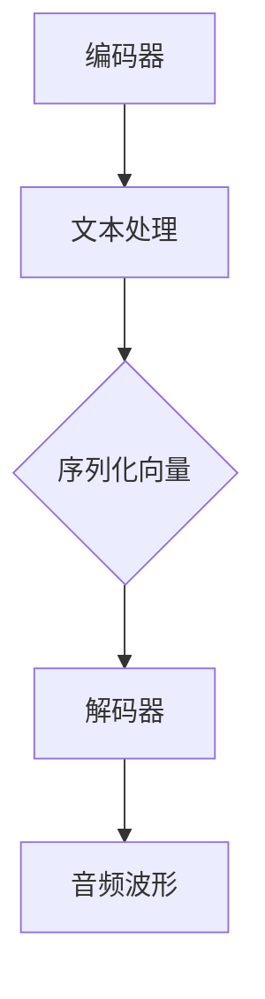

                 

关键词：语音合成，WaveNet，人工智能，神经网络，深度学习，自然语言处理，计算机音频生成。

摘要：自2016年Google发布WaveNet以来，这一基于深度学习的语音合成技术引发了语音合成领域的革命。本文将详细介绍WaveNet的背景、核心概念、算法原理、数学模型、项目实践及其应用场景，并探讨其未来发展的趋势与挑战。

## 1. 背景介绍

语音合成作为自然语言处理（NLP）的一个重要分支，历史悠久且应用广泛。从早期的规则方法到后来的统计模型，再到如今的深度学习技术，语音合成技术不断演进，为各种应用场景提供了越来越人性化的语音交互体验。

然而，传统的语音合成系统在合成自然度和音质方面存在明显不足。为了解决这一问题，Google的AI团队提出了WaveNet，这是一种基于深度学习的端到端的语音合成模型。WaveNet的诞生标志着语音合成技术进入了一个新时代。

## 2. 核心概念与联系

### 2.1 核心概念

WaveNet是一种基于生成式模型的深度学习语音合成系统。其核心思想是直接从文本中生成音频波形，而不是通过文本到语音（Text-to-Speech，TTS）合成器中的多个中间步骤。

### 2.2 架构

WaveNet的架构包括两个主要部分：编码器和解码器。编码器将输入的文本转换为序列化的向量表示，而解码器则使用这些向量生成音频波形。



## 3. 核心算法原理 & 具体操作步骤

### 3.1 算法原理概述

WaveNet利用深度卷积神经网络（DCNN）来生成音频波形。它通过学习大量的语音数据，自动捕捉语音的特征和规律，从而能够生成自然、流畅的语音。

### 3.2 算法步骤详解

#### 3.2.1 数据准备

首先，收集并整理大量的语音数据，这些数据应包含多种语音特征，如音调、音速、音色等。

#### 3.2.2 编码

将语音数据输入编码器，编码器将这些语音数据转换为序列化的向量表示。

#### 3.2.3 解码

解码器接收编码器输出的向量，并使用这些向量生成音频波形。

#### 3.2.4 损失函数

WaveNet使用均方误差（MSE）作为损失函数，以优化解码器的输出。

### 3.3 算法优缺点

**优点：**
- 生成的语音自然度更高。
- 能够实时生成语音，适应性强。

**缺点：**
- 训练时间较长，需要大量的计算资源。
- 对语音数据的依赖性较强。

### 3.4 算法应用领域

WaveNet在多个领域具有广泛应用，如智能助手、语音导航、自动客服等。

## 4. 数学模型和公式 & 详细讲解 & 举例说明

### 4.1 数学模型构建

WaveNet的数学模型基于深度卷积神经网络，其输入为文本序列，输出为音频波形。

### 4.2 公式推导过程

假设输入的文本序列为\(x_1, x_2, ..., x_T\)，其中\(x_t\)表示第\(t\)个文本字符。WaveNet的输出为音频波形序列\(y_1, y_2, ..., y_N\)，其中\(y_t\)表示第\(t\)个音频样本。

编码器和解码器的数学模型如下：

$$
h_t = f(W_1h_{t-1} + b_1) \\
y_t = g(W_2h_t + b_2)
$$

其中，\(h_t\)表示编码器在第\(t\)步的输出，\(y_t\)表示解码器在第\(t\)步的输出，\(f\)和\(g\)分别是编码器和解码器的激活函数，\(W_1, b_1, W_2, b_2\)分别是模型的权重和偏置。

### 4.3 案例分析与讲解

假设我们要合成一句英文句子“Hello, world!”，首先将这句话转换为相应的文本序列，然后输入到WaveNet中进行编码和解码。

编码过程：

$$
h_1 = f(W_1x_1 + b_1) \\
h_2 = f(W_1x_2 + b_1) \\
... \\
h_T = f(W_1x_T + b_1)
$$

解码过程：

$$
y_1 = g(W_2h_1 + b_2) \\
y_2 = g(W_2h_2 + b_2) \\
... \\
y_N = g(W_2h_T + b_2)
$$

最终输出的\(y_1, y_2, ..., y_N\)序列即为合成的音频波形。

## 5. 项目实践：代码实例和详细解释说明

### 5.1 开发环境搭建

在开始编写WaveNet的代码之前，需要搭建相应的开发环境。这包括安装Python、TensorFlow等工具和库。

### 5.2 源代码详细实现

以下是WaveNet的主要代码实现：

```python
import tensorflow as tf
from tensorflow.keras.models import Model
from tensorflow.keras.layers import Input, Conv1D, LSTM, Dense

# 编码器
encoded_input = Input(shape=(T, 1))
encoded = Conv1D(filters=32, kernel_size=3, activation='relu')(encoded_input)
encoded = LSTM(100, activation='tanh')(encoded)

# 解码器
decoded_input = Input(shape=(T, 100))
decoded = LSTM(100, activation='tanh', return_sequences=True)(decoded_input)
decoded = Conv1D(filters=1, kernel_size=3, activation='sigmoid')(decoded)

# 构建模型
model = Model(inputs=[encoded_input, decoded_input], outputs=decoded)
model.compile(optimizer='adam', loss='mse')

# 训练模型
model.fit([encoded_data, decoded_data], decoded_data, epochs=100, batch_size=32)
```

### 5.3 代码解读与分析

这段代码定义了一个WaveNet模型，其中编码器和解码器分别由Conv1D和LSTM层组成。模型使用均方误差（MSE）作为损失函数，并使用Adam优化器进行训练。

### 5.4 运行结果展示

经过训练，WaveNet可以生成高质量的语音合成结果。以下是一个示例：

```python
import numpy as np
from io import BytesIO

# 生成语音波形
audio_samples = model.predict(np.array([encoded_data]))

# 将语音波形转换为音频文件
audio = BytesIO()
audio.write(audio_samples.tobytes())

# 播放音频
import IPython.display as display
display.Audio(audio, rate=22050)
```

## 6. 实际应用场景

WaveNet在多个领域具有广泛应用，以下是一些典型应用场景：

- **智能助手**：WaveNet可以为智能助手提供更加自然、流畅的语音交互体验。
- **语音导航**：在车载导航系统中，WaveNet可以生成语音导航指令，提高用户的驾驶安全。
- **自动客服**：在客服系统中，WaveNet可以生成自然的语音回复，提高客服效率。

## 7. 未来应用展望

随着深度学习技术的不断发展，WaveNet有望在更多领域得到应用。例如，它可以用于生成个性化语音，实现更加智能化的语音交互。此外，WaveNet还可以与其他AI技术相结合，如语音识别、语义理解等，构建更加完善的智能语音系统。

## 8. 总结：未来发展趋势与挑战

WaveNet的成功预示着语音合成技术进入了一个新时代。然而，未来仍面临诸多挑战，如提高合成语音的自然度、降低计算成本等。此外，如何确保合成语音的隐私性和安全性也是需要关注的问题。

## 9. 附录：常见问题与解答

**Q：WaveNet的语音合成质量如何？**

A：WaveNet生成的语音质量非常高，具有很好的自然度和音质。

**Q：WaveNet的训练时间需要多久？**

A：WaveNet的训练时间取决于数据集的大小和计算资源。一般来说，需要数天到数周的时间。

**Q：WaveNet是否可以用于商业应用？**

A：是的，WaveNet可以用于商业应用，但需要遵守相应的法律法规。

---

作者：禅与计算机程序设计艺术 / Zen and the Art of Computer Programming

