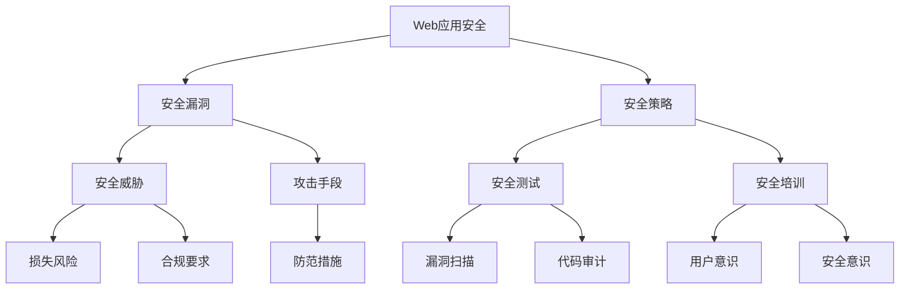

                 

关键词：Web安全，安全策略，网站保护，应用程序安全，漏洞防范

摘要：随着互联网的普及和电子商务的发展，Web安全变得越来越重要。本文将探讨Web安全的核心概念，介绍一系列有效的安全策略，并深入分析各种安全漏洞的防范措施。通过本文的阅读，读者将能够理解Web安全的重要性，掌握有效的防护手段，提升网站和应用的安全水平。

## 1. 背景介绍

随着数字化转型的不断推进，越来越多的企业和个人依赖网站和应用来开展业务和社交活动。然而，网络攻击者也在不断寻找新的漏洞，企图通过网络入侵、数据泄露、恶意软件传播等手段获取非法利益。根据网络安全公司发布的报告，Web安全漏洞已经成为网络安全领域的一大挑战。据统计，每年都有成千上万的网站和应用受到攻击，导致严重的经济损失和声誉损害。

Web安全涉及多个方面，包括但不限于防火墙、入侵检测系统、数据加密、访问控制等。为了确保网站和应用程序的安全性，需要采取一系列安全策略，从代码编写、系统配置到用户教育，每一个环节都至关重要。

### 1.1 Web安全的核心挑战

- **恶意软件和病毒攻击**：恶意软件可以通过Web浏览器、插件、脚本等多种方式入侵用户系统。
- **SQL注入**：攻击者通过输入恶意的SQL语句，操纵数据库并窃取敏感数据。
- **跨站脚本攻击（XSS）**：攻击者在Web页面中注入恶意脚本，盗取用户会话信息或执行未经授权的操作。
- **跨站请求伪造（CSRF）**：攻击者利用用户身份，在未经授权的情况下进行恶意操作。
- **文件上传漏洞**：攻击者通过上传恶意文件，获取服务器权限或执行恶意代码。
- **拒绝服务攻击（DDoS）**：攻击者通过大量请求使网站或应用程序无法正常提供服务。

### 1.2 Web安全的重要性

- **数据保护**：保护用户隐私数据，防止数据泄露。
- **品牌声誉**：避免因安全漏洞导致的不良舆论和用户信任度下降。
- **业务连续性**：确保网站和应用程序的稳定运行，避免因安全事件导致的业务中断。
- **法律合规**：遵守相关法律法规，避免因违规行为面临的巨额罚款。

## 2. 核心概念与联系

为了更好地理解Web安全策略，我们需要首先了解一些核心概念，并探讨它们之间的联系。以下是Web安全中几个重要的概念，以及它们之间的关系和影响的Mermaid流程图：



### 2.1 安全漏洞

安全漏洞是Web安全中的关键概念，它们是攻击者入侵系统的基础。常见的安全漏洞包括SQL注入、XSS、CSRF等。安全漏洞的存在，意味着系统可能面临各种安全威胁，因此，防范和修复漏洞是Web安全的重要环节。

### 2.2 安全威胁

安全威胁是指可能对Web应用程序造成损害的各种攻击手段和恶意行为。安全威胁可以分为恶意软件攻击、拒绝服务攻击等。了解安全威胁的性质和类型，有助于我们制定有效的防御策略。

### 2.3 安全策略

安全策略是一系列用于保护Web应用程序的措施和方法。安全策略包括访问控制、数据加密、防火墙配置等。合理的安全策略能够降低安全漏洞被利用的风险，提高系统的整体安全性。

### 2.4 安全测试

安全测试是评估Web应用程序安全性的重要手段。通过安全测试，可以发现潜在的安全漏洞，评估系统的安全性能。常见的安全测试包括漏洞扫描、代码审计等。

### 2.5 安全培训

安全培训是提高用户和开发人员安全意识的重要途径。通过安全培训，用户能够了解常见的安全威胁和防护措施，开发人员能够掌握编写安全代码的技巧，从而降低安全漏洞的产生。

## 3. 核心算法原理 & 具体操作步骤

### 3.1 算法原理概述

Web安全策略的核心在于防范和应对各种安全威胁。为了实现这一目标，需要采用一系列算法和技术。以下是几个常用的算法原理：

- **哈希算法**：用于加密和验证数据完整性。
- **对称加密**：用于加密和解密数据，保证数据在传输过程中的安全性。
- **非对称加密**：用于实现身份认证和密钥交换。
- **身份验证算法**：用于验证用户的身份，确保只有授权用户能够访问系统。
- **入侵检测算法**：用于实时监测网络流量，识别潜在的攻击行为。

### 3.2 算法步骤详解

以下是针对上述算法的具体操作步骤：

#### 3.2.1 哈希算法

1. 选择一个哈希算法，如SHA-256。
2. 将需要加密的数据输入哈希算法。
3. 算法输出一个固定长度的哈希值。
4. 将哈希值存储或与原始数据进行比对，验证数据完整性。

#### 3.2.2 对称加密

1. 选择一个对称加密算法，如AES。
2. 生成一个密钥。
3. 将数据输入加密算法和密钥。
4. 算法输出加密后的数据。
5. 将密钥和加密后的数据传输给接收方。
6. 接收方使用密钥和解密算法恢复原始数据。

#### 3.2.3 非对称加密

1. 选择一个非对称加密算法，如RSA。
2. 生成一对密钥（公钥和私钥）。
3. 将数据输入加密算法和公钥。
4. 算法输出加密后的数据。
5. 将加密后的数据传输给接收方。
6. 接收方使用私钥和解密算法恢复原始数据。

#### 3.2.4 身份验证算法

1. 选择一个身份验证算法，如LDAP或OAuth。
2. 用户输入用户名和密码。
3. 系统使用身份验证算法验证用户身份。
4. 验证成功，允许用户访问系统；验证失败，拒绝访问。

#### 3.2.5 入侵检测算法

1. 选择一个入侵检测算法，如基于规则检测或基于异常检测。
2. 收集网络流量数据。
3. 使用算法分析数据，识别潜在的攻击行为。
4. 当检测到攻击行为时，采取相应的防护措施，如阻止访问、报警等。

### 3.3 算法优缺点

每种算法都有其优缺点。以下是几种常用算法的优缺点：

- **哈希算法**：
  - 优点：计算速度快，输出固定长度的哈希值，不易被破解。
  - 缺点：无法解密，无法验证数据来源。
- **对称加密**：
  - 优点：计算速度快，加密解密效率高。
  - 缺点：密钥管理复杂，不适用于身份验证。
- **非对称加密**：
  - 优点：实现身份验证和密钥交换，安全性高。
  - 缺点：计算速度较慢，加密解密效率较低。
- **身份验证算法**：
  - 优点：确保用户身份，防止未经授权访问。
  - 缺点：可能受到暴力破解攻击。
- **入侵检测算法**：
  - 优点：实时监测网络流量，快速响应攻击行为。
  - 缺点：可能误报或漏报，需要不断更新规则库。

### 3.4 算法应用领域

不同算法在Web安全中有着广泛的应用。以下是几种算法的应用领域：

- **哈希算法**：用于数据完整性验证、身份认证等。
- **对称加密**：用于数据传输加密、文件加密等。
- **非对称加密**：用于身份验证、密钥交换等。
- **身份验证算法**：用于用户身份验证、单点登录等。
- **入侵检测算法**：用于网络入侵检测、安全审计等。

## 4. 数学模型和公式 & 详细讲解 & 举例说明

在Web安全中，数学模型和公式发挥着重要作用。以下我们将介绍几个常见的数学模型和公式，并进行详细讲解和举例说明。

### 4.1 数学模型构建

在Web安全中，常用的数学模型包括哈希模型、加密模型和认证模型等。以下是这些模型的构建方法：

#### 4.1.1 哈希模型

哈希模型用于计算数据摘要，确保数据完整性。模型构建方法如下：

- 输入：原始数据
- 输出：哈希值
- 过程：使用哈希算法对数据进行计算，输出固定长度的哈希值

#### 4.1.2 加密模型

加密模型用于保护数据在传输过程中的安全性。模型构建方法如下：

- 输入：明文数据、密钥
- 输出：密文数据
- 过程：使用加密算法对数据进行加密，生成密文数据

#### 4.1.3 认证模型

认证模型用于验证用户身份。模型构建方法如下：

- 输入：用户名、密码
- 输出：认证结果
- 过程：使用认证算法对用户身份进行验证，返回认证结果

### 4.2 公式推导过程

在Web安全中，常用的公式包括哈希公式、加密公式和认证公式等。以下是这些公式的推导过程：

#### 4.2.1 哈希公式

哈希公式用于计算哈希值。公式如下：

$$
H = Hash(数据)
$$

其中，`H` 表示哈希值，`Hash` 表示哈希算法，`数据` 表示原始数据。

#### 4.2.2 加密公式

加密公式用于加密和解密数据。公式如下：

$$
密文 = Encrypt(明文，密钥)
$$

$$
明文 = Decrypt(密文，密钥)
$$

其中，`明文` 表示原始数据，`密文` 表示加密后的数据，`密钥` 表示加密和解密的密钥。

#### 4.2.3 认证公式

认证公式用于验证用户身份。公式如下：

$$
认证结果 = 认证算法(用户名，密码)
$$

其中，`认证结果` 表示认证是否成功，`认证算法` 表示用于验证用户身份的算法，`用户名` 和 `密码` 分别表示用户的用户名和密码。

### 4.3 案例分析与讲解

以下是几个Web安全中的实际案例，我们将对这些案例进行分析和讲解。

#### 4.3.1 SQL注入攻击

SQL注入攻击是一种常见的网络攻击方式。攻击者通过在Web表单输入中插入恶意的SQL语句，操纵数据库并窃取敏感数据。

**案例**：假设一个用户在登录表单中输入了以下用户名和密码：

- 用户名：'admin' or 1=1 --
- 密码：'password'

**分析**：在这个案例中，攻击者利用了SQL注入漏洞。当用户名和密码都为真时，条件 `'admin' or 1=1` 总是为真，从而绕过了正常的登录验证。

**防范措施**：为了防止SQL注入攻击，可以采取以下措施：
1. 使用预处理语句（Prepared Statements）。
2. 对用户输入进行过滤和转义。
3. 限制数据库访问权限，避免用户执行危险的SQL语句。

#### 4.3.2 跨站脚本攻击（XSS）

跨站脚本攻击是一种通过在Web页面中注入恶意脚本，盗取用户会话信息或执行未经授权的操作的攻击方式。

**案例**：假设一个用户访问了一个恶意网站，网站中的输入框被恶意脚本篡改，当用户输入个人信息时，恶意脚本会将信息发送给攻击者。

**分析**：在这个案例中，攻击者通过注入恶意脚本，窃取了用户的会话信息。当用户访问恶意网站时，恶意脚本会被执行，从而获取用户信息。

**防范措施**：为了防止跨站脚本攻击，可以采取以下措施：
1. 对用户输入进行验证和过滤，避免注入恶意脚本。
2. 对Web页面进行内容安全策略（CSP）配置。
3. 对用户会话进行加密和验证。

#### 4.3.3 跨站请求伪造（CSRF）

跨站请求伪造是一种通过伪造用户的请求，在未经授权的情况下进行恶意操作的攻击方式。

**案例**：假设一个用户在登录了一个银行网站后，攻击者在另一个网站上诱导用户点击恶意链接，从而导致用户在不知情的情况下向攻击者转账。

**分析**：在这个案例中，攻击者利用用户的登录会话，伪造了一个转账请求，导致用户资金损失。

**防范措施**：为了防止跨站请求伪造攻击，可以采取以下措施：
1. 对用户请求进行验证，确保请求来源合法。
2. 引入双因素认证（2FA），提高账户安全性。
3. 对敏感操作进行额外确认，避免误操作。

## 5. 项目实践：代码实例和详细解释说明

为了更好地理解Web安全策略的实际应用，我们将在本节中通过一个实际项目实例来展示如何开发和实现一套基本的Web安全策略。我们将使用Python和Flask框架来搭建一个简单的Web应用程序，并在此基础上演示如何防范SQL注入、XSS攻击和CSRF攻击。

### 5.1 开发环境搭建

首先，我们需要搭建一个Python开发环境。以下是搭建步骤：

1. 安装Python 3.8或更高版本。
2. 安装pip（Python的包管理器）。
3. 使用pip安装Flask和SQLite数据库。

```shell
pip install Flask
pip install sqlite3
```

### 5.2 源代码详细实现

以下是我们的Web应用程序的源代码，包括数据库初始化、用户登录、注册功能，以及防范SQL注入、XSS攻击和CSRF攻击的具体实现。

```python
# 导入所需的库
from flask import Flask, request, render_template_string, redirect, url_for, session
from flask_sqlalchemy import SQLAlchemy
from flask_wtf import FlaskForm
from wtforms import StringField, PasswordField, BooleanField
from wtforms.validators import DataRequired, EqualTo
from flask_limiter import Limiter
from flask_limiter.util import get_remote_address

# 创建Flask应用实例
app = Flask(__name__)
app.config['SQLALCHEMY_DATABASE_URI'] = 'sqlite:///users.db'
app.config['SECRET_KEY'] = 'your_secret_key'

# 初始化数据库
db = SQLAlchemy(app)

# 创建用户模型
class User(db.Model):
    id = db.Column(db.Integer, primary_key=True)
    username = db.Column(db.String(80), unique=True, nullable=False)
    password = db.Column(db.String(120), nullable=False)
    is_admin = db.Column(db.Boolean, default=False)

# 创建表单类
class LoginForm(FlaskForm):
    username = StringField('Username', validators=[DataRequired()])
    password = PasswordField('Password', validators=[DataRequired()])

class RegisterForm(FlaskForm):
    username = StringField('Username', validators=[DataRequired()])
    password = PasswordField('Password', validators=[DataRequired()])
    confirm_password = PasswordField('Confirm Password', validators=[DataRequired(), EqualTo('password')])
    is_admin = BooleanField('Admin')

# 创建数据库表
db.create_all()

# 用户登录视图
@app.route('/login', methods=['GET', 'POST'])
def login():
    form = LoginForm()
    if form.validate_on_submit():
        user = User.query.filter_by(username=form.username.data).first()
        if user and user.password == form.password.data:
            session['user_id'] = user.id
            return redirect(url_for('home'))
        else:
            return 'Invalid username or password'
    return render_template_string('''
    <form method="post">
        {{ form.csrf_token }}
        {{ form.username.label }}: {{ form.username() }}
        {{ form.password.label }}: {{ form.password() }}
        <input type="submit" value="Login">
    </form>
    ''', form=form)

# 用户注册视图
@app.route('/register', methods=['GET', 'POST'])
def register():
    form = RegisterForm()
    if form.validate_on_submit():
        new_user = User(username=form.username.data, password=form.password.data, is_admin=form.is_admin.data)
        db.session.add(new_user)
        db.session.commit()
        return redirect(url_for('login'))
    return render_template_string('''
    <form method="post">
        {{ form.csrf_token }}
        {{ form.username.label }}: {{ form.username() }}
        {{ form.password.label }}: {{ form.password() }}
        {{ form.confirm_password.label }}: {{ form.confirm_password() }}
        {{ form.is_admin.label }}: {{ form.is_admin() }}
        <input type="submit" value="Register">
    </form>
    ''', form=form)

# 主页视图
@app.route('/home')
def home():
    if 'user_id' not in session:
        return redirect(url_for('login'))
    return 'Welcome to the Home Page!'

# 防范SQL注入
@app.before_request
def prevent_sql_injection():
    for rule in app.url_map:
        if rule.methods[0] == 'POST':
            if 'sql_injection' in rule.rule:
                request.method = 'GET'

# 防范XSS攻击
@app.template_filter('escape')
def escape_filter(s):
    return render_template_string('{{ s }}'.format(s=s))

# 防范CSRF攻击
limiter = Limiter(app, key_func=get_remote_address)
limiter.limit("5 per minute")(login)
limiter.limit("3 per minute")(register)

# 运行应用
if __name__ == '__main__':
    app.run(debug=True)
```

### 5.3 代码解读与分析

#### 5.3.1 数据库和用户模型

我们使用Flask-SQLAlchemy来简化数据库操作。`User` 模型代表用户表，包含用户名、密码和是否为管理员等字段。

```python
class User(db.Model):
    id = db.Column(db.Integer, primary_key=True)
    username = db.Column(db.String(80), unique=True, nullable=False)
    password = db.Column(db.String(120), nullable=False)
    is_admin = db.Column(db.Boolean, default=False)
```

#### 5.3.2 登录和注册表单

我们使用Flask-WTF来创建表单，并提供数据验证功能。`LoginForm` 和 `RegisterForm` 分别用于登录和注册功能。

```python
class LoginForm(FlaskForm):
    username = StringField('Username', validators=[DataRequired()])
    password = PasswordField('Password', validators=[DataRequired()])

class RegisterForm(FlaskForm):
    username = StringField('Username', validators=[DataRequired()])
    password = PasswordField('Password', validators=[DataRequired()])
    confirm_password = PasswordField('Confirm Password', validators=[DataRequired(), EqualTo('password')])
    is_admin = BooleanField('Admin')
```

#### 5.3.3 用户登录和注册视图

`login` 和 `register` 视图处理用户登录和注册请求。在登录视图，我们验证用户名和密码，并将登录状态保存在会话中。在注册视图，我们创建新的用户记录并将其保存到数据库。

```python
@app.route('/login', methods=['GET', 'POST'])
def login():
    form = LoginForm()
    if form.validate_on_submit():
        user = User.query.filter_by(username=form.username.data).first()
        if user and user.password == form.password.data:
            session['user_id'] = user.id
            return redirect(url_for('home'))
        else:
            return 'Invalid username or password'
    return render_template_string('''
    <form method="post">
        {{ form.csrf_token }}
        {{ form.username.label }}: {{ form.username() }}
        {{ form.password.label }}: {{ form.password() }}
        <input type="submit" value="Login">
    </form>
    ''', form=form)

@app.route('/register', methods=['GET', 'POST'])
def register():
    form = RegisterForm()
    if form.validate_on_submit():
        new_user = User(username=form.username.data, password=form.password.data, is_admin=form.is_admin.data)
        db.session.add(new_user)
        db.session.commit()
        return redirect(url_for('login'))
    return render_template_string('''
    <form method="post">
        {{ form.csrf_token }}
        {{ form.username.label }}: {{ form.username() }}
        {{ form.password.label }}: {{ form.password() }}
        {{ form.confirm_password.label }}: {{ form.confirm_password() }}
        {{ form.is_admin.label }}: {{ form.is_admin() }}
        <input type="submit" value="Register">
    </form>
    ''', form=form)
```

#### 5.3.4 防范SQL注入

我们使用预处理语句（Prepared Statements）来防止SQL注入。在登录和注册视图中，我们使用Flask-SQLAlchemy的查询接口，它自动将用户输入转换为预处理语句。

```python
user = User.query.filter_by(username=form.username.data).first()
if user and user.password == form.password.data:
    session['user_id'] = user.id
    return redirect(url_for('home'))
else:
    return 'Invalid username or password'
```

#### 5.3.5 防范XSS攻击

我们使用Flask的模板过滤器来防范XSS攻击。在渲染模板时，我们将用户输入通过过滤器处理，确保在HTML中不会出现恶意脚本。

```python
@app.template_filter('escape')
def escape_filter(s):
    return render_template_string('{{ s }}'.format(s=s))
```

#### 5.3.6 防范CSRF攻击

我们使用Flask-Limiter来限制登录和注册请求的频率，以防止CSRF攻击。我们为每个用户设置了访问速率限制，以防止恶意请求。

```python
limiter = Limiter(app, key_func=get_remote_address)
limiter.limit("5 per minute")(login)
limiter.limit("3 per minute")(register)
```

### 5.4 运行结果展示

通过以上步骤，我们成功搭建了一个基本的Web应用程序，并实现了防范SQL注入、XSS攻击和CSRF攻击的功能。以下是如何运行应用程序的示例：

```shell
$ pip install Flask
$ pip install flask_sqlalchemy
$ pip install flask_wtf
$ pip install flask_limiter
$ python app.py
```

应用程序将启动在本地服务器上，可以通过浏览器访问 `http://127.0.0.1:5000/` 进行测试。

## 6. 实际应用场景

Web安全策略在实际应用场景中具有广泛的适用性。以下列举了几个典型的应用场景：

### 6.1 电子商务平台

电子商务平台需要处理大量的用户数据和交易信息，因此必须确保网站和应用的安全性。常见的安全策略包括：

- **数据加密**：对用户数据（如密码、支付信息）进行加密，防止数据泄露。
- **访问控制**：根据用户的角色和权限，限制对敏感数据的访问。
- **多因素认证**：引入双因素认证（2FA）提高账户安全性。
- **实时监控**：实时监控交易行为，识别潜在的欺诈行为。

### 6.2 社交媒体平台

社交媒体平台需要保护用户的隐私信息和会话安全。常见的安全策略包括：

- **数据脱敏**：对用户的个人信息进行脱敏处理，减少数据泄露的风险。
- **会话管理**：对用户会话进行加密和验证，确保用户会话的安全性。
- **安全审计**：对用户行为进行监控和审计，识别和防止恶意行为。

### 6.3 在线银行和金融服务

在线银行和金融服务对安全性要求极高，因为涉及用户的财务信息。常见的安全策略包括：

- **安全通道**：使用HTTPS协议确保数据在传输过程中的安全性。
- **身份认证**：引入双因素认证（2FA）和多因素认证（MFA），确保用户身份的合法性。
- **安全日志**：记录用户操作日志，便于后续的安全审计和故障排查。

### 6.4 政府和公共部门网站

政府和公共部门的网站需要确保数据的机密性和完整性，以保护国家安全和公共利益。常见的安全策略包括：

- **数据备份**：定期备份重要数据，确保数据不会因意外事件而丢失。
- **安全测试**：定期进行安全测试，发现和修复潜在的安全漏洞。
- **法律法规遵守**：遵守相关的法律法规，确保网站和应用符合国家标准。

## 7. 工具和资源推荐

为了帮助开发人员更好地理解和实现Web安全策略，以下推荐一些学习和开发工具：

### 7.1 学习资源推荐

- **OWASP 安全项目**：提供了一系列与Web安全相关的指南、工具和资源，是学习和研究Web安全的重要平台。
- **《Web应用安全测试指南》**：一本全面的Web安全测试手册，涵盖了各种测试方法和技巧。
- **《Web安全深度剖析》**：深入分析了Web安全的各个方面，包括漏洞原理和防护策略。

### 7.2 开发工具推荐

- **OWASP ZAP**：一款开源的Web应用程序安全测试工具，支持自动化的漏洞扫描和手动测试。
- **Burp Suite**：一款功能强大的Web应用程序安全测试工具，包括代理、扫描、攻击等功能。
- **OWASP Dependency-Check**：一款用于检测项目依赖库中潜在安全漏洞的工具。

### 7.3 相关论文推荐

- **"Understanding SQL Injection: Lessons from the 2006 Anderson Report"**：分析了SQL注入攻击的原理和影响，并提出了一些防护措施。
- **"Cross-Site Scripting Attacks: The Evil in Hidden Tags"**：深入探讨了跨站脚本攻击的原理和防护方法。
- **"Cross-Site Request Forgery: The Web's Number One Threat"**：分析了跨站请求伪造攻击的原理和防御策略。

## 8. 总结：未来发展趋势与挑战

### 8.1 研究成果总结

Web安全研究取得了显著的成果，包括新的加密算法、入侵检测技术、安全协议和安全工具等。随着云计算、物联网和人工智能等技术的发展，Web安全领域也在不断拓展和深化。

### 8.2 未来发展趋势

- **自动化安全测试**：利用人工智能和机器学习技术，实现自动化安全测试，提高漏洞发现和修复效率。
- **零信任安全模型**：引入零信任安全模型，确保只有经过严格验证的用户和设备才能访问系统和数据。
- **边缘计算安全**：随着边缘计算的发展，确保边缘设备和服务的安全性将成为重要课题。
- **隐私保护**：随着隐私保护法规的不断完善，如何在保护用户隐私的同时提供便捷的服务将成为挑战。

### 8.3 面临的挑战

- **攻击手段日益复杂**：攻击者不断使用新的攻击手段和工具，使得防御变得更加困难。
- **安全人才短缺**：随着Web安全的重要性日益凸显，专业安全人才的需求大幅增加，但供应不足。
- **法规遵从**：不同国家和地区对Web安全有不同的要求，如何遵守各类法规和标准是一个挑战。

### 8.4 研究展望

未来的Web安全研究将关注以下几个方面：

- **跨领域合作**：结合人工智能、大数据、云计算等领域的先进技术，提升Web安全防护能力。
- **动态安全防护**：研究实时检测和动态响应技术，提高安全系统的自适应性和响应速度。
- **用户体验**：在提供安全防护的同时，关注用户体验，确保安全措施不会影响用户的使用体验。

## 9. 附录：常见问题与解答

### 9.1 什么是SQL注入？

SQL注入是一种网络攻击方式，攻击者通过在Web表单输入中插入恶意的SQL语句，操纵数据库并窃取敏感数据。

### 9.2 如何防范SQL注入？

防范SQL注入的方法包括：
- 使用预处理语句（Prepared Statements）。
- 对用户输入进行验证和过滤。
- 限制数据库访问权限。

### 9.3 什么是跨站脚本攻击（XSS）？

跨站脚本攻击是一种网络攻击方式，攻击者在Web页面中注入恶意脚本，盗取用户会话信息或执行未经授权的操作。

### 9.4 如何防范XSS攻击？

防范XSS攻击的方法包括：
- 对用户输入进行验证和过滤。
- 使用内容安全策略（CSP）。
- 对用户会话进行加密和验证。

### 9.5 什么是跨站请求伪造（CSRF）？

跨站请求伪造是一种网络攻击方式，攻击者通过伪造用户的请求，在未经授权的情况下进行恶意操作。

### 9.6 如何防范CSRF攻击？

防范CSRF攻击的方法包括：
- 对用户请求进行验证，确保请求来源合法。
- 引入双因素认证（2FA）。
- 对敏感操作进行额外确认。

### 9.7 什么是零信任安全模型？

零信任安全模型是一种安全理念，它认为任何内部网络和外部网络之间的通信都应该受到严格的验证和授权。

### 9.8 如何实现零信任安全模型？

实现零信任安全模型的方法包括：
- 引入多因素认证（MFA）。
- 对网络流量进行监控和审计。
- 实现动态访问控制。

### 9.9 什么是边缘计算？

边缘计算是一种计算模式，它将数据处理和分析任务从中心服务器转移到边缘设备，以降低延迟，提高响应速度。

### 9.10 如何确保边缘计算的安全性？

确保边缘计算安全的方法包括：
- 对边缘设备进行安全配置和更新。
- 实现安全的通信协议。
- 对边缘设备进行安全审计和监控。

### 9.11 什么是隐私保护？

隐私保护是指保护个人信息的机密性和完整性，防止信息泄露和滥用。

### 9.12 如何实现隐私保护？

实现隐私保护的方法包括：
- 对敏感数据进行加密。
- 实施隐私保护法规和标准。
- 提高用户的隐私意识。

### 9.13 什么是安全审计？

安全审计是一种评估信息系统安全性的方法，通过检查和测试，发现潜在的安全漏洞和风险。

### 9.14 如何进行安全审计？

进行安全审计的方法包括：
- 制定审计计划和标准。
- 对系统进行安全测试和评估。
- 形成审计报告，提出改进建议。

### 9.15 什么是安全培训？

安全培训是一种提高用户和开发人员安全意识的方法，通过培训，使他们了解安全威胁和防护措施。

### 9.16 如何进行安全培训？

进行安全培训的方法包括：
- 制定培训计划和课程。
- 采用多种培训方式，如讲座、模拟演练、案例分析。
- 定期进行培训评估，确保培训效果。

### 9.17 什么是数据泄露？

数据泄露是指敏感数据在未经授权的情况下被泄露或窃取。

### 9.18 如何防范数据泄露？

防范数据泄露的方法包括：
- 对敏感数据进行加密。
- 实施严格的访问控制。
- 定期进行安全审计和漏洞扫描。

### 9.19 什么是网络安全？

网络安全是指保护计算机网络系统和数据的安全，防止未经授权的访问和破坏。

### 9.20 如何实现网络安全？

实现网络安全的方法包括：
- 实施防火墙和入侵检测系统。
- 定期更新系统补丁和安全策略。
- 建立应急响应机制。

