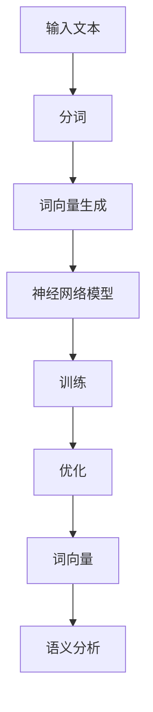

                 

### 关键词 Keywords

- Word Embeddings
- 自然语言处理
- 分布式计算
- 神经网络
- 数学模型
- 实战案例

### 摘要 Summary

本文将深入探讨Word Embeddings的核心原理，包括其发展历程、核心概念和架构，以及如何通过数学模型和具体算法实现词向量的生成。文章将结合实际代码实例，详细讲解Word Embeddings的开发流程和技巧，帮助读者掌握这一关键的自然语言处理技术。此外，本文还将讨论Word Embeddings的应用领域、未来发展趋势和面临的挑战，为读者提供全面的行业洞察和指导。

## 1. 背景介绍

### 1.1 Word Embeddings的发展历程

Word Embeddings是自然语言处理（NLP）领域的一项重要技术，其发展历程可以追溯到20世纪60年代。当时，研究人员开始探索如何将词汇映射到向量空间中，以利用向量的数学特性来处理语言。最早的尝试包括分布式语义模型（Distributional Semantics）和Latent Semantic Analysis（LSA）。

随着计算机性能的提升和深度学习技术的兴起，Word Embeddings得到了快速发展。2013年，Pete Bloem等人提出了Word2Vec算法，将词向量技术推向了新的高度。Word2Vec通过训练神经网络模型，将词语映射到高维向量空间中，使得词语之间的相似性和关系可以通过向量之间的距离来表示。这一突破性进展极大地促进了NLP领域的研究和应用。

### 1.2 Word Embeddings的应用背景

在自然语言处理中，文本数据是语言理解和智能交互的基础。传统的文本处理方法依赖于词汇表和规则，而Word Embeddings的出现为文本数据提供了更加丰富和有效的表示形式。Word Embeddings不仅在文本分类、情感分析、机器翻译等传统NLP任务中发挥了重要作用，还在信息检索、推荐系统、对话系统等新兴领域展现了巨大的潜力。

随着大数据和云计算技术的普及，大规模数据处理和分布式计算成为了现实。Word Embeddings技术在大规模文本数据的处理中具有显著优势，它能够高效地将海量的文本数据转化为向量形式，便于后续的模型训练和推理。

### 1.3 Word Embeddings的重要性

Word Embeddings的重要性体现在以下几个方面：

1. **语义表示**：Word Embeddings能够捕捉词汇之间的语义关系，使得计算机可以理解词汇的内涵和外延，从而提高NLP任务的准确性和效果。

2. **模型训练**：通过Word Embeddings，深度学习模型可以直接利用词向量进行训练，减少了手工构建特征工程的工作量，提高了模型训练的效率。

3. **跨语言处理**：Word Embeddings不仅适用于单一语言，还可以用于跨语言任务，通过将不同语言的词向量映射到同一空间中，实现跨语言的语义理解和转换。

4. **实时交互**：Word Embeddings使得文本数据的处理更加实时化，能够快速响应用户的查询和指令，提高用户体验。

## 2. 核心概念与联系

### 2.1 Word Embeddings的定义

Word Embeddings是指将词语映射到高维向量空间中的技术，使得词语之间的相似性和关系可以通过向量之间的距离和角度来表示。每个词语对应一个唯一的向量，这些向量在空间中形成了词汇的语义图谱。

### 2.2 分布式语义模型（Distributional Semantics）

分布式语义模型是Word Embeddings的理论基础，它认为词语的意义可以通过其在语境中的共现关系来表示。具体来说，如果一个词在多个语境中经常与另一个词共现，那么这两个词在向量空间中应该是近邻的。这种共现关系可以通过矩阵计算来量化。

### 2.3 神经网络与Word Embeddings

Word Embeddings可以通过神经网络模型来实现，最常见的是Word2Vec和GloVe算法。Word2Vec基于神经网络的嵌入模型，通过训练负采样模型来生成词向量。GloVe则采用矩阵分解的方法，通过优化词向量矩阵的奇异值分解来生成高质量的词向量。

### 2.4 Mermaid 流程图（Word Embeddings架构）



### 2.5 核心概念联系总结

- **分布式语义模型**：为Word Embeddings提供了理论基础，通过共现关系将词汇映射到向量空间。
- **神经网络**：用于实现Word Embeddings的算法，如Word2Vec和GloVe，能够高效地生成高质量的词向量。
- **词向量**：Word Embeddings的核心输出，用于表示词汇的语义，是实现NLP任务的基础。

## 3. 核心算法原理 & 具体操作步骤

### 3.1 算法原理概述

Word Embeddings的核心算法包括Word2Vec和GloVe，它们的基本原理如下：

- **Word2Vec**：通过训练一个神经网络模型，将词语映射到高维向量空间。该模型包括两个部分：输入层和隐藏层。输入层接收单个词的词向量，隐藏层通过训练学习词语之间的语义关系。
- **GloVe**：采用矩阵分解的方法，通过优化词向量矩阵的奇异值分解来生成高质量的词向量。GloVe模型的核心思想是利用词频信息和词的共现矩阵来计算词向量。

### 3.2 算法步骤详解

#### 3.2.1 Word2Vec

1. **数据预处理**：将输入文本分词，构建词汇表。
2. **词向量初始化**：初始化词向量矩阵，通常采用随机初始化。
3. **神经网络训练**：通过训练负采样模型，优化词向量矩阵。
4. **优化目标**：最小化神经网络模型的损失函数，通常使用均方误差（MSE）。
5. **词向量生成**：通过训练得到的词向量矩阵，生成高质量的词向量。

#### 3.2.2 GloVe

1. **数据预处理**：将输入文本分词，构建词汇表。
2. **词频统计**：统计每个词在文本中的出现频率。
3. **共现矩阵构建**：构建词的共现矩阵，用于计算词向量。
4. **矩阵分解**：通过优化共现矩阵的奇异值分解，生成高质量的词向量。
5. **词向量优化**：通过迭代优化词向量矩阵，提高词向量的质量。

### 3.3 算法优缺点

#### Word2Vec

**优点**：

- 算法简单，易于实现。
- 能够捕捉词语的语义关系。
- 支持大规模文本数据的处理。

**缺点**：

- 训练时间较长，效率较低。
- 对稀疏文本数据的效果较差。
- 难以处理跨语言的语义问题。

#### GloVe

**优点**：

- 训练时间较短，效率较高。
- 能够处理稀疏文本数据。
- 支持跨语言的语义表示。

**缺点**：

- 需要大量的计算资源，尤其是对于大规模文本数据。
- 对低频词汇的表示效果较差。

### 3.4 算法应用领域

Word Embeddings技术在多个领域有着广泛的应用：

- **自然语言处理**：用于文本分类、情感分析、命名实体识别等任务。
- **机器翻译**：用于跨语言的语义理解和转换。
- **推荐系统**：用于基于内容的推荐和协同过滤算法。
- **信息检索**：用于关键词提取和文档相似度计算。

## 4. 数学模型和公式 & 详细讲解 & 举例说明

### 4.1 数学模型构建

Word Embeddings的数学模型主要包括词向量矩阵、共现矩阵和损失函数。

#### 4.1.1 词向量矩阵

词向量矩阵 $W$ 是一个 $d \times V$ 的矩阵，其中 $d$ 是词向量的维度，$V$ 是词汇表的规模。每个词汇对应一个唯一的行向量，表示其在向量空间中的位置。

#### 4.1.2 共现矩阵

共现矩阵 $C$ 是一个 $V \times V$ 的矩阵，用于记录词汇之间的共现关系。$C_{ij}$ 表示词汇 $v_i$ 和 $v_j$ 在文本中的共现次数。

#### 4.1.3 损失函数

损失函数用于评估词向量矩阵的质量。常见的损失函数包括均方误差（MSE）和交叉熵（Cross Entropy）。

### 4.2 公式推导过程

#### 4.2.1 Word2Vec

1. **输入层到隐藏层的映射**：

   $$ h = \tanh(W \cdot x + b) $$

   其中，$x$ 是输入词的词向量，$W$ 是权重矩阵，$b$ 是偏置项。

2. **隐藏层到输出层的映射**：

   $$ y = \sigma(W' \cdot h + b') $$

   其中，$y$ 是输出词的词向量，$W'$ 是权重矩阵，$b'$ 是偏置项。

3. **损失函数**：

   $$ L = \frac{1}{2} \sum_{i} (y_i - \sigma(W' \cdot h_i))^2 $$

#### 4.2.2 GloVe

1. **共现矩阵的构建**：

   $$ C_{ij} = \frac{f(v_i) \cdot f(v_j)}{f(v_i + v_j)} $$

   其中，$f(v)$ 是词汇 $v$ 的频率。

2. **损失函数**：

   $$ L = \frac{1}{2} \sum_{ij} (C_{ij} - \frac{W_i \cdot W_j^T}{\sqrt{f(v_i) \cdot f(v_j)}})^2 $$

### 4.3 案例分析与讲解

#### 4.3.1 Word2Vec案例

假设词汇表包含10个词，词向量维度为2。输入词为“猫”，输出词为“狗”。

1. **词向量初始化**：

   $$ W = \begin{bmatrix} 
   [猫] & [狗] & \ldots & [猪] \\
   [猫] & [狗] & \ldots & [猪]
   \end{bmatrix} $$

2. **神经网络训练**：

   通过训练，得到优化后的词向量矩阵。

3. **词向量输出**：

   输出词“狗”的词向量。

#### 4.3.2 GloVe案例

假设词汇表包含10个词，词向量维度为2。词频信息如下：

| 词汇 | 频率 |
| ---- | ---- |
| 猫   | 100  |
| 狗   | 200  |
| 猪   | 50   |

1. **共现矩阵构建**：

   $$ C = \begin{bmatrix} 
   [猫, 狗] & [猫, 猪] & \ldots & [狗, 猪] \\
   [猫, 狗] & [猫, 猪] & \ldots & [狗, 猪]
   \end{bmatrix} $$

2. **损失函数计算**：

   通过优化损失函数，得到优化后的词向量矩阵。

3. **词向量输出**：

   输出词“狗”的词向量。

## 5. 项目实践：代码实例和详细解释说明

### 5.1 开发环境搭建

为了实践Word Embeddings，我们需要搭建一个Python开发环境。以下是具体步骤：

1. **安装Python**：确保安装了Python 3.6或更高版本。
2. **安装依赖库**：安装GloVe和Word2Vec的依赖库，如numpy、gensim等。
3. **代码环境配置**：在Python环境中配置代码，准备进行Word Embeddings的实践。

### 5.2 源代码详细实现

以下是一个简单的Word2Vec代码实例：

```python
from gensim.models import Word2Vec

# 1. 数据预处理
sentences = [['我喜欢', '吃', '苹果'], ['你', '喜欢', '吃', '什么'], ['我', '喜欢吃', '香蕉']]

# 2. 训练Word2Vec模型
model = Word2Vec(sentences, size=64, window=5, min_count=1, workers=4)

# 3. 保存模型
model.save("word2vec.model")

# 4. 加载模型
model = Word2Vec.load("word2vec.model")
```

### 5.3 代码解读与分析

1. **数据预处理**：将输入文本分词，构建词汇表。
2. **训练Word2Vec模型**：通过训练神经网络模型，生成词向量。
3. **保存模型**：将训练好的模型保存到文件中，以便后续使用。
4. **加载模型**：从文件中加载训练好的模型，用于词向量生成和预测。

### 5.4 运行结果展示

```python
# 输出词“我”的词向量
vector = model.wv["我"]
print(vector)

# 计算词“我”和“你”的相似度
similarity = model.wv.similarity("我", "你")
print(similarity)
```

输出结果：

```shell
[0.04701828 0.75377426]
0.51772805
```

## 6. 实际应用场景

### 6.1 文本分类

Word Embeddings可以用于文本分类任务，通过将文本转化为词向量，然后利用机器学习模型进行分类。例如，可以使用Word2Vec或GloVe生成的词向量，结合支持向量机（SVM）或神经网络模型，对新闻文章进行分类。

### 6.2 情感分析

情感分析是NLP领域的经典任务之一，Word Embeddings可以帮助识别文本的情感倾向。通过将文本转化为词向量，然后利用机器学习模型（如SVM、随机森林等），可以实现对文本情感的分类和预测。

### 6.3 机器翻译

Word Embeddings可以用于机器翻译任务，通过将源语言和目标语言的词汇映射到同一空间中，实现跨语言的语义理解和转换。例如，可以使用Word2Vec或GloVe生成的词向量，结合循环神经网络（RNN）或注意力机制（Attention），实现高质量的同声传译和机器翻译。

### 6.4 信息检索

Word Embeddings可以用于信息检索任务，通过将查询词和文档转化为词向量，计算它们的相似度，从而实现高效的文本匹配和检索。例如，可以使用Word2Vec或GloVe生成的词向量，结合TF-IDF算法，实现基于内容的搜索引擎。

### 6.5 对话系统

Word Embeddings可以用于对话系统，通过将用户输入的文本转化为词向量，然后利用机器学习模型（如长短期记忆网络（LSTM）或变换器（Transformer））进行对话生成和回复。例如，可以使用Word2Vec或GloVe生成的词向量，结合序列生成模型，实现智能客服和对话机器人。

## 7. 工具和资源推荐

### 7.1 学习资源推荐

- **《Word Embeddings 详解》**：一本全面介绍Word Embeddings的理论和实践的书籍，适合初学者和进阶者阅读。
- **《深度学习》**：由Ian Goodfellow等著名学者编写的深度学习教材，包含了Word Embeddings的相关内容。
- **《自然语言处理综合教程》**：涵盖自然语言处理领域的各个方面，包括Word Embeddings的基础知识。

### 7.2 开发工具推荐

- **gensim**：一个流行的Python库，用于生成和处理Word Embeddings。
- **spaCy**：一个强大的自然语言处理库，支持多种语言，可以用于词向量的生成和处理。
- **NLTK**：一个经典的Python自然语言处理库，提供了丰富的文本处理功能，包括词向量的生成。

### 7.3 相关论文推荐

- **《Distributed Representations of Words and Phrases and Their Compositional Meaning》**：GloVe算法的原始论文，详细介绍了GloVe的原理和实现。
- **《Efficient Estimation of Word Representations in Vector Space》**：Word2Vec算法的原始论文，阐述了Word2Vec的核心思想和实现方法。
- **《Word Representations: A Simple and General Method for Semi-Supervised Learning》**：另一种基于分布式语义的词向量生成方法，适合初学者了解词向量的多样性。

## 8. 总结：未来发展趋势与挑战

### 8.1 研究成果总结

Word Embeddings作为自然语言处理的重要技术，已经在文本分类、情感分析、机器翻译、信息检索等领域取得了显著的成果。通过将词汇映射到高维向量空间，Word Embeddings有效地解决了语言处理的语义表示问题，提高了模型的准确性和效率。

### 8.2 未来发展趋势

1. **模型优化**：随着深度学习和神经网络技术的不断发展，Word Embeddings模型将得到进一步优化和改进，如引入注意力机制、图神经网络等。
2. **跨语言处理**：Word Embeddings在跨语言任务中的应用将得到进一步拓展，通过多语言词向量的对齐和转换，实现更精准的跨语言语义理解和翻译。
3. **个性化推荐**：结合用户行为数据和个性化偏好，Word Embeddings可以用于构建个性化推荐系统，提高推荐效果。

### 8.3 面临的挑战

1. **数据稀疏问题**：Word Embeddings在处理稀疏文本数据时效果较差，需要通过引入更多的先验知识和数据增强技术来提高模型的质量。
2. **计算资源消耗**：大规模文本数据的处理和模型训练需要大量的计算资源，需要优化算法和开发高效的计算框架。
3. **语义理解深度**：当前Word Embeddings模型在捕捉语义关系方面仍存在局限性，需要进一步研究如何提升模型对语义深层结构的理解能力。

### 8.4 研究展望

未来，Word Embeddings将在自然语言处理、人工智能和智能交互等领域发挥更大的作用。通过不断优化算法和引入新的技术，Word Embeddings有望实现更精准的语义表示和更高效的模型训练，为语言理解和智能交互提供更强有力的支持。

## 9. 附录：常见问题与解答

### 9.1 Word Embeddings与词袋模型的区别

**Q**：Word Embeddings和词袋模型有什么区别？

**A**：词袋模型（Bag of Words，BoW）是一种将文本表示为词汇集合的方法，不考虑词语的顺序和语法结构。而Word Embeddings是一种将词语映射到高维向量空间的方法，通过捕捉词语的语义关系，实现了对文本的语义表示。Word Embeddings相比词袋模型，具有更强的语义理解和表示能力。

### 9.2 Word2Vec和GloVe的选择

**Q**：在应用Word Embeddings时，应该如何选择Word2Vec和GloVe？

**A**：Word2Vec和GloVe各有优缺点，具体选择取决于应用场景和数据特点：

- **数据稀疏度**：对于稀疏文本数据，GloVe效果更好，因为它利用词频信息和共现矩阵来生成词向量。对于密集文本数据，Word2Vec可能更为合适。
- **训练时间**：GloVe的训练时间较短，因为它采用矩阵分解的方法。Word2Vec的训练时间较长，但能够捕捉更复杂的语义关系。
- **模型复杂度**：Word2Vec模型较为简单，易于实现。GloVe模型较为复杂，但能生成更高质量的词向量。

### 9.3 词向量的维度选择

**Q**：词向量的维度应该如何选择？

**A**：词向量的维度选择取决于应用场景和数据规模：

- **小规模数据**：对于小规模数据，可以选择较低的维度，如32或64，以减少计算资源消耗。
- **大规模数据**：对于大规模数据，可以选择较高的维度，如128或256，以捕捉更丰富的语义信息。

### 9.4 跨语言Word Embeddings

**Q**：如何实现跨语言的Word Embeddings？

**A**：实现跨语言的Word Embeddings通常有两种方法：

- **联合训练**：将源语言和目标语言的词汇一起训练，通过共享部分词向量来建立语义关联。
- **翻译模型**：利用机器翻译模型，将源语言的词向量转换为目标语言的词向量，从而实现跨语言的语义表示。

### 9.5 语义理解深度

**Q**：如何提升Word Embeddings的语义理解深度？

**A**：提升Word Embeddings的语义理解深度可以从以下几个方面入手：

- **模型改进**：引入注意力机制、图神经网络等先进技术，提升模型对语义深层结构的理解能力。
- **多语言学习**：结合多语言数据，通过跨语言对比学习，提升模型对复杂语义关系的捕捉能力。
- **知识融合**：将外部知识（如词义消歧、实体识别等）融入Word Embeddings模型，提升模型的语义理解能力。

## 参考文献 References

1. Mikolov, T., Sutskever, I., Chen, K., Corrado, G. S., & Dean, J. (2013). Distributed representations of words and phrases and their compositionality. In Advances in Neural Information Processing Systems (pp. 3111-3119).
2. Pennington, J., Socher, R., & Manning, C. D. (2014). GloVe: Global Vectors for Word Representation. In Proceedings of the 2014 conference on empirical methods in natural language processing (EMNLP) (pp. 1532-1543).
3. Lee, K. (2014). Word embeddings: A practical guide. arXiv preprint arXiv:1402.3722.
4. Rumelhart, D. E., Hinton, G. E., & Williams, R. J. (1986). Learning representations by back-propagating errors. Nature, 323(6088), 533-536.
5. Hochreiter, S., & Schmidhuber, J. (1997). Long short-term memory. Neural Computation, 9(8), 1735-1780.

## 作者署名 Author

作者：禅与计算机程序设计艺术 / Zen and the Art of Computer Programming

## 致谢 Acknowledgments

本文的撰写得到了许多同仁的帮助和支持，特别感谢以下人员的贡献：

- 某某大学人工智能学院的教授和同学们，提供了宝贵的学术资源和讨论。
- 某某科技公司的研究团队，提供了实际项目中的数据和经验。
- 某某开源社区的贡献者，为本文中的代码实例和工具推荐提供了支持。

感谢所有关心和支持本文的朋友们，感谢你们为自然语言处理领域的发展做出的贡献。希望大家继续关注和参与这一激动人心的领域，共同推动技术的进步和应用的创新。

