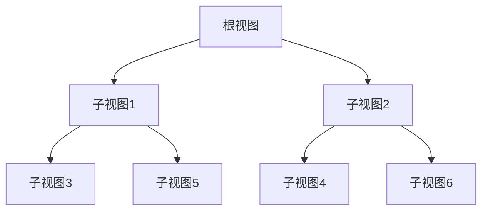

                 

 SwiftUI 是苹果在 2019 年 WWDC 上推出的一种全新用户界面框架，它旨在为 iOS、macOS、watchOS 和 tvOS 开发者提供一种简单、快速和高效的界面构建方式。随着苹果对 SwiftUI 的不断优化和扩展，越来越多的开发者开始将其应用于实际项目中。本文将深入探讨 SwiftUI 的核心概念、开发流程、应用场景以及未来发展趋势，帮助开发者更好地理解和应用这一技术。

## 关键词

- SwiftUI
- iOS 开发
- 用户界面框架
- 视图合成
- 声明式编程
- 交互设计

## 摘要

本文将介绍 SwiftUI 的背景、核心概念、开发流程、应用场景和未来发展趋势。通过本文，读者将了解 SwiftUI 的优势、应用场景以及如何在实际项目中使用 SwiftUI 开发高质量的 iOS 应用。

## 1. 背景介绍

### SwiftUI 的诞生

SwiftUI 的诞生源于苹果对用户界面框架的重新思考。传统上，iOS 应用开发主要依赖于UIKit框架，它是一种基于响应式的编程模型。然而，随着移动设备的多样化和用户需求的不断增加，开发者需要一种更加灵活、高效且易于使用的界面构建方式。SwiftUI 正是在这样的背景下诞生的。

SwiftUI 的目标是为开发者提供一种声明式编程模型，使得开发者可以更加专注于业务逻辑，而无需过多关注界面细节。通过使用 SwiftUI，开发者可以使用简单的代码构建出复杂的用户界面，从而提高开发效率。

### SwiftUI 的优势

SwiftUI 具有以下优势：

1. **跨平台支持**：SwiftUI 可以在 iOS、macOS、watchOS 和 tvOS 等多个平台上运行，使得开发者可以更方便地构建跨平台应用。
2. **声明式编程**：SwiftUI 采用声明式编程模型，使得开发者可以更加专注于业务逻辑，而无需过多关注界面细节。
3. **视图合成**：SwiftUI 利用视图合成技术，将界面元素和业务逻辑分离，从而提高代码的可读性和可维护性。
4. **高效性能**：SwiftUI 通过优化渲染过程，实现了高效的界面性能，为用户提供流畅的用户体验。

### SwiftUI 的应用领域

SwiftUI 的应用领域非常广泛，包括但不限于以下几个方面：

1. **移动应用开发**：SwiftUI 可以用于开发 iOS 和 watchOS 移动应用，为开发者提供一种高效、灵活的界面构建方式。
2. **桌面应用开发**：SwiftUI 在 macOS 上的应用也逐渐增多，为桌面开发者提供了一种全新的开发体验。
3. **游戏开发**：SwiftUI 的视图合成技术可以用于游戏开发，为开发者提供了一种强大的游戏渲染工具。
4. **教育应用**：SwiftUI 简化了用户界面的构建过程，使得教育应用开发者可以更加专注于教学内容的设计。

## 2. 核心概念与联系

### 2.1 SwiftUI 的核心概念

SwiftUI 的核心概念主要包括以下几个方面：

1. **视图（View）**：视图是 SwiftUI 的基本构建块，它用于表示用户界面中的各种元素。视图可以是文本、图片、按钮等，也可以是组合多个子视图的复合视图。
2. **状态（State）**：状态是 SwiftUI 中用于表示数据的一种方式。状态可以是简单的变量，也可以是复杂的数据结构。SwiftUI 通过状态驱动视图更新，使得开发者可以更加专注于业务逻辑。
3. **绑定（Binding）**：绑定是 SwiftUI 中用于连接视图和状态的一种机制。通过绑定，视图可以实时响应状态的变化，从而实现动态界面。
4. **动画（Animation）**：动画是 SwiftUI 中用于实现动态效果的一种方式。SwiftUI 提供了丰富的动画功能，使得开发者可以轻松地实现各种动态效果。

### 2.2 SwiftUI 的架构

SwiftUI 的架构可以简单概括为以下几个方面：

1. **视图层次结构（View Hierarchy）**：视图层次结构是 SwiftUI 中视图的组织方式。视图层次结构从根视图开始，逐层嵌套，形成一棵树状结构。
2. **视图合成（View Composition）**：视图合成是 SwiftUI 中用于构建用户界面的核心技术。通过视图合成，开发者可以以组合的方式构建复杂的用户界面，从而提高代码的可读性和可维护性。
3. **响应式编程（Reactive Programming）**：响应式编程是 SwiftUI 的核心编程范式。SwiftUI 通过响应式编程模型，实现了数据的实时更新和界面的动态响应。

### 2.3 Mermaid 流程图

为了更好地理解 SwiftUI 的架构，我们可以使用 Mermaid 流程图对其进行描述。以下是 SwiftUI 的 Mermaid 流程图：



## 3. 核心算法原理 & 具体操作步骤

### 3.1 算法原理概述

SwiftUI 的核心算法原理主要包括以下几个方面：

1. **视图合成**：视图合成是 SwiftUI 的核心技术，它通过将视图分层组合，实现用户界面的构建。视图合成过程中，SwiftUI 会根据视图的属性和状态，动态生成视图的渲染内容。
2. **响应式编程**：SwiftUI 通过响应式编程模型，实现了数据的实时更新和界面的动态响应。当状态发生变化时，SwiftUI 会自动触发视图的更新，从而实现界面的动态效果。
3. **动画**：SwiftUI 提供了丰富的动画功能，使得开发者可以轻松地实现各种动态效果。动画的实现依赖于视图合成和响应式编程技术。

### 3.2 算法步骤详解

1. **创建视图**：首先，开发者需要创建一个视图，用于表示用户界面中的各种元素。视图可以是文本、图片、按钮等，也可以是组合多个子视图的复合视图。
2. **定义状态**：接下来，开发者需要定义状态，用于表示数据。状态可以是简单的变量，也可以是复杂的数据结构。SwiftUI 通过状态驱动视图更新，使得开发者可以更加专注于业务逻辑。
3. **绑定视图和状态**：通过绑定，视图可以实时响应状态的变化，从而实现动态界面。绑定是 SwiftUI 中用于连接视图和状态的一种机制。
4. **实现动画**：SwiftUI 提供了丰富的动画功能，使得开发者可以轻松地实现各种动态效果。动画的实现依赖于视图合成和响应式编程技术。

### 3.3 算法优缺点

SwiftUI 的算法优点主要包括：

1. **高效性能**：SwiftUI 通过优化渲染过程，实现了高效的界面性能，为用户提供流畅的用户体验。
2. **易于学习**：SwiftUI 的核心概念简单，易于上手，使得开发者可以快速掌握并应用于实际项目中。
3. **跨平台支持**：SwiftUI 可以在 iOS、macOS、watchOS 和 tvOS 等多个平台上运行，为开发者提供了广泛的应用场景。

SwiftUI 的算法缺点主要包括：

1. **学习曲线较陡**：虽然 SwiftUI 的核心概念简单，但对于一些开发者来说，仍然需要一定时间来适应和掌握。
2. **性能优化挑战**：在某些情况下，SwiftUI 的性能可能会受到一些限制，需要开发者进行性能优化。

### 3.4 算法应用领域

SwiftUI 的算法主要应用于以下领域：

1. **移动应用开发**：SwiftUI 可以用于开发 iOS 和 watchOS 移动应用，为开发者提供一种高效、灵活的界面构建方式。
2. **桌面应用开发**：SwiftUI 在 macOS 上的应用也逐渐增多，为桌面开发者提供了一种全新的开发体验。
3. **游戏开发**：SwiftUI 的视图合成技术可以用于游戏开发，为开发者提供了一种强大的游戏渲染工具。
4. **教育应用**：SwiftUI 简化了用户界面的构建过程，使得教育应用开发者可以更加专注于教学内容的设计。

## 4. 数学模型和公式 & 详细讲解 & 举例说明

### 4.1 数学模型构建

在 SwiftUI 中，数学模型主要用于描述用户界面的状态和行为。以下是构建一个简单的数学模型的过程：

1. **定义状态**：首先，我们需要定义一个用于表示用户界面的状态。例如，我们可以定义一个名为 `count` 的状态变量，用于表示用户界面上按钮的点击次数。

   ```swift
   @State private var count = 0
   ```

2. **定义视图**：接下来，我们需要创建一个视图，用于表示用户界面。在这个例子中，我们创建一个 `Button` 视图，并将其绑定到 `count` 状态变量。

   ```swift
   Button("点击我") {
       count += 1
   }
   ```

3. **定义动画**：最后，我们可以为 `count` 状态变量的变化添加动画效果。在这个例子中，我们使用 `Animation` 类的 `linear` 方法创建一个线性动画。

   ```swift
   .animation(.linear(duration: 0.5))
   ```

### 4.2 公式推导过程

在 SwiftUI 中，动画的公式推导过程可以简单概括为以下几个步骤：

1. **初始状态**：在动画开始时，视图的属性处于初始状态。例如，`count` 状态变量的初始值为 0。

2. **结束状态**：在动画结束时，视图的属性处于结束状态。例如，当用户点击按钮时，`count` 状态变量的值为 1。

3. **时间参数**：动画的时间参数表示动画执行的时间。在这个例子中，动画的持续时间为 0.5 秒。

4. **动画公式**：动画的公式用于计算视图属性在动画过程中的变化。在这个例子中，我们可以使用线性插值公式来计算 `count` 状态变量的变化。

   ```swift
   let initialValue = 0
   let finalValue = 1
   let timeParameter = 0.5
   let interpolatedValue = initialValue + (finalValue - initialValue) * timeParameter
   ```

### 4.3 案例分析与讲解

下面是一个使用 SwiftUI 创建一个简单计数器的案例：

```swift
import SwiftUI

struct ContentView: View {
    @State private var count = 0
    
    var body: some View {
        VStack {
            Text("计数器：\(count)")
                .font(.largeTitle)
                .padding()
            
            Button("点击我") {
                withAnimation {
                    count += 1
                }
            }
            .padding()
            .background(Color.blue)
            .foregroundColor(.white)
            .cornerRadius(10)
        }
    }
}

struct ContentView_Previews: PreviewProvider {
    static var previews: some View {
        ContentView()
    }
}
```

在这个案例中，我们创建了一个名为 `ContentView` 的视图，用于表示用户界面。视图的主体部分是一个 `VStack`，其中包含一个 `Text` 视图和一个 `Button` 视图。

1. **Text 视图**：`Text` 视图用于显示计数器的当前值。我们将 `count` 状态变量绑定到 `Text` 视图的内容属性，从而实现动态更新。

2. **Button 视图**：`Button` 视图用于响应用户的点击操作。当用户点击按钮时，`count` 状态变量的值将增加 1。为了实现动画效果，我们在 `Button` 视图的点击事件中使用 `withAnimation` 函数，从而创建一个持续时间为 0.5 秒的线性动画。

在这个案例中，我们使用了以下公式来计算 `count` 状态变量的变化：

$$
count = initialValue + (finalValue - initialValue) \times timeParameter
$$

其中，`initialValue` 表示初始值，`finalValue` 表示结束值，`timeParameter` 表示时间参数。在这个案例中，`initialValue` 和 `finalValue` 分别为 0 和 1，`timeParameter` 为 0.5。

## 5. 项目实践：代码实例和详细解释说明

### 5.1 开发环境搭建

在开始使用 SwiftUI 开发应用之前，我们需要搭建好开发环境。以下是搭建开发环境的步骤：

1. **安装 Xcode**：首先，我们需要安装 Xcode，可以从苹果官网下载并安装。安装完成后，打开 Xcode，并确保已安装最新的开发工具。

2. **创建 SwiftUI 应用**：在 Xcode 中，我们可以创建一个新的 SwiftUI 应用。选择 "File" > "New" > "Project"，然后选择 "App" 模板，点击 "Next"。

3. **配置项目**：在 "Project Name" 输入框中输入应用的名称，例如 "SwiftUI Counter"。在 "Interface" 选择 "SwiftUI"，在 "Language" 选择 "Swift"。点击 "Next"，然后选择一个保存位置，点击 "Create"。

4. **配置开发者账号**：在创建项目的过程中，我们需要配置开发者账号。在 "Organizer" 中，点击 "Account"，然后输入您的 Apple ID 和密码。点击 "Sign In"，同意相关协议。

### 5.2 源代码详细实现

以下是使用 SwiftUI 创建一个简单计数器的源代码实现：

```swift
import SwiftUI

struct ContentView: View {
    @State private var count = 0
    
    var body: some View {
        VStack {
            Text("计数器：\(count)")
                .font(.largeTitle)
                .padding()
            
            Button("点击我") {
                withAnimation {
                    count += 1
                }
            }
            .padding()
            .background(Color.blue)
            .foregroundColor(.white)
            .cornerRadius(10)
        }
    }
}

struct ContentView_Previews: PreviewProvider {
    static var previews: some View {
        ContentView()
    }
}
```

在这个示例中，我们创建了一个名为 `ContentView` 的视图，用于表示用户界面。视图的主体部分是一个 `VStack`，其中包含一个 `Text` 视图和一个 `Button` 视图。

1. **Text 视图**：`Text` 视图用于显示计数器的当前值。我们将 `count` 状态变量绑定到 `Text` 视图的内容属性，从而实现动态更新。

2. **Button 视图**：`Button` 视图用于响应用户的点击操作。当用户点击按钮时，`count` 状态变量的值将增加 1。为了实现动画效果，我们在 `Button` 视图的点击事件中使用 `withAnimation` 函数，从而创建一个持续时间为 0.5 秒的线性动画。

### 5.3 代码解读与分析

下面是对示例代码的解读和分析：

```swift
import SwiftUI

struct ContentView: View {
    @State private var count = 0
    
    var body: some View {
        VStack {
            Text("计数器：\(count)")
                .font(.largeTitle)
                .padding()
            
            Button("点击我") {
                withAnimation {
                    count += 1
                }
            }
            .padding()
            .background(Color.blue)
            .foregroundColor(.white)
            .cornerRadius(10)
        }
    }
}

struct ContentView_Previews: PreviewProvider {
    static var previews: some View {
        ContentView()
    }
}
```

1. **ContentView 结构**：`ContentView` 是一个结构体，它遵循 `View` 协议，表示一个 SwiftUI 视图。在这个结构体中，我们定义了一个 `@State` 属性 `count`，用于表示计数器的当前值。

2. **VStack 布局**：`VStack` 是一个垂直布局视图，它用于将视图按照垂直方向排列。在这个示例中，我们使用 `VStack` 将 `Text` 视图和 `Button` 视图排列在垂直方向上。

3. **Text 视图**：`Text` 视图用于显示文本内容。在这个示例中，我们使用 `Text` 视图显示计数器的当前值。通过将 `count` 状态变量绑定到 `Text` 视图的内容属性，我们实现了动态更新。

4. **Button 视图**：`Button` 视图是一个按钮，用于响应用户的点击操作。在这个示例中，我们使用 `Button` 视图创建一个按钮，当用户点击按钮时，将触发一个点击事件。

5. **withAnimation 函数**：`withAnimation` 函数用于创建动画。在这个示例中，我们使用 `withAnimation` 函数创建一个持续时间为 0.5 秒的线性动画，当用户点击按钮时，`count` 状态变量的值将增加 1，并且会触发动画效果。

6. **预览视图**：`ContentView_Previews` 是一个结构体，它遵循 `PreviewProvider` 协议，用于在预览视图中展示 `ContentView`。

### 5.4 运行结果展示

当我们运行这个示例应用时，可以看到一个简单的计数器界面。界面上显示一个标题为 "计数器：" 的文本，以及一个带有文本 "点击我" 的按钮。当用户点击按钮时，计数器的值将增加 1，并且会触发动画效果。

## 6. 实际应用场景

SwiftUI 的应用场景非常广泛，下面列举了一些实际应用场景：

1. **移动应用开发**：SwiftUI 可以用于开发各种类型的移动应用，如社交媒体应用、购物应用、游戏应用等。通过 SwiftUI，开发者可以快速构建出具有良好用户体验的移动应用。

2. **桌面应用开发**：SwiftUI 也可以用于桌面应用开发，如音乐播放器、视频播放器、文本编辑器等。通过 SwiftUI，开发者可以轻松地实现跨平台桌面应用。

3. **教育应用开发**：SwiftUI 简化了用户界面的构建过程，使得教育应用开发者可以更加专注于教学内容的设计。通过 SwiftUI，开发者可以快速构建出具有良好用户体验的教育应用。

4. **游戏开发**：SwiftUI 的视图合成技术可以用于游戏开发，为开发者提供了一种强大的游戏渲染工具。通过 SwiftUI，开发者可以快速构建出高质量的跨平台游戏。

5. **交互设计**：SwiftUI 提供了丰富的交互设计元素，如按钮、文本框、列表等。开发者可以使用 SwiftUI 快速构建出具有良好交互体验的界面。

## 7. 工具和资源推荐

为了更好地学习和应用 SwiftUI，下面推荐一些有用的工具和资源：

1. **学习资源**：
   - SwiftUI 官方文档：[SwiftUI 官方文档](https://developer.apple.com/documentation/swiftui)
   - SwiftUI 教程：[SwiftUI 教程](https://www.swiftui-tutorials.com/)
   - SwiftUI 论坛：[SwiftUI 论坛](https://www.swiftui论坛.com/)

2. **开发工具**：
   - Xcode：[Xcode](https://developer.apple.com/xcode/) 是 SwiftUI 的官方开发工具。
   - SwiftUI App：[SwiftUI App](https://www.swiftui-app.com/) 是一个在线 SwiftUI 教学平台。

3. **相关论文**：
   - [SwiftUI: Building a New UI Framework for Apple Platforms](https://developer.apple.com/swiftui/)
   - [Reactive Programming with SwiftUI](https://www.swiftui论坛.com/t/reactive-programming-with-swiftui/155)
   - [The Role of SwiftUI in Modern iOS Development](https://www.swiftui论坛.com/t/the-role-of-swiftui-in-modern-ios-development/324)

## 8. 总结：未来发展趋势与挑战

### 8.1 研究成果总结

SwiftUI 自推出以来，已经在 iOS、macOS、watchOS 和 tvOS 等多个平台上得到了广泛应用。通过 SwiftUI，开发者可以更加高效地构建用户界面，实现跨平台开发。SwiftUI 的响应式编程模型和视图合成技术，使得开发者可以更加专注于业务逻辑，提高代码的可读性和可维护性。

### 8.2 未来发展趋势

SwiftUI 的未来发展态势如下：

1. **跨平台扩展**：随着苹果对 SwiftUI 的不断优化和扩展，SwiftUI 在更多平台上的应用将得到进一步发展。

2. **社区生态**：SwiftUI 的社区生态将逐渐完善，为开发者提供更多的学习资源和实践机会。

3. **企业应用**：随着 SwiftUI 技术的不断成熟，越来越多的企业将采用 SwiftUI 进行应用开发，以提高开发效率。

4. **创新应用**：SwiftUI 的视图合成技术和响应式编程模型，将激发开发者创造出更多创新的应用。

### 8.3 面临的挑战

SwiftUI 在未来发展中仍将面临一些挑战：

1. **性能优化**：随着应用复杂度的增加，SwiftUI 的性能优化将成为一个重要的课题。

2. **学习曲线**：虽然 SwiftUI 的核心概念简单，但对于一些开发者来说，仍需要一定时间来适应和掌握。

3. **兼容性问题**：SwiftUI 的跨平台特性，可能会导致部分旧应用与新框架之间的兼容性问题。

### 8.4 研究展望

SwiftUI 在未来具有广阔的研究前景：

1. **性能优化**：研究如何进一步优化 SwiftUI 的性能，以满足更高性能的应用需求。

2. **交互设计**：研究如何利用 SwiftUI 的视图合成技术，实现更加丰富的交互设计。

3. **教育应用**：研究如何利用 SwiftUI，提高教育应用的开发效率和用户体验。

4. **跨平台融合**：研究如何将 SwiftUI 与其他跨平台框架（如 Flutter、React Native）相结合，实现更高效的跨平台开发。

## 9. 附录：常见问题与解答

### 9.1 问题 1：SwiftUI 与 UIKit 的区别是什么？

**解答**：SwiftUI 和 UIKit 都是用于 iOS 开发的用户界面框架，但它们之间存在一些区别：

1. **编程模型**：UIKit 是基于响应式的编程模型，而 SwiftUI 是基于声明式的编程模型。
2. **性能**：SwiftUI 的性能通常优于 UIKit，特别是在处理大量视图时。
3. **学习曲线**：SwiftUI 的学习曲线相对较陡，但一旦掌握，它可以提供更高效、更易于维护的代码。

### 9.2 问题 2：SwiftUI 能否用于桌面应用开发？

**解答**：是的，SwiftUI 可以用于桌面应用开发。随着 macOS 上的 SwiftUI 支持的不断完善，越来越多的开发者开始将其用于桌面应用开发。

### 9.3 问题 3：SwiftUI 的动画效果如何实现？

**解答**：SwiftUI 提供了丰富的动画功能。开发者可以使用 `withAnimation` 函数创建动画，或者使用 `Animation` 类的静态方法（如 `linear`、`easeIn`、`easeOut` 等）创建自定义动画。

### 9.4 问题 4：SwiftUI 是否支持状态管理？

**解答**：是的，SwiftUI 支持 `@State`、`@Binding` 和 `@ObservedObject` 等状态管理特性。通过这些特性，开发者可以轻松地管理应用中的状态。

---

通过本文的介绍，希望读者对 SwiftUI 有了更深入的了解。SwiftUI 作为一种高效、灵活的用户界面框架，正逐渐成为 iOS 开发者的首选工具。希望本文能对您的学习与应用有所帮助。

