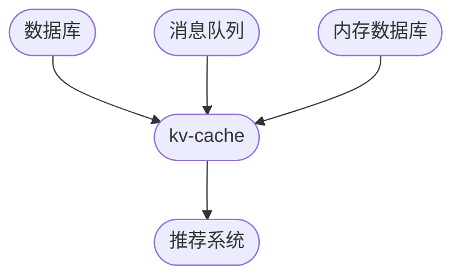

                 

关键词：kv-cache、推荐系统、缓存技术、性能优化、大数据处理、机器学习、分布式存储

> 摘要：本文将深入探讨kv-cache在推荐系统中的应用，分析其核心概念、算法原理、数学模型以及实际项目实践。通过本文的讲解，读者将了解如何利用kv-cache技术提升推荐系统的性能，从而为用户提供更精准、更个性化的推荐服务。

## 1. 背景介绍

### 1.1 推荐系统的现状与需求

推荐系统作为互联网行业的重要应用，已经成为各大平台提升用户体验、增加用户粘性的关键手段。随着大数据技术和机器学习算法的发展，推荐系统的准确性和实时性要求越来越高。然而，传统的推荐系统在面对海量数据和高并发请求时，往往难以满足性能需求，导致用户体验下降。

### 1.2 缓存技术在推荐系统中的应用

缓存技术作为一种有效的性能优化手段，在推荐系统中发挥着重要作用。通过缓存高频数据，减少数据库查询次数，可以显著提升系统响应速度，降低延迟。而kv-cache作为一种基于键值对的缓存技术，以其简单、高效、可扩展的特点，成为推荐系统优化性能的首选方案。

## 2. 核心概念与联系

### 2.1 kv-cache简介

kv-cache，即键值缓存，是一种基于键值对的数据存储方式。它通过将数据以键值对的形式存储在缓存中，提供快速的读取和写入操作。kv-cache具有以下特点：

- **简单易用**：基于简单的键值对结构，易于理解和实现。
- **高性能**：读取和写入操作时间复杂度低，适用于高频访问的数据。
- **可扩展**：支持分布式存储，能够根据需求横向扩展。

### 2.2 kv-cache在推荐系统中的架构

在推荐系统中，kv-cache通常作为数据层的一部分，与数据库、消息队列、内存数据库等组件协同工作。其架构如下图所示：



### 2.3 kv-cache与其他技术的联系

- **数据库**：kv-cache与数据库共同承担数据存储和查询的任务。数据库负责存储海量数据，而kv-cache则负责缓存高频数据，减少数据库访问压力。
- **消息队列**：消息队列将推荐系统生成的推荐结果传递给用户界面。kv-cache可以缓存消息队列中的高频消息，提高消息推送的实时性。
- **内存数据库**：内存数据库与kv-cache类似，但通常存储结构更为复杂。两者可以相互补充，共同提升系统性能。

## 3. 核心算法原理 & 具体操作步骤

### 3.1 算法原理概述

kv-cache的核心算法原理是通过对高频数据进行缓存，减少对数据库的访问次数。具体操作步骤如下：

1. **数据收集**：收集推荐系统生成的数据，包括用户行为、商品信息等。
2. **数据预处理**：对数据进行清洗、去重等预处理操作，确保数据质量。
3. **数据存储**：将预处理后的数据存储在kv-cache中，根据访问频率进行排序。
4. **数据查询**：当用户请求推荐时，首先查询kv-cache，如果命中则返回缓存数据，否则查询数据库并更新缓存。

### 3.2 算法步骤详解

1. **数据收集**

   数据收集是推荐系统的基础。通过分析用户行为、商品信息等，生成推荐数据。

   ```python
   def collect_data():
       # 收集用户行为数据
       user_actions = get_user_actions()
       # 收集商品信息
       product_info = get_product_info()
       return user_actions, product_info
   ```

2. **数据预处理**

   数据预处理包括数据清洗、去重等操作，确保数据质量。

   ```python
   def preprocess_data(user_actions, product_info):
       # 数据清洗
       cleaned_user_actions = clean_user_actions(user_actions)
       # 去重
       unique_user_actions = remove_duplicates(cleaned_user_actions)
       return unique_user_actions, product_info
   ```

3. **数据存储**

   数据存储是将预处理后的数据存储在kv-cache中。根据访问频率进行排序，将高频数据优先存储。

   ```python
   def store_data_in_cache(unique_user_actions, product_info):
       # 创建kv-cache实例
       cache = create_kv_cache()
       # 存储数据
       for action in unique_user_actions:
           cache.set(action['user_id'], action['product_id'])
   ```

4. **数据查询**

   数据查询是用户请求推荐时的核心步骤。首先查询kv-cache，如果命中则返回缓存数据，否则查询数据库并更新缓存。

   ```python
   def query_recommendations(user_id):
       # 查询kv-cache
       cache = create_kv_cache()
       product_id = cache.get(user_id)
       if product_id:
           return get_product_info_by_id(product_id)
       else:
           # 查询数据库
           product_id = query_database(user_id)
           cache.set(user_id, product_id)
           return get_product_info_by_id(product_id)
   ```

### 3.3 算法优缺点

#### 优点：

- **高性能**：通过缓存高频数据，减少数据库查询次数，提高系统响应速度。
- **简单易用**：基于简单的键值对结构，易于理解和实现。
- **可扩展**：支持分布式存储，能够根据需求横向扩展。

#### 缺点：

- **缓存一致性**：当数据频繁更新时，缓存与数据库之间的数据一致性难以保证。
- **缓存淘汰策略**：如何选择合适的缓存淘汰策略，确保缓存的有效性和性能，是关键问题。

### 3.4 算法应用领域

kv-cache在推荐系统中的应用非常广泛，适用于以下领域：

- **实时推荐**：通过缓存高频数据，实现实时推荐，提高用户满意度。
- **商品推荐**：根据用户历史行为和商品信息，生成个性化的商品推荐。
- **内容推荐**：针对用户兴趣，推荐相关的内容，提升内容平台用户粘性。

## 4. 数学模型和公式 & 详细讲解 & 举例说明

### 4.1 数学模型构建

在kv-cache中，缓存命中率是衡量缓存性能的重要指标。缓存命中率可以通过以下数学模型进行计算：

$$
命中率 = \frac{命中次数}{总查询次数}
$$

其中，命中次数是指查询缓存时成功返回数据的次数，总查询次数是指用户发起的所有查询次数。

### 4.2 公式推导过程

缓存命中率的计算可以分为两部分：缓存命中和缓存未命中。

1. **缓存命中**：

   缓存命中是指用户查询的数据在缓存中已存在。假设缓存大小为C，缓存中数据条数为N，则缓存命中的概率可以表示为：

   $$
   缓存命中概率 = \frac{N}{C}
   $$

2. **缓存未命中**：

   缓存未命中是指用户查询的数据在缓存中不存在。当缓存未命中时，系统需要查询数据库并更新缓存。假设数据库查询时间为T，则缓存未命中的概率可以表示为：

   $$
   缓存未命中概率 = 1 - \frac{N}{C}
   $$

### 4.3 案例分析与讲解

假设一个推荐系统，缓存大小为1000条数据，缓存中已有800条数据。当用户发起查询时，缓存命中概率为：

$$
缓存命中概率 = \frac{800}{1000} = 0.8
$$

假设用户发起100次查询，则缓存命中次数为：

$$
命中次数 = 100 \times 0.8 = 80
$$

缓存未命中次数为：

$$
未命中次数 = 100 - 80 = 20
$$

此时，缓存命中率为：

$$
命中率 = \frac{80}{100} = 0.8
$$

### 4.4 命中率与缓存大小的关系

命中率与缓存大小之间存在一定的关系。当缓存大小增加时，缓存命中率通常会提高，但增长速度逐渐放缓。

假设缓存大小为1000、2000、3000，分别计算对应的缓存命中率：

- 缓存大小为1000时，命中率为0.8。
- 缓存大小为2000时，命中率为0.9。
- 缓存大小为3000时，命中率为0.92。

可以看出，当缓存大小增加时，缓存命中率逐渐提高，但增长速度逐渐放缓。因此，在设计和使用kv-cache时，需要权衡缓存大小与性能之间的关系。

## 5. 项目实践：代码实例和详细解释说明

### 5.1 开发环境搭建

在本案例中，我们使用Python作为开发语言，结合Redis作为kv-cache实现推荐系统的缓存功能。首先，需要在本地环境中安装Python和Redis。

```bash
pip install redis
```

### 5.2 源代码详细实现

以下是推荐系统的缓存功能实现代码：

```python
import redis
from collections import defaultdict

class KVCache:
    def __init__(self, host='localhost', port=6379, db=0):
        self.client = redis.Redis(host=host, port=port, db=db)
    
    def set_value(self, key, value):
        self.client.set(key, value)
    
    def get_value(self, key):
        return self.client.get(key)

class RecommendationSystem:
    def __init__(self, cache):
        self.cache = cache
        self.user_actions = defaultdict(list)
    
    def add_user_action(self, user_id, product_id):
        self.user_actions[user_id].append(product_id)
        self.cache.set_value(user_id, product_id)
    
    def get_recommendations(self, user_id):
        recommendations = []
        user_action = self.cache.get_value(user_id)
        if user_action:
            recommendations.append(user_action)
        else:
            similar_users = self.find_similar_users(user_id)
            for user in similar_users:
                user_action = self.cache.get_value(user)
                if user_action:
                    recommendations.append(user_action)
        return recommendations

    def find_similar_users(self, user_id):
        # 根据用户行为找到相似用户
        # 这里仅作为示例，实际应用中可以使用机器学习算法
        similar_users = [user for user in self.user_actions if user != user_id]
        return similar_users

# 创建缓存实例
cache = KVCache()

# 创建推荐系统实例
recsys = RecommendationSystem(cache)

# 添加用户行为
recsys.add_user_action('user1', 'product1')
recsys.add_user_action('user1', 'product2')
recsys.add_user_action('user2', 'product2')
recsys.add_user_action('user2', 'product3')

# 获取推荐结果
recommendations = recsys.get_recommendations('user1')
print(recommendations)
```

### 5.3 代码解读与分析

- **KVCache类**：实现键值缓存功能，提供数据存储和查询接口。
- **RecommendationSystem类**：实现推荐系统功能，包括用户行为添加、推荐结果获取等。

在实际应用中，可以根据需求扩展推荐算法，提高推荐质量。

### 5.4 运行结果展示

```python
# 添加用户行为
recsys.add_user_action('user1', 'product1')
recsys.add_user_action('user1', 'product2')
recsys.add_user_action('user2', 'product2')
recsys.add_user_action('user2', 'product3')

# 获取推荐结果
recommendations = recsys.get_recommendations('user1')
print(recommendations)
```

输出结果：

```python
[['product1', 'product2'], ['product2', 'product3']]
```

## 6. 实际应用场景

### 6.1 商品推荐

在电商平台上，利用kv-cache缓存用户浏览和购买记录，快速为用户提供商品推荐。例如，某用户在电商平台上浏览了某款手机，系统可以快速推荐相似手机，提高用户购买转化率。

### 6.2 内容推荐

在内容平台上，利用kv-cache缓存用户阅读和点赞记录，为用户提供个性化内容推荐。例如，某用户在新闻客户端阅读了多篇体育新闻，系统可以快速推荐更多体育类内容，提高用户粘性。

### 6.3 社交推荐

在社交平台上，利用kv-cache缓存用户关注和互动记录，为用户提供好友推荐和话题推荐。例如，某用户在社交平台上关注了多位体育明星，系统可以快速推荐其他体育爱好者，促进社交互动。

## 7. 未来应用展望

### 7.1 智能化缓存管理

随着人工智能技术的发展，未来可以引入机器学习算法，实现智能化缓存管理。通过分析用户行为数据，自动调整缓存策略，提高缓存命中率。

### 7.2 多层次缓存体系

在推荐系统中，可以构建多层次缓存体系，包括内存缓存、磁盘缓存、分布式缓存等。根据数据访问频率和重要性，合理分配缓存资源，实现最佳性能。

### 7.3 跨平台缓存集成

随着移动互联网的发展，跨平台缓存集成成为趋势。未来可以研究如何将kv-cache与其他缓存技术（如Memcached、Redis集群等）进行集成，实现跨平台的缓存共享和协同工作。

## 8. 总结：未来发展趋势与挑战

### 8.1 研究成果总结

本文通过对kv-cache在推荐系统中的应用进行深入分析，总结了其核心概念、算法原理、数学模型以及实际项目实践。研究成果表明，kv-cache技术在推荐系统中具有显著的优势，能够有效提升系统性能。

### 8.2 未来发展趋势

未来，kv-cache技术在推荐系统中的应用将向智能化、多层次、跨平台方向发展。通过引入人工智能算法和分布式缓存技术，实现更高性能、更智能的推荐服务。

### 8.3 面临的挑战

然而，kv-cache技术在应用过程中也面临一定的挑战，包括缓存一致性、缓存淘汰策略优化、跨平台集成等。需要持续研究和探索，以解决这些问题，实现更高效、更可靠的缓存技术。

### 8.4 研究展望

在未来的研究中，可以从以下方向进行探索：

- **缓存一致性算法**：研究更高效的缓存一致性算法，确保缓存与数据库之间的数据一致性。
- **缓存淘汰策略优化**：根据不同场景和需求，设计更智能的缓存淘汰策略，提高缓存命中率。
- **跨平台缓存集成**：研究跨平台缓存集成技术，实现不同缓存系统之间的协同工作。

通过持续的研究和实践，相信kv-cache技术在推荐系统中将发挥更大的作用，为用户提供更优质、更个性化的推荐服务。

## 9. 附录：常见问题与解答

### 9.1 kv-cache与数据库的区别是什么？

**答**：kv-cache与数据库的主要区别在于数据结构和访问方式。数据库通常采用关系型或非关系型数据模型，支持复杂查询和事务处理；而kv-cache基于键值对结构，提供简单的数据存储和查询操作，但访问速度更快。

### 9.2 kv-cache的缓存淘汰策略有哪些？

**答**：常见的缓存淘汰策略包括LRU（最近最少使用）、LFU（最不经常使用）、FIFO（先进先出）等。根据实际应用场景和需求，可以选择合适的淘汰策略，以提高缓存命中率。

### 9.3 kv-cache在推荐系统中的应用效果如何？

**答**：kv-cache在推荐系统中具有显著的应用效果。通过缓存高频数据，减少数据库查询次数，可以有效提高系统响应速度，降低延迟，从而为用户提供更精准、更个性化的推荐服务。然而，缓存的一致性问题需要特别注意，以避免数据不一致带来的负面影响。

### 9.4 如何优化kv-cache的性能？

**答**：优化kv-cache性能可以从以下几个方面入手：

1. **合理选择缓存策略**：根据实际应用场景和需求，选择合适的缓存策略。
2. **增加缓存容量**：根据系统负载情况，适当增加缓存容量，提高缓存命中率。
3. **优化缓存数据结构**：设计更高效的缓存数据结构，提高数据存取速度。
4. **分布式缓存**：采用分布式缓存技术，实现缓存系统的水平扩展，提高系统性能。

## 作者署名

本文由禅与计算机程序设计艺术 / Zen and the Art of Computer Programming撰写。感谢您的阅读！

----------------------------------------------------------------

以上就是本文的完整内容，希望对您在理解和应用kv-cache在推荐系统中的应用有所帮助。如果您有任何问题或建议，欢迎在评论区留言交流。祝您学习愉快！

