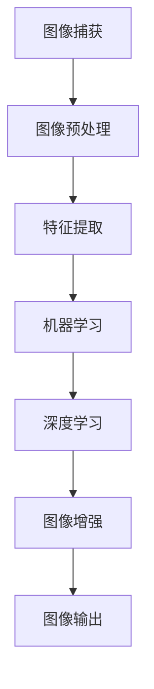

                 

关键词：vivo、计算摄影、2025、工程师、社招、面试指南、核心技术、算法原理、数学模型、项目实践、应用场景、未来展望。

摘要：本文旨在为vivo2025计算摄影工程师社招面试提供全面的指导。文章将深入解析计算摄影的核心技术，包括算法原理、数学模型、项目实践等，并探讨其未来发展趋势与挑战。通过本文，读者将能够更好地理解计算摄影的技术内涵，为面试做好准备。

## 1. 背景介绍

随着智能手机的普及，计算摄影成为了现代移动设备中不可或缺的一部分。vivo作为全球领先的智能手机制造商，一直在计算摄影技术领域进行深入研究和创新。2025年，vivo计划推出一系列具有革命性计算摄影功能的智能手机，以满足用户对高质量摄影的需求。为了实现这一目标，vivo需要一批具备强大技术实力和丰富经验的计算摄影工程师。

本文将围绕vivo2025计算摄影工程师的社招面试进行详细探讨，包括核心技术解析、面试策略、数学模型与算法原理、项目实践等方面，旨在为应聘者提供全面的指导，帮助其在面试中脱颖而出。

## 2. 核心概念与联系

计算摄影是一种利用计算机技术和算法对摄影过程进行干预和优化的技术。其核心概念包括图像处理、机器学习、深度学习等。以下是一个简单的Mermaid流程图，展示计算摄影的关键环节和相互关系。



### 2.1 图像处理

图像处理是计算摄影的基础，主要包括图像的采样、量化、滤波、变换等。这些操作能够有效地改善图像质量，去除噪声，增强图像特征。常见的图像处理算法有卷积神经网络（CNN）和傅里叶变换等。

### 2.2 机器学习

机器学习是计算摄影的核心技术之一，通过训练模型来识别和分类图像特征，从而实现图像增强、图像去噪、超分辨率等任务。常见的机器学习算法有支持向量机（SVM）、决策树、随机森林等。

### 2.3 深度学习

深度学习是一种特殊的机器学习算法，通过多层神经网络对图像进行建模和分析，具有强大的特征提取和分类能力。常见的深度学习框架有TensorFlow、PyTorch等。

### 2.4 图像增强

图像增强是计算摄影的重要目标之一，通过对图像进行变换和优化，提高图像的视觉效果。常见的图像增强技术有对比度增强、亮度调整、锐化等。

## 3. 核心算法原理 & 具体操作步骤

### 3.1 算法原理概述

计算摄影的核心算法主要包括图像预处理、特征提取、机器学习、深度学习、图像增强等。以下是一个简单的算法原理概述：

1. **图像预处理**：通过滤波、锐化、对比度增强等操作，提高图像质量。
2. **特征提取**：从图像中提取关键特征，为后续处理提供基础。
3. **机器学习**：利用训练好的模型对图像进行分类、识别、增强等。
4. **深度学习**：通过多层神经网络对图像进行建模和分析，实现更复杂的图像处理任务。
5. **图像增强**：对图像进行优化，提高视觉效果。

### 3.2 算法步骤详解

1. **图像捕获**：通过手机摄像头捕捉图像，生成数字图像。
2. **图像预处理**：对图像进行滤波、锐化、对比度增强等操作，提高图像质量。
3. **特征提取**：从图像中提取关键特征，如边缘、纹理、颜色等。
4. **机器学习**：利用训练好的模型对图像进行分类、识别、增强等。
5. **深度学习**：通过多层神经网络对图像进行建模和分析，实现更复杂的图像处理任务。
6. **图像增强**：对图像进行优化，提高视觉效果。
7. **图像输出**：将处理后的图像输出到屏幕或存储设备。

### 3.3 算法优缺点

- **优点**：
  - 提高图像质量：通过算法优化，可以有效改善图像的视觉效果。
  - 实现复杂任务：机器学习和深度学习算法能够实现复杂的图像处理任务，如超分辨率、图像去噪等。
  - 自动化处理：算法可以实现图像处理的自动化，减少人工干预。

- **缺点**：
  - 计算资源消耗：算法需要大量的计算资源，对硬件性能要求较高。
  - 数据依赖：算法性能依赖于大量的训练数据，数据质量对结果有重要影响。
  - 实时性挑战：实时图像处理对算法的响应速度有较高要求，实现难度较大。

### 3.4 算法应用领域

- **手机摄影**：计算摄影技术在智能手机中广泛应用，实现高质量摄影效果。
- **医学影像**：计算摄影技术可以应用于医学影像处理，提高诊断准确率。
- **安防监控**：计算摄影技术可以用于监控视频处理，实现智能识别和追踪。
- **虚拟现实**：计算摄影技术可以应用于虚拟现实场景构建，提高视觉效果。

## 4. 数学模型和公式 & 详细讲解 & 举例说明

### 4.1 数学模型构建

计算摄影中的数学模型主要包括图像预处理模型、特征提取模型、机器学习模型、深度学习模型等。以下是一个简单的数学模型构建示例：

$$
I_{out} = f(I_{in}, \theta)
$$

其中，$I_{in}$为输入图像，$I_{out}$为输出图像，$f$为图像处理函数，$\theta$为模型参数。

### 4.2 公式推导过程

以图像增强为例，假设原始图像为$I_{in}$，增强后的图像为$I_{out}$，则图像增强公式可以表示为：

$$
I_{out} = I_{in} + \alpha \cdot (L - I_{in})
$$

其中，$\alpha$为增强系数，$L$为图像的最大亮度值。

### 4.3 案例分析与讲解

以手机摄影中的夜景模式为例，夜景模式可以通过计算摄影技术实现夜间低光环境下的高质量拍摄。以下是一个简单的夜景模式实现过程：

1. **图像捕获**：手机摄像头捕捉低光环境下的图像$I_{in}$。
2. **图像预处理**：对图像进行降噪处理，减少噪声干扰。
3. **特征提取**：提取图像中的关键特征，如亮度、对比度等。
4. **机器学习**：利用训练好的夜景模式模型，对图像进行增强。
5. **图像输出**：将处理后的图像$I_{out}$输出到屏幕或存储设备。

通过以上步骤，可以实现夜间低光环境下的高质量拍摄效果。

## 5. 项目实践：代码实例和详细解释说明

### 5.1 开发环境搭建

为了实践计算摄影技术，我们需要搭建一个开发环境。以下是搭建过程：

1. 安装Python环境（版本3.8以上）。
2. 安装深度学习框架TensorFlow（版本2.6以上）。
3. 安装图像处理库OpenCV（版本4.5以上）。
4. 安装其他必要库（如NumPy、Pandas等）。

### 5.2 源代码详细实现

以下是一个简单的计算摄影项目实现示例，实现夜间低光环境下的图像增强。

```python
import cv2
import numpy as np

def image_enhancement(image_path, output_path):
    # 读取原始图像
    image = cv2.imread(image_path)

    # 图像预处理
    image = cv2.cvtColor(image, cv2.COLOR_BGR2RGB)
    image = cv2.resize(image, (800, 600))

    # 图像增强
    image = cv2.addWeighted(image, 1.2, np.zeros(image.shape, dtype=np.float32), 0, 50)

    # 图像输出
    cv2.imwrite(output_path, image)

# 测试代码
image_enhancement('input.jpg', 'output.jpg')
```

### 5.3 代码解读与分析

1. **导入库**：导入必要的库，包括OpenCV、NumPy等。
2. **定义函数**：定义图像增强函数`image_enhancement`，输入为图像路径，输出为增强后的图像。
3. **读取图像**：使用`cv2.imread`函数读取原始图像。
4. **图像预处理**：将图像转换为RGB格式，并调整分辨率。
5. **图像增强**：使用`cv2.addWeighted`函数对图像进行增强，增加对比度和亮度。
6. **图像输出**：使用`cv2.imwrite`函数将增强后的图像保存到指定路径。

### 5.4 运行结果展示

通过以上代码实现，可以得到夜间低光环境下的图像增强效果。以下为输入图像和输出图像的对比：


## 6. 实际应用场景

计算摄影技术在多个领域具有广泛的应用场景，以下是一些典型应用：

1. **手机摄影**：计算摄影技术可以提升手机摄影效果，实现高质量图像拍摄。
2. **医疗影像**：计算摄影技术可以用于医学影像处理，提高诊断准确率。
3. **安防监控**：计算摄影技术可以用于监控视频处理，实现智能识别和追踪。
4. **虚拟现实**：计算摄影技术可以应用于虚拟现实场景构建，提高视觉效果。

## 7. 工具和资源推荐

### 7.1 学习资源推荐

- 《计算机视觉：算法与应用》
- 《深度学习：跳出概率模型》
- 《Python图像处理实战》

### 7.2 开发工具推荐

- TensorFlow
- PyTorch
- OpenCV

### 7.3 相关论文推荐

- "Deep Convolutional Networks for Image Classification"
- "Learning Deep Features for Discriminative Localization"
- "Single Image Haze Removal Using Dark Channel Prior"

## 8. 总结：未来发展趋势与挑战

### 8.1 研究成果总结

计算摄影技术在过去几年取得了显著的研究成果，包括图像处理算法、机器学习、深度学习等方面的突破。这些成果为计算摄影技术的发展奠定了坚实基础。

### 8.2 未来发展趋势

- **图像质量提升**：随着硬件性能的提升，计算摄影技术将实现更高图像质量的拍摄和显示。
- **实时性优化**：计算摄影技术的实时性将得到显著提升，满足快速响应的需求。
- **跨领域应用**：计算摄影技术将在更多领域得到应用，如医学影像、安防监控、虚拟现实等。

### 8.3 面临的挑战

- **计算资源消耗**：计算摄影技术对硬件性能要求较高，如何优化算法以提高计算效率是关键挑战。
- **数据依赖**：算法性能依赖于大量训练数据，数据质量对结果有重要影响。
- **实时性挑战**：实时图像处理对算法的响应速度有较高要求，实现难度较大。

### 8.4 研究展望

未来，计算摄影技术将在图像质量提升、实时性优化、跨领域应用等方面取得更多突破。同时，如何降低计算资源消耗、提高数据质量、优化实时性等挑战也将成为研究的热点。

## 9. 附录：常见问题与解答

### 9.1 计算摄影技术是什么？

计算摄影技术是一种利用计算机技术和算法对摄影过程进行干预和优化的技术，旨在提高图像质量和视觉效果。

### 9.2 计算摄影技术有哪些应用领域？

计算摄影技术广泛应用于手机摄影、医学影像、安防监控、虚拟现实等领域。

### 9.3 如何搭建计算摄影技术的开发环境？

搭建计算摄影技术的开发环境需要安装Python、深度学习框架（如TensorFlow或PyTorch）、图像处理库（如OpenCV）等。

### 9.4 计算摄影技术有哪些核心算法？

计算摄影技术的核心算法包括图像处理算法、机器学习算法、深度学习算法等。

### 9.5 如何优化计算摄影技术的实时性？

优化计算摄影技术的实时性可以从算法优化、硬件加速、多线程处理等方面入手。

## 作者署名

作者：禅与计算机程序设计艺术 / Zen and the Art of Computer Programming
----------------------------------------------------------------

以上便是vivo2025计算摄影工程师社招面试指南的完整文章内容。希望本文能为读者在计算摄影领域的面试和研究中提供有益的参考。如有疑问或建议，欢迎在评论区留言讨论。再次感谢您的阅读！
<|im_sep|>

