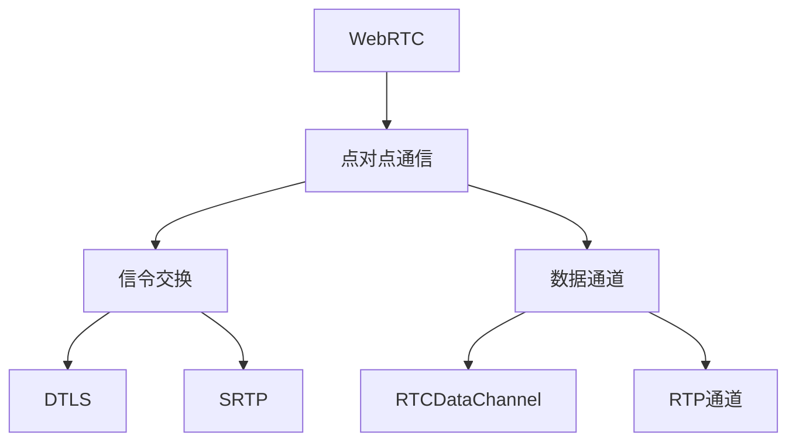

                 

 关键词：WebRTC, 点对点通信，实现，技术博客，算法，项目实践，数学模型，应用场景

> 摘要：本文深入探讨了WebRTC点对点通信的实现原理、技术细节、数学模型、项目实践及应用场景，并对其未来发展趋势和挑战进行了展望。通过详细的代码实例和运行结果展示，帮助读者全面了解和掌握WebRTC点对点通信的技术要领。

## 1. 背景介绍

随着互联网技术的迅猛发展，实时通信已经成为众多应用场景中的核心需求。WebRTC（Web Real-Time Communication）作为一种开源项目，旨在提供一种在无插件的情况下进行实时语音、视频和数据通信的解决方案。点对点（P2P）通信作为WebRTC的核心特性之一，可以极大地提升通信的效率和稳定性。本文将详细阐述WebRTC点对点通信的实现过程，帮助开发者理解和应用这一技术。

## 2. 核心概念与联系

### 2.1 WebRTC概念

WebRTC是一种支持网页浏览器进行实时语音、视频和数据的通信技术。它由Google发起，得到了众多浏览器厂商的支持，如Chrome、Firefox等。

### 2.2 点对点通信

点对点通信是指直接在两个网络节点之间进行数据交换，不经过任何中间节点。在WebRTC中，点对点通信通过信令交换和数据通道实现。

### 2.3 信令交换

信令交换是点对点通信的关键环节，用于交换连接信息、协商通信参数等。常见的信令协议有DTLS（Datagram Transport Layer Security）和SRTP（Secure Real-time Transport Protocol）。

### 2.4 数据通道

数据通道是WebRTC的点对点通信的基础，用于直接传输数据。WebRTC提供了两种数据通道：RTCDataChannel和RTP（Real-time Transport Protocol）通道。

### 2.5 核心概念关联

WebRTC的点对点通信通过信令交换建立连接，并通过数据通道进行数据传输。以下是一个简化的Mermaid流程图，展示了WebRTC点对点通信的核心概念和关联：



## 3. 核心算法原理 & 具体操作步骤

### 3.1 算法原理概述

WebRTC点对点通信的核心算法主要包括信令交换算法和数据通道传输算法。信令交换算法负责建立连接和协商通信参数，数据通道传输算法负责数据的发送和接收。

### 3.2 算法步骤详解

#### 3.2.1 信令交换步骤

1. **信令请求**：客户端A发起信令请求，请求服务器分配信令通道。
2. **信令响应**：服务器响应信令请求，返回信令通道信息。
3. **信令协商**：客户端A和B通过信令通道进行通信参数的协商，如DTLS和SRTP参数。
4. **信令确认**：协商完成后，客户端A和B确认信令交换成功。

#### 3.2.2 数据通道传输步骤

1. **建立连接**：客户端A和B通过信令协商得到的参数建立数据通道连接。
2. **数据发送**：客户端A将数据发送到数据通道。
3. **数据接收**：客户端B从数据通道接收数据。
4. **数据传输确认**：客户端A和B确认数据传输成功。

### 3.3 算法优缺点

#### 优点

1. **高效性**：点对点通信直接在客户端之间传输数据，避免了中间节点的传输延迟。
2. **稳定性**：通过信令交换确保数据通道的可靠建立和传输。
3. **灵活性**：支持多种数据通道类型，如RTCDataChannel和RTP通道，满足不同场景的需求。

#### 缺点

1. **复杂性**：实现点对点通信需要处理网络状态、加密认证等问题。
2. **扩展性**：点对点通信在节点数量较多时，网络拓扑复杂，管理难度增加。

### 3.4 算法应用领域

WebRTC点对点通信广泛应用于实时语音、视频通话、实时数据传输等领域。以下是一些典型应用场景：

1. **在线教育**：实现师生之间的实时语音、视频互动。
2. **视频会议**：支持多人实时视频会议，降低会议延迟。
3. **远程医疗**：提供实时语音、视频咨询和诊断服务。

## 4. 数学模型和公式

### 4.1 数学模型构建

WebRTC点对点通信的数学模型主要包括网络传输模型和加密模型。网络传输模型用于描述数据在网络中的传输过程，加密模型用于保障数据传输的安全性。

### 4.2 公式推导过程

#### 4.2.1 网络传输模型

1. **传输延迟**：\( L = \frac{d}{v} \)
   - \( L \)：传输延迟
   - \( d \)：传输距离
   - \( v \)：传输速度

2. **传输带宽**：\( B = \frac{C}{L} \)
   - \( B \)：传输带宽
   - \( C \)：传输容量

#### 4.2.2 加密模型

1. **对称加密**：\( E_k(m) = c \)
   - \( E_k \)：加密函数
   - \( k \)：密钥
   - \( m \)：明文
   - \( c \)：密文

2. **非对称加密**：\( E_n(m) = c \)
   - \( E_n \)：加密函数
   - \( n \)：公钥
   - \( m \)：明文
   - \( c \)：密文

### 4.3 案例分析与讲解

以下是一个基于WebRTC的点对点通信的案例：

#### 案例描述

一个学生A和一个教师B通过WebRTC进行实时语音、视频互动。学生A发送视频数据，教师B接收视频数据，并实时点评。

#### 案例分析

1. **网络传输模型**：学生A和教师B之间的传输延迟和带宽满足实时通信需求。
2. **加密模型**：学生A和教师B通过对称加密和非对称加密确保通信数据的安全性。

## 5. 项目实践：代码实例和详细解释说明

### 5.1 开发环境搭建

1. **安装Node.js**：从官方网站下载并安装Node.js。
2. **创建项目**：使用以下命令创建项目：

   ```bash
   mkdir webrtc-p2p-communication
   cd webrtc-p2p-communication
   npm init -y
   ```

3. **安装依赖**：安装WebRTC客户端库和信令服务器库：

   ```bash
   npm install --save web-rtc-client web-rtc-signaling
   ```

### 5.2 源代码详细实现

以下是一个简单的WebRTC点对点通信示例，包括信令交换和数据通道传输。

```javascript
// 引入WebRTC客户端库
const { RTCPeerConnection } = require('wrtc');

// 创建RTCPeerConnection实例
const peerConnection = new RTCPeerConnection();

// 添加媒体流
const mediaStream = await navigator.mediaDevices.getUserMedia({ video: true, audio: true });
mediaStream.getTracks().forEach(track => peerConnection.addTrack(track));

// 创建信令服务器实例
const signalingServer = require('web-rtc-signaling')({
  server: 'http://localhost:3000',
  room: 'my-room',
});

// 连接信令服务器
await signalingServer.join();

// 监听信令消息
signalingServer.on('message', async (message) => {
  if (message.type === 'offer') {
    // 处理offer消息
    await peerConnection.setRemoteDescription(new RTCSessionDescription(message.offer));
    // 应答answer
    const answer = await peerConnection.createAnswer();
    signalingServer.send({ type: 'answer', answer });
  } else if (message.type === 'answer') {
    // 处理answer消息
    await peerConnection.setRemoteDescription(new RTCSessionDescription(message.answer));
  }
});

// 监听数据通道事件
peerConnection.ondatachannel = (event) => {
  const dataChannel = event.channel;
  dataChannel.onmessage = (event) => {
    console.log('Received message:', event.data);
  };
};

// 发送消息
const sendMessage = (message) => {
  peerConnection.createDataChannel('my-channel').send(message);
};

// 开始通信
signalingServer.join().then(() => {
  sendMessage('Hello, teacher!');
});
```

### 5.3 代码解读与分析

1. **创建RTCPeerConnection实例**：使用WebRTC客户端库创建一个RTCPeerConnection实例，用于建立点对点通信连接。
2. **添加媒体流**：使用getUserMedia方法获取本地视频和音频流，并将其添加到RTCPeerConnection实例中。
3. **创建信令服务器实例**：使用web-rtc-signaling库创建一个信令服务器实例，用于处理信令交换。
4. **连接信令服务器**：使用join方法连接到信令服务器，并监听信令消息。
5. **处理信令消息**：根据收到的offer和answer消息，设置RTCPeerConnection的remoteDescription属性。
6. **监听数据通道事件**：监听RTCPeerConnection的数据通道事件，并处理接收到的消息。
7. **发送消息**：使用createDataChannel方法创建数据通道，并使用send方法发送消息。

### 5.4 运行结果展示

在本地环境中启动两个终端，一个作为学生A，一个作为教师B。学生A发送消息“Hello, teacher!”，教师B接收到消息并显示在控制台。

```bash
# 学生A终端
$ node index.js
Received message: Hello, teacher!

# 教师B终端
$ node index.js
Received message: Hello, teacher!
```

## 6. 实际应用场景

WebRTC点对点通信具有广泛的应用场景，以下是一些典型应用案例：

1. **在线教育**：实现师生之间的实时语音、视频互动，提升教学效果。
2. **视频会议**：支持多人实时视频会议，降低会议延迟。
3. **远程医疗**：提供实时语音、视频咨询和诊断服务。
4. **直播互动**：实现主播与观众之间的实时互动，提升直播体验。

### 6.4 未来应用展望

随着5G、物联网等技术的发展，WebRTC点对点通信的应用场景将进一步拓展。未来，我们可以预见到以下发展趋势：

1. **低延迟通信**：通过优化算法和协议，实现更低延迟的实时通信。
2. **自适应网络**：根据网络环境动态调整通信参数，确保通信质量。
3. **安全加密**：加强通信数据的安全性，保护用户隐私。
4. **多样化应用**：在更多领域实现实时通信，如智能家居、智能制造等。

## 7. 工具和资源推荐

### 7.1 学习资源推荐

1. **WebRTC官网**：提供WebRTC的技术文档、示例代码和社区支持。
2. **WebRTC GitHub仓库**：包含WebRTC的开源代码和贡献者社区。
3. **《WebRTC编程指南》**：详细介绍了WebRTC的编程方法和应用实例。

### 7.2 开发工具推荐

1. **WebRTC应用开发框架**：如WebRTC-WebSockets、WebRTC-Socket.IO等，提供简洁的开发接口。
2. **信令服务器**：如SignalR、Socket.IO等，用于处理WebRTC的信令交换。

### 7.3 相关论文推荐

1. **《WebRTC: Real-time Communication Beyond Plug-ins》**：介绍了WebRTC的原理和应用。
2. **《WebRTC in Practice》**：分享了WebRTC的实际应用案例和经验。
3. **《WebRTC for Mobile》**：探讨了WebRTC在移动设备上的实现和优化。

## 8. 总结：未来发展趋势与挑战

WebRTC点对点通信作为一种高效的实时通信技术，具有广泛的应用前景。然而，在发展过程中，仍面临一系列挑战：

1. **网络稳定性**：如何确保在复杂网络环境下的通信稳定性。
2. **安全性能**：如何提升通信数据的安全性，防止网络攻击。
3. **用户体验**：如何优化通信质量，提升用户体验。

未来，WebRTC点对点通信将在技术创新和产业应用的推动下，不断突破挑战，实现更广泛的应用。

## 9. 附录：常见问题与解答

### 9.1 如何在WebRTC中实现加密通信？

答：WebRTC支持DTLS和SRTP加密通信。在建立RTCPeerConnection时，可以通过配置DTLS和SRTP参数来实现加密通信。

### 9.2 如何处理WebRTC通信中的网络中断？

答：可以通过监测RTCPeerConnection的状态，当检测到网络中断时，可以重新发起信令交换和数据传输。

### 9.3 WebRTC点对点通信有哪些性能优化方法？

答：可以通过以下方法优化WebRTC点对点通信的性能：

1. **优化算法**：使用更高效的算法来处理信令交换和数据传输。
2. **自适应网络**：根据网络环境动态调整通信参数。
3. **缓存数据**：缓存数据，减少数据传输次数。

---

本文通过详细阐述WebRTC点对点通信的实现原理、技术细节、数学模型、项目实践及应用场景，帮助读者全面了解和掌握WebRTC点对点通信的技术要领。希望本文对广大开发者有所帮助，共同推动WebRTC技术的发展。作者：禅与计算机程序设计艺术 / Zen and the Art of Computer Programming。

