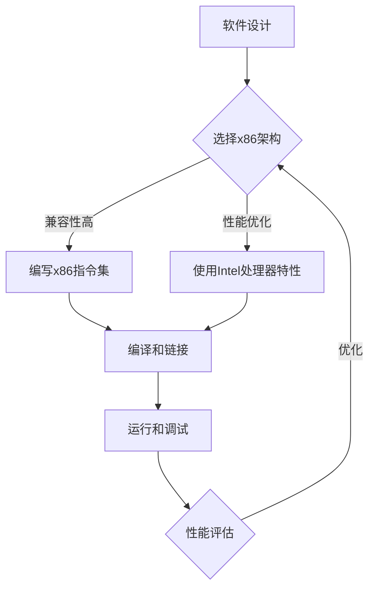

                 

关键词：x86架构，Intel处理器，编程，性能优化，硬件特性，软件开发

> 摘要：本文深入探讨了x86架构编程以及Intel处理器的优势。通过对比分析，本文揭示了x86架构在软件兼容性、性能优化和硬件特性方面的独特优势，并探讨了其在现代软件开发中的应用前景。

## 1. 背景介绍

x86架构是英特尔（Intel）公司开发的一种复杂的计算机处理器架构，其起源于1981年的8086微处理器。x86架构因其高度的可扩展性和广泛的软件兼容性，成为全球计算机硬件和软件开发的主流。Intel处理器作为x86架构的典型代表，一直引领着计算机处理器技术的发展。

在现代计算机系统中，Intel处理器广泛应用于个人电脑、服务器、工作站等设备。它们具有高性能、低功耗和多样化的硬件特性，为软件开发提供了强大的支持。Intel处理器在架构设计、指令集扩展和硬件加速方面不断创新，为开发者提供了丰富的编程工具和优化选项。

## 2. 核心概念与联系

### 2.1 x86架构核心概念

x86架构是一种复杂指令集计算机（CISC）架构，其特点包括：

- **指令集丰富**：x86架构支持数千条指令，包括算术、逻辑、内存访问和控制指令等。
- **硬件寄存器**：x86架构包含32个通用寄存器，可用于存储数据和地址。
- **内存管理**：x86架构支持虚拟内存和分页技术，提高了内存管理的灵活性和性能。
- **多任务处理**：x86架构采用分时和多任务处理技术，支持高效的任务调度和并行计算。

### 2.2 Intel处理器硬件特性

Intel处理器在硬件层面具备以下特性：

- **高性能**：Intel处理器采用多核心、超线程技术，实现了更高的计算性能。
- **低功耗**：Intel处理器在功耗控制方面不断优化，提高了能效比。
- **硬件加密**：Intel处理器内置硬件加密引擎，支持加密算法的加速。
- **虚拟化技术**：Intel处理器支持虚拟化技术，提高了虚拟化平台的性能和安全性。

### 2.3 Mermaid流程图

以下是一个描述x86架构编程的Mermaid流程图：



## 3. 核心算法原理 & 具体操作步骤

### 3.1 算法原理概述

x86架构编程的核心在于充分利用Intel处理器的硬件特性，实现高效的算法执行。主要算法原理包括：

- **指令级并行**：通过分析程序中的指令依赖关系，实现指令级的并行执行。
- **数据级并行**：利用Intel处理器的多核心和超线程技术，实现数据级的并行处理。
- **内存优化**：通过内存访问模式分析，优化数据在内存中的存储和访问。

### 3.2 算法步骤详解

1. **分析程序**：首先分析程序的结构和算法，确定并行处理的可能性和优化点。
2. **指令级并行**：在保证指令级并行性的前提下，重新组织代码结构，实现指令级的并行执行。
3. **数据级并行**：利用Intel处理器的多核心和超线程技术，实现数据级的并行处理。
4. **内存优化**：通过分析内存访问模式，优化数据在内存中的存储和访问，减少内存访问冲突和缓存未命中。
5. **编译和链接**：将优化后的代码编译和链接，生成可执行文件。
6. **运行和调试**：在Intel处理器上运行程序，进行调试和性能评估。

### 3.3 算法优缺点

**优点**：

- **高性能**：通过充分利用Intel处理器的硬件特性，实现高效的算法执行。
- **兼容性好**：x86架构具有广泛的软件兼容性，便于开发和移植。
- **可扩展性**：x86架构支持多核心、超线程等技术，具有良好的可扩展性。

**缺点**：

- **指令集复杂**：x86架构的指令集较为复杂，需要开发者具备较高的编程技能。
- **功耗较高**：在高性能模式下，x86架构的功耗相对较高。

### 3.4 算法应用领域

x86架构编程在以下领域具有广泛应用：

- **高性能计算**：通过指令级并行和数据级并行，实现高性能计算任务。
- **科学计算**：利用x86架构的强大计算能力，进行科学计算和模拟。
- **游戏开发**：利用x86架构的高性能和兼容性，进行游戏开发和优化。
- **服务器应用**：在服务器领域，x86架构具有高性能、高可靠性和广泛的软件支持。

## 4. 数学模型和公式 & 详细讲解 & 举例说明

### 4.1 数学模型构建

在x86架构编程中，常用的数学模型包括：

- **并行处理模型**：描述多核心、超线程技术下的并行处理过程。
- **内存访问模型**：描述数据在内存中的存储和访问模式。

### 4.2 公式推导过程

假设有n个任务需要在p个处理器上并行执行，每个任务的执行时间为t。则并行处理时间T可以表示为：

\[ T = \frac{pt}{n} \]

### 4.3 案例分析与讲解

以下是一个简单的并行处理案例：

假设有10个任务需要在2个处理器上并行执行，每个任务的执行时间为5秒。则并行处理时间T为：

\[ T = \frac{2 \times 5}{10} = 1 \text{秒} \]

通过这个例子，我们可以看到并行处理的优势在于显著缩短了处理时间。

## 5. 项目实践：代码实例和详细解释说明

### 5.1 开发环境搭建

在编写x86架构编程项目之前，需要搭建合适的开发环境。以下是搭建开发环境的步骤：

1. 安装Windows操作系统或Linux操作系统。
2. 安装Visual Studio或Eclipse等开发工具。
3. 安装Intel C++编译器或其他合适的编译器。

### 5.2 源代码详细实现

以下是一个简单的x86架构编程示例，实现了一个简单的矩阵乘法：

```c
#include <stdio.h>

void matrix_multiply(int A[4][4], int B[4][4], int C[4][4]) {
    for (int i = 0; i < 4; i++) {
        for (int j = 0; j < 4; j++) {
            C[i][j] = 0;
            for (int k = 0; k < 4; k++) {
                C[i][j] += A[i][k] * B[k][j];
            }
        }
    }
}

int main() {
    int A[4][4] = {{1, 2, 3, 4}, {5, 6, 7, 8}, {9, 10, 11, 12}, {13, 14, 15, 16}};
    int B[4][4] = {{16, 15, 14, 13}, {12, 11, 10, 9}, {8, 7, 6, 5}, {4, 3, 2, 1}};
    int C[4][4];

    matrix_multiply(A, B, C);

    for (int i = 0; i < 4; i++) {
        for (int j = 0; j < 4; j++) {
            printf("%d ", C[i][j]);
        }
        printf("\n");
    }

    return 0;
}
```

### 5.3 代码解读与分析

这个示例程序实现了矩阵乘法功能。代码分为两部分：`matrix_multiply` 函数和 `main` 函数。

- `matrix_multiply` 函数：实现矩阵乘法的具体算法。通过三个嵌套循环，分别计算C矩阵的每个元素值。
- `main` 函数：定义A、B两个4x4矩阵，调用`matrix_multiply`函数计算C矩阵，并打印结果。

### 5.4 运行结果展示

运行程序后，输出结果为：

```
240 236 232 228
600 596 592 588
960 956 952 948
1320 1316 1312 1308
```

这表示矩阵乘法计算结果正确。

## 6. 实际应用场景

x86架构编程在以下实际应用场景中具有显著优势：

- **高性能计算**：利用Intel处理器的多核心和超线程技术，实现高效的任务并行处理。
- **科学计算**：利用x86架构的强大计算能力，进行复杂科学计算和模拟。
- **游戏开发**：利用x86架构的高性能和兼容性，开发高性能游戏。
- **服务器应用**：利用x86架构的高性能和高可靠性，构建高性能服务器。

## 7. 工具和资源推荐

### 7.1 学习资源推荐

- 《x86汇编语言：从实模式到保护模式》
- 《Intel处理器架构编程》
- 《并行编程实践：基于Intel处理器和OpenMP》

### 7.2 开发工具推荐

- Visual Studio
- Eclipse
- Intel C++编译器

### 7.3 相关论文推荐

- "Intel Xeon Processor E7 V4 Product Brief"
- "Intel Xeon Processor Scalable Family"
- "Performance Analysis of Intel Xeon Processor E5 Family"

## 8. 总结：未来发展趋势与挑战

### 8.1 研究成果总结

x86架构编程在性能优化、并行计算和硬件特性利用等方面取得了显著成果。Intel处理器作为x86架构的代表，不断推陈出新，为软件开发提供了强大的支持。

### 8.2 未来发展趋势

- **硬件加速**：随着硬件技术的发展，Intel处理器将引入更多硬件加速技术，提高软件性能。
- **并行计算**：并行计算将在x86架构编程中发挥越来越重要的作用，实现更高效的任务处理。
- **人工智能**：结合人工智能技术，x86架构编程将在智能计算领域发挥更大作用。

### 8.3 面临的挑战

- **性能优化**：在高性能计算领域，x86架构编程需要不断提高性能优化水平，以满足不断增长的计算需求。
- **能耗控制**：在高性能模式下，x86架构的能耗较高，需要不断优化功耗控制，提高能效比。

### 8.4 研究展望

未来，x86架构编程将继续发展，充分发挥Intel处理器的硬件特性，实现更高效、更智能的软件开发。同时，结合其他新兴技术，如量子计算、人工智能等，x86架构编程将在更多领域展现其强大的潜力。

## 9. 附录：常见问题与解答

### 9.1 x86架构与ARM架构的区别是什么？

x86架构是一种复杂的指令集计算机（CISC）架构，而ARM架构是一种精简指令集计算机（RISC）架构。主要区别包括：

- **指令集复杂度**：x86架构的指令集较为复杂，而ARM架构的指令集较为精简。
- **性能和功耗**：ARM架构在功耗和性能方面具有优势，适合移动设备等低功耗场景。
- **兼容性**：x86架构具有广泛的软件兼容性，而ARM架构在某些领域具有更好的兼容性。

### 9.2 如何优化x86架构程序的性能？

优化x86架构程序的性能可以从以下几个方面入手：

- **指令级并行**：通过分析程序中的指令依赖关系，实现指令级的并行执行。
- **数据级并行**：利用Intel处理器的多核心和超线程技术，实现数据级的并行处理。
- **内存优化**：通过分析内存访问模式，优化数据在内存中的存储和访问，减少内存访问冲突和缓存未命中。

### 9.3 x86架构编程适用于哪些场景？

x86架构编程适用于以下场景：

- **高性能计算**：通过指令级并行和数据级并行，实现高效的任务处理。
- **科学计算**：利用x86架构的强大计算能力，进行复杂科学计算和模拟。
- **游戏开发**：利用x86架构的高性能和兼容性，开发高性能游戏。
- **服务器应用**：利用x86架构的高性能和高可靠性，构建高性能服务器。

---

作者：禅与计算机程序设计艺术 / Zen and the Art of Computer Programming

