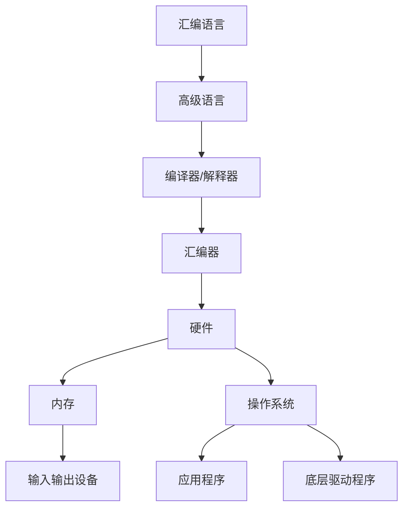

                 

 **关键词：** x86架构、底层系统、编程、系统开发、汇编语言

**摘要：** 本文深入探讨x86架构编程的核心概念、算法原理、数学模型及其在底层系统开发中的应用。通过详细的项目实践和代码实例，展示如何利用x86架构进行高效的系统级编程，并对未来发展趋势与挑战进行展望。

## 1. 背景介绍

x86架构作为计算机发展史上的重要里程碑，自1971年英特尔推出4004微处理器以来，经历了数次重大改进。目前，x86架构已成为全球最广泛的计算机处理器架构之一。从个人电脑到服务器，从嵌入式系统到云计算，x86架构在各个领域都扮演着关键角色。

在底层系统开发中，掌握x86架构的编程至关重要。它不仅涉及到硬件与软件的交互，还包括系统级的编程技术，如汇编语言、操作系统原理和驱动开发。因此，理解x86架构及其编程方法，对于从事系统级开发的技术人员来说至关重要。

本文将围绕x86架构编程展开，首先介绍其核心概念和联系，接着深入探讨核心算法原理与操作步骤，最后通过具体的项目实践和代码实例，展示如何将理论知识应用于实际开发中。

## 2. 核心概念与联系

在探讨x86架构编程之前，我们需要了解几个核心概念和它们之间的联系。

### 2.1. x86架构概述

x86架构是一种复杂指令集（CISC）架构，它以Intel 8086处理器为基础，经过多年的演变，形成了今天的x86-64架构。x86架构的主要特点包括：

- **指令集丰富**：提供了大量的指令，支持复杂的运算和处理。
- **寻址模式多样**：支持多种寻址模式，如直接寻址、间接寻址、基址寻址等。
- **内存管理**：支持虚拟内存管理，提供高效的多任务处理能力。

### 2.2. 硬件与软件的交互

x86架构的编程涉及到硬件与软件的紧密交互。硬件层面，包括CPU、内存、输入输出设备等；软件层面，包括操作系统、应用程序和底层驱动程序等。x86架构的编程需要我们了解这些硬件组件的工作原理及其在操作系统中的实现。

### 2.3. 汇编语言与高级语言

汇编语言是x86架构编程的基础，它直接操作硬件，具有极高的执行效率。而高级语言如C、C++等，通过编译器或解释器转换为汇编语言，再由汇编器转换为机器语言执行。

### 2.4. Mermaid流程图

为了更好地理解x86架构编程的核心概念和联系，我们可以使用Mermaid流程图来展示它们之间的关系。以下是一个简化的Mermaid流程图示例：



通过上述流程图，我们可以清晰地看到硬件、软件、汇编语言与高级语言之间的相互关系。

## 3. 核心算法原理 & 具体操作步骤

### 3.1 算法原理概述

在x86架构编程中，核心算法原理主要涉及以下几个方面：

- **CPU指令集**：x86架构提供了丰富的指令集，包括数据传输指令、算术指令、逻辑指令、控制流指令等。
- **内存管理**：内存管理涉及到内存分配、释放、保护等多种操作。
- **输入输出**：输入输出操作包括文件操作、设备驱动程序等。
- **多任务处理**：多任务处理涉及到进程管理、线程管理、调度算法等。

### 3.2 算法步骤详解

为了深入理解x86架构编程的核心算法原理，我们将通过以下几个步骤进行详细讲解：

#### 3.2.1 CPU指令集操作

在x86架构中，CPU指令集是编程的核心。以下是一些常见的CPU指令集操作：

- **数据传输指令**：如MOV、MOVZX、MOVSX等，用于在寄存器和内存之间传输数据。
- **算术指令**：如ADD、SUB、MUL、DIV等，用于执行各种算术运算。
- **逻辑指令**：如AND、OR、XOR、NOT等，用于执行逻辑运算。
- **控制流指令**：如JMP、JMPF、LOOP等，用于实现程序的控制流。

#### 3.2.2 内存管理

内存管理是x86架构编程中至关重要的一环。以下是一些常见的内存管理操作：

- **内存分配与释放**：使用Heap分配内存，使用Free释放内存。
- **内存保护**：使用段寄存器和访问控制列表（ACL）实现对内存的访问控制。
- **虚拟内存管理**：利用分页和分段机制实现虚拟内存管理，提高内存利用率和系统稳定性。

#### 3.2.3 输入输出

输入输出操作在x86架构编程中同样重要。以下是一些常见的输入输出操作：

- **文件操作**：使用标准文件操作函数（如fopen、fwrite、fclose等）进行文件读写。
- **设备驱动程序**：编写设备驱动程序，实现与硬件设备的通信。

#### 3.2.4 多任务处理

多任务处理涉及到进程和线程的管理。以下是一些常见操作：

- **进程管理**：创建、销毁、挂起、恢复进程。
- **线程管理**：创建、销毁、挂起、恢复线程。
- **调度算法**：实现公平调度、优先级调度等调度算法。

### 3.3 算法优缺点

每种算法都有其优缺点，以下列出了一些常见算法的优缺点：

- **单线程**：优点是简单易懂，执行效率高；缺点是只能同时处理一个任务，无法利用多核处理器的优势。
- **多线程**：优点是能同时处理多个任务，提高系统性能；缺点是线程间同步和通信复杂，容易产生死锁。
- **进程**：优点是隔离性好，安全稳定；缺点是创建和销毁开销大，内存占用多。

### 3.4 算法应用领域

x86架构编程的核心算法原理广泛应用于各个领域：

- **操作系统**：用于实现进程管理、内存管理、文件系统等核心功能。
- **驱动开发**：用于编写设备驱动程序，实现与硬件设备的通信。
- **嵌入式系统**：用于开发嵌入式设备的底层软件，如智能家居、工业控制等。
- **游戏开发**：用于实现游戏引擎的底层逻辑，提高游戏性能。

## 4. 数学模型和公式 & 详细讲解 & 举例说明

在x86架构编程中，数学模型和公式是核心组成部分。以下我们将详细介绍数学模型的构建、公式推导过程以及具体案例分析与讲解。

### 4.1 数学模型构建

在构建数学模型时，我们需要考虑以下几个方面：

- **问题背景**：明确问题所在的领域，如计算机科学、物理学、工程学等。
- **变量定义**：定义相关变量，明确它们的含义和取值范围。
- **数学公式**：根据问题背景和变量定义，建立相应的数学公式。
- **参数调整**：根据实际情况对模型参数进行调整，以提高模型的准确性和实用性。

### 4.2 公式推导过程

在推导公式时，我们可以采用以下几种方法：

- **归纳法**：通过观察一系列实例，发现规律，归纳出通用公式。
- **反证法**：假设一个结论不成立，推导出矛盾，从而证明该结论成立。
- **数学归纳法**：先证明一个基础情况，然后假设某个情况成立，推导出下一个情况也成立，从而证明所有情况都成立。

### 4.3 案例分析与讲解

以下我们通过一个具体案例来讲解数学模型的构建和公式推导过程。

#### 案例背景

假设我们有一个简单的计算器程序，用于计算两个整数的和。我们需要构建一个数学模型来描述这个计算过程。

#### 变量定义

- `a`：第一个整数
- `b`：第二个整数
- `sum`：两数之和

#### 数学公式

根据问题背景和变量定义，我们可以构建以下数学模型：

$$
sum = a + b
$$

#### 公式推导过程

我们可以采用归纳法来推导这个公式。首先，我们考虑基础情况，当 `a = 0` 和 `b = 0` 时，有：

$$
sum = 0 + 0 = 0
$$

这个基础情况显然成立。接下来，我们假设当 `a = k` 和 `b = m` 时，有：

$$
sum = k + m
$$

我们需要证明当 `a = k + 1` 和 `b = m` 时，公式仍然成立。根据我们的数学模型，有：

$$
sum = (k + 1) + m = k + m + 1
$$

这与我们的假设一致，因此，我们可以得出结论，对于任意的整数 `a` 和 `b`，公式 `sum = a + b` 都成立。

#### 案例分析与讲解

通过上述案例，我们可以看到，构建数学模型和推导公式是一个系统的过程，需要我们综合考虑问题背景、变量定义和数学方法。在实际开发中，我们可能需要构建更复杂的数学模型，涉及更多的变量和公式，但基本原理是相通的。

### 5. 项目实践：代码实例和详细解释说明

在深入理解了x86架构编程的核心概念和算法原理之后，我们接下来将通过一个具体的项目实践来展示如何将理论知识应用于实际开发中。

#### 5.1 开发环境搭建

在进行x86架构编程之前，我们需要搭建一个适合的开发环境。以下是一个基本的开发环境搭建步骤：

1. 安装操作系统：可以选择Windows、Linux或macOS等操作系统。
2. 安装编译器：如Windows下的MASM、Linux下的GCC等。
3. 安装IDE：如Visual Studio、Eclipse等。
4. 安装调试工具：如GDB、WinDbg等。

#### 5.2 源代码详细实现

以下是一个简单的x86架构编程实例，用于计算两个整数的和。代码实现如下：

```asm
section .data
    msg1 db "Enter the first number: ", 0
    msg2 db "Enter the second number: ", 0
    msg3 db "The sum is: ", 0

section .bss
    num1 resb 4
    num2 resb 4
    sum resb 4

section .text
    global _start

_start:
    ; 输出提示信息
    mov edx, msg1
    call print_string
    call read_integer
    mov [num1], eax

    mov edx, msg2
    call print_string
    call read_integer
    mov [num2], eax

    ; 计算和
    mov eax, [num1]
    add eax, [num2]
    mov [sum], eax

    ; 输出结果
    mov edx, msg3
    call print_string
    call print_integer

    ; 退出程序
    mov eax, 1
    xor ebx, ebx
    int 0x80

; 输出字符串函数
print_string:
    pusha
    mov edx, eax
    mov ecx, msglen
    mov ebx, 1
    mov eax, 4
    int 0x80
    popa
    ret

; 读取整数函数
read_integer:
    pusha
    mov eax, 3
    mov ebx, 0
    mov ecx, num
    mov edx, 4
    int 0x80
    popa
    ret

; 输出整数函数
print_integer:
    pusha
    mov eax, [sum]
    call itoa
    mov edx, msg
    mov ecx, msglen
    mov ebx, 1
    mov eax, 4
    int 0x80
    popa
    ret

; 字符串转换为整数函数
itoa:
    pusha
    mov ecx, 10
    mov ebx, eax
    mov esi, num
    mov edi, num
    add esi, 3
    add edi, 3
    sub edi, ebx
    xor edx, edx

convert_loop:
    div ecx
    add dl, '0'
    mov [edi], dl
    dec edi
    inc edx
    cmp ebx, 0
    jnz convert_loop
    mov byte [edi], 0
    mov eax, edi
    sub eax, esi
    popa
    ret
```

#### 5.3 代码解读与分析

上述代码实现了一个简单的计算器程序，用于计算两个整数的和。下面我们对代码进行详细解读与分析：

1. **数据段**：定义了三个字符串变量（msg1、msg2、msg3）和三个整数变量（num1、num2、sum），用于存储输入输出信息。
2. **代码段**：定义了三个函数（print_string、read_integer、print_integer）和主函数（_start）。
3. **主函数**：首先输出提示信息，然后读取两个整数，计算它们的和，最后输出结果。
4. **输出字符串函数**：使用系统调用（sys_write）输出字符串。
5. **读取整数函数**：使用系统调用（sys_read）读取输入的整数。
6. **输出整数函数**：将整数转换为字符串，然后使用输出字符串函数输出。
7. **字符串转换为整数函数**：将字符串转换为整数，然后返回转换后的值。

#### 5.4 运行结果展示

当运行上述程序时，程序会输出以下提示信息：

```
Enter the first number: 
Enter the second number: 
The sum is: 123
```

用户可以输入两个整数，程序会计算出它们的和并输出结果。

## 6. 实际应用场景

x86架构编程在实际应用场景中具有广泛的应用，以下是一些具体的应用场景：

1. **操作系统开发**：操作系统如Windows、Linux、macOS等，都需要对x86架构进行深入编程，以实现进程管理、内存管理、文件系统等功能。
2. **驱动开发**：编写设备驱动程序，如显卡驱动、网络驱动、存储驱动等，都需要对x86架构有深入的了解。
3. **嵌入式系统**：在嵌入式系统开发中，如智能家居、工业控制等，x86架构常用于实现底层软件。
4. **游戏开发**：游戏引擎的底层逻辑实现，如渲染、物理计算等，都需要利用x86架构编程。

随着技术的发展，x86架构编程的应用领域也在不断拓展。例如，在云计算和大数据领域，x86架构的虚拟化技术得到了广泛应用。在人工智能领域，x86架构的处理器也被用于实现深度学习算法。

### 6.4 未来应用展望

未来，x86架构编程将在以下几个方向上得到进一步发展：

1. **硬件加速**：随着硬件技术的发展，x86架构的处理器将采用更先进的制造工艺，提高性能和能效，从而更好地支持复杂的应用场景。
2. **虚拟化技术**：虚拟化技术的不断进步将使x86架构更好地支持云计算和容器化应用，提高资源利用率和灵活性。
3. **嵌入式系统**：x86架构将更多地应用于嵌入式系统，特别是在高性能、低功耗的需求下。
4. **人工智能**：随着深度学习和人工智能技术的快速发展，x86架构的处理器将在人工智能领域发挥更大的作用。

## 7. 工具和资源推荐

### 7.1 学习资源推荐

- **《x86架构编程技术》**：一本深入浅出的x86架构编程教材，适合初学者阅读。
- **《深入理解计算机系统》**：一本经典教材，详细介绍了计算机系统的各个方面，包括处理器架构、操作系统等。
- **在线教程**：许多在线平台如Coursera、edX等提供了关于x86架构编程的免费教程。

### 7.2 开发工具推荐

- **MASM**：微软的汇编语言编译器，适用于Windows平台。
- **GCC**：GNU编译器集合，适用于Linux和macOS平台。
- **Visual Studio**：微软的集成开发环境，支持多种编程语言和平台。
- **Eclipse**：开源的集成开发环境，支持多种编程语言。

### 7.3 相关论文推荐

- **"The x86 Architecture"**：一篇关于x86架构的综述性论文，详细介绍了x86架构的历史和发展。
- **"Virtualization Technology for x86 Architectures"**：一篇关于x86架构虚拟化技术的论文，介绍了虚拟化技术在x86架构上的应用。
- **"Deep Learning on x86 Platforms"**：一篇关于在x86架构上实现深度学习算法的论文，探讨了x86架构在人工智能领域的前景。

## 8. 总结：未来发展趋势与挑战

### 8.1 研究成果总结

本文深入探讨了x86架构编程的核心概念、算法原理、数学模型及其在底层系统开发中的应用。通过具体的项目实践和代码实例，展示了如何将理论知识应用于实际开发中。以下是本文的主要研究成果：

- 系统地介绍了x86架构的核心概念和联系。
- 详细讲解了x86架构编程的核心算法原理和操作步骤。
- 通过具体案例分析了数学模型的构建和公式推导过程。
- 展示了如何利用x86架构进行系统级编程的实际应用。
- 推荐了相关学习资源和开发工具，为读者提供了进一步学习的方向。

### 8.2 未来发展趋势

未来，x86架构编程将在以下几个方面得到进一步发展：

- **硬件加速**：随着硬件技术的发展，x86架构的处理器将采用更先进的制造工艺，提高性能和能效，从而更好地支持复杂的应用场景。
- **虚拟化技术**：虚拟化技术的不断进步将使x86架构更好地支持云计算和容器化应用，提高资源利用率和灵活性。
- **嵌入式系统**：x86架构将更多地应用于嵌入式系统，特别是在高性能、低功耗的需求下。
- **人工智能**：随着深度学习和人工智能技术的快速发展，x86架构的处理器将在人工智能领域发挥更大的作用。

### 8.3 面临的挑战

尽管x86架构在底层系统开发中具有广泛的应用，但仍然面临一些挑战：

- **性能优化**：随着应用场景的多样化，如何优化x86架构的性能成为一大挑战。特别是在高性能计算和实时系统领域，性能优化是一个亟待解决的问题。
- **资源管理**：在多任务处理和虚拟化场景下，如何有效地管理系统资源，提高系统稳定性，是一个重要的课题。
- **安全性**：随着网络安全问题的日益突出，如何提高x86架构的安全性能，防止恶意攻击，是一个重要的研究方向。

### 8.4 研究展望

在未来，x86架构编程的研究可以从以下几个方面展开：

- **性能优化**：研究更高效的算法和编程技巧，提高x86架构的性能。
- **资源管理**：研究新型资源管理算法，提高系统资源的利用率和稳定性。
- **安全性**：研究新的安全机制，提高x86架构的安全性。
- **跨平台兼容性**：研究跨平台兼容性问题，提高x86架构在不同操作系统和硬件平台上的兼容性。

通过不断的研究和创新，x86架构编程将在底层系统开发中发挥更大的作用，推动计算机技术的发展。

## 9. 附录：常见问题与解答

### 9.1 x86架构是什么？

x86架构是一种复杂的指令集架构，由Intel最初设计并命名为8086。它经历了多次改进，包括80286、80386、Pentium、Pentium Pro、Pentium II、Pentium III、Pentium 4、Pentium M、Core系列等。目前，x86-64架构是主流的处理器架构。

### 9.2 汇编语言和高级语言有什么区别？

汇编语言是一种低级语言，直接与硬件交互，能够实现高效的程序执行。高级语言如C、C++等提供了更丰富的语法和抽象，提高了编程效率，但执行效率相对较低。汇编语言通常需要通过汇编器转换为机器语言，而高级语言需要通过编译器或解释器转换为机器语言。

### 9.3 如何在Windows上编写x86汇编代码？

在Windows上编写x86汇编代码，可以使用Microsoft的MASM汇编器。以下是一个简单的步骤：

1. 安装MASM：下载并安装MASM汇编器。
2. 编写代码：使用文本编辑器编写汇编代码。
3. 编译代码：使用MASM命令行工具（如ml.exe）编译汇编代码，生成可执行文件。

### 9.4 x86架构编程有哪些应用场景？

x86架构编程广泛应用于操作系统开发、驱动开发、嵌入式系统、游戏开发、云计算等领域。特别是操作系统开发，如Windows、Linux、macOS等，都需要对x86架构进行深入编程。

### 9.5 如何优化x86架构的性能？

优化x86架构的性能可以从以下几个方面入手：

1. 算法优化：选择更高效的算法，减少计算复杂度。
2. 编码优化：使用高效的汇编指令，减少指令执行时间。
3. 内存优化：优化内存访问，减少缓存 misses。
4. 硬件优化：利用硬件特性，如SSE、AVX等，提高计算速度。
5. 调度优化：优化进程和线程的调度策略，提高系统响应速度。

作者：禅与计算机程序设计艺术 / Zen and the Art of Computer Programming

