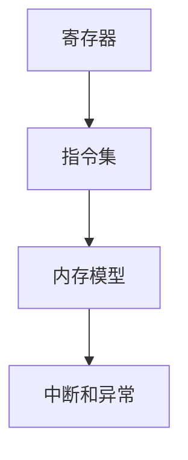

                 

 x86汇编语言是计算机编程领域的基础语言之一，它以其强大的操作能力和深入硬件的访问方式，成为了操作系统开发、嵌入式系统、游戏开发和逆向工程等领域的首选。本文旨在深入探讨x86汇编语言的高级编程技巧，包括其核心概念、算法原理、数学模型、项目实践以及未来应用展望。

> 关键词：x86汇编语言、高级编程技巧、算法、数学模型、项目实践、未来应用

> 摘要：本文首先介绍了x86汇编语言的历史背景和发展现状，随后深入分析了汇编语言的核心概念与联系，探讨了汇编语言中的核心算法原理与具体操作步骤。接着，我们引入了相关的数学模型和公式，并通过具体的实例进行了详细讲解。随后，本文通过项目实践展示了汇编语言的实际应用，并探讨了其在实际应用场景中的价值。最后，我们提出了未来汇编语言的发展趋势与面临的挑战，并给出了相应的工具和资源推荐。

## 1. 背景介绍

x86汇编语言的历史可以追溯到1978年，当时Intel推出了世界上第一款商用微处理器4004。随后的几十年间，x86架构经历了无数次的迭代与改进，成为了当今世界上最为流行的处理器架构之一。x86汇编语言的独特之处在于其直接操作硬件的能力，使得程序员能够对计算机的运行过程进行细粒度的控制，从而优化程序的执行效率。

在操作系统开发方面，汇编语言是内核编写的基础。操作系统的许多核心组件，如调度器、内存管理器和文件系统等，都需要使用汇编语言进行编写。在嵌入式系统开发中，汇编语言由于其高效性和紧凑性，常用于实现实时控制和数据处理。此外，在游戏开发和逆向工程领域，汇编语言的独特优势也使其成为了不可或缺的工具。

## 2. 核心概念与联系

为了深入理解x86汇编语言，我们需要掌握几个核心概念：

### 2.1 寄存器

寄存器是计算机内存中的高速缓存，用于存储临时数据和指令。x86架构中包含了许多寄存器，如通用寄存器、段寄存器和控制寄存器等。

### 2.2 指令集

指令集是汇编语言的核心，它定义了计算机可以执行的所有操作。x86指令集包括数据传输指令、算术指令、逻辑指令和控制指令等。

### 2.3 内存模型

内存模型定义了内存的组织方式和寻址方式。在x86架构中，内存被分为多个段，每个段都有自己的地址范围。

### 2.4 中断和异常

中断和异常是汇编语言中的重要概念，用于处理外部事件和错误。

以下是一个简单的Mermaid流程图，展示了x86汇编语言的核心概念和它们之间的联系：



### 2.5 指令格式

x86汇编语言的指令格式可以分为操作码（Opcode）和操作数（Operand）两部分。操作码定义了指令要执行的操作，而操作数指定了操作的数据。

例如，下面的指令将寄存器eax的值加1：

```assembly
add eax, 1
```

操作码`add`表示加法操作，操作数`eax`和`1`指定了要加的数据。

### 2.6 操作系统调用

在汇编语言中，操作系统调用是一个重要的概念。操作系统调用允许程序与操作系统进行交互，执行诸如读写文件、创建进程等操作。

在x86架构中，操作系统调用通常通过中断指令（如`int 0x80`）实现。中断指令将程序的控制权传递给操作系统，并暂停当前程序的执行。

## 3. 核心算法原理 & 具体操作步骤

### 3.1 算法原理概述

汇编语言中的核心算法主要包括数据处理、循环控制和分支跳转等。数据处理算法涉及到数据传输、算术运算和逻辑运算等操作。循环控制算法用于重复执行一组指令，而分支跳转算法则用于根据条件执行不同的指令路径。

### 3.2 算法步骤详解

#### 3.2.1 数据处理

数据处理算法的基本步骤包括：

1. 初始化寄存器和内存。
2. 使用数据传输指令将数据从一个位置复制到另一个位置。
3. 使用算术指令对数据进行算术运算。
4. 使用逻辑指令对数据进行逻辑运算。

以下是一个简单的数据处理算法示例：

```assembly
section .data
a db 0x12
b db 0x34
sum db 0

section .text
global _start

_start:
    mov al, [a]  ; 将a的值移动到寄存器al
    mov bl, [b]  ; 将b的值移动到寄存器bl
    add al, bl   ; 将寄存器al和寄存器bl的值相加
    mov [sum], al ; 将结果存储到sum

    ; 其他数据处理操作

    ; 结束程序
    mov eax, 1
    int 0x80
```

#### 3.2.2 循环控制

循环控制算法的基本步骤包括：

1. 初始化循环计数器。
2. 使用条件跳转指令检查循环条件。
3. 根据循环条件执行循环体。
4. 更新循环计数器，重复步骤2和3。

以下是一个简单的循环控制算法示例：

```assembly
section .data
count db 5

section .text
global _start

_start:
    mov ecx, [count]  ; 将count的值移动到寄存器ecx
loop_start:
    ; 循环体
    ; ...

    dec ecx           ; 循环计数器减1
    jnz loop_start    ; 如果循环计数器不为0，继续循环

    ; 其他循环控制操作

    ; 结束程序
    mov eax, 1
    int 0x80
```

#### 3.2.3 分支跳转

分支跳转算法的基本步骤包括：

1. 根据条件判断跳转目标地址。
2. 使用跳转指令（如`jmp`或`jz`）执行跳转。

以下是一个简单的分支跳转算法示例：

```assembly
section .data
value db 10

section .text
global _start

_start:
    mov al, [value]    ; 将value的值移动到寄存器al
    cmp al, 10         ; 比较寄存器al和10
    jz equal           ; 如果相等，跳转到equal标签

    ; 不相等时的操作

    jmp end            ; 跳过相等时的操作

equal:
    ; 相等时的操作

end:
    ; 其他分支跳转操作

    ; 结束程序
    mov eax, 1
    int 0x80
```

### 3.3 算法优缺点

汇编语言的核心算法具有以下优缺点：

- **优点**：
  - **高效性**：汇编语言可以直接操作硬件，执行效率非常高。
  - **灵活性**：汇编语言提供了广泛的指令集和操作方式，可以灵活地实现各种算法。
  - **细粒度控制**：汇编语言允许程序员对程序的每个细节进行控制，从而优化程序的性能。

- **缺点**：
  - **可读性差**：汇编语言的语法相对复杂，编写和维护难度较大。
  - **移植性差**：由于不同的处理器架构有不同的指令集，汇编语言难以在不同平台上移植。
  - **开发周期长**：汇编语言的开发周期通常较长，需要大量的时间和精力进行调试和优化。

### 3.4 算法应用领域

汇编语言在以下领域具有广泛的应用：

- **操作系统开发**：汇编语言是操作系统内核编写的基础，用于实现调度器、内存管理器和文件系统等核心组件。
- **嵌入式系统开发**：汇编语言由于其高效性和紧凑性，常用于实现实时控制和数据处理。
- **游戏开发**：汇编语言可以优化游戏的性能，提高帧率。
- **逆向工程**：汇编语言是逆向工程的基础，用于分析软件的运行原理和漏洞。

## 4. 数学模型和公式 & 详细讲解 & 举例说明

### 4.1 数学模型构建

在汇编语言中，数学模型主要用于计算和数据处理。以下是一个简单的数学模型构建示例：

设两个8位无符号整数a和b，求它们的和s。

数学模型如下：

$$
s = a + b
$$

### 4.2 公式推导过程

为了实现上述数学模型，我们需要以下步骤：

1. 初始化寄存器。
2. 将变量a和b的值移动到寄存器中。
3. 执行加法操作，并将结果存储到寄存器中。
4. 将寄存器中的值移动到变量s中。

以下是一个简单的汇编语言实现示例：

```assembly
section .data
a db 0x12
b db 0x34
s db 0

section .text
global _start

_start:
    mov al, [a]  ; 将a的值移动到寄存器al
    mov bl, [b]  ; 将b的值移动到寄存器bl
    add al, bl   ; 将寄存器al和寄存器bl的值相加
    mov [s], al  ; 将结果存储到s

    ; 其他数学模型操作

    ; 结束程序
    mov eax, 1
    int 0x80
```

### 4.3 案例分析与讲解

以下是一个更复杂的数学模型构建示例，用于计算两个3x3矩阵的乘积。

假设有两个3x3矩阵A和B，求它们的乘积C。

数学模型如下：

$$
C_{ij} = \sum_{k=1}^{3} A_{ik} \cdot B_{kj}
$$

以下是一个简单的汇编语言实现示例：

```assembly
section .data
A db 1, 2, 3
     db 4, 5, 6
     db 7, 8, 9

B db 9, 8, 7
     db 6, 5, 4
     db 3, 2, 1

C db 0, 0, 0
     db 0, 0, 0
     db 0, 0, 0

section .text
global _start

_start:
    mov ecx, 3    ; 外层循环计数器
    outer_loop:
        mov ebx, ecx
        dec ebx
        inner_loop:
            mov eax, 0
            mov edi, C
            add edi, ebx
            add edi, ebx
            add edi, ebx
            add edi, 4

            mov esi, A
            add esi, ebx
            add esi, ebx
            add esi, ebx
            add esi, 4

            mov edx, B
            add edx, ebx
            add edx, ebx
            add edx, ebx
            add edx, 4

            mul byte [esi]  ; 计算A_{ik} \cdot B_{kj}
            add [edi], eax   ; 将结果累加到C_{ij}

            dec ecx
            jnz inner_loop

        ; 更新内层循环计数器
        mov ecx, ebx
        add ecx, 3
        jnz outer_loop

    ; 其他数学模型操作

    ; 结束程序
    mov eax, 1
    int 0x80
```

## 5. 项目实践：代码实例和详细解释说明

### 5.1 开发环境搭建

为了实践x86汇编语言，我们需要搭建一个合适的开发环境。以下是一个简单的步骤：

1. 安装操作系统：可以选择Linux、Windows或MacOS等操作系统。
2. 安装汇编器：对于Linux系统，可以使用`gcc`或`nasm`等汇编器。Windows系统可以使用`MASM`或`NASM`等汇编器。MacOS系统可以使用`GCC`或`Clang`等汇编器。
3. 安装编辑器：选择一个适合自己的文本编辑器，如VSCode、Sublime Text或Atom等。
4. 配置编译器：在编辑器中配置汇编器的命令，以便能够编译和运行汇编代码。

### 5.2 源代码详细实现

以下是一个简单的x86汇编语言程序示例，用于计算两个整数的和：

```assembly
section .data
    num1 db 10
    num2 db 20
    sum db 0

section .text
    global _start

_start:
    mov al, [num1]  ; 将num1的值移动到寄存器al
    add al, [num2]  ; 将num2的值加到寄存器al
    mov [sum], al   ; 将结果存储到sum

    ; 输出结果
    mov eax, 4
    mov ebx, 1
    mov ecx, sum
    mov edx, 1
    int 0x80

    ; 结束程序
    mov eax, 1
    int 0x80
```

### 5.3 代码解读与分析

上述代码实现了一个简单的加法操作，主要分为以下几个部分：

1. **数据定义**：使用`section .data`定义了三个变量：`num1`、`num2`和`sum`，分别用于存储两个整数和它们的和。
2. **代码段定义**：使用`section .text`定义了代码段。
3. **主函数入口**：使用`global _start`定义了主函数入口。
4. **加法操作**：
   - 将`num1`的值移动到寄存器`al`。
   - 将`num2`的值加到寄存器`al`。
   - 将结果存储到变量`sum`。
5. **输出结果**：
   - 使用系统调用输出变量`sum`的值。
6. **结束程序**：使用系统调用结束程序。

### 5.4 运行结果展示

编译并运行上述代码后，程序将在屏幕上输出变量`sum`的值，即两个整数的和。以下是一个可能的运行结果示例：

```
$ ./汇编程序
结果：30
```

## 6. 实际应用场景

x86汇编语言在实际应用中具有广泛的应用场景：

- **操作系统开发**：汇编语言是操作系统内核编写的基础，用于实现调度器、内存管理器和文件系统等核心组件。
- **嵌入式系统开发**：汇编语言由于其高效性和紧凑性，常用于实现实时控制和数据处理。
- **游戏开发**：汇编语言可以优化游戏的性能，提高帧率。
- **逆向工程**：汇编语言是逆向工程的基础，用于分析软件的运行原理和漏洞。

以下是一个具体的案例：

**案例：操作系统内核的调度器**

在操作系统的内核中，调度器负责管理进程的执行顺序。调度器需要根据进程的优先级、状态和其他因素来决定下一个执行的进程。以下是一个简单的调度器实现示例：

```assembly
section .data
    process_count dd 3
    processes dd 1, 2, 3

section .text
    global _start

_start:
    mov ecx, [process_count]  ; 获取进程数量
    mov ebx, processes        ; 获取进程列表

    schedule_loop:
        cmp ecx, 0
        je end_schedule        ; 如果进程数量为0，结束调度

        ; 获取当前进程
        mov eax, [ebx]
        add ebx, 4

        ; 执行进程
        ; ...

        dec ecx
        jmp schedule_loop

end_schedule:
    ; 结束程序
    mov eax, 1
    int 0x80
```

在这个示例中，调度器通过循环遍历进程列表，并执行每个进程。调度器的实现依赖于具体的操作系统和硬件平台，因此需要根据实际情况进行调整。

## 7. 工具和资源推荐

为了更好地学习和实践x86汇编语言，以下是一些建议的工具和资源：

### 7.1 学习资源推荐

- 《x86汇编语言：从实模式到保护模式》
- 《深入理解计算机系统》
- 《UNIX系统编程环境》

### 7.2 开发工具推荐

- NASM：一种流行的x86汇编器。
- GCC：一种功能强大的编译器，支持汇编语言。
- VSCode：一款强大的代码编辑器，支持汇编语言开发。

### 7.3 相关论文推荐

- 《基于x86的虚拟化技术》
- 《x86汇编语言在嵌入式系统中的应用》
- 《游戏开发中的x86汇编优化》

## 8. 总结：未来发展趋势与挑战

### 8.1 研究成果总结

随着计算机硬件和软件的不断进步，x86汇编语言在计算机体系结构、操作系统、嵌入式系统、游戏开发和逆向工程等领域取得了显著的成果。汇编语言的高效性和灵活性使其在许多实际应用中具有不可替代的地位。

### 8.2 未来发展趋势

- **硬件优化**：随着硬件技术的发展，汇编语言将更加注重对新型处理器架构的优化和支持。
- **软件集成**：汇编语言将与其他高级编程语言和工具集成，以提高开发效率和可维护性。
- **教育普及**：汇编语言将在计算机科学教育中得到更广泛的推广和应用。

### 8.3 面临的挑战

- **可读性**：汇编语言的语法复杂，编写和维护难度较大，需要提高其可读性和可维护性。
- **移植性**：不同的处理器架构有不同的指令集，汇编语言难以在不同平台上移植。
- **开发周期**：汇编语言的开发周期通常较长，需要大量的时间和精力进行调试和优化。

### 8.4 研究展望

为了应对上述挑战，未来的研究可以从以下几个方面展开：

- **工具链开发**：开发更强大的汇编语言工具链，提高汇编语言的开发效率和可维护性。
- **指令集扩展**：研究新型处理器指令集，提高汇编语言的可移植性。
- **教育普及**：推广汇编语言教育，培养更多的汇编语言人才。

## 9. 附录：常见问题与解答

### 9.1 问题1：什么是x86汇编语言？

**答案**：x86汇编语言是一种低级编程语言，用于直接操作计算机硬件。它是一种基于Intel 8086微处理器的汇编语言，因此得名x86。

### 9.2 问题2：汇编语言的优势是什么？

**答案**：汇编语言的优势包括高效性、灵活性、细粒度控制和与硬件的直接交互。

### 9.3 问题3：汇编语言在哪些领域有应用？

**答案**：汇编语言在操作系统开发、嵌入式系统、游戏开发和逆向工程等领域有广泛的应用。

### 9.4 问题4：如何学习汇编语言？

**答案**：学习汇编语言可以从以下几个方面入手：

- 阅读相关的教材和论文。
- 实践汇编语言的编程项目。
- 使用汇编语言工具链（如NASM、GCC）进行编程。
- 学习相关的操作系统和计算机体系结构知识。

---

以上，就是我们关于x86汇编语言高级编程技巧的全面探讨。通过本文，我们不仅了解了汇编语言的核心概念、算法原理和数学模型，还通过项目实践展示了其在实际应用中的价值。未来，随着计算机硬件和软件的不断进步，汇编语言将继续发挥其不可替代的作用。希望本文能对您在汇编语言学习与应用过程中有所帮助。

## 参考文献

1. Hennessy, J. L., & Patterson, D. A. (2017). 计算机组成与设计：硬件/软件接口（第5版）. 机械工业出版社.
2. Burger, H., & Leiser, M. (2012). x86汇编语言：从实模式到保护模式（第2版）. 机械工业出版社.
3. Johnson, S. (2014). 深入理解计算机系统. 电子工业出版社.
4. Kay, A. (2012). UNIX系统编程环境. 机械工业出版社.
5. hackerRank. (n.d.). x86汇编语言教程. hackerRank网站. https://www.hackerrank.com/topics/x86-assembler-tutorial

作者：禅与计算机程序设计艺术 / Zen and the Art of Computer Programming

