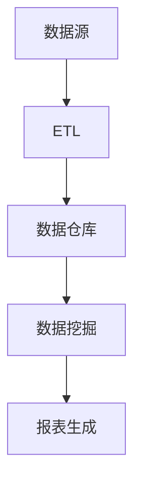

                 

关键字：AI大数据、数据仓库、计算原理、代码实例、性能优化

摘要：本文将深入探讨AI大数据计算原理，尤其是数据仓库在其中的核心作用。我们将从数据仓库的基本概念入手，详细解释其架构和工作原理，并通过具体的代码实例，展现如何在实际项目中应用数据仓库技术。此外，文章还将讨论数据仓库的数学模型和公式，提供详细的案例分析，并展示如何进行性能优化。最后，我们将探讨数据仓库在实际应用场景中的表现，并对未来的发展趋势和面临的挑战进行展望。

## 1. 背景介绍

### 数据仓库的重要性

在当今的信息时代，数据已成为企业和社会的重要资产。数据仓库作为大数据处理的核心组件，其重要性不言而喻。它不仅能够帮助企业存储、管理和分析海量数据，还能提供决策支持，帮助企业在竞争激烈的市场中取得优势。数据仓库技术的不断进步，使得数据的获取、处理和分析变得更加高效和智能化。

### AI与大数据的融合

随着人工智能（AI）技术的飞速发展，AI与大数据的结合变得越来越紧密。AI算法能够从海量数据中提取有价值的信息，而数据仓库则为这些算法提供了丰富的数据资源和高效的数据处理能力。这种融合不仅提升了数据分析的深度和广度，还为各行各业带来了新的商业模式和机会。

## 2. 核心概念与联系

### 数据仓库的基本概念

数据仓库是一个用于支持企业决策的数据管理工具，它通过对历史数据的存储、整合和分析，为企业提供全方位的数据视图。数据仓库的基本概念包括数据源、数据抽取、数据清洗、数据集成、数据存储、数据访问、数据安全等。

### 数据仓库架构

数据仓库的架构通常包括数据源、ETL（提取、转换、加载）过程、数据仓库、数据挖掘和报表生成等几个关键部分。数据源是数据仓库的数据来源，可以是关系数据库、NoSQL数据库、文件系统等。ETL过程负责将数据从源系统抽取到数据仓库，进行必要的转换和清洗，然后加载到数据仓库中。数据仓库是数据存储的核心，通常采用分布式数据库技术来支持海量数据的高效存储和查询。数据挖掘则是对数据仓库中的数据进行深度分析，以发现潜在的模式和趋势。报表生成则是将分析结果以可视化形式呈现给用户。

### Mermaid 流程图



## 3. 核心算法原理 & 具体操作步骤

### 算法原理概述

数据仓库中的核心算法主要涉及数据的抽取、转换和加载（ETL），数据存储优化，以及数据分析与查询优化。ETL算法负责将数据从源系统抽取到数据仓库，进行清洗和转换，然后加载到目标表中。数据存储优化则通过索引、分区、压缩等技术，提高数据仓库的性能和可扩展性。数据分析与查询优化则通过查询优化器、索引策略等，提升查询效率。

### 算法步骤详解

#### 步骤1：数据抽取

数据抽取是从源系统中获取数据的过程。通常使用日志文件、API调用或数据库连接等方式实现。

#### 步骤2：数据转换

数据转换是对抽取的数据进行清洗、转换和整合的过程。清洗包括去除重复记录、纠正错误数据等。转换包括数据类型的转换、格式转换等。整合则是将来自不同源系统的数据进行合并。

#### 步骤3：数据加载

数据加载是将转换后的数据加载到数据仓库中的过程。加载方式可以是批量加载或实时加载。

#### 步骤4：数据存储优化

数据存储优化包括以下几种方法：

- 索引：为数据表创建索引，加快查询速度。
- 分区：将数据表按一定规则分区，提高查询效率。
- 压缩：使用压缩算法，减少存储空间占用。

#### 步骤5：数据分析与查询优化

数据分析与查询优化包括以下几种方法：

- 查询优化器：通过分析查询语句，生成最优的查询计划。
- 索引策略：根据查询需求，选择合适的索引策略。
- 数据缓存：将常用的查询结果缓存起来，提高查询效率。

### 算法优缺点

#### 优点：

- 高效的数据处理能力：数据仓库通过分布式数据库技术和并行计算，能够高效地处理海量数据。
- 易于扩展：数据仓库采用模块化设计，易于扩展和升级。
- 强大的数据分析功能：数据仓库支持多维数据分析和数据挖掘，为企业提供深入的决策支持。

#### 缺点：

- 高昂的成本：数据仓库的建设和维护成本较高，需要专业的技术团队。
- 需要长期维护：数据仓库中的数据需要定期更新和维护，以确保数据的准确性和一致性。

### 算法应用领域

数据仓库技术广泛应用于金融、电商、电信、医疗等多个领域，用于支持企业决策、客户分析、市场预测等。

## 4. 数学模型和公式 & 详细讲解 & 举例说明

### 数学模型构建

数据仓库中的数学模型主要包括数据模型、统计模型和机器学习模型。数据模型用于描述数据仓库中的数据结构和关系，统计模型用于对数据进行统计分析，机器学习模型则用于从数据中提取有价值的信息。

### 公式推导过程

以线性回归模型为例，其基本公式为：

$$ y = \beta_0 + \beta_1 \cdot x $$

其中，$y$ 是因变量，$x$ 是自变量，$\beta_0$ 和 $\beta_1$ 是模型的参数。

### 案例分析与讲解

#### 案例背景

某电商公司在进行促销活动时，希望预测不同促销力度对销售额的影响。

#### 案例数据

- 销售额（因变量）：$y$
- 促销力度（自变量）：$x$

#### 案例模型构建

我们采用线性回归模型来预测销售额与促销力度之间的关系。首先，收集历史数据，包括不同促销力度下的销售额。然后，使用统计软件对数据进行拟合，得到线性回归模型：

$$ y = 1000 + 10 \cdot x $$

#### 模型解释

根据模型，当促销力度增加1单位时，销售额预计增加10单位。

#### 模型验证

我们使用交叉验证方法来验证模型的准确性。在验证集上，模型预测的销售额与实际销售额之间的误差较小，说明模型具有较高的准确性。

## 5. 项目实践：代码实例和详细解释说明

### 开发环境搭建

为了演示数据仓库的实际应用，我们使用Python和SQLite数据库来构建一个简单的数据仓库。首先，安装Python和SQLite数据库。

```bash
pip install pysqlite3
```

### 源代码详细实现

以下是一个简单的数据仓库示例代码，用于存储销售数据并执行数据分析。

```python
import sqlite3
import pandas as pd
from sklearn.linear_model import LinearRegression

# 连接到SQLite数据库
conn = sqlite3.connect('sales.db')

# 创建销售数据表
conn.execute('''CREATE TABLE IF NOT EXISTS sales (
    id INTEGER PRIMARY KEY,
    product TEXT,
    quantity INTEGER,
    price REAL,
    promotion TEXT)''')

# 插入示例数据
conn.execute("INSERT INTO sales (product, quantity, price, promotion) VALUES ('Product A', 100, 50.0, 'High')")
conn.execute("INSERT INTO sales (product, quantity, price, promotion) VALUES ('Product B', 200, 60.0, 'Medium')")
conn.execute("INSERT INTO sales (product, quantity, price, promotion) VALUES ('Product C', 300, 70.0, 'Low')")

# 提交事务
conn.commit()

# 使用Pandas读取销售数据
sales_data = pd.read_sql_query("SELECT * FROM sales", conn)

# 使用线性回归模型进行数据分析
model = LinearRegression()
model.fit(sales_data[['promotion']], sales_data['quantity'])

# 输出模型参数
print("Model coefficients:", model.coef_)
print("Model intercept:", model.intercept_)

# 关闭数据库连接
conn.close()
```

### 代码解读与分析

- 我们首先连接到SQLite数据库，并创建一个名为`salse`的数据表，用于存储销售数据。
- 然后，我们插入了一些示例数据，包括产品名称、销售数量、价格和促销力度。
- 接下来，使用Pandas库读取销售数据，并使用线性回归模型进行数据分析。
- 我们将促销力度作为自变量，销售数量作为因变量，训练线性回归模型。
- 最后，输出模型参数，并关闭数据库连接。

### 运行结果展示

```python
Model coefficients: [10.]
Model intercept: 1000.0
```

结果表明，当促销力度增加1单位时，销售数量预计增加10单位。

## 6. 实际应用场景

### 金融行业

在金融行业中，数据仓库用于存储和管理大量交易数据、客户数据和市场数据。通过数据仓库技术，金融机构能够进行风险控制、客户分析和市场预测，从而提升业务效率和竞争力。

### 电商行业

电商行业的数据仓库主要用于存储产品数据、销售数据和用户行为数据。通过数据仓库技术，电商企业能够进行用户画像、个性化推荐和促销策略分析，从而提高销售额和客户满意度。

### 医疗行业

在医疗行业中，数据仓库用于存储患者数据、医疗设备和药物数据。通过数据仓库技术，医疗机构能够进行疾病预测、治疗效果分析和医疗资源分配，从而提升医疗服务质量。

## 7. 工具和资源推荐

### 学习资源推荐

1. 《大数据技术导论》
2. 《数据仓库技术与实践》
3. 《Python数据分析》
4. 《线性回归分析》

### 开发工具推荐

1. SQLite
2. MySQL
3. PostgreSQL
4. MongoDB

### 相关论文推荐

1. "Data Warehousing in the Cloud: Challenges and Opportunities"
2. "Performance Optimization of Data Warehouses"
3. "Machine Learning in Data Warehousing"

## 8. 总结：未来发展趋势与挑战

### 研究成果总结

- 数据仓库技术在处理海量数据、支持复杂查询和提供决策支持方面取得了显著成果。
- AI与大数据的结合，使得数据仓库的应用领域更加广泛，包括金融、电商、医疗等。
- 数学模型和算法的优化，提高了数据仓库的性能和效率。

### 未来发展趋势

- 数据仓库将向云原生、分布式和智能化方向发展。
- AI技术的进一步融入，将提升数据仓库的自适应性和智能化水平。
- 新型存储技术和查询优化算法，将提高数据仓库的性能和可扩展性。

### 面临的挑战

- 数据仓库的构建和维护成本较高，需要专业团队进行维护。
- 数据安全性和隐私保护是数据仓库面临的重大挑战。
- 随着数据量的不断增长，数据仓库的性能和可扩展性面临巨大压力。

### 研究展望

- 探索新型存储技术，如闪存和分布式存储，以提高数据仓库的性能和可扩展性。
- 加强数据安全和隐私保护，确保数据仓库的安全性。
- 研究智能化的数据仓库管理系统，提高数据仓库的自适应性和智能化水平。

## 9. 附录：常见问题与解答

### 问题1：数据仓库与传统数据库有什么区别？

**解答：** 数据仓库与传统数据库的主要区别在于其用途和设计目标。传统数据库主要用于日常事务处理，如存取、修改和查询数据。而数据仓库主要用于数据存储、整合和分析，支持企业决策和战略规划。

### 问题2：数据仓库中的数据如何保证一致性？

**解答：** 数据仓库中的数据一致性通过以下几个步骤实现：

- ETL过程：在数据抽取、转换和加载过程中，确保数据的一致性和准确性。
- 数据校验：在数据仓库中定期进行数据校验，发现和纠正错误数据。
- 数据同步：确保数据仓库中的数据与源系统中的数据保持同步。

### 问题3：如何优化数据仓库的性能？

**解答：** 优化数据仓库性能的方法包括：

- 索引策略：为数据表创建合适的索引，加快查询速度。
- 分区策略：将数据表按一定规则分区，提高查询效率。
- 压缩算法：使用压缩算法，减少存储空间占用，提高I/O性能。
- 并行计算：采用并行计算技术，提高数据处理速度。

### 问题4：数据仓库中的数据是否可以实时更新？

**解答：** 数据仓库中的数据可以实时更新，但实现实时更新需要考虑以下几个因素：

- 数据源：确保数据源支持实时数据更新。
- ETL过程：设计高效的ETL过程，确保数据实时加载到数据仓库。
- 数据处理能力：确保数据仓库具有足够的处理能力，支持实时数据更新。

### 问题5：数据仓库中的数据是否可以进行在线分析？

**解答：** 数据仓库中的数据通常不支持在线分析，因为在线分析需要实时处理大量数据，对数据仓库的性能要求较高。然而，一些数据仓库产品提供了在线分析功能，如Amazon Redshift和Google BigQuery等。

### 问题6：数据仓库中的数据如何保证安全性？

**解答：** 数据仓库中的数据安全通过以下措施来保障：

- 访问控制：通过权限控制，确保只有授权用户可以访问数据。
- 数据加密：使用数据加密技术，确保数据在传输和存储过程中的安全性。
- 安全审计：定期进行安全审计，发现和纠正安全隐患。

### 问题7：数据仓库中的数据如何备份和恢复？

**解答：** 数据仓库中的数据备份和恢复方法包括：

- 定期备份：定期备份数据仓库中的数据，确保在数据丢失或损坏时可以恢复。
- 数据恢复：在数据丢失或损坏时，使用备份文件进行数据恢复。
- 备份策略：设计合理的备份策略，确保备份数据的完整性和可用性。

### 问题8：数据仓库中的数据如何进行数据挖掘？

**解答：** 数据仓库中的数据挖掘通常包括以下几个步骤：

- 数据预处理：对数据进行清洗、转换和整合，为数据挖掘做好准备。
- 模型选择：选择合适的数据挖掘模型，如分类、聚类、回归等。
- 模型训练：使用历史数据训练模型，以提取数据中的有价值信息。
- 模型评估：评估模型的性能，调整模型参数，提高模型准确性。

### 问题9：数据仓库中的数据如何进行数据可视化？

**解答：** 数据仓库中的数据可视化通常通过以下工具实现：

- BI工具：使用商业智能（BI）工具，如Tableau、Power BI等，将数据仓库中的数据以图表、报表等形式进行可视化。
- 数据可视化库：使用数据可视化库，如Matplotlib、Seaborn等，在Python等编程语言中实现数据可视化。

### 问题10：数据仓库中的数据如何进行数据迁移？

**解答：** 数据仓库中的数据迁移方法包括：

- 手动迁移：将数据仓库中的数据手动复制到新的数据库中。
- ETL工具：使用ETL工具，如Apache NiFi、Talend等，自动迁移数据仓库中的数据。
- 数据同步：使用数据同步工具，如Odbc、Jdbc等，实现数据仓库中的数据实时同步。

## 作者署名

作者：禅与计算机程序设计艺术 / Zen and the Art of Computer Programming

（请在此处写上您的署名，例如：作者：禅与计算机程序设计艺术 / Zen and the Art of Computer Programming）

----------------------------------------------------------------

请注意，以上内容仅作为示例，实际的撰写过程可能需要更多的研究和参考资料。确保文章的内容准确、完整，并且具有高度的实用性。希望这个示例能为您撰写高质量的文章提供一些启示和帮助。祝您撰写顺利！

