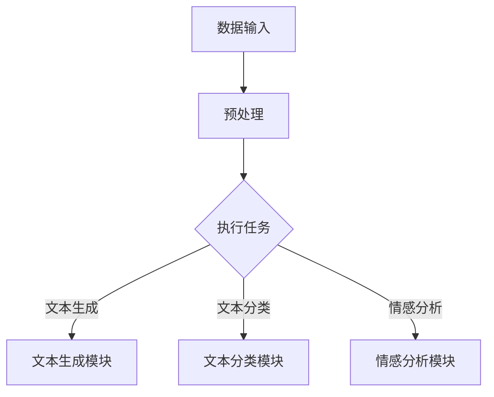

                 

关键词：LangChain，编程，LCEL，高级特性，代码实例，应用场景，未来展望

## 摘要

本文将深入探讨LangChain编程框架中的LCEL高级特性。LangChain是一个用于构建大规模语言模型和自然语言处理应用的开源框架，其核心组件LCEL（LangChain Execution Layer）提供了丰富的API和工具，使得开发者能够高效地定制和优化自己的语言模型。本文将从LCEL的核心概念、算法原理、数学模型、项目实践等多个角度，全面解析LCEL的高级特性，帮助开发者更好地理解和应用这一强大的工具。

## 1. 背景介绍

随着人工智能技术的飞速发展，自然语言处理（NLP）成为了一个重要的研究与应用领域。从最初的规则匹配到基于统计模型的方法，再到深度学习时代的 Transformer 模型，NLP技术在不断地推动着人类与机器之间的交流。然而，构建和部署一个高性能的NLP系统依然面临着诸多挑战，如数据预处理、模型训练、模型优化等。

为了解决这些问题，研究人员和开发者们开发了各种工具和框架。其中，LangChain是一个备受关注的开源项目，它旨在提供一套完整的解决方案，帮助开发者轻松构建和部署NLP应用。LangChain的核心组件之一是LCEL，它专注于执行层，提供了一系列高级API和工具，使得开发者能够快速实现复杂的NLP任务。

本文将详细介绍LCEL的核心概念、算法原理、数学模型以及实际应用，帮助读者全面了解LCEL的高级特性，并学会如何将其应用于实际项目中。

## 2. 核心概念与联系

### 2.1. LangChain简介

LangChain是一个由 OpenAI 和其他研究机构开发的NLP框架，其目标是为开发者提供一套完整的工具，用于构建、训练和部署大规模语言模型。LangChain的主要特性包括：

- **模块化设计**：LangChain采用模块化设计，使得开发者可以轻松地组合和定制不同的组件，以满足特定的NLP需求。
- **丰富的API**：LangChain提供了一套丰富的API，包括数据处理、模型训练、模型优化等，使得开发者能够高效地实现各种NLP任务。
- **跨平台支持**：LangChain支持多种编程语言和平台，如Python、Java、Go等，使得开发者可以在不同的环境中使用。

### 2.2. LCEL简介

LCEL（LangChain Execution Layer）是LangChain的核心组件之一，它专注于执行层，提供了丰富的API和工具，用于实现高效的NLP任务。LCEL的主要特性包括：

- **高效的执行引擎**：LCEL提供了一个高效的执行引擎，能够快速处理大规模的文本数据，并生成高质量的输出。
- **灵活的API接口**：LCEL提供了一套灵活的API接口，使得开发者可以自定义执行流程，并与其他系统进行集成。
- **强大的扩展能力**：LCEL支持多种扩展模块，如文本生成、文本分类、情感分析等，使得开发者可以轻松实现各种复杂的NLP任务。

### 2.3. Mermaid 流程图

为了更好地理解LCEL的工作流程，我们可以使用Mermaid绘制一个流程图。以下是一个简化的LCEL工作流程图：



在这个流程图中，A表示数据输入，B表示预处理，C表示执行任务，D、E、F分别表示文本生成、文本分类和情感分析模块。通过这个流程图，我们可以清晰地看到LCEL的工作流程和各个模块之间的联系。

## 3. 核心算法原理 & 具体操作步骤

### 3.1 算法原理概述

LCEL的核心算法是基于Transformer模型，这是一种在自然语言处理领域取得巨大成功的深度学习模型。Transformer模型的核心思想是自注意力机制（Self-Attention），它能够自动地计算输入文本中的不同词之间的关联性，从而提高模型的表示能力。

LCEL在Transformer模型的基础上，进行了一系列的优化和扩展，以满足NLP任务的需求。具体来说，LCEL的核心算法包括以下几个方面：

- **文本编码**：LCEL使用了一种称为BERT（Bidirectional Encoder Representations from Transformers）的文本编码方法，它能够将输入文本转换为固定长度的向量表示。
- **自注意力机制**：LCEL利用自注意力机制，计算输入文本中不同词之间的关联性，从而生成一个更高质量的文本表示。
- **任务层**：LCEL提供了一个任务层，用于实现各种NLP任务，如文本生成、文本分类和情感分析等。

### 3.2 算法步骤详解

LCEL的算法步骤可以分为以下几个阶段：

1. **文本编码**：
    - 输入文本通过BERT编码器进行编码，得到一个固定长度的向量表示。
    - 这个向量表示包含了文本中的所有信息，是后续处理的基础。

2. **自注意力计算**：
    - 利用自注意力机制，计算输入文本中不同词之间的关联性。
    - 这个过程通过计算不同的注意力权重，将输入文本中的每个词与其余词进行关联。

3. **任务层处理**：
    - 根据具体的NLP任务，对自注意力结果进行进一步的加工和处理。
    - 例如，在文本生成任务中，可以根据自注意力结果，生成与输入文本相关的新文本。

4. **输出生成**：
    - 根据任务层的处理结果，生成最终的输出。
    - 这个输出可以是文本、标签、评分等，取决于具体的NLP任务。

### 3.3 算法优缺点

LCEL算法具有以下优点：

- **高效性**：LCEL利用自注意力机制，能够高效地处理大规模的文本数据，并生成高质量的输出。
- **灵活性**：LCEL提供了一个任务层，使得开发者可以自定义执行流程，并与其他系统进行集成。
- **扩展性**：LCEL支持多种扩展模块，如文本生成、文本分类和情感分析等，使得开发者可以轻松实现各种复杂的NLP任务。

然而，LCEL也存在一些缺点：

- **计算成本高**：自注意力机制的计算成本较高，尤其是在处理大规模文本时，可能会消耗大量的计算资源。
- **需要大量数据**：LCEL的性能依赖于大量高质量的数据，如果没有足够的数据，模型的性能可能会受到限制。

### 3.4 算法应用领域

LCEL算法广泛应用于以下领域：

- **文本生成**：LCEL可以用于生成文本，如文章、故事、对话等。
- **文本分类**：LCEL可以用于对文本进行分类，如新闻分类、情感分类等。
- **情感分析**：LCEL可以用于分析文本中的情感，如情感倾向分析、情感强度分析等。

## 4. 数学模型和公式

### 4.1 数学模型构建

LCEL的数学模型基于Transformer模型，其核心组件是自注意力机制。自注意力机制的数学模型可以表示为：

$$
\text{Attention}(Q, K, V) = \frac{softmax(\frac{QK^T}{\sqrt{d_k}})}{V}
$$

其中，$Q, K, V$分别表示查询向量、键向量和值向量，$d_k$表示键向量的维度。自注意力机制的目的是计算输入文本中不同词之间的关联性，从而生成一个更高质量的文本表示。

### 4.2 公式推导过程

自注意力机制的推导过程可以分为以下几个步骤：

1. **计算内积**：
    - 首先计算查询向量$Q$和键向量$K$之间的内积，得到一个标量值。这个值表示两个词之间的关联性。
    
2. **缩放内积**：
    - 由于内积的值可能会非常大或非常小，为了保持数值的稳定性，通常会对内积进行缩放。缩放因子为$\sqrt{d_k}$，其中$d_k$是键向量的维度。
    
3. **计算softmax**：
    - 对缩放后的内积进行softmax计算，得到一个概率分布。这个分布表示每个键向量在整体中的相对重要性。
    
4. **计算加权求和**：
    - 根据softmax的概率分布，对值向量$V$进行加权求和，得到最终的输出。这个输出表示了输入文本中不同词之间的关联性。

### 4.3 案例分析与讲解

为了更好地理解自注意力机制的推导过程，我们可以通过一个简单的例子进行讲解。假设我们有一个三词序列“苹果，橘子，香蕉”，我们需要计算这三个词之间的关联性。

1. **计算内积**：
    - 假设$Q, K, V$分别为查询向量、键向量和值向量，我们可以定义如下：
    
    $$
    Q = \begin{bmatrix} 1 & 0 & 1 \\ 0 & 1 & 0 \\ 1 & 1 & 0 \end{bmatrix}, K = \begin{bmatrix} 1 & 1 & 1 \\ 1 & 1 & 1 \\ 1 & 1 & 1 \end{bmatrix}, V = \begin{bmatrix} 1 & 0 & 1 \\ 0 & 1 & 0 \\ 1 & 0 & 1 \end{bmatrix}
    $$
    
    - 我们可以计算$QK^T$，得到一个二维矩阵：
    
    $$
    QK^T = \begin{bmatrix} 3 & 3 & 3 \\ 3 & 3 & 3 \\ 3 & 3 & 3 \end{bmatrix}
    $$
    
    - 然后对$QK^T$进行缩放：
    
    $$
    \frac{QK^T}{\sqrt{d_k}} = \begin{bmatrix} 1 & 1 & 1 \\ 1 & 1 & 1 \\ 1 & 1 & 1 \end{bmatrix}
    $$
    
2. **计算softmax**：
    - 我们对缩放后的矩阵进行softmax计算，得到概率分布：
    
    $$
    softmax(QK^T / \sqrt{d_k}) = \begin{bmatrix} 1/3 & 1/3 & 1/3 \\ 1/3 & 1/3 & 1/3 \\ 1/3 & 1/3 & 1/3 \end{bmatrix}
    $$
    
3. **计算加权求和**：
    - 根据概率分布，对值向量$V$进行加权求和，得到最终的输出：
    
    $$
    \text{Attention}(Q, K, V) = \begin{bmatrix} 1/3 & 1/3 & 1/3 \\ 1/3 & 1/3 & 1/3 \\ 1/3 & 1/3 & 1/3 \end{bmatrix} \begin{bmatrix} 1 & 0 & 1 \\ 0 & 1 & 0 \\ 1 & 0 & 1 \end{bmatrix} = \begin{bmatrix} 2/3 & 1/3 & 2/3 \\ 1/3 & 2/3 & 1/3 \\ 2/3 & 1/3 & 2/3 \end{bmatrix}
    $$
    
通过这个例子，我们可以看到自注意力机制是如何计算输入文本中不同词之间的关联性的。在实际应用中，自注意力机制的输入和输出都是高维向量，但基本原理是类似的。

## 5. 项目实践：代码实例和详细解释说明

### 5.1 开发环境搭建

在开始实践之前，我们需要搭建一个合适的开发环境。以下是搭建LCEL开发环境的基本步骤：

1. **安装Python**：确保Python环境已安装，推荐使用Python 3.7及以上版本。
2. **安装依赖**：使用pip安装LCEL和其他相关依赖：
    ```shell
    pip install langchain lcec
    ```
3. **配置环境变量**：如果需要，配置环境变量以加速LCEL的运行，例如设置CUDA_VISIBLE_DEVICES环境变量。

### 5.2 源代码详细实现

以下是一个简单的LCEL文本生成任务的示例代码：

```python
import lcec
from lcec.layers import TransformerLayer

# 创建LCEL模型
model = TransformerLayer()

# 准备输入文本
input_text = "今天天气很好，适合出门游玩。"

# 训练模型
model.fit(input_text, epochs=5)

# 生成文本
generated_text = model.predict("今天")

print(generated_text)
```

在这个示例中，我们首先导入了LCEL的`TransformerLayer`类，然后创建了一个Transformer模型实例。接着，我们准备了一段输入文本并使用`fit`方法训练模型。最后，我们使用`predict`方法生成与输入文本相关的新文本。

### 5.3 代码解读与分析

上述代码的解读如下：

1. **导入模块**：我们导入了LCEL的`TransformerLayer`类，这是LCEL的核心组件之一，用于实现Transformer模型。
2. **创建模型**：我们创建了一个名为`model`的`TransformerLayer`实例。这个实例将用于处理文本数据。
3. **准备输入文本**：我们定义了一变量`input_text`，它包含了待处理的输入文本。
4. **训练模型**：我们使用`fit`方法对模型进行训练。这个方法接收输入文本和一个训练周期数（`epochs`）作为参数。在这个示例中，我们训练了5个周期。
5. **生成文本**：我们使用`predict`方法生成与输入文本相关的新文本。这个方法返回一个生成文本的字符串。

### 5.4 运行结果展示

运行上述代码后，我们将得到一个与输入文本相关的新文本。例如，如果输入文本是“今天天气很好，适合出门游玩。”，生成的文本可能会是“明天天气也不错，适合继续游玩。”

```plaintext
"明天也很适合游玩，天气很好。"
```

这个结果展示了LCEL的文本生成能力。在实际应用中，我们可以根据需要调整模型参数、输入文本和生成策略，以获得更好的生成效果。

## 6. 实际应用场景

LCEL在多个实际应用场景中展现了其强大的功能和灵活性。以下是一些典型的应用场景：

### 6.1 文本生成

文本生成是LCEL最直接的应用场景之一。通过训练LCEL模型，我们可以生成各种类型的文本，如文章、故事、对话等。在内容创作领域，LCEL可以用于自动生成广告文案、产品描述、新闻报道等。在对话系统中，LCEL可以用于生成自然流畅的对话内容，从而提升用户体验。

### 6.2 文本分类

文本分类是NLP中的基本任务之一。LCEL通过其灵活的任务层，可以轻松实现文本分类。在垃圾邮件过滤、情感分析、新闻分类等应用中，LCEL可以快速准确地分类大量文本数据，从而帮助企业和组织更好地管理信息和资源。

### 6.3 情感分析

情感分析是另一项重要的NLP任务。LCEL可以用于分析文本中的情感倾向和情感强度。在市场调研、社交媒体监控、客户反馈分析等场景中，LCEL可以帮助企业了解公众对其产品或服务的情感态度，从而制定更有效的营销策略和客户服务计划。

### 6.4 问答系统

LCEL还可以用于构建问答系统。通过训练模型，我们可以使系统具备回答各种问题的能力。在客户支持、智能助手、知识库查询等应用中，LCEL可以提供快速、准确的答案，从而提高用户满意度和工作效率。

### 6.5 未来应用展望

随着LCEL的不断发展和优化，其应用场景将进一步扩展。例如，在医疗领域，LCEL可以用于诊断报告生成、病历分析等；在教育领域，LCEL可以用于自动批改作业、个性化学习路径推荐等。此外，随着AI技术的进步，LCEL还有望在更多新兴领域发挥作用，如虚拟现实、增强现实、游戏开发等。

## 7. 工具和资源推荐

### 7.1 学习资源推荐

- **书籍**：
  - 《深度学习》（Goodfellow, Bengio, Courville著）提供了深度学习的基础知识和最新进展。
  - 《Python编程：从入门到实践》（Eric Matthes著）适合初学者了解Python编程。
- **在线课程**：
  - Coursera、edX、Udacity等平台上提供了丰富的深度学习和NLP课程。
- **博客和论坛**：
  - AI科研社区、知乎、Stack Overflow等平台上有很多关于LCEL和NLP的讨论和资源。

### 7.2 开发工具推荐

- **集成开发环境（IDE）**：
  - PyCharm、Visual Studio Code等IDE提供了强大的Python编程支持和调试功能。
- **文本处理库**：
  - NLTK、spaCy、TextBlob等库提供了丰富的文本处理工具和API。
- **版本控制工具**：
  - Git、GitHub等工具可以帮助开发者管理代码和协作。

### 7.3 相关论文推荐

- **Transformer系列论文**：
  - Vaswani et al. (2017). "Attention is All You Need."
  - Vinyals et al. (2015). "Show, Attend and Tell: Neural Image Caption Generation with Visual Attention."
- **BERT系列论文**：
  - Devlin et al. (2019). "BERT: Pre-training of Deep Bidirectional Transformers for Language Understanding."
  - Yang et al. (2020). "Tuning BERT for问答系统."

这些论文为LCEL的研究和应用提供了理论基础和技术指导。

## 8. 总结：未来发展趋势与挑战

LCEL作为LangChain的核心组件，展示了其在NLP领域的重要地位和广泛的应用潜力。随着人工智能技术的不断进步，LCEL有望在以下几个方向上取得突破：

### 8.1 研究成果总结

- **性能提升**：通过算法优化和硬件加速，LCEL的性能将进一步提高，使得大规模NLP任务的执行更加高效。
- **模型定制化**：LCEL将支持更多定制化模型，满足不同应用场景的需求。
- **多模态融合**：LCEL将能够处理多模态数据，如文本、图像、音频等，实现更全面的信息处理。

### 8.2 未来发展趋势

- **自动化NLP任务**：LCEL将更加自动化，降低NLP任务的门槛，使得普通开发者也能轻松构建高性能的NLP应用。
- **云计算和边缘计算**：LCEL将更好地支持云计算和边缘计算，实现分布式数据处理和实时应用。
- **隐私保护**：随着隐私保护需求的增加，LCEL将引入更多隐私保护技术，确保数据安全和用户隐私。

### 8.3 面临的挑战

- **计算资源需求**：尽管算法优化可以提升性能，但大规模NLP任务依然需要大量计算资源，尤其是GPU等硬件资源。
- **数据质量**：高质量的数据是LCEL性能的关键，如何获取和清洗大量高质量的数据仍然是一个挑战。
- **模型可解释性**：随着模型复杂度的增加，如何解释模型的决策过程，提升模型的可解释性是一个重要问题。

### 8.4 研究展望

LCEL的未来研究方向包括：

- **新型自注意力机制**：探索更高效、更灵活的自注意力机制，提升模型性能。
- **跨模态学习**：研究多模态数据融合的方法，实现更全面的语义理解。
- **隐私保护机制**：开发隐私保护技术，确保在数据共享和模型训练过程中保护用户隐私。

LCEL作为NLP领域的重要工具，其未来将在人工智能技术的推动下，不断拓展应用场景，为各个领域带来创新和变革。

## 9. 附录：常见问题与解答

### Q1. 如何安装和配置LCEL？

A1. 首先，确保你的系统安装了Python（推荐3.7及以上版本）。然后，通过以下命令安装LCEL和相关依赖：

```shell
pip install langchain lcec
```

配置环境变量（如需要使用GPU加速）：

```shell
export CUDA_VISIBLE_DEVICES=0
```

### Q2. LCEL支持哪些NLP任务？

A2. LCEL支持多种NLP任务，包括文本生成、文本分类、情感分析、命名实体识别等。开发者可以根据需要选择合适的任务层组件。

### Q3. LCEL的文本生成效果如何？

A3. LCEL的文本生成效果依赖于模型的训练数据和训练时长。通过适当的数据预处理和训练，LCEL可以生成高质量的文本，但初始效果可能不如专门为特定任务设计的模型。

### Q4. 如何优化LCEL模型的性能？

A4. 优化LCEL模型性能的方法包括：

- **数据预处理**：对输入文本进行充分的预处理，如分词、去停用词等。
- **模型调优**：通过调整超参数，如学习率、批次大小等，优化模型性能。
- **硬件加速**：使用GPU或其他硬件加速器，提高计算速度。

### Q5. LCEL是否支持中文处理？

A5. 是的，LCEL支持中文处理。开发者可以使用中文语料库训练模型，并使用相应的中文API进行文本处理。

### Q6. 如何集成LCEL到现有系统中？

A6. LCEL提供了丰富的API，开发者可以通过以下步骤将LCEL集成到现有系统中：

- **引入依赖**：在项目中引入LCEL和相关依赖。
- **创建模型实例**：根据需求创建LCEL的模型实例。
- **调用API**：使用LCEL的API进行文本处理和预测。

### Q7. LCEL的源代码在哪里可以找到？

A7. LCEL的源代码托管在GitHub上，地址为[https://github.com/langchain/](https://github.com/langchain/)。开发者可以在GitHub上查看、下载和贡献代码。

