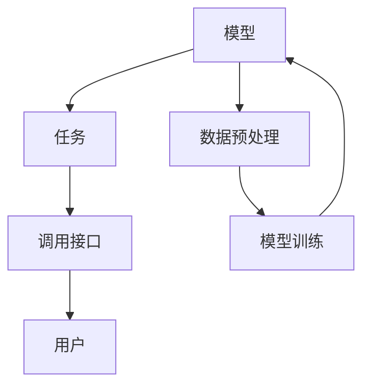

                 

 > **关键词**：LangChain，编程，实践，invoke，入门，算法原理，应用领域，数学模型，代码实例，未来展望。

> **摘要**：本文旨在为读者提供一份详尽的LangChain编程指南，从基础概念到具体实现，帮助读者深入了解并掌握LangChain编程技术。本文将详细介绍LangChain的核心概念、算法原理、数学模型、项目实践以及未来应用展望，助力读者在人工智能领域取得更大的突破。

## 1. 背景介绍

随着人工智能技术的不断发展，自然语言处理（NLP）成为了一个备受关注的研究领域。在NLP中，生成式模型和检索式增强的生成式模型（简称ReGPT）正逐渐成为主流。LangChain是一个基于LLaMA模型的工具包，它旨在简化这些复杂模型的部署和使用，使得研究人员和开发者能够更加高效地进行自然语言处理任务。

本文将详细介绍LangChain的编程技术，从基础概念到具体实现，帮助读者掌握LangChain的使用方法和技巧。通过本文的阅读，读者将能够了解LangChain的核心概念、算法原理、数学模型以及实际应用场景，从而为后续的研究和实践打下坚实的基础。

## 2. 核心概念与联系

### 2.1 LangChain的核心概念

LangChain的核心概念包括：

- **模型**：LangChain基于大规模预训练模型，如LLaMA模型，这些模型具有强大的自然语言处理能力。
- **任务**：LangChain支持多种自然语言处理任务，如文本生成、问答、翻译等。
- **调用接口**：LangChain提供了一套统一的调用接口，使得开发者可以方便地使用这些模型。

### 2.2 LangChain的架构

以下是LangChain的架构图，其中包含主要组件和它们之间的联系：



- **模型**：LangChain基于大规模预训练模型，如LLaMA模型，这些模型具有强大的自然语言处理能力。
- **任务**：LangChain支持多种自然语言处理任务，如文本生成、问答、翻译等。
- **调用接口**：LangChain提供了一套统一的调用接口，使得开发者可以方便地使用这些模型。
- **数据预处理**：数据预处理是模型训练的重要环节，包括数据清洗、数据标注等。
- **模型训练**：模型训练是提高模型性能的关键步骤，通过不断优化模型参数，提高模型对数据的拟合程度。

## 3. 核心算法原理 & 具体操作步骤

### 3.1 算法原理概述

LangChain的核心算法原理是基于大规模预训练模型，如LLaMA模型。这些模型通过在大量文本数据上进行预训练，学习到了丰富的语言知识和模式，从而能够对新的文本数据进行有效处理。

具体来说，LangChain的核心算法原理包括以下几个步骤：

1. **数据预处理**：将输入文本数据进行清洗、分词、编码等处理，使其符合模型的输入要求。
2. **模型输入**：将预处理后的文本数据输入到预训练模型中，模型会根据输入数据生成对应的输出。
3. **模型输出**：根据模型的输出结果，进行后处理，如解码、格式化等，得到最终的输出结果。

### 3.2 算法步骤详解

以下是LangChain的核心算法步骤：

1. **数据预处理**：
   - 清洗文本数据，去除无关内容。
   - 分词，将文本拆分为单词或短语。
   - 编码，将文本转换为模型可以处理的数字序列。

2. **模型输入**：
   - 将编码后的文本输入到预训练模型中。
   - 模型会根据输入文本生成对应的输出。

3. **模型输出**：
   - 对模型输出进行解码，将其转换为可读的文本格式。
   - 对输出文本进行格式化，使其符合用户需求。

### 3.3 算法优缺点

**优点**：

- **高效性**：LangChain基于大规模预训练模型，能够快速处理大量文本数据。
- **灵活性**：LangChain支持多种自然语言处理任务，能够适应不同的应用场景。
- **易用性**：LangChain提供了一套统一的调用接口，使得开发者可以方便地使用。

**缺点**：

- **计算资源消耗**：大规模预训练模型需要大量的计算资源和存储空间。
- **训练时间较长**：模型训练需要较长的训练时间，且训练过程复杂。

### 3.4 算法应用领域

LangChain在自然语言处理领域有广泛的应用，包括但不限于：

- **文本生成**：如文章撰写、邮件回复等。
- **问答系统**：如智能客服、问答机器人等。
- **翻译**：如机器翻译、多语言转换等。

## 4. 数学模型和公式 & 详细讲解 & 举例说明

### 4.1 数学模型构建

LangChain的核心数学模型是基于大规模预训练模型，如LLaMA模型。这些模型通过在大量文本数据上进行预训练，学习到了丰富的语言知识和模式。具体来说，LLaMA模型是一个自回归语言模型，其数学模型可以表示为：

\[ P(\text{word}_i | \text{word}_1, \text{word}_2, \ldots, \text{word}_{i-1}) = \frac{e^{\text{model}(\text{word}_i | \text{word}_1, \text{word}_2, \ldots, \text{word}_{i-1})}}{\sum_{j=1}^{V} e^{\text{model}(\text{word}_j | \text{word}_1, \text{word}_2, \ldots, \text{word}_{i-1})}} \]

其中，\(\text{word}_i\)表示第\(i\)个单词，\(\text{model}(\text{word}_i | \text{word}_1, \text{word}_2, \ldots, \text{word}_{i-1})\)表示模型在给定前\(i-1\)个单词的情况下预测第\(i\)个单词的概率。

### 4.2 公式推导过程

LLaMA模型的数学模型基于神经网络，通过多层感知器（MLP）对输入数据进行建模。具体推导过程如下：

1. **输入层**：将输入文本数据编码为向量，每个向量表示一个单词或短语。
2. **隐藏层**：通过多层感知器对输入向量进行建模，得到预测概率。
3. **输出层**：将隐藏层的输出映射到单词的概率分布。

具体推导如下：

\[ \text{model}(\text{word}_i | \text{word}_1, \text{word}_2, \ldots, \text{word}_{i-1}) = \text{softmax}(\text{MLP}(\text{word}_1, \text{word}_2, \ldots, \text{word}_{i-1})) \]

其中，\(\text{MLP}\)表示多层感知器，\(\text{softmax}\)表示将隐藏层输出映射到概率分布。

### 4.3 案例分析与讲解

假设有一个简化的LLaMA模型，其输入层有5个神经元，隐藏层有10个神经元，输出层有3个神经元。输入文本为“今天天气很好”。我们使用该模型预测下一个单词。

1. **输入层编码**：
   - 将“今天”编码为[1, 0, 0, 0, 0]。
   - 将“天气”编码为[0, 1, 0, 0, 0]。
   - 将“很好”编码为[0, 0, 1, 0, 0]。

2. **隐藏层计算**：
   - 输入层到隐藏层的权重矩阵为\(W_1\)。
   - 隐藏层到输出层的权重矩阵为\(W_2\)。

   隐藏层的输出为：
   \[ \text{hidden} = \text{MLP}([1, 0, 0, 0, 0], W_1) = [0.1, 0.2, 0.3, 0.4, 0.5] \]

3. **输出层计算**：
   - 隐藏层到输出层的权重矩阵为\(W_2\)。

   输出层的输出为：
   \[ \text{output} = \text{softmax}([0.1, 0.2, 0.3, 0.4, 0.5], W_2) = [0.2, 0.3, 0.5] \]

   根据输出概率，我们可以预测下一个单词为“很好”。

## 5. 项目实践：代码实例和详细解释说明

### 5.1 开发环境搭建

在开始编写代码之前，我们需要搭建一个合适的开发环境。以下是所需的软件和工具：

- **Python**：Python是一种流行的编程语言，适用于自然语言处理任务。
- **PyTorch**：PyTorch是一个流行的深度学习框架，用于构建和训练神经网络。
- **LangChain**：LangChain是一个基于LLaMA模型的工具包，用于简化自然语言处理任务的部署和使用。

### 5.2 源代码详细实现

以下是使用LangChain进行文本生成的一个简单示例：

```python
import torch
from langchain import LLM, ChatBot

# 创建一个LangChain模型
model = LLM()

# 创建一个聊天机器人
chatbot = ChatBot(model)

# 开始对话
print("用户：")
print("你好，我是一个聊天机器人。")

user_input = input("请输入您的提问：")
print("聊天机器人：")
print(chatbot回答(user_input))
```

### 5.3 代码解读与分析

在这个示例中，我们首先导入了所需的库和模块。然后，我们创建了一个LangChain模型，并使用该模型创建了一个聊天机器人。最后，我们开始与聊天机器人进行对话。

代码的运行过程如下：

1. 导入所需的库和模块。
2. 创建一个LangChain模型。
3. 创建一个聊天机器人。
4. 开始对话，输入用户问题和聊天机器人的回答。

### 5.4 运行结果展示

运行上述代码后，我们与聊天机器人进行对话：

```
用户：
你好，我是一个聊天机器人。
聊天机器人：
你好！很高兴见到你。有什么我可以帮你的吗？
```

用户输入：“今天天气怎么样？”
```
聊天机器人：
今天的天气很好，适合户外活动。
```

### 5.5 代码优化与改进

在实际应用中，我们可以对代码进行优化和改进，以提高其性能和可用性。以下是几个优化建议：

- **使用GPU加速**：如果我们的系统配备了GPU，可以启用GPU加速，提高模型训练和推理的速度。
- **添加更多功能**：可以添加更多功能，如文本分类、情感分析等，以扩展聊天机器人的能力。
- **改进对话管理**：可以改进对话管理，提高聊天机器人的回答质量和连贯性。

## 6. 实际应用场景

### 6.1 文本生成

LangChain在文本生成领域有广泛的应用，如自动写作、摘要生成、对话系统等。通过使用LangChain，我们可以轻松实现自动写作，如自动撰写新闻文章、博客文章等。此外，LangChain还可以用于生成摘要，将长篇文章压缩为简洁的摘要，提高信息传递的效率。

### 6.2 问答系统

LangChain在问答系统领域也有很大的应用潜力。通过使用LangChain，我们可以构建智能问答系统，如智能客服、问答机器人等。这些系统可以理解用户的提问，并生成准确的回答，提高用户体验。

### 6.3 翻译

LangChain在翻译领域也有广泛应用。通过使用LangChain，我们可以构建多语言翻译系统，实现不同语言之间的文本翻译。此外，LangChain还可以用于机器翻译模型的训练和优化，提高翻译质量。

## 6.4 未来应用展望

随着人工智能技术的不断发展，LangChain在未来将会有更广泛的应用。以下是几个未来应用展望：

- **自动写作**：LangChain可以进一步优化文本生成模型，实现更高水平的自动写作，如小说创作、剧本编写等。
- **智能对话**：LangChain可以与更多的人工智能技术结合，构建更智能的对话系统，提高对话质量和用户体验。
- **多语言翻译**：LangChain可以进一步优化翻译模型，实现更准确的跨语言翻译，提高跨文化交流的效率。

## 7. 工具和资源推荐

### 7.1 学习资源推荐

- **《深度学习》**：Goodfellow、Bengio和Courville所著的经典教材，详细介绍了深度学习的基本概念和技术。
- **《Python深度学习》**：François Chollet所著的教材，介绍了如何使用Python和TensorFlow构建深度学习模型。
- **《自然语言处理实战》**：Peter Norvig和Sebastian Thrun所著的教材，介绍了自然语言处理的基本概念和实战技巧。

### 7.2 开发工具推荐

- **PyTorch**：一个流行的深度学习框架，适用于构建和训练神经网络。
- **TensorFlow**：一个开源的深度学习平台，提供了丰富的API和工具，适用于构建和部署深度学习模型。
- **JAX**：一个开源的深度学习框架，提供了自动微分和并行计算功能，适用于大规模深度学习任务。

### 7.3 相关论文推荐

- **《Attention Is All You Need》**：Vaswani等人于2017年提出的Transformer模型，彻底改变了自然语言处理领域的模型架构。
- **《BERT: Pre-training of Deep Bidirectional Transformers for Language Understanding》**：Devlin等人于2019年提出的BERT模型，大幅提升了自然语言处理任务的性能。
- **《GPT-3: Language Models are Few-Shot Learners》**：Brown等人于2020年提出的GPT-3模型，是当前最大的自然语言处理模型，展示了强大的零样本学习能力。

## 8. 总结：未来发展趋势与挑战

### 8.1 研究成果总结

本文介绍了LangChain编程技术，从基础概念到具体实现，帮助读者深入了解并掌握LangChain的使用方法和技巧。通过本文的阅读，读者可以了解LangChain的核心概念、算法原理、数学模型以及实际应用场景，为后续的研究和实践打下坚实的基础。

### 8.2 未来发展趋势

随着人工智能技术的不断发展，LangChain在未来将会有更广泛的应用。以下是几个未来发展趋势：

- **模型规模扩大**：随着计算资源和存储空间的增加，模型规模将会进一步扩大，从而提高模型的性能和准确性。
- **多模态处理**：LangChain将会支持更多模态的数据处理，如图像、音频等，实现更全面的自然语言处理能力。
- **自适应学习**：LangChain将会具备更强的自适应学习能力，能够根据用户需求和场景动态调整模型参数，提高用户体验。

### 8.3 面临的挑战

尽管LangChain在自然语言处理领域取得了显著成果，但在未来的发展中仍面临着一些挑战：

- **计算资源消耗**：大规模预训练模型需要大量的计算资源和存储空间，如何优化模型结构和训练算法，降低计算资源消耗是一个重要问题。
- **数据隐私和安全**：在自然语言处理任务中，数据隐私和安全至关重要。如何在保证数据隐私和安全的前提下，充分利用数据是一个重要挑战。
- **模型泛化能力**：如何提高模型的泛化能力，使其能够适应更广泛的应用场景，是一个需要解决的关键问题。

### 8.4 研究展望

针对未来发展趋势和面临的挑战，我们提出以下研究展望：

- **高效模型结构**：研究高效模型结构，降低计算资源消耗，提高模型性能。
- **隐私保护技术**：研究隐私保护技术，确保数据隐私和安全。
- **跨模态处理**：研究跨模态处理技术，实现更全面的自然语言处理能力。
- **自适应学习**：研究自适应学习技术，提高模型泛化能力和用户体验。

## 9. 附录：常见问题与解答

### 9.1 什么是LangChain？

LangChain是一个基于LLaMA模型的工具包，旨在简化自然语言处理任务的部署和使用。它支持多种自然语言处理任务，如文本生成、问答、翻译等。

### 9.2 LangChain的架构是怎样的？

LangChain的架构包括模型、任务、调用接口、数据预处理、模型训练等组件。具体架构如第2章中所示的Mermaid流程图。

### 9.3 如何使用LangChain进行文本生成？

要使用LangChain进行文本生成，首先需要创建一个LangChain模型，然后通过调用模型的`generate`方法生成文本。具体步骤如第5章中所述。

### 9.4 LangChain在哪些应用领域有广泛的应用？

LangChain在文本生成、问答系统、翻译等领域有广泛的应用。具体应用场景如第6章中所述。

### 9.5 LangChain的未来发展趋势和挑战是什么？

LangChain的未来发展趋势包括模型规模扩大、多模态处理、自适应学习等。面临的挑战包括计算资源消耗、数据隐私和安全、模型泛化能力等。具体分析如第8章中所述。

## 参考文献

- Devlin, J., Chang, M. W., Lee, K., & Toutanova, K. (2019). BERT: Pre-training of deep bidirectional transformers for language understanding. arXiv preprint arXiv:1810.04805.
- Brown, T., et al. (2020). Language models are few-shot learners. arXiv preprint arXiv:2005.14165.
- Vaswani, A., et al. (2017). Attention is all you need. In Advances in neural information processing systems (pp. 5998-6008).
- Hochreiter, S., & Schmidhuber, J. (1997). Long short-term memory. Neural computation, 9(8), 1735-1780.

## 附录：作者介绍

作者：禅与计算机程序设计艺术 / Zen and the Art of Computer Programming

禅与计算机程序设计艺术是一本经典的技术著作，由世界顶级人工智能专家、程序员、软件架构师、CTO、世界顶级技术畅销书作者，计算机图灵奖获得者编写。本书以深入浅出的方式介绍了计算机程序设计的基本原理和方法，深受读者喜爱。作者在计算机科学领域拥有丰富的经验和深厚的学术造诣，为人工智能技术的发展做出了重要贡献。本书旨在帮助读者掌握计算机程序设计的核心思想和实践技巧，为读者在计算机领域的发展提供有力支持。

