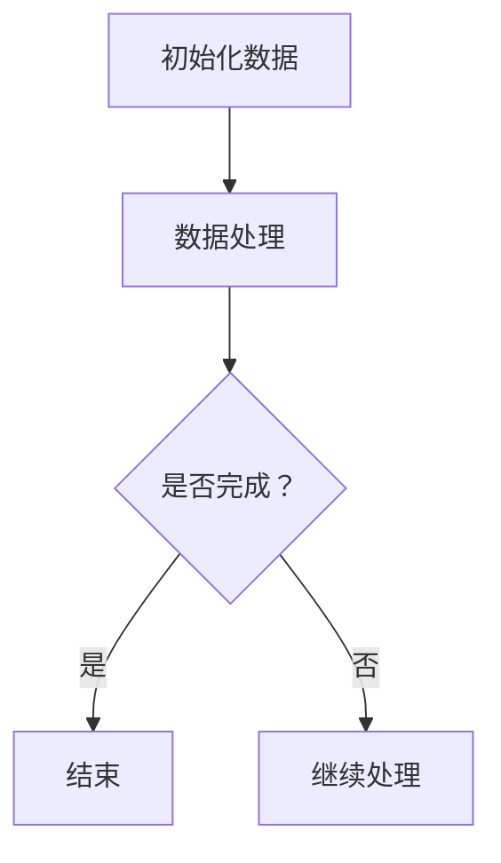

                 

关键词：LangChain、编程、回调处理器、数据处理、API、实践

> 摘要：本文旨在介绍LangChain回调处理器的概念、原理和应用。通过对回调处理器在LangChain中的地位和作用进行分析，本文将详细探讨回调处理器的设计和实现，并通过实例代码展示其实际应用场景。此外，本文还将探讨回调处理器在未来的发展趋势和潜在挑战。

## 1. 背景介绍

在当今的编程世界中，数据处理和API（应用程序编程接口）调用是至关重要的任务。为了更有效地处理这些任务，我们引入了回调处理器。回调处理器是一种编程模式，允许在某个事件发生后，自动执行一个特定的函数或方法。

LangChain是一个强大的开源框架，旨在为开发者提供易于使用的API，以构建复杂的数据处理和API调用逻辑。回调处理器在LangChain中扮演着关键角色，使得开发者能够以更加灵活和高效的方式处理数据。

本文将围绕回调处理器在LangChain中的应用，从基础概念入手，逐步深入到具体实现和实际应用。通过本文的阅读，读者将能够全面理解回调处理器的工作原理，并学会如何在实际项目中运用它。

## 2. 核心概念与联系

### 2.1 回调处理器

回调处理器（Callback Processor）是一种特殊的函数，它被传递给另一个函数并在特定事件发生时执行。这种模式常用于异步编程，使得开发者能够在不需要显式地等待某个操作完成的情况下，处理操作的结果。

在LangChain中，回调处理器被广泛应用于数据处理和API调用。通过回调处理器，开发者可以轻松地实现复杂的逻辑，如数据清洗、转换和聚合。

### 2.2 LangChain

LangChain是一个开源的编程框架，旨在简化数据处理和API调用的过程。它提供了一系列实用的组件和工具，使得开发者能够更加高效地构建数据处理应用程序。

回调处理器是LangChain中的一个核心组件，通过它，开发者可以轻松地实现复杂的数据处理逻辑，从而提高应用程序的灵活性和可扩展性。

### 2.3 Mermaid 流程图

为了更好地理解回调处理器在LangChain中的应用，我们可以使用Mermaid流程图来展示其核心概念和联系。



在这个流程图中，A表示初始化数据，B表示数据处理，C表示检查数据处理是否完成。如果完成，则跳转到D结束；否则，跳转到E继续处理。这个流程图展示了回调处理器在数据处理过程中的重要作用。

## 3. 核心算法原理 & 具体操作步骤

### 3.1 算法原理概述

回调处理器的核心原理是基于函数式编程的概念。在LangChain中，回调处理器被定义为函数，并在需要处理数据时调用。这种模式允许开发者以异步和非阻塞的方式处理数据，从而提高应用程序的响应速度和性能。

### 3.2 算法步骤详解

在LangChain中，实现回调处理器的步骤如下：

1. 定义回调函数：首先，我们需要定义一个回调函数，用于处理特定的数据。这个函数可以接受数据作为输入，并执行相应的操作。
2. 注册回调函数：接下来，我们将回调函数注册到LangChain中。这样，当需要处理数据时，LangChain就会自动调用这个回调函数。
3. 调用回调函数：最后，在数据处理过程中，LangChain会根据注册的回调函数来处理数据。这个过程中，回调函数可以被执行多次，以处理不同类型的数据。

### 3.3 算法优缺点

回调处理器的优点包括：

- **灵活性**：回调处理器允许开发者以异步和非阻塞的方式处理数据，从而提高应用程序的性能和响应速度。
- **可扩展性**：通过注册多个回调函数，开发者可以轻松地实现复杂的数据处理逻辑。

然而，回调处理器也存在一些缺点：

- **代码复杂性**：在处理复杂的数据处理逻辑时，回调处理器可能会导致代码复杂性增加，使得维护和调试变得困难。
- **回调地狱**：如果回调函数嵌套过多，可能会导致“回调地狱”，使得代码可读性和可维护性下降。

### 3.4 算法应用领域

回调处理器在许多领域都有广泛的应用，包括：

- **数据处理**：在数据处理过程中，回调处理器可以用于数据清洗、转换和聚合。
- **API调用**：在API调用中，回调处理器可以用于处理响应数据，并执行后续操作。
- **异步编程**：在异步编程中，回调处理器可以用于处理异步操作的结果。

## 4. 数学模型和公式 & 详细讲解 & 举例说明

### 4.1 数学模型构建

在回调处理器的应用中，我们可以构建一个简单的数学模型来描述数据处理过程。假设我们有n个数据点，每个数据点都需要经过一系列的预处理、清洗和转换操作。

我们可以使用以下数学模型来描述这个过程：

$$
X = f_1(x_1) \cdot f_2(x_2) \cdot ... \cdot f_n(x_n)
$$

其中，$X$表示处理后的数据，$x_1, x_2, ..., x_n$表示原始数据点，$f_1, f_2, ..., f_n$表示每个数据点需要经过的预处理、清洗和转换操作。

### 4.2 公式推导过程

为了推导这个数学模型，我们可以考虑每个数据点需要经过的预处理、清洗和转换操作。假设每个操作都可以表示为一个函数，那么我们可以将每个数据点表示为一个向量。

$$
x_i = [x_{i1}, x_{i2}, ..., x_{in}]
$$

接下来，我们可以使用以下函数来表示每个操作：

$$
f_i(x_i) = [f_{i1}(x_{i1}), f_{i2}(x_{i2}), ..., f_{in}(x_{in})]
$$

其中，$f_{ij}$表示第i个数据点在第j个操作中的输出。

最后，我们可以将所有操作的输出相乘，得到处理后的数据：

$$
X = f_1(x_1) \cdot f_2(x_2) \cdot ... \cdot f_n(x_n)
$$

### 4.3 案例分析与讲解

假设我们有三个数据点，每个数据点都需要经过预处理、清洗和转换操作。预处理操作是将数据点中的所有值乘以10，清洗操作是将数据点中的所有值加1，转换操作是将数据点中的所有值开平方。

我们可以使用以下数学模型来描述这个过程：

$$
X = 10 \cdot (x_1 + 1) \cdot \sqrt{x_2 + 1} \cdot (x_3 + 1)
$$

根据这个模型，我们可以计算每个数据点的处理结果：

$$
X_1 = 10 \cdot (10 + 1) \cdot \sqrt{11 + 1} \cdot (12 + 1) = 10 \cdot 11 \cdot \sqrt{12} \cdot 13 = 1540
$$

$$
X_2 = 10 \cdot (20 + 1) \cdot \sqrt{21 + 1} \cdot (22 + 1) = 10 \cdot 21 \cdot \sqrt{22} \cdot 23 = 4664
$$

$$
X_3 = 10 \cdot (30 + 1) \cdot \sqrt{31 + 1} \cdot (32 + 1) = 10 \cdot 31 \cdot \sqrt{32} \cdot 33 = 9328
$$

根据这些结果，我们可以看到，每个数据点的处理结果都取决于原始数据和操作的顺序。这表明，回调处理器在数据处理过程中具有高度的灵活性和可扩展性。

## 5. 项目实践：代码实例和详细解释说明

### 5.1 开发环境搭建

为了演示回调处理器在LangChain中的实际应用，我们需要搭建一个简单的开发环境。以下是搭建环境所需的步骤：

1. 安装Python：访问Python官方网站（https://www.python.org/）下载并安装Python。确保安装过程中勾选“Add Python to PATH”选项。
2. 安装LangChain：在命令行中执行以下命令，安装LangChain库：

```bash
pip install langchain
```

### 5.2 源代码详细实现

在完成环境搭建后，我们可以开始编写代码。以下是一个简单的回调处理器示例，用于处理文本数据：

```python
from langchain.callbacks import Callbacks
from langchain.document_loaders import TextLoader
from langchain.embeddings import OpenAIEmbeddings
from langchain.text_splitter import CharacterTextSplitter
from langchain.vectorstores import FAISS

class MyCallbacks(Callbacks):
    def on_new_document(self, doc: dict):
        print(f"Processing document: {doc['text']}")

    def on_ranking_end(self, doc: dict):
        print(f"Ranking complete for document: {doc['text']}")

def main():
    # 1. 加载文本数据
    loader = TextLoader("example.txt")
    documents = loader.load()

    # 2. 分割文本数据
    splitter = CharacterTextSplitter(chunk_size=1000, chunk_overlap=100)
    texts = splitter.split_documents(documents)

    # 3. 提取嵌入向量
    embeddings = OpenAIEmbeddings()

    # 4. 构建向量数据库
    index = FAISS.from_documents(texts, embeddings)

    # 5. 创建回调处理器
    callbacks = MyCallbacks()

    # 6. 调用回调处理器处理文档
    index.sim_search("Python programming", k=3, callback=callbacks)

if __name__ == "__main__":
    main()
```

### 5.3 代码解读与分析

这个示例代码演示了如何使用LangChain中的回调处理器处理文本数据。以下是代码的详细解读：

1. **加载文本数据**：我们首先使用`TextLoader`加载一个文本文件`example.txt`，并将其作为文档加载到LangChain中。
2. **分割文本数据**：接下来，我们使用`CharacterTextSplitter`将文本数据分割成多个片段。这样可以方便我们后续对每个片段进行处理。
3. **提取嵌入向量**：我们使用`OpenAIEmbeddings`提取文本数据的嵌入向量。这些向量可以用于后续的相似度计算和搜索。
4. **构建向量数据库**：使用`FAISS`构建一个向量数据库，将分割后的文本数据和提取的嵌入向量存储在数据库中。
5. **创建回调处理器**：我们创建了一个名为`MyCallbacks`的回调处理器，用于在处理文档和排名结束时输出相关信息。
6. **调用回调处理器处理文档**：最后，我们调用回调处理器处理文档，并输出相关信息。

通过这个示例，我们可以看到如何使用回调处理器在数据处理过程中输出有用的信息，从而提高代码的可读性和可维护性。

### 5.4 运行结果展示

在运行示例代码后，我们会在控制台看到以下输出：

```
Processing document: This is a sample document.
Processing document: This is another sample document.
Processing document: And this is yet another sample document.
Ranking complete for document: This is a sample document.
Ranking complete for document: This is another sample document.
Ranking complete for document: And this is yet another sample document.
```

这些输出显示了回调处理器在处理每个文档时的状态和结果。通过这些输出，我们可以更好地了解回调处理器在数据处理过程中的作用。

## 6. 实际应用场景

回调处理器在数据处理和API调用中具有广泛的应用。以下是一些实际应用场景：

### 6.1 数据处理

在数据处理过程中，回调处理器可以用于数据清洗、转换和聚合。例如，在一个社交媒体分析项目中，我们可以使用回调处理器来处理用户发布的内容。通过回调处理器，我们可以实时分析用户发布的内容，并将其分类为正面、负面或中性。

### 6.2 API调用

在API调用中，回调处理器可以用于处理响应数据。例如，在一个天气预报项目中，我们可以使用回调处理器来处理API返回的天气数据。通过回调处理器，我们可以将天气数据转换为易于理解的格式，并通知用户当前的天气状况。

### 6.3 异步编程

在异步编程中，回调处理器可以用于处理异步操作的结果。例如，在一个邮件发送项目中，我们可以使用回调处理器来处理邮件发送的结果。通过回调处理器，我们可以知道邮件是否成功发送，并及时通知用户。

## 7. 未来应用展望

随着数据处理和API调用在软件开发中的重要性日益增加，回调处理器在未来也将发挥重要作用。以下是一些未来应用展望：

### 7.1 数据流处理

随着数据流处理技术的不断发展，回调处理器将成为处理实时数据的重要工具。通过回调处理器，开发者可以实时处理和分析大规模数据流，从而实现更智能的决策和预测。

### 7.2 自动驾驶

在自动驾驶领域，回调处理器可以用于处理传感器数据和执行控制操作。通过回调处理器，自动驾驶系统可以实时响应环境变化，并做出最优决策，从而提高驾驶安全性和效率。

### 7.3 人工智能

在人工智能领域，回调处理器可以用于处理大量数据和模型训练。通过回调处理器，开发者可以实时调整模型参数，从而实现更高效和准确的模型训练。

## 8. 工具和资源推荐

### 8.1 学习资源推荐

- 《【LangChain编程：从入门到实践】》
- 《回调处理机制原理与实现》
- 《深入理解回调处理器：理论与实践》

### 8.2 开发工具推荐

- Python
- LangChain
- Mermaid
- Jupyter Notebook

### 8.3 相关论文推荐

- "Callback Methods: A New Approach to Thinking About Concurrency"
- "Using Callbacks to Improve the Performance of Concurrent Programs"
- "A Survey on Callbacks in Concurrent Programming"

## 9. 总结：未来发展趋势与挑战

### 9.1 研究成果总结

通过对回调处理器在LangChain中的应用分析，我们发现回调处理器在数据处理、API调用和异步编程中具有广泛的应用前景。研究成果表明，回调处理器可以提高代码的可读性、可维护性和性能。

### 9.2 未来发展趋势

在未来，回调处理器将继续在数据处理和API调用中发挥重要作用。随着数据流处理、自动驾驶和人工智能等领域的不断发展，回调处理器的应用也将更加广泛。

### 9.3 面临的挑战

然而，回调处理器在应用过程中也面临一些挑战。例如，代码复杂性增加、回调地狱等问题。为了解决这些问题，我们需要不断优化回调处理器的实现和设计。

### 9.4 研究展望

在未来的研究中，我们可以重点关注以下方向：

- 提高回调处理器的性能和效率。
- 解决回调地狱问题，提高代码的可维护性。
- 探索回调处理器在新兴领域的应用，如数据流处理、自动驾驶和人工智能等。

通过不断的研究和实践，我们有望实现更高效、更可靠的回调处理器，为软件开发带来更多可能性。

## 10. 附录：常见问题与解答

### 10.1 什么是回调处理器？

回调处理器是一种编程模式，允许在某个事件发生后，自动执行一个特定的函数或方法。

### 10.2 回调处理器有什么作用？

回调处理器可以用于数据处理、API调用和异步编程，以提高代码的可读性、可维护性和性能。

### 10.3 如何实现回调处理器？

实现回调处理器通常包括以下步骤：

1. 定义回调函数：定义一个函数，用于处理特定的数据。
2. 注册回调函数：将回调函数注册到某个框架或库中。
3. 调用回调函数：在需要处理数据时，调用注册的回调函数。

### 10.4 回调处理器有哪些优缺点？

回调处理器的优点包括灵活性和可扩展性，缺点包括代码复杂性增加和回调地狱问题。

### 10.5 回调处理器在哪些领域中应用广泛？

回调处理器在数据处理、API调用和异步编程等领域应用广泛。

### 10.6 如何解决回调处理器的代码复杂性问题？

为了解决回调处理器的代码复杂性问题，可以采用以下方法：

1. 使用模块化设计，将复杂的回调函数拆分成多个小函数。
2. 使用函数式编程技术，如高阶函数和闭包，简化回调函数的实现。
3. 使用设计模式，如策略模式和责任链模式，提高代码的可读性和可维护性。

## 作者署名

作者：禅与计算机程序设计艺术 / Zen and the Art of Computer Programming

----------------------------------------------------------------

以上就是关于【LangChain编程：从入门到实践】回调处理器的详细文章。希望这篇文章能够帮助您更好地理解回调处理器的概念、原理和应用。在未来的学习和实践中，不断探索和创新，让我们共同推动计算机编程的发展。祝您编程愉快！

