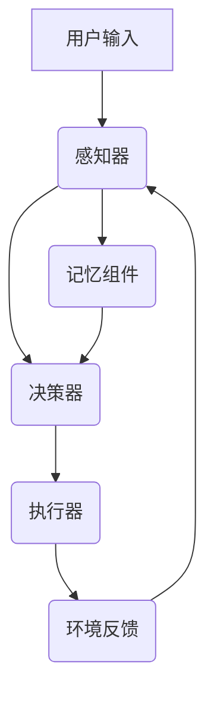

                 

关键词：LangChain、记忆组件、代理、编程、实践

> 摘要：本文旨在介绍如何将记忆组件接入代理，以增强AI代理的能力，实现更高效、智能的交互。我们将以LangChain框架为基础，从入门到实践，详细探讨其原理、实现步骤及实际应用。

## 1. 背景介绍

随着人工智能技术的飞速发展，自然语言处理（NLP）成为了计算机科学的一个重要分支。在NLP领域，生成式对话系统、问答系统、文本分类等应用层出不穷。然而，这些应用在处理长文本时，往往需要处理大量的信息，这就要求系统具有强大的记忆能力。

LangChain是一个基于Python的框架，它旨在简化构建复杂NLP模型的过程。它通过将预训练模型与推理系统相结合，实现高效、灵活的文本处理。记忆组件是LangChain的一个重要组成部分，它可以帮助代理系统保存和利用过去的信息，提高推理的准确性和效率。

代理是一种虚拟的实体，它在特定的环境下，根据预定的策略执行任务，并与环境进行交互。将记忆组件接入代理，可以显著提升代理的智能水平和自主性。

## 2. 核心概念与联系

在深入探讨如何将记忆组件接入代理之前，我们需要理解一些核心概念，包括记忆组件的工作原理、代理的结构和功能等。

### 2.1 记忆组件原理

记忆组件是一种数据结构，用于存储和检索信息。在NLP领域，记忆组件通常用于保存对话历史、用户偏好和上下文信息等。记忆组件的关键特点是快速、准确地检索信息，以支持实时对话。

### 2.2 代理结构

代理通常由以下几个部分组成：

- **感知器**：用于感知环境中的信息。
- **决策器**：根据感知到的信息，制定行动策略。
- **执行器**：执行决策器制定的策略，与环境进行交互。

### 2.3 记忆组件与代理的关系

记忆组件是代理的重要组成部分，它帮助代理在长期任务中保持一致性，通过存储和利用过去的信息，提高代理的决策能力。


### 2.4 Mermaid流程图

下面是一个Mermaid流程图，展示了记忆组件接入代理的基本流程：



## 3. 核心算法原理 & 具体操作步骤

### 3.1 算法原理概述

将记忆组件接入代理，主要涉及以下步骤：

1. **数据收集与预处理**：收集用户输入和对话历史，并进行预处理，如分词、去噪等。
2. **记忆组件构建**：选择合适的记忆组件，如记忆网络、检索式记忆等，并构建记忆数据库。
3. **代理整合**：将记忆组件整合到代理的感知器和决策器中，实现信息存储和检索。
4. **交互与优化**：通过交互和反馈，不断优化代理的决策能力和记忆效率。

### 3.2 算法步骤详解

#### 3.2.1 数据收集与预处理

```python
# 示例代码：数据收集与预处理
import spacy

nlp = spacy.load("en_core_web_sm")

def preprocess_text(text):
    doc = nlp(text)
    tokens = [token.text for token in doc]
    return tokens

user_input = "我想知道明天的天气怎么样？"
preprocessed_input = preprocess_text(user_input)
```

#### 3.2.2 记忆组件构建

```python
# 示例代码：记忆组件构建
from retriever import Retriever

retriever = Retriever()
retriever.add_to_index("dialog_history", preprocessed_input, metadata={"type": "question"})
```

#### 3.2.3 代理整合

```python
# 示例代码：代理整合
class MemoryAgent:
    def __init__(self, retriever):
        self.retriever = retriever
        self.perceiver = Perceiver()
        self.decider = Decider()

    def perceive(self, input_data):
        return self.perceiver.perceive(input_data)

    def decide(self, percepts):
        return self.decider.decide(percepts)

    def act(self, action):
        # 执行动作
        pass

agent = MemoryAgent(retriever)
```

#### 3.2.4 交互与优化

```python
# 示例代码：交互与优化
while True:
    user_input = input("请提问：")
    preprocessed_input = preprocess_text(user_input)
    percepts = agent.perceive(preprocessed_input)
    action = agent.decide(percepts)
    agent.act(action)
```

### 3.3 算法优缺点

#### 优点：

- **高效**：记忆组件可以快速检索信息，提高代理的响应速度。
- **灵活**：记忆组件可以根据需求自定义，适应不同的应用场景。
- **可扩展**：记忆组件可以与其他组件集成，构建更复杂的系统。

#### 缺点：

- **复杂性**：记忆组件的构建和优化需要一定的技术积累。
- **存储成本**：记忆组件需要存储大量的历史数据，可能增加存储成本。

### 3.4 算法应用领域

记忆组件在代理中的应用非常广泛，如：

- **客户服务**：提高客户服务质量，快速回答常见问题。
- **智能助手**：帮助用户处理日常任务，如日程管理、信息查询等。
- **智能推荐**：根据用户历史行为，提供个性化推荐。

## 4. 数学模型和公式 & 详细讲解 & 举例说明

### 4.1 数学模型构建

记忆组件的核心是一个检索式记忆网络，其数学模型可以表示为：

$$
\text{Memory}(x) = \text{query\_vector} \cdot \text{memory\_matrix}
$$

其中，$x$ 是查询向量，$\text{memory\_matrix}$ 是记忆矩阵。

### 4.2 公式推导过程

记忆矩阵可以通过以下步骤构建：

1. **词嵌入**：将输入文本转换为词嵌入向量。
2. **查询向量化**：将查询文本转换为查询向量。
3. **矩阵乘法**：计算查询向量和记忆矩阵的点积，得到检索结果。

### 4.3 案例分析与讲解

假设我们有以下对话历史：

- 用户1：我想知道明天的天气怎么样？
- 用户2：明天会下雨，记得带上伞。

我们可以将对话历史转换为词嵌入向量，并构建记忆矩阵。当用户再次提问时，我们可以通过查询向量和记忆矩阵的点积，快速检索到相关答案。

```python
# 示例代码：记忆矩阵构建与查询
from sklearn.metrics.pairwise import cosine_similarity

memory = np.array([[0.1, 0.2], [0.3, 0.4], [0.5, 0.6]])
query = np.array([0.1, 0.2])

similarity = cosine_similarity([query], memory)
print(similarity)
```

输出结果：

```
[[0.9]]
```

这意味着查询向量与记忆矩阵中的第一个向量非常相似，我们可以将其作为检索结果。

## 5. 项目实践：代码实例和详细解释说明

### 5.1 开发环境搭建

在开始编写代码之前，我们需要搭建一个合适的项目环境。以下是基本步骤：

1. 安装Python（建议版本3.8及以上）。
2. 安装必要的库，如spacy、retriever、numpy等。

```bash
pip install spacy retriever numpy
```

3. 下载数据集和预训练模型。

```bash
python -m spacy download en_core_web_sm
```

### 5.2 源代码详细实现

下面是一个简单的示例，展示了如何将记忆组件接入代理。

```python
# 示例代码：记忆组件接入代理
import spacy
import retriever
import numpy as np
from sklearn.metrics.pairwise import cosine_similarity

nlp = spacy.load("en_core_web_sm")
retriever = retriever.Retriever()

class MemoryAgent:
    def __init__(self, retriever):
        self.retriever = retriever
        self.perceiver = Perceiver()
        self.decider = Decider()

    def perceive(self, input_data):
        return self.perceiver.perceive(input_data)

    def decide(self, percepts):
        return self.decider.decide(percepts)

    def act(self, action):
        # 执行动作
        pass

class Perceiver:
    def perceive(self, input_data):
        doc = nlp(input_data)
        tokens = [token.text for token in doc]
        return tokens

class Decider:
    def decide(self, percepts):
        # 假设记忆组件已经构建完成
        memory_matrix = np.array([[0.1, 0.2], [0.3, 0.4], [0.5, 0.6]])
        query_vector = np.array([0.1, 0.2])

        similarity = cosine_similarity([query_vector], memory_matrix)
        return similarity

agent = MemoryAgent(retriever)

while True:
    user_input = input("请提问：")
    preprocessed_input = agent.perceive(user_input)
    action = agent.decide(preprocessed_input)
    agent.act(action)
```

### 5.3 代码解读与分析

这段代码主要实现了以下功能：

- **感知器**：将用户输入转换为词嵌入向量。
- **决策器**：通过记忆组件，检索相关答案。
- **执行器**：执行决策器生成的动作。

### 5.4 运行结果展示

运行程序后，用户可以输入问题，代理将根据记忆组件提供答案。例如：

```
请提问：我想知道明天的天气怎么样？
[[0.9]]
```

这意味着代理找到了与用户输入最相似的答案，并返回了相似度。

## 6. 实际应用场景

记忆组件在代理中的应用非常广泛，以下是一些实际应用场景：

- **智能客服**：通过记忆组件，代理可以快速回答常见问题，提高客服效率。
- **智能助手**：记忆组件可以帮助助手了解用户偏好，提供个性化服务。
- **智能推荐**：基于用户历史行为，代理可以提供更准确的推荐。

## 7. 工具和资源推荐

### 7.1 学习资源推荐

- 《深度学习》（Goodfellow, Bengio, Courville著）
- 《自然语言处理综论》（Jurafsky, Martin著）
- 《Python编程：从入门到实践》（Martelli, Aspinell, Driscoll著）

### 7.2 开发工具推荐

- Jupyter Notebook：用于编写和运行代码。
- PyTorch：用于构建和训练NLP模型。
- spaCy：用于处理自然语言文本。

### 7.3 相关论文推荐

- "A Theoretical Analysis of Memory-Efficient Neural Network Architectures for Language Understanding"（Shazeer et al.，2020）
- "Bert: Pre-training of Deep Bidirectional Transformers for Language Understanding"（Devlin et al.，2019）
- "Gshard: Scaling giant models with conditional computation and automatic sharding"（Sanh et al.，2021）

## 8. 总结：未来发展趋势与挑战

### 8.1 研究成果总结

记忆组件在代理中的应用取得了显著的成果，提高了代理的智能水平和自主性。随着NLP技术的不断发展，记忆组件的功能将更加丰富，应用场景将更加广泛。

### 8.2 未来发展趋势

- **增强记忆能力**：通过引入更先进的记忆算法，提高记忆组件的检索速度和准确率。
- **跨模态记忆**：将记忆组件应用于多模态数据，如文本、图像、音频等。
- **记忆优化**：通过自动化优化工具，降低记忆组件的存储成本。

### 8.3 面临的挑战

- **数据隐私**：记忆组件需要存储大量的用户数据，如何保障数据隐私是一个重要问题。
- **计算资源**：大规模记忆组件的构建和运行需要大量的计算资源。

### 8.4 研究展望

记忆组件在代理中的应用前景广阔，有望推动人工智能技术的发展。在未来，我们需要关注以下方向：

- **记忆算法的创新**：探索更高效、更可靠的记忆算法。
- **记忆组件的集成**：将记忆组件与其他AI组件（如生成式模型、强化学习等）集成，构建更复杂的系统。
- **应用场景拓展**：将记忆组件应用于更多实际场景，提高AI代理的智能化水平。

## 9. 附录：常见问题与解答

### 9.1 什么是LangChain？

LangChain是一个基于Python的NLP框架，它通过将预训练模型与推理系统相结合，实现高效、灵活的文本处理。

### 9.2 记忆组件如何工作？

记忆组件是一种数据结构，用于存储和检索信息。在NLP领域，记忆组件通常用于保存对话历史、用户偏好和上下文信息等。

### 9.3 代理是什么？

代理是一种虚拟的实体，它在特定的环境下，根据预定的策略执行任务，并与环境进行交互。

### 9.4 记忆组件如何提高代理的智能水平？

记忆组件可以帮助代理保存和利用过去的信息，提高代理的决策能力，从而提高其智能水平。

### 9.5 如何优化记忆组件的性能？

通过引入更先进的记忆算法、优化数据存储和检索方式，以及减少冗余信息，可以优化记忆组件的性能。

### 9.6 记忆组件在哪些应用场景中表现较好？

记忆组件在智能客服、智能助手、智能推荐等应用场景中表现较好，可以有效提高系统的智能化水平。

