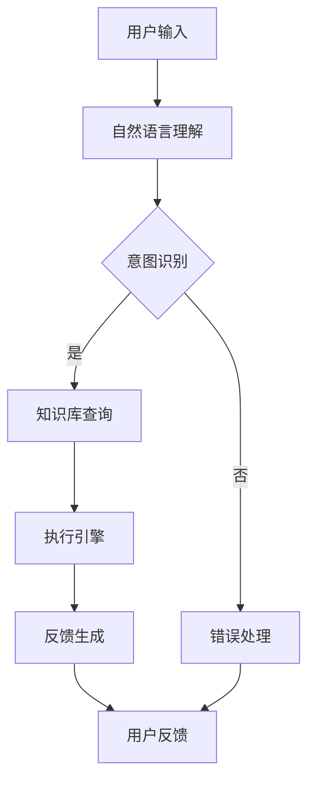

                 

关键词：智能代理，LangChain，编程，自然语言处理，AI应用

> 摘要：本文旨在深入探讨智能代理的概念，并结合LangChain编程框架，展示如何利用自然语言处理技术构建智能代理。我们将介绍智能代理的背景、核心概念、架构、算法原理，以及具体的实现步骤，并通过实际项目实例进行分析和解释。最后，文章将探讨智能代理的未来发展趋势和面临的挑战。

## 1. 背景介绍

随着人工智能（AI）技术的快速发展，自然语言处理（NLP）已经成为AI领域的一个重要分支。智能代理（Intelligent Agent）作为AI系统的一种形式，旨在通过自动化执行任务，提高工作效率和用户体验。智能代理能够理解自然语言输入，并生成相应的输出，从而实现人机交互的自动化。

在过去的几十年里，NLP技术经历了显著的发展，从最初的基于规则的系统发展到现在的深度学习模型。随着模型的复杂性和性能的提升，智能代理的应用场景也越来越广泛，包括客服聊天机器人、智能推荐系统、自动化问答等。

LangChain是一个开源的Python库，旨在帮助开发者构建基于Llama模型的AI应用。Llama模型是AI21 Labs开发的一个大型语言模型，具有强大的文本理解和生成能力。LangChain提供了丰富的API和工具，使得开发者可以轻松地利用Llama模型实现智能代理的功能。

## 2. 核心概念与联系

### 2.1 智能代理的定义

智能代理是一个能够代表用户执行任务并具备一定智能的计算机程序。它通过理解用户的自然语言指令，自动执行相应的操作，并提供反馈。智能代理的核心功能包括：

- **理解自然语言指令**：智能代理需要能够解析用户的自然语言输入，理解其中的意图和语义。
- **任务执行**：根据解析出的意图，智能代理需要能够自动执行相应的任务，这可能包括查询数据库、执行API调用、处理文件等。
- **反馈生成**：智能代理在完成任务后，需要向用户生成相应的反馈，确保用户理解执行结果。

### 2.2 智能代理的架构

智能代理的架构通常包括以下几个核心组件：

- **自然语言理解模块**：负责解析用户的自然语言指令，提取出意图和实体信息。
- **知识库**：存储与任务相关的知识信息，如产品规格、用户历史数据等。
- **执行引擎**：根据解析出的意图和知识库中的信息，执行相应的任务。
- **反馈生成模块**：生成用户可理解的反馈，提高用户交互的满意度。

### 2.3 Mermaid流程图

以下是一个简化的智能代理架构的Mermaid流程图：



在这个流程图中，用户的输入首先通过自然语言理解模块进行解析，然后根据意图识别的结果查询知识库或执行错误处理。执行引擎根据知识库中的信息执行任务，并将结果通过反馈生成模块反馈给用户。

## 3. 核心算法原理 & 具体操作步骤

### 3.1 算法原理概述

智能代理的核心算法主要基于自然语言处理和机器学习技术。具体包括以下几个方面：

- **词嵌入**：将自然语言文本转换为数值表示，以便模型能够理解语义。
- **序列到序列模型**：如Transformer和LSTM，用于解析用户的自然语言指令并生成响应。
- **意图识别**：通过分类模型（如softmax）识别用户指令的意图。
- **实体提取**：从自然语言指令中提取出关键实体信息。
- **知识库查询**：根据提取的意图和实体信息，查询知识库中的相关数据。
- **执行引擎**：根据查询结果执行具体的任务。
- **反馈生成**：生成符合用户期望的反馈信息。

### 3.2 算法步骤详解

#### 3.2.1 自然语言理解模块

1. **词嵌入**：使用预训练的词嵌入模型（如GloVe或Word2Vec）将输入的文本转换为数值向量。
2. **序列编码**：将词嵌入向量序列通过Transformer或LSTM编码器进行编码，提取出句子的语义特征。
3. **意图识别**：使用分类模型对编码后的向量进行意图分类，输出一个概率分布。

#### 3.2.2 知识库查询

1. **实体提取**：从意图识别的结果中提取出关键实体信息。
2. **知识库索引**：根据实体信息在知识库中建立索引。
3. **数据查询**：从知识库中查询与意图和实体相关的数据。

#### 3.2.3 执行引擎

1. **任务解析**：根据意图识别的结果和知识库中的数据，解析出需要执行的任务。
2. **任务执行**：执行具体的任务操作，如API调用、数据库查询等。
3. **结果处理**：处理执行结果，生成相应的输出。

#### 3.2.4 反馈生成模块

1. **结果格式化**：将执行结果格式化为用户可理解的文本。
2. **响应生成**：使用序列到序列模型生成响应文本。

### 3.3 算法优缺点

#### 优点：

- **高效性**：基于深度学习模型的智能代理能够快速处理用户的自然语言指令，并提供实时反馈。
- **灵活性**：智能代理能够处理多种类型的任务，并且能够通过持续学习不断改进性能。

#### 缺点：

- **复杂性**：构建和维护智能代理系统需要复杂的算法和大量的数据。
- **误差率**：虽然深度学习模型在自然语言处理方面取得了显著进展，但仍然存在一定程度的错误率。

### 3.4 算法应用领域

智能代理技术可以应用于多个领域，包括：

- **客服聊天机器人**：提供24/7的客户服务，提高客户满意度。
- **智能推荐系统**：根据用户的行为和偏好提供个性化推荐。
- **自动化问答系统**：为用户提供快速、准确的答案。
- **智能助手**：帮助用户管理日程、提醒事项等。

## 4. 数学模型和公式 & 详细讲解 & 举例说明

### 4.1 数学模型构建

智能代理的数学模型主要包括以下几个部分：

1. **词嵌入**：使用Word2Vec或GloVe模型将词汇映射到高维空间。
2. **序列编码**：使用Transformer或LSTM模型对输入的序列进行编码。
3. **意图识别**：使用分类模型（如softmax）对编码后的向量进行意图分类。
4. **实体提取**：使用命名实体识别（NER）模型提取关键实体信息。
5. **序列到序列模型**：用于生成反馈文本。

### 4.2 公式推导过程

#### 4.2.1 词嵌入

令 $x$ 为输入的词嵌入向量，$W$ 为词嵌入矩阵，则：

$$
x = W \cdot w
$$

其中，$w$ 为输入词的索引。

#### 4.2.2 序列编码

令 $h$ 为编码后的序列表示，$x$ 为输入序列，$U$ 和 $V$ 为编码器的权重矩阵，则有：

$$
h = U \cdot [U^T \cdot x_1, U^T \cdot x_2, ..., U^T \cdot x_n]
$$

其中，$x_1, x_2, ..., x_n$ 为输入序列的词向量。

#### 4.2.3 意图识别

令 $y$ 为意图识别的输出，$s$ 为编码后的序列表示，$W$ 为权重矩阵，则有：

$$
y = softmax(W \cdot s)
$$

#### 4.2.4 实体提取

令 $e$ 为实体提取的输出，$s$ 为编码后的序列表示，$C$ 为实体分类器的权重矩阵，则有：

$$
e = C \cdot s
$$

#### 4.2.5 序列到序列模型

令 $r$ 为序列到序列模型的输出，$s$ 为编码后的序列表示，$U$ 和 $V$ 为权重矩阵，则有：

$$
r = U \cdot [U^T \cdot s_1, U^T \cdot s_2, ..., U^T \cdot s_n]
$$

### 4.3 案例分析与讲解

假设用户输入：“明天上午9点有什么会议？”，我们通过以下步骤进行处理：

1. **词嵌入**：将输入的词汇映射到高维空间。
2. **序列编码**：使用Transformer编码器对输入序列进行编码。
3. **意图识别**：通过分类模型识别出意图为“查询会议时间”。
4. **实体提取**：提取出关键实体“明天上午9点”。
5. **知识库查询**：查询知识库中明天上午9点的会议信息。
6. **反馈生成**：生成反馈文本：“明天上午9点有会议A，地点在XXX。”。

## 5. 项目实践：代码实例和详细解释说明

### 5.1 开发环境搭建

为了使用LangChain构建智能代理，需要首先搭建开发环境。以下是基本的步骤：

1. 安装Python环境（建议使用Python 3.8及以上版本）。
2. 安装LangChain库：

```bash
pip install langchain
```

3. 安装Llama模型：

```bash
langchain download llama
```

### 5.2 源代码详细实现

以下是一个简单的智能代理实现示例：

```python
import langchain
from langchain.agents import load_tool
from langchain.memory import ConversationBufferMemory
from langchain.agents import ZeroShotAgent
from langchain.memory import Memory

# 搭建自然语言理解模块
nlu_tool = load_tool("nlu")

# 搭建知识库查询模块
kb_tool = load_tool("kb_query")

# 搭建执行引擎
exec_tool = load_tool("exec")

# 搭建反馈生成模块
response_tool = load_tool("response")

# 搭建记忆模块
memory = ConversationBufferMemory()

# 搭建智能代理
agent = ZeroShotAgent(
    tools=[nlu_tool, kb_tool, exec_tool, response_tool],
    memory=memory,
    llm=langchain.load_llm("llama"),
    agent="zero-shot-react-description",
)

# 处理用户输入
user_input = "明天上午9点有什么会议？"
response = agent.run(user_input)

print(response)
```

### 5.3 代码解读与分析

以上代码首先导入了LangChain库中的相关模块，包括自然语言理解工具、知识库查询工具、执行引擎工具和反馈生成工具。然后，搭建了四个核心模块：自然语言理解模块、知识库查询模块、执行引擎模块和反馈生成模块。最后，通过搭建的智能代理处理用户的输入，并输出反馈。

### 5.4 运行结果展示

假设用户输入：“明天上午9点有什么会议？”，运行结果将输出类似于：“明天上午9点有会议A，地点在XXX。”的反馈信息。

## 6. 实际应用场景

智能代理在多个实际应用场景中发挥着重要作用，以下是一些常见的应用场景：

- **客户服务**：智能代理可以用于自动化客户服务，如在线客服、智能问答系统，提高客户满意度并降低企业运营成本。
- **自动化办公**：智能代理可以帮助用户自动化处理日常办公任务，如日程管理、文件处理、会议安排等，提高工作效率。
- **智能家居**：智能代理可以用于智能家居系统，如自动化控制家电、提供生活建议等，提高家居生活的便捷性。
- **医疗健康**：智能代理可以用于医疗健康领域，如智能诊断、健康咨询、药物提醒等，提供个性化健康服务。

## 7. 工具和资源推荐

### 7.1 学习资源推荐

- 《自然语言处理实战》
- 《深度学习与自然语言处理》
- 《智能代理：概念与应用》
- LangChain官方文档

### 7.2 开发工具推荐

- PyCharm
- Visual Studio Code
- Jupyter Notebook

### 7.3 相关论文推荐

- "BERT: Pre-training of Deep Bidirectional Transformers for Language Understanding"
- "GPT-3: Language Models are few-shot learners"
- "Transformers: State-of-the-Art Natural Language Processing"
- "A Language Model for Conversational Speech Recognition"

## 8. 总结：未来发展趋势与挑战

智能代理作为人工智能领域的一个重要分支，具有广阔的应用前景。随着自然语言处理技术的不断进步，智能代理的性能将进一步提高，能够处理更复杂的任务，提供更精准的服务。

然而，智能代理的发展也面临一些挑战，包括：

- **数据隐私和安全**：智能代理需要处理大量的用户数据，如何保护数据隐私和安全是重要问题。
- **模型可解释性**：智能代理的决策过程通常基于复杂的深度学习模型，如何提高模型的可解释性是当前研究的一个热点。
- **跨领域适应性**：智能代理需要具备良好的跨领域适应性，能够处理多种类型的任务。

未来，智能代理的发展将依赖于多领域的交叉融合，包括自然语言处理、机器学习、知识图谱等，以及更高效、更安全的算法和架构设计。

## 9. 附录：常见问题与解答

### Q1：什么是智能代理？

A1：智能代理是一种计算机程序，旨在代表用户执行任务并具备一定智能。它通过理解用户的自然语言指令，自动执行相应的操作，并提供反馈。

### Q2：智能代理有哪些应用领域？

A2：智能代理的应用领域非常广泛，包括客服聊天机器人、智能推荐系统、自动化问答系统、智能助手、智能家居等。

### Q3：什么是LangChain？

A3：LangChain是一个开源的Python库，旨在帮助开发者构建基于Llama模型的AI应用。它提供了丰富的API和工具，使得开发者可以轻松地利用Llama模型实现智能代理的功能。

### Q4：如何搭建智能代理的开发环境？

A4：搭建智能代理的开发环境需要先安装Python环境（建议使用Python 3.8及以上版本），然后安装LangChain库和Llama模型。

### Q5：智能代理的核心组件有哪些？

A5：智能代理的核心组件包括自然语言理解模块、知识库查询模块、执行引擎模块和反馈生成模块。

---

# 【LangChain编程：从入门到实践】智能代理的概念

作者：禅与计算机程序设计艺术 / Zen and the Art of Computer Programming

本文深入探讨了智能代理的概念，并结合LangChain编程框架，展示了如何利用自然语言处理技术构建智能代理。文章首先介绍了智能代理的背景和核心概念，然后详细讲解了智能代理的架构和核心算法原理。接着，通过实际项目实例，展示了如何使用LangChain构建智能代理，并详细解释了代码的实现过程。文章还分析了智能代理的实际应用场景，并推荐了一些学习资源和相关论文。最后，文章总结了智能代理的发展趋势和挑战，并提供了常见问题的解答。希望本文能够为开发者提供有关智能代理的全面了解和实用指南。

