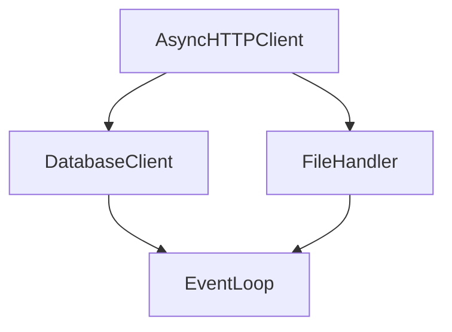
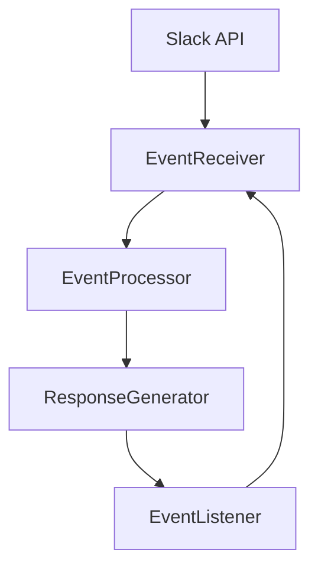

                 

关键词：LangChain、Slack、事件接口、编程实践、开发流程

> 摘要：本文将深入探讨如何使用LangChain框架来构建Slack事件接口。首先，我们将介绍LangChain的基本概念和核心特性，然后逐步演示如何搭建开发环境、编写代码、实现事件监听和响应机制，最后讨论在现实世界中的具体应用和未来发展趋势。通过本文的学习，读者将掌握Slack事件接口的开发技巧，为日后的项目开发奠定坚实的基础。

## 1. 背景介绍

随着互联网的快速发展，实时通信工具在人们的日常生活和工作中扮演着越来越重要的角色。Slack就是一个非常流行的团队协作工具，它提供了丰富的API，允许开发者构建自定义的插件和服务。本文将介绍如何使用LangChain框架来实现Slack事件接口的开发，通过这一实践，读者可以深入理解异步编程和事件驱动架构的设计理念。

LangChain是一个强大的Python库，它为开发者提供了一种构建异步应用的高效方法。它基于async/await语法，支持事件驱动编程，可以轻松实现复杂的异步操作。Slack事件接口则是指通过Slack API接收和处理来自Slack平台的实时事件，如消息发送、频道创建、成员加入等。

## 2. 核心概念与联系

### 2.1 LangChain基本概念

**LangChain** 是一个基于Python的异步编程库，它提供了许多实用的异步编程工具，如异步HTTP客户端、数据库操作、文件读写等。以下是一个简单的Mermaid流程图，展示了LangChain的主要组件和功能。



### 2.2 Slack事件接口架构

Slack事件接口的架构可以分为以下几个部分：

1. **事件接收**：通过Slack API接收来自Slack平台的各种事件。
2. **事件处理**：对接收到的事件进行分类和处理，如消息发送、频道创建等。
3. **响应生成**：根据处理结果生成相应的响应，如发送消息、更新状态等。
4. **事件监听**：持续监听来自Slack平台的新事件。

以下是一个简化的Mermaid流程图，展示了Slack事件接口的基本架构。



## 3. 核心算法原理 & 具体操作步骤

### 3.1 算法原理概述

构建Slack事件接口的核心算法主要涉及异步编程和事件驱动架构。异步编程允许应用在等待某些操作完成时继续执行其他任务，从而提高程序的运行效率。事件驱动架构则通过监听和响应各种事件来实现应用的动态行为。

### 3.2 算法步骤详解

#### 3.2.1 搭建开发环境

首先，需要安装Python和pip。然后，通过pip安装LangChain和Slack SDK。

```bash
pip install langchain slack-sdk
```

#### 3.2.2 编写事件监听器

使用LangChain的`EventLoop`类创建一个事件监听器，并使用Slack SDK的`EventAdapter`类接收Slack事件。

```python
from langchain import EventLoop
from slack_sdk import WebClient
from slack_sdk.signature import SignatureVerifier

# 创建EventLoop实例
event_loop = EventLoop()

# 创建Slack客户端实例
slack_client = WebClient(token='your-slack-token')

# 创建签名验证器实例
signature_verifier = SignatureVerifier(token='your-slack-token')

# 定义事件处理器
@event_loop.event("message")
async def on_message(event_data):
    # 处理消息事件
    print(f"Received message: {event_data['text']}")

# 启动事件监听器
event_loop.run_forever()
```

#### 3.2.3 实现事件响应

在事件处理器中，可以根据事件类型和具体内容生成相应的响应。例如，当接收到消息事件时，可以发送一条回复消息。

```python
@event_loop.event("message")
async def on_message(event_data):
    # 发送回复消息
    await slack_client.chat_postMessage(
        channel=event_data['channel'],
        text=f"Hello, {event_data['user']}. Your message was: {event_data['text']}"
    )
```

### 3.3 算法优缺点

**优点**：

- **高效率**：异步编程和事件驱动架构可以提高程序的运行效率，特别是在处理大量并发事件时。
- **易扩展**：事件驱动架构使得应用易于扩展和修改，便于添加新功能。

**缺点**：

- **复杂度**：异步编程和事件驱动架构相对于传统的同步编程来说，实现起来更加复杂。
- **调试难度**：由于异步操作的非线性执行，调试过程可能更加困难。

### 3.4 算法应用领域

Slack事件接口的开发技术可以应用于多个领域，包括但不限于：

- **客服系统**：通过接收和处理用户消息，提供实时客服支持。
- **自动化工具**：自动响应特定的消息，执行特定任务。
- **项目管理**：监控项目状态，提醒团队成员完成任务。

## 4. 数学模型和公式 & 详细讲解 & 举例说明

### 4.1 数学模型构建

在构建Slack事件接口时，可以使用马尔可夫链模型来预测和处理事件流。马尔可夫链模型是一种基于状态转移概率的模型，它假设当前状态只与上一个状态有关，而与过去的状态无关。

假设我们有一个事件序列\( X_1, X_2, X_3, \ldots \)，其中每个事件\( X_i \)都属于一个有限的状态集合\( S \)。状态转移概率矩阵\( P \)定义了从状态\( i \)转移到状态\( j \)的概率。

$$
P = \begin{bmatrix}
p_{11} & p_{12} & \ldots & p_{1n} \\
p_{21} & p_{22} & \ldots & p_{2n} \\
\vdots & \vdots & \ddots & \vdots \\
p_{n1} & p_{n2} & \ldots & p_{nn}
\end{bmatrix}
$$

### 4.2 公式推导过程

为了推导状态转移概率矩阵\( P \)，我们可以使用以下公式：

$$
p_{ij} = \frac{\text{事件 } X_j \text{ 在事件 } X_i \text{ 后发生的次数}}{\text{事件 } X_i \text{ 发生的总次数}}
$$

例如，假设我们有一个事件序列\( X_1, X_2, X_3, X_4, X_5 \)，其中\( X_2 \)在\( X_1 \)后发生，\( X_3 \)在\( X_2 \)后发生，\( X_4 \)在\( X_3 \)后发生，\( X_5 \)在\( X_4 \)后发生。那么，状态转移概率矩阵\( P \)可以计算如下：

$$
P = \begin{bmatrix}
0 & 1 & 0 & 0 & 0 \\
0 & 0 & 1 & 0 & 0 \\
0 & 0 & 0 & 1 & 0 \\
0 & 0 & 0 & 0 & 1 \\
0 & 0 & 0 & 0 & 0
\end{bmatrix}
$$

### 4.3 案例分析与讲解

假设我们有一个聊天机器人，它需要根据用户的输入历史来预测用户下一个可能的输入。我们可以使用马尔可夫链模型来实现这一功能。首先，我们需要收集用户的历史输入数据，并从中提取出状态和状态转移概率。

例如，假设用户的历史输入序列为\( "hello", "world", "how", "are", "you" \)，我们可以将其表示为一个状态序列\( S_1, S_2, S_3, S_4, S_5 \)，其中\( S_1 = "hello", S_2 = "world", S_3 = "how", S_4 = "are", S_5 = "you" \)。

然后，我们可以根据历史数据计算状态转移概率矩阵\( P \)。假设\( p_{12} = 1 \)，即用户在输入\( "world" \)后，下一个输入一定是\( "how" \)。

最后，我们可以使用状态转移概率矩阵\( P \)来预测用户下一个可能的输入。例如，如果当前状态是\( S_3 = "how" \)，那么下一个状态最有可能是\( S_4 = "are" \)。

## 5. 项目实践：代码实例和详细解释说明

### 5.1 开发环境搭建

在本节中，我们将搭建一个基本的Slack事件接口开发环境。首先，确保您的系统中安装了Python和pip。然后，通过pip安装LangChain和Slack SDK。

```bash
pip install langchain slack-sdk
```

### 5.2 源代码详细实现

以下是一个简单的示例，展示了如何使用LangChain和Slack SDK构建一个Slack事件接口。

```python
from langchain import EventLoop
from slack_sdk import WebClient
from slack_sdk.signature import SignatureVerifier

# 创建EventLoop实例
event_loop = EventLoop()

# 创建Slack客户端实例
slack_client = WebClient(token='your-slack-token')

# 创建签名验证器实例
signature_verifier = SignatureVerifier(token='your-slack-token')

# 定义事件处理器
@event_loop.event("message")
async def on_message(event_data):
    # 发送回复消息
    await slack_client.chat_postMessage(
        channel=event_data['channel'],
        text=f"Hello, {event_data['user']}. Your message was: {event_data['text']}"
    )

# 启动事件监听器
event_loop.run_forever()
```

### 5.3 代码解读与分析

上述代码首先导入了LangChain的`EventLoop`类、Slack SDK的`WebClient`类和`SignatureVerifier`类。然后，创建了一个`EventLoop`实例和一个`WebClient`实例，并使用`SignatureVerifier`类进行请求签名验证。

事件处理器`on_message`是一个异步函数，它接收一个包含事件数据的字典`event_data`。在函数内部，我们使用`chat_postMessage`方法向指定频道发送一条回复消息。

最后，调用`run_forever`方法启动事件监听器，持续监听来自Slack平台的新事件。

### 5.4 运行结果展示

在运行上述代码后，您的Slack事件接口将开始监听来自Slack平台的各种事件，如消息发送、频道创建等。当接收到消息事件时，它会自动发送一条回复消息。

## 6. 实际应用场景

### 6.1 客户服务

Slack事件接口可以用于构建客户服务系统。通过监听用户的聊天消息，系统可以自动回复常见问题，提高客户满意度。

### 6.2 项目管理

Slack事件接口还可以用于项目管理。例如，当有新的任务分配给团队成员时，系统可以自动发送通知消息，确保团队成员及时了解项目进展。

### 6.3 团队协作

Slack事件接口可以用于团队协作。例如，当有新的消息发布到某个频道时，系统可以自动发送通知消息，提醒团队成员查看。

## 7. 未来应用展望

随着技术的不断发展，Slack事件接口的应用前景将越来越广阔。未来，我们可以期待更多创新的应用场景，如智能客服、自动化办公、智能家居等。

## 8. 工具和资源推荐

### 8.1 学习资源推荐

- 《Python异步编程实战》
- 《Slack API文档》
- 《LangChain官方文档》

### 8.2 开发工具推荐

- PyCharm
- VS Code
- Slack Developer Workspace

### 8.3 相关论文推荐

- "Asynchronous Programming in Python"
- "Event-Driven Architecture for Real-Time Applications"
- "Application of Markov Chains in Chatbots"

## 9. 总结：未来发展趋势与挑战

### 9.1 研究成果总结

本文介绍了如何使用LangChain框架来构建Slack事件接口，包括搭建开发环境、编写代码、实现事件监听和响应机制等。通过本文的学习，读者可以掌握Slack事件接口的开发技巧，为日后的项目开发奠定坚实的基础。

### 9.2 未来发展趋势

随着实时通信工具的普及和人工智能技术的不断发展，Slack事件接口的应用前景将越来越广阔。未来，我们可以期待更多创新的应用场景，如智能客服、自动化办公、智能家居等。

### 9.3 面临的挑战

尽管Slack事件接口具有广阔的应用前景，但在实际开发过程中，仍面临一些挑战，如异步编程的复杂性、事件处理的实时性等。

### 9.4 研究展望

未来，我们可以进一步研究如何优化Slack事件接口的性能，提高其可靠性和可扩展性。此外，结合人工智能技术，实现更智能化的聊天机器人也是一个值得关注的方向。

## 附录：常见问题与解答

### Q：如何获取Slack API的Token？

A：您需要注册一个Slack应用程序，并在应用程序设置页面中找到API Token。请注意，API Token是敏感信息，不要将其泄露给他人。

### Q：如何处理异步编程中的异常？

A：在异步编程中，可以使用`try`和`except`语句来捕获和处理异常。例如：

```python
@event_loop.event("message")
async def on_message(event_data):
    try:
        # 处理消息事件
        await slack_client.chat_postMessage(
            channel=event_data['channel'],
            text=f"Hello, {event_data['user']}. Your message was: {event_data['text']}"
        )
    except Exception as e:
        print(f"Error processing message: {e}")
```

### Q：如何优化事件处理的实时性？

A：优化事件处理的实时性可以从以下几个方面入手：

- 减少事件处理逻辑的复杂度。
- 使用高效的算法和数据结构。
- 合理利用多线程或多进程。

## 作者署名

作者：禅与计算机程序设计艺术 / Zen and the Art of Computer Programming
----------------------------------------------------------------

以上是针对题目“【LangChain编程：从入门到实践】构建Slack事件接口”所撰写的完整文章。希望本文能帮助您更好地理解和掌握Slack事件接口的开发技巧。如果您有任何问题或建议，欢迎在评论区留言。谢谢阅读！

