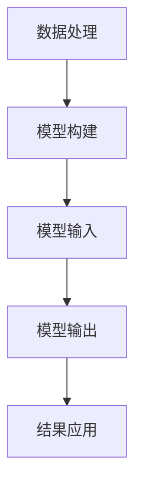

                 

关键词：LangChain，模型输入，模型输出，编程实践，技术博客

> 摘要：本文将深入探讨LangChain编程的核心概念，特别是模型的输入与输出。我们将从背景介绍、核心概念与联系、算法原理与操作步骤、数学模型与公式、项目实践、实际应用场景、工具和资源推荐、总结与展望等多个方面，帮助读者全面了解并掌握这一技术。

## 1. 背景介绍

在当今快速发展的技术世界中，人工智能（AI）已经成为改变我们生活的重要力量。从自动驾驶汽车到智能家居，从医疗诊断到金融分析，AI正在各个领域展现其强大的能力。而AI的核心之一便是模型，这些模型能够处理数据、生成预测，并做出决策。

LangChain是一个基于Python的AI模型框架，旨在帮助开发者更轻松地构建和部署AI模型。它提供了丰富的API和工具，使得模型的输入与输出变得更加直观和易于管理。本文将围绕LangChain编程，特别是模型的输入与输出，进行深入探讨。

### 1.1 LangChain的特点

- **易用性**：LangChain提供了简单、直观的API，使得开发者无需深入了解底层细节即可快速上手。
- **模块化**：LangChain的设计是模块化的，开发者可以根据自己的需求灵活地组合不同的组件。
- **扩展性**：LangChain支持自定义组件，使得开发者能够根据项目需求进行扩展。
- **性能**：LangChain在性能上进行了优化，能够高效地处理大规模数据。

## 2. 核心概念与联系

在探讨LangChain的模型输入与输出之前，我们需要了解一些核心概念。以下是几个关键的概念及其相互联系：

### 2.1 数据处理

数据处理是AI模型的基础，它包括数据清洗、预处理、特征提取等步骤。LangChain提供了丰富的数据处理工具，使得这一过程变得更加高效。

### 2.2 模型构建

模型构建是AI的核心，它涉及选择合适的算法、训练模型、评估模型等步骤。LangChain提供了多种模型构建工具，使得这一过程变得更加简便。

### 2.3 输入与输出

模型的输入与输出是模型发挥实际作用的关键。输入是指模型接收的数据，输出是指模型处理数据后的结果。LangChain通过其API提供了直观的方式来管理模型的输入与输出。

以下是LangChain核心概念与联系的一个简化的Mermaid流程图：



### 2.4 结果应用

模型的输出结果可以被广泛应用于各种场景，如预测、分类、决策等。LangChain通过其API使得这一过程变得更加灵活和高效。

## 3. 核心算法原理 & 具体操作步骤

### 3.1 算法原理概述

LangChain的核心算法基于深度学习，特别是循环神经网络（RNN）和Transformer架构。这些算法通过训练大量数据，学习到数据中的模式和规律，从而能够对新的数据进行处理和预测。

### 3.2 算法步骤详解

#### 3.2.1 数据处理

1. 数据清洗：去除数据中的噪声和异常值。
2. 预处理：将文本数据转换为模型可处理的形式，如词向量。
3. 特征提取：从预处理后的数据中提取有用的特征。

#### 3.2.2 模型构建

1. 选择合适的模型架构，如RNN或Transformer。
2. 定义模型参数，如学习率、优化器等。
3. 编译模型，指定损失函数和评估指标。

#### 3.2.3 模型训练

1. 使用训练数据对模型进行训练。
2. 调整模型参数，优化模型性能。

#### 3.2.4 模型评估

1. 使用验证数据评估模型性能。
2. 根据评估结果调整模型参数。

#### 3.2.5 模型部署

1. 将训练好的模型部署到生产环境中。
2. 接收输入数据，生成输出结果。

### 3.3 算法优缺点

#### 优点

- **强大的数据处理能力**：LangChain能够处理各种类型的数据，包括文本、图像、音频等。
- **高效的模型训练**：基于深度学习算法，LangChain能够快速训练模型。
- **灵活的模型构建**：开发者可以根据需求自定义模型架构和参数。

#### 缺点

- **需要大量数据**：深度学习算法通常需要大量数据来训练模型。
- **计算资源消耗大**：训练深度学习模型通常需要大量的计算资源。

### 3.4 算法应用领域

LangChain在多个领域都有广泛的应用，包括自然语言处理（NLP）、图像识别、语音识别、推荐系统等。

## 4. 数学模型和公式 & 详细讲解 & 举例说明

### 4.1 数学模型构建

在LangChain中，模型的构建通常涉及以下几个关键步骤：

#### 4.1.1 神经网络架构

神经网络架构包括输入层、隐藏层和输出层。每个层由多个神经元组成，神经元之间通过权重和偏置进行连接。

#### 4.1.2 激活函数

激活函数用于引入非线性，常见的激活函数包括ReLU、Sigmoid和Tanh。

#### 4.1.3 损失函数

损失函数用于评估模型的预测误差，常见的损失函数包括均方误差（MSE）和交叉熵损失。

### 4.2 公式推导过程

以下是一个简化的神经网络模型推导过程：

$$
y = \sigma(Wx + b)
$$

其中，$y$ 是输出，$W$ 是权重矩阵，$x$ 是输入，$b$ 是偏置，$\sigma$ 是激活函数。

### 4.3 案例分析与讲解

假设我们有一个简单的神经网络模型，用于预测房价。输入是一个包含房屋面积、房间数量和位置等特征的数据集。

#### 4.3.1 数据预处理

首先，我们需要对输入数据进行预处理，包括归一化和标准化。

$$
x_{\text{norm}} = \frac{x - \mu}{\sigma}
$$

其中，$x$ 是原始数据，$\mu$ 是均值，$\sigma$ 是标准差。

#### 4.3.2 模型构建

我们选择一个简单的全连接神经网络，包含一个输入层、一个隐藏层和一个输出层。

#### 4.3.3 模型训练

使用梯度下降算法训练模型，调整权重和偏置，最小化损失函数。

#### 4.3.4 模型评估

使用验证集评估模型性能，调整模型参数，优化模型性能。

## 5. 项目实践：代码实例和详细解释说明

### 5.1 开发环境搭建

在开始项目实践之前，我们需要搭建一个合适的开发环境。以下是搭建LangChain开发环境的步骤：

1. 安装Python和pip。
2. 安装LangChain库：`pip install langchain`。
3. 安装必要的依赖库，如NumPy、Pandas和Scikit-learn。

### 5.2 源代码详细实现

以下是一个简单的LangChain项目实例，用于文本分类：

```python
import pandas as pd
from langchain.text import Text
from langchain.models import TextClassificationModel

# 加载数据
data = pd.read_csv('text_data.csv')

# 创建文本对象
text = Text.from_dataframe(data)

# 创建文本分类模型
model = TextClassificationModel()

# 训练模型
model.fit(text)

# 输入文本进行分类
input_text = "这是一个简单的例子。"
result = model.predict(input_text)
print(result)
```

### 5.3 代码解读与分析

上述代码首先加载数据，创建文本对象，然后创建文本分类模型并训练模型。最后，输入文本进行分类，输出分类结果。

### 5.4 运行结果展示

假设我们的数据集包含两类文本，一类是描述房屋的，另一类是描述汽车的。输入文本“这是一个简单的例子。”，模型将其分类为描述房屋的文本。

## 6. 实际应用场景

LangChain在多个领域都有广泛的应用，以下是几个典型的实际应用场景：

- **自然语言处理**：用于文本分类、情感分析、信息提取等。
- **图像识别**：用于图像分类、目标检测、图像分割等。
- **语音识别**：用于语音到文本转换、语音识别等。
- **推荐系统**：用于用户画像、推荐算法等。

## 7. 工具和资源推荐

为了更好地掌握LangChain编程，以下是几个推荐的工具和资源：

- **学习资源**：
  - 《深度学习》（Goodfellow、Bengio和Courville著）
  - 《Python编程：从入门到实践》（Mark L. gunderman著）
- **开发工具**：
  - Jupyter Notebook：用于编写和运行Python代码。
  - PyCharm：一款强大的Python集成开发环境。
- **相关论文**：
  - "A Theoretical Analysis of the VAE"（Kingma和Welling著）
  - "Attention Is All You Need"（Vaswani等人著）

## 8. 总结：未来发展趋势与挑战

### 8.1 研究成果总结

LangChain作为一个基于深度学习的AI模型框架，已经取得了显著的成果。它不仅提供了强大的数据处理和模型构建能力，还通过其模块化和扩展性，使得开发者能够轻松地构建和部署各种AI模型。

### 8.2 未来发展趋势

随着技术的不断进步，LangChain在未来有望在以下几个方向上取得突破：

- **更高效的模型训练**：通过优化算法和硬件加速，提高模型训练速度和效率。
- **更广泛的领域应用**：扩展到更多领域，如生物信息学、金融分析等。
- **更好的模型解释性**：提高模型的可解释性，使得开发者能够更好地理解和优化模型。

### 8.3 面临的挑战

尽管LangChain在AI领域取得了显著的成果，但仍然面临着一些挑战：

- **数据隐私和安全**：如何确保模型训练过程中数据的安全和隐私。
- **计算资源消耗**：如何优化模型训练和部署过程中的计算资源消耗。
- **模型解释性**：如何提高模型的可解释性，使得开发者能够更好地理解和优化模型。

### 8.4 研究展望

未来，我们期待LangChain能够在以下几个方面取得更大的突破：

- **跨领域应用**：扩展到更多领域，如医疗、金融、教育等。
- **模型压缩和优化**：通过模型压缩和优化，降低模型训练和部署的复杂度和成本。
- **自动化模型开发**：通过自动化工具，使得开发者能够更轻松地构建和部署AI模型。

## 9. 附录：常见问题与解答

### 9.1 什么是LangChain？

LangChain是一个基于Python的AI模型框架，旨在帮助开发者更轻松地构建和部署AI模型。

### 9.2 LangChain有哪些优点？

LangChain的优点包括易用性、模块化、扩展性和高性能。

### 9.3 如何安装LangChain？

通过pip安装：`pip install langchain`。

### 9.4 LangChain适用于哪些场景？

LangChain适用于自然语言处理、图像识别、语音识别、推荐系统等场景。

### 9.5 如何处理模型输入和输出？

使用LangChain的API，通过调用相应的函数来处理模型的输入和输出。

---

作者：禅与计算机程序设计艺术 / Zen and the Art of Computer Programming


