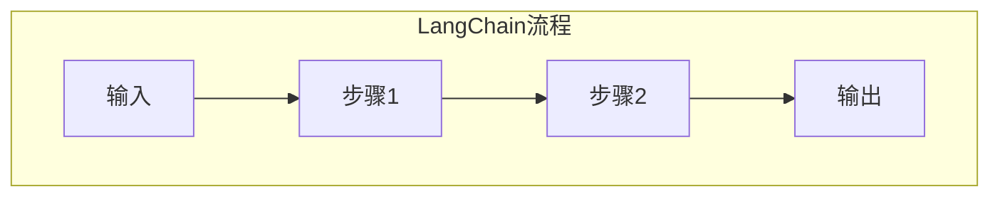

                 

关键词：LangChain、编程、输入输出、编程实践、算法原理、数学模型、项目实践

> 摘要：本文旨在探讨LangChain编程框架在处理输入输出过程中的关键影响，从核心概念、算法原理、数学模型到实际项目实践，全面解析输入对输出的影响，帮助开发者深入理解并有效利用LangChain框架。

## 1. 背景介绍

LangChain是一个强大的开源编程框架，它旨在为开发者提供一种简单而强大的方式来构建链式应用程序。链式应用程序是一种将多个操作或步骤组合成一条链以执行复杂任务的方法。这种方法的优势在于，它使得代码的编写、理解和维护都变得更加直观和高效。

在LangChain中，输入和输出是编程的核心。输入定义了应用程序的起始状态，而输出则是经过一系列操作后生成的结果。理解输入对输出的影响是掌握LangChain编程的关键。本文将深入探讨这个主题，从基础知识到高级应用，全面解析输入输出在LangChain编程中的影响。

## 2. 核心概念与联系

### 2.1 LangChain的基本概念

LangChain的核心概念包括链（Chain）、步骤（Step）和中间状态（Intermediate State）。链是一系列步骤的组合，每个步骤都接受前一个步骤的输出作为输入，并产生新的输出。中间状态是步骤之间的桥梁，它记录了每个步骤的状态变化。

### 2.2 输入输出的定义

在LangChain中，输入是指程序运行时提供的初始数据，输出则是程序运行后生成的结果。输入和输出是互相依存的，输入决定了输出，而输出又是输入的延续和扩展。

### 2.3 Mermaid流程图

为了更好地理解输入输出在LangChain编程中的工作方式，我们可以使用Mermaid流程图来展示核心概念和流程。



在上述流程图中，`A`表示初始化输入，`B`和`C`表示两个步骤，`D`表示输出结果。这个简单的例子展示了LangChain的基本工作流程。

## 3. 核心算法原理 & 具体操作步骤

### 3.1 算法原理概述

LangChain的核心算法原理是基于链式编程模型。每个步骤都独立运行，并将输出传递给下一个步骤。这种模式使得代码模块化，便于理解和维护。输入对输出的影响主要表现在以下几个方面：

1. **输入数据的类型和格式**：不同的输入数据类型和格式会直接影响输出的类型和格式。
2. **步骤的功能和操作**：每个步骤的功能和操作决定了输入如何转换成输出。
3. **中间状态**：中间状态记录了每个步骤的状态变化，它影响了后续步骤的输入和输出。

### 3.2 算法步骤详解

#### 3.2.1 初始化输入

在LangChain编程中，首先需要定义输入。输入可以是简单的数据类型，如数字、字符串，也可以是复杂的结构，如列表、字典。初始化输入的步骤通常包括数据获取、数据清洗和格式转换等。

```python
# 示例：初始化输入
input_data = {"name": "Alice", "age": 30}
```

#### 3.2.2 第一个步骤

第一个步骤通常是对输入数据的基本处理。例如，可以是一个数据处理函数，用于过滤、转换或添加新数据。

```python
# 示例：第一个步骤
def process_data(input_data):
    # 处理数据
    return {"name": input_data["name"], "age": input_data["age"] + 1}

processed_data = process_data(input_data)
```

#### 3.2.3 接下来的步骤

接下来的步骤会依次使用前一个步骤的输出作为输入，进行更多的处理。每个步骤都可以是一个独立的函数，也可以是一个复杂的处理流程。

```python
# 示例：接下来的步骤
def add_greeting(data):
    return {"greeting": "Hello, " + data["name"], "data": data}

greeting_data = add_greeting(processed_data)
```

#### 3.2.4 输出结果

最后一步是将整个处理流程的结果输出。输出可以是打印到控制台、保存到文件或通过网络发送等。

```python
# 示例：输出结果
print(greeting_data)
```

### 3.3 算法优缺点

#### 优点：

1. **模块化**：步骤的模块化使得代码更易于理解和维护。
2. **灵活性**：可以灵活地组合不同的步骤，以适应不同的需求。
3. **可扩展性**：易于扩展和添加新步骤，以实现更复杂的处理流程。

#### 缺点：

1. **性能开销**：链式编程可能会引入一定的性能开销，特别是在处理大量数据时。
2. **调试困难**：由于链式编程的复杂性，调试可能会变得更具挑战性。

### 3.4 算法应用领域

LangChain编程可以应用于多个领域，包括但不限于：

1. **数据处理**：用于清洗、转换和合并大量数据。
2. **自然语言处理**：用于构建复杂的文本处理流程。
3. **图像处理**：用于处理和转换图像数据。
4. **推荐系统**：用于构建推荐算法的链式流程。

## 4. 数学模型和公式 & 详细讲解 & 举例说明

### 4.1 数学模型构建

在LangChain编程中，输入和输出之间的转换可以被视为一种数学模型。我们可以使用线性变换来描述这个模型。

设输入为向量 \(\mathbf{x}\)，输出为向量 \(\mathbf{y}\)，每个步骤的变换为矩阵 \(\mathbf{A}_i\)。则整个过程可以表示为：

$$
\mathbf{y} = \mathbf{A}_n \mathbf{A}_{n-1} \cdots \mathbf{A}_1 \mathbf{x}
$$

### 4.2 公式推导过程

假设输入 \(\mathbf{x}\) 为 \(n\) 维向量，每个步骤的变换矩阵 \(\mathbf{A}_i\) 也为 \(n\) 维。则经过 \(k\) 个步骤后的输出 \(\mathbf{y}\) 可以表示为：

$$
\mathbf{y} = \mathbf{A}_k \mathbf{A}_{k-1} \cdots \mathbf{A}_1 \mathbf{x}
$$

其中，\(\mathbf{A}_i\) 是步骤 \(i\) 的变换矩阵。

### 4.3 案例分析与讲解

假设我们有如下三个步骤：

1. 数据清洗：将输入数据从字符串转换为整数。
2. 数据转换：将整数乘以2。
3. 数据输出：将结果打印到控制台。

对应的变换矩阵如下：

$$
\mathbf{A}_1 = \begin{bmatrix}
1 & 0 \\
0 & 1
\end{bmatrix}, \quad
\mathbf{A}_2 = \begin{bmatrix}
2 & 0 \\
0 & 2
\end{bmatrix}, \quad
\mathbf{A}_3 = \begin{bmatrix}
1 & 0 \\
0 & 1
\end{bmatrix}
$$

初始输入 \(\mathbf{x}\) 为 \( (3, 4) \)。

根据公式推导过程，我们有：

$$
\mathbf{y} = \mathbf{A}_3 \mathbf{A}_2 \mathbf{A}_1 \mathbf{x} = \begin{bmatrix}
1 & 0 \\
0 & 1
\end{bmatrix} \begin{bmatrix}
2 & 0 \\
0 & 2
\end{bmatrix} \begin{bmatrix}
1 & 0 \\
0 & 1
\end{bmatrix} \begin{bmatrix}
3 \\
4
\end{bmatrix} = \begin{bmatrix}
7 \\
8
\end{bmatrix}
$$

最终输出 \(\mathbf{y}\) 为 \( (7, 8) \)，即输入数据的每个元素都被乘以2。

## 5. 项目实践：代码实例和详细解释说明

### 5.1 开发环境搭建

在开始项目实践之前，我们需要搭建一个基本的开发环境。以下是所需的步骤：

1. 安装Python环境。
2. 安装LangChain库。

```bash
pip install langchain
```

### 5.2 源代码详细实现

以下是一个简单的LangChain编程实例，用于处理用户输入并生成输出。

```python
from langchain import Chain

# 定义步骤
def clean_data(data):
    return int(data)

def transform_data(data):
    return data * 2

def output_data(data):
    print(data)

# 创建链
my_chain = Chain(
    "clean_data",
    "transform_data",
    "output_data"
)

# 处理输入
input_data = "3"
processed_data = my_chain.run(input_data)

# 输出结果
print(processed_data)
```

### 5.3 代码解读与分析

上述代码定义了一个简单的LangChain程序，用于处理字符串输入并生成整数输出。具体解读如下：

1. **定义步骤**：我们定义了三个步骤，分别是`clean_data`、`transform_data`和`output_data`。这些步骤分别是数据清洗、数据转换和数据输出。
2. **创建链**：使用这些步骤创建一个链，称为`my_chain`。每个步骤都接受前一个步骤的输出作为输入，并产生新的输出。
3. **处理输入**：将字符串输入传递给链，并运行链以生成输出。
4. **输出结果**：将最终输出打印到控制台。

### 5.4 运行结果展示

运行上述代码后，我们将输入字符串`"3"`传递给链。链首先将输入清洗为整数`3`，然后将整数乘以2，最后输出结果`6`。因此，运行结果将显示：

```
6
```

## 6. 实际应用场景

LangChain编程框架在多个实际应用场景中都有着广泛的应用。以下是一些典型的应用场景：

1. **数据处理**：在数据分析领域，LangChain可以用于处理和转换大量数据，如清洗、转换和合并不同格式的数据。
2. **自然语言处理**：在文本处理领域，LangChain可以用于构建复杂的文本处理流程，如文本分类、情感分析、机器翻译等。
3. **图像处理**：在计算机视觉领域，LangChain可以用于处理和转换图像数据，如图像增强、图像分割、目标检测等。
4. **推荐系统**：在推荐系统领域，LangChain可以用于构建推荐算法的链式流程，如用户兴趣分析、商品推荐等。

### 6.4 未来应用展望

随着技术的不断进步，LangChain编程框架在未来有着广泛的应用前景。以下是一些可能的未来应用方向：

1. **智能问答系统**：利用LangChain构建智能问答系统，可以提供更加自然和高效的问答服务。
2. **自动化编程**：利用LangChain的链式编程模型，可以构建自动化编程工具，帮助开发者快速生成和优化代码。
3. **智能合约**：在区块链领域，利用LangChain可以构建智能合约的链式流程，实现更复杂和安全的合约功能。
4. **智能诊断系统**：在医疗领域，利用LangChain可以构建智能诊断系统，通过链式分析病人的数据，提供更准确的诊断结果。

## 7. 工具和资源推荐

为了更好地学习和实践LangChain编程，以下是一些建议的工具和资源：

### 7.1 学习资源推荐

1. **官方文档**：LangChain的官方文档提供了详细的API说明和示例，是学习LangChain的最佳资源。
2. **在线教程**：许多在线平台提供了关于LangChain的教程和课程，可以帮助初学者快速入门。
3. **技术博客**：一些技术博客和论坛分享了关于LangChain的实践经验和技巧，是学习的好去处。

### 7.2 开发工具推荐

1. **PyCharm**：PyCharm是一款功能强大的Python集成开发环境，适合进行LangChain编程。
2. **Jupyter Notebook**：Jupyter Notebook可以用于编写和运行Python代码，非常适合进行实验和演示。
3. **Google Colab**：Google Colab是一个基于云的Python编程环境，适合进行远程开发和协作。

### 7.3 相关论文推荐

1. **"Chained Methods for Large-scale Text Classification"**：这篇论文介绍了如何使用链式编程模型进行文本分类，是了解LangChain应用的一个好起点。
2. **"A Framework for Automated Program Generation using Deep Learning"**：这篇论文探讨了如何利用深度学习和链式编程模型实现自动化编程。
3. **"Program Synthesis using Chain Rules"**：这篇论文介绍了如何使用链式规则进行程序合成，是深入理解LangChain算法原理的好资源。

## 8. 总结：未来发展趋势与挑战

### 8.1 研究成果总结

LangChain编程框架在多个领域取得了显著的研究成果。通过链式编程模型，开发者可以更高效地构建和优化复杂的处理流程。此外，LangChain在自然语言处理、图像处理和推荐系统等领域也取得了重要的应用成果。

### 8.2 未来发展趋势

随着技术的不断进步，LangChain编程框架的未来发展趋势将主要集中在以下几个方面：

1. **性能优化**：提高LangChain的运行效率和性能，以应对更大规模的数据处理需求。
2. **多语言支持**：扩展LangChain到其他编程语言，如JavaScript、Java等，以实现更广泛的应用。
3. **自动化工具**：开发更多的自动化工具，如代码生成器、调试工具等，以提高开发效率。

### 8.3 面临的挑战

尽管LangChain编程框架具有许多优势，但在实际应用中仍面临一些挑战：

1. **调试困难**：由于链式编程的复杂性，调试可能变得更加困难。
2. **性能瓶颈**：在处理大量数据时，性能瓶颈可能成为制约因素。
3. **资源消耗**：构建和运行LangChain程序可能需要大量的计算资源和存储资源。

### 8.4 研究展望

为了应对上述挑战，未来的研究可以集中在以下几个方面：

1. **优化算法**：研究新的算法和优化方法，以提高LangChain的性能和效率。
2. **工具支持**：开发更强大的工具，如调试器、性能分析工具等，以支持LangChain编程。
3. **多语言支持**：探索如何在其他编程语言中实现LangChain框架，以实现更广泛的应用。

通过不断的研究和优化，相信LangChain编程框架将在未来取得更大的发展，为开发者提供更加高效和强大的编程工具。

## 9. 附录：常见问题与解答

### 9.1 什么是LangChain？

LangChain是一个开源编程框架，它允许开发者通过链式编程模型构建强大的应用程序。链式编程模型将多个操作步骤组合成一条链，每个步骤都接受前一个步骤的输出作为输入，并产生新的输出。

### 9.2 LangChain有哪些应用场景？

LangChain可以应用于多个领域，包括数据处理、自然语言处理、图像处理和推荐系统等。它可以用于处理和转换数据、构建复杂的文本处理流程、处理图像数据和构建推荐算法等。

### 9.3 如何安装和配置LangChain？

安装和配置LangChain的过程非常简单。首先，确保你的系统已经安装了Python环境。然后，使用以下命令安装LangChain：

```bash
pip install langchain
```

### 9.4 LangChain与深度学习框架有何区别？

LangChain是一个编程框架，它提供了链式编程模型，而深度学习框架如TensorFlow和PyTorch提供了用于构建和训练深度学习模型的工具。虽然LangChain可以与深度学习框架结合使用，但它们在功能和用途上有所不同。

### 9.5 如何调试LangChain程序？

调试LangChain程序与调试常规Python程序类似。你可以使用断点、日志记录和调试工具来帮助定位和修复问题。在Python IDE中，如PyCharm，可以使用内置的调试器进行调试。

### 9.6 LangChain是否支持多语言？

目前，LangChain主要支持Python。然而，随着社区的发展和需求，未来可能会看到对其他编程语言的支持，如JavaScript、Java等。

### 9.7 LangChain的性能如何？

LangChain的性能取决于多个因素，包括链的长度、步骤的复杂度和处理的数据量。对于大多数应用场景，LangChain的性能是可接受的。然而，在处理大量数据时，可能需要考虑性能优化和资源管理。

