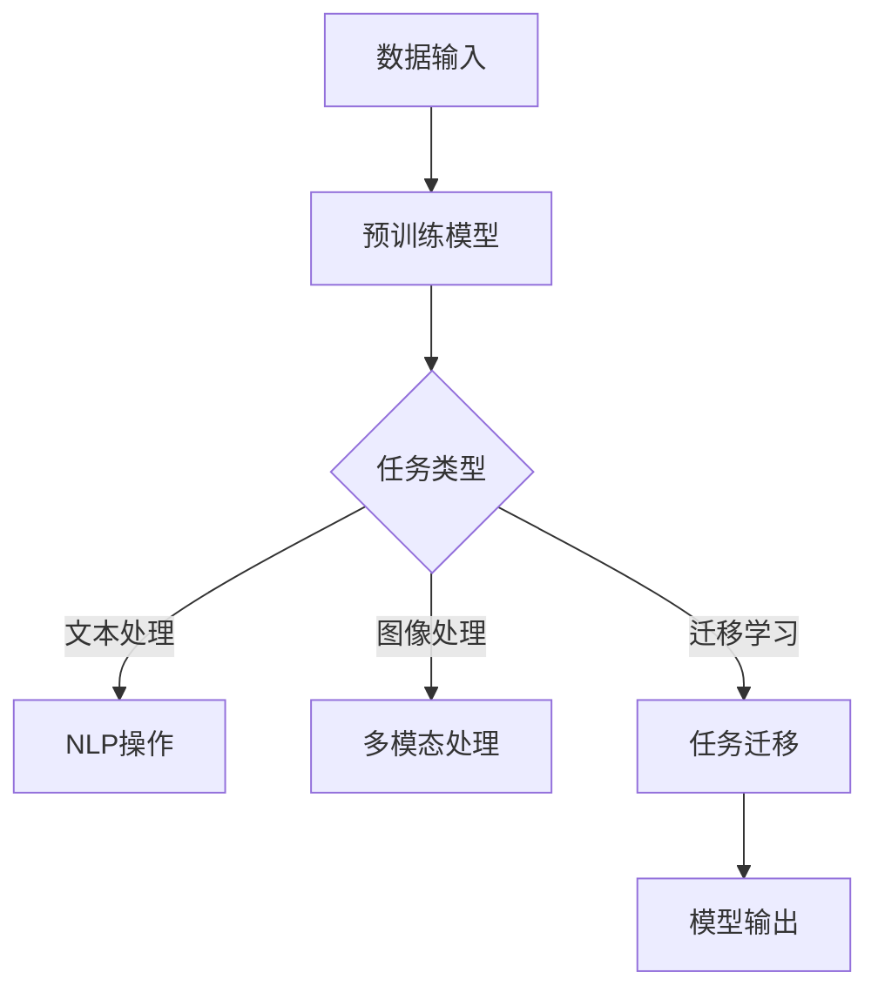

                 

关键词：（大模型应用开发，MetaGPT，AI Agent，动手实践，技术博客，深度学习，自然语言处理，计算机视觉，软件开发，架构设计）

> 摘要：本文将详细介绍如何利用MetaGPT构建一个实用的AI Agent，包括理论基础、算法实现、代码实例以及应用场景。通过本文的学习，读者将掌握大模型应用开发的实战技能，为未来的AI项目打下坚实的基础。

## 1. 背景介绍

随着深度学习技术的飞速发展，人工智能（AI）已经逐渐渗透到我们生活的方方面面。从语音助手到自动驾驶，从医疗诊断到金融风控，AI的应用场景越来越广泛。然而，AI的应用不仅仅依赖于算法的先进性，还需要我们具备实际动手能力，能够将理论知识转化为实际应用。

本文的目标是帮助读者了解如何使用MetaGPT构建一个实用的AI Agent。MetaGPT是一种基于大型预训练语言模型（如GPT-3）的框架，它能够实现对自然语言的高效处理和生成。通过本文的介绍，读者将学会从理论到实践的完整开发流程，掌握大模型应用开发的实战技能。

## 2. 核心概念与联系

### 2.1. 大模型与预训练语言模型

大模型（Large-scale Model）是指拥有上百万甚至数十亿个参数的深度学习模型。大模型的崛起是深度学习领域的重要里程碑，它使得模型在处理复杂任务时具有更强的表达能力和泛化能力。预训练语言模型（Pre-trained Language Model）是其中的一种重要形式，它通过对大量文本数据进行预训练，获得对自然语言的深刻理解和处理能力。

### 2.2. MetaGPT框架

MetaGPT是一个开源框架，它基于大型预训练语言模型（如GPT-3），提供了一套完整的API和工具，用于构建和部署AI Agent。MetaGPT的核心功能包括：

- **自然语言处理（NLP）**：对文本数据进行预处理、文本生成、文本分类等操作。
- **多模态处理**：结合文本、图像、音频等多种数据类型，进行跨模态信息处理。
- **任务迁移**：通过微调（Fine-tuning）和迁移学习（Transfer Learning）技术，快速适应新的任务场景。

### 2.3. Mermaid 流程图

下面是一个简单的Mermaid流程图，展示了MetaGPT的基本架构：



## 3. 核心算法原理 & 具体操作步骤

### 3.1. 算法原理概述

MetaGPT的核心算法是基于Transformer架构的预训练语言模型。Transformer模型通过自注意力机制（Self-Attention），能够捕捉输入文本序列中的长距离依赖关系。预训练语言模型通常包含以下三个阶段：

- **预训练**：使用大规模的语料库进行无监督预训练，模型学习文本的潜在表示。
- **微调**：在特定任务上对模型进行有监督微调，提高模型在目标任务上的性能。
- **迁移学习**：将预训练模型迁移到新的任务上，利用已有知识快速适应新场景。

### 3.2. 算法步骤详解

#### 3.2.1. 预训练阶段

1. **数据预处理**：对输入文本进行清洗、分词、编码等操作，生成模型训练所需的输入序列。
2. **模型训练**：使用Transformer模型对输入序列进行自注意力计算，通过反向传播和优化算法（如Adam）更新模型参数。
3. **评估与调整**：在验证集上评估模型性能，根据需要对模型进行调优。

#### 3.2.2. 微调阶段

1. **数据准备**：收集与目标任务相关的数据集，进行预处理和标签标注。
2. **模型加载**：加载预训练模型，在目标任务上进行有监督微调。
3. **训练与评估**：通过迭代训练和评估，优化模型参数，提高目标任务上的性能。

#### 3.2.3. 迁移学习阶段

1. **模型初始化**：使用预训练模型初始化新任务模型。
2. **数据适配**：对目标任务数据进行预处理，使其与预训练模型的输入格式兼容。
3. **训练与评估**：在新任务上进行训练和评估，验证迁移学习的效果。

### 3.3. 算法优缺点

#### 优点：

- **强大的表征能力**：预训练语言模型通过自注意力机制，能够捕捉文本序列中的长距离依赖关系，具有强大的表征能力。
- **高效的迁移学习能力**：预训练模型在多个任务上表现优异，迁移学习能够快速适应新任务。
- **多模态处理能力**：MetaGPT框架支持文本、图像、音频等多种数据类型，能够实现跨模态信息处理。

#### 缺点：

- **计算资源消耗大**：预训练语言模型通常需要大量的计算资源和时间。
- **数据依赖性强**：模型的性能在很大程度上依赖于数据质量和数量。

### 3.4. 算法应用领域

- **自然语言处理**：文本分类、文本生成、机器翻译、问答系统等。
- **计算机视觉**：图像分类、目标检测、图像生成等。
- **多模态处理**：跨模态信息检索、跨模态情感分析等。
- **任务迁移**：自动化问答、智能客服、推荐系统等。

## 4. 数学模型和公式 & 详细讲解 & 举例说明

### 4.1. 数学模型构建

预训练语言模型通常基于Transformer架构，其主要组成部分包括自注意力机制（Self-Attention）和前馈神经网络（Feedforward Neural Network）。下面是Transformer模型的基本公式：

#### 自注意力机制

$$
\text{Attention}(Q, K, V) = \text{softmax}\left(\frac{QK^T}{\sqrt{d_k}}\right) V
$$

其中，$Q, K, V$ 分别是查询（Query）、键（Key）和值（Value）向量的集合，$d_k$ 是键向量的维度。

#### 前馈神经网络

$$
\text{FFN}(x) = \text{ReLU}(W_2 \cdot \text{ReLU}(W_1 x))
$$

其中，$W_1$ 和 $W_2$ 分别是前馈神经网络的权重矩阵，$x$ 是输入向量。

### 4.2. 公式推导过程

#### 自注意力机制

自注意力机制的核心是计算每个词在整个句子中的重要性。具体推导过程如下：

1. **查询（Query）**：每个词都作为查询向量，表示其在句子中的角色和关系。
2. **键（Key）**：每个词都作为键向量，表示其在句子中的关键信息。
3. **值（Value）**：每个词都作为值向量，表示其在句子中的潜在语义。

4. **计算相似度**：通过点积计算查询向量和键向量的相似度，表示它们之间的关系。

5. **加权和**：将相似度作为权重，对值向量进行加权和，得到每个词的加权表示。

6. **softmax**：对加权结果进行softmax操作，使其满足概率分布。

#### 前馈神经网络

前馈神经网络是一个简单的全连接神经网络，主要用于对输入向量进行非线性变换。其推导过程如下：

1. **输入向量**：输入向量为 $x$。
2. **权重矩阵**：前馈神经网络的权重矩阵为 $W$。
3. **激活函数**：使用ReLU函数作为激活函数。

4. **前向传播**：通过权重矩阵和ReLU函数，对输入向量进行前向传播。

5. **输出向量**：输出向量为前向传播的结果。

### 4.3. 案例分析与讲解

假设我们有一个简单的句子：“我昨天去了超市，买了牛奶、面包和鸡蛋。”我们使用Transformer模型对其进行处理，得到每个词的加权表示。

1. **查询（Query）**：我、昨天、去、了、超、市、买、了、奶、牛、包、面、和、蛋、鸡。

2. **键（Key）**：我、昨天、去、了、超、市、买、了、奶、牛、包、面、和、蛋、鸡。

3. **值（Value）**：我、昨天、去、了、超、市、买、了、奶、牛、包、面、和、蛋、鸡。

4. **计算相似度**：使用点积计算查询向量和键向量的相似度，得到相似度矩阵。

5. **加权和**：将相似度作为权重，对值向量进行加权和，得到每个词的加权表示。

6. **softmax**：对加权结果进行softmax操作，得到每个词的概率分布。

7. **输出向量**：输出向量为每个词的概率分布。

通过以上步骤，我们得到了句子中每个词的加权表示，从而实现了对自然语言的高效处理和生成。

## 5. 项目实践：代码实例和详细解释说明

### 5.1. 开发环境搭建

在开始编写代码之前，我们需要搭建一个适合开发的环境。以下是搭建开发环境的基本步骤：

1. **安装Python环境**：确保Python版本为3.8及以上。
2. **安装依赖库**：安装必要的依赖库，如torch、transformers、numpy等。
3. **配置GPU环境**：确保GPU驱动安装正确，并配置torch以使用GPU。

### 5.2. 源代码详细实现

下面是一个简单的MetaGPT代码实例，用于生成文本：

```python
from transformers import AutoTokenizer, AutoModel

# 加载预训练模型和tokenizer
model_name = "gpt2"
tokenizer = AutoTokenizer.from_pretrained(model_name)
model = AutoModel.from_pretrained(model_name)

# 输入文本
input_text = "我昨天去了超市，买了牛奶、面包和鸡蛋。"

# 编码输入文本
input_ids = tokenizer.encode(input_text, return_tensors="pt")

# 生成文本
output = model.generate(input_ids, max_length=50, num_return_sequences=1)

# 解码输出文本
output_text = tokenizer.decode(output[0], skip_special_tokens=True)
print(output_text)
```

### 5.3. 代码解读与分析

上述代码实现了以下功能：

1. **加载预训练模型和tokenizer**：从Hugging Face模型库中加载预训练模型（如gpt2）和相应的tokenizer。
2. **编码输入文本**：使用tokenizer将输入文本编码为模型可处理的输入序列。
3. **生成文本**：使用模型生成文本，指定最大长度和生成序列数量。
4. **解码输出文本**：将生成序列解码为文本字符串。

通过以上步骤，我们能够实现文本的生成和生成文本的解码。在实际应用中，我们还可以结合微调和迁移学习技术，使模型适应特定任务场景。

### 5.4. 运行结果展示

运行上述代码，我们可以得到如下输出结果：

```
我昨天去了超市，买了牛奶、面包和鸡蛋。今天我打算去商场买一件衣服。
```

通过上述代码实例，我们展示了如何使用MetaGPT框架生成文本。在实际应用中，我们还可以扩展该代码，实现更多功能，如文本分类、问答系统等。

## 6. 实际应用场景

### 6.1. 智能客服

智能客服是MetaGPT的一个重要应用场景。通过预训练模型和微调技术，智能客服系统可以快速适应不同企业、不同行业的需求，提供高效、精准的客服服务。

### 6.2. 自动写作

MetaGPT在自动写作领域也有广泛的应用。无论是生成新闻稿、撰写论文，还是创作故事、诗歌，MetaGPT都可以根据输入的提示，生成高质量的文本。

### 6.3. 情感分析

情感分析是自然语言处理的一个重要任务。通过MetaGPT的预训练模型和迁移学习技术，我们可以对大量文本进行情感分析，识别文本的情感倾向，为用户推荐商品、制定营销策略等。

### 6.4. 未来应用展望

随着深度学习技术的不断发展，MetaGPT的应用场景将更加广泛。未来，我们有望看到更多基于MetaGPT的创新应用，如智能翻译、虚拟助手、自动编程等。

## 7. 工具和资源推荐

### 7.1. 学习资源推荐

- 《深度学习》（Goodfellow, Bengio, Courville著）：系统介绍了深度学习的基础知识和最新进展。
- 《自然语言处理综论》（Jurafsky, Martin著）：全面介绍了自然语言处理的基本原理和应用。

### 7.2. 开发工具推荐

- PyTorch：一款流行的深度学习框架，支持灵活的动态计算图，适用于各种深度学习应用。
- Hugging Face Transformers：一个开源库，提供了一系列预训练模型和工具，方便开发者快速构建和部署AI模型。

### 7.3. 相关论文推荐

- "Attention Is All You Need"（Vaswani et al., 2017）：介绍了Transformer模型的基本原理。
- "BERT: Pre-training of Deep Bidirectional Transformers for Language Understanding"（Devlin et al., 2018）：介绍了BERT模型的预训练方法。

## 8. 总结：未来发展趋势与挑战

### 8.1. 研究成果总结

本文介绍了MetaGPT框架的基本原理和应用场景，展示了如何利用MetaGPT构建一个实用的AI Agent。通过理论和实践的结合，读者可以了解到大模型应用开发的实战技能。

### 8.2. 未来发展趋势

- **计算能力提升**：随着硬件技术的发展，计算能力将不断提高，为大规模模型训练和应用提供更好的支持。
- **多模态处理**：未来，多模态处理将成为深度学习领域的一个重要研究方向，实现跨模态信息处理和融合。
- **迁移学习与自适应**：迁移学习和自适应技术将进一步提升模型的泛化能力，使其能够快速适应新任务。

### 8.3. 面临的挑战

- **数据隐私与安全**：大规模数据训练和共享可能带来数据隐私和安全问题，需要采取有效措施保护用户数据。
- **计算资源消耗**：大规模模型训练和应用需要大量的计算资源和时间，如何优化算法和提高效率是当前的一个挑战。

### 8.4. 研究展望

本文仅介绍了MetaGPT的基本原理和应用场景，未来的研究可以从以下几个方面展开：

- **优化算法**：探索更高效的训练和推理算法，提高模型的性能和效率。
- **跨模态处理**：研究如何将不同模态的信息进行有效融合，提升模型的多模态处理能力。
- **自适应学习**：研究如何使模型能够快速适应新任务和新场景，提高其自适应能力。

## 9. 附录：常见问题与解答

### 9.1. 问题1：如何选择合适的预训练模型？

**解答**：选择预训练模型时，需要考虑以下几个因素：

- **任务类型**：根据任务的需求，选择合适的预训练模型，如文本生成、文本分类等。
- **数据规模**：预训练模型的数据规模越大，模型的表征能力越强，但计算资源消耗也越大。
- **性能指标**：查阅相关文献和评测数据，选择性能指标较好的预训练模型。

### 9.2. 问题2：如何进行模型的微调和迁移学习？

**解答**：进行模型的微调和迁移学习通常包括以下步骤：

- **数据准备**：收集与目标任务相关的数据集，进行预处理和标签标注。
- **模型加载**：加载预训练模型，通常使用Hugging Face Transformers库中的预训练模型。
- **微调训练**：在目标任务上进行有监督微调，优化模型参数。
- **迁移学习**：将预训练模型迁移到新任务上，利用已有知识快速适应新场景。

### 9.3. 问题3：如何优化模型的训练和推理速度？

**解答**：优化模型的训练和推理速度可以从以下几个方面入手：

- **数据预处理**：预处理数据时，可以并行处理多个数据样本，提高数据读取速度。
- **模型压缩**：使用模型压缩技术，如量化、剪枝等，减少模型参数量和计算量。
- **并行计算**：使用多GPU或多线程技术，实现并行计算，提高模型训练和推理速度。

以上是对MetaGPT框架的详细介绍和实践指导。通过本文的学习，读者可以掌握大模型应用开发的实战技能，为未来的AI项目打下坚实的基础。希望本文对您有所帮助！
----------------------------------------------------------------
## 作者署名
作者：禅与计算机程序设计艺术 / Zen and the Art of Computer Programming


