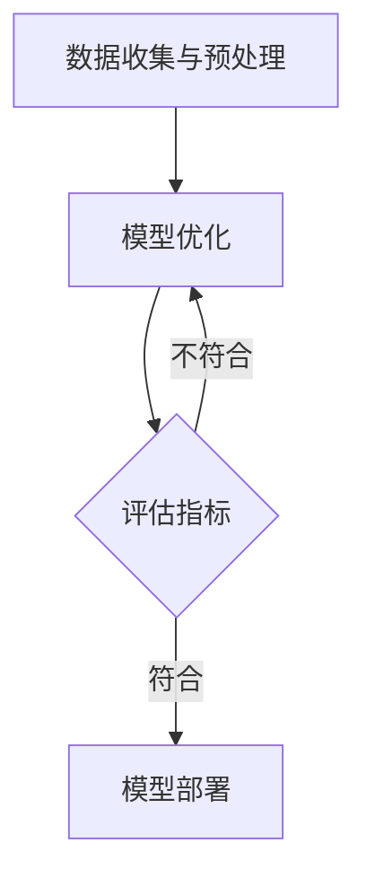

                 

关键词：下一代AI Agent、科研论文、大模型应用开发、智能代理、技术思维、深度学习、知识图谱、算法优化、应用场景、未来展望

摘要：本文将探讨下一代AI Agent的诞生地，结合最新的科研论文，分析大模型应用开发在构建智能代理中的重要性和挑战。通过深入理解核心概念、算法原理、数学模型以及实际应用案例，我们旨在为开发者提供清晰的指导，助力他们在人工智能领域实现创新。

## 1. 背景介绍

随着人工智能技术的飞速发展，智能代理（AI Agent）已成为众多领域的焦点。智能代理是指能够在特定环境下自主行动并达到特定目标的计算实体，其核心在于实现人工智能的决策和执行能力。然而，传统代理系统在面对复杂、动态和不确定的环境时，表现往往不尽如人意。近年来，随着深度学习和大模型技术的突破，新一代智能代理的研究与应用迎来了前所未有的机遇。

科研论文作为人工智能领域的知识源泉，不断提出新的理论和方法，为智能代理的开发提供了宝贵的思路。本篇文章将聚焦于最新的科研论文，探讨如何通过大模型应用开发实现下一代智能代理的诞生。

## 2. 核心概念与联系

### 2.1 智能代理的定义

智能代理是一种具有自主决策和执行能力的计算实体，能够在动态环境中实现目标。它具备以下几个核心特征：

1. **自主性**：智能代理能够根据环境信息自主做出决策，而不需要人类干预。
2. **适应性**：智能代理能够在不同环境中进行学习，并适应环境的变化。
3. **协作性**：智能代理能够与其他代理或人类协作，共同实现目标。

### 2.2 大模型应用开发

大模型应用开发是指利用大规模深度学习模型进行人工智能应用的开发。大模型具备以下特点：

1. **参数规模大**：大模型通常拥有数亿甚至千亿级别的参数，能够处理复杂的数据。
2. **训练数据量大**：大模型的训练依赖于大量的高质量数据，能够提高模型的泛化能力。
3. **自适应性强**：大模型能够通过不断的学习和调整，适应不同的应用场景。

### 2.3 Mermaid 流程图

以下是一个简化的Mermaid流程图，展示了智能代理构建的基本流程：



在这个流程中，数据收集与预处理是智能代理构建的第一步，确保数据的质量和多样性。模型训练是核心步骤，通过大规模数据训练大模型，使其具备较强的决策能力。评估指标用于衡量模型性能，根据评估结果进行模型部署或优化。

## 3. 核心算法原理 & 具体操作步骤

### 3.1 算法原理概述

下一代智能代理的核心在于深度学习算法，特别是基于大模型的强化学习算法。强化学习是一种使代理通过试错学习在特定环境中达到目标的方法。大模型在强化学习中起到了关键作用，通过大规模数据训练，使其能够高效地处理复杂的环境和任务。

### 3.2 算法步骤详解

1. **数据收集与预处理**：收集相关的环境数据，包括视觉、文本、音频等多模态数据，并进行预处理，如数据清洗、数据增强等。
2. **模型训练**：使用大规模数据训练深度学习模型，包括卷积神经网络（CNN）、循环神经网络（RNN）和生成对抗网络（GAN）等，使其具备较强的特征提取和表示能力。
3. **环境模拟**：构建一个模拟环境，使代理能够在虚拟环境中进行试错学习。
4. **决策与执行**：代理根据当前状态和模型预测，选择最佳动作，并在环境中执行动作。
5. **反馈与调整**：根据环境反馈，调整代理的模型参数，优化其决策能力。
6. **评估与部署**：评估代理的性能，并根据评估结果进行模型部署或优化。

### 3.3 算法优缺点

**优点**：

1. **自适应性强**：大模型能够通过不断学习，适应不同的环境和任务。
2. **泛化能力强**：大规模数据训练使得模型具备较强的泛化能力，能够处理复杂的问题。
3. **高效性**：深度学习算法能够高效地处理大量数据，提高代理的决策速度。

**缺点**：

1. **计算资源消耗大**：大模型训练需要大量的计算资源和时间。
2. **数据依赖性强**：模型的性能依赖于训练数据的质量和多样性。
3. **可解释性差**：深度学习模型通常具有较差的可解释性，难以理解其决策过程。

### 3.4 算法应用领域

深度学习算法在智能代理领域具有广泛的应用，如：

1. **机器人控制**：通过智能代理实现机器人在复杂环境中的自主导航和任务执行。
2. **自动驾驶**：利用智能代理实现自动驾驶汽车的安全和高效行驶。
3. **智能客服**：智能代理能够模拟人类客服，提供高效的客户服务。
4. **游戏AI**：智能代理能够参与游戏，与人类玩家进行对抗。

## 4. 数学模型和公式 & 详细讲解 & 举例说明

### 4.1 数学模型构建

在深度学习算法中，常见的数学模型包括神经网络、生成对抗网络等。以下是一个简化的神经网络模型：

```latex
y = f(W \cdot x + b)
```

其中，\(y\) 为输出值，\(f\) 为激活函数，\(W\) 为权重矩阵，\(x\) 为输入值，\(b\) 为偏置项。

### 4.2 公式推导过程

以卷积神经网络（CNN）为例，推导其损失函数：

1. **前向传播**：

   输入图像 \(x\) 经过卷积层、池化层和全连接层，得到输出 \(y\)：

   $$y = f(W_3 \cdot f(W_2 \cdot f(W_1 \cdot x + b_1) + b_2) + b_3)$$

2. **损失函数**：

   使用交叉熵损失函数计算预测标签与真实标签之间的差异：

   $$L = -\frac{1}{n} \sum_{i=1}^{n} y_i \cdot \log(y_i^{\prime})$$

   其中，\(y_i\) 为真实标签，\(y_i^{\prime}\) 为预测标签。

3. **反向传播**：

   通过反向传播算法，计算梯度并更新权重矩阵 \(W\) 和偏置项 \(b\)：

   $$\frac{\partial L}{\partial W} = \frac{\partial L}{\partial y} \cdot \frac{\partial y}{\partial W}$$

   $$\frac{\partial L}{\partial b} = \frac{\partial L}{\partial y} \cdot \frac{\partial y}{\partial b}$$

### 4.3 案例分析与讲解

以下是一个使用深度学习算法训练智能代理的案例：

**案例背景**：一个智能代理需要在迷宫中找到出口。

**数据集**：迷宫环境数据，包括迷宫地图和出口位置。

**算法**：使用卷积神经网络（CNN）进行训练。

**步骤**：

1. **数据预处理**：将迷宫地图和出口位置数据进行归一化处理。

2. **模型构建**：构建一个简单的CNN模型，包括卷积层、池化层和全连接层。

3. **模型训练**：使用训练数据集训练模型，调整权重和偏置项，优化模型性能。

4. **模型评估**：使用验证数据集评估模型性能，调整模型参数，提高准确率。

5. **模型部署**：将训练好的模型部署到迷宫环境中，进行测试和实际应用。

## 5. 项目实践：代码实例和详细解释说明

### 5.1 开发环境搭建

1. 安装Python环境，版本要求3.8及以上。
2. 安装深度学习框架TensorFlow，版本要求2.6及以上。
3. 安装其他相关库，如NumPy、Pandas等。

### 5.2 源代码详细实现

以下是一个简单的CNN模型训练代码示例：

```python
import tensorflow as tf
from tensorflow.keras import layers

# 构建模型
model = tf.keras.Sequential([
    layers.Conv2D(32, (3, 3), activation='relu', input_shape=(28, 28, 1)),
    layers.MaxPooling2D((2, 2)),
    layers.Conv2D(64, (3, 3), activation='relu'),
    layers.MaxPooling2D((2, 2)),
    layers.Conv2D(64, (3, 3), activation='relu'),
    layers.Flatten(),
    layers.Dense(64, activation='relu'),
    layers.Dense(10, activation='softmax')
])

# 编译模型
model.compile(optimizer='adam',
              loss='sparse_categorical_crossentropy',
              metrics=['accuracy'])

# 加载MNIST数据集
(x_train, y_train), (x_test, y_test) = tf.keras.datasets.mnist.load_data()

# 预处理数据
x_train = x_train / 255.0
x_test = x_test / 255.0

# 训练模型
model.fit(x_train, y_train, epochs=5)

# 评估模型
model.evaluate(x_test, y_test)
```

### 5.3 代码解读与分析

1. **模型构建**：使用TensorFlow的Sequential模型，依次添加卷积层、池化层和全连接层。
2. **编译模型**：设置优化器、损失函数和评估指标。
3. **数据预处理**：对MNIST数据集进行归一化处理，提高模型训练效果。
4. **模型训练**：使用训练数据集训练模型，调整权重和偏置项。
5. **模型评估**：使用测试数据集评估模型性能，验证训练效果。

## 6. 实际应用场景

### 6.1 机器人控制

在机器人控制领域，智能代理可以通过深度学习算法实现对复杂环境的感知和决策。例如，自动驾驶汽车可以使用智能代理实现自主导航和避障。

### 6.2 智能客服

智能客服系统中的智能代理可以理解用户的问题，提供准确的回答和建议。通过深度学习和自然语言处理技术，智能代理能够与人类进行流畅的对话。

### 6.3 游戏AI

在游戏中，智能代理可以作为玩家对手，提供具有挑战性的游戏体验。通过深度学习算法，智能代理能够不断学习和进化，提高游戏水平。

### 6.4 未来应用展望

随着人工智能技术的不断进步，智能代理将在更多领域发挥重要作用。未来，智能代理有望在医疗、金融、教育等领域实现广泛应用，为人类带来更多便利和效益。

## 7. 工具和资源推荐

### 7.1 学习资源推荐

1. 《深度学习》（Goodfellow, Bengio, Courville）- 介绍深度学习的基本理论和应用。
2. 《强化学习》（Sutton, Barto）- 介绍强化学习的基本原理和方法。
3. 《Python深度学习》（François Chollet）- 介绍使用Python实现深度学习的实践方法。

### 7.2 开发工具推荐

1. TensorFlow - 开源深度学习框架，支持多种深度学习模型。
2. PyTorch - 开源深度学习框架，支持动态计算图和自动微分。
3. Keras - 高级神经网络API，简化深度学习模型构建和训练。

### 7.3 相关论文推荐

1. "Deep Reinforcement Learning for Autonomous Navigation"（DeepMind，2016）- 介绍深度强化学习在自动驾驶中的应用。
2. "Unsupervised Learning of Visual Representations by Solving Jigsaw Puzzles"（Google，2016）- 介绍使用视觉任务进行自监督学习的方法。
3. "Generative Adversarial Nets"（Goodfellow et al.，2014）- 介绍生成对抗网络（GAN）的基本原理和应用。

## 8. 总结：未来发展趋势与挑战

### 8.1 研究成果总结

近年来，人工智能技术取得了显著进展，特别是深度学习和大模型应用开发。通过科研论文的推动，智能代理在多个领域取得了突破性成果。然而，现有智能代理仍面临诸多挑战，如计算资源消耗、数据依赖性和可解释性等。

### 8.2 未来发展趋势

未来，智能代理的发展趋势包括：

1. **多模态融合**：结合视觉、文本、音频等多种模态数据，提高代理的感知和决策能力。
2. **知识图谱**：利用知识图谱构建智能代理的知识库，实现更高级的推理和决策能力。
3. **联邦学习**：通过联邦学习实现分布式训练，降低计算资源消耗，提高数据隐私保护。

### 8.3 面临的挑战

智能代理面临的主要挑战包括：

1. **计算资源消耗**：大模型训练需要大量计算资源和时间，如何优化训练效率成为关键问题。
2. **数据依赖性**：智能代理的性能依赖于训练数据的质量和多样性，如何解决数据偏差和稀疏性问题。
3. **可解释性**：深度学习模型具有较差的可解释性，如何提高模型的可解释性，使其更具透明性和可信度。

### 8.4 研究展望

未来，智能代理的研究应关注以下几个方面：

1. **算法优化**：通过算法优化提高智能代理的性能和效率。
2. **跨领域应用**：探索智能代理在更多领域的应用，实现跨领域的知识共享和迁移。
3. **人机协作**：研究智能代理与人类协作的模式和方法，提高人机协同效率。

## 9. 附录：常见问题与解答

### 9.1 问题1：什么是大模型应用开发？

大模型应用开发是指利用大规模深度学习模型进行人工智能应用的开发。它具有参数规模大、训练数据量大和自适应性强等特点。

### 9.2 问题2：智能代理的核心特征是什么？

智能代理的核心特征包括自主性、适应性和协作性。自主性使代理能够自主决策，适应性使代理能够适应不同的环境，协作性使代理能够与其他代理或人类协作。

### 9.3 问题3：深度学习算法在智能代理中的应用有哪些？

深度学习算法在智能代理中的应用包括卷积神经网络（CNN）、循环神经网络（RNN）和生成对抗网络（GAN）等。这些算法能够提高代理的感知、决策和执行能力。

### 9.4 问题4：智能代理面临的主要挑战是什么？

智能代理面临的主要挑战包括计算资源消耗、数据依赖性和可解释性等。如何优化训练效率、解决数据偏差和提高模型的可解释性是关键问题。

### 9.5 问题5：未来智能代理的发展趋势是什么？

未来智能代理的发展趋势包括多模态融合、知识图谱和联邦学习等。通过结合多种模态数据、构建知识图谱和实现分布式训练，智能代理将实现更高级的感知和决策能力。

