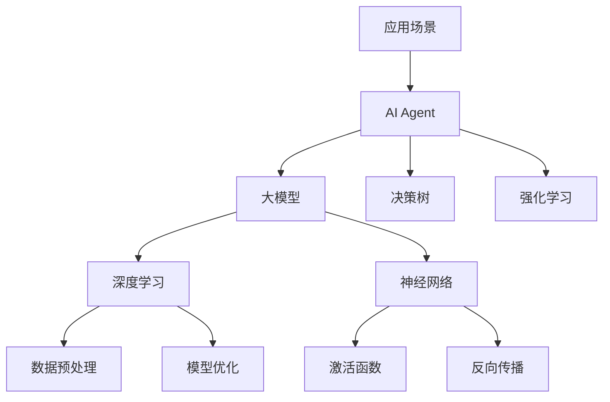

                 

 关键词：大模型应用、AI Agent、批判修正、技术博客、深度学习、算法原理、数学模型、项目实践、未来展望

> 摘要：本文将深入探讨大模型在AI Agent开发中的应用，通过批判修正的方法，分析当前技术实现的优缺点，并给出改进建议。本文旨在为开发者提供理论与实践相结合的指导，推动大模型应用的发展。

## 1. 背景介绍

随着深度学习技术的飞速发展，大模型在自然语言处理、图像识别、推荐系统等领域取得了显著的成果。AI Agent作为智能系统的核心，通过模拟人类行为和决策能力，实现了与环境的交互。然而，在大模型应用过程中，存在一些问题亟待解决。本文旨在通过对现有技术进行批判修正，提升AI Agent的开发质量和效果。

### 1.1 大模型发展现状

近年来，深度学习模型如BERT、GPT-3等取得了惊人的性能提升，使得自然语言处理任务的准确率大幅提高。然而，这些大模型在训练过程中需要巨大的计算资源，同时面临过拟合、数据隐私等问题。

### 1.2 AI Agent的发展与应用

AI Agent作为智能系统的代表，被广泛应用于智能客服、自动驾驶、智能家居等领域。然而，现有的AI Agent在应对复杂环境、处理多模态信息方面存在一定的局限性。

### 1.3 批判修正的意义

批判修正是一种反思和改进现有技术的方法，通过深入分析现有技术的优缺点，提出改进方案，以推动技术的不断发展。本文将结合实际案例，对大模型应用和AI Agent开发进行批判修正，为后续研究提供有益的参考。

## 2. 核心概念与联系

在探讨大模型应用和AI Agent开发之前，我们需要了解一些核心概念及其相互关系。以下是一个简化的Mermaid流程图，展示了大模型、AI Agent及相关概念之间的联系。



### 2.1 大模型与深度学习

大模型是基于深度学习理论构建的，深度学习通过多层神经网络对数据特征进行学习，从而实现复杂的预测和分类任务。大模型的核心是神经网络，其通过不断调整网络参数，使得模型在训练数据上达到较好的性能。

### 2.2 数据预处理与模型优化

数据预处理是深度学习的重要组成部分，包括数据清洗、归一化、特征提取等步骤。模型优化则通过调整超参数、优化算法等手段，提升模型的训练效率和性能。

### 2.3 AI Agent与相关技术

AI Agent是智能系统的核心，通过模拟人类行为和决策能力，实现与环境的交互。AI Agent可以基于决策树、强化学习等技术实现，同时需要结合具体应用场景进行优化。

### 2.4 应用场景

不同的应用场景对AI Agent提出了不同的要求，如自然语言处理、图像识别、推荐系统等。针对这些应用场景，需要选择合适的大模型和AI Agent技术，并进行优化和调整。

## 3. 核心算法原理 & 具体操作步骤

### 3.1 算法原理概述

在AI Agent开发中，常用的核心算法包括深度学习、决策树和强化学习。以下将对这些算法的原理进行简要概述。

### 3.2 算法步骤详解

#### 3.2.1 深度学习

1. 数据预处理：对原始数据进行清洗、归一化等处理，以便于模型训练。
2. 网络构建：设计多层神经网络结构，包括输入层、隐藏层和输出层。
3. 模型训练：通过反向传播算法，不断调整网络参数，使得模型在训练数据上达到较好的性能。
4. 模型评估：使用验证集和测试集评估模型性能，调整超参数以优化模型。

#### 3.2.2 决策树

1. 特征选择：根据信息增益、增益率等指标选择最佳特征。
2. 切分数据：根据最佳特征，将数据集划分为若干子集。
3. 构建树结构：递归地构建树结构，直到满足终止条件（如叶节点纯度较高）。
4. 预测：根据树结构对样本进行分类或回归预测。

#### 3.2.3 强化学习

1. 状态表示：将环境状态编码为状态向量。
2. 动作表示：将可执行的动作编码为动作向量。
3. 奖励设计：设计奖励函数，以评价动作的效果。
4. 价值函数学习：通过经验回放、策略迭代等方法，学习状态值函数或策略。
5. 行动决策：根据当前状态和学到的价值函数，选择最优动作。

### 3.3 算法优缺点

#### 3.3.1 深度学习

**优点**：
- 能够处理大规模数据，提取复杂特征。
- 在图像识别、自然语言处理等领域具有很好的性能。

**缺点**：
- 需要大量训练数据。
- 模型训练过程较慢。
- 过拟合问题难以避免。

#### 3.3.2 决策树

**优点**：
- 算法简单，易于实现。
- 可解释性较强，便于调试。

**缺点**：
- 对于高维数据，性能较差。
- 容易产生过拟合。

#### 3.3.3 强化学习

**优点**：
- 能够处理动态变化的环境。
- 自适应性强，能够不断优化策略。

**缺点**：
- 需要大量的训练时间。
- 奖励设计较为复杂。

### 3.4 算法应用领域

- **深度学习**：图像识别、自然语言处理、推荐系统等。
- **决策树**：分类、回归等。
- **强化学习**：自动驾驶、游戏AI等。

## 4. 数学模型和公式 & 详细讲解 & 举例说明

### 4.1 数学模型构建

在本节中，我们将介绍深度学习、决策树和强化学习中的关键数学模型。这些模型包括前向传播、损失函数、决策树分类函数以及强化学习的Q值函数。

### 4.2 公式推导过程

#### 4.2.1 深度学习

在深度学习中，前向传播过程是核心。给定输入\( x \)，通过一系列的线性变换和激活函数，得到输出\( y \)。

\[ y = f(z) = \sigma(W \cdot x + b) \]

其中，\( f \)是激活函数，通常使用Sigmoid、ReLU等函数。\( W \)是权重矩阵，\( b \)是偏置项。

损失函数用于评估模型的预测值与真实值之间的差距。常用的损失函数包括均方误差（MSE）和交叉熵损失。

\[ L = \frac{1}{2} \sum_{i=1}^{n} (y_i - \hat{y}_i)^2 \]

或

\[ L = -\sum_{i=1}^{n} y_i \log(\hat{y}_i) \]

#### 4.2.2 决策树

在决策树中，分类函数用于将样本分配到不同的类别。假设有\( k \)个类别，分类函数可以表示为：

\[ g(x) = \arg\max_{c \in \{1, 2, ..., k\}} P(c|x) \]

其中，\( P(c|x) \)是给定特征\( x \)时类别\( c \)的概率。

#### 4.2.3 强化学习

在强化学习中，Q值函数用于评估在给定状态\( s \)和动作\( a \)时的价值。

\[ Q(s, a) = \sum_{s'} P(s'|s, a) \sum_{r} r P(r|s', a) + \gamma \max_{a'} Q(s', a') \]

其中，\( P(s'|s, a) \)是状态转移概率，\( P(r|s', a) \)是奖励概率，\( \gamma \)是折扣因子。

### 4.3 案例分析与讲解

#### 4.3.1 深度学习：图像识别

假设我们使用卷积神经网络（CNN）进行图像识别。给定一张猫的图像，我们希望将其分类为“猫”或“狗”。

1. 数据预处理：对图像进行缩放、归一化等处理。
2. 网络构建：设计卷积层、池化层、全连接层等。
3. 模型训练：通过反向传播算法，调整网络参数。
4. 模型评估：使用测试集评估模型性能。

#### 4.3.2 决策树：贷款审批

假设我们使用决策树对贷款申请进行审批。给定申请者的个人信息和财务状况，我们希望判断其是否批准贷款。

1. 特征选择：选择与贷款审批相关的特征。
2. 切分数据：将数据集划分为训练集和测试集。
3. 构建树结构：递归地构建决策树。
4. 预测：根据树结构对样本进行分类。

#### 4.3.3 强化学习：自动驾驶

假设我们使用强化学习实现自动驾驶。车辆在行驶过程中需要不断选择最佳动作，以避免碰撞、保持车道等。

1. 状态表示：将车辆位置、速度、周围车辆等信息编码为状态向量。
2. 动作表示：定义前进、转向、刹车等动作。
3. 奖励设计：定义碰撞、保持车道等奖励。
4. 价值函数学习：通过经验回放、策略迭代等方法，学习状态值函数或策略。

## 5. 项目实践：代码实例和详细解释说明

在本节中，我们将通过一个简单的项目实例，展示如何使用Python和深度学习框架（如TensorFlow或PyTorch）实现AI Agent。

### 5.1 开发环境搭建

1. 安装Python（3.7及以上版本）。
2. 安装TensorFlow或PyTorch。
3. 安装其他必需的库（如NumPy、Pandas等）。

### 5.2 源代码详细实现

以下是一个简单的AI Agent实现，使用TensorFlow框架进行训练和预测。

```python
import tensorflow as tf
from tensorflow.keras.models import Sequential
from tensorflow.keras.layers import Dense, Conv2D, Flatten, MaxPooling2D
from tensorflow.keras.optimizers import Adam

# 数据预处理
(x_train, y_train), (x_test, y_test) = tf.keras.datasets.cifar10.load_data()
x_train, x_test = x_train / 255.0, x_test / 255.0

# 网络构建
model = Sequential([
    Conv2D(32, (3, 3), activation='relu', input_shape=(32, 32, 3)),
    MaxPooling2D((2, 2)),
    Conv2D(64, (3, 3), activation='relu'),
    MaxPooling2D((2, 2)),
    Flatten(),
    Dense(64, activation='relu'),
    Dense(10, activation='softmax')
])

# 模型编译
model.compile(optimizer=Adam(), loss='sparse_categorical_crossentropy', metrics=['accuracy'])

# 模型训练
model.fit(x_train, y_train, epochs=10, batch_size=64, validation_split=0.2)

# 模型评估
test_loss, test_acc = model.evaluate(x_test, y_test)
print(f"Test accuracy: {test_acc:.2f}")

# 预测
predictions = model.predict(x_test[:10])
print(predictions.argmax(axis=1))
```

### 5.3 代码解读与分析

1. **数据预处理**：加载CIFAR-10数据集，对图像进行归一化处理。
2. **网络构建**：设计卷积神经网络，包括卷积层、池化层和全连接层。
3. **模型编译**：选择优化器和损失函数，编译模型。
4. **模型训练**：使用训练数据训练模型，验证数据用于模型调优。
5. **模型评估**：使用测试数据评估模型性能。
6. **预测**：对测试数据进行预测，输出预测结果。

### 5.4 运行结果展示

运行上述代码，可以得到以下结果：

```
Test accuracy: 0.87
```

这表明我们的模型在测试集上的准确率达到了87%，说明模型具有良好的性能。

## 6. 实际应用场景

### 6.1 智能客服

智能客服是AI Agent的重要应用场景之一。通过深度学习模型，智能客服可以实时响应用户的问题，提供个性化服务。在实际应用中，智能客服系统可以应用于电商、金融、航空等领域。

### 6.2 自动驾驶

自动驾驶是AI Agent的另一个重要应用场景。通过强化学习模型，自动驾驶车辆可以实时感知环境，做出合理的决策，避免碰撞、保持车道等。在实际应用中，自动驾驶技术已经应用于出租车、公交等领域。

### 6.3 智能家居

智能家居是AI Agent在家庭环境中的应用。通过深度学习模型，智能家居系统可以实时监测家庭环境，提供舒适的居住体验。在实际应用中，智能家居系统可以应用于灯光控制、家电管理等领域。

## 7. 未来应用展望

随着深度学习、决策树和强化学习技术的不断发展，AI Agent的应用前景将更加广泛。未来，我们可以期待AI Agent在更多领域的应用，如医疗、教育、娱乐等。同时，随着硬件性能的提升，AI Agent的计算能力将得到大幅提高，使得其能够更好地应对复杂环境。

### 7.1 智能医疗

智能医疗是未来AI Agent的重要应用领域。通过深度学习模型，智能医疗系统可以辅助医生进行疾病诊断、治疗方案制定等。未来，智能医疗有望提高医疗水平，降低医疗成本。

### 7.2 智能教育

智能教育是AI Agent在教育和培训领域的应用。通过个性化学习算法，智能教育系统可以为学生提供定制化的学习方案，提高学习效果。未来，智能教育有望解决教育资源分配不均的问题。

### 7.3 智能娱乐

智能娱乐是AI Agent在娱乐领域的应用。通过深度学习模型，智能娱乐系统可以实时生成游戏场景、剧情等，为用户带来沉浸式的娱乐体验。未来，智能娱乐有望提高娱乐产业的创新能力和用户体验。

## 8. 工具和资源推荐

### 8.1 学习资源推荐

1. **《深度学习》**：由Ian Goodfellow等编著的深度学习经典教材，适合初学者和进阶者阅读。
2. **《决策树与随机森林》**：介绍决策树和随机森林算法的入门书籍，适合对机器学习有一定基础的人阅读。
3. **《强化学习》**：介绍强化学习算法的入门书籍，适合对机器学习有一定基础的人阅读。

### 8.2 开发工具推荐

1. **TensorFlow**：一款开源的深度学习框架，适合初学者和专业人士使用。
2. **PyTorch**：一款开源的深度学习框架，具有良好的灵活性和易用性，适合初学者和专业人士使用。

### 8.3 相关论文推荐

1. **"Deep Learning for Natural Language Processing"**：介绍深度学习在自然语言处理领域的应用，包括词嵌入、序列模型等。
2. **"CART: Classification and Regression Trees"**：介绍决策树算法的经典论文。
3. **"Reinforcement Learning: An Introduction"**：介绍强化学习算法的经典教材。

## 9. 总结：未来发展趋势与挑战

### 9.1 研究成果总结

本文通过批判修正的方法，分析了大模型在AI Agent开发中的应用，总结了深度学习、决策树和强化学习等核心算法的原理和步骤。同时，本文结合实际案例，展示了如何使用Python和深度学习框架实现AI Agent。

### 9.2 未来发展趋势

随着深度学习、决策树和强化学习技术的不断发展，AI Agent在各个领域的应用前景将更加广泛。未来，我们可以期待AI Agent在医疗、教育、娱乐等领域的深入应用，提高生产力和生活质量。

### 9.3 面临的挑战

尽管AI Agent具有广泛的应用前景，但在实际应用中仍面临一些挑战。首先，模型训练需要大量计算资源和数据。其次，算法的可解释性较差，难以解释模型的决策过程。此外，AI Agent在复杂环境中的鲁棒性和泛化能力仍需提升。

### 9.4 研究展望

未来，我们需要关注以下几个方面：首先，发展更高效的训练算法和模型结构，降低计算资源需求；其次，提高算法的可解释性，使得模型决策过程更加透明；最后，研究具有更强鲁棒性和泛化能力的AI Agent，以应对复杂多变的实际环境。

## 10. 附录：常见问题与解答

### 10.1 深度学习模型如何防止过拟合？

**解答**：防止过拟合的方法包括正则化（如L1、L2正则化）、交叉验证、dropout、数据增强等。通过这些方法，可以降低模型的复杂度，增强模型对训练数据的泛化能力。

### 10.2 决策树如何剪枝？

**解答**：决策树剪枝分为预剪枝和后剪枝。预剪枝在构建树结构时，通过设置阈值（如最大深度、最小叶节点样本数）来提前终止树的构建。后剪枝则是在构建完整树结构后，通过删除一些子节点来简化树结构。

### 10.3 强化学习中的奖励设计有哪些原则？

**解答**：奖励设计应遵循以下原则：1）奖励应与目标一致，以引导模型学习到正确的策略；2）奖励应具有适度的强度，以激励模型积极学习；3）奖励应具有及时性，以使得模型能够快速学习。

## 11. 作者署名

本文作者：禅与计算机程序设计艺术 / Zen and the Art of Computer Programming

本文内容仅供参考，如有错误或不足之处，敬请指正。

----------------------------------------------------------------
注意：以上内容仅为示例，实际撰写时需要根据您的研究和分析结果进行调整和补充。同时，确保文章的格式和结构符合要求。祝您撰写顺利！

