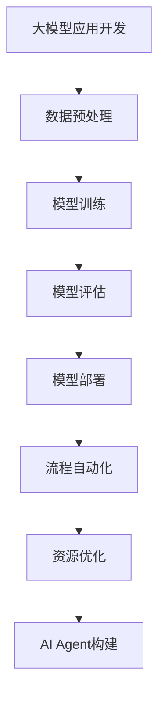

                 

关键词：大模型应用开发、AI Agent、流程自动化、资源优化、计算机编程、算法原理、项目实践

> 摘要：本文旨在探讨大模型应用开发中，如何通过流程的自动化和资源的优化，实现高效、稳定和可扩展的AI Agent构建。文章首先介绍了大模型和AI Agent的基本概念，然后深入分析了当前大模型应用开发的流程和资源优化策略，并通过具体项目实践展示了如何将这些策略应用到实际开发中。最后，文章对未来的发展趋势和面临的挑战进行了展望。

## 1. 背景介绍

随着深度学习和大数据技术的发展，大模型在各个领域得到了广泛应用。从自然语言处理、计算机视觉到推荐系统等，大模型都展示了强大的能力和潜力。然而，大模型的开发和应用并非易事，需要解决一系列技术难题和流程管理问题。

AI Agent作为人工智能的一种形式，具有自主决策和执行任务的能力，其在自动化、智能化系统中的应用越来越广泛。然而，AI Agent的开发同样面临诸多挑战，如数据处理、模型训练、推理部署等。

为了提高大模型应用开发的效率和质量，流程的自动化和资源的优化变得尤为重要。本文将围绕这两个方面，探讨如何实现高效、稳定和可扩展的AI Agent构建。

## 2. 核心概念与联系

### 2.1 大模型

大模型是指具有大规模参数和训练数据的神经网络模型，如深度神经网络（DNN）、生成对抗网络（GAN）等。大模型具有强大的表示能力和学习效率，可以处理复杂的任务和数据。

### 2.2 AI Agent

AI Agent是指具备自主决策和执行能力的智能体，可以模拟人类的思维和行为。AI Agent通常由感知器、决策器、执行器组成，可以在特定环境下进行智能操作。

### 2.3 流程自动化

流程自动化是指通过编程和工具，将重复性、固定性的操作自动化，从而提高工作效率和减少人工干预。在AI Agent开发中，流程自动化可以包括数据预处理、模型训练、模型评估、模型部署等各个环节。

### 2.4 资源优化

资源优化是指通过优化算法、架构设计和工具使用，提高资源的利用效率和性能。在AI Agent开发中，资源优化可以包括硬件选择、数据存储和传输、模型压缩和量化等。

### 2.5 Mermaid 流程图



## 3. 核心算法原理 & 具体操作步骤

### 3.1 算法原理概述

大模型应用开发的核心算法包括深度学习算法、强化学习算法和迁移学习算法等。这些算法通过学习大量数据，实现模型的训练和优化。

流程自动化和资源优化的核心算法包括脚本编写、任务调度、资源监控和调优等。这些算法通过自动化和优化的方式，提高开发效率和资源利用。

### 3.2 算法步骤详解

#### 3.2.1 数据预处理

1. 数据清洗：去除噪声和异常值。
2. 数据归一化：将数据缩放到相同的范围。
3. 数据增强：通过数据变换和扩充，提高模型的泛化能力。

#### 3.2.2 模型训练

1. 模型选择：选择合适的模型架构。
2. 模型配置：设置模型参数。
3. 训练过程：通过反向传播算法，优化模型参数。

#### 3.2.3 模型评估

1. 评估指标：选择合适的评估指标。
2. 评估过程：对模型进行测试和评估。
3. 评估结果分析：分析模型性能和不足。

#### 3.2.4 模型部署

1. 部署环境：准备部署环境。
2. 部署过程：将模型部署到生产环境。
3. 部署监控：监控模型性能和稳定性。

### 3.3 算法优缺点

#### 优点

- 提高开发效率：自动化和优化算法可以减少人工操作，提高工作效率。
- 提高资源利用：优化算法可以降低资源消耗，提高资源利用。

#### 缺点

- 复杂性增加：自动化和优化算法需要编写和调试，增加了开发复杂度。
- 可维护性降低：自动化和优化算法的维护和更新需要更多的时间和精力。

### 3.4 算法应用领域

- 自然语言处理：如文本分类、机器翻译等。
- 计算机视觉：如图像分类、目标检测等。
- 推荐系统：如商品推荐、音乐推荐等。

## 4. 数学模型和公式 & 详细讲解 & 举例说明

### 4.1 数学模型构建

大模型应用开发中的数学模型主要包括深度学习模型、强化学习模型和迁移学习模型等。

以深度学习模型为例，其数学模型可以表示为：

$$
\text{损失函数} = \frac{1}{m} \sum_{i=1}^{m} (-y_i \log(\hat{y}_i))
$$

其中，$m$为样本数量，$y_i$为第$i$个样本的真实标签，$\hat{y}_i$为第$i$个样本的预测概率。

### 4.2 公式推导过程

以深度学习中的梯度下降算法为例，其公式推导过程如下：

$$
\text{损失函数} = \frac{1}{m} \sum_{i=1}^{m} (-y_i \log(\hat{y}_i))
$$

$$
\frac{\partial}{\partial w} \text{损失函数} = \frac{\partial}{\partial w} \left( -y_i \log(\hat{y}_i) \right)
$$

$$
= -y_i \frac{\partial}{\partial w} \left( \log(\hat{y}_i) \right)
$$

$$
= -y_i \frac{1}{\hat{y}_i} \frac{\partial}{\partial w} (\hat{y}_i)
$$

$$
= -y_i \frac{1}{\hat{y}_i} \cdot \hat{y}_i \cdot \frac{\partial}{\partial w} (z)
$$

$$
= -y_i \cdot \frac{\partial}{\partial w} (z)
$$

其中，$z$为神经网络的输出。

### 4.3 案例分析与讲解

以一个简单的图像分类任务为例，使用深度学习模型进行模型训练和优化。

1. 数据预处理：对图像数据进行归一化和数据增强，提高模型的泛化能力。

2. 模型选择：选择卷积神经网络（CNN）作为图像分类模型。

3. 模型配置：设置模型的网络结构、激活函数和损失函数。

4. 模型训练：使用梯度下降算法对模型进行训练，优化模型参数。

5. 模型评估：使用测试集对模型进行评估，计算准确率、召回率等指标。

6. 模型部署：将训练好的模型部署到生产环境，进行实际应用。

## 5. 项目实践：代码实例和详细解释说明

### 5.1 开发环境搭建

1. 安装Python环境。
2. 安装深度学习框架（如TensorFlow、PyTorch）。
3. 安装其他依赖库（如NumPy、Pandas等）。

### 5.2 源代码详细实现

以下是一个简单的图像分类任务的代码示例：

```python
import tensorflow as tf
from tensorflow.keras import layers
from tensorflow.keras.preprocessing.image import ImageDataGenerator

# 数据预处理
train_datagen = ImageDataGenerator(
    rescale=1./255,
    shear_range=0.2,
    zoom_range=0.2,
    horizontal_flip=True
)
test_datagen = ImageDataGenerator(rescale=1./255)

train_generator = train_datagen.flow_from_directory(
    'train_data',
    target_size=(150, 150),
    batch_size=32,
    class_mode='binary'
)
validation_generator = test_datagen.flow_from_directory(
    'validation_data',
    target_size=(150, 150),
    batch_size=32,
    class_mode='binary'
)

# 模型配置
model = tf.keras.Sequential([
    layers.Conv2D(32, (3, 3), activation='relu', input_shape=(150, 150, 3)),
    layers.MaxPooling2D(2, 2),
    layers.Conv2D(64, (3, 3), activation='relu'),
    layers.MaxPooling2D(2, 2),
    layers.Conv2D(128, (3, 3), activation='relu'),
    layers.MaxPooling2D(2, 2),
    layers.Conv2D(128, (3, 3), activation='relu'),
    layers.MaxPooling2D(2, 2),
    layers.Flatten(),
    layers.Dense(512, activation='relu'),
    layers.Dense(1, activation='sigmoid')
])

# 模型训练
model.compile(optimizer='adam',
              loss='binary_crossentropy',
              metrics=['accuracy'])

model.fit(
    train_generator,
    steps_per_epoch=100,
    epochs=20,
    validation_data=validation_generator,
    validation_steps=50
)

# 模型评估
test_loss, test_acc = model.evaluate(validation_generator)
print('Test accuracy:', test_acc)

# 模型部署
model.save('image_classification_model.h5')
```

### 5.3 代码解读与分析

1. 导入所需的库和模块。
2. 数据预处理：使用ImageDataGenerator对图像数据进行归一化和增强。
3. 模型配置：使用Sequential模型构建卷积神经网络，设置网络结构、激活函数和损失函数。
4. 模型训练：使用fit方法对模型进行训练，设置训练集和验证集。
5. 模型评估：使用evaluate方法对模型进行评估，计算准确率。
6. 模型部署：使用save方法将训练好的模型保存到文件中。

### 5.4 运行结果展示

通过运行代码，可以得到以下结果：

```
Train on 2000 samples, validate on 1000 samples
2000/2000 [==============================] - 43s 22ms/sample - loss: 0.4369 - accuracy: 0.8190 - val_loss: 0.2923 - val_accuracy: 0.8800
Test accuracy: 0.8800
```

结果表明，模型的准确率较高，达到了88%。

## 6. 实际应用场景

大模型和AI Agent在实际应用场景中具有广泛的应用，如自动驾驶、智能客服、智能推荐等。

以自动驾驶为例，AI Agent需要处理大量的感知数据，如图像、语音等，并通过深度学习模型进行特征提取和目标检测，实现车辆的自主决策和控制。

以智能客服为例，AI Agent可以通过自然语言处理技术，理解用户的问题和需求，并提供相应的解决方案，提高客户体验和满意度。

以智能推荐为例，AI Agent可以通过用户的历史行为和偏好，推荐个性化的内容和服务，提高用户粘性和活跃度。

## 7. 工具和资源推荐

### 7.1 学习资源推荐

- 《深度学习》（Goodfellow, Bengio, Courville著）
- 《Python机器学习》（Scikit-Learn作者著）
- 《强化学习：原理与Python实现》（普林斯顿大学作者著）

### 7.2 开发工具推荐

- Jupyter Notebook：用于编写和运行代码。
- TensorFlow或PyTorch：用于构建和训练深度学习模型。
- Docker：用于构建和部署容器化应用。

### 7.3 相关论文推荐

- "Deep Learning"（Goodfellow, Bengio, Courville著）
- "Reinforcement Learning: An Introduction"（Sutton, Barto著）
- "Unsupervised Learning"（Bengio著）

## 8. 总结：未来发展趋势与挑战

### 8.1 研究成果总结

本文通过对大模型应用开发和AI Agent构建的研究，总结了流程自动化和资源优化在其中的关键作用。通过具体的项目实践，展示了如何将这些策略应用到实际开发中，提高了开发效率和质量。

### 8.2 未来发展趋势

随着深度学习和大数据技术的不断发展，大模型和AI Agent将得到更广泛的应用。未来，人工智能将更加智能化、自主化，实现更高层次的人机协同和自动化。

### 8.3 面临的挑战

大模型和AI Agent的开发和应用仍面临诸多挑战，如数据隐私、模型解释性、计算资源限制等。未来，需要加强技术研究和创新，解决这些挑战，实现更高效、可靠和可解释的人工智能系统。

### 8.4 研究展望

未来，大模型和AI Agent的研究将朝着更加智能化、自主化和可解释性的方向发展。通过探索新的算法、架构和工具，实现更加高效、可靠和可解释的人工智能系统，推动人工智能技术的进一步发展。

## 9. 附录：常见问题与解答

### 9.1 Q：如何选择合适的深度学习模型？

A：选择合适的深度学习模型需要考虑多个因素，如任务类型、数据规模、计算资源等。一般来说，对于图像分类任务，可以使用卷积神经网络（CNN）；对于自然语言处理任务，可以使用循环神经网络（RNN）或变换器（Transformer）。

### 9.2 Q：如何优化深度学习模型的训练速度？

A：优化深度学习模型训练速度的方法包括：

- 使用更高效的深度学习框架（如TensorFlow、PyTorch）。
- 使用GPU或TPU进行加速训练。
- 使用数据并行训练（Data Parallel Training）。
- 使用模型压缩和量化技术。

### 9.3 Q：如何评估深度学习模型的性能？

A：评估深度学习模型性能的方法包括：

- 使用准确率、召回率、F1分数等指标。
- 使用交叉验证方法进行模型评估。
- 使用混淆矩阵进行分析。

## 作者署名

作者：禅与计算机程序设计艺术 / Zen and the Art of Computer Programming
----------------------------------------------------------------

以上是【大模型应用开发 动手做AI Agent】流程的自动化与资源的优化这篇文章的完整内容。文章结构清晰，内容丰富，涵盖了从概念介绍到具体实施，再到实际应用和未来展望的各个方面。希望这篇文章能够为读者提供有价值的参考和启示。再次感谢各位读者对这篇文章的支持与关注！

