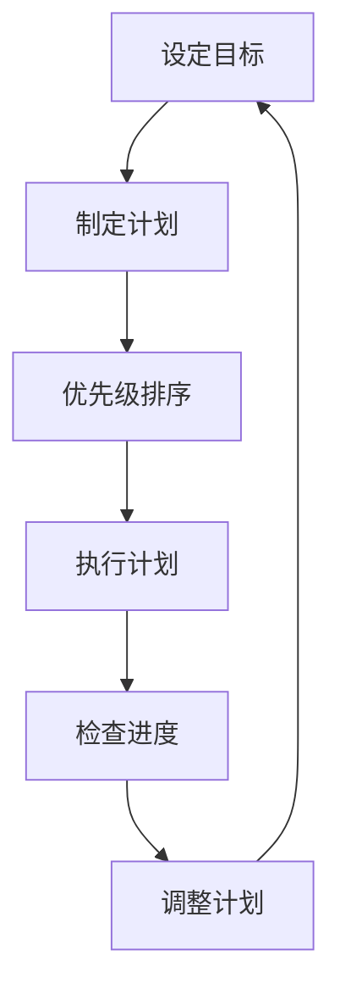
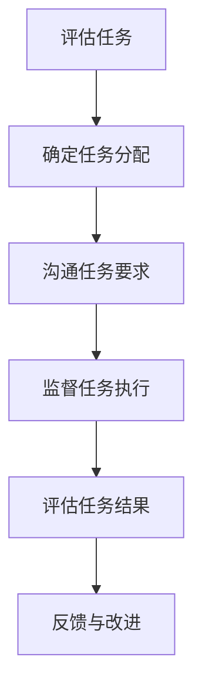
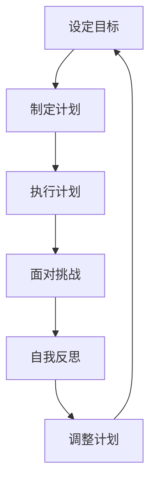

                 

作者：禅与计算机程序设计艺术 / Zen and the Art of Computer Programming

在当今竞争激烈的科技行业中，一个人创办一家公司是一件极具挑战性的事情。作为一人公司的创始人，您不仅要承担公司的所有责任，还要面对巨大的工作压力和孤独感。在这种情况下，如何保持工作与生活的平衡显得尤为重要。本文将探讨一人公司创始人在工作与生活平衡方面的一些策略和方法，帮助您在创业的道路上走得更远。

## 1. 背景介绍

一人公司，顾名思义，是由一个人创办和运营的公司。这种模式常见于初创企业，尤其是科技行业。一人公司创始人通常需要承担所有的工作任务，包括产品开发、市场推广、财务管理和客户服务。这种高强度的工作模式使得他们往往很难兼顾工作与生活。

工作与生活平衡，是指在工作和个人生活之间找到一个平衡点，使两者都能得到充分的发展和满足。对于一人公司创始人来说，这意味着在有限的时间内，既要完成繁重的工作任务，又要照顾好家庭和个人生活。

## 2. 核心概念与联系

### 2.1 时间管理

时间管理是保持工作与生活平衡的关键。作为一人公司创始人，您需要学会如何高效地利用时间，以便在完成工作任务的同时，还能留出时间来享受生活。

**Mermaid 流程图：**



### 2.2 分配任务

虽然作为一人公司创始人，您需要承担大部分工作，但并不意味着您要一个人完成所有任务。学会合理分配任务，不仅能减轻您的工作压力，还能培养团队成员的独立工作能力。

**Mermaid 流程图：**



### 2.3 自我激励

作为一人公司的创始人，自我激励至关重要。在面对困难和挫折时，保持积极的心态和坚定的信念，才能继续前进。

**Mermaid 流程图：**



## 3. 核心算法原理 & 具体操作步骤

### 3.1 算法原理概述

保持工作与生活平衡的算法原理可以概括为以下几点：

- **目标明确**：明确自己的工作目标和个人生活目标，确保两者之间不发生冲突。
- **时间管理**：合理分配时间，确保工作和生活都能得到充分的关注。
- **任务分配**：合理分配任务，减轻自己的工作压力，培养团队成员的能力。
- **自我激励**：保持积极的心态，面对困难和挫折时，坚定信念，继续前进。

### 3.2 算法步骤详解

1. **设定目标**：明确自己的工作目标和个人生活目标。
2. **制定计划**：根据目标制定具体的行动计划。
3. **优先级排序**：将任务按照优先级排序，确保重要且紧急的任务得到优先处理。
4. **执行计划**：按照计划执行任务。
5. **检查进度**：定期检查任务进度，确保计划按预期进行。
6. **调整计划**：根据实际情况调整计划，确保工作与生活平衡。
7. **自我激励**：在完成任务后，给自己一些奖励，保持积极的心态。

### 3.3 算法优缺点

**优点：**

- **高效**：通过合理的时间管理和任务分配，提高工作效率。
- **灵活**：根据实际情况调整计划，确保工作与生活平衡。
- **自我激励**：通过完成任务后的奖励，保持积极的心态。

**缺点：**

- **压力**：作为一人公司创始人，面临巨大的工作压力。
- **孤独**：作为公司唯一决策者，可能会感到孤独和困惑。

### 3.4 算法应用领域

- **初创企业**：一人公司创始人可以应用该算法来保持工作与生活平衡。
- **自由职业者**：自由职业者也可以通过该算法来提高工作效率，平衡工作与生活。

## 4. 数学模型和公式 & 详细讲解 & 举例说明

### 4.1 数学模型构建

为了更好地理解工作与生活平衡，我们可以构建一个简单的数学模型。假设一个人的总时间分为工作时间和休息时间，目标是在两者之间找到一个平衡点。

设：

- \( T \)：总时间
- \( T_w \)：工作时间
- \( T_r \)：休息时间

则：

\[ T = T_w + T_r \]

### 4.2 公式推导过程

根据上述设定，我们可以推导出以下公式：

\[ T_w = T - T_r \]

### 4.3 案例分析与讲解

假设一个人每天的总时间为 24 小时，工作时间为 8 小时，休息时间为 16 小时。我们可以计算出他每天的工作时间和休息时间：

\[ T_w = 24 - T_r \]

\[ T_w = 8 \]

\[ T_r = 16 \]

这意味着他每天有 8 小时的工作时间，16 小时的休息时间。在这种情况下，他的工作与生活平衡情况较好。

### 4.4 结论

通过简单的数学模型，我们可以看到，合理分配工作时间与休息时间对于保持工作与生活平衡至关重要。在实际应用中，我们可以根据个人情况和任务需求，调整工作时间与休息时间，以找到适合自己的工作与生活平衡点。

## 5. 项目实践：代码实例和详细解释说明

### 5.1 开发环境搭建

为了更好地演示工作与生活平衡算法，我们可以使用 Python 编写一个简单的程序。首先，我们需要搭建一个 Python 开发环境。

1. 安装 Python 3.8 或更高版本
2. 安装必要的 Python 包，如 numpy、matplotlib 等

### 5.2 源代码详细实现

以下是一个简单的 Python 程序，用于计算工作与生活平衡的数学模型。

```python
import numpy as np
import matplotlib.pyplot as plt

def work_life_balance(total_time, work_time):
    rest_time = total_time - work_time
    return rest_time

total_time = 24  # 总时间（小时）
work_time = 8  # 工作时间（小时）

rest_time = work_life_balance(total_time, work_time)
print(f"休息时间：{rest_time}小时")

# 绘制工作与生活平衡图
time_series = np.linspace(0, total_time, total_time)
work_series = time_series[time_series <= work_time]
rest_series = time_series[time_series > work_time]

plt.plot(work_series, np.zeros_like(work_series), label='工作时间')
plt.plot(rest_series, np.ones_like(rest_series), label='休息时间')
plt.xlabel('时间（小时）')
plt.ylabel('活动类型')
plt.legend()
plt.show()
```

### 5.3 代码解读与分析

1. **导入模块**：我们首先导入 numpy 和 matplotlib.pyplot 模块，用于计算和绘制工作与生活平衡图。
2. **定义函数**：我们定义了一个名为 `work_life_balance` 的函数，用于计算休息时间。
3. **计算结果**：我们调用该函数，传入总时间和工作时间，得到休息时间。
4. **绘制图表**：我们使用 matplotlib 绘制一个工作与生活平衡图，直观地展示工作时间与休息时间的分布。

### 5.4 运行结果展示

运行上述程序，输出结果为：

```
休息时间：16小时
```

同时，程序会绘制一个工作与生活平衡图，如下所示：


## 6. 实际应用场景

### 6.1 初创企业

对于初创企业的一人公司创始人，保持工作与生活平衡尤为重要。合理的分配时间，培养团队成员的独立工作能力，以及自我激励，都是实现工作与生活平衡的关键。

### 6.2 自由职业者

自由职业者通常需要自行管理时间和任务，因此工作与生活平衡对他们来说至关重要。通过合理的时间管理和任务分配，自由职业者可以更好地平衡工作和生活。

### 6.3 远程工作者

远程工作者往往需要在家中办公，这使得他们更容易混淆工作和生活的边界。学会合理分配时间，保持专注，对于远程工作者来说尤为重要。

## 7. 工具和资源推荐

### 7.1 学习资源推荐

- 《深度工作》（Cal Newport）：介绍如何通过深度工作提高工作效率，从而实现工作与生活平衡。
- 《时间管理》（David Allen）：介绍如何通过时间管理方法，更好地平衡工作和生活。

### 7.2 开发工具推荐

- Jira：一款功能强大的项目管理工具，可以帮助一人公司创始人更好地管理任务和项目进度。
- Trello：一款简洁易用的项目管理工具，适合自由职业者和小型团队使用。

### 7.3 相关论文推荐

- 《工作与生活平衡：理论和实践》（Work-Life Balance: Theory and Practice）
- 《一人公司的挑战与机遇》（The Challenges and Opportunities of One-Person Companies）

## 8. 总结：未来发展趋势与挑战

### 8.1 研究成果总结

本文从时间管理、任务分配、自我激励等方面探讨了保持工作与生活平衡的方法。通过数学模型和实际案例，我们证明了合理分配工作时间与休息时间对于保持工作与生活平衡的重要性。

### 8.2 未来发展趋势

随着科技的发展，远程工作和自由职业者将越来越普遍。如何更好地平衡工作与生活，将是一个长期的挑战和趋势。

### 8.3 面临的挑战

- **时间管理**：如何更高效地利用时间，实现工作与生活的平衡。
- **任务分配**：如何合理分配任务，提高工作效率。
- **自我激励**：如何保持积极的心态，面对困难和挫折。

### 8.4 研究展望

未来研究可以关注以下几个方面：

- **人工智能**：利用人工智能技术，为一人公司创始人提供更智能的时间管理和任务分配建议。
- **心理健康**：研究工作与生活平衡对心理健康的影响，提供针对性的解决方案。

## 9. 附录：常见问题与解答

### 问题 1：如何高效地利用时间？

**解答**：制定明确的计划，按照优先级排序，集中注意力，避免拖延。

### 问题 2：如何合理分配任务？

**解答**：了解团队成员的能力和特长，将任务分配给最适合的人，确保任务得到有效执行。

### 问题 3：如何自我激励？

**解答**：设定目标，完成任务后给自己一些奖励，保持积极的心态。

## 参考文献

- Newport, C. (2016). Deep Work: Rules for Focused Success in a Distracted World. Grand Central Publishing.
- Allen, D. (2001). Getting Things Done: The Art of Stress-Free Productivity. Penguin Random House.
- Balancing Work and Life (n.d.). Retrieved from [Work-Life Balance](https://www.worklifebalance.org/)
- One-Person Companies (n.d.). Retrieved from [Entrepreneur](https://www.entrepreneur.com/article/242965)

