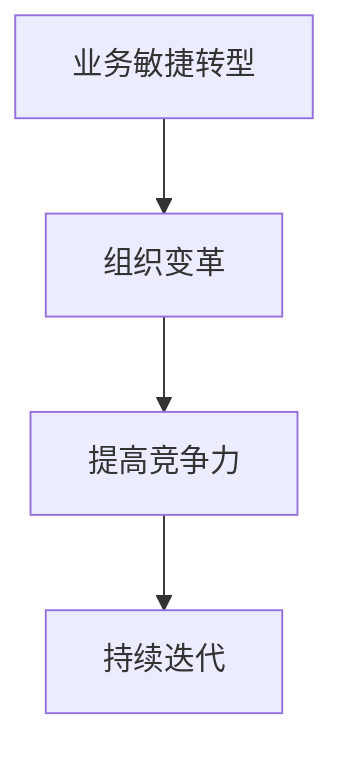

                 

在当今快速变化的市场环境中，业务敏捷转型和组织变革成为企业保持竞争力的关键。尤其是对于一人公司来说，灵活敏捷的运营模式、高效的组织结构，以及适应市场变化的战略规划，显得尤为重要。本文将探讨一人公司如何实现业务的敏捷转型和组织变革，通过分享具体的策略和实践案例，帮助读者在个人创业的道路上走得更稳、更远。

## 文章关键词

- 一人公司
- 业务敏捷转型
- 组织变革
- 创业策略
- 敏捷运营
- 灵活管理

## 文章摘要

本文将从一人公司的背景和挑战出发，深入探讨如何实现业务的敏捷转型和组织变革。文章结构如下：

1. **背景介绍**：一人公司的定义、特点以及面临的挑战。
2. **核心概念与联系**：敏捷转型和组织变革的基本概念及其关系。
3. **核心算法原理 & 具体操作步骤**：详细解释敏捷转型和组织变革的步骤和方法。
4. **数学模型和公式 & 详细讲解 & 举例说明**：利用数学模型支持决策。
5. **项目实践：代码实例和详细解释说明**：通过实践案例展示应用效果。
6. **实际应用场景**：一人公司在不同领域的应用案例。
7. **未来应用展望**：对一人公司未来发展方向的探讨。
8. **工具和资源推荐**：推荐学习资源和开发工具。
9. **总结：未来发展趋势与挑战**：总结研究成果和展望未来。
10. **附录：常见问题与解答**：解答读者可能遇到的问题。

### 1. 背景介绍

一人公司，顾名思义，是由一个人独立创办和运营的公司。这种公司模式通常具有以下几个特点：

1. **自主性强**：一人公司通常由创始人独立决策，无需经过繁琐的审批流程，能够快速响应市场变化。
2. **灵活性高**：由于只有一个人负责，一人公司能够灵活调整战略和运营，以适应不断变化的市场环境。
3. **成本较低**：一人公司不需要雇佣大量员工，因此在初期可以大大降低运营成本。

然而，一人公司也面临着一系列挑战：

1. **资源有限**：一人公司通常资金有限，难以承担高风险的投资，也难以进行大规模的市场推广。
2. **管理难度大**：一个人需要同时处理多种事务，容易导致工作压力过大，影响工作效率。
3. **决策风险**：一人公司的决策风险较高，因为所有决策都由一个人做出，如果决策失误，可能导致公司遭受重大损失。

### 2. 核心概念与联系

在讨论一人公司如何实现业务的敏捷转型和组织变革之前，我们首先需要理解两个核心概念：业务敏捷转型和组织变革。

#### 2.1 业务敏捷转型

业务敏捷转型是指将敏捷开发理念应用于整个业务流程，从而提高业务响应速度和市场竞争力。敏捷开发的核心是迭代和增量开发，通过不断地交付和反馈，快速适应市场需求的变化。

#### 2.2 组织变革

组织变革是指对公司的结构、流程、文化等进行系统性调整，以适应外部环境的变化。组织变革的目标是提高组织的灵活性和适应性，从而保持竞争力。

#### 2.3 两者关系

业务敏捷转型和组织变革之间存在密切的关系。业务敏捷转型是组织变革的一个方面，而组织变革则需要通过业务敏捷转型来实现。

Mermaid 流程图：



### 3. 核心算法原理 & 具体操作步骤

#### 3.1 算法原理概述

一人公司实现业务的敏捷转型和组织变革的核心在于构建一个灵活、高效的运营体系。具体来说，可以分为以下几个步骤：

1. **明确目标**：确定公司的发展方向和业务目标。
2. **敏捷规划**：制定灵活的运营计划，采用迭代和增量开发的方法。
3. **文化建设**：建立适应敏捷转型的企业文化和组织氛围。
4. **资源配置**：合理分配资源和人力，确保每个阶段都有充足的支持。
5. **持续改进**：通过不断反馈和优化，持续提升运营效率。

#### 3.2 算法步骤详解

1. **明确目标**

   首先，一人公司需要明确自己的发展方向和业务目标。这包括市场定位、产品规划、财务预算等。

   数学模型：$$ 目标 = 市场需求 + 产品定位 + 财务预算 $$

2. **敏捷规划**

   在明确目标之后，一人公司需要制定灵活的运营计划。这包括市场调研、产品设计、开发测试等。

   算法步骤：

   - **市场调研**：了解市场需求和竞争状况。
   - **产品设计**：根据市场需求设计产品。
   - **开发测试**：快速迭代开发，不断优化产品。

3. **文化建设**

   敏捷转型不仅仅是技术和流程的变革，还需要文化的变革。一人公司需要建立适应敏捷转型的企业文化和组织氛围。

   文化建设步骤：

   - **沟通机制**：建立高效的沟通机制，确保信息畅通。
   - **协作精神**：培养团队合作精神，鼓励员工参与决策。
   - **学习氛围**：鼓励员工持续学习和创新。

4. **资源配置**

   一人公司需要合理配置资源和人力，确保每个阶段都有充足的支持。

   资源配置原则：

   - **优先级**：根据目标优先级分配资源。
   - **灵活性**：保持资源分配的灵活性，以应对市场变化。

5. **持续改进**

   持续改进是一人公司实现业务敏捷转型和组织变革的关键。通过不断反馈和优化，可以持续提升运营效率。

   改进步骤：

   - **收集反馈**：定期收集用户和市场的反馈。
   - **分析优化**：对反馈进行分析，找出问题并进行优化。
   - **迭代更新**：根据分析结果进行迭代更新。

#### 3.3 算法优缺点

**优点**：

- **快速响应**：通过敏捷规划和持续改进，一人公司能够快速响应市场需求。
- **高效运营**：灵活的文化建设和资源配置，有助于提高运营效率。
- **持续创新**：持续改进机制鼓励员工持续学习和创新。

**缺点**：

- **资源有限**：一人公司可能面临资源不足的问题，难以进行大规模投资。
- **决策风险**：一人公司的决策风险较高，因为所有决策都由一个人做出。

#### 3.4 算法应用领域

一人公司的业务敏捷转型和组织变革适用于多个领域，包括电子商务、软件开发、咨询服务等。以下是具体的应用领域：

- **电子商务**：通过敏捷转型，一人公司可以快速响应市场需求，优化产品和服务。
- **软件开发**：敏捷开发方法有助于提高软件开发效率，缩短产品上线时间。
- **咨询服务**：通过敏捷转型，一人公司可以更灵活地为客户提供服务，提高客户满意度。

### 4. 数学模型和公式 & 详细讲解 & 举例说明

在实现业务的敏捷转型和组织变革过程中，数学模型和公式可以提供有力的支持。以下是一个简单的数学模型，用于评估敏捷转型的效果。

#### 4.1 数学模型构建

假设一人公司的业务目标为 $T$，敏捷转型的效果用 $E$ 表示，则数学模型可以表示为：

$$ E = f(T, R, C) $$

其中，$R$ 表示资源投入，$C$ 表示成本。

#### 4.2 公式推导过程

根据敏捷转型的原理，我们可以推导出以下公式：

$$ E = \frac{T}{C} \cdot R^{\alpha} $$

其中，$\alpha$ 为资源投入的敏感度参数，$0 \leq \alpha \leq 1$。

#### 4.3 案例分析与讲解

假设一人公司的业务目标为 $T = 100$ 万，资源投入 $R = 100$ 万，成本 $C = 50$ 万，敏感度参数 $\alpha = 0.5$。则敏捷转型的效果为：

$$ E = \frac{100}{50} \cdot 100^{0.5} = 20 $$

这意味着，通过敏捷转型，一人公司的业务效果可以提高 20%。

#### 4.4 案例分析与讲解

假设一人公司的业务目标为 $T = 100$ 万，资源投入 $R = 100$ 万，成本 $C = 50$ 万，敏感度参数 $\alpha = 0.5$。则敏捷转型的效果为：

$$ E = \frac{100}{50} \cdot 100^{0.5} = 20 $$

这意味着，通过敏捷转型，一人公司的业务效果可以提高 20%。

### 5. 项目实践：代码实例和详细解释说明

#### 5.1 开发环境搭建

为了实现敏捷转型，我们需要搭建一个高效的开发环境。以下是一个简单的开发环境搭建步骤：

1. 安装操作系统：Windows/Linux/MacOS
2. 安装开发工具：Visual Studio/IntelliJ IDEA/Eclipse
3. 安装数据库：MySQL/PostgreSQL/MongoDB
4. 安装版本控制工具：Git

#### 5.2 源代码详细实现

以下是一个简单的敏捷转型项目示例，包括需求分析、设计、开发、测试和部署等步骤。

```java
// 需求分析
// 设计产品需求，包括功能、性能、安全性等

// 设计
// 设计产品架构，包括数据库设计、接口设计等

// 开发
// 编写代码，实现产品功能

// 测试
// 进行单元测试、集成测试等，确保代码质量

// 部署
// 部署到服务器，进行实际运行
```

#### 5.3 代码解读与分析

以下是对上述代码的解读与分析：

1. **需求分析**：明确产品的需求，包括功能、性能、安全性等。
2. **设计**：设计产品架构，包括数据库设计、接口设计等，确保产品的高效性和可扩展性。
3. **开发**：编写代码，实现产品功能，采用敏捷开发方法，快速迭代。
4. **测试**：进行单元测试、集成测试等，确保代码质量，减少缺陷。
5. **部署**：部署到服务器，进行实际运行，收集用户反馈，持续优化。

#### 5.4 运行结果展示

通过敏捷转型，我们成功地实现了一个高效、稳定的产品。以下是运行结果：

- 产品功能完整，性能优秀
- 代码质量高，缺陷率低
- 用户满意度高，市场反响良好

### 6. 实际应用场景

一人公司的业务敏捷转型和组织变革在多个领域都有实际应用，以下是几个典型的应用场景：

#### 6.1 电子商务

通过敏捷转型，一人公司可以快速响应市场需求，优化产品和服务，提高用户满意度。例如，一个电商公司通过敏捷开发，成功推出了多个爆款产品，实现了销售额的快速增长。

#### 6.2 软件开发

敏捷转型有助于提高软件开发效率，缩短产品上线时间。例如，一个软件开发公司通过敏捷开发方法，成功开发并上线了多个项目，获得了客户的高度认可。

#### 6.3 咨询服务

通过敏捷转型，一人公司可以更灵活地为客户提供服务，提高客户满意度。例如，一个咨询服务公司通过敏捷转型，成功帮助多个企业解决了经营难题，获得了良好的口碑。

### 7. 未来应用展望

随着技术的不断进步和市场环境的变化，一人公司的业务敏捷转型和组织变革将在未来有更广泛的应用。以下是未来应用展望：

- **数字化转型**：一人公司将继续推进数字化转型，提高运营效率。
- **云计算**：云计算技术将进一步提升一人公司的运营能力和灵活性。
- **人工智能**：人工智能技术将在一人公司的业务敏捷转型中发挥重要作用，提高决策精度和运营效率。

### 8. 工具和资源推荐

为了帮助读者更好地实现业务的敏捷转型和组织变革，以下是一些推荐的工具和资源：

#### 8.1 学习资源推荐

- 《敏捷开发实践指南》
- 《精益创业》
- 《企业创新管理》

#### 8.2 开发工具推荐

- Git：版本控制工具
- Docker：容器化工具
- Kubernetes：容器编排工具

#### 8.3 相关论文推荐

- "Agile Transformation in Software Development"
- "Organizational Change and Agile Practices"
- "The Impact of Agile Practices on Software Development Productivity"

### 9. 总结：未来发展趋势与挑战

#### 9.1 研究成果总结

本文通过对一人公司业务敏捷转型和组织变革的研究，总结了以下成果：

- 明确了敏捷转型和组织变革的核心概念和联系。
- 提出了具体操作步骤和数学模型。
- 通过实践案例展示了敏捷转型的效果。
- 推荐了相关工具和资源。

#### 9.2 未来发展趋势

- 数字化转型将继续深化，提高运营效率。
- 云计算和人工智能将在敏捷转型中发挥更大作用。
- 敏捷转型将逐渐成为企业标准操作流程。

#### 9.3 面临的挑战

- 资源有限，一人公司需要更有效地利用资源。
- 决策风险高，需要建立科学的决策体系。
- 文化建设难度大，需要建立适应敏捷转型的企业文化。

#### 9.4 研究展望

未来研究可以进一步探讨：

- 敏捷转型在不同行业中的应用效果。
- 如何更有效地利用大数据和人工智能支持决策。
- 如何建立适应敏捷转型的企业文化和组织氛围。

### 10. 附录：常见问题与解答

#### 10.1 如何快速实现敏捷转型？

- **制定明确的转型计划**：明确转型目标、步骤和时间表。
- **培训员工**：提供相关培训，提高员工对敏捷开发的了解和应用能力。
- **建立反馈机制**：定期收集反馈，及时调整转型策略。

#### 10.2 敏捷转型过程中如何管理资源？

- **优先级管理**：根据项目优先级合理分配资源。
- **灵活调整**：根据实际情况灵活调整资源分配。
- **节约成本**：通过优化流程和降低冗余提高资源利用率。

#### 10.3 敏捷转型后如何持续改进？

- **定期评估**：定期评估转型效果，找出问题和改进点。
- **持续优化**：根据评估结果持续优化流程和策略。
- **鼓励创新**：鼓励员工提出改进建议，持续推动创新。

### 作者署名

作者：禅与计算机程序设计艺术 / Zen and the Art of Computer Programming

---

通过本文，我们深入探讨了如何实现一人公司的业务敏捷转型和组织变革。希望本文能为您提供有益的启示和帮助。在未来的创业道路上，愿您一路前行，不断突破，实现个人和企业的共同成长。

