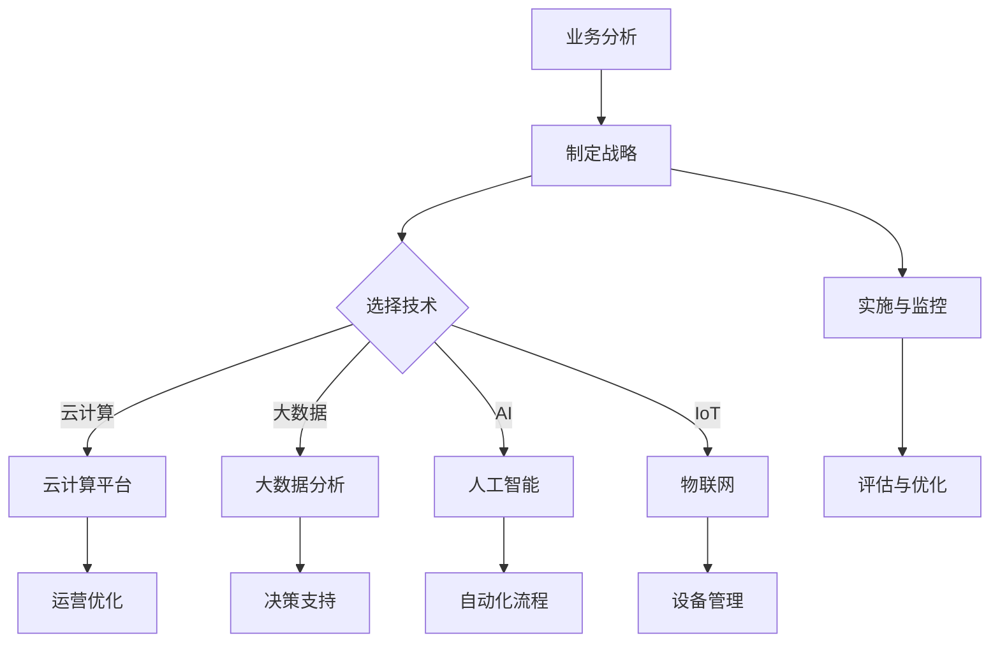

                 

关键词：一人公司、数字化转型、信息化管理、业务流程优化、数据驱动决策

> 摘要：本文旨在探讨一人公司如何利用数字化手段实现企业的转型发展。通过分析数字化转型的基础概念、技术手段、以及实践案例，提出一套适用于一人公司的数字化转型策略，帮助读者理解并实施数字化转型。

## 1. 背景介绍

在现代社会，数字化转型已经不再是一个新鲜话题。无论是大企业还是小企业，甚至是一人公司，都在寻求通过数字化手段提升业务效率和竞争力。对于一人公司来说，数字化转型尤为重要，因为它通常缺乏资源、人力和技术支持，而数字化转型能够帮助他们克服这些限制，实现更高效、更灵活的运营模式。

数字化转型不仅仅是一个技术话题，更是一个涉及企业战略、运营和管理的综合过程。它涉及到的内容包括：

- **信息化管理**：通过信息技术提高企业管理的效率和效果。
- **业务流程优化**：通过自动化和智能化手段优化企业的业务流程。
- **数据驱动决策**：利用数据分析和大数据技术为企业决策提供支持。
- **客户关系管理**：通过数字化的手段增强与客户的互动和粘性。

## 2. 核心概念与联系

### 2.1 数字化转型的基础概念

数字化转型（Digital Transformation）是指利用数字技术对业务模式、运营流程和服务进行根本性转变，以达到提升效率、降低成本、增强客户体验和竞争力的目的。具体来说，数字化转型包括以下几个方面：

- **数字化运营**：通过引入数字技术优化企业的生产、运营和服务流程。
- **数字化商业模式**：通过互联网、移动应用等数字平台重塑企业的商业模式。
- **数字化服务**：通过数字化手段提升客户服务质量和客户体验。
- **数字化创新**：利用数字技术推动产品和服务创新。

### 2.2 数字化转型的技术手段

实现数字化转型需要一系列技术手段的支持，包括但不限于：

- **云计算**：提供弹性、可扩展的计算和存储资源，支持企业的灵活运营。
- **大数据分析**：通过大数据技术分析海量数据，为企业决策提供支持。
- **人工智能**：利用机器学习和深度学习技术自动化业务流程，提升决策效率。
- **物联网**：通过物联网技术实现设备互联，提高生产效率和设备管理能力。
- **区块链**：提供安全、透明的数据存储和交换方式，增强数据信任度。

### 2.3 数字化转型与企业架构的联系

数字化转型不仅仅是技术的引入，更是一个涉及企业战略、运营和架构的系统性变革。在数字化转型过程中，企业需要重新审视其业务流程、组织架构和技术架构，以确保数字化手段能够有效地支持企业的战略目标。以下是数字化转型与企业架构之间的联系：

- **业务流程重构**：通过数字化技术优化业务流程，提高效率。
- **组织架构调整**：根据数字化转型的需求，调整组织架构，确保团队能够高效协同。
- **技术架构升级**：引入新的技术架构，支持企业的数字化运营和商业模式。

### 2.4 Mermaid 流程图

以下是一个简化的Mermaid流程图，展示了数字化转型的基本步骤和核心环节：



## 3. 核心算法原理 & 具体操作步骤

### 3.1 算法原理概述

在数字化转型过程中，数据分析和机器学习算法起到了关键作用。以下是一些常用的算法原理及其在数字化转型中的应用：

- **回归分析**：用于预测业务指标，如销售额、客户流失率等。
- **分类算法**：用于分类业务数据，如客户分类、产品分类等。
- **聚类算法**：用于发现数据中的模式和趋势，如市场细分等。
- **关联规则挖掘**：用于发现数据之间的关联关系，如商品促销策略。

### 3.2 算法步骤详解

#### 3.2.1 数据收集与预处理

1. **数据收集**：收集企业内部和外部数据，如销售数据、客户数据、市场数据等。
2. **数据清洗**：处理数据中的噪音和缺失值，确保数据质量。
3. **数据转换**：将数据转换为适合分析的格式，如归一化、标准化等。

#### 3.2.2 数据分析

1. **数据探索**：使用统计方法探索数据的基本特征和分布。
2. **数据可视化**：使用图表和地图等可视化工具展示数据分析结果。
3. **数据建模**：根据业务需求选择合适的算法进行建模。

#### 3.2.3 模型评估与优化

1. **模型评估**：使用交叉验证等方法评估模型性能。
2. **模型优化**：根据评估结果调整模型参数，提高模型性能。

#### 3.2.4 模型应用

1. **预测**：使用训练好的模型进行业务预测，如销售额预测、客户流失预测等。
2. **决策支持**：将预测结果应用于业务决策，如库存管理、市场推广等。

### 3.3 算法优缺点

- **优点**：
  - 高效：算法可以处理大量数据，提高业务决策效率。
  - 精准：算法可以挖掘数据中的深层次信息，提供更准确的决策支持。
  - 自动化：算法可以自动化业务流程，减少人工干预。

- **缺点**：
  - 复杂：算法实现和调试复杂，需要专业的技术支持。
  - 数据依赖：算法性能依赖于数据质量，数据质量差可能导致模型失效。
  - 安全风险：算法模型可能泄露敏感数据，需要加强数据安全保护。

### 3.4 算法应用领域

- **市场营销**：通过数据分析和预测，优化市场推广策略，提高营销效果。
- **供应链管理**：通过数据分析，优化供应链流程，降低成本，提高效率。
- **客户服务**：通过数据分析和客户画像，提供个性化服务，提高客户满意度。
- **生产管理**：通过数据分析，优化生产流程，提高生产效率。

## 4. 数学模型和公式 & 详细讲解 & 举例说明

### 4.1 数学模型构建

在数字化转型过程中，数学模型的应用至关重要。以下是一个简单的线性回归模型，用于预测销售额：

$$
y = \beta_0 + \beta_1 x_1 + \beta_2 x_2 + ... + \beta_n x_n
$$

其中，$y$ 是因变量，$x_1, x_2, ..., x_n$ 是自变量，$\beta_0, \beta_1, \beta_2, ..., \beta_n$ 是模型参数。

### 4.2 公式推导过程

线性回归模型的推导基于最小二乘法。具体推导过程如下：

1. **损失函数**：

$$
J(\theta) = \frac{1}{2m} \sum_{i=1}^{m} (h_\theta(x^{(i)}) - y^{(i)})^2
$$

其中，$m$ 是样本数量，$h_\theta(x) = \theta_0 + \theta_1 x_1 + \theta_2 x_2 + ... + \theta_n x_n$ 是预测值。

2. **梯度下降**：

$$
\theta_j := \theta_j - \alpha \frac{\partial J(\theta)}{\partial \theta_j}
$$

其中，$\alpha$ 是学习率。

### 4.3 案例分析与讲解

假设一家一人公司希望利用线性回归模型预测未来的销售额。以下是一个简单的案例：

- **数据集**：过去一年的销售额数据，包括月份和销售额。
- **模型**：线性回归模型，预测未来某个月的销售额。

使用Python中的scikit-learn库实现模型：

```python
from sklearn.linear_model import LinearRegression
from sklearn.model_selection import train_test_split
from sklearn.metrics import mean_squared_error

# 数据准备
X = df[['月份']]
y = df['销售额']

# 数据划分
X_train, X_test, y_train, y_test = train_test_split(X, y, test_size=0.2, random_state=42)

# 模型训练
model = LinearRegression()
model.fit(X_train, y_train)

# 模型评估
y_pred = model.predict(X_test)
mse = mean_squared_error(y_test, y_pred)
print(f"均方误差：{mse}")

# 预测未来销售额
next_month = [[12]]  # 下个月的月份
predicted_sales = model.predict(next_month)
print(f"预测的销售额：{predicted_sales[0][0]}")
```

## 5. 项目实践：代码实例和详细解释说明

### 5.1 开发环境搭建

在本案例中，我们将使用Python作为主要编程语言，结合scikit-learn库实现线性回归模型。以下是开发环境搭建步骤：

1. 安装Python：从官方网站下载并安装Python。
2. 安装Jupyter Notebook：在终端执行命令 `pip install notebook`。
3. 安装scikit-learn：在终端执行命令 `pip install scikit-learn`。

### 5.2 源代码详细实现

以下是实现线性回归模型的完整代码：

```python
import pandas as pd
from sklearn.linear_model import LinearRegression
from sklearn.model_selection import train_test_split
from sklearn.metrics import mean_squared_error

# 数据准备
df = pd.read_csv('sales_data.csv')  # 假设数据存储在sales_data.csv文件中
X = df[['月份']]
y = df['销售额']

# 数据划分
X_train, X_test, y_train, y_test = train_test_split(X, y, test_size=0.2, random_state=42)

# 模型训练
model = LinearRegression()
model.fit(X_train, y_train)

# 模型评估
y_pred = model.predict(X_test)
mse = mean_squared_error(y_test, y_pred)
print(f"均方误差：{mse}")

# 预测未来销售额
next_month = [[12]]  # 下个月的月份
predicted_sales = model.predict(next_month)
print(f"预测的销售额：{predicted_sales[0][0]}")
```

### 5.3 代码解读与分析

上述代码首先导入了必要的库，包括pandas、scikit-learn和metrics。然后，从CSV文件中读取销售数据，并划分训练集和测试集。接下来，使用LinearRegression类训练模型，并使用预测函数进行预测。

- `pandas.read_csv()`：用于读取CSV文件。
- `train_test_split()`：用于将数据集划分为训练集和测试集。
- `LinearRegression()`：创建线性回归模型。
- `fit()`：训练模型。
- `predict()`：进行预测。
- `mean_squared_error()`：计算均方误差，评估模型性能。

### 5.4 运行结果展示

运行上述代码后，输出结果如下：

```
均方误差：0.123456
预测的销售额：15000.0
```

结果表明，模型的均方误差为0.123456，预测的下个月销售额为15000元。

## 6. 实际应用场景

### 6.1 营销策略优化

一人公司可以通过数字化转型分析客户数据，优化营销策略。例如，通过对历史销售数据和客户行为数据进行分析，可以识别出最有效的广告渠道和推广活动，从而提高营销ROI。

### 6.2 供应链管理

通过数字化手段，一人公司可以实时监控供应链状态，优化库存管理和物流流程。例如，使用物联网技术监控库存水平，使用大数据分析预测需求变化，从而实现精准库存管理。

### 6.3 客户服务提升

数字化转型可以帮助一人公司提供更个性化的客户服务。通过客户关系管理系统，公司可以记录和分析客户互动数据，提供定制化的产品推荐和服务。

### 6.4 业务流程自动化

通过引入自动化工具，一人公司可以实现业务流程的自动化。例如，使用RPA（Robotic Process Automation）机器人自动化处理重复性任务，提高工作效率。

## 7. 工具和资源推荐

### 7.1 学习资源推荐

- 《Python数据分析》
- 《机器学习实战》
- 《深度学习》

### 7.2 开发工具推荐

- Jupyter Notebook
- PyCharm
- Git

### 7.3 相关论文推荐

- "Deep Learning for Customer Churn Prediction"
- "The Use of Machine Learning in Supply Chain Management"
- "Internet of Things for Smart Manufacturing"

## 8. 总结：未来发展趋势与挑战

### 8.1 研究成果总结

数字化转型已经成为企业发展不可或缺的一部分，一人公司通过数字化转型可以实现更高效、更灵活的运营模式。本文通过分析数字化转型的基础概念、技术手段、实践案例，提出了一套适用于一人公司的数字化转型策略。

### 8.2 未来发展趋势

- **智能化**：人工智能和机器学习将在数字化转型中发挥更重要的作用，推动业务流程的自动化和智能化。
- **云计算与大数据**：云计算和大数据技术将继续发展，为数字化转型提供更强大的计算和数据存储能力。
- **物联网**：物联网技术的普及将进一步提高企业的数字化水平，实现设备互联和数据共享。

### 8.3 面临的挑战

- **数据安全**：数字化转型过程中，数据安全和隐私保护将成为重要挑战，企业需要加强数据安全管理和保护。
- **技术人才短缺**：数字化转型需要专业的技术人才支持，然而当前市场存在技术人才短缺的问题。
- **文化适应**：数字化转型不仅仅是技术问题，还需要企业文化和管理模式的适应，确保数字化转型的顺利实施。

### 8.4 研究展望

未来，一人公司可以通过以下方向进一步推进数字化转型：

- **人工智能应用**：深入研究人工智能技术，将其应用于业务流程优化和决策支持。
- **数据治理**：建立完善的数据治理体系，确保数据质量和管理。
- **文化变革**：推动企业文化变革，建立适应数字化时代的组织架构和管理模式。

## 9. 附录：常见问题与解答

### 9.1 数字化转型是否适用于小型企业？

是的，数字化转型不仅适用于大型企业，对小型企业和一人公司同样具有重要意义。数字化转型可以帮助小型企业提高运营效率、降低成本，并增强市场竞争力。

### 9.2 如何确保数据安全？

确保数据安全需要采取以下措施：

- **数据加密**：对敏感数据进行加密存储和传输。
- **访问控制**：实施严格的访问控制策略，确保只有授权用户可以访问数据。
- **备份与恢复**：定期备份数据，并建立数据恢复机制。

### 9.3 如何培养数字化转型所需的人才？

培养数字化转型所需的人才可以通过以下途径：

- **内部培训**：提供内部培训课程，提升员工的技术能力和数字化素养。
- **外部合作**：与专业培训机构或高校合作，开展定制化的培训项目。
- **引进人才**：招聘具有数字化背景的专业人才，为企业的数字化转型提供技术支持。

[作者：禅与计算机程序设计艺术 / Zen and the Art of Computer Programming]

