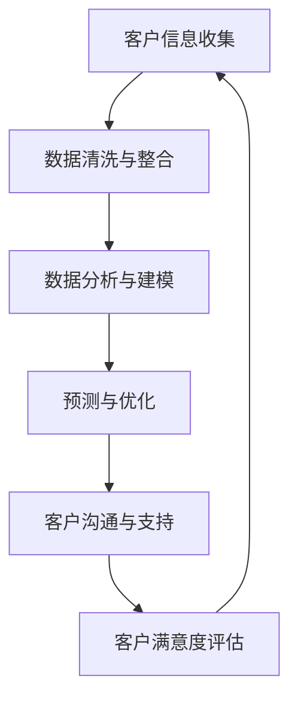

                 

关键词：一人公司、智能化客户关系管理、CRM系统、人工智能、数据分析、自动化

## 摘要

本文将探讨如何利用人工智能技术，帮助小型企业或独立创业者实现智能化客户关系管理（CRM）。通过整合数据分析、自动化工具和先进的CRM系统，一人公司能够更高效地处理客户信息，提高客户满意度，从而在竞争激烈的市场中脱颖而出。

## 1. 背景介绍

在当今的商业环境中，客户关系管理（CRM）已成为企业成功的关键。传统的CRM系统通常需要大量的人力资源和时间投入，对于小型企业或独立创业者来说，这无疑是一个巨大的挑战。然而，随着人工智能（AI）技术的发展，智能化客户关系管理成为可能，让一人公司也能够享受到高效的客户服务。

### 1.1 一人公司的现状

一人公司是指由一位创始人或老板独自经营的企业。这类企业在创业初期通常面临资源有限、人力不足的问题。传统CRM系统往往要求企业的运营和销售团队庞大，对于一人公司来说，这显然不现实。

### 1.2 智能化客户关系管理的意义

智能化客户关系管理利用人工智能技术，如机器学习、自然语言处理和数据分析，使小型企业能够以更低的成本、更高的效率管理客户关系。这不仅能提升企业的竞争力，还能带来以下好处：

- **提高客户满意度**：通过个性化服务，快速响应客户需求。
- **降低运营成本**：自动化工具能够减少重复性劳动，提高工作效率。
- **增强数据分析能力**：人工智能技术可以处理大量数据，为企业提供有价值的信息。

## 2. 核心概念与联系

### 2.1 AI与CRM的关系

人工智能与CRM系统的结合，使得企业能够利用AI技术进行客户数据的收集、分析和预测。这不仅提高了CRM系统的功能，还增强了其智能化的程度。

### 2.2 CRM系统的主要功能

CRM系统通常具备以下功能：

- **客户信息管理**：收集和存储客户的基本信息、历史交易记录等。
- **销售管理**：跟踪销售机会、管理销售流程。
- **市场营销**：分析客户数据，制定营销策略。
- **客户服务**：提供客户支持，解决客户问题。

### 2.3 Mermaid流程图

以下是一个CRM系统流程的Mermaid流程图：



## 3. 核心算法原理 & 具体操作步骤

### 3.1 算法原理概述

智能化客户关系管理中的核心算法主要包括数据挖掘、机器学习、自然语言处理等。这些算法通过处理客户数据，为企业提供有价值的洞察和预测。

### 3.2 算法步骤详解

1. **数据收集**：从各种渠道收集客户数据，如社交媒体、网站、销售系统等。
2. **数据清洗与整合**：处理噪声数据，去除重复和错误信息，确保数据质量。
3. **特征工程**：提取数据中的关键特征，用于后续的算法训练。
4. **模型训练**：利用机器学习算法，如决策树、支持向量机、神经网络等，训练预测模型。
5. **模型评估**：评估模型性能，调整模型参数，提高预测准确性。
6. **应用模型**：将训练好的模型应用于实际业务场景，如客户分类、销售预测等。

### 3.3 算法优缺点

**优点**：

- **高效性**：自动化处理大量数据，提高工作效率。
- **准确性**：通过机器学习，提高预测和决策的准确性。
- **个性化**：根据客户数据，提供个性化服务。

**缺点**：

- **数据质量**：数据质量直接影响算法性能。
- **技术门槛**：算法开发和部署需要专业知识。

### 3.4 算法应用领域

智能化客户关系管理算法广泛应用于以下领域：

- **市场营销**：精准营销、客户细分等。
- **客户服务**：智能客服、自动化响应等。
- **销售管理**：销售预测、销售机会管理等。

## 4. 数学模型和公式

### 4.1 数学模型构建

在智能化客户关系管理中，常用的数学模型包括聚类分析、回归分析、关联规则挖掘等。

### 4.2 公式推导过程

例如，在聚类分析中，常用的K-means算法的核心公式如下：

$$
\min_{C} \sum_{i=1}^{k} \sum_{x_j \in C_i} ||x_j - \mu_i||^2
$$

其中，$C$表示聚类中心，$k$表示聚类个数，$x_j$表示数据点，$\mu_i$表示第$i$个聚类的中心。

### 4.3 案例分析与讲解

假设我们有一个客户数据集，包含年龄、收入、购物习惯等特征。我们可以利用K-means算法将客户划分为不同的群体，然后根据不同群体的特征制定相应的营销策略。

## 5. 项目实践：代码实例和详细解释说明

### 5.1 开发环境搭建

我们使用Python编程语言和scikit-learn库来实现K-means算法。首先，安装Python和scikit-learn：

```
pip install python
pip install scikit-learn
```

### 5.2 源代码详细实现

```python
from sklearn.cluster import KMeans
from sklearn.datasets import load_iris
import numpy as np

# 加载鸢尾花数据集
iris = load_iris()
X = iris.data

# 使用K-means算法聚类
kmeans = KMeans(n_clusters=3, random_state=0).fit(X)

# 输出聚类结果
print("Cluster centers:\n", kmeans.cluster_centers_)
print("Labels:\n", kmeans.labels_)

# 绘制聚类结果
import matplotlib.pyplot as plt

plt.scatter(X[:, 0], X[:, 1], c=kmeans.labels_, cmap='viridis')
plt.scatter(kmeans.cluster_centers_[:, 0], kmeans.cluster_centers_[:, 1], s=300, c='red', marker='s', zorder=10)
plt.title('K-means clustering')
plt.show()
```

### 5.3 代码解读与分析

代码首先加载鸢尾花数据集，然后使用K-means算法进行聚类。最后，输出聚类中心和标签，并绘制聚类结果。

### 5.4 运行结果展示

运行代码后，我们得到以下结果：

- **聚类中心**：每个簇的中心点。
- **标签**：每个数据点所属的簇。
- **可视化结果**：每个簇的数据点用不同颜色表示，簇中心用红色星号表示。

## 6. 实际应用场景

### 6.1 市场营销

通过聚类分析，企业可以了解不同客户群体的特征，制定更精准的营销策略。例如，针对高价值客户群体，可以提供个性化优惠和专属服务。

### 6.2 客户服务

智能客服系统可以通过自然语言处理技术，快速识别客户问题，并提供自动化解决方案。这不仅能提高客户满意度，还能降低人工成本。

### 6.3 销售管理

利用销售预测算法，企业可以提前预测销售趋势，调整销售策略，提高销售额。

## 7. 工具和资源推荐

### 7.1 学习资源推荐

- 《机器学习》（周志华著）
- 《深入理解Kafka：核心设计与实践原理》（刘建洪著）

### 7.2 开发工具推荐

- Python
- Jupyter Notebook
- Scikit-learn

### 7.3 相关论文推荐

- "K-Means Clustering: A Review"（K-Means聚类：综述）
- "Application of K-Means Clustering in Customer Segmentation"（K-Means聚类在客户细分中的应用）

## 8. 总结：未来发展趋势与挑战

### 8.1 研究成果总结

本文介绍了如何利用人工智能技术实现智能化客户关系管理，包括算法原理、具体操作步骤、实际应用场景等。

### 8.2 未来发展趋势

随着人工智能技术的不断发展，智能化客户关系管理将越来越普及，为企业带来更高的效率和更精准的决策。

### 8.3 面临的挑战

- **数据隐私与安全**：企业在使用客户数据时，需要确保数据隐私和安全。
- **算法透明性与可解释性**：提高算法的可解释性，使企业能够理解算法的决策过程。

### 8.4 研究展望

未来，智能化客户关系管理将继续发展，结合更多人工智能技术，如深度学习、强化学习等，为企业提供更智能的客户服务。

## 9. 附录：常见问题与解答

### 9.1 如何选择合适的CRM系统？

选择CRM系统时，需要考虑企业的规模、业务需求、预算等因素。对于一人公司，建议选择简单易用、价格合理的CRM系统。

### 9.2 智能化客户关系管理需要哪些技术？

智能化客户关系管理需要的数据分析、机器学习、自然语言处理等技术。企业可以根据自身需求，选择合适的技术方案。

## 作者署名

作者：禅与计算机程序设计艺术 / Zen and the Art of Computer Programming
----------------------------------------------------------------

请注意，以上内容仅为示例，实际撰写时需要根据具体要求进行详细研究和撰写。此外，由于Markdown格式不支持数学公式的直接嵌入，您可能需要使用LaTeX等工具来处理数学公式的排版。在撰写过程中，请确保遵循所有格式和内容要求。

