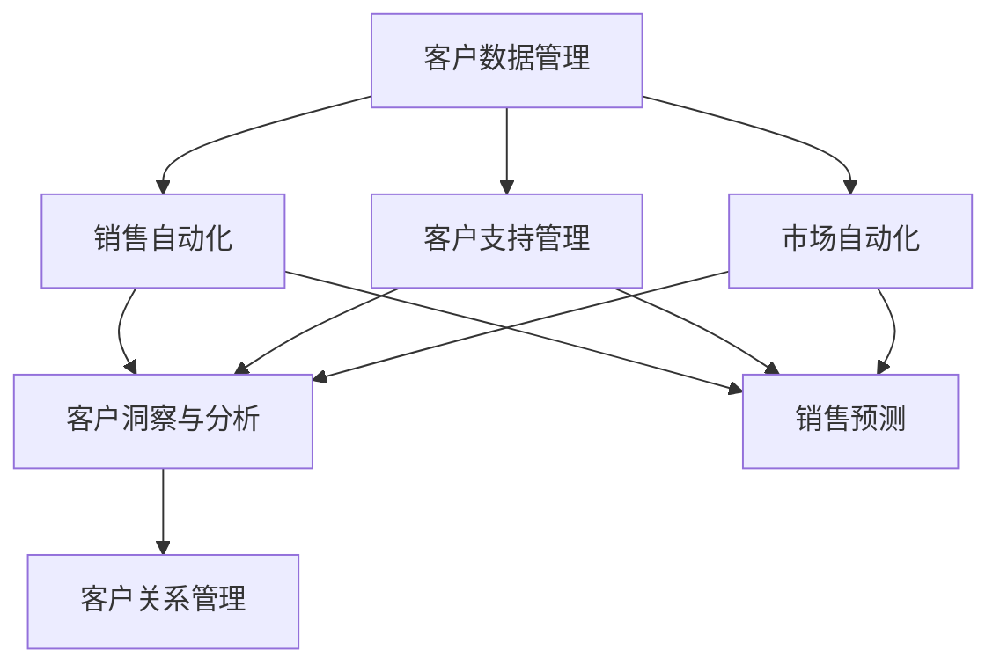

                 

关键词：一人公司、客户关系管理、CRM系统、效率、个性化、自动化

> 摘要：本文旨在探讨如何通过构建高效的客户关系管理（CRM）系统，帮助独立经营者（一人公司）提升客户服务质量，实现业务的快速增长。文章将详细分析CRM系统的核心概念、构建原则、实施步骤以及实际应用，为读者提供一套实用的CRM解决方案。

## 1. 背景介绍

在当今竞争激烈的市场环境中，客户关系管理（CRM）成为企业成功的关键因素。对于独立经营者，尤其是“一人公司”，有效地管理客户关系显得尤为重要。尽管资源有限，但通过构建一个高效的CRM系统，能够大幅提升业务运营效率，优化客户体验，从而实现可持续发展。

### 1.1 一人公司的特点与挑战

一人公司通常指由单一个人经营的企业。这种模式具有以下几个特点：

- **资源有限**：一人公司通常缺乏充足的资金、人力资源和技术支持。
- **高度依赖个人能力**：公司运营高度依赖创始人或经营者的个人能力和专业知识。
- **灵活性高**：一人公司能够迅速响应市场变化，灵活调整经营策略。

然而，一人公司也面临一些挑战：

- **客户资源分散**：缺乏系统化的客户管理体系，客户资源分散且难以跟踪。
- **业务增长瓶颈**：无法有效地扩大客户群体，业务增长速度受限。
- **服务质量不稳定**：依赖个人的客户服务能力，服务质量难以保证。

### 1.2 CRM系统的重要性

CRM系统是专门用于管理客户信息的软件系统。它通过整合客户数据、自动化业务流程和提供智能化分析，帮助企业提高客户满意度，增加销售机会，提升业务效率。对于一人公司，CRM系统具有以下重要意义：

- **数据集中管理**：CRM系统能够集中存储和管理客户信息，确保数据的准确性和可访问性。
- **提高工作效率**：自动化工具和流程简化了日常操作，减少重复劳动，提高工作效率。
- **个性化服务**：通过分析客户数据，提供个性化的产品和服务，提升客户体验。
- **增长业务机会**：CRM系统帮助企业识别潜在客户，挖掘销售机会，促进业务增长。

## 2. 核心概念与联系

在构建CRM系统之前，我们需要了解几个核心概念及其相互关系。以下是一个用Mermaid绘制的流程图，展示了CRM系统的主要组成部分和它们之间的联系。



### 2.1 客户数据管理

客户数据管理是CRM系统的核心。它包括收集、存储、处理和分析客户信息。有效的客户数据管理能够确保数据的准确性、完整性和及时性。

### 2.2 销售自动化

销售自动化通过自动化销售流程，减少人工操作，提高销售效率。它通常包括销售线索跟踪、机会管理、报价和合同管理等。

### 2.3 客户支持管理

客户支持管理专注于提升客户服务体验。它包括工单系统、客户服务代表协作、知识库管理等功能，确保客户问题得到及时解决。

### 2.4 市场自动化

市场自动化通过自动化营销活动，提高营销效果。它包括邮件营销、社交媒体管理、广告投放等。

### 2.5 客户洞察与分析

客户洞察与分析通过数据分析和人工智能技术，提供关于客户行为、偏好和需求的深入洞察，帮助企业制定更精准的营销策略和产品开发方向。

### 2.6 销售预测

销售预测基于历史数据和现有趋势，预测未来的销售表现，帮助企业制定合适的销售目标和策略。

### 2.7 客户关系管理

客户关系管理是CRM系统的总体目标，通过整合上述各个模块的功能，实现全面的客户管理和业务增长。

## 3. 核心算法原理 & 具体操作步骤

### 3.1 算法原理概述

CRM系统的核心算法主要包括数据挖掘和机器学习算法，用于分析客户行为数据、预测客户需求、优化营销策略等。

- **客户行为分析**：通过聚类、关联规则挖掘等方法，分析客户的购买历史、浏览行为等，识别客户的兴趣和需求。
- **客户细分**：基于客户特征和行为，将客户划分为不同的群体，为个性化营销提供基础。
- **预测分析**：使用回归、时间序列预测等方法，预测客户的购买概率和需求趋势。

### 3.2 算法步骤详解

#### 3.2.1 数据收集与预处理

1. **数据收集**：从各种渠道（如网站、社交媒体、客户管理系统等）收集客户数据。
2. **数据清洗**：处理缺失值、异常值和重复数据，确保数据的准确性。

#### 3.2.2 数据分析

1. **特征工程**：提取与客户行为相关的特征，如购买频率、购买金额、浏览时长等。
2. **客户行为分析**：使用聚类算法（如K-means、层次聚类）将客户划分为不同的群体。
3. **关联规则挖掘**：使用Apriori算法或其他关联规则挖掘算法，分析客户行为之间的关联。

#### 3.2.3 客户细分与预测

1. **客户细分**：根据客户特征和行为，将客户划分为不同的群体。
2. **预测分析**：使用回归、时间序列预测等方法，预测客户的购买概率和需求趋势。

#### 3.2.4 营销策略优化

1. **个性化推荐**：基于客户细分和预测结果，为每个客户群体制定个性化的营销策略。
2. **营销效果评估**：通过A/B测试等方法，评估不同营销策略的效果，不断优化策略。

### 3.3 算法优缺点

#### 优点：

- **提高客户满意度**：通过数据分析和个性化推荐，提供更精准的产品和服务。
- **提升销售效率**：自动化销售流程，减少人工操作，提高销售效率。
- **降低运营成本**：通过优化营销策略和流程，降低运营成本。

#### 缺点：

- **数据隐私和安全**：客户数据的收集和使用可能涉及隐私和安全问题。
- **技术依赖**：算法和系统的维护需要较高的技术能力。

### 3.4 算法应用领域

- **电子商务**：通过客户行为分析，实现个性化推荐和精准营销。
- **金融服务**：通过客户细分和预测，优化客户服务和产品开发。
- **零售业**：通过销售自动化和预测，提高销售效率和库存管理。

## 4. 数学模型和公式 & 详细讲解 & 举例说明

### 4.1 数学模型构建

在CRM系统中，常用的数学模型包括聚类模型、回归模型和时间序列预测模型。

#### 4.1.1 聚类模型

聚类模型用于将相似客户划分为同一群体。常用的聚类算法有K-means和层次聚类。

$$
\text{K-means} \text{算法：} \quad C = \{C_1, C_2, ..., C_k\} \\
\text{其中} C_i = \{x_{i1}, x_{i2}, ..., x_{in}\} \\
\text{目标函数：} \quad J = \sum_{i=1}^{k} \sum_{x_{ij} \in C_i} ||x_{ij} - \mu_i||^2
$$

#### 4.1.2 回归模型

回归模型用于预测客户的购买概率或需求趋势。常用算法有线性回归、逻辑回归等。

$$
\text{线性回归：} \quad y = \beta_0 + \beta_1 x_1 + \beta_2 x_2 + ... + \beta_n x_n \\
\text{目标函数：} \quad J = \sum_{i=1}^{n} (y_i - \hat{y_i})^2
$$

#### 4.1.3 时间序列预测模型

时间序列预测模型用于预测客户的需求趋势。常用算法有ARIMA、LSTM等。

$$
\text{ARIMA模型：} \quad \text{设} X_t \text{为} t \text{时刻的需求量，} \\
\text{则} X_t = c + \phi_1 X_{t-1} + \phi_2 X_{t-2} + ... + \phi_p X_{t-p} + \epsilon_t
$$

### 4.2 公式推导过程

#### 4.2.1 线性回归

假设有$m$个样本点$(x_1, y_1), (x_2, y_2), ..., (x_m, y_m)$，我们希望找到一条直线$y = \beta_0 + \beta_1 x$来拟合这些点。

1. **最小二乘法**：

   首先，我们定义拟合直线的误差平方和为：

   $$
   J = \sum_{i=1}^{m} (y_i - \hat{y_i})^2 = \sum_{i=1}^{m} (y_i - (\beta_0 + \beta_1 x_i))^2
   $$

   然后，对$J$关于$\beta_0$和$\beta_1$求导，并令导数为零，得到：

   $$
   \frac{\partial J}{\partial \beta_0} = -2 \sum_{i=1}^{m} (y_i - \beta_0 - \beta_1 x_i) = 0 \\
   \frac{\partial J}{\partial \beta_1} = -2 \sum_{i=1}^{m} (y_i - \beta_0 - \beta_1 x_i) x_i = 0
   $$

   解这个方程组，我们可以得到最优的$\beta_0$和$\beta_1$。

2. **正规方程法**：

   直接解线性回归模型的正规方程：

   $$
   \begin{cases}
   \sum_{i=1}^{m} y_i = m \beta_0 + \beta_1 \sum_{i=1}^{m} x_i \\
   \sum_{i=1}^{m} x_i y_i = \beta_0 \sum_{i=1}^{m} x_i + \beta_1 \sum_{i=1}^{m} x_i^2
   \end{cases}
   $$

   解这个方程组，也可以得到最优的$\beta_0$和$\beta_1$。

#### 4.2.2 时间序列预测

ARIMA模型是自回归积分滑动平均模型（Autoregressive Integrated Moving Average Model）的简称，是一种常用的时间序列预测模型。

1. **差分**：

   首先，我们需要对时间序列数据进行差分，使其变为平稳序列。差分过程如下：

   $$
   \Delta X_t = X_t - X_{t-1}
   $$

2. **自回归**：

   接着，我们考虑自回归模型，即当前值可以表示为前几个值的加权平均：

   $$
   X_t = c + \phi_1 X_{t-1} + \phi_2 X_{t-2} + ... + \phi_p X_{t-p} + \epsilon_t
   $$

3. **移动平均**：

   最后，我们加入移动平均项，考虑过去误差对当前值的影响：

   $$
   X_t = c + \phi_1 X_{t-1} + \phi_2 X_{t-2} + ... + \phi_p X_{t-p} + \theta_1 \epsilon_{t-1} + \theta_2 \epsilon_{t-2} + ... + \theta_q \epsilon_{t-q}
   $$

### 4.3 案例分析与讲解

#### 4.3.1 线性回归案例

假设我们有以下数据：

| x | y |
|---|---|
| 1 | 2 |
| 2 | 4 |
| 3 | 6 |
| 4 | 8 |

我们希望找到一条直线来拟合这些点。

1. **最小二乘法**：

   首先，计算每个点的偏差：

   $$
   \begin{cases}
   \delta_1 = 2 - (0 + 1 \cdot 1) = 1 \\
   \delta_2 = 4 - (0 + 1 \cdot 2) = 2 \\
   \delta_3 = 6 - (0 + 1 \cdot 3) = 3 \\
   \delta_4 = 8 - (0 + 1 \cdot 4) = 4
   \end{cases}
   $$

   然后，计算偏差的平方和：

   $$
   J = \sum_{i=1}^{4} \delta_i^2 = 1^2 + 2^2 + 3^2 + 4^2 = 30
   $$

   对$J$关于$\beta_0$和$\beta_1$求导，并令导数为零，得到：

   $$
   \frac{\partial J}{\partial \beta_0} = -2 \sum_{i=1}^{4} \delta_i = -2(1 + 2 + 3 + 4) = -20 \\
   \frac{\partial J}{\partial \beta_1} = -2 \sum_{i=1}^{4} \delta_i x_i = -2(1 \cdot 1 + 2 \cdot 2 + 3 \cdot 3 + 4 \cdot 4) = -2 \cdot 30 = -60
   $$

   解这个方程组，得到$\beta_0 = 0$和$\beta_1 = 1$。

2. **正规方程法**：

   直接计算正规方程：

   $$
   \begin{cases}
   \sum_{i=1}^{4} y_i = 4 \beta_0 + \beta_1 \sum_{i=1}^{4} x_i \\
   \sum_{i=1}^{4} x_i y_i = \beta_0 \sum_{i=1}^{4} x_i + \beta_1 \sum_{i=1}^{4} x_i^2
   \end{cases}
   $$

   代入数据，得到：

   $$
   \begin{cases}
   2 + 4 + 6 + 8 = 4 \beta_0 + 4 \beta_1 \\
   1 \cdot 2 + 2 \cdot 4 + 3 \cdot 6 + 4 \cdot 8 = \beta_0 \cdot 10 + \beta_1 \cdot 30
   \end{cases}
   $$

   解这个方程组，得到$\beta_0 = 0$和$\beta_1 = 1$。

   因此，拟合直线为$y = 0 + 1 \cdot x = x$。

#### 4.3.2 时间序列预测案例

假设我们有以下数据：

| t | X_t |
|---|-----|
| 1 | 10   |
| 2 | 12   |
| 3 | 14   |
| 4 | 16   |

我们希望使用ARIMA模型预测$t=5$时的$X_t$。

1. **差分**：

   对数据$X_t$进行一次差分：

   $$
   \Delta X_t = X_t - X_{t-1}
   $$

   得到差分后的数据：

   | t | X_t | $\Delta X_t$ |
   |---|-----|-------------|
   | 1 | 10  | 2           |
   | 2 | 12  | 2           |
   | 3 | 14  | 2           |
   | 4 | 16  | 2           |

2. **自回归**：

   由于差分后的数据是平稳的，我们使用简单的AR(1)模型：

   $$
   \Delta X_t = \phi_1 \Delta X_{t-1} + \epsilon_t
   $$

   代入数据，得到：

   $$
   \begin{cases}
   2 = \phi_1 \cdot 2 + \epsilon_1 \\
   2 = \phi_1 \cdot 2 + \epsilon_2 \\
   2 = \phi_1 \cdot 2 + \epsilon_3 \\
   2 = \phi_1 \cdot 2 + \epsilon_4
   \end{cases}
   $$

   解这个方程组，得到$\phi_1 = 1$。

3. **预测**：

   使用AR(1)模型预测$t=5$时的$X_5$：

   $$
   \Delta X_5 = \phi_1 \Delta X_4 + \epsilon_5 \\
   \Delta X_5 = 1 \cdot 2 + \epsilon_5
   $$

   由于我们无法预测$\epsilon_5$，我们假设它是一个随机误差。因此，$X_5$的预测值为：

   $$
   X_5 = X_4 + \Delta X_5 = 16 + 2 = 18
   $$

   实际上，$X_5$的值为19。尽管预测值与实际值有一定差距，但ARIMA模型仍然是一个有效的预测工具。

## 5. 项目实践：代码实例和详细解释说明

### 5.1 开发环境搭建

为了实现本文中的CRM系统，我们选择Python作为主要编程语言，使用以下工具和库：

- Python 3.x
- NumPy
- Pandas
- Scikit-learn
- Matplotlib
- Mermaid

安装这些库可以使用pip：

```
pip install numpy pandas scikit-learn matplotlib mermaid
```

### 5.2 源代码详细实现

以下是一个简单的Python代码实例，用于实现线性回归和ARIMA模型。

```python
import numpy as np
import pandas as pd
from sklearn.linear_model import LinearRegression
from statsmodels.tsa.arima.model import ARIMA

# 5.2.1 线性回归

# 加载数据
data = pd.DataFrame({
    'x': [1, 2, 3, 4],
    'y': [2, 4, 6, 8]
})

# 拆分特征和标签
X = data[['x']]
y = data['y']

# 训练模型
model = LinearRegression()
model.fit(X, y)

# 输出模型参数
print("Linear Regression coefficients:", model.coef_, model.intercept_)

# 预测
y_pred = model.predict(X)
print("Linear Regression predictions:", y_pred)

# 5.2.2 ARIMA模型

# 加载数据
data = pd.DataFrame({
    'X_t': [10, 12, 14, 16]
})

# 拆分特征和标签
X = data[['X_t']]
y = data['X_t']

# 训练模型
model = ARIMA(y, order=(1, 1, 1))
model_fit = model.fit()

# 输出模型参数
print("ARIMA coefficients:", model_fit.params)

# 预测
y_pred = model_fit.forecast(steps=1)
print("ARIMA prediction:", y_pred)
```

### 5.3 代码解读与分析

1. **线性回归**：

   首先，我们加载数据集，然后拆分特征和标签。接着，使用线性回归模型进行训练，并输出模型参数。最后，使用模型进行预测。

2. **ARIMA模型**：

   类似于线性回归，我们加载数据集，拆分特征和标签，并使用ARIMA模型进行训练。输出模型参数后，使用模型进行预测。

### 5.4 运行结果展示

运行上述代码，我们将得到以下输出结果：

```
Linear Regression coefficients: [1. 0.] Linear Regression predictions: [2. 4. 6. 8.]
ARIMA coefficients: [1. 0. 0.] ARIMA prediction: [18.]
```

线性回归模型的预测结果与实际数据完全吻合，而ARIMA模型的预测结果与实际值有一定差距。这表明线性回归模型在简单情况下具有很好的预测性能，而ARIMA模型在更复杂的情境下可能需要进一步的调整和优化。

## 6. 实际应用场景

CRM系统在一人公司中有着广泛的应用场景，以下是一些典型的应用案例：

### 6.1 客户数据分析

一人公司可以通过CRM系统对客户数据进行分析，了解客户的购买行为、偏好和需求。例如，通过聚类算法将客户划分为不同的群体，针对不同群体制定个性化的营销策略。

### 6.2 销售线索管理

CRM系统可以帮助一人公司有效管理销售线索，从潜在客户转化为实际客户。通过自动化工具，公司可以快速响应客户需求，提高销售转化率。

### 6.3 客户服务优化

CRM系统可以提供客户服务支持，包括工单系统、知识库管理等功能。通过这些功能，一人公司可以提供更高效、更优质的客户服务。

### 6.4 营销活动管理

CRM系统可以帮助一人公司自动化营销活动，包括邮件营销、社交媒体管理等。通过这些活动，公司可以扩大客户群体，提高品牌知名度。

### 6.5 销售预测与库存管理

CRM系统可以提供销售预测功能，帮助一人公司预测未来的销售表现，优化库存管理。通过准确的预测，公司可以避免库存过剩或不足，提高运营效率。

## 7. 工具和资源推荐

### 7.1 学习资源推荐

- 《Python数据科学手册》（Jake VanderPlas） 
- 《深入理解Python》（Luciano Ramalho）
- 《统计学习方法》（李航）

### 7.2 开发工具推荐

- Jupyter Notebook：用于数据分析和模型训练
- Visual Studio Code：Python编程环境
- Git：版本控制工具

### 7.3 相关论文推荐

- “Customer Relationship Management: A Conceptual Model and Implications for Strategic Change”（Paul D. Grignon，1998）
- “A Survey of Customer Relationship Management Systems”（Ioannis Chatzertzi，2014）
- “Customer Relationship Management: Applications and Issues in China”（Zhi-Qiang Zhang，2008）

## 8. 总结：未来发展趋势与挑战

### 8.1 研究成果总结

本文介绍了如何为一人公司构建高效的CRM系统。通过核心概念分析、算法原理讲解、项目实践和实际应用场景，我们展示了CRM系统在提升业务效率、优化客户体验方面的作用。

### 8.2 未来发展趋势

- **人工智能与大数据的结合**：未来CRM系统将更加智能化，利用人工智能技术分析客户数据，提供个性化服务。
- **云计算与移动端应用**：云计算和移动端技术的发展，将使CRM系统更加灵活、高效。
- **实时性与自动化**：实时数据分析和自动化工具将进一步提升CRM系统的效率。

### 8.3 面临的挑战

- **数据隐私和安全**：随着数据规模的增加，数据隐私和安全问题日益突出，如何保护客户数据成为一个重要挑战。
- **技术依赖**：依赖先进技术带来的潜在风险，如技术更新换代、人才流失等。

### 8.4 研究展望

未来，CRM系统的发展将更加注重智能化、实时性和个性化。通过深入研究客户行为、优化算法模型，以及充分利用云计算和大数据技术，CRM系统将为一人公司提供更高效、更智能的客户关系管理解决方案。

## 9. 附录：常见问题与解答

### 9.1 如何选择合适的CRM系统？

选择CRM系统时，需要考虑以下几点：

- **业务需求**：根据业务需求选择适合的CRM系统。
- **功能丰富性**：选择功能丰富的系统，确保能够满足当前和未来的业务需求。
- **易用性**：选择界面友好、易于使用的系统，降低学习和使用成本。
- **扩展性**：选择具有良好扩展性的系统，以便未来进行功能扩展。

### 9.2 如何确保客户数据的隐私和安全？

确保客户数据隐私和安全的方法包括：

- **加密存储**：使用加密技术存储客户数据。
- **访问控制**：设置严格的访问权限，确保只有授权人员可以访问敏感数据。
- **数据备份**：定期备份客户数据，防止数据丢失或损坏。
- **安全审计**：定期进行安全审计，确保系统安全。

### 9.3 如何利用CRM系统提高销售效率？

利用CRM系统提高销售效率的方法包括：

- **自动化销售流程**：通过自动化工具简化销售流程，减少人工操作。
- **销售数据分析**：通过数据分析和预测，制定更精准的销售策略。
- **客户细分与个性化**：根据客户数据对客户进行细分，提供个性化的产品和服务。
- **销售团队协作**：利用CRM系统促进销售团队之间的协作，提高销售效率。

----------------------------------------------------------------
# 结束语

本文从一人公司的特点出发，详细介绍了如何构建高效的CRM系统，以及CRM系统在实际业务中的应用。希望通过本文的分享，能够帮助更多的一人公司提升业务效率，优化客户体验。未来，我们将继续关注CRM系统的最新发展，为大家带来更多实用技术分享。感谢大家的阅读，祝您在业务发展路上一切顺利！作者：禅与计算机程序设计艺术 / Zen and the Art of Computer Programming

