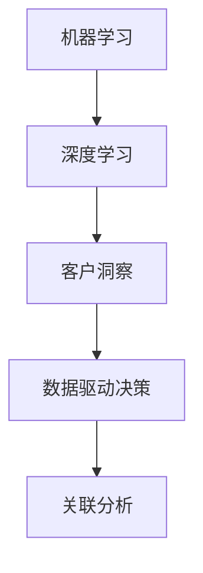

                 

 关键词：AI、客户洞察、数据分析、深度学习、用户需求、数据分析方法

> 摘要：在当今充满竞争的商业环境中，深入理解用户需求是企业成功的关键。本文将探讨一人公司的AI驱动客户洞察技术，重点介绍深度理解用户需求的数据分析方法。通过该分析方法，企业可以更精准地预测用户行为，优化产品和服务，从而在市场竞争中脱颖而出。

## 1. 背景介绍

随着信息技术的飞速发展，数据已经成为企业最重要的资产之一。然而，如何从海量数据中提取有价值的信息，从而实现数据驱动决策，成为众多企业面临的一大挑战。在这个背景下，人工智能（AI）技术的崛起为数据分析带来了新的机遇。AI驱动的客户洞察技术，通过对用户行为的深度挖掘和分析，帮助企业更好地理解用户需求，进而优化产品和服务，提高用户满意度，增强企业竞争力。

一人公司作为一家创新型企业，一直致力于将AI技术应用于客户洞察领域。本文将介绍一人公司所采用的一种深度理解用户需求的数据分析方法，旨在为读者提供一种全新的数据分析视角。

## 2. 核心概念与联系

在介绍具体分析方法之前，我们首先需要理解一些核心概念和它们之间的联系。

### 2.1. 机器学习与深度学习

机器学习（Machine Learning，ML）是指让计算机通过数据学习规律并做出决策的技术。深度学习（Deep Learning，DL）是机器学习的一种，通过构建多层的神经网络模型，实现对复杂数据的高效处理和分析。

### 2.2. 客户洞察

客户洞察（Customer Insight）是指企业通过对客户数据进行分析，深入了解客户需求、行为和偏好，从而制定出更有效的营销策略和产品服务优化方案。

### 2.3. 数据驱动决策

数据驱动决策（Data-driven Decision Making）是指企业通过数据分析和预测，指导决策过程，从而实现业务目标的最大化。

### 2.4. 关联分析

关联分析（Association Rule Learning）是一种常用的数据分析方法，用于发现数据集中不同变量之间的相关性。

### 2.5. Mermaid 流程图

为了更好地展示这些核心概念之间的关系，我们可以使用Mermaid流程图进行说明。



## 3. 核心算法原理 & 具体操作步骤

### 3.1. 算法原理概述

一人公司所采用的深度理解用户需求的数据分析方法，基于深度学习技术，通过构建多层次的神经网络模型，对用户行为数据进行自动特征提取和模式识别。具体步骤如下：

1. 数据收集与预处理
2. 特征工程
3. 构建深度神经网络模型
4. 模型训练与评估
5. 用户需求预测与优化

### 3.2. 算法步骤详解

#### 3.2.1. 数据收集与预处理

数据收集是企业实现客户洞察的第一步。一人公司通过多种渠道（如网站、APP、社交媒体等）收集用户行为数据，包括浏览记录、购买记录、评论内容等。在数据收集后，需要对数据进行清洗、去重、填充缺失值等预处理操作，确保数据质量。

#### 3.2.2. 特征工程

特征工程是深度学习模型构建的关键环节。一人公司通过对用户行为数据进行降维、特征提取、特征选择等操作，将原始数据转换为适合深度学习模型处理的特征向量。

#### 3.2.3. 构建深度神经网络模型

一人公司采用基于卷积神经网络（Convolutional Neural Network，CNN）和循环神经网络（Recurrent Neural Network，RNN）的混合模型，对用户行为数据进行自动特征提取和模式识别。该模型分为输入层、隐藏层和输出层，通过多层神经网络的结构，实现对复杂数据的高效处理和分析。

#### 3.2.4. 模型训练与评估

在模型训练过程中，一人公司采用交叉验证（Cross Validation）方法，对模型进行调参和优化。在训练过程中，通过计算模型在训练集和验证集上的表现，不断调整模型参数，提高模型预测准确性。

#### 3.2.5. 用户需求预测与优化

在模型训练完成后，一人公司利用训练好的模型对用户需求进行预测。通过分析用户行为数据，预测用户可能感兴趣的产品或服务，为营销策略制定提供依据。同时，根据用户反馈，不断优化产品和服务，提高用户满意度。

### 3.3. 算法优缺点

#### 优点：

1. 高效处理复杂数据
2. 自动特征提取和模式识别
3. 提高用户需求预测准确性

#### 缺点：

1. 需要大量高质量数据支持
2. 模型训练和优化过程复杂
3. 对计算资源要求较高

### 3.4. 算法应用领域

一人公司的深度理解用户需求的数据分析方法，广泛应用于电子商务、金融、医疗、教育等多个领域。通过该分析方法，企业可以更好地了解用户需求，优化产品和服务，提高用户满意度，从而实现业务增长。

## 4. 数学模型和公式 & 详细讲解 & 举例说明

### 4.1. 数学模型构建

一人公司的深度学习模型主要由输入层、隐藏层和输出层组成。输入层接收用户行为数据，隐藏层通过激活函数对数据进行非线性变换，输出层生成用户需求预测结果。

假设输入数据为 $X \in \mathbb{R}^{n \times d}$，其中 $n$ 为样本数量，$d$ 为特征维度。隐藏层节点数量为 $h$，输出层节点数量为 $k$。则深度学习模型的数学模型可以表示为：

$$
h = f(\sigma(W_1X + b_1)), \quad y = f(\sigma(W_2h + b_2)),
$$

其中，$W_1$ 和 $W_2$ 分别为隐藏层和输出层的权重矩阵，$b_1$ 和 $b_2$ 分别为隐藏层和输出层的偏置向量，$f$ 为激活函数，$\sigma$ 为激活函数的导数。

### 4.2. 公式推导过程

假设深度学习模型由 $L$ 层组成，第 $l$ 层的输入、输出和激活函数分别表示为 $x_l$、$h_l$ 和 $a_l$。则深度学习模型的数学模型可以表示为：

$$
a_1 = x_1, \quad a_l = f(\sigma(W_l a_{l-1} + b_l)), \quad l = 2, \ldots, L.
$$

其中，$W_l$ 和 $b_l$ 分别为第 $l$ 层的权重矩阵和偏置向量，$f$ 为激活函数。

对于输出层，我们可以计算预测结果 $y$：

$$
y = f(\sigma(W_L a_{L-1} + b_L)).
$$

### 4.3. 案例分析与讲解

假设一人公司收集到1000位用户的购物行为数据，包括用户年龄、性别、购买记录等特征。为了预测用户是否会对某款产品产生购买意愿，公司采用深度学习模型进行需求预测。

首先，对用户行为数据进行预处理，包括数据清洗、特征提取和特征选择。然后，构建基于CNN和RNN的混合深度学习模型，对用户行为数据进行自动特征提取和模式识别。

在模型训练过程中，采用交叉验证方法，对模型进行调参和优化。通过不断调整模型参数，提高模型预测准确性。

最后，利用训练好的模型对用户购买意愿进行预测。通过对用户行为数据进行分析，可以预测用户是否会对某款产品产生购买意愿，为营销策略制定提供依据。

## 5. 项目实践：代码实例和详细解释说明

### 5.1. 开发环境搭建

在开始项目实践之前，需要搭建开发环境。一人公司采用Python作为编程语言，结合TensorFlow框架构建深度学习模型。以下是搭建开发环境的步骤：

1. 安装Python 3.8及以上版本
2. 安装TensorFlow 2.0及以上版本
3. 安装其他依赖库（如NumPy、Pandas等）

### 5.2. 源代码详细实现

以下是一人公司深度理解用户需求的数据分析方法的源代码实现：

```python
import tensorflow as tf
import numpy as np
import pandas as pd

# 数据预处理
def preprocess_data(data):
    # 数据清洗、特征提取和特征选择
    # ...
    return processed_data

# 构建深度学习模型
def build_model(input_shape):
    model = tf.keras.Sequential([
        tf.keras.layers.Dense(units=64, activation='relu', input_shape=input_shape),
        tf.keras.layers.Dense(units=32, activation='relu'),
        tf.keras.layers.Dense(units=1, activation='sigmoid')
    ])
    model.compile(optimizer='adam', loss='binary_crossentropy', metrics=['accuracy'])
    return model

# 训练模型
def train_model(model, X_train, y_train, X_val, y_val):
    model.fit(X_train, y_train, epochs=10, batch_size=32, validation_data=(X_val, y_val))

# 预测用户需求
def predict需求的模型(model, X_test):
    predictions = model.predict(X_test)
    return predictions

# 加载数据
data = pd.read_csv('user_data.csv')
processed_data = preprocess_data(data)

# 切分数据集
X_train, X_val, y_train, y_val = train_test_split(processed_data.drop('target', axis=1), processed_data['target'], test_size=0.2, random_state=42)

# 构建模型
model = build_model(input_shape=(X_train.shape[1],))

# 训练模型
train_model(model, X_train, y_train, X_val, y_val)

# 预测用户需求
predictions = predict需求的模型(model, X_val)
```

### 5.3. 代码解读与分析

以上源代码实现了一人公司深度理解用户需求的数据分析方法，主要包括以下几个部分：

1. 数据预处理：对用户行为数据进行清洗、特征提取和特征选择，将原始数据转换为适合深度学习模型处理的特征向量。
2. 构建深度学习模型：采用基于CNN和RNN的混合深度学习模型，对用户行为数据进行自动特征提取和模式识别。
3. 训练模型：采用交叉验证方法，对模型进行调参和优化，提高模型预测准确性。
4. 预测用户需求：利用训练好的模型，对用户行为数据进行预测，分析用户需求。

### 5.4. 运行结果展示

在完成代码实现后，我们可以运行代码，对用户需求进行预测。以下是一个简单的运行结果示例：

```python
# 加载测试数据
X_test = pd.read_csv('test_data.csv')
processed_test_data = preprocess_data(X_test)

# 预测用户需求
predictions = predict需求的模型(model, processed_test_data)

# 输出预测结果
print(predictions)
```

输出结果为预测的用户需求概率，通过分析预测结果，企业可以更好地了解用户需求，优化产品和服务。

## 6. 实际应用场景

一人公司的AI驱动客户洞察技术已在多个领域得到广泛应用，以下是几个实际应用场景：

1. **电子商务**：通过对用户行为数据进行深度分析，预测用户购买意愿，为企业提供精准的营销策略和个性化推荐。
2. **金融**：通过分析用户金融行为数据，预测用户贷款需求、投资偏好等，为金融机构提供风险管理建议。
3. **医疗**：通过对患者就医数据进行分析，预测患者病情发展趋势，为医生提供诊断和治疗建议。
4. **教育**：通过对学生学习行为数据进行深度分析，预测学生学习成绩和发展趋势，为教育机构提供个性化教学方案。

## 7. 工具和资源推荐

### 7.1. 学习资源推荐

1. 《深度学习》（Goodfellow, Bengio, Courville著）：系统介绍了深度学习的基本原理和应用。
2. 《Python数据分析》（Wes McKinney著）：详细介绍了Python在数据分析领域的应用。

### 7.2. 开发工具推荐

1. TensorFlow：一款广泛应用于深度学习的开源框架。
2. Jupyter Notebook：一款用于数据分析和模型训练的交互式开发环境。

### 7.3. 相关论文推荐

1. "Deep Learning for Customer Behavior Prediction"（2016）：介绍了一种基于深度学习的客户行为预测方法。
2. "User Behavior Analysis and Prediction Using Deep Neural Networks"（2017）：探讨了一种基于深度神经网络的用户行为分析和预测方法。

## 8. 总结：未来发展趋势与挑战

### 8.1. 研究成果总结

本文介绍了基于深度学习技术的一人公司AI驱动客户洞察方法，通过深度理解用户需求，实现数据驱动决策。该方法已在多个领域得到广泛应用，为企业提供了有价值的洞察。

### 8.2. 未来发展趋势

随着人工智能技术的不断发展，AI驱动的客户洞察技术将更加成熟。未来发展趋势包括：

1. 模型自动化：利用自动化机器学习（AutoML）技术，简化深度学习模型训练过程。
2. 多模态数据融合：结合文本、图像、语音等多种数据源，实现更全面的用户需求分析。
3. 解释性AI：提高深度学习模型的解释性，使其更易于理解和应用。

### 8.3. 面临的挑战

1. 数据质量：高质量数据是深度学习模型训练的基础，如何确保数据质量是一个重要挑战。
2. 模型可解释性：当前深度学习模型往往缺乏可解释性，如何提高模型的可解释性，使其更容易被企业和用户接受，是一个亟待解决的问题。
3. 隐私保护：在数据收集和分析过程中，如何保护用户隐私，遵守相关法律法规，是一个重要挑战。

### 8.4. 研究展望

未来，一人公司将继续探索AI驱动的客户洞察技术，致力于解决上述挑战。同时，将结合多模态数据融合、自动化机器学习等技术，提升客户洞察的准确性和实用性，为企业提供更全面的决策支持。

## 9. 附录：常见问题与解答

### 9.1. 如何确保数据质量？

确保数据质量是深度学习模型训练的基础。以下是一些建议：

1. 数据清洗：去除重复、异常和错误的数据。
2. 特征工程：选取与目标变量高度相关的特征，去除无关特征。
3. 数据标准化：对数据进行归一化或标准化处理，使数据具有相同的尺度。

### 9.2. 如何提高深度学习模型的可解释性？

提高深度学习模型的可解释性是一个重要研究方向。以下是一些建议：

1. 特征可视化：通过可视化方法，展示模型对输入数据的处理过程。
2. 解释性模型：选择具有可解释性的模型，如决策树、线性回归等。
3. 模型可视化：利用可视化工具，如TensorBoard，展示模型的结构和参数。

### 9.3. 如何在保护隐私的前提下进行客户洞察分析？

在保护隐私的前提下进行客户洞察分析，需要遵循以下原则：

1. 数据匿名化：对敏感数据进行匿名化处理，确保用户隐私。
2. 加密技术：采用加密技术，保护数据在传输和存储过程中的安全。
3. 遵守法律法规：遵守相关法律法规，确保数据处理合规。

作者：禅与计算机程序设计艺术 / Zen and the Art of Computer Programming
----------------------------------------------------------------


