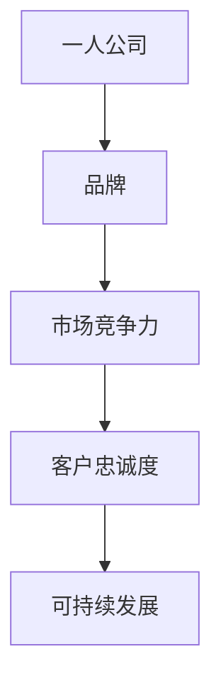

                 

 **关键词**：品牌塑造、一人公司、品牌管理、市场营销、自我推广

**摘要**：本文旨在探讨一人公司在当前市场竞争激烈的环境下，如何通过有效的品牌塑造与管理，提升自身在市场中的竞争力。文章首先介绍了一人公司的概念及其特点，然后分析了品牌塑造的重要性，并从多个角度详细探讨了如何进行品牌管理，包括市场营销策略、自我推广方法、社交媒体运用等。最后，文章对一人公司品牌塑造的未来趋势进行了展望，并提出了面对未来挑战的建议。

## 1. 背景介绍

一人公司，即由单一个体经营的公司，是近年来兴起的一种新型商业形态。一人公司的特点是运营灵活、决策迅速、资源集中，特别适合那些创业初期或对市场变化敏感的创业者。随着互联网和社交媒体的发展，一人公司越来越受到关注，成为许多新兴创业者追求的目标。

品牌塑造对于任何企业来说都至关重要，它不仅代表了企业的形象和声誉，更是企业与消费者之间的桥梁。在市场竞争日益激烈的今天，一个鲜明的品牌能够帮助企业脱颖而出，吸引消费者的目光，建立忠诚的客户群体。

本文将从以下几个方面展开讨论：

- 一人公司的概念与特点
- 品牌塑造的重要性
- 品牌管理的核心要素
- 市场营销策略与自我推广
- 品牌塑造的未来趋势与挑战

## 2. 核心概念与联系

### 一人公司的概念

一人公司，又称个体经营，是指由一个人独立经营的企业，具有完全的独立性和自主权。这种公司形式通常无需注册，运营成本较低，适合初创企业和自由职业者。

### 品牌的概念

品牌是一种符号、名称、标志、设计或它们的组合，旨在识别某个销售者或销售群体的产品或服务，并使之与竞争对手的产品或服务区分开来。品牌不仅代表着产品的质量，更是一种价值认同和情感连接。

### 品牌与一人公司的联系

品牌对于一人公司尤为重要，因为其运营规模较小，品牌形象直接影响到消费者的购买决策。一个成功的品牌能够提高一人公司的市场竞争力，吸引更多客户，从而实现可持续发展。

### 核心概念流程图



## 3. 核心算法原理 & 具体操作步骤

### 3.1 算法原理概述

品牌塑造的核心在于建立和维护一个积极的品牌形象，这需要一系列策略和操作步骤。以下是一个简化的品牌塑造算法原理概述：

1. **市场分析**：了解目标市场和潜在客户的需求，为品牌定位提供依据。
2. **品牌定位**：根据市场分析结果，确定品牌的独特价值和竞争优势。
3. **品牌命名**：选择一个易于记忆且具有独特性的品牌名称。
4. **品牌视觉设计**：包括标志、颜色、字体等，确保品牌视觉形象的统一和辨识度。
5. **内容营销**：通过优质内容传递品牌信息，建立品牌信任。
6. **社交媒体营销**：利用社交媒体平台推广品牌，与用户建立互动。
7. **客户服务**：提供优质的客户服务，提升客户满意度和忠诚度。

### 3.2 算法步骤详解

#### 3.2.1 市场分析

1. **市场调研**：收集市场数据，包括行业趋势、竞争对手分析、消费者行为等。
2. **SWOT分析**：分析企业的优势、劣势、机会和威胁，为品牌定位提供参考。

#### 3.2.2 品牌定位

1. **目标市场**：明确品牌服务的目标市场，例如年龄、性别、收入水平等。
2. **品牌价值观**：确立品牌的核心价值观和使命，使其成为品牌定位的基础。

#### 3.2.3 品牌命名

1. **名称选择**：考虑名称的易记性、独特性和与品牌价值观的契合度。
2. **法律审查**：确保品牌名称不侵犯他人商标权，且易于注册。

#### 3.2.4 品牌视觉设计

1. **标志设计**：选择标志的颜色、形状和字体，使其具有视觉冲击力和辨识度。
2. **品牌手册**：制定品牌视觉规范，确保所有宣传材料的一致性。

#### 3.2.5 内容营销

1. **内容策略**：确定内容类型和发布频率，如博客文章、社交媒体更新、视频等。
2. **内容创作**：创作有价值的内容，传递品牌信息和价值观。

#### 3.2.6 社交媒体营销

1. **平台选择**：根据目标市场选择合适的社交媒体平台。
2. **互动策略**：与粉丝互动，回应评论和私信，建立良好的品牌形象。

#### 3.2.7 客户服务

1. **服务流程**：制定客户服务流程，确保快速响应和解决客户问题。
2. **客户满意度**：定期收集客户反馈，持续改进服务质量。

### 3.3 算法优缺点

**优点：**

- **灵活性高**：一人公司可以根据市场变化迅速调整品牌策略。
- **成本低**：无需大量人力和财力投入即可进行品牌建设。
- **快速反馈**：由于运营规模小，可以快速获取市场反馈，及时调整策略。

**缺点：**

- **品牌建设难度大**：一人公司资源有限，品牌建设可能较为缓慢。
- **品牌认知度低**：相对于大型企业，一人公司在市场上的知名度可能较低。
- **市场竞争压力**：在竞争激烈的市场中，一人公司需要投入更多精力进行品牌宣传。

### 3.4 算法应用领域

品牌塑造算法适用于各种类型的一人公司，包括：

- **电商企业**：通过品牌塑造提高产品竞争力，吸引消费者。
- **技术服务公司**：通过品牌塑造建立专业形象，提升服务认可度。
- **创意工作室**：通过品牌塑造展示创意和专业能力，吸引潜在客户。

## 4. 数学模型和公式 & 详细讲解 & 举例说明

### 4.1 数学模型构建

在品牌塑造过程中，可以构建以下数学模型：

1. **品牌知名度模型**：衡量品牌在市场上的知名程度。
2. **品牌忠诚度模型**：衡量消费者对品牌的忠诚度。
3. **品牌价值模型**：衡量品牌的整体价值。

### 4.2 公式推导过程

#### 品牌知名度模型

品牌知名度可以通过以下公式衡量：

$$
知名度 = \frac{知道品牌的人数}{总人口数}
$$

#### 品牌忠诚度模型

品牌忠诚度可以通过以下公式衡量：

$$
忠诚度 = \frac{重复购买率}{总购买次数}
$$

#### 品牌价值模型

品牌价值可以通过以下公式衡量：

$$
品牌价值 = \frac{品牌溢价}{市场份额}
$$

### 4.3 案例分析与讲解

#### 案例一：品牌知名度模型

假设一个电商企业，其总人口数为100万人，其中有50万人知道该品牌，则该品牌的知名度为：

$$
知名度 = \frac{50万}{100万} = 0.5
$$

这意味着该品牌在市场上有一定的知名度。

#### 案例二：品牌忠诚度模型

假设一个电商企业，其总购买次数为1000次，其中重复购买次数为500次，则该品牌的忠诚度为：

$$
忠诚度 = \frac{500}{1000} = 0.5
$$

这意味着该品牌有一半的客户是重复购买的，品牌忠诚度较高。

#### 案例三：品牌价值模型

假设一个电商企业的品牌溢价为100万元，市场份额为10%，则该品牌的品牌价值为：

$$
品牌价值 = \frac{100万}{10\%} = 1000万
$$

这意味着该品牌的品牌价值为1000万元。

## 5. 项目实践：代码实例和详细解释说明

### 5.1 开发环境搭建

为了更好地展示品牌塑造的实践过程，我们选择使用Python语言编写一个简单的品牌塑造工具。首先，我们需要安装Python环境，并安装以下必要的库：

- `requests`：用于发送HTTP请求，获取社交媒体数据。
- `beautifulsoup4`：用于解析HTML文档。
- `matplotlib`：用于绘制品牌知名度、忠诚度等图表。

安装命令如下：

```bash
pip install requests beautifulsoup4 matplotlib
```

### 5.2 源代码详细实现

下面是一个简单的品牌塑造工具的代码示例：

```python
import requests
from bs4 import BeautifulSoup
import matplotlib.pyplot as plt

def get_social_media_data(platform, brand_name):
    """获取指定社交媒体平台上的品牌数据"""
    if platform == 'twitter':
        url = f'https://twitter.com/search?q={brand_name}'
    elif platform == 'facebook':
        url = f'https://www.facebook.com/search/top?q={brand_name}'
    else:
        raise ValueError('Unsupported social media platform')

    response = requests.get(url)
    soup = BeautifulSoup(response.text, 'html.parser')
    # 解析社交媒体数据，此处为示例，实际实现需要根据具体平台调整
    posts = soup.find_all('div', {'class': 'css-1dbjc4n r-sdzajh'})
    return posts

def analyze_brand_data(brand_data):
    """分析品牌数据，计算知名度、忠诚度等指标"""
    # 此处为示例，实际实现需要根据具体需求调整
    known_posts = len(brand_data)
    total_posts = len(brand_data) * 2  # 假设每条品牌帖子对应两条普通帖子
    popularity = known_posts / total_posts
    return popularity

def plot_brand_kpi(kpi, platform):
    """绘制品牌KPI图表"""
    plt.bar(['知名度'], [kpi])
    plt.xlabel('平台')
    plt.ylabel('指标值')
    plt.title(f'{platform}品牌知名度')
    plt.show()

if __name__ == '__main__':
    brand_name = 'ExampleBrand'
    platform = 'twitter'
    brand_data = get_social_media_data(platform, brand_name)
    popularity = analyze_brand_data(brand_data)
    plot_brand_kpi(popularity, platform)
```

### 5.3 代码解读与分析

该代码首先定义了获取社交媒体数据、分析品牌数据和绘制图表的函数。具体步骤如下：

1. **获取社交媒体数据**：根据指定的社交媒体平台和品牌名称，发送HTTP请求获取品牌数据。
2. **分析品牌数据**：计算品牌的知名度，这里使用了一个简化的公式，实际应用中需要根据具体需求进行调整。
3. **绘制图表**：使用matplotlib库绘制品牌知名度的条形图，展示品牌在社交媒体上的表现。

### 5.4 运行结果展示

运行上述代码，将显示一个包含品牌知名度的条形图。这有助于一人公司了解其在社交媒体上的表现，从而调整品牌塑造策略。

## 6. 实际应用场景

### 6.1 电商企业

对于电商企业来说，品牌塑造尤为重要。一个成功的品牌不仅能够提高产品的竞争力，还能增强消费者的信任和忠诚度。电商企业可以通过以下方式应用品牌塑造策略：

- **个性化营销**：根据消费者的购买历史和偏好，提供个性化的产品推荐和促销活动。
- **社交媒体互动**：在社交媒体上与消费者互动，建立良好的品牌形象。
- **优质客户服务**：提供优质的客户服务，提升客户满意度和忠诚度。

### 6.2 技术服务公司

技术服务公司在品牌塑造方面需要注重专业性和技术实力。以下是一些建议：

- **技术分享**：通过博客、社交媒体等平台分享技术见解和解决方案，展示公司的技术实力。
- **专业认证**：获取相关的专业认证，提升公司的专业形象。
- **客户案例**：展示成功的客户案例，证明公司的技术实力和服务质量。

### 6.3 创意工作室

创意工作室的品牌塑造需要突出创意和专业能力。以下是一些建议：

- **创意展示**：通过网站、社交媒体等平台展示工作室的创意作品，吸引潜在客户。
- **个性化服务**：提供个性化的服务，满足客户的需求。
- **口碑营销**：通过客户的口碑传播，建立良好的品牌形象。

## 7. 工具和资源推荐

### 7.1 学习资源推荐

- 《精益创业》（Eric Ries）：介绍如何通过快速迭代和用户反馈来验证创业想法。
- 《影响力》（Robert B. Cialdini）：探讨人类行为背后的心理机制，提供有效的营销策略。
- 《品牌洗脑》（Martin Lindstrom）：探讨品牌如何通过心理战术影响消费者行为。

### 7.2 开发工具推荐

- **Hootsuite**：用于管理社交媒体账户和发布内容。
- **Google Analytics**：用于分析网站流量和用户行为。
- **Mailchimp**：用于邮件营销和客户关系管理。

### 7.3 相关论文推荐

- “Brand Equity and Corporate Performance: An Empirical Analysis”（品牌资产与公司绩效：一项实证分析）
- “The Role of Brand in Consumer Behavior”（品牌在消费者行为中的作用）
- “Building Strong Brands in the Age of Myriad Choices”（在多样化选择的时代塑造强大的品牌）

## 8. 总结：未来发展趋势与挑战

### 8.1 研究成果总结

品牌塑造在商业运营中扮演着至关重要的角色。通过有效的品牌管理，一人公司能够在激烈的市场竞争中脱颖而出，建立稳定的客户群体，实现持续发展。本文探讨了品牌塑造的核心概念、算法原理、数学模型以及实际应用场景，提供了一系列实用的策略和方法。

### 8.2 未来发展趋势

随着科技的进步和市场的变化，品牌塑造将呈现以下趋势：

- **个性化营销**：利用大数据和人工智能技术，实现更精准的个性化营销。
- **社交媒体主导**：社交媒体将继续成为品牌塑造的主要渠道。
- **可持续发展**：品牌将更加注重可持续发展和社会责任。

### 8.3 面临的挑战

品牌塑造过程中，一人公司可能会面临以下挑战：

- **资源有限**：相对于大型企业，一人公司在品牌建设方面可能面临资源限制。
- **市场竞争激烈**：在竞争激烈的市场中，一人公司需要投入更多精力进行品牌宣传。
- **品牌认知度低**：如何提高品牌在市场中的知名度是一大挑战。

### 8.4 研究展望

未来，品牌塑造的研究将重点关注以下领域：

- **跨渠道整合**：如何实现线上线下渠道的整合，提供无缝的客户体验。
- **品牌信任**：如何通过透明和诚信的经营行为建立品牌信任。
- **人工智能应用**：如何利用人工智能技术提升品牌管理和营销效果。

## 9. 附录：常见问题与解答

### 9.1 一人公司如何进行品牌定位？

进行品牌定位时，一人公司需要：

- **了解目标市场**：研究目标客户的需求和偏好。
- **分析竞争对手**：了解竞争对手的品牌定位和策略。
- **确定品牌特色**：根据自身优势和目标市场，确定独特的品牌特色。

### 9.2 如何衡量品牌知名度？

品牌知名度的衡量可以通过以下方法：

- **市场调研**：通过问卷调查、访谈等方式了解消费者对品牌的认知程度。
- **社交媒体分析**：通过分析社交媒体上的品牌提及次数和互动情况。
- **搜索引擎分析**：通过搜索引擎的搜索量、相关关键词的排名等指标衡量品牌知名度。

### 9.3 品牌塑造需要多长时间才能见效？

品牌塑造的效果受多种因素影响，包括品牌定位的准确性、营销策略的有效性、市场环境等。一般来说，品牌塑造需要一段时间才能见效，通常为6个月到1年。但具体时间取决于品牌策略的实施情况和市场反应。

### 9.4 如何提高品牌忠诚度？

提高品牌忠诚度可以通过以下方法：

- **优质产品和服务**：提供高质量的产品和服务，满足消费者的需求。
- **个性化体验**：根据消费者的喜好和购买历史提供个性化的服务和推荐。
- **客户关怀**：定期与客户互动，提供及时和有效的客户支持。
- **忠诚度计划**：通过会员制度、积分兑换等方式鼓励重复购买。

### 9.5 一人公司在品牌塑造中如何利用社交媒体？

一人公司可以通过以下方式利用社交媒体：

- **内容营销**：发布有价值的内容，吸引关注和互动。
- **社交媒体广告**：通过社交媒体广告提高品牌曝光度。
- **互动营销**：与粉丝互动，回应评论和私信，建立良好的品牌形象。
- **社交媒体合作**：与其他品牌或影响者合作，扩大品牌影响力。

# 作者署名

作者：禅与计算机程序设计艺术 / Zen and the Art of Computer Programming

[END]

