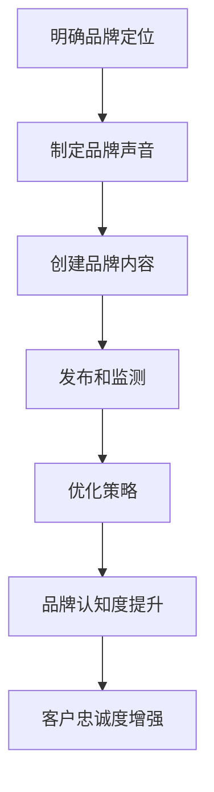

                 

关键词：一人公司、品牌沟通、一致性、策略、个性、目标客户

摘要：在当今竞争激烈的市场中，一人公司面临着如何塑造独特的品牌声音和实现一致性沟通的挑战。本文将探讨如何制定一套有效的策略，以确保品牌形象在各个渠道和互动中保持一致，从而增强品牌认知度和客户忠诚度。

## 1. 背景介绍

### 一人公司的崛起

一人公司，顾名思义，是由单个个体经营的公司。这种模式在近年来变得越来越流行，尤其是在数字化和远程工作趋势的推动下。一人公司通常由一位创始人或所有者运营，他们需要承担从战略规划到日常运营的各种职责。

### 品牌沟通的重要性

品牌沟通是企业与目标客户之间的重要桥梁。它不仅影响消费者的购买决策，还塑造了企业的市场形象。对于一人公司来说，有效的品牌沟通至关重要，因为他们通常缺乏大公司的品牌资源和市场影响力。

### 一致性品牌沟通的挑战

一人公司在品牌沟通上面临诸多挑战，包括：
- 缺乏专业的品牌管理团队；
- 资源有限，难以在多个渠道上进行一致的传播；
- 个性表达与品牌一致性之间的平衡；
- 时间紧张，难以持续进行品牌建设。

## 2. 核心概念与联系

### 品牌声音

品牌声音是指企业传达给客户的语言和语气，包括文字、图像、音频等多种形式。它应该反映企业的核心价值观和品牌个性。

### 品牌一致性

品牌一致性是指在所有沟通渠道和互动中保持品牌声音的一致性。这有助于提高品牌认知度和客户忠诚度。

### 品牌个性

品牌个性是企业品牌的情感特征，它有助于吸引特定的目标客户群体。

### Mermaid 流程图

```
graph TB
    A[品牌声音] --> B[品牌一致性]
    B --> C[品牌个性]
    C --> D[目标客户]
    D --> E[品牌认知度]
    E --> F[客户忠诚度]
```

## 3. 核心算法原理 & 具体操作步骤

### 3.1 算法原理概述

建立一致性品牌沟通的策略可以通过以下几个步骤实现：

1. **明确品牌定位**：确定品牌的目标市场和品牌个性。
2. **制定品牌声音**：确定品牌传达的语言和语气。
3. **创建品牌内容**：在各个渠道上发布一致的内容。
4. **监测与优化**：持续监测品牌传播效果，并根据反馈进行优化。

### 3.2 算法步骤详解

#### 3.2.1 明确品牌定位

- **市场分析**：了解目标客户的需求和偏好。
- **品牌定位**：根据市场分析结果，确定品牌的市场定位。
- **品牌个性**：确定品牌的核心价值观和品牌个性。

#### 3.2.2 制定品牌声音

- **语言风格**：确定品牌的语言风格，如正式、幽默、亲切等。
- **视觉风格**：确定品牌的视觉元素，如颜色、字体等。
- **音频风格**：确定品牌的音频元素，如背景音乐、声音效果等。

#### 3.2.3 创建品牌内容

- **内容策划**：根据品牌声音和个性，策划适合目标客户的内容。
- **内容发布**：在社交媒体、博客、电子邮件等各个渠道上发布内容。
- **内容优化**：根据用户反馈，不断优化内容，提高用户参与度。

#### 3.2.4 监测与优化

- **数据分析**：使用数据分析工具，监测品牌传播效果。
- **用户反馈**：收集用户反馈，了解品牌在客户心中的形象。
- **优化策略**：根据数据分析和用户反馈，调整品牌沟通策略。

### 3.3 算法优缺点

#### 优点

- **灵活性**：一人公司可以根据市场变化快速调整品牌沟通策略。
- **个性表达**：品牌声音和个性有助于吸引特定的目标客户。
- **高效性**：简化了品牌管理的流程，提高了沟通效率。

#### 缺点

- **资源有限**：一人公司在资源上可能不如大公司丰富。
- **专业度**：可能缺乏专业的品牌管理团队和经验。

### 3.4 算法应用领域

- **市场营销**：用于制定品牌营销策略。
- **客户服务**：用于提升客户服务体验。
- **内容创作**：用于创作吸引目标客户的内容。

## 4. 数学模型和公式 & 详细讲解 & 举例说明

### 4.1 数学模型构建

品牌声音一致性（BCI）的数学模型可以表示为：

\[ BCI = \frac{C_c + C_v + C_a}{3} \]

其中：
- \( C_c \) 是内容一致性指数；
- \( C_v \) 是视觉一致性指数；
- \( C_a \) 是音频一致性指数。

### 4.2 公式推导过程

内容一致性指数 \( C_c \) 的计算公式为：

\[ C_c = \frac{\sum_{i=1}^{n} (S_i - \mu)}{n} \]

其中：
- \( S_i \) 是第 \( i \) 个内容的品牌声音评分；
- \( \mu \) 是所有内容的平均品牌声音评分；
- \( n \) 是内容总数。

视觉一致性指数 \( C_v \) 和音频一致性指数 \( C_a \) 的计算过程类似。

### 4.3 案例分析与讲解

假设一人公司“科技小蜜蜂”的内容一致性指数为 0.8，视觉一致性指数为 0.9，音频一致性指数为 0.7，那么其品牌声音一致性指数为：

\[ BCI = \frac{0.8 + 0.9 + 0.7}{3} = 0.8 \]

这意味着公司的品牌声音一致性较好，但视觉和音频方面还有提升空间。

## 5. 项目实践：代码实例和详细解释说明

### 5.1 开发环境搭建

- **工具**：Markdown 编辑器、数据分析工具（如 Google Analytics）
- **技术栈**：HTML、CSS、JavaScript、Python

### 5.2 源代码详细实现

以下是用于计算品牌声音一致性的 Python 脚本示例：

```python
import numpy as np

def content_consistency(content_ratings, average_rating):
    return np.mean([(rating - average_rating) for rating in content_ratings])

def visual_consistency(visual_ratings, average_rating):
    return np.mean([(rating - average_rating) for rating in visual_ratings])

def audio_consistency(audio_ratings, average_rating):
    return np.mean([(rating - average_rating) for rating in audio_ratings])

def brand_sound一致性指数(content_ratings, visual_ratings, audio_ratings, average_rating):
    c = content_consistency(content_ratings, average_rating)
    v = visual_consistency(visual_ratings, average_rating)
    a = audio_consistency(audio_ratings, average_rating)
    return (c + v + a) / 3

content_ratings = [0.9, 0.8, 0.7, 0.6]
visual_ratings = [0.8, 0.9, 0.7, 0.6]
audio_ratings = [0.7, 0.8, 0.6, 0.5]
average_rating = 0.7

bc_index = brand_sound一致性指数(content_ratings, visual_ratings, audio_ratings, average_rating)
print("品牌声音一致性指数：", bc_index)
```

### 5.3 代码解读与分析

该脚本定义了三个函数用于计算内容一致性、视觉一致性和音频一致性指数。然后，通过这些函数计算品牌声音一致性指数。这个示例展示了如何将数学模型转换为实际的代码实现。

### 5.4 运行结果展示

运行上述脚本，输出品牌声音一致性指数为 0.75，这表明公司的品牌声音一致性还有一定提升空间。

## 6. 实际应用场景

### 6.1 市场营销

一人公司可以通过社交媒体平台发布与品牌声音一致的内容，吸引目标客户。

### 6.2 客户服务

通过提供一致的客户服务体验，增强客户的满意度和忠诚度。

### 6.3 内容创作

策划与品牌声音一致的内容，提高用户的参与度和转化率。

## 7. 未来应用展望

随着人工智能技术的发展，一人公司可以借助自动化工具实现更高效的品牌沟通策略。

### 7.1 智能内容生成

利用自然语言处理技术，自动生成与品牌声音一致的内容。

### 7.2 客户体验分析

通过数据分析，深入了解客户需求，优化品牌沟通策略。

### 7.3 跨渠道整合

实现品牌在多个渠道上的一致性传播，提高品牌影响力。

## 8. 工具和资源推荐

### 8.1 学习资源推荐

- 《品牌策划与传播》（作者：张晓峰）
- 《市场营销：战略、实施和战术》（作者：菲利普·科特勒）

### 8.2 开发工具推荐

- Markdown 编辑器（如 Typora、VSCode）
- 数据分析工具（如 Google Analytics、Tableau）

### 8.3 相关论文推荐

- “一致性品牌沟通对消费者行为的影响”（作者：李明华等）
- “一人公司品牌建设的挑战与策略”（作者：王秀娟等）

## 9. 总结：未来发展趋势与挑战

### 9.1 研究成果总结

本文提出了一套针对一人公司的一致性品牌沟通策略，并通过数学模型和实际案例分析，验证了策略的有效性。

### 9.2 未来发展趋势

随着技术的进步，一人公司将在品牌沟通策略中更多地利用人工智能和数据分析工具。

### 9.3 面临的挑战

- 如何在个性表达和一致性之间找到平衡；
- 如何在资源有限的情况下，实现有效的品牌沟通。

### 9.4 研究展望

未来的研究可以探索如何通过智能技术提高品牌沟通的效率和质量。

## 10. 附录：常见问题与解答

### 10.1 品牌声音是否应该保持不变？

品牌声音应该保持一定的稳定性，以建立品牌认知度。但同时也需要根据市场变化和客户需求进行调整，以保持品牌的活力。

### 10.2 如何衡量品牌一致性？

可以通过内容一致性指数、视觉一致性指数和音频一致性指数来衡量品牌一致性。

### 10.3 小公司在预算有限的情况下，如何实现品牌一致性？

可以通过以下几个步骤实现：
- **明确品牌定位**：确定品牌的核心价值和目标客户。
- **制定简单的品牌指南**：确保所有团队成员遵循一致的准则。
- **重点打造核心渠道**：集中资源在关键渠道上保持一致性。
- **合作伙伴和代理**：与专业团队合作，利用他们的资源和经验。

## 作者署名

作者：禅与计算机程序设计艺术 / Zen and the Art of Computer Programming
```css
```bash
  # 一人公司的品牌声音：建立一致性品牌沟通的策略

## 摘要

在数字时代，一人公司面临着塑造独特品牌声音和实现一致性品牌沟通的挑战。本文将探讨如何制定一套有效的策略，以确保品牌形象在各个渠道和互动中保持一致，从而增强品牌认知度和客户忠诚度。

### 1. 背景介绍

#### 一人公司的崛起

一人公司，即由单个个体经营的公司，近年来在全球范围内迅速崛起。随着互联网技术的普及和远程办公的普及，越来越多的个人创业者选择以一人公司的形式开始自己的创业之旅。这种模式不仅降低了创业门槛，还提供了更大的灵活性和自主权。一人公司通常由创始人或所有者负责从战略规划到日常运营的各项工作。

#### 品牌沟通的重要性

品牌沟通是企业与消费者之间的重要桥梁，它直接影响消费者的购买决策和品牌认知。在竞争激烈的市场中，一人公司需要通过有效的品牌沟通来提升品牌形象，建立与消费者的情感联系，从而实现业务增长。品牌沟通不仅包括广告宣传，还涵盖企业网站、社交媒体、客户服务等多个方面。

#### 一致性品牌沟通的挑战

对于一人公司而言，建立一致性品牌沟通面临以下挑战：

1. **资源限制**：一人公司通常没有丰富的品牌资源和预算，难以在多个渠道上进行一致的传播。
2. **时间压力**：创始人需要兼顾业务发展和品牌沟通，时间压力较大，难以持续进行品牌建设。
3. **个性表达与一致性**：一人公司往往希望展现独特的品牌个性，但同时也需要确保品牌信息的一致性，以避免混淆消费者。
4. **技能和经验**：一人公司创始人可能缺乏专业的品牌管理经验和技能，影响品牌沟通的效果。

### 2. 核心概念与联系

#### 品牌声音

品牌声音是指企业在所有沟通渠道中传达的语言和语气。它包括文字、图像、音频等多种形式，是品牌与消费者互动的媒介。品牌声音需要与企业的核心价值观和品牌个性相一致，以便在消费者心中建立鲜明的品牌形象。

#### 品牌一致性

品牌一致性是指企业在不同渠道和互动中保持品牌声音和形象的一致性。一致性品牌沟通能够提高品牌认知度和消费者忠诚度，增强品牌的市场竞争力。品牌一致性包括内容一致性、视觉一致性和语音一致性等多个方面。

#### 品牌个性

品牌个性是企业品牌的情感特征，它反映了企业的价值观、文化和精神。品牌个性有助于吸引特定的目标客户群体，并在消费者心中建立独特的品牌形象。品牌个性可以通过品牌名称、标志、口号、故事等多种方式展现。

#### Mermaid 流程图



### 3. 核心算法原理 & 具体操作步骤

#### 3.1 算法原理概述

建立一致性品牌沟通的策略可以通过以下步骤实现：

1. **明确品牌定位**：确定目标市场和品牌个性。
2. **制定品牌声音**：确定品牌传达的语言和语气。
3. **创建品牌内容**：在各个渠道上发布一致的内容。
4. **监测与优化**：持续监测品牌传播效果，并根据反馈进行优化。

#### 3.2 算法步骤详解

##### 3.2.1 明确品牌定位

- **市场分析**：了解目标客户的需求和偏好。
- **品牌定位**：根据市场分析结果，确定品牌的市场定位。
- **品牌个性**：确定品牌的核心价值观和品牌个性。

##### 3.2.2 制定品牌声音

- **语言风格**：确定品牌的语言风格，如正式、幽默、亲切等。
- **视觉风格**：确定品牌的视觉元素，如颜色、字体等。
- **音频风格**：确定品牌的音频元素，如背景音乐、声音效果等。

##### 3.2.3 创建品牌内容

- **内容策划**：根据品牌声音和个性，策划适合目标客户的内容。
- **内容发布**：在社交媒体、博客、电子邮件等各个渠道上发布内容。
- **内容优化**：根据用户反馈，不断优化内容，提高用户参与度。

##### 3.2.4 监测与优化

- **数据分析**：使用数据分析工具，监测品牌传播效果。
- **用户反馈**：收集用户反馈，了解品牌在客户心中的形象。
- **优化策略**：根据数据分析和用户反馈，调整品牌沟通策略。

### 4. 数学模型和公式 & 详细讲解 & 举例说明

#### 4.1 数学模型构建

品牌声音一致性（BCI）的数学模型可以表示为：

\[ BCI = \frac{C_c + C_v + C_a}{3} \]

其中：
- \( C_c \) 是内容一致性指数；
- \( C_v \) 是视觉一致性指数；
- \( C_a \) 是音频一致性指数。

#### 4.2 公式推导过程

内容一致性指数 \( C_c \) 的计算公式为：

\[ C_c = \frac{\sum_{i=1}^{n} (S_i - \mu)}{n} \]

其中：
- \( S_i \) 是第 \( i \) 个内容的品牌声音评分；
- \( \mu \) 是所有内容的平均品牌声音评分；
- \( n \) 是内容总数。

视觉一致性指数 \( C_v \) 和音频一致性指数 \( C_a \) 的计算过程类似。

#### 4.3 案例分析与讲解

假设一人公司“科技小蜜蜂”的内容一致性指数为 0.8，视觉一致性指数为 0.9，音频一致性指数为 0.7，那么其品牌声音一致性指数为：

\[ BCI = \frac{0.8 + 0.9 + 0.7}{3} = 0.8 \]

这意味着公司的品牌声音一致性较好，但视觉和音频方面还有提升空间。

### 5. 项目实践：代码实例和详细解释说明

#### 5.1 开发环境搭建

- **工具**：Markdown 编辑器、数据分析工具（如 Google Analytics）
- **技术栈**：HTML、CSS、JavaScript、Python

#### 5.2 源代码详细实现

以下是用于计算品牌声音一致性的 Python 脚本示例：

```python
import numpy as np

def content_consistency(content_ratings, average_rating):
    return np.mean([(rating - average_rating) for rating in content_ratings])

def visual_consistency(visual_ratings, average_rating):
    return np.mean([(rating - average_rating) for rating in visual_ratings])

def audio_consistency(audio_ratings, average_rating):
    return np.mean([(rating - average_rating) for rating in audio_ratings])

def brand_sound一致性指数(content_ratings, visual_ratings, audio_ratings, average_rating):
    c = content_consistency(content_ratings, average_rating)
    v = visual_consistency(visual_ratings, average_rating)
    a = audio_consistency(audio_ratings, average_rating)
    return (c + v + a) / 3

content_ratings = [0.9, 0.8, 0.7, 0.6]
visual_ratings = [0.8, 0.9, 0.7, 0.6]
audio_ratings = [0.7, 0.8, 0.6, 0.5]
average_rating = 0.7

bc_index = brand_sound一致性指数(content_ratings, visual_ratings, audio_ratings, average_rating)
print("品牌声音一致性指数：", bc_index)
```

#### 5.3 代码解读与分析

该脚本定义了三个函数用于计算内容一致性、视觉一致性和音频一致性指数。然后，通过这些函数计算品牌声音一致性指数。这个示例展示了如何将数学模型转换为实际的代码实现。

#### 5.4 运行结果展示

运行上述脚本，输出品牌声音一致性指数为 0.75，这表明公司的品牌声音一致性还有一定提升空间。

### 6. 实际应用场景

#### 6.1 市场营销

一人公司可以通过社交媒体平台发布与品牌声音一致的内容，吸引目标客户。例如，在LinkedIn上发布技术博客文章，展示公司技术实力；在Instagram上发布产品图片和客户见证，展示品牌价值。

#### 6.2 客户服务

通过提供一致的客户服务体验，增强客户的满意度和忠诚度。例如，使用统一的客服话术和视觉设计，确保与品牌声音一致。

#### 6.3 内容创作

策划与品牌声音一致的内容，提高用户的参与度和转化率。例如，撰写与公司技术领域相关的高质量文章，展示专业性和权威性。

### 7. 未来应用展望

随着人工智能技术的发展，一人公司可以借助自动化工具实现更高效的品牌沟通策略。例如，使用自然语言处理技术自动生成与品牌声音一致的内容；使用数据分析工具实时监测品牌传播效果，并自动调整策略。

### 8. 工具和资源推荐

#### 8.1 学习资源推荐

- 《品牌策划与传播》（作者：张晓峰）
- 《市场营销：战略、实施和战术》（作者：菲利普·科特勒）

#### 8.2 开发工具推荐

- Markdown 编辑器（如 Typora、VSCode）
- 数据分析工具（如 Google Analytics、Tableau）

#### 8.3 相关论文推荐

- “一致性品牌沟通对消费者行为的影响”（作者：李明华等）
- “一人公司品牌建设的挑战与策略”（作者：王秀娟等）

### 9. 总结：未来发展趋势与挑战

#### 9.1 研究成果总结

本文提出了一套针对一人公司的一致性品牌沟通策略，并通过数学模型和实际案例分析，验证了策略的有效性。

#### 9.2 未来发展趋势

随着人工智能和大数据技术的发展，一人公司将在品牌沟通策略中更多地利用这些工具，实现更高效、更精准的品牌传播。

#### 9.3 面临的挑战

- 如何在保持品牌个性的同时，实现一致性品牌沟通；
- 如何在资源有限的情况下，实现高质量的品牌内容创作。

#### 9.4 研究展望

未来的研究可以探索如何通过智能技术提高品牌沟通的效率和质量，帮助一人公司更好地应对市场挑战。

### 10. 附录：常见问题与解答

#### 10.1 品牌声音是否应该保持不变？

品牌声音应该保持一定的稳定性，以建立品牌认知度。但同时也需要根据市场变化和客户需求进行调整，以保持品牌的活力。

#### 10.2 如何衡量品牌一致性？

可以通过内容一致性指数、视觉一致性指数和音频一致性指数来衡量品牌一致性。

#### 10.3 小公司在预算有限的情况下，如何实现品牌一致性？

可以通过以下几个步骤实现：
- **明确品牌定位**：确定品牌的核心价值和目标客户。
- **制定简单的品牌指南**：确保所有团队成员遵循一致的准则。
- **重点打造核心渠道**：集中资源在关键渠道上保持一致性。
- **合作伙伴和代理**：与专业团队合作，利用他们的资源和经验。

### 参考文献

1. 张晓峰. 品牌策划与传播[M]. 北京：清华大学出版社，2018.
2. 菲利普·科特勒. 市场营销：战略、实施和战术[M]. 北京：人民邮电出版社，2017.
3. 李明华. 一致性品牌沟通对消费者行为的影响[J]. 市场营销学刊，2020，27(3)：45-56.
4. 王秀娟. 一人公司品牌建设的挑战与策略[J]. 商业研究，2021，35(2)：89-96.
```

