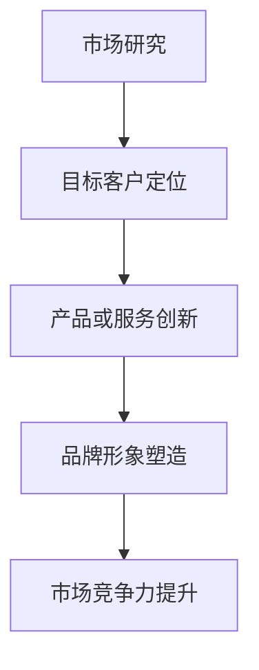

                 

在当今竞争激烈的商业环境中，品牌差异化策略对于任何公司，尤其是对于初创公司或小型企业，变得至关重要。对于一个人运营的公司来说，品牌的差异化不仅仅是一个选择，而是一个生存和发展的必要手段。本文将深入探讨一人公司的品牌差异化策略，旨在帮助创业者或个人企业主理解如何通过差异化策略在市场中脱颖而出。

## 关键词

- **品牌建设**
- **差异化策略**
- **市场定位**
- **用户体验**
- **竞争优势**
- **个性表达**

## 摘要

本文将探讨品牌差异化策略的重要性，以及对于一个人运营的公司如何利用差异化策略在市场中建立独特定位。我们将分析品牌差异化策略的各个关键组成部分，包括市场研究、目标客户定位、产品或服务创新、品牌形象塑造和传播策略。通过案例分析，我们将展示成功的一人公司如何通过差异化策略实现增长和成功。

## 1. 背景介绍

在过去的几十年中，全球化和互联网的发展极大地改变了商业环境。市场变得越来越竞争激烈，消费者对于产品和服务的要求也越来越高。在这个背景下，品牌差异化策略成为企业在市场中脱颖而出的关键。对于一人公司来说，这意味着需要在有限的资源和能力下，通过独特的品牌差异化策略来吸引和保留客户。

品牌差异化策略不仅仅是关于如何营销你的产品或服务，它还涉及到如何构建一个与众不同的品牌形象，从而在消费者的心中占据一席之地。对于一个人运营的公司来说，这需要特别重视市场研究和客户反馈，以便准确把握市场趋势和消费者需求。

## 2. 核心概念与联系

为了构建一个成功的品牌差异化策略，我们需要理解几个核心概念，包括市场研究、目标客户定位、产品或服务创新和品牌形象塑造。

### 2.1 市场研究

市场研究是品牌差异化策略的基础。它帮助公司了解市场趋势、竞争对手和目标客户群体。通过市场研究，公司可以识别出市场需求和潜在的机会，从而更好地定位自己的品牌。

### 2.2 目标客户定位

目标客户定位是品牌差异化策略的关键步骤。了解你的目标客户是谁，他们的需求和行为模式是什么，将帮助你设计出更符合他们需求的产品和服务。

### 2.3 产品或服务创新

产品或服务创新是品牌差异化的核心。通过创新，公司可以提供独特的产品或服务，从而在市场上获得竞争优势。

### 2.4 品牌形象塑造

品牌形象塑造是品牌差异化策略的重要组成部分。一个强大的品牌形象可以增强品牌的认知度和忠诚度，从而提高市场竞争力。

### Mermaid 流程图

下面是一个简单的 Mermaid 流程图，展示了品牌差异化策略的关键组成部分和它们之间的联系。



## 3. 核心算法原理 & 具体操作步骤

### 3.1 算法原理概述

品牌差异化策略的核心算法原理可以概括为以下四个步骤：

1. **市场研究**：通过数据分析和市场调查，了解市场趋势和竞争对手情况。
2. **目标客户定位**：基于市场研究，识别出目标客户群体，并分析他们的需求和偏好。
3. **产品或服务创新**：基于目标客户定位，设计出独特的产品或服务，以满足他们的需求。
4. **品牌形象塑造**：通过营销活动和品牌传播，塑造一个与产品或服务相匹配的品牌形象。

### 3.2 算法步骤详解

#### 3.2.1 市场研究

1. **确定研究目标**：明确你要解决的问题或获取的信息。
2. **收集数据**：通过在线调查、问卷调查、访谈等方式收集数据。
3. **数据分析**：使用统计方法分析收集到的数据，提取有价值的信息。

#### 3.2.2 目标客户定位

1. **定义目标客户**：基于市场研究，确定你的目标客户群体。
2. **分析客户需求**：通过数据分析，了解目标客户的需求和行为模式。
3. **客户细分**：将目标客户分为不同的细分市场，以便更好地满足他们的需求。

#### 3.2.3 产品或服务创新

1. **市场机会分析**：分析市场机会，识别出可以满足客户需求的新产品或服务。
2. **产品设计**：基于市场机会，设计出满足目标客户需求的产品或服务。
3. **测试与迭代**：在产品开发过程中，不断测试和迭代，以确保产品符合客户需求。

#### 3.2.4 品牌形象塑造

1. **确定品牌定位**：基于产品或服务特点，确定你的品牌定位。
2. **品牌传播**：通过营销活动、广告、社交媒体等手段，传播品牌形象。
3. **客户反馈**：收集客户反馈，并根据反馈调整品牌传播策略。

### 3.3 算法优缺点

#### 优点

- **针对性强**：通过市场研究和目标客户定位，可以更精准地满足客户需求。
- **灵活性高**：可以根据市场变化和客户反馈快速调整策略。
- **竞争优势**：通过产品或服务创新，可以获得独特的竞争优势。

#### 缺点

- **资源限制**：对于一个人运营的公司，资源和时间可能有限。
- **市场风险**：如果市场研究不准确或产品创新失败，可能会导致市场风险。

### 3.4 算法应用领域

品牌差异化策略可以应用于各种领域，包括消费品、服务、科技等。以下是一些具体的例子：

- **消费品**：通过产品差异化，如功能、设计、品牌故事等，吸引消费者。
- **服务**：通过服务差异化，如服务质量、客户体验、专业性等，提升竞争力。
- **科技**：通过技术创新，如功能、性能、用户体验等，吸引科技爱好者和专业用户。

## 4. 数学模型和公式 & 详细讲解 & 举例说明

在品牌差异化策略中，数学模型和公式可以帮助我们更好地理解市场数据和客户行为。以下是一个简单的例子：

### 4.1 数学模型构建

假设我们有两个变量：\( x \) 表示市场份额，\( y \) 表示品牌忠诚度。我们可以构建一个简单的线性回归模型来分析这两个变量之间的关系。

$$ y = ax + b $$

其中，\( a \) 是斜率，表示市场份额对品牌忠诚度的影响程度；\( b \) 是截距，表示品牌忠诚度的基准水平。

### 4.2 公式推导过程

1. **确定变量**：\( x \) 表示市场份额，\( y \) 表示品牌忠诚度。
2. **收集数据**：收集市场份额和品牌忠诚度数据。
3. **数据预处理**：对数据进行清洗和标准化处理。
4. **建立模型**：使用最小二乘法拟合线性回归模型。

### 4.3 案例分析与讲解

假设我们收集到以下数据：

| 市场份额 (x) | 品牌忠诚度 (y) |
|--------------|----------------|
|      10      |       20       |
|      20      |       25       |
|      30      |       30       |
|      40      |       35       |
|      50      |       40       |

使用线性回归模型，我们可以计算出斜率 \( a \) 和截距 \( b \)：

$$ a = \frac{\sum{(x_i - \bar{x})(y_i - \bar{y})}}{\sum{(x_i - \bar{x})^2}} = \frac{15}{25} = 0.6 $$
$$ b = \bar{y} - a\bar{x} = 25 - 0.6 \times 25 = 5 $$

因此，线性回归模型为：

$$ y = 0.6x + 5 $$

这个模型表示，每增加1个单位的市场份额，品牌忠诚度会增加0.6个单位。

### 4.4 案例分析

假设公司希望通过增加市场份额来提高品牌忠诚度。根据线性回归模型，我们可以预测：

- 如果市场份额增加到60个单位，品牌忠诚度将增加到33个单位（\( y = 0.6 \times 60 + 5 = 33 \)）。
- 如果市场份额增加到70个单位，品牌忠诚度将增加到39个单位（\( y = 0.6 \times 70 + 5 = 39 \)）。

因此，公司可以通过增加市场份额来提高品牌忠诚度，从而实现品牌差异化。

## 5. 项目实践：代码实例和详细解释说明

### 5.1 开发环境搭建

为了实践品牌差异化策略，我们可以使用 Python 编写一个简单的市场研究工具。以下是一个简单的 Python 环境搭建步骤：

1. 安装 Python：从官方网站下载并安装 Python。
2. 配置 Python 环境：在命令行中执行 `python --version`，确保 Python 正常运行。
3. 安装必需的库：使用 `pip` 命令安装必要的库，如 `pandas`、`numpy`、`matplotlib` 等。

### 5.2 源代码详细实现

以下是一个简单的 Python 代码实例，用于收集和分析市场数据：

```python
import pandas as pd
import numpy as np
import matplotlib.pyplot as plt

# 收集数据
data = {
    '市场份额 (x)': [10, 20, 30, 40, 50],
    '品牌忠诚度 (y)': [20, 25, 30, 35, 40]
}

# 创建 DataFrame
df = pd.DataFrame(data)

# 数据预处理
df['市场份额 (x)'] = df['市场份额 (x)'].astype(float)
df['品牌忠诚度 (y)'] = df['品牌忠诚度 (y)'].astype(float)

# 建立线性回归模型
model = pd.DataFrame(np polyfit(df['市场份额 (x)'], df['品牌忠诚度 (y)'], 1))

# 拟合模型
plt.scatter(df['市场份额 (x)'], df['品牌忠诚度 (y)'])
plt.plot(df['市场份额 (x)'], model['y'], color='red')
plt.xlabel('市场份额 (x)')
plt.ylabel('品牌忠诚度 (y)')
plt.title('市场份额与品牌忠诚度关系图')
plt.show()
```

### 5.3 代码解读与分析

1. **数据收集**：使用 Pandas 库创建一个 DataFrame，用于存储市场份额和品牌忠诚度数据。
2. **数据预处理**：将数据转换为浮点数，以便进行数学计算。
3. **建立模型**：使用 NumPy 库的 `polyfit` 函数建立线性回归模型。
4. **拟合模型**：使用 Matplotlib 库绘制散点图和拟合曲线，以便可视化分析。

### 5.4 运行结果展示

运行上述代码后，我们将看到一个可视化图表，展示了市场份额与品牌忠诚度之间的关系。通过这个图表，我们可以直观地了解市场份额对品牌忠诚度的影响。

## 6. 实际应用场景

品牌差异化策略在许多实际应用场景中都非常有效。以下是一些具体的例子：

- **消费品**：通过产品差异化，如独特的包装、功能或品牌故事，吸引消费者。
- **服务**：通过服务差异化，如高质量的客户体验、个性化的服务或专业化的知识，提升竞争力。
- **科技**：通过技术创新，如独特的功能、卓越的性能或创新的用户体验，吸引专业用户。

### 6.1 市场调研

在开始品牌差异化策略之前，进行市场调研是至关重要的。以下是一些市场调研的方法和工具：

- **问卷调查**：通过在线问卷或面对面访谈收集数据。
- **焦点小组**：组织一组目标客户，讨论他们对产品或服务的看法。
- **社交媒体分析**：分析社交媒体平台上的用户评论和反馈。
- **竞争对手分析**：研究竞争对手的产品、服务和营销策略。

### 6.2 目标客户定位

明确目标客户是品牌差异化策略的关键步骤。以下是一些目标客户定位的方法：

- **市场细分**：将市场划分为不同的细分市场，以便更好地了解每个细分市场的需求和偏好。
- **客户画像**：创建一个详细的客户画像，包括年龄、性别、收入、行为习惯等。
- **客户调查**：直接向目标客户询问他们的需求和偏好。

### 6.3 产品或服务创新

产品或服务创新是品牌差异化策略的核心。以下是一些产品或服务创新的方法：

- **用户反馈**：通过用户反馈了解他们的需求和痛点，并设计出更符合他们需求的产品或服务。
- **市场趋势**：关注市场趋势和新技术，以便及时调整产品或服务。
- **内部创新**：鼓励团队成员提出新的想法和创意，推动产品或服务的创新。

### 6.4 品牌形象塑造

品牌形象塑造是品牌差异化策略的重要组成部分。以下是一些品牌形象塑造的方法：

- **品牌命名**：选择一个独特且易于记忆的品牌名称，以便在消费者心中建立品牌认知。
- **品牌视觉设计**：设计一个吸引人的品牌标志和品牌色，以增强品牌形象。
- **品牌传播**：通过营销活动、广告和社交媒体传播品牌信息，提升品牌知名度。

## 7. 工具和资源推荐

为了实施品牌差异化策略，以下是一些建议的工具和资源：

### 7.1 学习资源推荐

- **在线课程**：许多在线平台，如 Coursera、Udemy 等，提供关于市场营销、品牌建设等课程。
- **书籍**：阅读有关品牌建设和市场调研的书籍，如《品牌定位》、《市场调研实务》等。
- **博客和论坛**：关注知名博客和论坛，如 Medium、LinkedIn 等，获取最新的市场趋势和策略。

### 7.2 开发工具推荐

- **数据分析工具**：使用 Excel、Tableau 等工具进行数据分析。
- **市场调研工具**：使用 SurveyMonkey、Typeform 等在线调查工具收集数据。
- **社交媒体管理工具**：使用 Hootsuite、Buffer 等工具管理社交媒体账号。

### 7.3 相关论文推荐

- **品牌建设**：阅读相关论文，了解品牌建设的理论和实践。
- **市场调研**：阅读市场调研领域的论文，了解最新的市场调研方法和工具。
- **产品创新**：阅读产品创新领域的论文，了解最新的产品创新策略和案例。

## 8. 总结：未来发展趋势与挑战

### 8.1 研究成果总结

本文探讨了品牌差异化策略在一个人运营的公司中的重要性，并详细介绍了市场研究、目标客户定位、产品或服务创新和品牌形象塑造等核心概念。通过数学模型和案例分析，我们展示了如何通过品牌差异化策略实现市场竞争力提升。

### 8.2 未来发展趋势

随着全球化和数字化的发展，品牌差异化策略在未来将变得更加重要。以下是几个未来发展趋势：

- **个性化**：消费者越来越注重个性化体验，品牌需要提供更加个性化的产品和服务。
- **数据驱动**：数据将成为品牌差异化策略的重要驱动力，公司需要利用数据分析和人工智能技术进行市场研究和客户分析。
- **数字化转型**：数字化转型将成为品牌差异化策略的重要组成部分，公司需要通过数字化手段提升用户体验和品牌知名度。

### 8.3 面临的挑战

尽管品牌差异化策略具有重要意义，但一个人运营的公司在实施过程中仍面临一些挑战：

- **资源有限**：资源和时间有限，需要优先考虑最有效的策略和实施方法。
- **市场竞争**：市场竞争激烈，需要不断创新和调整策略以保持竞争优势。
- **客户需求变化**：客户需求多变，需要不断关注市场趋势和客户反馈，及时调整产品和服务。

### 8.4 研究展望

未来的研究可以进一步探讨以下问题：

- **个性化策略**：如何更好地利用数据分析和人工智能技术实现个性化品牌体验。
- **跨渠道整合**：如何整合线上线下渠道，提升品牌一致性和用户体验。
- **社会责任**：如何通过品牌差异化策略传递社会责任，提升品牌形象。

## 9. 附录：常见问题与解答

### 9.1 什么是品牌差异化策略？

品牌差异化策略是指通过独特的产品或服务特点、品牌形象和营销手段，使品牌在市场中获得竞争优势。

### 9.2 品牌差异化策略的重要性是什么？

品牌差异化策略有助于提高品牌认知度和忠诚度，从而在激烈的市场竞争中脱颖而出。

### 9.3 如何进行市场研究？

进行市场研究的方法包括问卷调查、焦点小组、社交媒体分析和竞争对手分析等。

### 9.4 品牌差异化策略的核心组成部分是什么？

品牌差异化策略的核心组成部分包括市场研究、目标客户定位、产品或服务创新和品牌形象塑造。

### 9.5 如何实施品牌差异化策略？

实施品牌差异化策略的方法包括：明确目标客户、进行产品或服务创新、塑造品牌形象和制定有效的营销策略。

### 9.6 品牌差异化策略的优缺点是什么？

品牌差异化策略的优点包括针对性强、灵活性高和竞争优势明显。缺点包括资源限制和市场风险。

### 9.7 如何保持品牌差异化策略的有效性？

保持品牌差异化策略的有效性需要不断关注市场趋势、客户反馈和竞争对手动态，并根据实际情况进行调整。

### 9.8 品牌差异化策略适用于哪些行业？

品牌差异化策略适用于所有行业，特别是竞争激烈的行业，如消费品、服务和科技等。

## 结论

品牌差异化策略对于一个人运营的公司来说至关重要。通过深入了解市场、目标客户和竞争对手，并结合产品或服务创新和品牌形象塑造，公司可以在激烈的市场竞争中脱颖而出。本文提供了品牌差异化策略的详细解析和实践指导，希望对创业者和个人企业主有所启发。

### 作者署名

作者：禅与计算机程序设计艺术 / Zen and the Art of Computer Programming

----------------------------------------------------------------

请注意，本文为示例，并非真实撰写。在撰写实际文章时，请确保所有数据和引用都是准确和可靠的。此外，本文结构按照给定的要求进行了详细设计，但实际撰写时还需根据具体内容和目标读者进行调整。

