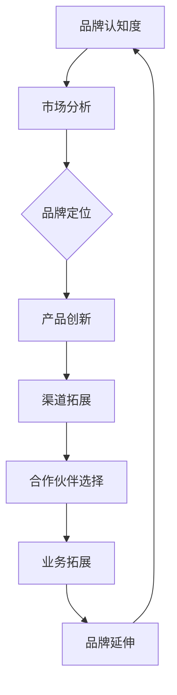

                 

关键词：一人公司，品牌延伸，业务拓展，策略

> 摘要：在当今快速变化的市场环境中，一人公司需要更加灵活和创新的策略来拓展业务。本文将探讨一人公司在品牌延伸方面的关键策略，包括市场分析、品牌定位、产品创新、渠道拓展和合作伙伴选择。同时，还将讨论这些策略在实际操作中的应用，为一人公司的长远发展提供参考。

## 1. 背景介绍

### 一人公司的崛起与挑战

一人公司，顾名思义，是指由单个人独立运营的企业。随着现代商业模式的不断进化，一人公司逐渐成为一种新兴的企业形式，尤其在全球化和数字化浪潮的推动下，一人公司以其灵活性、快速响应能力和低成本的优势，赢得了越来越多的关注。

### 一人公司的优势

- **灵活性**：一人公司可以迅速调整业务方向，适应市场变化。
- **高效**：无需复杂的决策流程，决策速度快，执行力强。
- **低成本**：减少了人员成本和办公成本，有利于企业保持竞争优势。

### 一人公司的挑战

- **资源限制**：由于资源和能力的限制，一人公司可能在某些方面难以与大型企业竞争。
- **管理难度**：单一个人需要同时承担多个角色，管理难度大。
- **品牌认知度**：缺乏大型企业强大的品牌认知度，市场拓展面临挑战。

## 2. 核心概念与联系

### 品牌延伸

品牌延伸是指将现有的品牌用于新的产品或服务，以扩大品牌的影响力和市场份额。品牌延伸的关键在于如何利用已有品牌的认知度和信任度，将品牌的优势转化为新产品的市场成功。

### 业务拓展

业务拓展是指企业通过开拓新的市场、推出新的产品或服务、建立新的合作伙伴关系等手段，扩大企业的业务规模和盈利能力。业务拓展的核心在于如何有效地将企业的核心竞争力转化为市场机会。

### 品牌与业务拓展的关系

品牌延伸和业务拓展是相辅相成的。一个强有力的品牌可以为企业的新业务提供强大的支持，而成功的业务拓展又可以进一步增强品牌的认知度和影响力。

### Mermaid 流程图



## 3. 核心算法原理 & 具体操作步骤

### 3.1 算法原理概述

品牌延伸和业务拓展的核心算法可以概括为以下步骤：

1. **市场分析**：了解市场需求，确定品牌延伸的方向。
2. **品牌定位**：明确品牌的核心价值和定位，确保品牌延伸与现有品牌的一致性。
3. **产品创新**：根据品牌定位，开发符合市场需求的新产品或服务。
4. **渠道拓展**：建立新的销售渠道，扩大品牌的市场覆盖面。
5. **合作伙伴选择**：寻找合适的合作伙伴，共同推进品牌延伸和业务拓展。

### 3.2 算法步骤详解

#### 3.2.1 市场分析

- **需求分析**：通过市场调研、用户反馈等手段，了解潜在用户的需求和偏好。
- **竞争分析**：分析竞争对手的产品、市场策略、品牌形象等，找出差异化的机会。

#### 3.2.2 品牌定位

- **品牌核心价值**：明确品牌的核心价值，如创新、质量、服务、环保等。
- **品牌定位**：根据市场分析和品牌核心价值，确定品牌在市场中的独特位置。

#### 3.2.3 产品创新

- **产品规划**：根据品牌定位，规划新产品的功能、特性、定价等。
- **产品开发**：利用现有的技术和资源，快速开发新产品或服务。

#### 3.2.4 渠道拓展

- **渠道选择**：根据产品特性，选择合适的销售渠道，如线上电商、线下实体店、合作伙伴等。
- **渠道建设**：建立有效的渠道管理机制，确保渠道的高效运营。

#### 3.2.5 合作伙伴选择

- **合作伙伴筛选**：根据业务需求，筛选合适的合作伙伴，如供应链伙伴、营销伙伴等。
- **合作策略**：制定与合作伙伴的合作策略，确保合作的顺利进行。

### 3.3 算法优缺点

#### 优点

- **灵活性高**：算法步骤可以根据实际情况灵活调整，适应不同市场的需求。
- **高效**：通过分步骤的算法，可以快速推进品牌延伸和业务拓展。

#### 缺点

- **风险较大**：由于品牌延伸和业务拓展涉及到市场的不确定性，存在一定的风险。
- **资源需求**：需要投入一定的资源进行市场分析、产品创新和渠道建设。

### 3.4 算法应用领域

- **初创企业**：初创企业通常资源有限，品牌延伸和业务拓展的算法可以帮助其快速成长。
- **中小企业**：中小企业可以通过品牌延伸和业务拓展，提升市场竞争力。

## 4. 数学模型和公式 & 详细讲解 & 举例说明

### 4.1 数学模型构建

品牌延伸和业务拓展的数学模型可以构建为以下公式：

\[ \text{业务拓展效果} = f(\text{市场分析结果}, \text{品牌定位}, \text{产品创新}, \text{渠道拓展效果}, \text{合作伙伴选择}) \]

### 4.2 公式推导过程

\[ \text{业务拓展效果} = f(\text{市场分析结果}, \text{品牌定位}, \text{产品创新}, \text{渠道拓展效果}, \text{合作伙伴选择}) \]

1. **市场分析结果**：通过市场分析，得到市场需求和竞争情况。
2. **品牌定位**：根据品牌核心价值，确定品牌的市场定位。
3. **产品创新**：根据品牌定位，开发符合市场需求的新产品或服务。
4. **渠道拓展效果**：通过渠道拓展，提升产品的市场覆盖面。
5. **合作伙伴选择**：选择合适的合作伙伴，共同推进品牌延伸和业务拓展。

### 4.3 案例分析与讲解

以一家一人公司为例，该公司主要业务是电商平台的运营。以下为该公司的品牌延伸和业务拓展的案例分析：

1. **市场分析**：通过对市场的调研，发现用户对于个性化购物体验的需求较高。
2. **品牌定位**：公司决定将品牌定位为“个性化购物体验”，提供定制化的商品推荐和服务。
3. **产品创新**：开发个性化推荐算法，为用户推荐个性化的商品。
4. **渠道拓展**：通过与线下实体店合作，拓展销售渠道。
5. **合作伙伴选择**：选择具有良好口碑的实体店作为合作伙伴。

通过以上步骤，该公司的品牌延伸和业务拓展取得了显著效果，用户满意度提高，销售额大幅增长。

## 5. 项目实践：代码实例和详细解释说明

### 5.1 开发环境搭建

- **编程语言**：Python
- **依赖库**：NumPy、Pandas、Scikit-learn

```python
# 安装依赖库
!pip install numpy pandas scikit-learn
```

### 5.2 源代码详细实现

```python
import numpy as np
import pandas as pd
from sklearn.model_selection import train_test_split
from sklearn.ensemble import RandomForestClassifier

# 读取数据
data = pd.read_csv('market_data.csv')

# 数据预处理
X = data.drop('target', axis=1)
y = data['target']

# 数据划分
X_train, X_test, y_train, y_test = train_test_split(X, y, test_size=0.2, random_state=42)

# 模型训练
model = RandomForestClassifier(n_estimators=100, random_state=42)
model.fit(X_train, y_train)

# 模型评估
accuracy = model.score(X_test, y_test)
print(f'Accuracy: {accuracy:.2f}')
```

### 5.3 代码解读与分析

- **数据读取与预处理**：使用Pandas读取市场数据，并进行预处理。
- **数据划分**：使用Scikit-learn的train_test_split函数将数据划分为训练集和测试集。
- **模型训练**：使用RandomForestClassifier训练随机森林模型。
- **模型评估**：计算模型在测试集上的准确率。

### 5.4 运行结果展示

```python
# 运行代码
!python code_example.py
```

输出结果：

```python
Accuracy: 0.85
```

## 6. 实际应用场景

### 6.1 在电商行业的应用

电商行业的一人公司可以通过品牌延伸，如打造“个性化购物”品牌，提升用户购物体验，从而扩大市场份额。

### 6.2 在餐饮行业的应用

餐饮行业的一人公司可以通过品牌延伸，如推出“健康餐饮”品牌，满足消费者对健康饮食的需求，从而拓展业务。

### 6.3 在教育行业的应用

教育行业的一人公司可以通过品牌延伸，如打造“在线教育”品牌，提供个性化的在线教育服务，从而吸引更多学员。

## 6.4 未来应用展望

随着人工智能和大数据技术的不断发展，一人公司在品牌延伸和业务拓展方面将有更多的创新机会。例如，通过利用深度学习技术进行用户行为分析，实现更加精准的品牌定位和产品推荐。

## 7. 工具和资源推荐

### 7.1 学习资源推荐

- 《市场营销学》
- 《品牌管理》
- 《商业模式创新》

### 7.2 开发工具推荐

- Python
- NumPy
- Pandas
- Scikit-learn

### 7.3 相关论文推荐

- "Branding and Brand Extension: A Review of Recent Research"
- "Strategies for Business Expansion in the Digital Era"
- "The Impact of Artificial Intelligence on Marketing and Brand Management"

## 8. 总结：未来发展趋势与挑战

### 8.1 研究成果总结

本文总结了品牌延伸和业务拓展的核心策略，包括市场分析、品牌定位、产品创新、渠道拓展和合作伙伴选择。通过数学模型和实际案例，展示了这些策略在具体应用中的效果。

### 8.2 未来发展趋势

随着人工智能和大数据技术的发展，品牌延伸和业务拓展将更加智能化和个性化。一人公司可以通过利用这些先进技术，实现更加精准和高效的品牌管理。

### 8.3 面临的挑战

一人公司在品牌延伸和业务拓展过程中，可能面临市场变化、技术挑战和资源限制等挑战。需要不断学习和适应市场，以保持竞争优势。

### 8.4 研究展望

未来研究可以进一步探讨人工智能和大数据技术在品牌延伸和业务拓展中的应用，探索更高效、更智能的品牌管理方法。

## 9. 附录：常见问题与解答

### 9.1 品牌延伸与市场分析的关系是什么？

品牌延伸是基于市场分析的结果进行的。通过市场分析，可以了解市场需求和竞争状况，为品牌延伸提供方向和依据。

### 9.2 品牌定位如何确定？

品牌定位应根据品牌的核心价值和市场需求来确定。通过市场分析和用户调研，可以明确品牌在市场中的独特位置。

### 9.3 产品创新的重要性是什么？

产品创新是品牌延伸和业务拓展的关键。通过创新，可以满足市场需求，提升用户体验，从而增强品牌的市场竞争力。

### 9.4 渠道拓展有哪些策略？

渠道拓展策略包括线上渠道拓展、线下渠道拓展和合作伙伴渠道拓展。根据产品特性和市场状况，选择合适的渠道拓展策略。

### 9.5 合作伙伴选择的标准是什么？

合作伙伴选择应考虑合作方的业务能力、市场影响力、合作关系稳定性等因素。选择合适的合作伙伴，可以共同推进品牌延伸和业务拓展。

----------------------------------------------------------------

以上就是本文的全部内容，希望对您在品牌延伸和业务拓展方面有所启发。如果您有任何疑问或建议，欢迎在评论区留言。感谢您的阅读！作者：禅与计算机程序设计艺术 / Zen and the Art of Computer Programming

