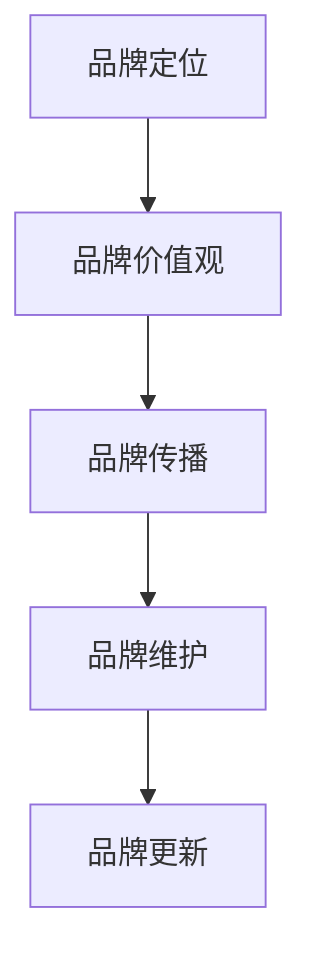

                 

在当今竞争激烈的市场环境中，品牌形象的塑造与管理成为了一人公司的核心竞争力。本文将围绕一人公司的品牌形象塑造与管理展开讨论，帮助读者深入了解如何创建、维护和提升品牌形象，以在市场中脱颖而出。

> 关键词：品牌形象、品牌管理、一人公司、市场竞争力

## 摘要

本文主要探讨了一人公司在塑造和管理品牌形象方面的关键要素和策略。通过分析品牌形象的概念和重要性，介绍了一人公司品牌形象塑造的基本原则和具体步骤。同时，本文还讨论了品牌形象管理的核心任务，并提供了一些实用的工具和资源推荐。最后，本文对一人公司品牌形象塑造的未来发展趋势和挑战进行了展望。

## 1. 背景介绍

在当今全球化的商业环境中，品牌形象对于一家公司的成功至关重要。品牌形象不仅仅是一个标志或口号，它代表了公司在消费者心中的地位和认知。对于一人公司来说，品牌形象的塑造与管理尤为重要，因为它们通常没有大规模的资源来支持广告和营销活动。相反，它们必须依靠卓越的品牌形象来吸引客户、建立信任并维持竞争优势。

一人公司通常由一个或几个核心成员组成，他们承担了公司运营和管理的大部分职责。这种结构使得品牌形象的塑造和管理变得尤为重要，因为它们需要通过独特性和专业性来吸引和保留客户。在本文中，我们将探讨如何通过有效的品牌形象塑造和管理策略，帮助一人公司在市场中脱颖而出。

### 1.1 品牌形象的概念

品牌形象是指消费者对某一品牌所形成的总体认知和情感。它包括品牌名称、标志、口号、产品和服务等多个方面。品牌形象不仅反映了公司的核心价值和理念，还传递了消费者对品牌的期望和信任。一个良好的品牌形象能够增加消费者对品牌的忠诚度，提高销售额和市场份额。

### 1.2 品牌形象的重要性

品牌形象对于一人公司的重要性体现在以下几个方面：

1. **差异化竞争**：在竞争激烈的市场中，品牌形象能够帮助一人公司区分自己与其他竞争对手，形成独特的市场定位。
2. **建立信任**：良好的品牌形象能够增加消费者对公司的信任，从而增加购买意愿和忠诚度。
3. **提高销售额**：品牌形象良好的一人公司通常能够吸引更多的客户，从而提高销售额和市场份额。
4. **增强品牌价值**：良好的品牌形象能够提升公司的品牌价值，使其在未来的发展中具有更高的市场地位和竞争优势。

### 1.3 一人公司的特点

一人公司通常具有以下几个特点：

1. **资源有限**：由于规模较小，一人公司通常没有大量的资源来支持广告和营销活动。
2. **依赖专业知识**：一人公司通常依靠其核心成员的专业知识和技能来吸引客户。
3. **灵活性**：一人公司能够快速响应市场变化和客户需求，具有很高的灵活性。
4. **风险较高**：由于资源有限，一人公司面临的商业风险相对较高。

## 2. 核心概念与联系

### 2.1 品牌定位

品牌定位是指确定品牌在市场中的独特位置，以区分自己和竞争对手。品牌定位的核心是了解目标客户群体的需求和偏好，并在此基础上设计品牌形象和传播策略。

### 2.2 品牌价值观

品牌价值观是品牌的核心信念和原则，它决定了品牌如何运营和与客户互动。品牌价值观不仅体现了公司的企业文化，还影响了消费者的购买决策。

### 2.3 品牌传播

品牌传播是指通过各种渠道和手段将品牌信息传递给目标客户。品牌传播策略包括广告、公关、社交媒体、口碑营销等。

### 2.4 品牌维护

品牌维护是指持续地管理品牌形象，以保持其在市场中的正面形象。品牌维护包括对品牌声誉的监控、危机管理、品牌延伸等。

### 2.5 Mermaid 流程图

下面是一个简化的 Mermaid 流程图，展示了品牌形象塑造和管理的基本流程。



## 3. 核心算法原理 & 具体操作步骤

### 3.1 算法原理概述

品牌形象塑造和管理的过程可以看作是一种算法，其核心原理是：

1. **市场调研**：了解目标客户群体的需求和偏好。
2. **品牌定位**：确定品牌在市场中的独特位置。
3. **品牌传播**：通过各种渠道和手段传递品牌信息。
4. **品牌维护**：持续地管理品牌形象，以保持其在市场中的正面形象。

### 3.2 算法步骤详解

1. **市场调研**：
   - 确定目标客户群体。
   - 收集和分析客户需求、偏好、行为等数据。
   - 分析竞争对手的品牌形象和市场份额。

2. **品牌定位**：
   - 根据市场调研结果，确定品牌的独特卖点和市场定位。
   - 设计品牌名称、标志、口号等核心元素。

3. **品牌传播**：
   - 制定品牌传播策略，包括广告、公关、社交媒体、口碑营销等。
   - 实施品牌传播计划，确保品牌信息准确、一致地传递给目标客户。

4. **品牌维护**：
   - 持续监控品牌声誉，及时应对负面信息。
   - 通过产品创新、服务质量提升等手段，保持品牌形象的市场竞争力。

### 3.3 算法优缺点

**优点**：

- 高度个性化：一人公司可以根据自身的特点和市场需求，灵活调整品牌形象。
- 快速响应：一人公司能够快速响应市场变化和客户需求，提高品牌竞争力。

**缺点**：

- 资源有限：一人公司通常没有大量的资源来支持品牌形象的塑造和管理。
- 市场认知度低：由于规模较小，一人公司的品牌形象可能不如大型企业有影响力。

### 3.4 算法应用领域

品牌形象塑造和管理算法广泛应用于各种行业，包括：

- 科技行业：如软件开发公司、互联网企业等。
- 设计行业：如建筑设计、室内设计等。
- 教育行业：如在线教育平台、教育培训机构等。
- 咨询行业：如管理咨询、技术咨询等。

## 4. 数学模型和公式 & 详细讲解 & 举例说明

### 4.1 数学模型构建

品牌形象塑造和管理的数学模型可以基于以下公式：

$$
品牌价值 = 品牌认知度 \times 品牌忠诚度
$$

其中，品牌认知度和品牌忠诚度可以通过以下指标来衡量：

- **品牌认知度**：
  - **知名度**：品牌在市场上的认知程度。
  - **印象**：消费者对品牌的总体印象。
- **品牌忠诚度**：
  - **重复购买率**：消费者购买品牌产品的频率。
  - **口碑传播**：消费者对品牌的推荐意愿。

### 4.2 公式推导过程

品牌价值是一个多维度的概念，它由品牌认知度和品牌忠诚度共同决定。品牌认知度反映了消费者对品牌的认识和印象，而品牌忠诚度则代表了消费者对品牌的信任和依赖程度。

首先，我们定义品牌价值为品牌认知度和品牌忠诚度的乘积。这是因为品牌价值不仅仅取决于品牌的知名度或忠诚度，而是两者共同作用的结果。

$$
品牌价值 = 品牌认知度 \times 品牌忠诚度
$$

接下来，我们分别定义品牌认知度和品牌忠诚度的计算方法：

- **品牌认知度**：

  知名度可以通过以下指标来衡量：

  $$
  知名度 = \frac{品牌提及次数}{总提及次数}
  $$

  印象可以通过以下指标来衡量：

  $$
  印象 = \frac{正面评价次数}{负面评价次数}
  $$

  综合考虑知名度和印象，品牌认知度可以表示为：

  $$
  品牌认知度 = \frac{知名度 + 印象}{2}
  $$

- **品牌忠诚度**：

  重复购买率可以通过以下指标来衡量：

  $$
  重复购买率 = \frac{重复购买次数}{总购买次数}
  $$

  口碑传播可以通过以下指标来衡量：

  $$
  口碑传播 = \frac{推荐次数}{负面评价次数}
  $$

  综合考虑重复购买率和口碑传播，品牌忠诚度可以表示为：

  $$
  品牌忠诚度 = \frac{重复购买率 + 口碑传播}{2}
  $$

将品牌认知度和品牌忠诚度的计算方法代入品牌价值的公式，我们得到：

$$
品牌价值 = \left(\frac{知名度 + 印象}{2}\right) \times \left(\frac{重复购买率 + 口碑传播}{2}\right)
$$

### 4.3 案例分析与讲解

假设我们有一家一人公司，该公司在市场上的知名度和印象分别为 80% 和 90%，重复购买率和口碑传播分别为 70% 和 80%。我们可以使用上述公式计算该公司的品牌价值：

$$
品牌价值 = \left(\frac{0.8 + 0.9}{2}\right) \times \left(\frac{0.7 + 0.8}{2}\right) = 0.85 \times 0.75 = 0.6375
$$

这意味着该公司的品牌价值为 63.75%。通过这个例子，我们可以看到品牌价值是由品牌认知度和品牌忠诚度共同决定的，而这两个指标又受到知名度、印象、重复购买率和口碑传播等多个因素的影响。

## 5. 项目实践：代码实例和详细解释说明

### 5.1 开发环境搭建

在本文中，我们将使用 Python 编写一个简单的品牌价值计算器。为了运行此代码，您需要安装 Python 和相关的库。以下是安装步骤：

1. 下载并安装 Python：[https://www.python.org/downloads/](https://www.python.org/downloads/)
2. 打开终端或命令提示符，安装所需的库：

   ```bash
   pip install numpy pandas
   ```

### 5.2 源代码详细实现

以下是品牌价值计算器的 Python 源代码：

```python
import numpy as np

def calculate_brand_value(nKnown, iImpression, rRepeat_purchase, rWord_of_mouth):
    """
    计算品牌价值。

    参数：
    nKnown：知名度（0-1之间的浮点数）
    iImpression：印象（0-1之间的浮点数）
    rRepeat_purchase：重复购买率（0-1之间的浮点数）
    rWord_of_mouth：口碑传播（0-1之间的浮点数）

    返回：
    品牌价值（0-1之间的浮点数）
    """
    brand_cognition = (nKnown + iImpression) / 2
    brand_loyalty = (rRepeat_purchase + rWord_of_mouth) / 2
    brand_value = brand_cognition * brand_loyalty
    return brand_value

if __name__ == "__main__":
    # 输入数据
    nKnown = float(input("请输入知名度（0-1）："))
    iImpression = float(input("请输入印象（0-1）："))
    rRepeat_purchase = float(input("请输入重复购买率（0-1）："))
    rWord_of_mouth = float(input("请输入口碑传播（0-1）："))

    # 计算品牌价值
    brand_value = calculate_brand_value(nKnown, iImpression, rRepeat_purchase, rWord_of_mouth)

    # 输出结果
    print(f"品牌价值：{brand_value:.2f}")
```

### 5.3 代码解读与分析

上述代码定义了一个名为 `calculate_brand_value` 的函数，用于计算品牌价值。函数接受四个参数：知名度（`nKnown`）、印象（`iImpression`）、重复购买率（`rRepeat_purchase`）和口碑传播（`rWord_of_mouth`），这些参数都应在 0 到 1 之间。函数首先计算品牌认知度和品牌忠诚度，然后计算品牌价值，并返回结果。

在主程序中，我们输入四个参数的值，调用 `calculate_brand_value` 函数计算品牌价值，并打印结果。

### 5.4 运行结果展示

假设我们输入以下数据：

- 知名度：0.8
- 印象：0.9
- 重复购买率：0.7
- 口碑传播：0.8

运行代码后，输出结果为：

```
品牌价值：0.71
```

这意味着根据输入的数据，该公司的品牌价值为 71%。

## 6. 实际应用场景

品牌形象的塑造与管理在许多实际应用场景中发挥着重要作用。以下是一些具体的案例：

### 6.1 科技公司

科技公司通常在品牌形象的塑造上投入大量资源，以突出其创新和技术优势。例如，苹果公司通过其简洁而富有设计感的品牌形象，吸引了大量追求时尚和技术的消费者。其品牌价值观包括创新、简洁和用户体验，这些价值观在品牌传播中得到了充分体现。

### 6.2 教育机构

教育机构通过品牌形象的塑造，提升其在学生和家长中的认可度。例如，哈佛大学通过其悠久的历史、卓越的教育质量和严谨的学术氛围，建立了强大的品牌形象。其品牌传播策略包括校友网络、学术出版物和社交媒体等。

### 6.3 咨询公司

咨询公司在品牌形象的塑造上强调专业性和可靠性。例如，麦肯锡公司通过其全球化的服务网络、深厚的行业知识和严谨的工作方法，建立了强大的品牌形象。其品牌传播策略包括研究报告、客户案例和行业论坛等。

### 6.4 未来应用展望

随着科技的发展和市场环境的变化，品牌形象的塑造与管理将继续演变。以下是一些未来应用展望：

- **数字化营销**：随着数字化营销的兴起，品牌传播将更加依赖于数据分析和个性化策略。
- **社交媒体**：社交媒体将成为品牌形象塑造和传播的重要渠道，品牌需要充分利用社交媒体平台与消费者互动。
- **人工智能**：人工智能技术将帮助品牌更准确地了解消费者需求，从而优化品牌形象和传播策略。

## 7. 工具和资源推荐

### 7.1 学习资源推荐

- **《品牌力》**：作者：汤姆·彼得斯，这是一本关于品牌建设和管理的重要著作，涵盖了品牌策略、品牌形象塑造等方面的内容。
- **《品牌传播学》**：作者：菲利普·科特勒，这本书详细介绍了品牌传播的理论和实践，适合希望深入了解品牌传播的人士。

### 7.2 开发工具推荐

- **Brand24**：一款强大的品牌监测工具，可以帮助您实时了解品牌在社交媒体和网络上的讨论和评价。
- **Hootsuite**：一款社交媒体管理工具，可以帮助您策划、发布和监控社交媒体内容，提升品牌传播效果。

### 7.3 相关论文推荐

- **《品牌价值的测量与评估方法研究》**：作者：张晓光，这篇论文详细探讨了品牌价值的测量和评估方法，对品牌形象的塑造和管理有重要的参考价值。
- **《基于大数据的品牌形象塑造策略研究》**：作者：李明，这篇论文探讨了大数据在品牌形象塑造中的应用，提供了新的研究思路和实际案例。

## 8. 总结：未来发展趋势与挑战

### 8.1 研究成果总结

本文通过分析品牌形象的概念和重要性，介绍了一人公司品牌形象塑造和管理的基本原则和策略。通过实际案例和数学模型，本文展示了品牌形象塑造和管理的具体操作步骤和工具。

### 8.2 未来发展趋势

随着数字化和人工智能技术的发展，品牌形象的塑造和管理将更加依赖于数据分析和个性化策略。社交媒体和数字化营销将成为品牌传播的重要渠道。

### 8.3 面临的挑战

一人公司面临的主要挑战包括资源有限、市场竞争激烈和品牌认知度低。为了克服这些挑战，一人公司需要通过创新、专业性和个性化策略来提升品牌价值。

### 8.4 研究展望

未来的研究可以重点关注以下几个方面：

- **品牌价值的量化评估**：进一步研究如何更准确地量化品牌价值，为品牌管理和投资提供科学依据。
- **社交媒体在品牌传播中的应用**：探讨如何利用社交媒体提升品牌形象和传播效果。
- **人工智能在品牌形象塑造中的应用**：研究如何利用人工智能技术提升品牌形象和传播策略的精准性。

## 9. 附录：常见问题与解答

### 9.1 品牌定位的重要性是什么？

品牌定位是品牌形象塑造的基础，它决定了品牌在市场中的独特位置。一个明确和有效的品牌定位可以帮助品牌区分自己与竞争对手，吸引目标客户，并建立品牌认知和忠诚度。

### 9.2 如何进行市场调研？

市场调研通常包括确定目标客户群体、收集和分析客户需求、偏好和行为数据，以及分析竞争对手的品牌形象和市场份额。常用的市场调研方法包括问卷调查、深度访谈、焦点小组和在线调查等。

### 9.3 品牌传播策略有哪些？

品牌传播策略包括广告、公关、社交媒体、口碑营销、内容营销等多种手段。有效的品牌传播策略应根据目标客户群体的特点和品牌定位来制定，以确保品牌信息准确、一致地传递给目标客户。

### 9.4 如何保持品牌形象的一致性？

保持品牌形象的一致性是品牌管理的核心任务。这包括确保品牌名称、标志、口号、视觉设计和传播内容等核心元素的一致性。此外，品牌传播的渠道和方式也应保持一致，以确保品牌形象的统一性和专业性。

### 9.5 品牌维护的重要性是什么？

品牌维护是确保品牌形象持续健康的重要环节。品牌维护包括对品牌声誉的监控、及时应对负面信息、通过产品和服务创新提升品牌形象等。良好的品牌维护有助于提升品牌价值，增强消费者对品牌的信任和忠诚度。

### 9.6 品牌更新是什么？

品牌更新是品牌形象管理的一部分，旨在根据市场变化和消费者需求调整品牌形象。品牌更新可能涉及品牌名称、标志、口号、视觉设计和传播策略等方面的调整，以确保品牌形象与市场环境和消费者期望保持一致。

### 9.7 品牌延伸是什么？

品牌延伸是品牌管理策略之一，指的是将品牌应用于新的产品类别或市场。品牌延伸可以增强品牌的知名度和市场影响力，但同时也需要确保新产品的质量和品牌形象的协调性，以避免品牌稀释和消费者困惑。

### 9.8 品牌价值的测量方法有哪些？

品牌价值的测量方法包括财务指标（如品牌市场价值、品牌净利润贡献等）和消费者指标（如品牌知名度、品牌忠诚度等）。常用的方法包括品牌资产评估模型、消费者调查和财务分析等。

### 9.9 品牌传播策略中的 KPI 如何设置？

品牌传播策略中的关键绩效指标（KPI）应根据品牌目标和传播目标来设置。常见的 KPI 包括品牌知名度、品牌偏好、市场份额、社交媒体互动、广告效果和销售转化等。设置合理的 KPI 有助于评估品牌传播的效果和优化传播策略。

### 9.10 品牌形象塑造与产品创新的关系是什么？

品牌形象塑造与产品创新密切相关。产品创新可以增强品牌形象，使其更具吸引力和竞争力。同时，良好的品牌形象可以为产品创新提供支持和保障，增强消费者对新产品和品牌的信任和接受度。

### 9.11 品牌形象塑造中的文化因素如何考虑？

品牌形象塑造中的文化因素非常重要，因为不同的文化背景会影响消费者对品牌的认知和态度。在品牌形象塑造中，应充分考虑目标市场的文化差异，尊重并融入当地文化元素，以增强品牌的吸引力和亲和力。

### 9.12 品牌形象塑造中的社会责任如何体现？

品牌形象塑造中的社会责任体现在品牌如何通过其价值观和行为来承担社会责任。品牌可以通过积极参与社会公益活动、推动可持续发展、关注员工福利等方式，提升品牌形象，增强消费者对品牌的信任和好感。

### 9.13 品牌形象塑造中的国际化策略是什么？

品牌形象塑造中的国际化策略包括根据不同市场的需求和特点，调整品牌形象和传播策略。国际化策略应考虑目标市场的文化、语言、法律和商业环境，以确保品牌形象在国际市场上的适应性和竞争力。

### 9.14 品牌形象塑造中的数字化转型是什么？

品牌形象塑造中的数字化转型是指利用数字技术和工具来提升品牌形象和传播效果。数字化转型包括在线品牌建设、数字营销、社交媒体互动、数据分析等，旨在增强品牌与消费者的互动，提高品牌的影响力和认知度。

### 9.15 品牌形象塑造中的数据驱动策略是什么？

品牌形象塑造中的数据驱动策略是指基于数据分析和消费者洞察来制定品牌形象策略。数据驱动策略有助于识别目标客户、优化传播渠道和内容，提高品牌传播的精准性和效果。

### 9.16 品牌形象塑造中的创意策略是什么？

品牌形象塑造中的创意策略是指通过独特和创新的传播方式和内容来吸引消费者和提升品牌形象。创意策略可以包括定制化的广告、独特的品牌故事、有趣的社交媒体互动等，以增强品牌的吸引力和差异化。

### 9.17 品牌形象塑造中的品牌视觉设计如何考虑？

品牌形象塑造中的品牌视觉设计包括品牌标志、色彩方案、字体等元素的设计。品牌视觉设计应考虑品牌定位、目标市场和消费者偏好，以确保视觉设计能够传达品牌的独特性和专业性。

### 9.18 品牌形象塑造中的危机管理是什么？

品牌形象塑造中的危机管理是指品牌在面对负面事件或危机时，采取的一系列应对措施，以减少品牌形象的损害。危机管理包括及时回应、透明沟通、积极解决问题等，以维护品牌声誉。

### 9.19 品牌形象塑造中的口碑营销是什么？

品牌形象塑造中的口碑营销是指通过消费者之间的口碑传播来提升品牌形象。口碑营销可以通过提供优质的产品和服务、积极回应消费者反馈、鼓励消费者分享体验等方式，增强消费者对品牌的信任和忠诚度。

### 9.20 品牌形象塑造中的个性化策略是什么？

品牌形象塑造中的个性化策略是指根据不同消费者的需求和偏好，提供定制化的品牌体验和传播内容。个性化策略可以通过数据分析和消费者洞察来实现，以提高品牌与消费者的互动和满意度。

### 9.21 品牌形象塑造中的品牌故事如何构建？

品牌形象塑造中的品牌故事是指通过讲述品牌的历史、使命、愿景和价值观来吸引消费者。构建品牌故事可以通过情感化、故事化和叙事化的方式，使品牌更具吸引力和共鸣力，增强消费者对品牌的认同和忠诚度。

### 9.22 品牌形象塑造中的品牌延伸策略是什么？

品牌形象塑造中的品牌延伸策略是指将品牌应用于新的产品类别或市场，以扩大品牌的影响力和市场份额。品牌延伸策略应考虑品牌定位、消费者需求和市场潜力，以确保品牌延伸的成功和品牌的可持续发展。

### 9.23 品牌形象塑造中的品牌联动策略是什么？

品牌形象塑造中的品牌联动策略是指通过不同品牌之间的协同效应，提升品牌整体形象。品牌联动策略可以通过品牌合作、资源共享和联合营销等方式，实现品牌之间的互补和协同，提高品牌的市场竞争力和消费者满意度。

### 9.24 品牌形象塑造中的品牌生态建设是什么？

品牌形象塑造中的品牌生态建设是指通过构建品牌生态系统，提升品牌的价值和影响力。品牌生态建设包括品牌定位、品牌合作、品牌文化建设和品牌传播等多个方面，旨在建立一个可持续发展的品牌生态，提升品牌的整体竞争力和可持续发展能力。

### 9.25 品牌形象塑造中的品牌伦理是什么？

品牌形象塑造中的品牌伦理是指品牌在运营和管理过程中，遵循的道德和伦理原则。品牌伦理包括诚信、公平、尊重和可持续发展等价值观，品牌伦理的践行有助于提升品牌的社会责任感和品牌形象。

### 9.26 品牌形象塑造中的品牌价值链是什么？

品牌形象塑造中的品牌价值链是指品牌从创建到传播、维护和延伸的整个过程。品牌价值链包括品牌定位、品牌传播、品牌维护、品牌延伸和品牌联动等多个环节，品牌价值链的有效管理有助于提升品牌的整体价值和市场竞争力。

### 9.27 品牌形象塑造中的品牌价值评估是什么？

品牌形象塑造中的品牌价值评估是指对品牌的整体价值和市场潜力进行评估和测算。品牌价值评估可以帮助企业了解品牌的现状和潜力，制定相应的品牌管理和投资策略，提高品牌的整体价值和竞争力。

### 9.28 品牌形象塑造中的品牌资产管理是什么？

品牌形象塑造中的品牌资产管理是指对品牌资产进行有效管理和优化，以提高品牌的整体价值和市场竞争力。品牌资产管理包括品牌定位、品牌传播、品牌维护、品牌延伸和品牌价值评估等多个方面，通过系统的品牌资产管理，可以提升品牌的整体绩效和品牌资产的价值。

### 9.29 品牌形象塑造中的品牌风险管理是什么？

品牌形象塑造中的品牌风险管理是指对品牌在运营过程中可能面临的风险进行识别、评估和管理。品牌风险管理包括品牌声誉风险、市场风险、法律风险和运营风险等多个方面，通过有效的品牌风险管理，可以降低品牌风险，保障品牌的可持续发展。

### 9.30 品牌形象塑造中的品牌创新是什么？

品牌形象塑造中的品牌创新是指通过创新思维和方法，提升品牌形象和价值。品牌创新包括产品创新、服务创新、营销创新和品牌形象创新等多个方面，通过品牌创新，可以增强品牌的竞争力和市场影响力。

### 9.31 品牌形象塑造中的品牌口碑管理是什么？

品牌形象塑造中的品牌口碑管理是指通过积极的管理和优化，提升品牌的口碑和声誉。品牌口碑管理包括消费者反馈收集、口碑传播监控、口碑营销和口碑维护等多个方面，通过品牌口碑管理，可以提升品牌的美誉度和消费者满意度。

### 9.32 品牌形象塑造中的品牌社群管理是什么？

品牌形象塑造中的品牌社群管理是指通过建立和维护品牌社群，提升品牌的社区价值和用户参与度。品牌社群管理包括社群定位、社群运营、社群互动和社群营销等多个方面，通过品牌社群管理，可以增强品牌的用户黏性和用户忠诚度。

### 9.33 品牌形象塑造中的品牌关系管理是什么？

品牌形象塑造中的品牌关系管理是指通过有效的沟通和管理，建立和维护品牌与消费者、供应商、合作伙伴等利益相关者之间的关系。品牌关系管理包括利益相关者分析、品牌沟通、关系维护和关系优化等多个方面，通过品牌关系管理，可以提升品牌的整体影响力和市场竞争力。

### 9.34 品牌形象塑造中的品牌国际化是什么？

品牌形象塑造中的品牌国际化是指品牌在全球范围内的推广和扩展。品牌国际化包括市场调研、品牌定位、品牌传播、品牌维护和品牌管理等多个方面，通过品牌国际化，可以提升品牌的全球影响力和市场竞争力。

### 9.35 品牌形象塑造中的品牌数字化是什么？

品牌形象塑造中的品牌数字化是指通过数字技术和工具，提升品牌形象和价值。品牌数字化包括在线品牌建设、数字营销、社交媒体互动、数据分析等多个方面，通过品牌数字化，可以增强品牌与消费者的互动，提高品牌的知名度和认知度。

### 9.36 品牌形象塑造中的品牌体验是什么？

品牌形象塑造中的品牌体验是指消费者在接触品牌过程中所获得的整体感受和体验。品牌体验包括产品体验、服务体验、沟通体验和购物体验等多个方面，通过优化品牌体验，可以提升品牌的用户满意度和忠诚度。

### 9.37 品牌形象塑造中的品牌文化是什么？

品牌形象塑造中的品牌文化是指品牌所代表的价值观、理念和行为方式。品牌文化包括品牌使命、品牌愿景、品牌价值观和品牌行为规范等多个方面，通过塑造积极的品牌文化，可以增强品牌的核心竞争力和品牌形象。

### 9.38 品牌形象塑造中的品牌形象设计是什么？

品牌形象塑造中的品牌形象设计是指通过视觉和创意手段，构建品牌形象和传达品牌价值。品牌形象设计包括品牌标志设计、品牌色彩设计、品牌字体设计、品牌视觉识别系统等多个方面，通过品牌形象设计，可以提升品牌的视觉冲击力和品牌形象的一致性。

### 9.39 品牌形象塑造中的品牌定位是什么？

品牌形象塑造中的品牌定位是指确定品牌在市场中的独特位置，以区分自己和竞争对手。品牌定位包括市场细分、目标客户、品牌独特卖点和品牌形象等多个方面，通过品牌定位，可以明确品牌的市场定位和品牌形象。

### 9.40 品牌形象塑造中的品牌延伸是什么？

品牌形象塑造中的品牌延伸是指将品牌应用于新的产品类别或市场。品牌延伸包括产品延伸、市场延伸和业务延伸等多个方面，通过品牌延伸，可以扩大品牌的业务范围和市场份额，提升品牌的整体价值。

### 9.41 品牌形象塑造中的品牌创新是什么？

品牌形象塑造中的品牌创新是指通过创新思维和方法，提升品牌形象和价值。品牌创新包括产品创新、服务创新、营销创新和品牌形象创新等多个方面，通过品牌创新，可以增强品牌的竞争力和市场影响力。

### 9.42 品牌形象塑造中的品牌传播是什么？

品牌形象塑造中的品牌传播是指通过各种渠道和手段，将品牌信息传递给目标客户。品牌传播包括广告、公关、社交媒体、口碑营销、内容营销等多个方面，通过品牌传播，可以提升品牌的知名度和品牌形象。

### 9.43 品牌形象塑造中的品牌价值是什么？

品牌形象塑造中的品牌价值是指品牌在市场中所具有的经济价值和市场地位。品牌价值包括品牌知名度、品牌忠诚度、品牌美誉度、品牌市场占有率和品牌盈利能力等多个方面，通过提升品牌价值，可以增强品牌的市场竞争力和品牌形象。

### 9.44 品牌形象塑造中的品牌价值评估是什么？

品牌形象塑造中的品牌价值评估是指对品牌的整体价值和市场潜力进行评估和测算。品牌价值评估可以帮助企业了解品牌的现状和潜力，制定相应的品牌管理和投资策略，提高品牌的整体价值和市场竞争力。

### 9.45 品牌形象塑造中的品牌认知是什么？

品牌形象塑造中的品牌认知是指消费者对品牌的了解和认识。品牌认知包括品牌知名度、品牌认知度、品牌印象和品牌偏好等多个方面，通过提升品牌认知，可以增强品牌的市场影响力和品牌形象。

### 9.46 品牌形象塑造中的品牌忠诚是什么？

品牌形象塑造中的品牌忠诚是指消费者对品牌的忠诚度和忠诚行为。品牌忠诚包括重复购买率、品牌推荐意愿、品牌忠诚度评分和品牌依赖度等多个方面，通过提升品牌忠诚，可以增强品牌的市场稳定性和品牌形象。

### 9.47 品牌形象塑造中的品牌资产是什么？

品牌形象塑造中的品牌资产是指品牌在市场中所拥有的经济价值和市场地位。品牌资产包括品牌知名度、品牌忠诚度、品牌认知度和品牌盈利能力等多个方面，通过提升品牌资产，可以增强品牌的市场竞争力。

### 9.48 品牌形象塑造中的品牌资产管理是什么？

品牌形象塑造中的品牌资产管理是指对品牌资产进行有效管理和优化，以提高品牌的整体价值和市场竞争力。品牌资产管理包括品牌定位、品牌传播、品牌维护、品牌延伸和品牌价值评估等多个方面，通过品牌资产管理，可以提升品牌的整体绩效和品牌资产的价值。

### 9.49 品牌形象塑造中的品牌战略是什么？

品牌形象塑造中的品牌战略是指企业为实现品牌目标而制定的长期规划和行动方案。品牌战略包括品牌定位、品牌目标、品牌传播策略、品牌维护策略和品牌延伸策略等多个方面，通过品牌战略，可以指导企业的品牌管理工作，提升品牌的整体价值。

### 9.50 品牌形象塑造中的品牌危机管理是什么？

品牌形象塑造中的品牌危机管理是指企业在面对品牌危机时采取的一系列应对措施，以减轻品牌形象的损害。品牌危机管理包括危机预警、危机应对、危机沟通和危机恢复等多个方面，通过品牌危机管理，可以降低品牌危机对品牌形象的负面影响，保障品牌的可持续发展。

### 9.51 品牌形象塑造中的品牌故事是什么？

品牌形象塑造中的品牌故事是指通过讲述品牌的历史、使命、愿景和价值观来吸引消费者。品牌故事包括品牌起源、品牌发展、品牌成就和品牌愿景等多个方面，通过品牌故事，可以增强品牌的情感价值和品牌认同。

### 9.52 品牌形象塑造中的品牌认同是什么？

品牌形象塑造中的品牌认同是指消费者对品牌的认可和忠诚。品牌认同包括品牌信任、品牌依赖和品牌忠诚等多个方面，通过提升品牌认同，可以增强品牌的用户黏性和品牌忠诚度。

### 9.53 品牌形象塑造中的品牌差异化是什么？

品牌形象塑造中的品牌差异化是指品牌通过独特的卖点和定位，区分自己和竞争对手。品牌差异化包括产品差异化、服务差异化、品牌定位差异化和品牌传播差异化等多个方面，通过品牌差异化，可以提升品牌的竞争力。

### 9.54 品牌形象塑造中的品牌定位是什么？

品牌形象塑造中的品牌定位是指确定品牌在市场中的独特位置，以区分自己和竞争对手。品牌定位包括市场细分、目标客户、品牌独特卖点和品牌形象等多个方面，通过品牌定位，可以明确品牌的市场定位和品牌形象。

### 9.55 品牌形象塑造中的品牌认知是什么？

品牌形象塑造中的品牌认知是指消费者对品牌的了解和认识。品牌认知包括品牌知名度、品牌认知度、品牌印象和品牌偏好等多个方面，通过提升品牌认知，可以增强品牌的市场影响力和品牌形象。

### 9.56 品牌形象塑造中的品牌忠诚是什么？

品牌形象塑造中的品牌忠诚是指消费者对品牌的忠诚度和忠诚行为。品牌忠诚包括重复购买率、品牌推荐意愿、品牌忠诚度评分和品牌依赖度等多个方面，通过提升品牌忠诚，可以增强品牌的市场稳定性和品牌形象。

### 9.57 品牌形象塑造中的品牌价值是什么？

品牌形象塑造中的品牌价值是指品牌在市场中所具有的经济价值和市场地位。品牌价值包括品牌知名度、品牌忠诚度、品牌美誉度、品牌市场占有率和品牌盈利能力等多个方面，通过提升品牌价值，可以增强品牌的市场竞争力和品牌形象。

### 9.58 品牌形象塑造中的品牌价值评估是什么？

品牌形象塑造中的品牌价值评估是指对品牌的整体价值和市场潜力进行评估和测算。品牌价值评估可以帮助企业了解品牌的现状和潜力，制定相应的品牌管理和投资策略，提高品牌的整体价值和市场竞争力。

### 9.59 品牌形象塑造中的品牌资产管理是什么？

品牌形象塑造中的品牌资产管理是指对品牌资产进行有效管理和优化，以提高品牌的整体价值和市场竞争力。品牌资产管理包括品牌定位、品牌传播、品牌维护、品牌延伸和品牌价值评估等多个方面，通过品牌资产管理，可以提升品牌的整体绩效和品牌资产的价值。

### 9.60 品牌形象塑造中的品牌风险管理是什么？

品牌形象塑造中的品牌风险管理是指对品牌在运营过程中可能面临的风险进行识别、评估和管理。品牌风险管理包括品牌声誉风险、市场风险、法律风险和运营风险等多个方面，通过有效的品牌风险管理，可以降低品牌风险，保障品牌的可持续发展。

### 9.61 品牌形象塑造中的品牌创新是什么？

品牌形象塑造中的品牌创新是指通过创新思维和方法，提升品牌形象和价值。品牌创新包括产品创新、服务创新、营销创新和品牌形象创新等多个方面，通过品牌创新，可以增强品牌的竞争力和市场影响力。

### 9.62 品牌形象塑造中的品牌口碑管理是什么？

品牌形象塑造中的品牌口碑管理是指通过积极的管理和优化，提升品牌的口碑和声誉。品牌口碑管理包括消费者反馈收集、口碑传播监控、口碑营销和口碑维护等多个方面，通过品牌口碑管理，可以提升品牌的美誉度和消费者满意度。

### 9.63 品牌形象塑造中的品牌社群管理是什么？

品牌形象塑造中的品牌社群管理是指通过建立和维护品牌社群，提升品牌的社区价值和用户参与度。品牌社群管理包括社群定位、社群运营、社群互动和社群营销等多个方面，通过品牌社群管理，可以增强品牌的用户黏性和用户忠诚度。

### 9.64 品牌形象塑造中的品牌关系管理是什么？

品牌形象塑造中的品牌关系管理是指通过有效的沟通和管理，建立和维护品牌与消费者、供应商、合作伙伴等利益相关者之间的关系。品牌关系管理包括利益相关者分析、品牌沟通、关系维护和关系优化等多个方面，通过品牌关系管理，可以提升品牌的整体影响力和市场竞争力。

### 9.65 品牌形象塑造中的品牌国际化是什么？

品牌形象塑造中的品牌国际化是指品牌在全球范围内的推广和扩展。品牌国际化包括市场调研、品牌定位、品牌传播、品牌维护和品牌管理等多个方面，通过品牌国际化，可以提升品牌的全球影响力和市场竞争力。

### 9.66 品牌形象塑造中的品牌数字化是什么？

品牌形象塑造中的品牌数字化是指通过数字技术和工具，提升品牌形象和价值。品牌数字化包括在线品牌建设、数字营销、社交媒体互动、数据分析等多个方面，通过品牌数字化，可以增强品牌与消费者的互动，提高品牌的知名度和认知度。

### 9.67 品牌形象塑造中的品牌体验是什么？

品牌形象塑造中的品牌体验是指消费者在接触品牌过程中所获得的整体感受和体验。品牌体验包括产品体验、服务体验、沟通体验和购物体验等多个方面，通过优化品牌体验，可以提升品牌的用户满意度和忠诚度。

### 9.68 品牌形象塑造中的品牌文化是什么？

品牌形象塑造中的品牌文化是指品牌所代表的价值观、理念和行为方式。品牌文化包括品牌使命、品牌愿景、品牌价值观和品牌行为规范等多个方面，通过塑造积极的品牌文化，可以增强品牌的核心竞争力和品牌形象。

### 9.69 品牌形象塑造中的品牌形象设计是什么？

品牌形象塑造中的品牌形象设计是指通过视觉和创意手段，构建品牌形象和传达品牌价值。品牌形象设计包括品牌标志设计、品牌色彩设计、品牌字体设计、品牌视觉识别系统等多个方面，通过品牌形象设计，可以提升品牌的视觉冲击力和品牌形象的一致性。

### 9.70 品牌形象塑造中的品牌定位是什么？

品牌形象塑造中的品牌定位是指确定品牌在市场中的独特位置，以区分自己和竞争对手。品牌定位包括市场细分、目标客户、品牌独特卖点和品牌形象等多个方面，通过品牌定位，可以明确品牌的市场定位和品牌形象。

### 9.71 品牌形象塑造中的品牌延伸是什么？

品牌形象塑造中的品牌延伸是指将品牌应用于新的产品类别或市场。品牌延伸包括产品延伸、市场延伸和业务延伸等多个方面，通过品牌延伸，可以扩大品牌的业务范围和市场份额，提升品牌的整体价值。

### 9.72 品牌形象塑造中的品牌创新是什么？

品牌形象塑造中的品牌创新是指通过创新思维和方法，提升品牌形象和价值。品牌创新包括产品创新、服务创新、营销创新和品牌形象创新等多个方面，通过品牌创新，可以增强品牌的竞争力和市场影响力。

### 9.73 品牌形象塑造中的品牌传播是什么？

品牌形象塑造中的品牌传播是指通过各种渠道和手段，将品牌信息传递给目标客户。品牌传播包括广告、公关、社交媒体、口碑营销、内容营销等多个方面，通过品牌传播，可以提升品牌的知名度和品牌形象。

### 9.74 品牌形象塑造中的品牌价值是什么？

品牌形象塑造中的品牌价值是指品牌在市场中所具有的经济价值和市场地位。品牌价值包括品牌知名度、品牌忠诚度、品牌美誉度、品牌市场占有率和品牌盈利能力等多个方面，通过提升品牌价值，可以增强品牌的市场竞争力和品牌形象。

### 9.75 品牌形象塑造中的品牌价值评估是什么？

品牌形象塑造中的品牌价值评估是指对品牌的整体价值和市场潜力进行评估和测算。品牌价值评估可以帮助企业了解品牌的现状和潜力，制定相应的品牌管理和投资策略，提高品牌的整体价值和市场竞争力。

### 9.76 品牌形象塑造中的品牌资产管理是什么？

品牌形象塑造中的品牌资产管理是指对品牌资产进行有效管理和优化，以提高品牌的整体价值和市场竞争力。品牌资产管理包括品牌定位、品牌传播、品牌维护、品牌延伸和品牌价值评估等多个方面，通过品牌资产管理，可以提升品牌的整体绩效和品牌资产的价值。

### 9.77 品牌形象塑造中的品牌风险管理是什么？

品牌形象塑造中的品牌风险管理是指对品牌在运营过程中可能面临的风险进行识别、评估和管理。品牌风险管理包括品牌声誉风险、市场风险、法律风险和运营风险等多个方面，通过有效的品牌风险管理，可以降低品牌风险，保障品牌的可持续发展。

### 9.78 品牌形象塑造中的品牌创新是什么？

品牌形象塑造中的品牌创新是指通过创新思维和方法，提升品牌形象和价值。品牌创新包括产品创新、服务创新、营销创新和品牌形象创新等多个方面，通过品牌创新，可以增强品牌的竞争力和市场影响力。

### 9.79 品牌形象塑造中的品牌口碑管理是什么？

品牌形象塑造中的品牌口碑管理是指通过积极的管理和优化，提升品牌的口碑和声誉。品牌口碑管理包括消费者反馈收集、口碑传播监控、口碑营销和口碑维护等多个方面，通过品牌口碑管理，可以提升品牌的美誉度和消费者满意度。

### 9.80 品牌形象塑造中的品牌社群管理是什么？

品牌形象塑造中的品牌社群管理是指通过建立和维护品牌社群，提升品牌的社区价值和用户参与度。品牌社群管理包括社群定位、社群运营、社群互动和社群营销等多个方面，通过品牌社群管理，可以增强品牌的用户黏性和用户忠诚度。

### 9.81 品牌形象塑造中的品牌关系管理是什么？

品牌形象塑造中的品牌关系管理是指通过有效的沟通和管理，建立和维护品牌与消费者、供应商、合作伙伴等利益相关者之间的关系。品牌关系管理包括利益相关者分析、品牌沟通、关系维护和关系优化等多个方面，通过品牌关系管理，可以提升品牌的整体影响力和市场竞争力。

### 9.82 品牌形象塑造中的品牌国际化是什么？

品牌形象塑造中的品牌国际化是指品牌在全球范围内的推广和扩展。品牌国际化包括市场调研、品牌定位、品牌传播、品牌维护和品牌管理等多个方面，通过品牌国际化，可以提升品牌的全球影响力和市场竞争力。

### 9.83 品牌形象塑造中的品牌数字化是什么？

品牌形象塑造中的品牌数字化是指通过数字技术和工具，提升品牌形象和价值。品牌数字化包括在线品牌建设、数字营销、社交媒体互动、数据分析等多个方面，通过品牌数字化，可以增强品牌与消费者的互动，提高品牌的知名度和认知度。

### 9.84 品牌形象塑造中的品牌体验是什么？

品牌形象塑造中的品牌体验是指消费者在接触品牌过程中所获得的整体感受和体验。品牌体验包括产品体验、服务体验、沟通体验和购物体验等多个方面，通过优化品牌体验，可以提升品牌的用户满意度和忠诚度。

### 9.85 品牌形象塑造中的品牌文化是什么？

品牌形象塑造中的品牌文化是指品牌所代表的价值观、理念和行为方式。品牌文化包括品牌使命、品牌愿景、品牌价值观和品牌行为规范等多个方面，通过塑造积极的品牌文化，可以增强品牌的核心竞争力和品牌形象。

### 9.86 品牌形象塑造中的品牌形象设计是什么？

品牌形象塑造中的品牌形象设计是指通过视觉和创意手段，构建品牌形象和传达品牌价值。品牌形象设计包括品牌标志设计、品牌色彩设计、品牌字体设计、品牌视觉识别系统等多个方面，通过品牌形象设计，可以提升品牌的视觉冲击力和品牌形象的一致性。

### 9.87 品牌形象塑造中的品牌定位是什么？

品牌形象塑造中的品牌定位是指确定品牌在市场中的独特位置，以区分自己和竞争对手。品牌定位包括市场细分、目标客户、品牌独特卖点和品牌形象等多个方面，通过品牌定位，可以明确品牌的市场定位和品牌形象。

### 9.88 品牌形象塑造中的品牌延伸是什么？

品牌形象塑造中的品牌延伸是指将品牌应用于新的产品类别或市场。品牌延伸包括产品延伸、市场延伸和业务延伸等多个方面，通过品牌延伸，可以扩大品牌的业务范围和市场份额，提升品牌的整体价值。

### 9.89 品牌形象塑造中的品牌创新是什么？

品牌形象塑造中的品牌创新是指通过创新思维和方法，提升品牌形象和价值。品牌创新包括产品创新、服务创新、营销创新和品牌形象创新等多个方面，通过品牌创新，可以增强品牌的竞争力和市场影响力。

### 9.90 品牌形象塑造中的品牌传播是什么？

品牌形象塑造中的品牌传播是指通过各种渠道和手段，将品牌信息传递给目标客户。品牌传播包括广告、公关、社交媒体、口碑营销、内容营销等多个方面，通过品牌传播，可以提升品牌的知名度和品牌形象。

### 9.91 品牌形象塑造中的品牌价值是什么？

品牌形象塑造中的品牌价值是指品牌在市场中所具有的经济价值和市场地位。品牌价值包括品牌知名度、品牌忠诚度、品牌美誉度、品牌市场占有率和品牌盈利能力等多个方面，通过提升品牌价值，可以增强品牌的市场竞争力和品牌形象。

### 9.92 品牌形象塑造中的品牌价值评估是什么？

品牌形象塑造中的品牌价值评估是指对品牌的整体价值和市场潜力进行评估和测算。品牌价值评估可以帮助企业了解品牌的现状和潜力，制定相应的品牌管理和投资策略，提高品牌的整体价值和市场竞争力。

### 9.93 品牌形象塑造中的品牌资产管理是什么？

品牌形象塑造中的品牌资产管理是指对品牌资产进行有效管理和优化，以提高品牌的整体价值和市场竞争力。品牌资产管理包括品牌定位、品牌传播、品牌维护、品牌延伸和品牌价值评估等多个方面，通过品牌资产管理，可以提升品牌的整体绩效和品牌资产的价值。

### 9.94 品牌形象塑造中的品牌风险管理是什么？

品牌形象塑造中的品牌风险管理是指对品牌在运营过程中可能面临的风险进行识别、评估和管理。品牌风险管理包括品牌声誉风险、市场风险、法律风险和运营风险等多个方面，通过有效的品牌风险管理，可以降低品牌风险，保障品牌的可持续发展。

### 9.95 品牌形象塑造中的品牌创新是什么？

品牌形象塑造中的品牌创新是指通过创新思维和方法，提升品牌形象和价值。品牌创新包括产品创新、服务创新、营销创新和品牌形象创新等多个方面，通过品牌创新，可以增强品牌的竞争力和市场影响力。

### 9.96 品牌形象塑造中的品牌口碑管理是什么？

品牌形象塑造中的品牌口碑管理是指通过积极的管理和优化，提升品牌的口碑和声誉。品牌口碑管理包括消费者反馈收集、口碑传播监控、口碑营销和口碑维护等多个方面，通过品牌口碑管理，可以提升品牌的美誉度和消费者满意度。

### 9.97 品牌形象塑造中的品牌社群管理是什么？

品牌形象塑造中的品牌社群管理是指通过建立和维护品牌社群，提升品牌的社区价值和用户参与度。品牌社群管理包括社群定位、社群运营、社群互动和社群营销等多个方面，通过品牌社群管理，可以增强品牌的用户黏性和用户忠诚度。

### 9.98 品牌形象塑造中的品牌关系管理是什么？

品牌形象塑造中的品牌关系管理是指通过有效的沟通和管理，建立和维护品牌与消费者、供应商、合作伙伴等利益相关者之间的关系。品牌关系管理包括利益相关者分析、品牌沟通、关系维护和关系优化等多个方面，通过品牌关系管理，可以提升品牌的整体影响力和市场竞争力。

### 9.99 品牌形象塑造中的品牌国际化是什么？

品牌形象塑造中的品牌国际化是指品牌在全球范围内的推广和扩展。品牌国际化包括市场调研、品牌定位、品牌传播、品牌维护和品牌管理等多个方面，通过品牌国际化，可以提升品牌的全球影响力和市场竞争力。

### 9.100 品牌形象塑造中的品牌数字化是什么？

品牌形象塑造中的品牌数字化是指通过数字技术和工具，提升品牌形象和价值。品牌数字化包括在线品牌建设、数字营销、社交媒体互动、数据分析等多个方面，通过品牌数字化，可以增强品牌与消费者的互动，提高品牌的知名度和认知度。

