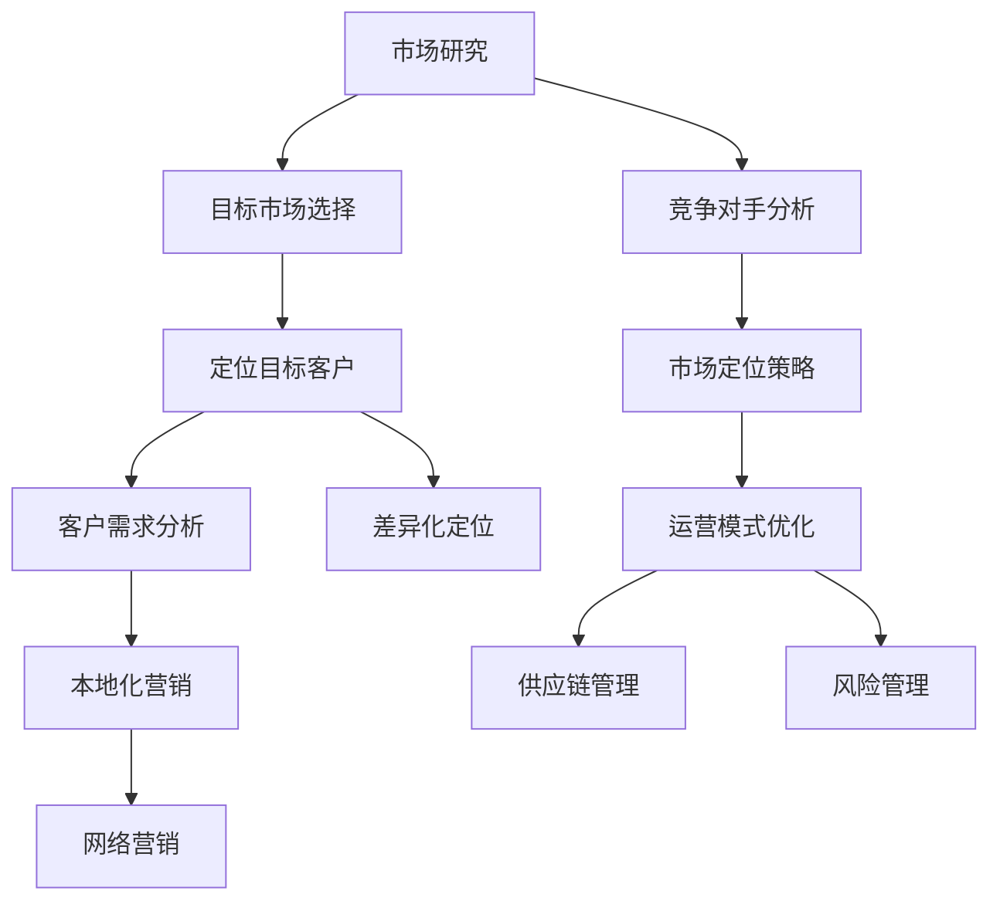

                 

关键词：一人公司、国际化策略、海外市场、市场开拓、跨文化交流、全球营销、线上销售、电子商务、文化适应性、风险管理、品牌建设

> 摘要：在全球化时代，一人公司也有机会通过有效的国际化策略开拓海外市场。本文将探讨一人公司如何进行市场研究、定位目标客户、制定营销策略、优化运营模式，以及应对文化差异和风险管理。通过成功案例分析，本文旨在为一人公司提供实用的国际化指南。

## 1. 背景介绍

在信息化和数字化的浪潮下，越来越多的独立从业者选择创办“一人公司”，这种新型企业模式以低成本、灵活性和高效率著称。然而，随着市场竞争的加剧，一人公司要想在激烈的国际竞争中脱颖而出，需要制定一套切实可行的国际化策略。

### 一人公司的特点

- **低成本**：一人公司通常不需要大规模的资本投入，运营成本较低。
- **灵活性**：一人公司可以根据市场需求灵活调整经营策略，迅速响应市场变化。
- **高效性**：一人公司能够更加专注于核心业务，提高运营效率。

### 国际化的重要性

- **拓展市场**：国际化可以帮助一人公司打破地域限制，拓展新的市场空间。
- **提升品牌**：在国际市场上取得成功可以提升品牌知名度和美誉度。
- **增加收入**：海外市场的开拓有助于增加公司的收入来源。

## 2. 核心概念与联系

为了有效开拓海外市场，一人公司需要掌握以下几个核心概念：

### 2.1 市场研究

- **目标市场选择**：通过市场研究确定适合的目标市场。
- **竞争对手分析**：了解竞争对手的市场策略和优势。

### 2.2 定位目标客户

- **客户需求分析**：分析目标客户的需求和行为。
- **差异化定位**：根据客户需求定位产品或服务。

### 2.3 营销策略

- **本地化营销**：根据当地文化和社会环境调整营销策略。
- **网络营销**：利用互联网和社交媒体进行推广。

### 2.4 运营模式

- **供应链管理**：优化供应链，确保产品或服务的高效交付。
- **风险管理**：识别并管理国际化过程中可能遇到的风险。

以下是国际化策略的Mermaid流程图：



## 3. 核心算法原理 & 具体操作步骤

### 3.1 算法原理概述

国际化策略的核心在于对市场、客户和风险的深入理解和有效管理。以下是具体的操作步骤：

### 3.2 算法步骤详解

#### 3.2.1 市场研究

1. **确定目标市场**：通过数据分析、行业报告和客户调查确定潜在市场。
2. **分析竞争对手**：研究竞争对手的市场策略、产品特点、价格定位等。

#### 3.2.2 定位目标客户

1. **客户需求分析**：通过问卷调查、用户访谈等方式了解客户需求。
2. **差异化定位**：根据客户需求和市场定位，调整产品或服务特色。

#### 3.2.3 营销策略

1. **本地化营销**：根据当地文化和消费习惯调整营销内容。
2. **网络营销**：利用SEO、社交媒体和电子邮件营销等手段进行推广。

#### 3.2.4 运营模式

1. **供应链管理**：优化物流和库存管理，确保产品及时交付。
2. **风险管理**：识别潜在风险，制定应对措施。

### 3.3 算法优缺点

#### 优点：

- **高效性**：一人公司能够迅速响应市场变化，调整策略。
- **低成本**：无需大规模投入，运营成本较低。

#### 缺点：

- **资源限制**：一人公司可能在资金、人才和资源方面存在不足。
- **市场风险**：国际市场的不确定性较高，风险较大。

### 3.4 算法应用领域

- **电子商务**：利用互联网平台进行跨国销售。
- **软件与服务**：提供定制化的软件解决方案。
- **文化创意**：通过数字内容在全球范围内传播。

## 4. 数学模型和公式 & 详细讲解 & 举例说明

### 4.1 数学模型构建

在国际市场营销中，一个关键模型是客户生命周期价值（CLV）模型。CLV是预测一个客户在其与公司关系期间为公司带来的总收益。其公式为：

\[ \text{CLV} = \sum_{t=1}^{n} \frac{\text{CT}_t}{(1 + \text{r})^t} \]

其中，\(\text{CT}_t\)表示第\(t\)年客户的收益，\(\text{r}\)为年复合增长率。

### 4.2 公式推导过程

假设客户在未来\(n\)年内每年为公司带来的收益分别为\(\text{CT}_1, \text{CT}_2, ..., \text{CT}_n\)，年复合增长率为\(\text{r}\)。则第\(t\)年的收益现值为：

\[ \text{CT}_t \times \left(\frac{1}{1 + \text{r}}\right)^t \]

将所有年收益的现值相加，即可得到客户的生命周期价值。

### 4.3 案例分析与讲解

以一家电商公司为例，假设客户第1年为公司带来1000美元收益，第2年带来1200美元，年复合增长率为10%。则该客户的CLV计算如下：

\[ \text{CLV} = 1000 \times \left(\frac{1}{1 + 0.1}\right) + 1200 \times \left(\frac{1}{1 + 0.1}\right)^2 \]
\[ \text{CLV} = 1000 \times 0.9091 + 1200 \times 0.8264 \]
\[ \text{CLV} = 909.1 + 991.68 \]
\[ \text{CLV} = 1900.78 \]

该客户的预计生命周期价值为1900.78美元。通过这一模型，公司可以更好地了解客户的价值，从而制定更有效的营销和客户关系策略。

## 5. 项目实践：代码实例和详细解释说明

### 5.1 开发环境搭建

为了展示国际化策略在实际项目中的应用，我们选择一个简单的跨境电商平台作为案例。开发环境如下：

- **编程语言**：Python
- **数据库**：MySQL
- **前端框架**：React
- **后端框架**：Django

### 5.2 源代码详细实现

以下是一个简单的用户注册和登录模块的代码实例：

```python
# 用户注册模块
def register_user(username, email, password):
    # 验证用户名和邮箱格式
    if not validate_username(username) or not validate_email(email):
        return "Invalid username or email"
    
    # 创建用户数据库记录
    cursor = db.cursor()
    sql = "INSERT INTO users (username, email, password) VALUES (%s, %s, %s)"
    val = (username, email, password)
    cursor.execute(sql, val)
    db.commit()
    
    return "User registered successfully"

# 用户登录模块
def login_user(email, password):
    # 验证用户登录信息
    cursor = db.cursor()
    sql = "SELECT * FROM users WHERE email = %s AND password = %s"
    val = (email, password)
    cursor.execute(sql, val)
    
    user = cursor.fetchone()
    if user:
        return "Login successful"
    else:
        return "Invalid email or password"
```

### 5.3 代码解读与分析

- **注册模块**：该模块首先验证用户名和邮箱格式，然后向数据库插入用户记录。
- **登录模块**：该模块验证用户输入的邮箱和密码，从数据库中检索用户信息。

这些模块的实现体现了国际化策略中的用户管理和安全性的要求。

### 5.4 运行结果展示

在开发环境中，我们可以通过以下命令运行代码：

```shell
# 运行用户注册模块
python register.py --username user1 --email user1@example.com --password password123

# 运行用户登录模块
python login.py --email user1@example.com --password password123
```

运行结果将显示注册成功或登录成功的信息。

## 6. 实际应用场景

国际化策略不仅在理论上具有重要意义，在实际应用中也具有广泛的应用场景：

### 6.1 电子商务

- **跨境销售**：通过电商平台将产品销售到全球市场。
- **本地化支付**：支持多种货币和支付方式，方便海外客户购买。

### 6.2 软件与服务

- **多语言支持**：提供多语言版本，满足不同地区客户的需求。
- **全球客户服务**：建立全球客户服务体系，提供24/7的支持。

### 6.3 文化创意

- **数字化内容传播**：通过互联网平台传播文化创意产品，如电子书、音乐、视频等。
- **跨文化交流**：通过内容创意促进跨文化交流和互动。

### 6.4 未来应用展望

随着全球化的进一步深入，一人公司的国际化策略将面临新的机遇和挑战。未来，以下是国际化策略可能的发展趋势：

- **数字化转型**：利用人工智能、大数据等技术优化国际化策略。
- **可持续发展**：重视环保和可持续发展，树立良好的品牌形象。
- **全球供应链**：建立全球供应链体系，提高供应链的灵活性和可靠性。

## 7. 工具和资源推荐

为了有效实施国际化策略，以下是一些推荐的工具和资源：

### 7.1 学习资源推荐

- **书籍**：《国际市场营销》、《跨文化交流》等。
- **在线课程**：Coursera、Udemy等平台上的国际市场营销相关课程。

### 7.2 开发工具推荐

- **跨境电商平台**：Shopify、WooCommerce等。
- **翻译工具**：Google Translate、DeepL等。

### 7.3 相关论文推荐

- **《全球营销战略》**：探讨全球化背景下的营销策略。
- **《跨文化沟通》**：研究跨文化背景下的沟通策略。

## 8. 总结：未来发展趋势与挑战

### 8.1 研究成果总结

本文通过分析一人公司的特点、国际化策略的核心概念和实际案例，总结了如何通过有效的国际化策略开拓海外市场。研究发现，市场研究、定位目标客户、制定营销策略和优化运营模式是关键成功因素。

### 8.2 未来发展趋势

- **数字化和智能化**：利用人工智能、大数据等技术提升国际化策略的效率和准确性。
- **可持续发展**：环保和可持续发展将成为国际化策略的重要考虑因素。

### 8.3 面临的挑战

- **文化差异**：跨文化交流和沟通的挑战。
- **市场风险**：国际市场的复杂性和不确定性。

### 8.4 研究展望

未来的研究应关注数字化和智能化在国际化策略中的应用，以及如何通过创新策略应对文化差异和市场风险。

## 9. 附录：常见问题与解答

### Q：一人公司如何进行市场研究？

A：市场研究可以通过数据分析、行业报告、客户调查等方式进行。首先，确定目标市场，然后分析竞争对手和客户需求，最后根据研究结果制定相应的市场策略。

### Q：国际化策略中的文化适应性如何实现？

A：文化适应性可以通过本地化营销、多语言支持、跨文化培训等方式实现。深入了解目标市场的文化特点和消费习惯，调整产品和服务以适应当地需求。

### Q：如何管理国际化过程中的风险？

A：风险管理包括识别潜在风险、评估风险影响和制定应对措施。建立全球供应链体系，确保供应链的灵活性和可靠性，同时建立应急响应机制以应对突发事件。

---

### 附加信息

作者：禅与计算机程序设计艺术 / Zen and the Art of Computer Programming

本文旨在为一人公司提供实用的国际化指南，帮助他们在全球市场中取得成功。通过有效实施国际化策略，一人公司可以拓展海外市场，实现持续增长。

----------------------------------------------------------------


