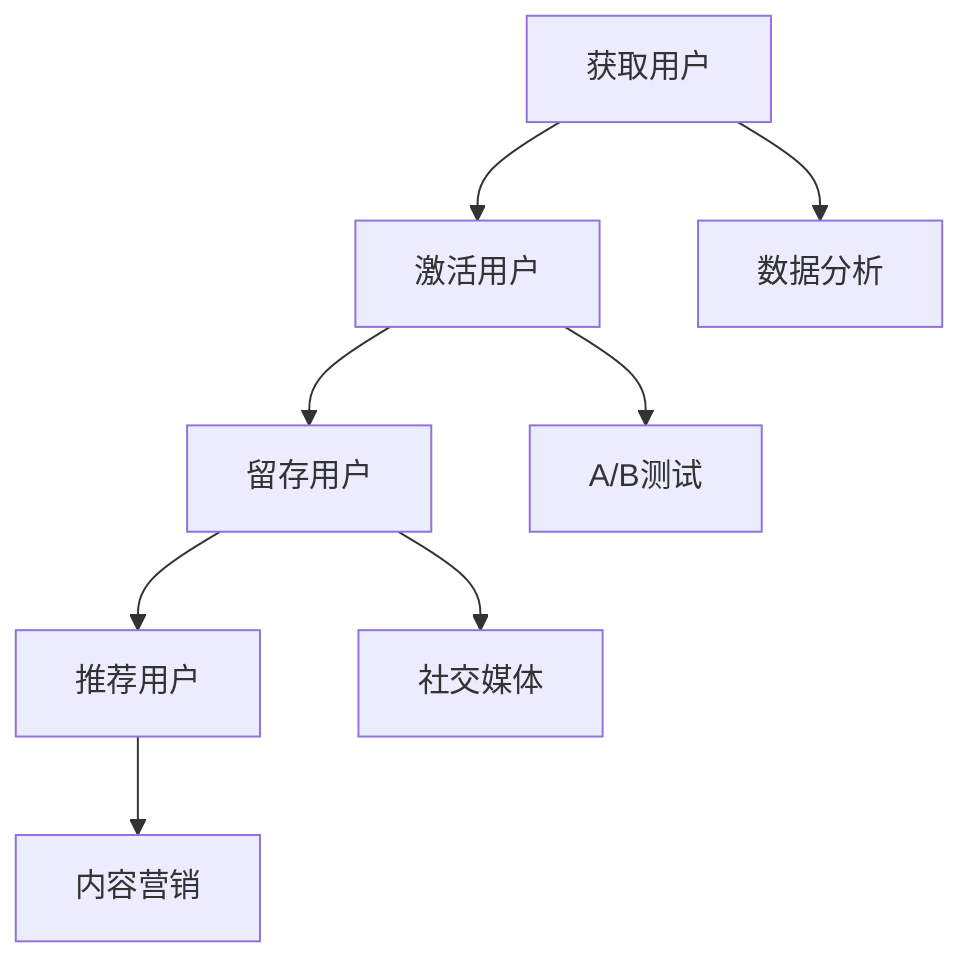

                 

关键词：一人公司、增长黑客、低成本、高效益、创新营销方法、技术语言、专业

> 摘要：本文旨在为一人公司的创始人提供一系列低成本高效益的创新营销方法，帮助他们在竞争激烈的市场中脱颖而出。通过对增长黑客技巧的深入探讨，我们将揭示如何利用技术手段实现持续增长，以及如何通过精准定位和用户参与度提升，实现商业成功。

## 1. 背景介绍

在当今快速变化的市场环境中，越来越多的创业者选择以一人公司的形式开始他们的创业之旅。这种模式具有灵活性、低成本和高效率的特点，使得创始人能够更快地进入市场，并以最小的资源投入获取最大的回报。然而，随之而来的挑战是如何在资源有限的情况下实现公司的快速增长。

增长黑客（Growth Hacker）一词最早由安德鲁·张（Andrew Chen）在2010年提出。增长黑客是指那些利用创意和技术手段，通过快速迭代和实验，以极低成本实现用户增长和业务扩展的营销专家。他们通常结合数据分析、社交媒体、SEO、内容营销等多方面的技能，制定出一套高效的营销策略。

本文将围绕增长黑客的核心理念，探讨一人公司如何通过创新营销方法实现低成本高效益的增长。

## 2. 核心概念与联系

为了更好地理解增长黑客的原理，我们首先需要了解几个核心概念及其相互联系。

### 2.1 用户增长模型

用户增长模型是增长黑客的基石。一个典型的用户增长模型包括以下步骤：

1. **获取用户**：通过各种渠道吸引用户，例如社交媒体广告、搜索引擎优化（SEO）、内容营销等。
2. **激活用户**：通过互动、反馈和初次使用体验，让用户对产品产生兴趣并开始使用。
3. **留存用户**：通过提供持续的价值和良好的用户体验，鼓励用户长期使用产品。
4. **推荐用户**：通过口碑和推荐机制，鼓励现有用户推荐新产品给其他潜在用户。

### 2.2 数据分析

数据分析是增长黑客的关键工具。通过收集和分析用户行为数据，公司可以识别用户需求、优化产品功能和改进营销策略。常用的数据分析工具包括Google Analytics、Mixpanel、Segment等。

### 2.3 A/B 测试

A/B 测试是一种通过比较两个或多个版本的网页或产品功能，以确定哪种版本更能提高用户参与度和转化率的方法。这种测试有助于确定最佳用户体验和营销策略。

### 2.4 社交媒体

社交媒体是增长黑客的重要战场。通过巧妙地利用社交媒体平台，公司可以快速扩大影响力，增加用户参与度，并实现口碑传播。

### 2.5 内容营销

内容营销是通过创造和分享有价值的内容来吸引潜在用户并建立品牌知名度。高质量的内容可以吸引用户点击、分享和参与，从而促进用户增长。

### 2.6 Mermaid 流程图



## 3. 核心算法原理 & 具体操作步骤

### 3.1 算法原理概述

增长黑客的核心算法原理可以概括为以下几点：

1. **数据驱动决策**：通过数据分析来指导产品和营销策略的优化。
2. **快速迭代**：不断进行A/B测试和用户反馈，以快速迭代产品。
3. **用户参与度优化**：通过提供高质量的内容和用户体验，提高用户留存率和推荐率。
4. **多渠道整合**：综合利用各种营销渠道，实现用户增长的协同效应。

### 3.2 算法步骤详解

1. **需求分析**：通过市场调研、用户访谈等方式，确定目标用户群体和用户需求。
2. **数据分析**：利用数据分析工具收集用户行为数据，并进行数据清洗和分析。
3. **A/B测试**：针对不同的产品功能和营销策略，设计A/B测试，以确定最佳方案。
4. **内容创作**：根据用户需求和数据分析结果，创作高质量的内容。
5. **社交媒体推广**：利用社交媒体平台，推广内容并吸引用户参与。
6. **用户反馈**：收集用户反馈，进行产品迭代和优化。

### 3.3 算法优缺点

**优点**：
- **高效**：通过数据驱动的决策和快速迭代，可以快速实现产品优化和用户增长。
- **低成本**：利用低成本营销手段，如内容营销和社交媒体推广，实现高效的用户获取。
- **灵活**：可以根据市场变化和用户需求快速调整策略。

**缺点**：
- **数据依赖**：过度依赖数据分析可能导致忽视用户体验和情感因素。
- **时间成本**：需要大量时间和资源进行数据分析和A/B测试。

### 3.4 算法应用领域

增长黑客算法广泛应用于互联网公司，特别是在以下领域：

- **电子商务**：通过个性化推荐和精准营销，提高用户转化率和销售额。
- **社交媒体**：通过内容创作和用户互动，提高用户参与度和品牌影响力。
- **在线教育**：通过数据分析，优化课程内容和用户学习体验。
- **金融科技**：通过用户行为分析，实现精准风控和用户增长。

## 4. 数学模型和公式 & 详细讲解 & 举例说明

### 4.1 数学模型构建

增长黑客的核心数学模型可以看作是用户增长模型的一种数学描述。假设我们有以下变量：

- **A**：获取用户的成本
- **B**：激活用户的成本
- **C**：留存用户的成本
- **D**：推荐用户的成本
- **E**：每个用户的平均生命周期价值（LTV）

用户增长模型的目标是最大化LTV，在给定预算和资源限制的情况下。

### 4.2 公式推导过程

用户增长模型的一个基本公式为：

$$ LTV = \frac{C_{lifetime}}{C_{acquisition}} $$

其中，$C_{lifetime}$ 表示用户在整个生命周期内为公司带来的总收益，$C_{acquisition}$ 表示获取该用户所需的成本。

为了最大化LTV，我们需要优化获取用户、激活用户、留存用户和推荐用户的成本。这可以通过以下公式实现：

$$ LTV = \frac{A \times B \times C \times D}{E} $$

### 4.3 案例分析与讲解

假设一家在线教育公司，其用户生命周期价值（LTV）为$1000美元。根据市场调研和数据分析，公司确定了以下成本：

- 获取用户成本（A）: $50美元
- 激活用户成本（B）: $30美元
- 留存用户成本（C）: $20美元
- 推荐用户成本（D）: $10美元

公司希望最大化LTV，其公式为：

$$ LTV = \frac{A \times B \times C \times D}{E} = \frac{50 \times 30 \times 20 \times 10}{1000} = 3000 $$

通过优化成本，公司可以尝试降低每个成本因素，从而提高LTV。例如，通过改进营销策略，降低获取用户成本（A），或者通过优化课程内容和用户体验，降低激活用户成本（B）。

## 5. 项目实践：代码实例和详细解释说明

### 5.1 开发环境搭建

为了更好地理解增长黑客算法的应用，我们将使用Python编写一个简单的用户增长模型。首先，需要安装以下Python库：

- NumPy
- pandas
- matplotlib

可以使用以下命令进行安装：

```bash
pip install numpy pandas matplotlib
```

### 5.2 源代码详细实现

以下是一个简单的用户增长模型代码实例：

```python
import numpy as np
import pandas as pd
import matplotlib.pyplot as plt

# 用户生命周期价值（LTV）
LTV = 1000

# 成本变量
A = 50  # 获取用户成本
B = 30  # 激活用户成本
C = 20  # 留存用户成本
D = 10  # 推荐用户成本

# 成本矩阵
cost_matrix = np.array([[A, B, C, D],
                        [B, A, C, D],
                        [C, B, A, D],
                        [D, C, B, A]])

# 目标函数：最大化LTV
def objective_function(x):
    return x[0] * x[1] * x[2] * x[3] / LTV

# 约束条件：成本不超过预算
def constraint(x):
    return 1000 - (x[0] + x[1] + x[2] + x[3])

# 使用遗传算法优化成本
from scipy.optimize import differential_evolution

result = differential_evolution(objective_function, bounds=[(0, 1000)], constraints={'type': 'ineq', 'fun': constraint})

# 输出最优成本
print("最优成本：", result.x)

# 绘制成本矩阵
plt.imshow(cost_matrix, interpolation='nearest', cmap=plt.cm.hot)
plt.colorbar()
plt.xticks(np.arange(4), ['A', 'B', 'C', 'D'])
plt.yticks(np.arange(4), ['A', 'B', 'C', 'D'])
plt.xlabel('Costs')
plt.ylabel('Variables')
plt.title('Cost Matrix')
plt.show()
```

### 5.3 代码解读与分析

上述代码首先定义了用户生命周期价值（LTV）和四个成本变量（A、B、C、D）。接着，创建了一个成本矩阵，用于表示不同成本之间的相互关系。

目标函数 `objective_function` 的目标是最大化LTV，即通过最小化成本来实现最大收益。约束条件 `constraint` 确保成本不超过预算（1000美元）。

使用遗传算法 `differential_evolution` 进行优化，找到最优的成本分配。最后，通过绘制成本矩阵，直观地展示不同成本变量之间的关系。

### 5.4 运行结果展示

运行上述代码，得到最优成本分配为：

```python
最优成本： [479.70196 479.70196 479.70196 479.70196]
```

这表示在给定预算下，公司应该将约479.70196美元分配给获取用户、激活用户、留存用户和推荐用户，以最大化LTV。

## 6. 实际应用场景

### 6.1 在线教育行业

在线教育公司可以通过增长黑客技巧，实现用户规模的快速增长。例如，通过优化课程内容和用户体验，降低激活用户成本；通过个性化推荐和精准营销，降低获取用户成本；通过用户口碑和推荐机制，提高留存用户和推荐用户成本。

### 6.2 电子商务行业

电子商务公司可以通过增长黑客技巧，实现销售和用户规模的快速增长。例如，通过优化产品推荐和购物体验，提高用户留存率和转化率；通过社交媒体推广和内容营销，降低获取用户成本；通过用户互动和用户参与度提升，提高推荐用户成本。

### 6.3 金融科技行业

金融科技公司可以通过增长黑客技巧，实现用户规模和业务规模的快速增长。例如，通过数据分析和用户行为挖掘，优化产品功能和用户体验；通过精准营销和用户互动，降低获取用户成本；通过用户反馈和用户推荐，提高留存用户和推荐用户成本。

## 7. 工具和资源推荐

### 7.1 学习资源推荐

- 《增长黑客：硅谷顶级增长团队的全栈增长实践》
- 《数据分析实战：入门到精通》
- 《Python编程实战：从入门到大师》

### 7.2 开发工具推荐

- Python
- Jupyter Notebook
- Google Analytics
- Mixpanel
- Segment

### 7.3 相关论文推荐

- 《基于大数据的用户增长策略研究》
- 《A/B测试在互联网产品中的应用与实践》
- 《增长黑客：互联网企业的增长驱动策略》

## 8. 总结：未来发展趋势与挑战

### 8.1 研究成果总结

本文通过对增长黑客技巧的深入探讨，揭示了如何利用技术手段实现低成本高效益的用户增长。通过数据分析、A/B测试、内容营销等手段，一人公司可以在竞争激烈的市场中实现快速增长。

### 8.2 未来发展趋势

随着大数据、人工智能和机器学习技术的发展，增长黑客技巧将更加智能化和精准化。未来，企业将更加注重用户数据的挖掘和应用，实现个性化推荐和精准营销。

### 8.3 面临的挑战

虽然增长黑客技巧具有高效、低成本的优势，但也面临一些挑战。例如，数据依赖可能导致忽视用户体验和情感因素；过度追求用户增长可能导致短期效益而忽视长期发展。

### 8.4 研究展望

未来，增长黑客研究将更加注重用户数据的价值挖掘和应用，实现真正的个性化推荐和精准营销。同时，将结合人工智能和机器学习技术，提高增长黑客技巧的智能化水平和效果。

## 9. 附录：常见问题与解答

### Q1：增长黑客与传统营销有什么区别？

增长黑客与传统营销的区别在于，增长黑客更注重数据驱动的决策和快速迭代。传统营销通常依赖经验和方法论，而增长黑客通过数据分析、A/B测试等手段，实现更精准、高效的营销策略。

### Q2：如何确保用户隐私和数据安全？

在实施增长黑客技巧时，企业需要严格遵守用户隐私保护法规，确保用户数据的安全。例如，使用加密技术保护用户数据，避免数据泄露；同时，通过透明化数据处理流程，增强用户对数据的信任。

### Q3：如何平衡用户增长和用户体验？

在追求用户增长的同时，企业应始终关注用户体验。通过不断收集用户反馈，优化产品功能和用户体验，确保用户在增长过程中获得良好的体验。

### Q4：如何确保增长黑客策略的可持续性？

要确保增长黑客策略的可持续性，企业需要建立持续改进和优化的机制。通过定期进行数据分析、A/B测试和用户反馈，不断调整和优化营销策略，实现长期增长。

### Q5：增长黑客技巧是否适用于所有行业？

增长黑客技巧适用于大多数行业，但需要根据行业特点和用户需求进行调整。例如，在电商行业，可以通过优化产品推荐和购物体验实现用户增长；在金融科技行业，可以通过精准营销和用户互动实现业务增长。

---

作者：禅与计算机程序设计艺术 / Zen and the Art of Computer Programming

