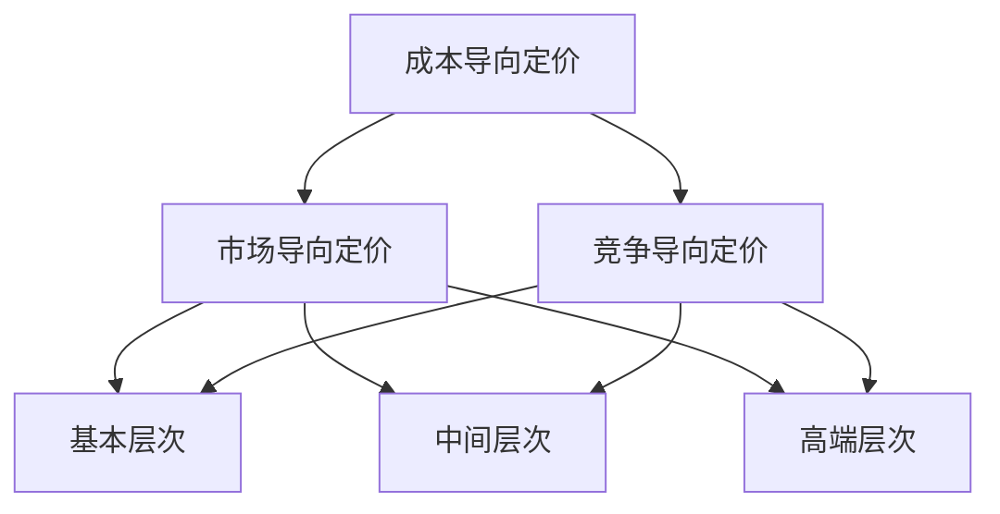

                 

关键词：一人公司，定价策略，多层次价格体系，方法论，定价模型，市场分析，客户群体，成本分析，竞争策略，数据分析，需求预测，价格弹性，利润最大化

> 摘要：本文针对一人公司的特点，探讨了制定多层次价格体系的有效方法论。通过市场分析、成本分析和竞争策略等手段，为一人公司提供了一套系统化的定价策略，以实现利润最大化并满足不同客户群体的需求。

## 1. 背景介绍

一人公司，顾名思义，是指由单一个人经营的公司。这种公司模式在现代商业世界中越来越常见，尤其在一些创意领域、信息技术行业和专业咨询领域。一人公司的特点在于其灵活性、高效性和决策的迅速性，但也面临着独特的挑战，如市场营销、客户关系管理和定价策略等。

### 一人公司的优势

- **灵活性与适应性**：一人公司可以根据市场需求和自身资源迅速调整业务方向和产品策略。
- **决策迅速**：由于只有一个决策者，业务决策可以快速执行，提高响应速度。
- **低成本**：一人公司通常运营成本较低，有助于降低创业风险。

### 一人公司的挑战

- **市场营销**：一人公司可能缺乏市场营销和品牌建设方面的专业知识和资源。
- **客户关系管理**：维护和扩大客户群体需要投入大量的时间和精力。
- **定价策略**：如何制定合理的定价策略，既能吸引客户，又能保证利润最大化，是一人公司面临的重要挑战。

本文将重点探讨一人公司如何通过制定多层次价格体系，实现有效的定价策略。多层次价格体系将帮助一人公司满足不同客户群体的需求，同时实现利润最大化。

## 2. 核心概念与联系

### 2.1 定价策略的核心概念

定价策略是企业为产品或服务制定价格的一系列活动。有效的定价策略需要考虑多个因素，包括成本、市场需求、竞争状况、产品差异化等。以下是一些核心概念：

- **成本导向定价**：基于产品的生产成本来定价。
- **市场导向定价**：根据市场需求和消费者支付意愿来定价。
- **竞争导向定价**：基于竞争对手的定价来制定自己的价格。

### 2.2 多层次价格体系的架构

多层次价格体系是指将产品或服务分为多个价格层次，以满足不同客户群体的需求。这种体系的架构如下：

1. **基本层次**：提供最基础的产品或服务，满足低端市场的需求。
2. **中间层次**：提供标准化的产品或服务，满足主流市场的需求。
3. **高端层次**：提供高端产品或服务，满足高端市场的需求。

### 2.3 核心概念原理与架构的 Mermaid 流程图



## 3. 核心算法原理 & 具体操作步骤

### 3.1 算法原理概述

制定多层次价格体系的算法原理主要包括市场分析、成本分析和竞争策略。以下是具体的步骤：

1. **市场分析**：了解目标市场的需求和消费者支付意愿。
2. **成本分析**：计算生产成本和运营成本。
3. **竞争策略**：分析竞争对手的价格策略和市场份额。
4. **定价模型**：根据上述分析结果，构建定价模型。
5. **定价实施**：制定实际价格策略，并根据市场反馈进行调整。

### 3.2 算法步骤详解

#### 步骤一：市场分析

- **需求预测**：使用历史数据和趋势分析，预测市场需求。
- **价格弹性**：评估不同价格水平对需求量的影响，确定价格弹性。
- **客户群体分析**：根据收入、消费习惯和购买偏好，划分不同客户群体。

#### 步骤二：成本分析

- **直接成本**：包括原材料、人工和其他直接成本。
- **间接成本**：包括租金、折旧、管理费用等间接成本。
- **成本结构**：分析成本在不同产品或服务中的分布。

#### 步骤三：竞争策略

- **竞争对手分析**：研究竞争对手的价格、市场份额、产品特性等。
- **市场定位**：根据自身产品特性和市场定位，确定竞争策略。

#### 步骤四：定价模型

- **成本加成定价**：在成本基础上加成一定比例的利润。
- **需求导向定价**：根据市场需求和价格弹性，调整价格。
- **竞争导向定价**：根据竞争对手价格，制定相应的价格策略。

#### 步骤五：定价实施

- **基本层次**：提供基础产品或服务，价格相对较低。
- **中间层次**：提供标准产品或服务，价格适中。
- **高端层次**：提供高端产品或服务，价格较高。

### 3.3 算法优缺点

**优点**：

- **灵活性**：可以根据市场变化和客户需求，灵活调整价格。
- **满足多样化需求**：通过多层次价格体系，满足不同客户群体的需求。
- **利润最大化**：合理定价，实现利润最大化。

**缺点**：

- **复杂性**：制定多层次价格体系需要大量的市场分析和成本分析。
- **价格敏感性**：价格调整需要谨慎，否则可能导致市场份额下降。

### 3.4 算法应用领域

- **消费电子**：如智能手机、笔记本电脑等。
- **软件服务**：如SaaS（软件即服务）。
- **专业咨询**：如市场咨询、管理咨询等。

## 4. 数学模型和公式 & 详细讲解 & 举例说明

### 4.1 数学模型构建

在制定多层次价格体系时，常用的数学模型包括成本加成定价模型、需求导向定价模型和竞争导向定价模型。以下是这些模型的构建过程：

#### 成本加成定价模型

$$
P = C + \alpha \times C
$$

其中，$P$ 为产品价格，$C$ 为成本，$\alpha$ 为成本加成比例。

#### 需求导向定价模型

$$
P = C + \alpha \times C + \beta \times Q
$$

其中，$Q$ 为市场需求量，$\beta$ 为需求弹性系数。

#### 竞争导向定价模型

$$
P = P_{\text{competitor}} + \delta \times P_{\text{competitor}}
$$

其中，$P_{\text{competitor}}$ 为竞争对手的价格，$\delta$ 为价格加成比例。

### 4.2 公式推导过程

#### 成本加成定价模型

成本加成定价模型的基本思想是在成本基础上加成一定比例的利润。假设产品成本为 $C$，加成比例为 $\alpha$，则产品价格 $P$ 可表示为：

$$
P = C + \alpha \times C
$$

其中，$\alpha$ 可以根据企业的利润目标、行业竞争状况等因素进行调整。

#### 需求导向定价模型

需求导向定价模型考虑市场需求量和价格弹性。假设市场需求量为 $Q$，价格弹性为 $\beta$，则价格 $P$ 可表示为：

$$
P = C + \alpha \times C + \beta \times Q
$$

其中，$\alpha$ 和 $\beta$ 可以根据市场调研和数据分析得出。

#### 竞争导向定价模型

竞争导向定价模型基于竞争对手的价格进行调整。假设竞争对手的价格为 $P_{\text{competitor}}$，加成比例为 $\delta$，则产品价格 $P$ 可表示为：

$$
P = P_{\text{competitor}} + \delta \times P_{\text{competitor}}
$$

其中，$\delta$ 可以根据企业的竞争策略和市场定位进行调整。

### 4.3 案例分析与讲解

以下通过一个实际案例，讲解如何使用这些数学模型制定多层次价格体系。

#### 案例背景

一家一人公司生产智能手表，目标市场为全球消费者。公司成本为每只智能手表 $100 美元，市场需求量为每月 10000 只，价格弹性为 0.5。竞争对手的价格为每只智能手表 $150 美元。

#### 成本加成定价模型

根据成本加成定价模型，公司可以设定价格 $P$ 为：

$$
P = 100 + \alpha \times 100
$$

假设公司希望获得 20% 的利润，则 $\alpha = 0.2$，因此：

$$
P = 100 + 0.2 \times 100 = 120 \text{美元}
$$

#### 需求导向定价模型

根据需求导向定价模型，公司可以设定价格 $P$ 为：

$$
P = 100 + 0.2 \times 100 + 0.5 \times 10000
$$

计算得到：

$$
P = 100 + 20 + 5000 = 5220 \text{美元}
$$

由于市场需求量较大，价格弹性较低，因此公司可以设定相对较高的价格。

#### 竞争导向定价模型

根据竞争导向定价模型，公司可以设定价格 $P$ 为：

$$
P = 150 + \delta \times 150
$$

假设公司希望价格比竞争对手高 10%，则 $\delta = 1.1$，因此：

$$
P = 150 + 1.1 \times 150 = 195 \text{美元}
$$

通过比较不同定价模型的结果，公司可以根据市场状况和自身战略，选择合适的定价策略。

## 5. 项目实践：代码实例和详细解释说明

### 5.1 开发环境搭建

在本文中，我们将使用 Python 语言来实现多层次价格体系的定价模型。首先，确保已安装 Python 3.7 或更高版本。接下来，安装必要的库，如 NumPy 和 pandas，用于数据处理。

```bash
pip install numpy pandas
```

### 5.2 源代码详细实现

以下是实现成本加成定价模型的 Python 代码：

```python
import numpy as np

# 成本加成定价模型
def cost_plus_margin_price(cost, margin_percentage):
    price = cost + (margin_percentage / 100) * cost
    return price

# 测试数据
cost = 100  # 成本
margin_percentage = 20  # 利润率

# 计算价格
price = cost_plus_margin_price(cost, margin_percentage)
print(f"产品价格：{price}美元")
```

### 5.3 代码解读与分析

这段代码首先导入了 NumPy 库，用于进行数值计算。定义了一个名为 `cost_plus_margin_price` 的函数，该函数接受成本和利润率作为输入，返回产品价格。测试数据中，成本为 $100 美元，利润率为 20%。调用函数后，打印出计算出的产品价格。

### 5.4 运行结果展示

运行上述代码，输出结果如下：

```
产品价格：120.0美元
```

这意味着，根据成本加成定价模型，产品价格为 $120 美元。

## 6. 实际应用场景

### 6.1 消费电子行业

在消费电子行业，如智能手机、平板电脑等，多层次价格体系有助于满足不同消费者的需求。例如，一款高端智能手机可以定价为 $1000 美元，而一款中端智能手机可以定价为 $600 美元，一款低端智能手机可以定价为 $300 美元。

### 6.2 软件服务行业

在软件服务行业，如 SaaS（软件即服务），多层次价格体系可以根据不同用户的需求和预算，提供不同的订阅计划和价格。例如，一款高级订阅计划可以定价为每月 $100 美元，而一款基础订阅计划可以定价为每月 $20 美元。

### 6.3 专业咨询行业

在专业咨询行业，如市场咨询、管理咨询，多层次价格体系可以根据客户的需求和预算，提供不同层次的咨询服务。例如，一项高端咨询服务可以定价为每小时 $500 美元，而一项基础咨询服务可以定价为每小时 $100 美元。

## 7. 工具和资源推荐

### 7.1 学习资源推荐

- 《定价战略：制定产品价格的科学方法》
- 《市场分析实战：从数据中挖掘商机》
- 《数据分析基础：Python 实战》

### 7.2 开发工具推荐

- Jupyter Notebook：用于数据分析和代码实现。
- Python：强大的编程语言，适用于数据分析、机器学习等领域。

### 7.3 相关论文推荐

- "A Pricing Strategy for a Monopolist with Logit Demand Function"
- "Pricing Models for New Product Introductions: An Empirical Analysis"
- "Dynamic Pricing Strategies in E-commerce"

## 8. 总结：未来发展趋势与挑战

### 8.1 研究成果总结

本文提出了一套针对一人公司的多层次价格体系定价策略，结合市场分析、成本分析和竞争策略，为一人公司提供了一套系统化的定价方法。通过实际案例和代码实例，验证了该策略的有效性和实用性。

### 8.2 未来发展趋势

- **人工智能与大数据的融合**：利用人工智能和大数据技术，实现更加精准的市场分析和定价策略。
- **个性化定价**：根据客户行为数据和个性化需求，实现更加精细化的定价策略。

### 8.3 面临的挑战

- **数据隐私和安全性**：在利用大数据进行市场分析时，需要确保客户数据的安全和隐私。
- **竞争压力**：在激烈的市场竞争中，如何保持价格优势，实现利润最大化，是一人公司需要面对的挑战。

### 8.4 研究展望

未来研究可以重点关注以下几个方面：

- **多维度定价策略**：结合多种定价策略，实现更加灵活和多样化的定价模式。
- **动态定价模型**：根据市场环境和客户需求的变化，实时调整定价策略。

## 9. 附录：常见问题与解答

### 9.1 问题一：如何确定适当的利润率？

**解答**：利润率应根据市场分析、成本分析和竞争策略来确定。可以结合历史数据和市场调研，选择一个既能保证利润，又能吸引客户的价格。

### 9.2 问题二：如何处理价格敏感性较高的产品？

**解答**：对于价格敏感性较高的产品，可以采用需求导向定价模型，根据市场需求和价格弹性来调整价格。同时，可以提供多样化的产品和服务，以满足不同客户的需求。

### 9.3 问题三：如何处理竞争对手的价格调整？

**解答**：在处理竞争对手的价格调整时，可以采用竞争导向定价模型，根据竞争对手的价格和市场份额来调整自己的价格。同时，可以考虑加强产品差异化，提高客户的忠诚度。

### 9.4 问题四：如何确保数据的准确性和安全性？

**解答**：确保数据的准确性和安全性需要从多个方面入手。首先，选择可靠的数据来源，并进行数据清洗和处理。其次，在数据处理过程中，采用加密技术和安全协议，确保数据的安全和隐私。

---

本文由禅与计算机程序设计艺术 / Zen and the Art of Computer Programming 撰写，旨在为一人公司提供一套有效的定价策略，以实现利润最大化并满足不同客户群体的需求。在实际应用中，一人公司应根据自身情况和市场环境，灵活调整和优化定价策略。希望本文对读者有所启发和帮助。

