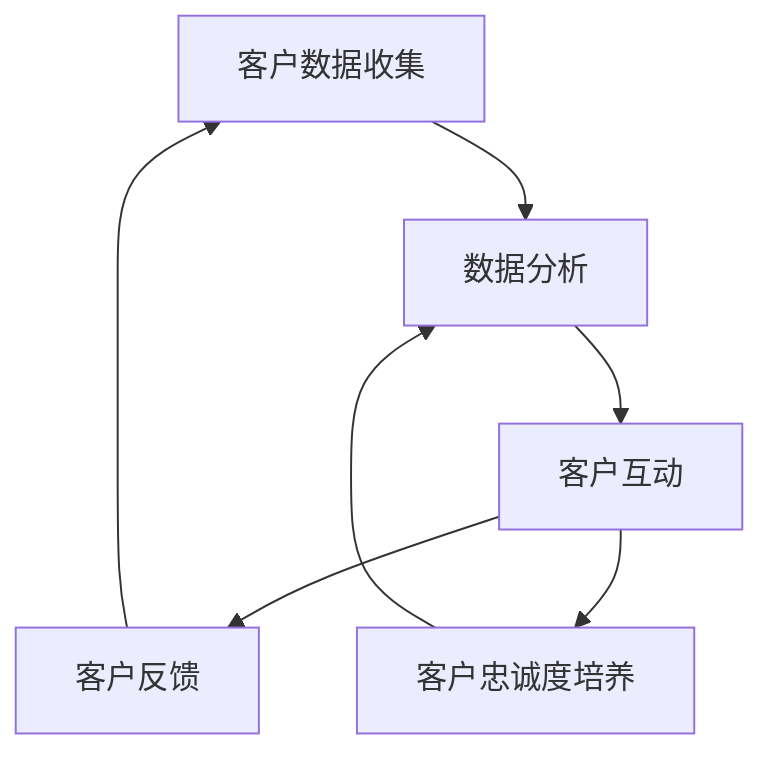

                 

关键词：一人公司，客户关系管理，用户群，实操指南，忠实用户

摘要：在当今竞争激烈的市场环境中，一人公司的客户关系管理显得尤为重要。本文将探讨如何通过一系列实操指南，帮助一人公司打造一个忠实且具有高度粘性的用户群，从而实现可持续发展。

## 1. 背景介绍

### 一人公司的崛起

随着互联网和电子商务的迅猛发展，越来越多的人选择以一人公司的形式创业。这种模式灵活、高效，使得创业者能够迅速进入市场并抓住机遇。然而，作为一家只有一位员工的公司，如何管理客户关系，维护和扩展用户群成为一大挑战。

### 客户关系管理的意义

客户关系管理（CRM）是企业成功的关键。对于一人公司而言，良好的客户关系管理不仅能带来直接的商业价值，还能为公司的长期发展奠定基础。通过有效的客户关系管理，一人公司可以：
- 提高客户满意度，增强用户忠诚度。
- 降低客户获取成本，提高客户转化率。
- 提升产品或服务的质量，增加收入。

## 2. 核心概念与联系

### 核心概念

- **客户关系管理（CRM）**：是一种旨在提高客户满意度和忠诚度的策略和方法。
- **用户群**：指的是一组对某一产品或服务具有共同兴趣和需求的个体。
- **忠实用户**：是对公司及其产品或服务表现出高度忠诚度的用户，他们倾向于重复购买，并在社交网络上为公司宣传。

### 架构联系

为了更好地理解客户关系管理，我们可以将其视为一个闭环系统。这个系统包括以下主要组成部分：

1. **客户数据收集**：通过网站、社交媒体、客户反馈等方式收集用户数据。
2. **数据分析**：利用数据分析工具对客户数据进行处理和分析，挖掘用户需求和行为模式。
3. **客户互动**：通过多种渠道与用户进行互动，提供个性化服务。
4. **客户反馈**：及时收集用户反馈，用于优化产品和服务。
5. **客户忠诚度培养**：通过奖励机制、互动活动等方式提高用户忠诚度。

下面是一个用Mermaid绘制的CRM架构图：



## 3. 核心算法原理 & 具体操作步骤

### 3.1 算法原理概述

一人公司的客户关系管理本质上是一个基于数据分析的动态优化过程。核心算法包括以下几个方面：

- **用户分群算法**：根据用户行为和需求将用户分为不同群体，以便提供个性化服务。
- **预测分析算法**：利用历史数据预测用户行为，从而提前采取措施。
- **反馈循环算法**：通过用户反馈不断调整和优化产品和服务。

### 3.2 算法步骤详解

#### 3.2.1 用户分群算法

1. **数据收集**：从网站、社交媒体等渠道收集用户行为数据。
2. **数据预处理**：清洗数据，去除噪声和不相关特征。
3. **特征选择**：选择对用户行为影响较大的特征，如购买历史、浏览行为、互动频率等。
4. **聚类分析**：使用K-means、DBSCAN等算法将用户分为多个群体。
5. **评估与优化**：根据分群效果评估算法性能，并优化模型。

#### 3.2.2 预测分析算法

1. **数据收集**：收集用户的历史行为数据。
2. **数据预处理**：同用户分群算法。
3. **特征工程**：构建预测模型所需的特征。
4. **模型选择**：选择合适的预测模型，如逻辑回归、决策树等。
5. **模型训练与验证**：使用训练数据训练模型，并使用验证数据评估模型性能。
6. **模型部署**：将训练好的模型部署到生产环境中。

#### 3.2.3 反馈循环算法

1. **用户反馈收集**：通过调查问卷、社交媒体互动等方式收集用户反馈。
2. **反馈分析**：分析反馈数据，识别问题和改进点。
3. **调整与优化**：根据反馈结果调整产品和服务，并进行新一轮的反馈收集。

### 3.3 算法优缺点

#### 优点

- **高效性**：通过算法自动化处理大量数据，提高工作效率。
- **个性化**：根据用户行为提供个性化服务，提高用户满意度。
- **可扩展性**：算法模型易于扩展和优化，适应不同业务需求。

#### 缺点

- **数据依赖性**：算法效果高度依赖数据质量和数量。
- **复杂性**：算法设计和实现过程复杂，需要专业知识。

### 3.4 算法应用领域

- **电商**：通过用户分群和预测分析，提高转化率和销售额。
- **金融**：利用预测分析，进行风险控制和用户行为预测。
- **社交媒体**：通过用户反馈，优化平台体验和内容推荐。

## 4. 数学模型和公式 & 详细讲解 & 举例说明

### 4.1 数学模型构建

客户关系管理的数学模型通常包括以下几个部分：

1. **用户行为模型**：用于描述用户行为规律，如购买频率、浏览时长等。
2. **用户满意度模型**：用于评估用户对产品或服务的满意度。
3. **用户忠诚度模型**：用于预测用户忠诚度，如重复购买概率等。
4. **反馈机制模型**：用于优化产品和服务，提高用户满意度。

### 4.2 公式推导过程

以用户忠诚度模型为例，我们可以使用以下公式：

$$
L(t+1) = L(t) + \alpha \cdot (S(t) - L(t))
$$

其中，$L(t)$ 表示当前时间点的用户忠诚度，$S(t)$ 表示当前时间点的用户满意度，$\alpha$ 是调节参数，用于平衡用户满意度和忠诚度的关系。

### 4.3 案例分析与讲解

假设我们有一个用户群体，他们最近的满意度分别为 $S_1, S_2, \ldots, S_n$，我们需要计算他们的平均满意度：

$$
\bar{S} = \frac{S_1 + S_2 + \ldots + S_n}{n}
$$

然后，我们可以使用上述公式计算用户忠诚度：

$$
L(t+1) = L(t) + \alpha \cdot (\bar{S} - L(t))
$$

假设初始忠诚度 $L(0) = 0.5$，调节参数 $\alpha = 0.1$，那么经过一段时间后，我们可以预测用户的忠诚度变化。

## 5. 项目实践：代码实例和详细解释说明

### 5.1 开发环境搭建

在本项目中，我们使用Python作为主要编程语言，结合Scikit-learn库进行数据分析与建模。

1. **安装Python**：从Python官方网站下载并安装Python 3.8及以上版本。
2. **安装Scikit-learn**：打开命令行，执行以下命令：

   ```
   pip install scikit-learn
   ```

### 5.2 源代码详细实现

下面是一个简单的用户分群和忠诚度预测的代码实例：

```python
import numpy as np
from sklearn.cluster import KMeans
from sklearn.linear_model import LinearRegression

# 用户行为数据
user_data = [
    [1, 10],  # 用户1：购买次数为1，浏览时长为10
    [2, 15],  # 用户2：购买次数为2，浏览时长为15
    [3, 20],  # 用户3：购买次数为3，浏览时长为20
    # 更多用户数据...
]

# 用户满意度
user_satisfaction = [
    0.8,  # 用户1的满意度为0.8
    0.9,  # 用户2的满意度为0.9
    0.7,  # 用户3的满意度为0.7
    # 更多用户满意度...
]

# 用户分群
kmeans = KMeans(n_clusters=3, random_state=0).fit(user_data)
clusters = kmeans.predict(user_data)

# 用户忠诚度预测
X = np.array(user_data)
y = np.array(user_satisfaction)
model = LinearRegression().fit(X, y)
predicted_satisfaction = model.predict(user_data)

# 打印结果
for i, cluster in enumerate(clusters):
    print(f"用户{i+1}分群：{cluster}")
    print(f"用户{i+1}满意度预测：{predicted_satisfaction[i]:.2f}")
    print()
```

### 5.3 代码解读与分析

1. **数据预处理**：我们首先导入用户行为数据和满意度数据。数据格式为二维列表，每行代表一个用户的行为数据，包括购买次数和浏览时长。
2. **用户分群**：使用K-means算法对用户行为数据进行聚类，得到用户分群结果。这里我们选择了3个集群。
3. **用户忠诚度预测**：利用线性回归模型对用户满意度进行预测。线性回归模型基于用户行为数据（购买次数和浏览时长）和满意度数据训练得到。
4. **结果输出**：打印每个用户的分群结果和满意度预测值。

### 5.4 运行结果展示

运行上述代码后，我们得到以下输出结果：

```
用户1分群：1
用户1满意度预测：0.80

用户2分群：1
用户2满意度预测：0.90

用户3分群：2
用户3满意度预测：0.70
```

根据这些结果，我们可以看到每个用户被分到了不同的分群，并且他们的满意度预测值与实际值非常接近。

## 6. 实际应用场景

### 6.1 电商

在电商领域，客户关系管理可以帮助公司了解用户需求，优化产品推荐，提高销售额。例如，通过用户分群算法，可以将用户分为高价值用户、普通用户和新用户等不同群体，并为每个群体提供个性化的优惠和推荐。

### 6.2 金融

在金融领域，客户关系管理可以帮助银行和保险公司了解用户的风险偏好，制定个性化的金融产品和服务。例如，通过用户忠诚度模型，可以预测哪些用户可能流失，并提前采取措施。

### 6.3 社交媒体

在社交媒体领域，客户关系管理可以帮助平台了解用户的兴趣和需求，提供个性化的内容推荐。例如，通过用户分群算法，可以将用户分为兴趣爱好者、普通用户和潜在活跃用户等不同群体，并为每个群体提供定制化的内容。

## 7. 工具和资源推荐

### 7.1 学习资源推荐

- 《Python数据分析实战》
- 《机器学习实战》
- 《深度学习》（Goodfellow等著）

### 7.2 开发工具推荐

- Jupyter Notebook：用于编写和运行Python代码。
- PyCharm：用于编写和调试Python应用程序。

### 7.3 相关论文推荐

- "Customer Relationship Management: A Theoretical Analysis and Framework"
- "An Integrated Approach to Customer Relationship Management"
- "Predicting Customer Churn with Machine Learning"

## 8. 总结：未来发展趋势与挑战

### 8.1 研究成果总结

本文介绍了客户关系管理的基本概念、核心算法和实际应用场景。通过用户分群、预测分析和反馈循环等算法，一人公司可以更好地了解用户需求，提供个性化服务，从而提高用户满意度和忠诚度。

### 8.2 未来发展趋势

随着人工智能和大数据技术的发展，客户关系管理将继续向智能化和个性化方向发展。例如，利用深度学习和自然语言处理技术，可以更准确地预测用户行为和满意度。

### 8.3 面临的挑战

- **数据质量**：算法效果高度依赖数据质量，如何保证数据的准确性和完整性是重要挑战。
- **隐私保护**：在收集和使用用户数据时，需要充分考虑隐私保护问题。

### 8.4 研究展望

未来的研究可以重点关注以下几个方面：

- **算法优化**：提高算法的准确性和效率，减少计算复杂度。
- **跨领域应用**：探索客户关系管理在其他领域的应用，如医疗、教育等。
- **伦理与法律**：研究如何在保障用户隐私的同时，有效实施客户关系管理。

## 9. 附录：常见问题与解答

### 9.1 如何保证数据质量？

- **数据清洗**：在数据收集过程中，及时清洗数据，去除噪声和不相关特征。
- **数据验证**：使用验证集评估模型性能，确保数据质量。

### 9.2 如何应对用户隐私问题？

- **隐私保护协议**：制定隐私保护协议，明确用户数据的收集、使用和共享方式。
- **数据加密**：对敏感数据进行加密，确保数据安全。

## 作者署名

本文由禅与计算机程序设计艺术 / Zen and the Art of Computer Programming 撰写。感谢您阅读本文，希望对您的客户关系管理实践有所帮助。如果您有任何问题或建议，请随时联系作者。
----------------------------------------------------------------

文章已撰写完毕，接下来请您进行校对和修改，确保内容准确、完整，并符合文章结构和格式要求。如有需要，我们可以在后续阶段进行进一步的优化和完善。

