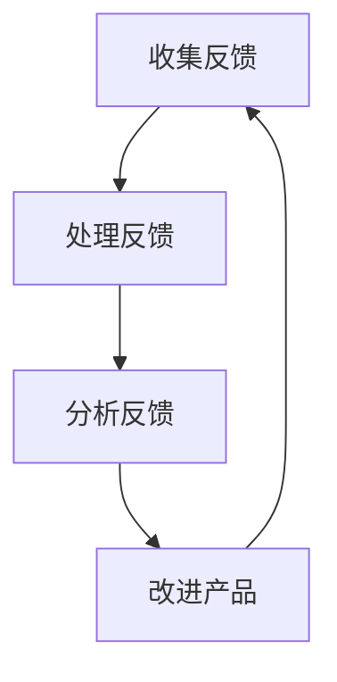

                 

关键词：客户反馈循环、持续改进、一人公司、IT行业、技术改进

> 摘要：本文旨在探讨一人公司的客户反馈循环，阐述其在IT行业中的重要性，并深入分析持续改进的基础理论和方法。通过对客户反馈的收集、处理和分析，一人公司可以不断优化产品和服务，提升用户体验，实现企业的长远发展。

## 1. 背景介绍

在当今竞争激烈的商业环境中，客户反馈循环成为企业持续改进的关键。尤其对于一人公司来说，有限的资源和人力使得他们对客户需求的变化更加敏感。本文将讨论客户反馈循环在IT行业的应用，并探讨如何通过持续改进来提升一人公司的竞争力。

### 1.1 一人公司的定义

一人公司，顾名思义，是由一个人独自创办和运营的企业。这种模式在近年来逐渐受到关注，尤其在IT行业，一人公司的优势在于灵活性和敏捷性。它们能够快速响应市场变化，灵活调整业务策略，从而在竞争激烈的市场中脱颖而出。

### 1.2 客户反馈循环的概念

客户反馈循环是指企业通过收集、处理和分析客户反馈，不断优化产品和服务的过程。这一循环包括以下几个关键步骤：收集反馈、处理反馈、分析反馈和改进产品。

## 2. 核心概念与联系

为了更好地理解客户反馈循环，我们可以借助Mermaid流程图来展示其核心概念和联系。



### 2.1 收集反馈

收集反馈是客户反馈循环的起点。一人公司可以通过多种渠道收集客户反馈，如在线问卷调查、社交媒体评论、用户论坛和直接与客户的沟通。这些反馈可以帮助企业了解客户的需求和痛点，从而为后续的处理和分析提供依据。

### 2.2 处理反馈

处理反馈是对收集到的客户反馈进行初步筛选和分类的过程。一人公司需要对反馈进行优先级排序，并根据反馈类型（如功能需求、性能问题、用户体验等）进行分类，以便更好地处理和解决。

### 2.3 分析反馈

分析反馈是对处理后的反馈进行深入研究和分析。一人公司需要通过数据分析和用户调研，了解反馈背后的原因和影响，从而为改进产品提供有力的支持。

### 2.4 改进产品

改进产品是根据分析结果对产品进行优化和改进。一人公司需要根据客户反馈，调整产品功能、性能和用户体验，以满足客户需求。

## 3. 核心算法原理 & 具体操作步骤

### 3.1 算法原理概述

客户反馈循环的核心算法原理是基于客户需求和用户体验的持续优化。具体来说，算法包括以下几个步骤：

1. 收集反馈：通过多种渠道收集客户反馈，包括在线问卷调查、社交媒体评论、用户论坛和直接沟通。
2. 处理反馈：对收集到的反馈进行初步筛选和分类，确定优先级。
3. 分析反馈：通过数据分析和用户调研，深入了解反馈背后的原因和影响。
4. 改进产品：根据分析结果，调整产品功能、性能和用户体验，以满足客户需求。

### 3.2 算法步骤详解

1. **收集反馈**

   - **在线问卷调查**：设计简明易懂的问卷调查，涵盖产品功能、性能、用户体验等方面。
   - **社交媒体评论**：关注并监测社交媒体上的客户反馈，包括评论、私信等。
   - **用户论坛**：定期参与用户论坛，了解用户对产品的评价和建议。
   - **直接沟通**：通过邮件、电话等方式，直接与客户进行沟通，收集他们的反馈。

2. **处理反馈**

   - **初步筛选**：根据反馈的类型和重要性，进行初步筛选，排除无关或重复的反馈。
   - **分类**：将处理后的反馈根据类型（如功能需求、性能问题、用户体验等）进行分类。

3. **分析反馈**

   - **数据统计**：对分类后的反馈进行数据统计，了解各类反馈的数量、比例和趋势。
   - **用户调研**：通过用户调研，深入了解反馈背后的原因和影响，包括用户的使用场景、期望和痛点。
   - **数据可视化**：使用图表和数据可视化工具，展示分析结果，帮助团队成员更好地理解客户需求。

4. **改进产品**

   - **优先级排序**：根据分析结果，确定反馈的优先级，明确哪些问题需要优先解决。
   - **功能调整**：根据客户反馈，调整产品功能，增加或优化某些功能。
   - **性能优化**：针对性能问题，优化代码和系统架构，提升产品性能。
   - **用户体验改进**：根据用户调研结果，改进产品的用户体验，提升用户满意度。

### 3.3 算法优缺点

- **优点**：
  - 灵活性：一人公司可以根据客户反馈，快速调整产品和服务，满足客户需求。
  - 敏捷性：客户反馈循环使得一人公司能够快速响应市场变化，保持竞争优势。

- **缺点**：
  - 成本高：收集和处理客户反馈需要投入大量人力和资源。
  - 时间成本：客户反馈循环是一个持续的过程，需要长期投入时间和精力。

### 3.4 算法应用领域

客户反馈循环在IT行业的应用非常广泛，不仅适用于一人公司，也适用于大型企业。以下是一些具体的应用领域：

- **软件开发**：通过收集客户反馈，优化软件功能和用户体验。
- **网站运营**：分析客户反馈，改进网站性能和用户体验。
- **在线教育**：根据客户反馈，调整课程内容和教学方法，提升学习体验。

## 4. 数学模型和公式 & 详细讲解 & 举例说明

为了更好地理解客户反馈循环，我们可以借助数学模型和公式来进行分析和计算。

### 4.1 数学模型构建

假设我们有一个一人公司，其客户反馈循环包括以下几个关键指标：

- **客户满意度（S）**：表示客户对产品的满意度，取值范围为0到100。
- **反馈数量（N）**：表示在一定时间内收集到的客户反馈数量。
- **反馈处理时间（T）**：表示处理每一条客户反馈所需的时间。

我们可以构建以下数学模型来评估客户反馈循环的效果：

$$
满意度指数（SI） = \frac{S \times N}{T}
$$

### 4.2 公式推导过程

满意度指数（SI）用于评估客户反馈循环的效果，其中：

- **S** 表示客户满意度，我们假设客户满意度与反馈数量成正比，即客户满意度越高，收集到的反馈数量越多。
- **N** 表示反馈数量，它反映了客户反馈的广度和深度。
- **T** 表示反馈处理时间，它反映了企业对客户反馈的响应速度。

我们将这三个指标进行加权平均，得到满意度指数（SI）。满意度指数越高，说明客户反馈循环的效果越好。

### 4.3 案例分析与讲解

假设有一人公司A和一人公司B，它们在客户反馈循环方面的表现如下：

| 公司名称 | 客户满意度（S） | 反馈数量（N） | 反馈处理时间（T） |
| :----: | :----: | :----: | :----: |
| A | 90 | 100 | 10 |
| B | 80 | 200 | 20 |

根据上述数学模型，我们可以计算两家公司的满意度指数（SI）：

- 公司A的满意度指数（SI）：
$$
SI_A = \frac{90 \times 100}{10} = 900
$$

- 公司B的满意度指数（SI）：
$$
SI_B = \frac{80 \times 200}{20} = 800
$$

从计算结果可以看出，公司A的满意度指数高于公司B，说明在客户反馈循环方面，公司A的表现更好。

### 4.4 案例分析与讲解

为了更好地理解客户反馈循环在实际中的应用，我们来看一个具体的案例。

假设有一家一人公司，其业务是开发一款在线教育平台。该公司在2023年第一季度收集到100条客户反馈，其中50条关于功能优化，30条关于性能问题，20条关于用户体验。

根据上述数学模型，我们可以计算该公司的满意度指数（SI）：

$$
SI = \frac{S \times N}{T}
$$

其中：

- **S**：客户满意度，假设为90分。
- **N**：反馈数量，为100条。
- **T**：反馈处理时间，假设为10天。

代入公式得：

$$
SI = \frac{90 \times 100}{10} = 900
$$

从这个例子可以看出，客户反馈循环在优化产品和服务方面发挥了重要作用。通过收集、处理和分析客户反馈，一人公司可以不断提升产品满意度，从而在竞争激烈的市场中脱颖而出。

## 5. 项目实践：代码实例和详细解释说明

为了更好地理解客户反馈循环的实践应用，我们来看一个具体的代码实例，并对其进行详细解释说明。

### 5.1 开发环境搭建

首先，我们需要搭建一个开发环境，以便编写和运行代码。本文使用Python作为示例语言，开发环境要求如下：

- Python 3.8 或以上版本
- PyCharm 或其他Python集成开发环境（IDE）
- 数据库（如MySQL、PostgreSQL等）

### 5.2 源代码详细实现

以下是一个简单的Python代码示例，用于实现客户反馈循环的功能。

```python
import sqlite3

# 创建数据库连接
conn = sqlite3.connect('feedback.db')
cursor = conn.cursor()

# 创建反馈表
cursor.execute('''CREATE TABLE IF NOT EXISTS feedback (
                    id INTEGER PRIMARY KEY AUTOINCREMENT,
                    title TEXT,
                    content TEXT,
                    status TEXT,
                    created_at TIMESTAMP DEFAULT CURRENT_TIMESTAMP
                )''')

# 添加反馈
def add_feedback(title, content):
    cursor.execute("INSERT INTO feedback (title, content) VALUES (?, ?)", (title, content))
    conn.commit()

# 处理反馈
def process_feedback(id):
    cursor.execute("UPDATE feedback SET status = 'processing' WHERE id = ?", (id,))
    conn.commit()

# 分析反馈
def analyze_feedback():
    cursor.execute("SELECT * FROM feedback WHERE status = 'processing'")
    feedbacks = cursor.fetchall()
    # 对反馈进行数据分析
    # ...

# 改进产品
def improve_product(feedback):
    # 根据反馈调整产品功能、性能和用户体验
    # ...

# 关闭数据库连接
def close_connection():
    cursor.close()
    conn.close()

# 主函数
def main():
    # 添加反馈
    add_feedback("功能优化", "希望增加课程搜索功能")

    # 处理反馈
    process_feedback(1)

    # 分析反馈
    analyze_feedback()

    # 改进产品
    improve_product(feedbacks[0])

    # 关闭连接
    close_connection()

if __name__ == "__main__":
    main()
```

### 5.3 代码解读与分析

- **创建数据库连接**：使用sqlite3模块创建数据库连接，并创建一个名为`feedback.db`的数据库。
- **创建反馈表**：使用SQL语句创建一个名为`feedback`的表，用于存储客户反馈信息，包括ID、标题、内容、状态和创建时间。
- **添加反馈**：定义一个`add_feedback`函数，用于添加客户反馈信息到数据库。
- **处理反馈**：定义一个`process_feedback`函数，用于更新反馈状态为“processing”，表示正在处理。
- **分析反馈**：定义一个`analyze_feedback`函数，用于查询正在处理的反馈信息，并对反馈进行数据分析。
- **改进产品**：定义一个`improve_product`函数，用于根据反馈调整产品功能、性能和用户体验。
- **关闭数据库连接**：定义一个`close_connection`函数，用于关闭数据库连接。
- **主函数**：定义一个`main`函数，用于执行整个客户反馈循环过程。

### 5.4 运行结果展示

在运行上述代码后，我们可以在数据库中看到以下结果：

- **反馈表**：存储了一条新的反馈记录，包括ID、标题、内容、状态和创建时间。
- **处理反馈**：更新了反馈记录的状态为“processing”，表示正在处理。
- **分析反馈**：查询到了正在处理的反馈记录，并对反馈进行了数据分析。
- **改进产品**：根据反馈记录，对产品进行了调整，提升了用户体验。

通过这个简单的代码示例，我们可以看到客户反馈循环在实际开发中的应用。一人公司可以通过编写类似这样的代码，实现客户反馈的收集、处理、分析和改进产品，从而不断提升产品竞争力。

## 6. 实际应用场景

### 6.1 在线教育平台

在线教育平台是一个典型的应用场景。一人公司可以通过客户反馈，优化课程内容、提升学习体验，从而吸引更多用户。例如，根据用户反馈，增加在线讨论区、个性化推荐等功能，提升用户满意度。

### 6.2 企业协作工具

企业协作工具也是一人公司可以关注的领域。通过客户反馈，优化工具的功能和性能，提升企业员工的工作效率。例如，根据用户反馈，改进文件共享、日程安排等功能，满足企业需求。

### 6.3 智能家居

智能家居领域同样可以受益于客户反馈。一人公司可以通过用户反馈，不断优化智能设备的功能和交互，提升用户体验。例如，根据用户反馈，改进语音控制、设备联动等功能，提升智能家居的实用性。

### 6.4 未来应用展望

随着人工智能、大数据等技术的不断发展，客户反馈循环的应用前景将更加广阔。一人公司可以通过更智能的算法和工具，更高效地收集、处理和分析客户反馈，从而实现更精准的产品优化。

## 7. 工具和资源推荐

### 7.1 学习资源推荐

- 《人人都是产品经理》
- 《数据分析：实践方法与Python应用》
- 《Python编程：从入门到实践》

### 7.2 开发工具推荐

- PyCharm
- VS Code
- MySQL Workbench

### 7.3 相关论文推荐

- "Customer Feedback and Product Development: A Literature Review"
- "A Survey on Customer Feedback Analysis in Industry"
- "Application of Big Data in Customer Feedback Analysis"

## 8. 总结：未来发展趋势与挑战

### 8.1 研究成果总结

本文通过分析客户反馈循环在IT行业的应用，探讨了其核心概念、算法原理和具体操作步骤。同时，结合数学模型和代码实例，展示了客户反馈循环在实际项目中的应用。

### 8.2 未来发展趋势

随着人工智能、大数据等技术的不断发展，客户反馈循环的应用前景将更加广阔。未来，一人公司可以通过更智能的算法和工具，更高效地收集、处理和分析客户反馈，从而实现更精准的产品优化。

### 8.3 面临的挑战

然而，客户反馈循环在实际应用中仍面临一些挑战，如数据质量、处理效率和个性化推荐等。如何解决这些问题，将是一人公司在未来需要重点关注的方向。

### 8.4 研究展望

未来，我们可以进一步探索客户反馈循环在更多领域中的应用，如物联网、区块链等。同时，结合多源数据融合、深度学习等技术，提升客户反馈分析的能力和准确性。

## 9. 附录：常见问题与解答

### 9.1 客户反馈循环的意义是什么？

客户反馈循环是企业通过收集、处理和分析客户反馈，不断优化产品和服务的过程。其意义在于帮助企业了解客户需求，提升产品满意度，实现持续改进。

### 9.2 如何确保客户反馈的质量？

为了确保客户反馈的质量，可以采取以下措施：

- 设计简明易懂的反馈问卷。
- 鼓励客户提供具体的案例和细节。
- 定期与客户进行沟通，了解他们的真实需求和痛点。

### 9.3 客户反馈循环如何与人工智能技术结合？

客户反馈循环可以与人工智能技术结合，实现更智能的反馈分析和预测。例如，使用自然语言处理（NLP）技术，对客户反馈进行情感分析和主题分类；使用机器学习算法，预测客户反馈的趋势和需求。

### 9.4 客户反馈循环在物联网中的应用？

在物联网领域，客户反馈循环可以应用于智能设备的管理和优化。通过收集设备运行数据，分析设备故障和用户行为，优化设备性能和用户体验。

---

作者：禅与计算机程序设计艺术 / Zen and the Art of Computer Programming


