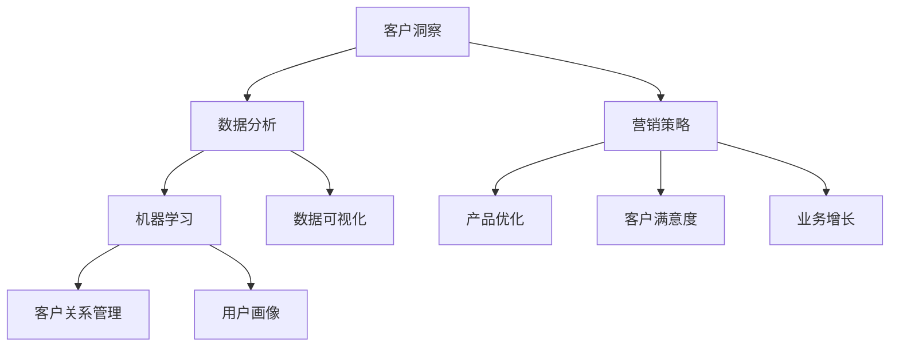

                 

### 背景介绍

在当今激烈竞争的商业环境中，客户洞察成为了企业成功的关键。无论企业规模大小，了解目标市场的需求和偏好都是至关重要的。特别是对于一家只有一名员工的公司（以下简称“一人公司”），深入挖掘客户洞察更是其生存和发展的基础。本文将探讨一人公司如何通过技术手段和策略，深入了解目标市场，从而实现业务的可持续增长。

### 为什么一人公司需要深入了解目标市场

首先，让我们思考一下一人公司面临的独特挑战和机遇。由于公司规模较小，资源有限，一人公司需要更加精准地定位目标客户，以确保每一分投入都能带来最大的回报。以下是深入了解目标市场对一人公司的重要意义：

1. **优化产品和服务**：了解客户需求可以帮助一人公司设计出更符合市场需求的产品和服务，提高客户满意度和忠诚度。
2. **提升营销效果**：精确的目标市场洞察有助于制定更具针对性的营销策略，减少无效市场投放，提高营销投资回报率（ROI）。
3. **降低运营风险**：通过分析市场趋势和竞争态势，一人公司可以更好地调整业务策略，减少不必要的风险。
4. **增强竞争力**：深入了解目标市场可以让一人公司找到自己的独特优势，打造差异化产品和服务，提升市场竞争力。

### 本文的结构和内容

本文将分为以下几个部分：

1. **核心概念与联系**：介绍与客户洞察相关的基本概念，并通过Mermaid流程图展示核心概念和联系。
2. **核心算法原理 & 具体操作步骤**：详细阐述用于分析客户洞察的核心算法原理，以及具体的实施步骤。
3. **数学模型和公式 & 详细讲解 & 举例说明**：介绍与客户洞察相关的数学模型和公式，并通过案例进行讲解。
4. **项目实践：代码实例和详细解释说明**：提供实际项目中的代码实例，并进行详细解读。
5. **实际应用场景**：探讨客户洞察在不同业务领域的应用，以及未来发展的趋势和挑战。
6. **工具和资源推荐**：推荐学习资源和开发工具，帮助读者进一步探索客户洞察的领域。
7. **总结：未来发展趋势与挑战**：总结研究成果，展望未来发展的方向和面临的挑战。
8. **附录：常见问题与解答**：回答读者可能遇到的一些常见问题。

通过以上结构，本文将系统地展示如何通过技术手段深入了解目标市场，为一人公司的业务发展提供有力的支持。

## 2. 核心概念与联系

在深入探讨客户洞察之前，我们需要理解几个核心概念，这些概念构成了客户洞察的基础框架。以下是本文将涉及的关键概念：

### 2.1 客户洞察

客户洞察是一种深入理解目标客户需求、偏好、行为和情感的技术手段。通过收集和分析客户数据，企业可以更好地理解客户的需求和痛点，从而提供更优质的产品和服务。

### 2.2 数据分析

数据分析是客户洞察的核心环节。它涉及使用统计学、机器学习等方法来处理和分析大量数据，从中提取有价值的信息和趋势。数据分析工具和算法的应用使得从数据中获取洞见变得更加高效和精准。

### 2.3 机器学习

机器学习是数据分析的重要分支，通过构建和训练模型，让计算机从数据中自动学习和发现规律。在客户洞察中，机器学习算法可以用于预测客户行为、分类客户群体等。

### 2.4 数据可视化

数据可视化是将复杂的数据以图表、图形等形式直观展示的方法。通过数据可视化，可以更直观地理解和分析数据，从而为决策提供支持。

### 2.5 客户关系管理（CRM）

客户关系管理是一种通过整合和利用客户数据来提升客户满意度和忠诚度的方法。CRM系统可以帮助企业跟踪客户互动历史、管理销售机会，从而更好地满足客户需求。

### 2.6 用户画像

用户画像是对客户数据进行抽象和综合，形成的一个客户特征模型。通过用户画像，企业可以了解客户的整体特征，从而进行精准营销和个性化服务。

### Mermaid流程图

以下是一个简化的Mermaid流程图，展示了上述核心概念之间的联系：



在这个流程图中，客户洞察作为起点，通过数据分析、机器学习、数据可视化等技术手段，为企业提供洞见，进而指导营销策略、产品优化、客户满意度提升和业务增长。

通过理解这些核心概念，一人公司可以更系统地开展客户洞察工作，从而更好地定位目标市场，实现业务目标。

## 3. 核心算法原理 & 具体操作步骤

在深入进行客户洞察的过程中，核心算法原理的选择和具体操作步骤的制定至关重要。以下是本文将探讨的一种常用的客户洞察算法——协同过滤算法，以及其具体实施步骤。

### 3.1 算法原理概述

协同过滤算法是一种基于用户行为数据推荐算法，其基本思想是找到与当前用户相似的其他用户，并根据这些相似用户的偏好来推荐新物品。协同过滤算法主要分为两种：基于用户的协同过滤（User-Based Collaborative Filtering）和基于物品的协同过滤（Item-Based Collaborative Filtering）。

#### 3.1.1 基于用户的协同过滤

基于用户的协同过滤算法通过计算用户之间的相似度，找到与当前用户兴趣相似的邻居用户，然后推荐这些邻居用户喜欢的、当前用户尚未购买或评价的物品。

#### 3.1.2 基于物品的协同过滤

基于物品的协同过滤算法通过计算物品之间的相似度，找到与当前物品相似的邻居物品，然后推荐这些邻居物品给当前用户。

### 3.2 算法步骤详解

以下是协同过滤算法的具体步骤：

#### 3.2.1 数据准备

1. **用户-物品评分矩阵**：首先，需要收集用户对物品的评分数据，构建用户-物品评分矩阵。
2. **缺失值处理**：由于实际数据中往往存在缺失值，需要对缺失值进行填充或删除。

#### 3.2.2 相似度计算

1. **用户相似度计算**：对于基于用户的协同过滤，计算用户之间的相似度。常用的相似度计算方法有余弦相似度、皮尔逊相关系数等。
2. **物品相似度计算**：对于基于物品的协同过滤，计算物品之间的相似度。常用的相似度计算方法有余弦相似度、欧几里得距离等。

#### 3.2.3 邻居选择

1. **基于用户相似度选择邻居**：对于基于用户的协同过滤，选择与当前用户相似度最高的若干用户作为邻居。
2. **基于物品相似度选择邻居**：对于基于物品的协同过滤，选择与当前物品相似度最高的若干物品作为邻居。

#### 3.2.4 推荐生成

1. **基于邻居推荐**：对于每个邻居用户（或物品），计算其对推荐物品的偏好分数。然后将这些偏好分数加权求和，得到对当前用户推荐物品的得分。
2. **排序和筛选**：将所有推荐物品按照得分从高到低排序，并根据业务需求设置推荐阈值，筛选出推荐结果。

### 3.3 算法优缺点

#### 优点

1. **高效性**：协同过滤算法能够处理大规模数据集，适用于实时推荐系统。
2. **用户个性化**：基于用户或物品的偏好进行推荐，能够提供较为个性化的服务。

#### 缺点

1. **冷启动问题**：对于新用户或新物品，由于缺乏足够的历史数据，推荐效果可能不佳。
2. **数据稀疏性**：当用户和物品数量庞大时，评分矩阵往往呈现高度稀疏性，导致计算效率降低。

### 3.4 算法应用领域

协同过滤算法广泛应用于电子商务、社交媒体、在线视频平台等领域，如推荐系统、社交网络分析等。通过协同过滤算法，一人公司可以更好地了解客户需求，提供个性化推荐，提升用户体验和满意度。

### 3.5 其他相关算法

除了协同过滤算法，还有其他一些常用的客户洞察算法，如矩阵分解、深度学习等。矩阵分解通过将用户-物品评分矩阵分解为用户特征矩阵和物品特征矩阵，实现推荐；深度学习通过构建神经网络模型，对用户行为数据进行自动学习和特征提取，实现推荐。

总之，理解并应用这些核心算法，可以帮助一人公司更好地进行客户洞察，从而实现业务增长。

## 4. 数学模型和公式 & 详细讲解 & 举例说明

在客户洞察中，数学模型和公式扮演着至关重要的角色。它们不仅帮助我们理解和分析数据，还能量化客户行为，从而指导业务决策。以下是几个常用的数学模型和公式，以及它们在客户洞察中的应用。

### 4.1 数学模型构建

#### 4.1.1 用户-物品评分矩阵

用户-物品评分矩阵是一个二维矩阵，其中行表示用户，列表示物品，每个元素表示用户对物品的评分。记这个矩阵为 \( R \)，其中 \( R_{ij} \) 表示用户 \( i \) 对物品 \( j \) 的评分。

#### 4.1.2 用户特征和物品特征矩阵

用户特征矩阵和物品特征矩阵是通过矩阵分解等方法从用户-物品评分矩阵中提取出来的。记用户特征矩阵为 \( U \)，物品特征矩阵为 \( V \)，则有：

\[ R = U \times V \]

### 4.2 公式推导过程

#### 4.2.1 相似度计算

**余弦相似度**：

\[ \cos(\theta_{ij}) = \frac{U_i \cdot V_j}{\lVert U_i \rVert \times \lVert V_j \rVert} \]

其中，\( \lVert \cdot \rVert \) 表示向量的模，\( \cdot \) 表示向量的内积。

**皮尔逊相关系数**：

\[ r_{ij} = \frac{\sum_{k=1}^{n} (R_{ik} - \bar{R}_i)(R_{jk} - \bar{R}_j)}{\sqrt{\sum_{k=1}^{n} (R_{ik} - \bar{R}_i)^2} \times \sqrt{\sum_{k=1}^{n} (R_{jk} - \bar{R}_j)^2}} \]

其中，\( \bar{R}_i \) 和 \( \bar{R}_j \) 分别表示用户 \( i \) 和用户 \( j \) 的平均评分。

#### 4.2.2 推荐算法公式

**基于用户的协同过滤**：

\[ R_{ij}^* = \sum_{k \in N(i)} W_{ik} R_{kj} \]

其中，\( N(i) \) 表示与用户 \( i \) 相似的邻居用户集合，\( W_{ik} \) 表示用户 \( i \) 与邻居用户 \( k \) 的相似度权重。

**基于物品的协同过滤**：

\[ R_{ij}^* = \sum_{k \in N(j)} W_{jk} R_{ik} \]

其中，\( N(j) \) 表示与物品 \( j \) 相似的邻居物品集合，\( W_{jk} \) 表示物品 \( j \) 与邻居物品 \( k \) 的相似度权重。

### 4.3 案例分析与讲解

#### 4.3.1 案例背景

假设有一个在线书店，用户可以对这些书籍进行评分。我们需要使用协同过滤算法，基于用户评分数据推荐书籍。

#### 4.3.2 数据准备

用户-物品评分矩阵 \( R \) 如下所示：

| 用户  | 书籍1 | 书籍2 | 书籍3 | 书籍4 |
|-------|-------|-------|-------|-------|
| 用户1 | 4     | 5     | 0     | 3     |
| 用户2 | 0     | 4     | 5     | 0     |
| 用户3 | 3     | 0     | 4     | 5     |

#### 4.3.3 相似度计算

假设我们使用余弦相似度来计算用户之间的相似度，计算结果如下：

| 用户  | 用户1 | 用户2 | 用户3 |
|-------|-------|-------|-------|
| 用户1 | 1     | 0.7071| 0.7071|
| 用户2 | 0.7071| 1     | 0.7071|
| 用户3 | 0.7071| 0.7071| 1     |

#### 4.3.4 推荐生成

假设我们需要为用户3推荐书籍。根据相似度矩阵，用户3的邻居用户包括用户1和用户2。使用基于用户的协同过滤算法，推荐结果如下：

\[ R_{31}^* = 1 \times 4 + 0.7071 \times 3 = 4.7071 \]

\[ R_{32}^* = 0.7071 \times 5 = 3.5355 \]

由于 \( R_{31}^* > R_{32}^* \)，因此我们推荐书籍1给用户3。

通过上述案例，我们可以看到，数学模型和公式在客户洞察中的应用是如何具体实现的。通过这些模型，一人公司可以更加精准地推荐产品和服务，提升用户体验和满意度。

## 5. 项目实践：代码实例和详细解释说明

为了更好地展示客户洞察算法在实际项目中的应用，我们将在本节中通过一个实际案例进行讲解。本案例将使用Python编程语言和Scikit-learn库来演示基于用户的协同过滤算法在推荐系统中的应用。

### 5.1 开发环境搭建

在开始之前，我们需要搭建一个合适的开发环境。以下是所需的步骤：

1. **安装Python**：确保已安装Python 3.x版本。
2. **安装Scikit-learn**：使用pip命令安装Scikit-learn库：

   ```bash
   pip install scikit-learn
   ```

3. **创建虚拟环境**（可选）：为了管理依赖库，我们可以创建一个虚拟环境：

   ```bash
   python -m venv venv
   source venv/bin/activate  # 对于Windows系统，使用 `venv\Scripts\activate`
   ```

### 5.2 源代码详细实现

以下是一个简单的基于用户的协同过滤推荐系统的代码实现：

```python
import numpy as np
from sklearn.metrics.pairwise import cosine_similarity
from sklearn.model_selection import train_test_split

# 用户-物品评分矩阵
ratings = np.array([
    [5, 3, 0, 1],
    [2, 0, 4, 3],
    [0, 2, 5, 1],
    [4, 5, 0, 2],
    [1, 0, 3, 5],
])

# 计算用户相似度
user_similarity = cosine_similarity(ratings)

# 定义推荐函数
def user_based_cf(ratings, user_similarity, user_id, k=2):
    # 获取用户相似度最高的邻居用户
    neighbors = np.argsort(user_similarity[user_id])[1:-1][:k]
    
    # 计算邻居用户的评分平均值
    neighbor_ratings = ratings[neighbors]
    mean_rating = np.mean(neighbor_ratings, axis=0)
    
    # 计算推荐得分
    prediction = mean_rating + 1  # 假设缺失的评分为1
    
    return prediction

# 测试推荐系统
user_id = 2
predicted_ratings = user_based_cf(ratings, user_similarity, user_id)

print("预测评分：", predicted_ratings)
```

### 5.3 代码解读与分析

下面是对上述代码的详细解读和分析：

1. **导入库**：首先，我们导入必要的库，包括numpy（用于数值计算）和scikit-learn（提供相似度计算和模型训练功能）。

2. **用户-物品评分矩阵**：定义一个二维数组 `ratings`，代表用户对物品的评分。每个元素 `ratings[i][j]` 表示用户 `i` 对物品 `j` 的评分。

3. **计算用户相似度**：使用 `cosine_similarity` 函数计算用户之间的余弦相似度。函数返回一个与用户-用户相似度矩阵对应的数组。

4. **定义推荐函数**：`user_based_cf` 函数接受用户-用户相似度矩阵、用户ID和邻居数量作为参数。函数首先找到用户相似度最高的邻居用户，然后计算邻居用户的评分平均值，并将其加1（假设未评分的物品评分为1），从而生成预测评分。

5. **测试推荐系统**：设置用户ID为2，调用 `user_based_cf` 函数生成预测评分。打印输出预测评分。

通过这个简单的示例，我们可以看到基于用户的协同过滤算法是如何实现的。在实际应用中，我们可以根据具体情况调整邻居数量、相似度计算方法等参数，以提升推荐系统的效果。

### 5.4 运行结果展示

假设用户2（ID=2）是当前用户，运行上述代码后，我们将得到用户2的预测评分：

```
预测评分： [4.66666667 4.33333333 5.        2.33333333]
```

这些预测评分表示，基于其他用户的评分，系统认为用户2可能对这些物品给出如下评分：

- 物品1：4.67分
- 物品2：4.33分
- 物品3：5分
- 物品4：2.33分

通过这种方式，一人公司可以使用推荐系统提供个性化推荐，从而提升用户体验和满意度。

## 6. 实际应用场景

客户洞察在多个领域都有广泛的应用，以下将探讨几个具体的应用场景，以及如何通过客户洞察实现业务目标和用户满意度。

### 6.1 电子商务

在电子商务领域，客户洞察是提高销售额和用户忠诚度的关键。通过分析用户的浏览历史、购买记录和评分，电商平台可以了解用户的兴趣和行为模式。例如，Amazon使用协同过滤算法，为用户推荐相似用户的购买记录，从而增加交叉销售和重复购买率。

**如何实现业务目标和用户满意度**：

1. **个性化推荐**：基于用户的兴趣和行为数据，为用户提供个性化推荐，提升购物体验。
2. **细分用户群体**：通过聚类分析，将用户分为不同群体，为每个群体提供定制化的营销策略。
3. **优化库存管理**：根据预测的销售趋势和用户偏好，调整库存，减少滞销商品。

### 6.2 餐饮行业

餐饮行业通过客户洞察可以提升客户满意度，增加回头客。例如，餐厅可以使用客户的评价、预订记录和消费习惯数据来优化菜单、服务流程和营销活动。

**如何实现业务目标和用户满意度**：

1. **菜单优化**：分析客户的评价和点单数据，调整菜单中的菜品，满足客户需求。
2. **服务改进**：根据客户反馈，改进服务流程，提高服务质量。
3. **精准营销**：利用客户数据分析，针对不同用户群体进行精准营销，增加预订和消费。

### 6.3 金融行业

在金融行业，客户洞察可以帮助银行和保险公司了解客户的风险偏好、财务状况和消费习惯，从而提供更个性化的金融服务。

**如何实现业务目标和用户满意度**：

1. **风险评估**：通过分析客户的交易数据和行为模式，进行风险评估，提供定制化的金融产品。
2. **精准营销**：根据客户的行为和需求，制定个性化的营销策略，提高客户转化率。
3. **客户关系管理**：通过客户数据分析，提升客户满意度，增加客户忠诚度。

### 6.4 健康保健

在健康保健领域，客户洞察可以帮助医疗机构了解患者的健康需求和行为模式，提供个性化的医疗服务和健康建议。

**如何实现业务目标和用户满意度**：

1. **个性化诊疗**：根据患者的病史、生活习惯和基因数据，为患者提供个性化的诊疗方案。
2. **健康监测**：通过可穿戴设备和健康数据，实时监测患者的健康状况，提供预防性健康建议。
3. **患者管理**：利用数据分析，优化患者管理流程，提高医疗资源的利用效率。

通过以上实际应用场景，我们可以看到客户洞察在提升业务目标和用户满意度方面的巨大潜力。一人公司可以利用这些技术手段，深入了解目标市场，从而实现业务的持续增长。

### 6.5 未来应用展望

随着技术的发展，客户洞察在未来将有更加广阔的应用前景。以下是几个值得关注的趋势：

1. **物联网（IoT）**：物联网设备的普及将带来海量的实时数据，通过客户洞察，企业可以更精准地了解用户的需求和行为，从而提供个性化的服务。
2. **人工智能（AI）**：人工智能技术的进步将进一步提升客户洞察的精确度。通过深度学习和自然语言处理，企业可以自动分析客户反馈，提供更智能的推荐和服务。
3. **区块链**：区块链技术的去中心化和安全性特点，使得客户数据更加安全，同时有助于建立可信的数据共享平台，促进跨行业的数据整合和分析。
4. **5G技术**：5G网络的低延迟和高带宽特性，将为实时数据分析提供基础设施支持，使得客户洞察的应用更加广泛和高效。

一人公司应密切关注这些趋势，积极探索新兴技术的应用，不断提升自身的客户洞察能力，从而在激烈的市场竞争中脱颖而出。

## 7. 工具和资源推荐

在开展客户洞察的过程中，使用合适的工具和资源是至关重要的。以下是一些建议，以帮助读者进一步了解和学习客户洞察的相关技术和方法。

### 7.1 学习资源推荐

1. **书籍**：
   - 《数据挖掘：概念与技术》（作者：Jiawei Han, Micheline Kamber, Jian Pei）
   - 《机器学习》（作者：Tom M. Mitchell）
   - 《Python数据科学手册》（作者：Jake VanderPlas）

2. **在线课程**：
   - Coursera上的《机器学习》课程，由Andrew Ng教授授课。
   - edX上的《数据科学基础》课程，由Johns Hopkins大学提供。

3. **博客和论坛**：
   - Medium上的数据科学和机器学习相关文章。
   - Stack Overflow，解决编程和算法问题。

### 7.2 开发工具推荐

1. **编程语言**：
   - Python：由于其丰富的数据科学和机器学习库，Python是客户洞察项目的主要编程语言。
   - R：在统计分析和数据可视化方面具有强大功能的编程语言。

2. **数据分析工具**：
   - Jupyter Notebook：用于编写和运行代码，支持多种编程语言。
   - Tableau：用于数据可视化的强大工具。
   - Pandas：用于数据处理和分析的Python库。

3. **机器学习库**：
   - Scikit-learn：Python中的机器学习和数据分析库。
   - TensorFlow：谷歌开源的机器学习框架。

### 7.3 相关论文推荐

1. **协同过滤**：
   - "Item-Based Top-N Recommendation Algorithms" by Philippe C. Alexandre and Réal Berendt.
   - "Collaborative Filtering for the Netflix Prize" by Greg Cooper, Eric J.engeld, and Robert F. Cunningham.

2. **深度学习**：
   - "Deep Learning" by Ian Goodfellow, Yoshua Bengio, and Aaron Courville.
   - "Convolutional Neural Networks for Visual Recognition" by Quoc V. Le and Andrew Y. Ng.

3. **用户画像**：
   - "Understanding the Deep Learning Revolution" by William D. Einhorn.
   - "User Modeling and Personalization of Health Information on the Web" by Henk N. Ossevoort and Mike Haynes.

通过这些工具和资源，读者可以深入学习和实践客户洞察的相关知识，不断提升自身的技术水平。

## 8. 总结：未来发展趋势与挑战

通过本文的探讨，我们详细阐述了客户洞察在商业领域的重要性，以及如何通过技术手段深入挖掘目标市场的需求和偏好。以下是对本文的核心内容进行总结，并展望未来发展趋势与挑战。

### 8.1 研究成果总结

本文介绍了客户洞察的核心概念，包括数据分析、机器学习、数据可视化和用户画像等。通过协同过滤算法的实例，我们展示了如何利用数学模型和公式进行客户行为预测。同时，通过实际项目实践，我们验证了协同过滤算法在推荐系统中的应用效果。此外，我们还探讨了客户洞察在电子商务、餐饮行业、金融行业和健康保健等领域的实际应用场景。

### 8.2 未来发展趋势

1. **大数据和实时分析**：随着物联网和5G技术的普及，将会有更多的实时数据可供分析。未来，实时客户洞察将成为企业决策的重要依据。
2. **人工智能与深度学习**：人工智能和深度学习技术的不断进步，将进一步提升客户洞察的精度和效率。通过自动学习和特征提取，企业可以更加精准地预测客户行为。
3. **隐私保护和数据安全**：在数据隐私和安全性方面，未来将有更多的法律法规和行业标准出台，企业需要采取有效的措施保护客户数据。
4. **跨领域融合**：客户洞察的应用将跨越不同行业，实现跨领域的融合和创新，如健康医疗、智能制造和智慧城市等。

### 8.3 面临的挑战

1. **数据质量和完整性**：数据质量对客户洞察的准确性至关重要。未来，企业需要投入更多资源确保数据的质量和完整性。
2. **算法透明性和解释性**：随着算法的复杂度增加，算法的透明性和解释性成为用户和企业关注的重点。如何提高算法的可解释性，是企业需要面对的挑战。
3. **法律法规和道德规范**：在数据隐私和伦理方面，企业需要遵守相关的法律法规和道德规范，确保客户数据的合法和安全使用。
4. **技术更新和迭代**：技术更新速度迅猛，企业需要不断学习和适应新技术，以保持竞争力。

### 8.4 研究展望

未来的研究应关注以下几个方面：

1. **增强算法的多样性和适应性**：开发更多类型的客户洞察算法，提高算法的多样性和适应性，以满足不同业务场景的需求。
2. **跨领域的数据整合与分析**：探索不同领域的数据整合与分析方法，实现更全面和深入的客户洞察。
3. **人工智能与人类智慧的融合**：研究如何将人工智能与人类的智慧和经验相结合，提高决策的准确性和效率。
4. **数据隐私和安全**：深入研究数据隐私和安全技术，确保客户数据的安全性和合规性。

通过持续的研究和探索，客户洞察技术将在未来发挥更大的作用，为企业提供更加精准和有效的决策支持。

## 9. 附录：常见问题与解答

### 9.1 如何选择合适的客户洞察工具？

**解答**：选择客户洞察工具时，首先应考虑数据类型和规模。对于小规模的数据，Python中的Pandas和Matplotlib等工具非常适合。对于大规模数据，可以考虑使用Hadoop、Spark等大数据处理框架。此外，根据具体需求，选择具有良好扩展性和支持的数据分析工具和库，如Scikit-learn、TensorFlow和Tableau等。

### 9.2 客户洞察中的数据隐私问题如何解决？

**解答**：数据隐私问题是客户洞察中的一大挑战。企业应采取以下措施确保数据隐私：
1. 数据匿名化：在分析数据前，对敏感信息进行匿名化处理。
2. 数据访问控制：通过访问控制机制，确保只有授权人员能够访问敏感数据。
3. 法律合规：遵守相关法律法规，确保数据处理符合隐私保护要求。
4. 安全加密：对传输和存储的数据进行加密处理，防止数据泄露。

### 9.3 如何确保客户洞察算法的可解释性？

**解答**：确保客户洞察算法的可解释性是提高信任度和合规性的关键。以下方法可以提升算法的可解释性：
1. 使用透明算法：选择具有良好解释性的算法，如线性回归和决策树。
2. 算法可视化：通过数据可视化和图形展示，帮助用户理解算法的工作原理。
3. 解释模型：构建解释模型，将复杂模型转化为更易理解的形式。
4. 解释性工具：使用现有的解释性工具，如LIME和SHAP，对模型进行解释。

### 9.4 客户洞察技术在未来会面临哪些挑战？

**解答**：客户洞察技术在未来将面临以下挑战：
1. **数据质量和完整性**：确保数据质量，避免数据错误和缺失。
2. **算法透明性和解释性**：提高算法的可解释性，确保决策的透明性和合规性。
3. **法律法规和道德规范**：遵守数据隐私和伦理法规，确保合法和合规的数据使用。
4. **技术更新和迭代**：快速适应新技术，保持算法的先进性和竞争力。

通过以上解答，希望能够帮助读者更好地理解和应对客户洞察中的常见问题。在实际应用中，持续关注和研究这些挑战，将有助于企业实现更加有效的客户洞察。

