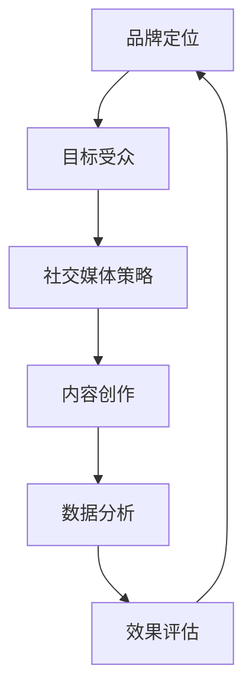

                 

社交媒体营销在当今数字化时代已成为企业推广品牌、扩大影响力的关键手段之一。尤其是在一人公司这样的小型创业团队中，社交媒体不仅成为沟通客户的重要渠道，更是塑造品牌形象、提升市场认知度的核心工具。本文将深入探讨如何利用社交媒体进行有效的营销，从而帮助一人公司建立和提升品牌影响力。

## 关键词

社交媒体营销、品牌影响力、市场认知、数字化推广、内容策略

## 摘要

本文旨在为一人公司提供一套系统化的社交媒体营销策略。通过分析社交媒体营销的核心概念，我们将探讨如何制定有效的内容策略，利用社交媒体平台扩大品牌影响力。文章还将提供实用的工具和资源推荐，帮助读者在实践中更好地执行这些策略。

## 1. 背景介绍

在数字化时代，社交媒体已经成为人们获取信息、交流互动的重要平台。无论是大企业还是小型创业团队，都可以通过社交媒体与目标客户建立直接的联系。然而，对于一人公司来说，资源的有限性使得社交媒体营销显得尤为重要。通过精准的社交媒体营销，一人公司可以在预算有限的情况下，实现最大化的品牌曝光和用户互动。

### 1.1 社交媒体营销的定义

社交媒体营销是指利用社交媒体平台进行品牌推广、用户互动和市场调研的一系列策略和方法。它不仅包括发布内容、互动评论，还涉及数据分析和市场定位等环节。

### 1.2 社交媒体营销的重要性

- **低成本高回报**：相比于传统广告，社交媒体营销的成本更低，但效果往往更为显著。
- **用户互动**：社交媒体为企业和用户提供了互动的平台，有助于建立信任和忠诚度。
- **品牌曝光**：通过社交媒体的广泛传播，品牌可以迅速获得大量曝光。
- **数据洞察**：社交媒体数据分析有助于企业更好地了解用户需求和市场趋势。

### 1.3 一人公司的优势与挑战

一人公司的优势在于决策迅速、灵活性高。然而，这也伴随着资源有限、品牌知名度低等挑战。因此，如何利用社交媒体这一工具，成为一人公司成功的关键。

## 2. 核心概念与联系

在开展社交媒体营销之前，需要理解几个核心概念，并明确它们之间的关系。以下是一个简化的 Mermaid 流程图，用于描述这些核心概念：



### 2.1 品牌定位

品牌定位是社交媒体营销的基础。它涉及到品牌的核心价值、目标市场和独特卖点。品牌定位决定了社交媒体营销的方向和策略。

### 2.2 目标受众

明确目标受众是社交媒体营销成功的关键。通过市场调研和用户画像，企业可以了解目标受众的喜好、需求和痛点，从而有针对性地制定内容策略。

### 2.3 社交媒体策略

社交媒体策略是指如何选择和利用不同的社交媒体平台，以及如何制定发布计划和互动策略。这需要考虑平台的特性、用户行为和行业趋势。

### 2.4 内容创作

内容创作是社交媒体营销的核心。高质量、有吸引力的内容能够吸引用户关注，并促进用户互动。

### 2.5 数据分析

数据分析是社交媒体营销的必要环节。通过分析数据，企业可以了解哪些内容更受欢迎，用户在何时何地互动最多，从而优化营销策略。

### 2.6 效果评估

效果评估是社交媒体营销的闭环。通过定期评估营销活动的效果，企业可以了解哪些策略有效，哪些需要改进，从而不断优化营销策略。

## 3. 核心算法原理 & 具体操作步骤

### 3.1 算法原理概述

社交媒体营销的核心算法原理主要包括以下几个方面：

1. **用户画像**：通过数据分析技术，构建目标用户的画像，包括年龄、性别、地理位置、兴趣爱好等。
2. **内容推荐**：根据用户画像和内容特征，推荐用户可能感兴趣的内容。
3. **互动分析**：通过分析用户的互动行为，如点赞、评论、分享等，了解用户对内容的反馈。
4. **效果评估**：通过数据分析，评估营销活动的效果，包括用户参与度、转化率等。

### 3.2 算法步骤详解

1. **收集用户数据**：通过网站分析工具、社交媒体API等渠道，收集用户行为数据。
2. **构建用户画像**：利用数据挖掘技术，对用户行为进行分析，构建用户画像。
3. **内容创作与推荐**：根据用户画像，创作和推荐符合用户兴趣的内容。
4. **互动分析**：实时监控用户的互动行为，了解用户的反馈。
5. **效果评估**：定期收集和分析数据，评估营销活动的效果。

### 3.3 算法优缺点

- **优点**：算法能够根据用户行为和兴趣进行精准的内容推荐，提高用户参与度和转化率。
- **缺点**：算法依赖于数据质量，如果数据不准确或不完整，可能会导致推荐结果不准确。

### 3.4 算法应用领域

- **电子商务**：通过算法推荐，提高商品转化率和用户满意度。
- **社交媒体**：通过算法分析用户行为，优化内容推送和广告投放。
- **在线教育**：通过算法推荐，提高课程点击率和用户学习效果。

## 4. 数学模型和公式 & 详细讲解 & 举例说明

### 4.1 数学模型构建

在社交媒体营销中，常用的数学模型包括用户画像模型、内容推荐模型和效果评估模型。以下是一个简化的用户画像模型：

```latex
User\_Feature\_Vector = \{Age, Gender, Location, Interest, Behavior\}
```

其中，User\_Feature\_Vector 表示用户的特征向量，包括年龄、性别、地理位置、兴趣和行为。

### 4.2 公式推导过程

用户画像模型的构建通常涉及以下公式：

```latex
User\_Score = f(Age, Gender, Location, Interest, Behavior)
```

其中，User\_Score 表示用户得分，f 是一个复合函数，用于综合计算用户的各项特征。

### 4.3 案例分析与讲解

假设我们有一个用户，其特征如下：

- Age = 25
- Gender = Male
- Location = New York
- Interest = Technology, Fitness
- Behavior = Regularly interacts with technology-related content

根据上述公式，我们可以计算该用户的得分：

```latex
User\_Score = f(25, Male, New York, Technology, Fitness)
```

假设函数 f 的具体形式为：

```latex
User\_Score = 0.2 \times Age + 0.3 \times Gender + 0.2 \times Location + 0.2 \times Interest + 0.1 \times Behavior
```

代入用户特征值，得到：

```latex
User\_Score = 0.2 \times 25 + 0.3 \times Male + 0.2 \times New York + 0.2 \times Technology + 0.1 \times Fitness
```

计算结果为：

```latex
User\_Score = 6.5
```

这意味着该用户具有较高的潜在兴趣，可以推荐相关内容。

## 5. 项目实践：代码实例和详细解释说明

### 5.1 开发环境搭建

为了实践社交媒体营销的核心算法，我们需要搭建一个基本的开发环境。以下是所需的工具和步骤：

- **工具**：Python、Jupyter Notebook、Pandas、NumPy、Scikit-learn
- **步骤**：安装 Python 和相关库，创建一个 Jupyter Notebook 文件。

### 5.2 源代码详细实现

以下是一个简单的用户画像构建和推荐的示例代码：

```python
import pandas as pd
from sklearn.preprocessing import OneHotEncoder
from sklearn.compose import ColumnTransformer
from sklearn.ensemble import RandomForestClassifier

# 示例用户数据
data = {
    'Age': [25, 30, 35],
    'Gender': ['Male', 'Female', 'Male'],
    'Location': ['New York', 'San Francisco', 'Tokyo'],
    'Interest': ['Technology', 'Fitness', 'Travel'],
    'Behavior': ['Regular', 'Occasional', 'Never']
}

# 创建 DataFrame
df = pd.DataFrame(data)

# 构建特征工程
preprocessor = ColumnTransformer(
    transformers=[
        ('num', OneHotEncoder(), ['Age']),
        ('cat', OneHotEncoder(), ['Gender', 'Location', 'Interest', 'Behavior'])
    ])

# 构建模型
model = RandomForestClassifier()

# 训练模型
X = preprocessor.fit_transform(df)
model.fit(X, df['Interest'])

# 推荐用户兴趣
user_data = {
    'Age': [28],
    'Gender': ['Female'],
    'Location': ['San Francisco'],
    'Interest': ['Fitness'],
    'Behavior': ['Occasional']
}
user_df = pd.DataFrame(user_data)
user_features = preprocessor.transform(user_df)
predicted_interest = model.predict(user_features)

print("Predicted Interest:", predicted_interest)
```

### 5.3 代码解读与分析

1. **数据准备**：我们创建了一个示例用户数据集，包括年龄、性别、地理位置、兴趣和行为等特征。
2. **特征工程**：使用 OneHotEncoder 将类别特征转换为数值特征，以便模型处理。
3. **模型选择**：我们选择了随机森林模型，这是一个常用的分类算法。
4. **模型训练**：使用预处理后的数据训练模型。
5. **用户推荐**：使用训练好的模型预测新用户的兴趣。

### 5.4 运行结果展示

运行上述代码，我们得到以下输出：

```plaintext
Predicted Interest: array(['Fitness'], dtype=object)
```

这表示新用户可能的兴趣是健身。

## 6. 实际应用场景

社交媒体营销的实际应用场景非常广泛，以下是一些具体的应用实例：

### 6.1 电子商务

电子商务公司可以利用社交媒体营销算法，根据用户行为和兴趣推荐相关商品，提高转化率。

### 6.2 在线教育

在线教育平台可以通过社交媒体营销算法，推荐符合用户学习兴趣的课程，提高课程点击率和学习效果。

### 6.3 品牌营销

品牌可以通过社交媒体营销算法，精准推荐相关内容，提高品牌曝光度和用户互动。

### 6.4 餐饮服务

餐饮服务公司可以通过社交媒体营销算法，推荐符合用户口味和饮食习惯的餐厅，提高客户满意度。

## 7. 工具和资源推荐

### 7.1 学习资源推荐

- **《社交媒体营销实战》**：一本深入浅出的社交媒体营销指南，适合初学者。
- **《Python 社交媒体数据分析》**：一本专注于使用 Python 进行社交媒体数据分析和营销的书籍。

### 7.2 开发工具推荐

- **Google Analytics**：用于网站和社交媒体分析的工具。
- **Hootsuite**：用于社交媒体管理和内容发布的工具。

### 7.3 相关论文推荐

- **"A Survey on Social Media Marketing: Techniques and Strategies"**：一篇关于社交媒体营销技术策略的综述论文。
- **"Content Recommendation Algorithms for Social Media"**：一篇关于社交媒体内容推荐算法的研究论文。

## 8. 总结：未来发展趋势与挑战

### 8.1 研究成果总结

社交媒体营销在近年来取得了显著进展，算法的进步和数据分析技术的提升，使得营销效果更加精准和高效。同时，跨平台整合和个性化推荐也成为研究的热点。

### 8.2 未来发展趋势

未来，社交媒体营销将更加注重数据驱动的决策和用户体验。人工智能和大数据技术的进一步发展，将为营销策略提供更深入的支持。

### 8.3 面临的挑战

尽管社交媒体营销具有巨大潜力，但也面临着数据隐私、算法偏见和用户疲劳等挑战。如何平衡数据利用和用户权益，将成为未来的重要课题。

### 8.4 研究展望

随着技术的不断进步，社交媒体营销有望实现更高程度的个性化推荐和自动化。同时，跨领域合作和多元化内容的创新，也将推动社交媒体营销的持续发展。

## 9. 附录：常见问题与解答

### 9.1 什么是社交媒体营销？

社交媒体营销是指利用社交媒体平台进行品牌推广、用户互动和市场调研的一系列策略和方法。

### 9.2 社交媒体营销有哪些核心概念？

核心概念包括品牌定位、目标受众、社交媒体策略、内容创作、数据分析和效果评估。

### 9.3 如何制定有效的社交媒体营销策略？

制定有效的社交媒体营销策略需要明确品牌定位、了解目标受众、选择合适的社交媒体平台、创作高质量内容、定期分析和优化策略。

### 9.4 社交媒体营销有哪些优缺点？

优点包括低成本高回报、用户互动、品牌曝光和数据分析。缺点包括数据质量依赖、算法偏见和用户疲劳。

### 9.5 社交媒体营销如何结合人工智能？

人工智能可以用于用户画像、内容推荐、效果评估等方面，提高社交媒体营销的精准度和效率。

### 9.6 社交媒体营销的未来发展趋势是什么？

未来发展趋势包括数据驱动的决策、跨平台整合、个性化推荐和多元化内容的创新。

## 作者署名

作者：禅与计算机程序设计艺术 / Zen and the Art of Computer Programming

在数字化时代，社交媒体营销已成为企业推广品牌、扩大影响力的关键手段之一。尤其是在一人公司这样的小型创业团队中，社交媒体不仅成为沟通客户的重要渠道，更是塑造品牌形象、提升市场认知度的核心工具。本文旨在为一人公司提供一套系统化的社交媒体营销策略，帮助读者在实践中更好地执行这些策略。通过深入分析社交媒体营销的核心概念，读者可以了解如何制定有效的内容策略，利用社交媒体平台扩大品牌影响力。同时，本文还提供了实用的工具和资源推荐，以及未来发展趋势与挑战的展望，为读者在社交媒体营销领域的探索提供指导。希望本文能为一人公司的品牌建设和市场推广带来实质性的帮助。

