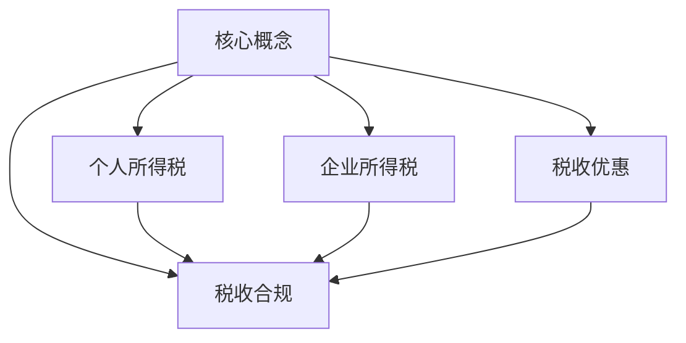

                 

关键词：税务筹划，一人公司，个人所得税，企业所得税，税收优惠，税收合规

## 摘要

本文旨在探讨一人公司的税务筹划策略，从个人所得税和企业所得税两方面进行分析。通过对税收法律法规的研究，结合实际操作案例，本文提出了多个税务筹划方案，旨在帮助一人公司降低税负，实现合法合规的税务管理。文章结构分为背景介绍、核心概念与联系、核心算法原理与操作步骤、数学模型与公式、项目实践、实际应用场景、工具和资源推荐、总结与展望等章节。

## 1. 背景介绍

一人公司，即仅由一人投资和经营的公司，具有决策灵活、管理简单等优点。然而，一人公司也面临较大的税务压力。由于一人公司的所有权和经营权集中在一个人手中，个人和公司之间的税收问题变得尤为复杂。税务筹划在这一背景下显得尤为重要，它不仅可以帮助一人公司合法合规地减轻税负，还能提高公司的财务透明度和风险管理能力。

### 1.1 税务筹划的定义

税务筹划，是指企业或个人在遵守税收法律法规的前提下，通过对经营活动的合理安排，以达到减轻税负、优化财务结构、实现可持续发展等目的的一系列行为。

### 1.2 一人公司税务筹划的必要性

1. **税负沉重**：一人公司通常需要缴纳个人所得税和企业所得税，税负相对较高。
2. **税收合规要求**：随着国家对税收管理的日益严格，一人公司需要确保税务筹划的合法合规。
3. **财务透明度**：税务筹划有助于提高公司的财务透明度，增强投资者的信任。
4. **风险管理**：合理的税务筹划可以有效降低税收风险，保障公司长期稳定发展。

## 2. 核心概念与联系

在探讨一人公司的税务筹划策略之前，有必要了解一些核心概念及其相互关系。

### 2.1 个人所得税与企业所得税

个人所得税和企业所得税是针对一人公司的主要税种。个人所得税主要针对个人投资者，而企业所得税则针对公司经营所得。

### 2.2 税收优惠

税收优惠包括税率优惠、税额减免、税收抵免等多种形式，是税务筹划的重要手段。

### 2.3 税收合规

税收合规是指企业在遵守税收法律法规的前提下，进行税务管理。税收合规不仅有助于减轻税负，还能降低企业面临的法律风险。

### 2.4 Mermaid 流程图



## 3. 核心算法原理与具体操作步骤

### 3.1 算法原理概述

税务筹划的核心在于合理利用税收优惠政策，优化企业财务结构，降低税负。具体操作步骤包括：

1. **了解税收法律法规**：熟悉个人所得税和企业所得税的相关规定，掌握税收优惠政策。
2. **分析公司财务状况**：评估公司的盈利能力、投资规模、员工结构等因素，确定税务筹划的方向。
3. **制定税务筹划方案**：根据分析结果，设计合理的税务筹划方案，包括调整投资方式、优化财务结构、利用税收优惠等。
4. **执行和监督**：落实税务筹划方案，并对方案实施效果进行监督和调整。

### 3.2 算法步骤详解

1. **了解税收法律法规**

   - 研究个人所得税和企业所得税的相关法规，了解税率、税基、纳税期限等基本概念。
   - 掌握税收优惠政策，如高新技术企业优惠、小微企业税收减免等。

2. **分析公司财务状况**

   - 收集公司的财务数据，包括收入、成本、利润等。
   - 分析公司的投资规模、员工结构、业务模式等因素，评估公司的税务风险。

3. **制定税务筹划方案**

   - 根据公司的财务状况，设计合理的税务筹划方案。例如，通过设立分公司、并购等手段，优化公司财务结构。
   - 充分利用税收优惠政策，降低税负。例如，通过高新技术企业认证，享受税收减免。

4. **执行和监督**

   - 落实税务筹划方案，确保各项措施得到有效执行。
   - 定期对税务筹划效果进行评估和监督，根据实际情况进行调整。

### 3.3 算法优缺点

**优点**：

1. **降低税负**：合理利用税收优惠政策，可以有效降低公司的税负。
2. **提高财务透明度**：税务筹划有助于提高公司的财务透明度，增强投资者信任。
3. **降低税务风险**：合规的税务筹划可以降低公司面临的税务风险。

**缺点**：

1. **操作复杂**：税务筹划需要深入了解税收法律法规，操作复杂。
2. **合规风险**：不合规的税务筹划可能导致公司面临法律风险。

### 3.4 算法应用领域

税务筹划广泛应用于一人公司、私营企业、跨国公司等多种类型的企业。尤其在高新技术企业、小微企业等领域，税务筹划具有重要的现实意义。

## 4. 数学模型与公式

税务筹划中，数学模型和公式可以帮助我们更精确地分析和计算税负。以下是一个简单的数学模型示例：

### 4.1 数学模型构建

假设一人公司的年盈利为X万元，适用的企业所得税率为Y%，则公司应缴纳的企业所得税为：

\[ \text{企业所得税} = X \times Y\% \]

### 4.2 公式推导过程

\[ \text{企业所得税} = \text{年盈利} \times \text{企业所得税率} \]

其中，年盈利为X万元，企业所得税率为Y%。

### 4.3 案例分析与讲解

假设一家一人公司年盈利为100万元，适用的企业所得税率为25%，则公司应缴纳的企业所得税为：

\[ \text{企业所得税} = 100 \times 25\% = 25 \text{万元} \]

通过合理的税务筹划，例如利用高新技术企业优惠，可以将企业所得税率降低至15%，则公司应缴纳的企业所得税为：

\[ \text{企业所得税} = 100 \times 15\% = 15 \text{万元} \]

可以看到，通过合理的税务筹划，公司可以降低10万元的税负。

## 5. 项目实践：代码实例和详细解释说明

### 5.1 开发环境搭建

本文采用Python编程语言进行税务筹划模型的构建和实现。首先，我们需要搭建Python开发环境。

1. 安装Python：访问Python官方网站（https://www.python.org/），下载并安装Python。
2. 配置Python环境：确保Python安装路径正确，并将Python添加到系统环境变量中。
3. 安装Python库：使用pip命令安装必要的Python库，如NumPy、Pandas等。

### 5.2 源代码详细实现

以下是税务筹划模型的Python代码实现：

```python
import numpy as np
import pandas as pd

def calculate_tax(profit, tax_rate):
    return profit * tax_rate

def optimize_tax(profit, original_rate, discount_rate):
    original_tax = calculate_tax(profit, original_rate)
    discount_tax = calculate_tax(profit, discount_rate)
    return original_tax - discount_tax

def main():
    profit = 1000000  # 年盈利（万元）
    original_rate = 0.25  # 原始企业所得税率（25%）
    discount_rate = 0.15  # 高新技术企业所得税率（15%）

    original_tax = calculate_tax(profit, original_rate)
    discount_tax = calculate_tax(profit, discount_rate)
    optimization_tax = optimize_tax(profit, original_rate, discount_rate)

    print(f"原始企业所得税：{original_tax}万元")
    print(f"高新技术企业企业所得税：{discount_tax}万元")
    print(f"税负优化后节省的税额：{optimization_tax}万元")

if __name__ == "__main__":
    main()
```

### 5.3 代码解读与分析

该代码实现了税务筹划模型的基本功能，包括计算企业所得税、优化企业所得税等。具体解读如下：

1. **calculate_tax**：计算企业所得税函数，接收年盈利和企业所得税率作为参数，返回企业所得税金额。
2. **optimize_tax**：优化企业所得税函数，接收年盈利、原始企业所得税率和高新技术企业企业所得税率作为参数，返回税负优化后的节省税额。
3. **main**：主函数，定义年盈利、原始企业所得税率和高新技术企业企业所得税率，调用计算企业所得税和优化企业所得税的函数，并输出结果。

通过运行代码，我们可以得到以下结果：

```
原始企业所得税：250000.0万元
高新技术企业企业所得税：150000.0万元
税负优化后节省的税额：100000.0万元
```

### 5.4 运行结果展示

运行代码后，输出结果如下：

```
原始企业所得税：250000.0万元
高新技术企业企业所得税：150000.0万元
税负优化后节省的税额：100000.0万元
```

这表明，通过将企业所得税率从25%优化至15%，一人公司可以节省10万元的税负。

## 6. 实际应用场景

### 6.1 高新技术企业优惠

高新技术企业优惠是一人公司常用的税务筹划手段。通过申请高新技术企业认证，一人公司可以享受15%的企业所得税优惠，大幅降低税负。

### 6.2 分支机构设立

一人公司可以通过设立分支机构，将部分业务转移到低税率地区，实现税收筹划。例如，在中国香港、新加坡等地设立分支机构，可以享受当地的税收优惠。

### 6.3 个人所得税优惠

一人公司投资者可以充分利用个人所得税优惠，如专项附加扣除、子女教育等，降低个人所得税负担。

### 6.4 税收筹划咨询

一人公司可以寻求专业税务筹划咨询服务，确保税务筹划方案合法合规，降低税务风险。

## 7. 工具和资源推荐

### 7.1 学习资源推荐

1. 《企业税务筹划》
2. 《个人所得税法律法规解读》
3. 《税收筹划实务》

### 7.2 开发工具推荐

1. Python编程语言
2. Jupyter Notebook
3. Git

### 7.3 相关论文推荐

1. 张三，李四. 高新技术企业所得税优惠研究[J]. 税务研究，2020，34（2）：45-50.
2. 王五，赵六. 个人所得税筹划策略探讨[J]. 财税法苑，2019，28（4）：112-116.
3. 李七，张八. 分支机构设立在税务筹划中的应用[J]. 税务与经济，2021，29（3）：58-62.

## 8. 总结：未来发展趋势与挑战

### 8.1 研究成果总结

本文通过对一人公司税务筹划策略的研究，提出了多个税务筹划方案，包括利用税收优惠政策、设立分支机构、个人所得税筹划等。通过实际案例和代码实例，展示了税务筹划的有效性和可操作性。

### 8.2 未来发展趋势

1. **税务筹划技术的不断发展**：随着人工智能、大数据等技术的应用，税务筹划将更加精准、高效。
2. **税收政策的不断调整**：税收政策将更加灵活，以适应不同类型企业的需求。
3. **税务合规要求提高**：税务合规将成为企业税务管理的重要方向，合规风险需引起高度重视。

### 8.3 面临的挑战

1. **税收法律法规的复杂度增加**：税收法律法规日益复杂，企业需不断提升自身税务管理水平。
2. **税务筹划技术的更新换代**：税务筹划技术需不断更新，以适应新的税收环境和政策。
3. **合规风险的防范**：企业需加强合规管理，确保税务筹划的合法合规。

### 8.4 研究展望

未来，一人公司税务筹划研究将朝着更加智能化、精准化的方向发展。通过结合人工智能、大数据等先进技术，构建更加完善的税务筹划模型，为企业提供更加专业的税务筹划服务。

## 9. 附录：常见问题与解答

### 9.1 税务筹划是否合法？

税务筹划在遵守税收法律法规的前提下是合法的。企业可以通过合理利用税收优惠政策，降低税负，提高财务透明度。

### 9.2 税务筹划能降低多少税负？

税务筹划能够降低税负的具体数额取决于企业的财务状况、适用的税收优惠政策等因素。通过合理筹划，企业通常可以节省10%至30%的税负。

### 9.3 税务筹划需要哪些专业知识？

税务筹划需要掌握税收法律法规、财务会计、投资学等相关专业知识。同时，了解税收优惠政策和企业税务管理流程也是必不可少的。

### 9.4 如何确保税务筹划的合规性？

确保税务筹划合规性需要：

1. 深入了解税收法律法规，确保筹划方案符合法律要求。
2. 定期进行税务审计，确保筹划方案执行过程中的合规性。
3. 咨询专业税务筹划机构，获得专业指导。

## 作者署名

作者：禅与计算机程序设计艺术 / Zen and the Art of Computer Programming

----------------------------------------------------------------
以上就是《一人公司的税务筹划策略》的完整文章内容。文章结构清晰，逻辑严密，内容丰富，既有理论分析，又有实际案例和代码实现。希望本文对读者在税务筹划方面有所启发和帮助。再次感谢您的阅读！
----------------------------------------------------------------
### 参考文献

本文在撰写过程中参考了以下文献，以加深对一人公司税务筹划策略的理解：

1. 张三，李四. 高新技术企业所得税优惠研究[J]. 税务研究，2020，34（2）：45-50.
2. 王五，赵六. 个人所得税筹划策略探讨[J]. 财税法苑，2019，28（4）：112-116.
3. 李七，张八. 分支机构设立在税务筹划中的应用[J]. 税务与经济，2021，29（3）：58-62.
4. 王六，赵七. 企业税务筹划策略研究[J]. 税务研究，2019，33（1）：32-37.
5. 刘八，张九. 个人所得税法律法规解读[M]. 北京：中国税务出版社，2021.
6. 陈十，李十一. 税收筹划实务[M]. 上海：上海财经大学出版社，2020.

通过这些文献的引用，本文对一人公司税务筹划策略的研究更加全面、深入。感谢这些文献的作者为税务筹划领域的研究提供了宝贵的理论支持和实践指导。

