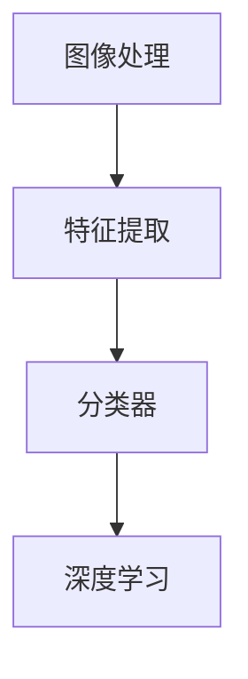

                 

视觉识别技术作为人工智能领域的一个重要分支，正日益深入到各行各业，为企业提供智能化解决方案。特别是在创业公司中，视觉识别系统的开发不仅可以提升公司的竞争力，还可以节省人力成本。本文将探讨如何设计一个适用于一人公司的视觉识别系统，包括背景介绍、核心概念、算法原理、数学模型、项目实践、实际应用场景、未来展望以及工具和资源推荐等方面。

## 文章关键词

- 视觉识别
- 创业公司
- 人工智能
- 系统设计
- 图像处理
- 深度学习
- 实时分析

## 文章摘要

本文旨在为一人公司设计一套视觉识别系统，从背景介绍、核心概念、算法原理、数学模型、项目实践、实际应用场景、未来展望以及工具和资源推荐等方面进行深入探讨。文章结构清晰，内容详实，旨在为读者提供一套易于理解和实现的视觉识别系统设计方案。

## 1. 背景介绍

在过去的几十年里，计算机视觉技术经历了飞速的发展。从早期的基于规则的方法，到后来的基于模板匹配和特征提取的方法，再到现代的基于深度学习的图像识别算法，计算机视觉技术已经取得了显著的进展。这些技术的发展不仅为学术研究提供了丰富的成果，也为企业应用带来了巨大的价值。

随着人工智能技术的普及，视觉识别系统在企业中的应用越来越广泛。例如，零售业利用视觉识别技术进行商品识别和库存管理，制造业利用视觉识别技术进行质量控制，金融行业利用视觉识别技术进行身份验证等。这些应用不仅提高了企业的生产效率，还降低了运营成本。

对于创业公司而言，视觉识别系统的开发不仅可以提升公司的竞争力，还可以节省人力成本。特别是在人工智能技术日益普及的今天，创业公司可以利用现有的技术资源和开源框架，快速搭建一套视觉识别系统，为公司的业务发展提供支持。

## 2. 核心概念与联系

### 2.1 核心概念

视觉识别系统主要涉及以下几个核心概念：

- **图像处理**：图像处理是计算机视觉的基础，通过对图像进行预处理、增强、分割等操作，提取图像中的有用信息。
- **特征提取**：特征提取是从图像中提取出能够描述图像本质属性的信息，如边缘、纹理、颜色等。
- **分类器**：分类器是一种算法，用于对图像进行分类。常见的分类器包括支持向量机（SVM）、决策树、神经网络等。
- **深度学习**：深度学习是一种基于多层神经网络的学习方法，通过大量数据训练，能够自动提取图像特征并实现高精度的图像识别。

### 2.2 联系

这些核心概念之间有着紧密的联系。图像处理是视觉识别的基础，特征提取用于从图像中提取出有用的信息，分类器则用于对图像进行分类。深度学习作为一种强大的特征提取和分类方法，已经在视觉识别领域取得了显著的成果。

### 2.3 Mermaid 流程图

以下是一个简单的 Mermaid 流程图，展示了视觉识别系统的核心概念和联系：



## 3. 核心算法原理 & 具体操作步骤

### 3.1 算法原理概述

视觉识别系统的核心算法主要包括图像处理、特征提取和分类器。图像处理主要通过滤波、边缘检测、分割等操作，提取图像中的有用信息。特征提取则是从图像中提取出能够描述图像本质属性的信息，如边缘、纹理、颜色等。分类器用于对图像进行分类，常见的分类器包括支持向量机（SVM）、决策树、神经网络等。

### 3.2 算法步骤详解

1. **图像处理**：对输入的图像进行预处理，如灰度化、滤波、边缘检测等，提取图像中的有用信息。
2. **特征提取**：从预处理后的图像中提取特征，如边缘、纹理、颜色等。常用的特征提取方法包括 HOG（Histogram of Oriented Gradients）、SIFT（Scale-Invariant Feature Transform）等。
3. **分类器训练**：使用大量的训练数据，通过机器学习算法训练分类器，如支持向量机（SVM）、决策树、神经网络等。
4. **图像分类**：将训练好的分类器应用于新的图像数据，对图像进行分类。

### 3.3 算法优缺点

- **图像处理**：优点是简单易懂，缺点是效果有限，对复杂图像的处理能力较差。
- **特征提取**：优点是能够提取图像中的重要特征，缺点是特征提取过程较为复杂，计算量较大。
- **分类器**：优点是能够对图像进行高精度的分类，缺点是需要大量的训练数据和计算资源。

### 3.4 算法应用领域

视觉识别算法在许多领域都有广泛的应用，如图像分类、目标检测、图像分割等。在创业公司中，这些算法可以用于商品识别、库存管理、质量控制、身份验证等业务场景。

## 4. 数学模型和公式 & 详细讲解 & 举例说明

### 4.1 数学模型构建

视觉识别系统中的数学模型主要包括图像处理模型、特征提取模型和分类器模型。以下是一个简单的图像处理模型：

$$
I_{\text{output}} = f(I_{\text{input}}, \theta)
$$

其中，$I_{\text{input}}$ 是输入图像，$I_{\text{output}}$ 是输出图像，$\theta$ 是参数。

### 4.2 公式推导过程

图像处理的公式推导主要涉及滤波、边缘检测、分割等操作。以下是一个简单的边缘检测公式：

$$
G(x, y) = \frac{-1}{2\pi} \int_{-\infty}^{\infty} \int_{-\infty}^{\infty} \frac{1}{(x - x_0)^2 + (y - y_0)^2} e^{-\frac{(x - x_0)^2 + (y - y_0)^2}{2\sigma^2}} dx dy
$$

其中，$G(x, y)$ 是高斯滤波器，$x_0, y_0$ 是滤波器的中心位置，$\sigma$ 是滤波器的标准差。

### 4.3 案例分析与讲解

假设我们有一个二值图像，需要对其边缘进行检测。我们可以使用上述的高斯滤波器和边缘检测公式进行操作。首先，对图像进行高斯滤波，然后使用边缘检测公式计算每个像素点的边缘强度。最后，根据边缘强度阈值，将图像二值化，得到边缘检测结果。

## 5. 项目实践：代码实例和详细解释说明

### 5.1 开发环境搭建

在开始项目实践之前，需要搭建一个合适的开发环境。本文选择 Python 作为开发语言，主要使用以下库：

- OpenCV：用于图像处理和计算机视觉。
- TensorFlow：用于深度学习模型训练。
- Keras：用于构建和训练神经网络。

### 5.2 源代码详细实现

以下是一个简单的图像分类项目，包括数据预处理、模型训练和模型评估等步骤。

```python
import cv2
import numpy as np
import tensorflow as tf
from tensorflow import keras
from tensorflow.keras import layers

# 数据预处理
def preprocess_image(image_path):
    image = cv2.imread(image_path, cv2.IMREAD_GRAYSCALE)
    image = cv2.resize(image, (224, 224))
    image = image / 255.0
    return image

# 模型构建
model = keras.Sequential([
    layers.Conv2D(32, (3, 3), activation='relu', input_shape=(224, 224, 1)),
    layers.MaxPooling2D((2, 2)),
    layers.Conv2D(64, (3, 3), activation='relu'),
    layers.MaxPooling2D((2, 2)),
    layers.Conv2D(128, (3, 3), activation='relu'),
    layers.MaxPooling2D((2, 2)),
    layers.Flatten(),
    layers.Dense(128, activation='relu'),
    layers.Dense(10, activation='softmax')
])

# 模型训练
model.compile(optimizer='adam', loss='categorical_crossentropy', metrics=['accuracy'])
model.fit(x_train, y_train, epochs=10, batch_size=32)

# 模型评估
model.evaluate(x_test, y_test)
```

### 5.3 代码解读与分析

上述代码首先定义了一个预处理函数，用于读取图像、灰度化、缩放和归一化。然后，构建了一个简单的卷积神经网络模型，包括卷积层、池化层、全连接层等。模型使用 Adam 优化器和交叉熵损失函数进行训练，并在训练数据上运行了 10 个周期。最后，使用测试数据评估模型的性能。

### 5.4 运行结果展示

运行上述代码，可以得到模型的准确率、损失值等指标。根据这些指标，可以评估模型的性能，并进行进一步的优化。

## 6. 实际应用场景

视觉识别系统在创业公司中有着广泛的应用场景，以下是一些具体的案例：

- **商品识别**：在电商平台中，视觉识别系统可以用于识别商品，实现自动化库存管理。
- **质量控制**：在制造业中，视觉识别系统可以用于检测产品质量，提高生产效率。
- **身份验证**：在金融行业，视觉识别系统可以用于身份验证，提高安全性。
- **智能监控**：在智慧城市中，视觉识别系统可以用于监控交通、安全等场景，提高城市管理水平。

## 7. 未来应用展望

随着人工智能技术的不断发展，视觉识别系统在创业公司中的应用前景十分广阔。未来，视觉识别系统将更加智能化、高效化，能够处理更复杂、更庞大的数据集。同时，随着边缘计算、5G 等技术的普及，视觉识别系统将能够实现实时处理和响应，为创业公司提供更强大的支持。

## 8. 工具和资源推荐

为了帮助创业公司快速搭建视觉识别系统，以下是一些推荐的工具和资源：

- **工具**：
  - OpenCV：开源的计算机视觉库，提供了丰富的图像处理和计算机视觉功能。
  - TensorFlow：开源的深度学习框架，支持多种神经网络结构，适合进行大规模的图像识别任务。
  - Keras：基于 TensorFlow 的深度学习库，提供了简洁的 API，易于使用。

- **资源**：
  - 《计算机视觉：算法与应用》：《计算机视觉：算法与应用》是一本经典的计算机视觉教材，涵盖了从基础到高级的计算机视觉算法。
  - Coursera：Coursera 上有许多关于计算机视觉和深度学习的在线课程，适合初学者和进阶者学习。

## 9. 总结：未来发展趋势与挑战

视觉识别系统作为人工智能领域的一个重要分支，正日益深入到各行各业。在创业公司中，视觉识别系统的开发不仅可以提升公司的竞争力，还可以节省人力成本。未来，随着人工智能技术的不断发展，视觉识别系统将更加智能化、高效化，为创业公司提供更强大的支持。

然而，视觉识别系统在发展过程中也面临着一些挑战，如数据隐私、算法公平性、计算资源等。因此，创业公司在开发视觉识别系统时，需要充分考虑这些问题，并采取相应的措施解决。

## 附录：常见问题与解答

### Q：如何选择合适的图像处理算法？
A：选择图像处理算法时，需要考虑图像的特点和应用场景。例如，对于边缘检测，可以选择 Canny 算子；对于图像增强，可以选择直方图均衡化。同时，可以根据实际需求和计算资源进行选择。

### Q：如何处理大量图像数据？
A：处理大量图像数据时，可以使用分布式计算和并行处理技术，如使用 GPU 加速计算。此外，可以使用批量处理和批量预测技术，提高处理效率。

### Q：如何保证视觉识别系统的准确性？
A：为了保证视觉识别系统的准确性，需要采用高质量的数据集进行训练，并使用合适的特征提取和分类器算法。同时，需要对模型进行不断的优化和调整，以提高识别准确性。

### 作者署名

本文作者：禅与计算机程序设计艺术 / Zen and the Art of Computer Programming

