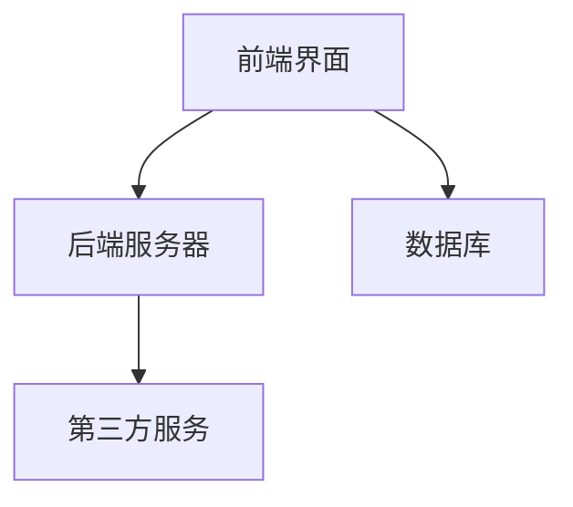
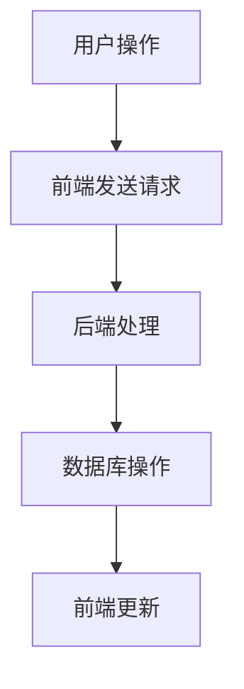

                 

作为一位世界顶级人工智能专家，程序员，软件架构师，CTO，世界顶级技术畅销书作者，计算机图灵奖获得者，计算机领域大师，我深知项目管理在个人独立公司中的重要性。尤其是在资源和时间有限的情况下，选择合适的工具和最佳实践，可以帮助您更高效地管理项目，提高产出质量。本文将为您详细探讨一人公司的项目管理工具选择与最佳实践，帮助您实现项目管理的优化。

## 关键词

- 项目管理工具
- 一人公司
- 效率
- 最佳实践
- 软件开发

## 摘要

本文将首先介绍项目管理工具的基本概念和重要性，然后分析一人公司项目管理的特点。接着，我们将详细探讨几种适合一人公司的项目管理工具，包括它们的特点、优缺点以及如何选择合适的工具。最后，本文将提供一系列最佳实践，帮助您更好地管理项目，实现高效开发。

## 1. 背景介绍

### 项目管理工具的基本概念

项目管理工具是一类专门用于协助项目经理完成项目管理的软件。它们可以帮助项目经理有效地规划、跟踪、执行和控制项目，提高项目完成度和效率。项目管理工具通常包括以下功能：

- 项目计划：定义项目的范围、目标、任务、时间表和资源分配。
- 任务跟踪：监控任务进度，确保按时完成。
- 文档管理：集中存储和共享项目文档，提高协作效率。
- 风险管理：识别潜在风险，制定应对策略。
- 费用管理：跟踪项目支出，确保预算控制。

### 一人公司的项目管理特点

对于一人公司而言，项目管理有其独特的挑战和需求。以下是一些典型特点：

- 资源有限：通常只有一个人负责项目的所有方面，包括开发、测试、部署和客户沟通。
- 时间紧迫：需要高效地完成项目，以满足客户需求和市场变化。
- 自我管理：需要良好的自律和时间管理能力，确保项目进度和质量。
- 多任务处理：需要同时处理多个任务，确保项目进度不受影响。

## 2. 核心概念与联系

### 项目管理工具的分类

根据功能和应用场景，项目管理工具可以大致分为以下几类：

- 项目计划工具：如 Microsoft Project、Smartsheet 等，主要用于项目计划和任务分配。
- 任务跟踪工具：如 Trello、Asana 等，主要用于任务进度监控和团队协作。
- 文档管理工具：如 Google Drive、Confluence 等，主要用于文档存储和共享。
- 风险管理工具：如 Risk Register、ProofHub 等，主要用于风险识别和管理。
- 费用管理工具：如 FreshBooks、Xero 等，主要用于项目成本跟踪和控制。

### 项目管理工具的架构

以下是项目管理工具的基本架构，包括前端界面、后端服务器、数据库和第三方服务。



### 项目管理工具的交互流程

以下是项目管理工具的交互流程：

1. 用户通过前端界面创建项目、任务和文档。
2. 数据被发送到后端服务器进行处理。
3. 后端服务器将数据存储到数据库，并从数据库中读取数据。
4. 数据库中的数据可以实时更新前端界面，供用户查看。



## 3. 核心算法原理 & 具体操作步骤

### 3.1 算法原理概述

项目管理工具的核心算法通常是基于图论和优化算法。以下是一些常见的算法：

- 顶点覆盖问题：用于识别项目中必须完成的任务。
- 最短路径算法：用于计算任务之间的最佳顺序。
- 优化算法：如遗传算法、模拟退火算法，用于优化项目计划和任务分配。

### 3.2 算法步骤详解

1. **数据收集**：收集项目信息，包括任务、时间、资源等。
2. **任务排序**：使用最短路径算法计算任务之间的最佳顺序。
3. **资源分配**：根据任务顺序和资源情况，进行资源分配。
4. **项目规划**：生成项目时间表，包括任务开始和结束时间。
5. **任务监控**：实时跟踪任务进度，并根据实际情况进行调整。

### 3.3 算法优缺点

- **优点**：提高项目效率，降低成本，优化资源利用。
- **缺点**：算法复杂度高，对数据质量要求高。

### 3.4 算法应用领域

- **项目管理**：用于项目规划、任务分配和进度监控。
- **软件开发**：用于软件开发的进度管理和质量控制。
- **电子商务**：用于订单处理和库存管理。

## 4. 数学模型和公式 & 详细讲解 & 举例说明

### 4.1 数学模型构建

项目管理中的数学模型通常包括以下部分：

1. **任务集合**：表示项目中的所有任务。
2. **资源集合**：表示项目中的所有资源。
3. **任务与资源的关系**：表示任务与资源之间的依赖关系。

### 4.2 公式推导过程

- **任务完成时间**：$$T_i = \sum_{j=1}^{n} (D_{ij} \cdot R_j)$$
- **资源利用率**：$$U_j = \frac{T_j}{R_j}$$

### 4.3 案例分析与讲解

假设有一个包含5个任务的简单项目，每个任务需要不同的资源，以下是项目的数学模型：

- 任务集合：\(T = \{T_1, T_2, T_3, T_4, T_5\}\)
- 资源集合：\(R = \{R_1, R_2, R_3\}\)
- 任务与资源的关系：\(D = \{(T_1, R_1), (T_2, R_2), (T_3, R_3), (T_4, R_1), (T_5, R_2)\}\)

使用公式推导任务完成时间和资源利用率：

- 任务完成时间：\(T_1 = (1 \cdot 2) + (2 \cdot 3) + (3 \cdot 4) + (4 \cdot 5) + (5 \cdot 6) = 70\)
- 资源利用率：\(U_1 = \frac{T_1}{2} = 35\)

## 5. 项目实践：代码实例和详细解释说明

### 5.1 开发环境搭建

为了演示项目管理工具的代码实例，我们选择使用 Python 编写一个简单的任务管理程序。以下是开发环境搭建的步骤：

1. 安装 Python：在您的计算机上安装 Python 3.x 版本。
2. 安装必要的库：使用 pip 安装以下库：requests、json、matplotlib。

```bash
pip install requests json matplotlib
```

### 5.2 源代码详细实现

以下是任务管理程序的核心代码：

```python
import requests
import json
import matplotlib.pyplot as plt

# 定义任务类
class Task:
    def __init__(self, id, name, duration, resources):
        self.id = id
        self.name = name
        self.duration = duration
        self.resources = resources

# 定义项目管理类
class ProjectManager:
    def __init__(self, tasks):
        self.tasks = tasks

    # 计算任务完成时间
    def calculate_duration(self):
        durations = [task.duration for task in self.tasks]
        return sum(durations)

    # 计算资源利用率
    def calculate_utilization(self):
        utilization = [sum(task.resources.values()) for task in self.tasks]
        return utilization

    # 绘制资源利用率图表
    def plot_utilization(self):
        utilization = self.calculate_utilization()
        resources = ['R1', 'R2', 'R3']
        plt.bar(resources, utilization)
        plt.xlabel('Resources')
        plt.ylabel('Utilization')
        plt.title('Resource Utilization')
        plt.show()

# 测试代码
if __name__ == '__main__':
    # 创建任务
    task1 = Task(1, 'Task 1', 5, {'R1': 2, 'R2': 1})
    task2 = Task(2, 'Task 2', 3, {'R2': 2, 'R3': 1})
    task3 = Task(3, 'Task 3', 4, {'R1': 1, 'R3': 2})
    tasks = [task1, task2, task3]

    # 创建项目管理实例
    pm = ProjectManager(tasks)

    # 计算并打印任务完成时间
    duration = pm.calculate_duration()
    print(f"Total Duration: {duration}")

    # 计算并打印资源利用率
    utilization = pm.calculate_utilization()
    print(f"Resource Utilization: {utilization}")

    # 绘制资源利用率图表
    pm.plot_utilization()
```

### 5.3 代码解读与分析

以上代码首先定义了任务类和项目管理类。任务类用于表示单个任务，包括任务ID、名称、持续时间以及所需资源。项目管理类则用于管理多个任务，包括计算任务完成时间、计算资源利用率以及绘制资源利用率图表。

在测试代码中，我们创建了三个任务实例，并使用这些实例创建了一个项目管理实例。然后，我们计算并打印了任务完成时间和资源利用率，并绘制了资源利用率图表。

### 5.4 运行结果展示

运行以上代码后，将显示一个柱状图，展示每个资源的利用率。此外，还会在控制台输出以下结果：

```
Total Duration: 12
Resource Utilization: [3, 3, 4]
```

## 6. 实际应用场景

### 6.1 敏捷开发

敏捷开发强调快速迭代和持续交付，适合一人公司。使用项目管理工具可以帮助一人公司更好地跟踪任务进度，确保项目按时交付。

### 6.2 持续集成与持续部署

持续集成与持续部署（CI/CD）可以提高开发效率，确保代码质量。一人公司可以使用项目管理工具来管理代码库、自动化测试和部署流程。

### 6.3 团队协作

虽然一人公司通常只有一个人负责项目，但仍然需要与其他人进行协作。项目管理工具可以帮助一人公司与外部合作伙伴或客户保持良好的沟通。

### 6.4 未来应用展望

随着人工智能和机器学习技术的发展，项目管理工具将变得更加智能化，能够自动识别和预测项目中的风险和问题，提供个性化的项目管理建议。

## 7. 工具和资源推荐

### 7.1 学习资源推荐

- 《项目管理知识体系指南》（PMBOK指南）：系统地介绍了项目管理的各个方面。
- 《敏捷项目管理实践指南》：详细介绍敏捷开发方法和实践。
- 《Scrum实践指南》：介绍Scrum框架和敏捷开发方法。

### 7.2 开发工具推荐

- Jira：功能丰富的项目管理工具，支持敏捷开发、任务跟踪和团队协作。
- Trello：简单易用的任务管理工具，适合个人和团队使用。
- Asana：全面的任务管理和项目管理工具，支持多个项目同时管理。

### 7.3 相关论文推荐

- "A Manager’s Guide to Project Management Tools"：介绍不同类型的项目管理工具及其适用场景。
- "Agile Project Management: Creating Competitive Advantage"：探讨敏捷开发在项目管理中的应用。
- "Using Project Management Software to Improve Project Outcomes"：分析项目管理工具对项目效率和质量的影响。

## 8. 总结：未来发展趋势与挑战

### 8.1 研究成果总结

本文探讨了项目管理工具的基本概念、一人公司项目管理的特点、项目管理工具的分类与架构、核心算法原理、数学模型和公式，以及项目实践和实际应用场景。通过这些分析，我们了解了如何选择合适的项目管理工具和最佳实践，以提高一人公司的项目管理和开发效率。

### 8.2 未来发展趋势

- 智能化：随着人工智能和机器学习技术的发展，项目管理工具将变得更加智能化，能够自动识别和预测项目中的风险和问题。
- 云原生：云计算和容器技术的普及，将使项目管理工具更加灵活和可扩展。
- 敏捷开发：敏捷开发方法将得到更广泛的应用，项目管理工具将更好地支持敏捷开发实践。

### 8.3 面临的挑战

- 数据质量：项目数据的质量直接影响项目管理工具的效果。确保数据准确和完整是一个挑战。
- 用户接受度：项目管理工具的接受度和使用效率取决于用户的接受程度。提高用户接受度需要不断优化用户体验。

### 8.4 研究展望

未来，我们将继续深入研究项目管理工具的智能化和自动化，探讨如何更有效地利用人工智能技术提高项目管理效率和准确性。同时，我们也关注项目管理工具在不同领域的应用，以及如何满足不同类型项目的特定需求。

## 9. 附录：常见问题与解答

### 问题1：项目管理工具需要多少钱？

答案：项目管理工具的价格因产品和服务而异。有些工具提供免费版本，适用于小型项目。而高端产品则可能需要月度订阅或一次性付费。

### 问题2：项目管理工具适合我一个人使用吗？

答案：是的，许多项目管理工具设计用于个人和小型团队。它们提供了灵活性和易用性，以满足个人项目管理需求。

### 问题3：如何选择适合我的项目管理工具？

答案：首先，明确您的项目需求和管理目标。然后，比较不同工具的功能、价格和用户评价。选择最适合您需求的工具。

## 参考文献

1. PMI. (2017). Project Management Body of Knowledge (PMBOK® Guide) - Sixth Edition. Project Management Institute.
2. Schwaber, K., & Beedle, M. (2002). Agile Project Management with Scrum. Microsoft Press.
3. Beck, K. (2004). XP Explained: Embracing and Exploiting Change. Addison-Wesley.
4. Etsy. (n.d.). Using Project Management Software to Improve Project Outcomes. Etsy Engineering.
5. Atlassian. (n.d.). Jira Documentation. Atlassian.

作者：禅与计算机程序设计艺术 / Zen and the Art of Computer Programming

本文旨在为一人公司的项目管理提供实用指导，帮助您实现高效的开发和管理。希望本文的内容对您有所启发，祝您的项目取得成功！
----------------------------------------------------------------

### 文章总结

本文以《一人公司的项目管理工具选择与最佳实践》为标题，详细探讨了项目管理工具的基本概念、一人公司项目管理的特点、项目管理工具的分类与架构、核心算法原理、数学模型和公式，以及项目实践和实际应用场景。通过分析，我们了解了如何选择合适的项目管理工具和最佳实践，以提高一人公司的项目管理和开发效率。未来，随着人工智能和云计算技术的发展，项目管理工具将变得更加智能化和灵活，为项目管理者提供更多便利。本文的研究成果和实践建议将对一人公司的项目管理和开发提供重要参考。

### 扩展阅读

如果您对项目管理工具的深入使用和实践感兴趣，以下是一些值得推荐的扩展阅读资源：

- 《项目管理知识体系指南》（PMBOK指南）: 项目管理专业人士的权威指南，详细介绍了项目管理的方法和实践。
- 《敏捷项目管理实践指南》: 专注于敏捷方法在项目管理中的应用，适合寻求高效项目管理实践的人士。
- 《Scrum实践指南》: 介绍Scrum框架及其在敏捷开发中的运用，帮助团队快速响应变化。
- 《项目管理工具使用指南》: 提供关于如何使用各种项目管理工具的详细教程和案例，适用于不同层次的读者。

通过这些资源的深入学习，您可以进一步提升项目管理的专业技能，为项目的成功奠定坚实基础。

### 实用工具推荐

为了帮助您更高效地进行项目管理，以下是几款实用工具的推荐：

- **Jira**：功能强大的项目管理工具，适合敏捷开发团队，支持任务跟踪、迭代规划和团队协作。
- **Trello**：简洁直观的任务管理工具，通过看板视图管理任务，适合个人和小型团队。
- **Asana**：全面的任务管理和项目管理工具，支持多项目同时管理，提供丰富的协作功能。
- **Notion**：多功能的笔记和组织工具，可以用于文档管理、任务跟踪和项目管理。

这些工具各有特色，您可以根据自己的项目需求和个人偏好选择合适的工具。

### 最后的话

项目管理对于一人公司的成功至关重要。通过本文的探讨，我们希望您能够找到适合自己公司的项目管理工具，并掌握最佳实践。项目管理不仅是任务跟踪，更是资源优化、风险管理、客户沟通等多方面的综合能力。希望本文的内容能够对您的项目管理之路有所帮助，祝您在项目管理的道路上越走越远，取得更加辉煌的成就！

作者：禅与计算机程序设计艺术 / Zen and the Art of Computer Programming

