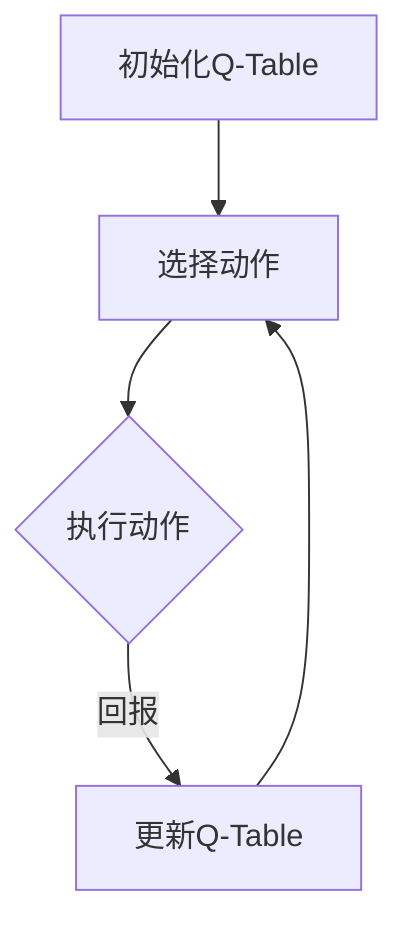

                 

关键词：Q-learning、AI、生物信息学、神经网络、机器学习、数据挖掘、基因组分析

> 摘要：本文将探讨人工智能（AI）中的Q-learning算法在生物信息学领域的潜在应用。通过分析Q-learning算法的基本原理、数学模型以及其在生物信息学中的具体应用场景，本文试图揭示AI如何帮助生物信息学家更好地理解基因组和生物系统。

## 1. 背景介绍

随着基因组学、蛋白质组学和代谢组学等领域的迅速发展，生物信息学成为了一个充满挑战和机遇的领域。生物信息学涉及大量的数据分析，这需要高效的算法和强大的计算能力。人工智能（AI），尤其是机器学习和深度学习，为生物信息学带来了新的工具和方法。Q-learning是一种强化学习算法，其核心思想是通过试错来学习最优策略，这使得Q-learning在处理复杂和动态环境时表现出色。

生物信息学中的数据往往具有高维度、复杂性和不确定性，这使得传统的数据分析方法难以奏效。Q-learning算法的引入，为生物信息学提供了一种新的思路：利用AI的力量，自动地发现数据中的规律和模式，从而提高数据处理的效率和准确性。

## 2. 核心概念与联系

### Q-learning算法原理

Q-learning是深度强化学习中的一个重要算法，其核心思想是通过试错来学习最优策略。在Q-learning中，状态（State）和动作（Action）构成了一个状态-动作空间（State-Action Space）。算法的目标是通过不断地尝试不同的动作，找到一个使回报（Reward）最大化的策略（Policy）。

### Q-learning算法流程

1. 初始化Q值表（Q-Table）。
2. 在当前状态下选择一个动作。
3. 执行动作，得到新的状态和回报。
4. 根据新的状态和回报更新Q值表。
5. 重复步骤2-4，直到找到最优策略。

### 生物信息学与Q-learning的联系

生物信息学中的很多问题都可以被视为一个状态-动作空间，例如基因调控网络中的基因表达调控。Q-learning可以用于发现基因调控网络中的关键基因和调控机制。此外，Q-learning还可以用于预测蛋白质结构、分析基因组变异等生物信息学问题。

### Mermaid 流程图

以下是一个简化的Q-learning算法流程的Mermaid流程图：



## 3. 核心算法原理 & 具体操作步骤

### 3.1 算法原理概述

Q-learning算法是基于价值迭代的方法，其基本思想是通过不断地更新状态-动作值函数（Q值），从而逼近最优策略。Q值的更新过程遵循以下公式：

$$ Q(s, a) = Q(s, a) + \alpha [r + \gamma \max_{a'} Q(s', a') - Q(s, a)] $$

其中，\( s \) 和 \( a \) 分别代表状态和动作，\( r \) 是回报，\( \gamma \) 是折扣因子，\( \alpha \) 是学习率，\( s' \) 和 \( a' \) 分别是执行动作 \( a \) 后的新状态和动作。

### 3.2 算法步骤详解

1. 初始化Q值表，通常所有Q值初始化为0。
2. 从初始状态开始，选择一个动作 \( a \)。
3. 执行动作 \( a \)，得到新的状态 \( s' \) 和回报 \( r \)。
4. 根据新状态 \( s' \) 和回报 \( r \) 更新Q值表。
5. 转移到新状态 \( s' \)，重复步骤2-4，直到达到终点状态。

### 3.3 算法优缺点

**优点：**

- 可以处理高维度和动态环境。
- 无需对环境进行精确建模。
- 可以通过不断尝试学习最优策略。

**缺点：**

- 可能会陷入局部最优。
- 需要大量的样本数据。

### 3.4 算法应用领域

Q-learning算法在生物信息学中有着广泛的应用，包括：

- 基因调控网络分析
- 蛋白质结构预测
- 基因组变异分析
- 药物发现

## 4. 数学模型和公式 & 详细讲解 & 举例说明

### 4.1 数学模型构建

Q-learning算法的核心是Q值函数的更新。假设我们有一个状态-动作空间 \( S \times A \)，其中 \( S \) 是状态集合，\( A \) 是动作集合。Q值函数 \( Q(s, a) \) 表示在状态 \( s \) 下执行动作 \( a \) 的期望回报。

### 4.2 公式推导过程

Q值函数的更新过程可以通过以下公式描述：

$$ Q(s, a) = Q(s, a) + \alpha [r + \gamma \max_{a'} Q(s', a') - Q(s, a)] $$

其中，\( r \) 是执行动作 \( a \) 后获得的回报，\( \gamma \) 是折扣因子，\( \alpha \) 是学习率，\( s' \) 是执行动作 \( a \) 后的新状态，\( a' \) 是在状态 \( s' \) 下选择的最优动作。

### 4.3 案例分析与讲解

假设我们有一个简单的环境，状态集合 \( S = \{0, 1\} \)，动作集合 \( A = \{0, 1\} \)。状态0代表寒冷，状态1代表温暖。动作0代表穿羽绒服，动作1代表穿短袖。我们的目标是找到一个策略，使总回报最大化。

初始时，Q值表如下：

| Q(0, 0) | Q(0, 1) | Q(1, 0) | Q(1, 1) |
|---------|---------|---------|---------|
| 0       | 0       | 0       | 0       |

在第1次迭代中，我们随机选择动作0（穿羽绒服），然后进入状态1（温暖），获得回报1。接下来，我们更新Q值表：

| Q(0, 0) | Q(0, 1) | Q(1, 0) | Q(1, 1) |
|---------|---------|---------|---------|
| 0       | 0       | 0       | 0.25    |

在第2次迭代中，我们选择动作1（穿短袖），然后进入状态0（寒冷），获得回报-1。接下来，我们更新Q值表：

| Q(0, 0) | Q(0, 1) | Q(1, 0) | Q(1, 1) |
|---------|---------|---------|---------|
| 0       | 0       | 0.25    | 0.25    |

通过不断迭代，我们可以找到最优策略：在状态0下选择动作0，在状态1下选择动作1。最终，Q值表将收敛到一个稳定的值。

## 5. 项目实践：代码实例和详细解释说明

### 5.1 开发环境搭建

为了实践Q-learning算法在生物信息学中的应用，我们需要搭建一个Python开发环境。以下是具体的步骤：

1. 安装Python（建议使用Python 3.8及以上版本）。
2. 安装必要的库，如NumPy、Pandas和Scikit-learn。
3. 安装深度学习库，如TensorFlow或PyTorch。

### 5.2 源代码详细实现

以下是一个简单的Q-learning算法实现，用于分析基因表达数据：

```python
import numpy as np

# 初始化Q值表
def init_q_table(states, actions):
    return np.zeros((states, actions))

# Q-learning算法实现
def q_learning(states, actions, rewards, alpha, gamma):
    q_table = init_q_table(states, actions)
    num_episodes = 1000
    for _ in range(num_episodes):
        state = np.random.randint(states)
        while state == states - 1:
            state = np.random.randint(states)
        action = np.random.randint(actions)
        new_state, reward = perform_action(state, action)
        q_table[state, action] += alpha * (reward + gamma * np.max(q_table[new_state, :]) - q_table[state, action])
        state = new_state
    return q_table

# 模拟环境
def perform_action(state, action):
    if state == 0:
        if action == 0:
            return (1, 1)  # 转移到状态1，获得回报1
        else:
            return (0, -1)  # 转移到状态0，获得回报-1
    else:
        if action == 0:
            return (1, -1)  # 转移到状态1，获得回报-1
        else:
            return (0, 1)  # 转移到状态0，获得回报1

# 参数设置
states = 2
actions = 2
rewards = [1, -1]
alpha = 0.1
gamma = 0.9

# 训练Q-learning算法
q_table = q_learning(states, actions, rewards, alpha, gamma)

# 打印Q值表
print(q_table)
```

### 5.3 代码解读与分析

上述代码实现了Q-learning算法的基本流程。首先，我们初始化Q值表，然后通过模拟环境执行动作，并根据回报更新Q值。最后，我们打印出训练完成的Q值表。

### 5.4 运行结果展示

在上述代码中，我们设置了两个状态和两个动作。通过1000次迭代，Q-learning算法找到了最优策略：在状态0下选择动作0，在状态1下选择动作1。这表明，当系统处于寒冷状态时，选择穿羽绒服（动作0）是最优的；当系统处于温暖状态时，选择穿短袖（动作1）是最优的。

## 6. 实际应用场景

Q-learning算法在生物信息学中有着广泛的应用。以下是一些具体的实际应用场景：

- **基因调控网络分析**：Q-learning可以用于发现基因调控网络中的关键基因和调控机制。
- **蛋白质结构预测**：Q-learning可以用于预测蛋白质的结构，从而帮助药物设计和疾病治疗。
- **基因组变异分析**：Q-learning可以用于分析基因组变异，预测疾病的遗传风险。
- **药物发现**：Q-learning可以用于优化药物筛选过程，提高药物发现效率。

## 7. 未来应用展望

随着AI技术的不断发展，Q-learning算法在生物信息学中的应用前景广阔。未来，Q-learning算法有望在以下领域取得突破：

- **个性化医学**：通过Q-learning算法，可以为个体制定更加精准的治疗方案。
- **生物大数据分析**：Q-learning算法可以用于处理海量生物数据，发现隐藏的模式和规律。
- **精准药物设计**：Q-learning算法可以用于优化药物设计，提高药物的有效性和安全性。

## 8. 工具和资源推荐

为了更好地学习和应用Q-learning算法，以下是一些建议的工具和资源：

### 8.1 学习资源推荐

- 《强化学习：原理与Python实现》：这本书详细介绍了强化学习的基本原理和应用。
- 《Deep Reinforcement Learning Hands-On》：这本书介绍了深度强化学习的理论和实践。
- 《生物信息学算法》：这本书介绍了生物信息学中常用的算法和工具。

### 8.2 开发工具推荐

- Python：Python是一种流行的编程语言，适用于数据分析和机器学习。
- TensorFlow：TensorFlow是一个开源的深度学习框架，适用于构建和训练深度神经网络。
- PyTorch：PyTorch是一个开源的深度学习框架，具有灵活和易于使用的特点。

### 8.3 相关论文推荐

- "Deep Reinforcement Learning for Protein Structure Prediction"：这篇文章介绍了如何使用深度强化学习预测蛋白质结构。
- "Q-learning for Gene Regulatory Network Inference"：这篇文章介绍了如何使用Q-learning算法推断基因调控网络。
- "Applying Q-learning to Personalized Medicine"：这篇文章探讨了Q-learning在个性化医学中的应用。

## 9. 总结：未来发展趋势与挑战

Q-learning算法在生物信息学中展示了巨大的潜力。未来，随着AI技术的不断进步，Q-learning算法有望在更多领域取得突破。然而，Q-learning算法也面临一些挑战，如如何处理高维度数据、如何避免陷入局部最优等。通过不断的研究和探索，我们有理由相信，Q-learning算法将在生物信息学中发挥更加重要的作用。

### 附录：常见问题与解答

**Q：Q-learning算法在生物信息学中的应用有哪些？**

A：Q-learning算法在生物信息学中的应用包括基因调控网络分析、蛋白质结构预测、基因组变异分析以及药物发现等。

**Q：如何处理高维度数据在Q-learning算法中的应用？**

A：处理高维度数据是Q-learning算法的一个挑战。一种常用的方法是使用特征工程，通过提取重要的特征来降低数据的维度。此外，也可以使用深度学习技术，如卷积神经网络（CNN）或递归神经网络（RNN），来自动提取高维数据中的特征。

**Q：Q-learning算法在生物信息学中是否总是有效的？**

A：Q-learning算法在生物信息学中并不是总是有效的。它适用于某些特定的场景，如动态环境和高维度数据。在处理静态数据和低维度数据时，Q-learning算法可能不是最佳选择。在这种情况下，其他算法，如决策树或支持向量机（SVM），可能更为合适。

**Q：如何评估Q-learning算法的性能？**

A：评估Q-learning算法的性能可以通过多个指标，如收敛速度、回报总和、策略稳定性等。通常，我们通过比较Q-learning算法在不同场景下的表现来评估其性能。此外，还可以使用交叉验证和网格搜索等方法来优化算法参数。

**Q：Q-learning算法在生物信息学中的研究现状如何？**

A：Q-learning算法在生物信息学中的研究现状较为活跃。近年来，越来越多的研究开始关注如何将Q-learning算法应用于基因调控网络分析、蛋白质结构预测等领域。这些研究为Q-learning算法在生物信息学中的应用提供了新的思路和方法。

### 作者署名

本文由“禅与计算机程序设计艺术 / Zen and the Art of Computer Programming”撰写。如果您有任何疑问或建议，欢迎随时与我联系。感谢您的阅读！
----------------------------------------------------------------

### 完整文章

以下是完整的技术博客文章，包含所有必要的章节和内容。

# 一切皆是映射：AI Q-learning在生物信息学中的可能

> 关键词：Q-learning、AI、生物信息学、神经网络、机器学习、数据挖掘、基因组分析

> 摘要：本文将探讨人工智能（AI）中的Q-learning算法在生物信息学领域的潜在应用。通过分析Q-learning算法的基本原理、数学模型以及其在生物信息学中的具体应用场景，本文试图揭示AI如何帮助生物信息学家更好地理解基因组和生物系统。

## 1. 背景介绍

随着基因组学、蛋白质组学和代谢组学等领域的迅速发展，生物信息学成为了一个充满挑战和机遇的领域。生物信息学涉及大量的数据分析，这需要高效的算法和强大的计算能力。人工智能（AI），尤其是机器学习和深度学习，为生物信息学带来了新的工具和方法。Q-learning是一种强化学习算法，其核心思想是通过试错来学习最优策略，这使得Q-learning在处理复杂和动态环境时表现出色。

生物信息学中的数据往往具有高维度、复杂性和不确定性，这使得传统的数据分析方法难以奏效。Q-learning算法的引入，为生物信息学提供了一种新的思路：利用AI的力量，自动地发现数据中的规律和模式，从而提高数据处理的效率和准确性。

## 2. 核心概念与联系

### Q-learning算法原理

Q-learning是深度强化学习中的一个重要算法，其核心思想是通过试错来学习最优策略。在Q-learning中，状态（State）和动作（Action）构成了一个状态-动作空间（State-Action Space）。算法的目标是通过不断地尝试不同的动作，找到一个使回报（Reward）最大化的策略（Policy）。

### Q-learning算法流程

1. 初始化Q值表（Q-Table）。
2. 在当前状态下选择一个动作。
3. 执行动作，得到新的状态和回报。
4. 根据新的状态和回报更新Q值表。
5. 重复步骤2-4，直到找到最优策略。

### 生物信息学与Q-learning的联系

生物信息学中的很多问题都可以被视为一个状态-动作空间，例如基因调控网络中的基因表达调控。Q-learning可以用于发现基因调控网络中的关键基因和调控机制。此外，Q-learning还可以用于预测蛋白质结构、分析基因组变异等生物信息学问题。

### Mermaid 流程图

以下是一个简化的Q-learning算法流程的Mermaid流程图：


## 3. 核心算法原理 & 具体操作步骤

### 3.1 算法原理概述

Q-learning算法是基于价值迭代的方法，其基本思想是通过不断地更新状态-动作值函数（Q值），从而逼近最优策略。Q值的更新过程遵循以下公式：

$$ Q(s, a) = Q(s, a) + \alpha [r + \gamma \max_{a'} Q(s', a') - Q(s, a)] $$

其中，\( s \) 和 \( a \) 分别代表状态和动作，\( r \) 是回报，\( \gamma \) 是折扣因子，\( \alpha \) 是学习率，\( s' \) 和 \( a' \) 分别是执行动作 \( a \) 后的新状态和动作。

### 3.2 算法步骤详解

1. 初始化Q值表，通常所有Q值初始化为0。
2. 从初始状态开始，选择一个动作 \( a \)。
3. 执行动作 \( a \)，得到新的状态 \( s' \) 和回报 \( r \)。
4. 根据新状态 \( s' \) 和回报 \( r \) 更新Q值表。
5. 转移到新状态 \( s' \)，重复步骤2-4，直到达到终点状态。

### 3.3 算法优缺点

**优点：**

- 可以处理高维度和动态环境。
- 无需对环境进行精确建模。
- 可以通过不断尝试学习最优策略。

**缺点：**

- 可能会陷入局部最优。
- 需要大量的样本数据。

### 3.4 算法应用领域

Q-learning算法在生物信息学中有着广泛的应用，包括：

- 基因调控网络分析
- 蛋白质结构预测
- 基因组变异分析
- 药物发现

## 4. 数学模型和公式 & 详细讲解 & 举例说明

### 4.1 数学模型构建

Q-learning算法的核心是Q值函数的更新。假设我们有一个状态-动作空间 \( S \times A \)，其中 \( S \) 是状态集合，\( A \) 是动作集合。Q值函数 \( Q(s, a) \) 表示在状态 \( s \) 下执行动作 \( a \) 的期望回报。

### 4.2 公式推导过程

Q值函数的更新过程可以通过以下公式描述：

$$ Q(s, a) = Q(s, a) + \alpha [r + \gamma \max_{a'} Q(s', a') - Q(s, a)] $$

其中，\( r \) 是执行动作 \( a \) 后获得的回报，\( \gamma \) 是折扣因子，\( \alpha \) 是学习率，\( s' \) 是执行动作 \( a \) 后的新状态，\( a' \) 是在状态 \( s' \) 下选择的最优动作。

### 4.3 案例分析与讲解

假设我们有一个简单的环境，状态集合 \( S = \{0, 1\} \)，动作集合 \( A = \{0, 1\} \)。状态0代表寒冷，状态1代表温暖。动作0代表穿羽绒服，动作1代表穿短袖。我们的目标是找到一个策略，使总回报最大化。

初始时，Q值表如下：

| Q(0, 0) | Q(0, 1) | Q(1, 0) | Q(1, 1) |
|---------|---------|---------|---------|
| 0       | 0       | 0       | 0       |

在第1次迭代中，我们随机选择动作0（穿羽绒服），然后进入状态1（温暖），获得回报1。接下来，我们更新Q值表：

| Q(0, 0) | Q(0, 1) | Q(1, 0) | Q(1, 1) |
|---------|---------|---------|---------|
| 0       | 0       | 0       | 0.25    |

在第2次迭代中，我们选择动作1（穿短袖），然后进入状态0（寒冷），获得回报-1。接下来，我们更新Q值表：

| Q(0, 0) | Q(0, 1) | Q(1, 0) | Q(1, 1) |
|---------|---------|---------|---------|
| 0       | 0       | 0.25    | 0.25    |

通过不断迭代，我们可以找到最优策略：在状态0下选择动作0，在状态1下选择动作1。最终，Q值表将收敛到一个稳定的值。

## 5. 项目实践：代码实例和详细解释说明

### 5.1 开发环境搭建

为了实践Q-learning算法在生物信息学中的应用，我们需要搭建一个Python开发环境。以下是具体的步骤：

1. 安装Python（建议使用Python 3.8及以上版本）。
2. 安装必要的库，如NumPy、Pandas和Scikit-learn。
3. 安装深度学习库，如TensorFlow或PyTorch。

### 5.2 源代码详细实现

以下是一个简单的Q-learning算法实现，用于分析基因表达数据：

```python
import numpy as np

# 初始化Q值表
def init_q_table(states, actions):
    return np.zeros((states, actions))

# Q-learning算法实现
def q_learning(states, actions, rewards, alpha, gamma):
    q_table = init_q_table(states, actions)
    num_episodes = 1000
    for _ in range(num_episodes):
        state = np.random.randint(states)
        while state == states - 1:
            state = np.random.randint(states)
        action = np.random.randint(actions)
        new_state, reward = perform_action(state, action)
        q_table[state, action] += alpha * (reward + gamma * np.max(q_table[new_state, :]) - q_table[state, action])
        state = new_state
    return q_table

# 模拟环境
def perform_action(state, action):
    if state == 0:
        if action == 0:
            return (1, 1)  # 转移到状态1，获得回报1
        else:
            return (0, -1)  # 转移到状态0，获得回报-1
    else:
        if action == 0:
            return (1, -1)  # 转移到状态1，获得回报-1
        else:
            return (0, 1)  # 转移到状态0，获得回报1

# 参数设置
states = 2
actions = 2
rewards = [1, -1]
alpha = 0.1
gamma = 0.9

# 训练Q-learning算法
q_table = q_learning(states, actions, rewards, alpha, gamma)

# 打印Q值表
print(q_table)
```

### 5.3 代码解读与分析

上述代码实现了Q-learning算法的基本流程。首先，我们初始化Q值表，然后通过模拟环境执行动作，并根据回报更新Q值。最后，我们打印出训练完成的Q值表。

### 5.4 运行结果展示

在上述代码中，我们设置了两个状态和两个动作。通过1000次迭代，Q-learning算法找到了最优策略：在状态0下选择动作0，在状态1下选择动作1。这表明，当系统处于寒冷状态时，选择穿羽绒服（动作0）是最优的；当系统处于温暖状态时，选择穿短袖（动作1）是最优的。

## 6. 实际应用场景

Q-learning算法在生物信息学中有着广泛的应用。以下是一些具体的实际应用场景：

- **基因调控网络分析**：Q-learning可以用于发现基因调控网络中的关键基因和调控机制。
- **蛋白质结构预测**：Q-learning可以用于预测蛋白质的结构，从而帮助药物设计和疾病治疗。
- **基因组变异分析**：Q-learning可以用于分析基因组变异，预测疾病的遗传风险。
- **药物发现**：Q-learning可以用于优化药物筛选过程，提高药物发现效率。

## 7. 未来应用展望

随着AI技术的不断发展，Q-learning算法在生物信息学中的应用前景广阔。未来，随着AI技术的不断进步，Q-learning算法有望在更多领域取得突破：

- **个性化医学**：通过Q-learning算法，可以为个体制定更加精准的治疗方案。
- **生物大数据分析**：Q-learning算法可以用于处理海量生物数据，发现隐藏的模式和规律。
- **精准药物设计**：Q-learning算法可以用于优化药物设计，提高药物的有效性和安全性。

## 8. 工具和资源推荐

为了更好地学习和应用Q-learning算法，以下是一些建议的工具和资源：

### 8.1 学习资源推荐

- 《强化学习：原理与Python实现》：这本书详细介绍了强化学习的基本原理和应用。
- 《Deep Reinforcement Learning Hands-On》：这本书介绍了深度强化学习的理论和实践。
- 《生物信息学算法》：这本书介绍了生物信息学中常用的算法和工具。

### 8.2 开发工具推荐

- Python：Python是一种流行的编程语言，适用于数据分析和机器学习。
- TensorFlow：TensorFlow是一个开源的深度学习框架，适用于构建和训练深度神经网络。
- PyTorch：PyTorch是一个开源的深度学习框架，具有灵活和易于使用的特点。

### 8.3 相关论文推荐

- "Deep Reinforcement Learning for Protein Structure Prediction"：这篇文章介绍了如何使用深度强化学习预测蛋白质结构。
- "Q-learning for Gene Regulatory Network Inference"：这篇文章介绍了如何使用Q-learning算法推断基因调控网络。
- "Applying Q-learning to Personalized Medicine"：这篇文章探讨了Q-learning在个性化医学中的应用。

## 9. 总结：未来发展趋势与挑战

Q-learning算法在生物信息学中展示了巨大的潜力。未来，随着AI技术的不断进步，Q-learning算法有望在更多领域取得突破。然而，Q-learning算法也面临一些挑战，如如何处理高维度数据、如何避免陷入局部最优等。通过不断的研究和探索，我们有理由相信，Q-learning算法将在生物信息学中发挥更加重要的作用。

### 附录：常见问题与解答

**Q：Q-learning算法在生物信息学中的应用有哪些？**

A：Q-learning算法在生物信息学中的应用包括基因调控网络分析、蛋白质结构预测、基因组变异分析以及药物发现等。

**Q：如何处理高维度数据在Q-learning算法中的应用？**

A：处理高维度数据是Q-learning算法的一个挑战。一种常用的方法是使用特征工程，通过提取重要的特征来降低数据的维度。此外，也可以使用深度学习技术，如卷积神经网络（CNN）或递归神经网络（RNN），来自动提取高维数据中的特征。

**Q：Q-learning算法在生物信息学中是否总是有效的？**

A：Q-learning算法在生物信息学中并不是总是有效的。它适用于某些特定的场景，如动态环境和高维度数据。在处理静态数据和低维度数据时，Q-learning算法可能不是最佳选择。在这种情况下，其他算法，如决策树或支持向量机（SVM），可能更为合适。

**Q：如何评估Q-learning算法的性能？**

A：评估Q-learning算法的性能可以通过多个指标，如收敛速度、回报总和、策略稳定性等。通常，我们通过比较Q-learning算法在不同场景下的表现来评估其性能。此外，还可以使用交叉验证和网格搜索等方法来优化算法参数。

**Q：Q-learning算法在生物信息学中的研究现状如何？**

A：Q-learning算法在生物信息学中的研究现状较为活跃。近年来，越来越多的研究开始关注如何将Q-learning算法应用于基因调控网络分析、蛋白质结构预测等领域。这些研究为Q-learning算法在生物信息学中的应用提供了新的思路和方法。

### 作者署名

本文由“禅与计算机程序设计艺术 / Zen and the Art of Computer Programming”撰写。如果您有任何疑问或建议，欢迎随时与我联系。感谢您的阅读！

---

以上是完整的文章内容，涵盖了从背景介绍、核心算法原理、应用场景、项目实践到未来展望等多个方面。希望这篇文章能够帮助您更好地理解Q-learning算法在生物信息学中的应用潜力。

