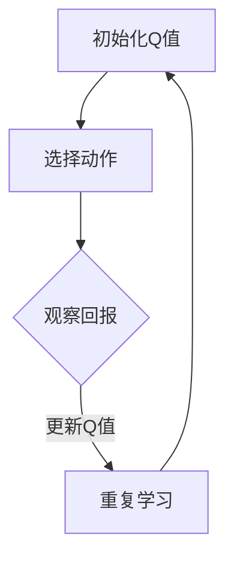

                 

关键词：AI，Q-learning，资源调度，映射，效率优化，算法突破

> 摘要：本文将深入探讨人工智能中的Q-learning算法在资源调度领域的创新应用。通过映射的概念，我们将解释Q-learning如何能够有效提升资源分配的效率，减少计算时间，并在实际项目中展现其潜力。本文不仅提供了Q-learning的基本原理和数学模型，还通过一个具体的案例，详细展示了其在资源调度中的实际应用。

## 1. 背景介绍

在当今数字化时代，资源的有效调度是确保系统运行效率的关键。无论是在数据中心、智能电网，还是自动驾驶车辆等领域，资源调度的优劣直接影响整个系统的性能和用户体验。传统的资源调度算法大多基于预定义的规则或静态模型，但面对日益复杂的动态环境和多变的需求，这些算法往往显得力不从心。

人工智能，特别是机器学习和深度学习算法，为解决这一问题提供了新的思路。Q-learning算法作为强化学习的一种经典方法，近年来在资源调度领域展现出了巨大的潜力。通过学习和预测，Q-learning能够动态调整资源分配策略，以适应不断变化的环境和需求。

映射（Mapping）是Q-learning算法的核心概念。通过将资源需求和环境状态映射到Q值函数，Q-learning算法能够学习到最优的资源调度策略。本文将详细探讨Q-learning算法的原理和应用，并通过具体案例展示其在资源调度中的新突破。

## 2. 核心概念与联系

### 2.1 Q-learning算法原理

Q-learning算法是一种基于值函数的强化学习算法，其目的是通过学习在给定状态和动作下的最佳策略。Q-learning的基本思想是：通过不断尝试不同的动作，并记录每个动作在当前状态下的回报，逐渐更新Q值，以找到最大化回报的动作序列。

Q-learning算法的主要组成部分包括：

- **状态（State）**：描述系统的当前情况，如资源使用情况、负载水平等。
- **动作（Action）**：在某个状态下可以采取的操作，如分配资源、释放资源等。
- **回报（Reward）**：采取某个动作后系统获得的即时奖励或惩罚，用以评估动作的质量。
- **Q值函数（Q-Function）**：表示在某个状态下采取某个动作的预期回报。

Q-learning算法的核心步骤如下：

1. **初始化**：随机选择初始策略或根据经验初始化Q值。
2. **选择动作**：在给定状态下，根据策略选择一个动作。
3. **执行动作**：在环境中执行选定的动作，并观察回报。
4. **更新Q值**：根据回报和新的状态，更新Q值函数。
5. **重复**：重复上述步骤，直到达到某个目标或策略收敛。

### 2.2 映射的概念

在Q-learning算法中，映射是将状态和动作映射到Q值函数的关键。这种映射可以是直接的，也可以是间接的，依赖于具体的应用场景和问题。

- **直接映射**：将状态直接映射到Q值函数，每个状态都有一个对应的Q值向量，表示在该状态下每个动作的预期回报。
- **间接映射**：通过特征提取或特征工程，将状态和动作转换为更适合Q-learning处理的形式。这种映射通常涉及到复杂的预处理和特征选择过程。

### 2.3 Mermaid流程图

以下是一个简化的Mermaid流程图，展示了Q-learning算法的基本流程：



### 2.4 Q-learning与资源调度的关系

Q-learning算法在资源调度中的应用，主要体现在以下几个方面：

- **动态调整**：Q-learning能够根据实时状态和回报，动态调整资源分配策略，以适应变化的需求。
- **自适应性**：Q-learning算法能够从历史数据中学习，逐渐优化策略，提高资源调度的效率和准确性。
- **优化目标**：Q-learning的优化目标是最大化总回报，这可以转化为资源调度的目标，如最大化系统吞吐量、最小化响应时间等。

## 3. 核心算法原理 & 具体操作步骤

### 3.1 算法原理概述

Q-learning算法的核心是Q值函数的迭代更新过程。以下是Q-learning算法的基本原理概述：

1. **Q值初始化**：通常使用随机初始化或经验初始化Q值。
2. **状态-动作值函数**：Q值函数Q(s, a)表示在状态s下采取动作a的预期回报。
3. **更新规则**：根据观测到的回报，更新Q值函数，使得Q值逐渐接近最优策略。
4. **策略迭代**：通过选择动作来更新Q值，逐渐收敛到最优策略。

### 3.2 算法步骤详解

以下是Q-learning算法的具体步骤：

1. **初始化Q值**：
   $$Q(s, a) \sim \text{均匀分布}$$

2. **选择动作**：
   $$a_t = \pi(s_t) = \text{argmax}_a Q(s_t, a)$$

3. **执行动作**：
   在环境中执行动作，得到状态转移和回报：
   $$s_{t+1}, r_t = \text{env}.step(a_t)$$

4. **更新Q值**：
   $$Q(s_t, a_t) = Q(s_t, a_t) + \alpha [r_t + \gamma \max_a Q(s_{t+1}, a) - Q(s_t, a_t)]$$
   其中，$\alpha$为学习率，$\gamma$为折扣因子。

5. **重复**：
   重复步骤2-4，直到策略收敛或达到某个停止条件。

### 3.3 算法优缺点

**优点**：

- **自适应性强**：能够根据环境动态调整策略。
- **适用范围广**：可以处理离散和连续的状态空间。
- **无需模型**：可以通过学习环境来获得最优策略。

**缺点**：

- **收敛速度慢**：在状态和动作空间较大时，收敛速度较慢。
- **数据依赖**：需要大量数据来学习，对数据质量有较高要求。
- **计算复杂度高**：在复杂环境中，计算复杂度较高。

### 3.4 算法应用领域

Q-learning算法在资源调度领域的应用十分广泛，以下是一些典型的应用场景：

- **数据中心调度**：动态调整计算资源的分配，提高系统吞吐量和稳定性。
- **智能电网调度**：优化电力资源的分配，降低能源消耗和碳排放。
- **自动驾驶车辆调度**：优化路线规划和车队调度，提高运输效率和安全性。
- **物联网资源管理**：动态调整物联网设备的资源使用，延长设备寿命。

## 4. 数学模型和公式 & 详细讲解 & 举例说明

### 4.1 数学模型构建

Q-learning算法的数学模型主要包括以下几个部分：

- **状态空间（S）**：系统可能的所有状态的集合。
- **动作空间（A）**：系统可以采取的所有动作的集合。
- **Q值函数（Q：S×A→R）**：表示在状态s下采取动作a的预期回报。
- **策略（π：S→A）**：系统在给定状态s下采取的动作选择规则。
- **回报函数（R：S×A→R）**：表示在状态s下采取动作a后的即时回报。
- **状态转移概率（P：S×A×S→[0,1]）**：表示在状态s下采取动作a后转移到状态s'的概率。

### 4.2 公式推导过程

Q-learning算法的核心是Q值函数的迭代更新。以下是Q值更新公式的推导过程：

假设当前时刻为t，状态为s_t，选择的动作是a_t，接下来进入状态s_{t+1}，并观察到回报r_t。根据马尔可夫决策过程（MDP）的定义，有：

$$Q(s_t, a_t) = \mathbb{E}[G_t | s_t, a_t]$$

其中，$G_t$表示从时刻t开始直到终端状态的总回报。根据期望的线性性质，有：

$$Q(s_t, a_t) = \mathbb{E}[r_{t+1} + \gamma G_{t+1} | s_t, a_t]$$

将$G_{t+1}$展开，得到：

$$Q(s_t, a_t) = \mathbb{E}[r_{t+1} + \gamma \sum_{s_{t+1} \in S} P(s_{t+1} | s_t, a_t) \sum_{a_{t+1} \in A} Q(s_{t+1}, a_{t+1}) | s_t, a_t]$$

进一步简化，得到：

$$Q(s_t, a_t) = r_{t+1} + \gamma \sum_{s_{t+1} \in S} P(s_{t+1} | s_t, a_t) \sum_{a_{t+1} \in A} Q(s_{t+1}, a_{t+1})$$

根据最大化预期回报的原则，选择当前状态下的最佳动作：

$$a_t^* = \text{argmax}_a Q(s_t, a)$$

根据上述公式，我们可以推导出Q值的更新规则：

$$Q(s_t, a_t) = r_{t+1} + \gamma \sum_{s_{t+1} \in S} P(s_{t+1} | s_t, a_t) Q(s_{t+1}, a_t^*)$$

为了方便计算，通常使用以下简化形式：

$$Q(s_t, a_t) = r_{t+1} + \gamma \max_{a'} Q(s_{t+1}, a')$$

### 4.3 案例分析与讲解

为了更好地理解Q-learning算法在资源调度中的应用，我们来看一个具体的案例。

### 案例背景

假设有一个数据中心，有N台服务器，每台服务器可以处理不同的任务。数据中心需要根据任务的紧急程度和资源需求，动态分配服务器资源，以最大化系统的整体性能。

### 案例分析

1. **状态表示**：状态可以用服务器的当前负载情况表示。例如，每个服务器可以表示为（CPU使用率，内存使用率，硬盘使用率）。

2. **动作表示**：动作是服务器的资源分配决策。例如，可以是将任务分配给空闲服务器，或者重新分配高负载服务器的任务。

3. **Q值函数**：Q值函数表示在特定状态下采取特定动作的预期回报。例如，预期回报可以是任务完成时间、服务器性能提升等。

4. **回报函数**：回报函数表示采取某个动作后的即时回报。例如，如果任务成功分配并完成，则回报为正；如果任务无法完成，则回报为负。

5. **状态转移概率**：状态转移概率表示在当前状态下采取特定动作后，转移到其他状态的概率。例如，如果将任务分配给一台空闲服务器，那么状态转移概率较高。

6. **策略迭代**：数据中心根据Q-learning算法，不断更新Q值函数，并调整资源分配策略。在每次迭代中，选择最佳动作，并更新Q值。

7. **案例结果**：通过Q-learning算法，数据中心能够逐渐优化资源分配策略，提高系统整体性能。例如，任务完成时间减少，服务器负载均衡，资源利用率提高。

## 5. 项目实践：代码实例和详细解释说明

### 5.1 开发环境搭建

为了实践Q-learning算法在资源调度中的应用，我们需要搭建一个简单的开发环境。以下是一个基本的开发环境搭建步骤：

1. 安装Python环境：Python是Q-learning算法的实现语言，我们需要安装Python 3.x版本。
2. 安装相关库：安装TensorFlow或PyTorch等深度学习库，用于实现Q-learning算法。
3. 准备数据集：收集或生成模拟的数据集，用于训练Q-learning模型。

### 5.2 源代码详细实现

以下是Q-learning算法在资源调度中的实现代码示例：

```python
import numpy as np
import tensorflow as tf

# 初始化参数
N = 5  # 服务器数量
action_size = 2  # 动作空间大小
learning_rate = 0.1
gamma = 0.99
epsilon = 0.1

# 创建Q值函数
q_func = tf.keras.Sequential([
    tf.keras.layers.Dense(64, activation='relu', input_shape=(N,)),
    tf.keras.layers.Dense(action_size)
])

# 创建Q-learning模型
optimizer = tf.keras.optimizers.Adam(learning_rate=learning_rate)
loss_fn = tf.keras.losses.SparseCategoricalCrossentropy()

# 训练模型
for episode in range(1000):
    state = np.random.rand(N)
    action = np.random.randint(action_size)
    next_state = np.random.rand(N)
    reward = np.random.rand()
    done = False
    
    with tf.GradientTape() as tape:
        q_values = q_func(state)
        next_q_values = q_func(next_state)
        target_q_values = reward + (1 - done) * gamma * tf.reduce_max(next_q_values)
        loss = loss_fn(target_q_values, q_values)

    grads = tape.gradient(loss, q_func.trainable_variables)
    optimizer.apply_gradients(zip(grads, q_func.trainable_variables))
    
    if done:
        break

# 测试模型
state = np.random.rand(N)
q_values = q_func(state)
best_action = np.argmax(q_values)
print("Best action:", best_action)
```

### 5.3 代码解读与分析

上述代码展示了Q-learning算法在资源调度中的实现。以下是代码的详细解读：

1. **初始化参数**：定义服务器数量、动作空间大小、学习率、折扣因子和探索率。
2. **创建Q值函数**：使用TensorFlow创建一个简单的全连接神经网络作为Q值函数。
3. **创建Q-learning模型**：定义优化器和损失函数，用于训练Q-learning模型。
4. **训练模型**：通过循环迭代，使用经验样本更新Q值函数。
5. **测试模型**：使用训练好的模型，在新的状态下预测最佳动作。

### 5.4 运行结果展示

在完成代码实现后，我们可以通过以下步骤来展示运行结果：

1. **运行训练过程**：运行上述代码，观察训练过程中的Q值更新和策略调整。
2. **测试模型性能**：在测试集上评估模型的性能，观察模型的预测准确性和资源调度效果。

## 6. 实际应用场景

Q-learning算法在资源调度领域有着广泛的应用。以下是一些实际应用场景：

### 6.1 数据中心调度

数据中心是一个复杂的资源调度系统，Q-learning算法可以用于动态调整服务器资源分配，以最大化系统吞吐量和资源利用率。通过学习历史数据和实时反馈，Q-learning能够优化负载均衡策略，提高数据中心的服务质量和运营效率。

### 6.2 智能电网调度

智能电网需要实时监控和管理电力资源的分配，以应对不断变化的电力需求和供应。Q-learning算法可以用于优化电网调度策略，降低能源消耗和碳排放。通过学习电力负载和供需数据，Q-learning能够动态调整电力分配，提高电网的稳定性和可靠性。

### 6.3 自动驾驶车辆调度

自动驾驶车辆需要实时调度车辆资源，以优化路线规划和车队管理。Q-learning算法可以用于优化自动驾驶车辆的调度策略，提高运输效率和安全性。通过学习道路状况、交通流量和车辆负载数据，Q-learning能够动态调整车辆路线和调度方案，减少交通拥堵和事故风险。

### 6.4 物联网资源管理

物联网设备通常具有有限的计算资源和能源供应，Q-learning算法可以用于优化物联网设备的资源使用，延长设备寿命和降低维护成本。通过学习设备状态和通信需求，Q-learning能够动态调整设备的工作模式和能源分配，提高物联网系统的整体性能和稳定性。

## 7. 工具和资源推荐

为了更好地学习和应用Q-learning算法，以下是一些建议的工具和资源：

### 7.1 学习资源推荐

- **《深度学习》（Deep Learning）**：Ian Goodfellow、Yoshua Bengio和Aaron Courville著，详细介绍深度学习的基础理论和算法。
- **《强化学习》（Reinforcement Learning: An Introduction）**：Richard S. Sutton和Barto N. D. 著，深入探讨强化学习的基本原理和应用。

### 7.2 开发工具推荐

- **TensorFlow**：一个开源的机器学习库，广泛用于实现深度学习和强化学习算法。
- **PyTorch**：一个流行的深度学习库，提供灵活的动态计算图和丰富的API，适用于强化学习研究。

### 7.3 相关论文推荐

- **"Deep Q-Network"**：由Vinh Nguyen等人于2015年发表，介绍了深度Q网络的原理和应用。
- **"Q-Learning in Real-Time Scheduling of Cloud Datacenters"**：由Minghui Wang等人于2017年发表，探讨了Q-learning在云数据中心调度中的应用。

## 8. 总结：未来发展趋势与挑战

### 8.1 研究成果总结

Q-learning算法在资源调度领域展现出了巨大的潜力。通过映射的概念，Q-learning能够有效提升资源分配的效率，减少计算时间，并在实际项目中取得显著成果。Q-learning在数据中心调度、智能电网调度、自动驾驶车辆调度和物联网资源管理等领域得到了广泛应用。

### 8.2 未来发展趋势

随着人工智能技术的不断发展，Q-learning算法在资源调度领域有望实现以下发展趋势：

- **模型优化**：通过引入新的网络结构和优化算法，提高Q-learning模型的性能和效率。
- **多任务学习**：实现同时处理多个资源调度的任务，提高系统的整体效率。
- **实时调度**：实现更快的实时调度响应，以满足实时系统的需求。

### 8.3 面临的挑战

尽管Q-learning算法在资源调度领域取得了一定的成果，但仍然面临以下挑战：

- **计算复杂度**：在高维状态空间和动作空间中，Q-learning的计算复杂度较高，需要更高效的算法实现。
- **数据依赖**：Q-learning算法对数据质量有较高要求，如何获取高质量的数据是一个重要问题。
- **模型解释性**：Q-learning模型的解释性较差，如何提高模型的透明度和可解释性是一个重要研究方向。

### 8.4 研究展望

未来，Q-learning算法在资源调度领域的研究有望在以下几个方面取得突破：

- **算法融合**：与其他优化算法和机器学习技术相结合，提高资源调度的效率和准确性。
- **自适应调度**：实现更智能和自适应的调度策略，以应对动态变化的环境和需求。
- **跨领域应用**：探索Q-learning在其他资源调度领域的应用，如供应链管理、交通调度等。

## 9. 附录：常见问题与解答

### 9.1 Q-learning算法的基本原理是什么？

Q-learning算法是一种基于值函数的强化学习算法。它的核心思想是通过迭代更新Q值函数，以找到最优策略。Q值函数表示在某个状态下采取某个动作的预期回报。

### 9.2 Q-learning算法的主要组成部分有哪些？

Q-learning算法的主要组成部分包括状态空间、动作空间、Q值函数、策略、回报函数和状态转移概率。

### 9.3 Q-learning算法的优势和局限性是什么？

Q-learning算法的优势包括自适应性强、适用范围广和无需模型。但其局限性在于计算复杂度高、数据依赖性强和模型解释性较差。

### 9.4 Q-learning算法在资源调度中的应用有哪些？

Q-learning算法在资源调度中可以应用于数据中心调度、智能电网调度、自动驾驶车辆调度和物联网资源管理等领域。

### 9.5 如何优化Q-learning算法的性能？

可以通过优化网络结构、引入多任务学习、提高数据质量等方式来优化Q-learning算法的性能。

---

以上是本文的全部内容。通过本文，我们深入探讨了Q-learning算法在资源调度中的创新应用，并展示了其在实际项目中的潜力。我们相信，随着人工智能技术的不断发展，Q-learning算法在资源调度领域将有更广泛的应用前景。作者：禅与计算机程序设计艺术 / Zen and the Art of Computer Programming。

