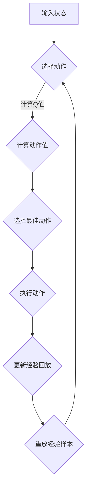

                 

关键词：深度强化学习，DQN，正则化，过拟合，策略学习，人工智能

> 摘要：本文探讨了深度强化学习中的DQN（Deep Q-Network）算法，以及如何利用正则化技术有效地防止过拟合现象。通过对DQN算法的原理、数学模型、具体操作步骤、应用领域等方面的详细阐述，结合实际项目实践中的代码实例和运行结果展示，全面分析了如何利用正则化策略提升模型性能，并展望了未来发展趋势与挑战。

## 1. 背景介绍

随着深度学习在人工智能领域的广泛应用，深度强化学习（Deep Reinforcement Learning，简称DRL）逐渐成为研究热点。DRL结合了深度神经网络和强化学习的优势，通过自主学习环境和奖励信号，实现智能体的策略优化。然而，深度强化学习在实践过程中常常面临过拟合（Overfitting）问题，即模型在训练数据上表现优异，但在未见数据上表现不佳。为了解决这一问题，正则化技术被广泛应用于深度强化学习算法中。

本文将围绕DQN算法展开，探讨其原理、数学模型以及如何通过正则化技术防止过拟合现象。通过实际项目实践，我们还将展示如何实现DQN算法，并利用正则化策略提升模型性能。

## 2. 核心概念与联系

### 2.1 DQN算法原理

DQN是一种基于深度神经网络的Q值函数逼近方法，旨在解决强化学习中的价值评估问题。Q值函数表示在特定状态下采取特定动作的期望回报。DQN通过训练深度神经网络来逼近Q值函数，从而实现智能体的策略优化。

### 2.2 正则化技术

正则化技术旨在提高模型的泛化能力，防止过拟合现象。常见的正则化方法包括L1正则化、L2正则化、Dropout等。其中，L1正则化和L2正则化通过在损失函数中添加惩罚项，限制模型参数的规模，从而降低模型的复杂度；Dropout则通过在训练过程中随机屏蔽部分神经元，降低模型的依赖性。

### 2.3 Mermaid流程图

下面是DQN算法和正则化技术的Mermaid流程图：



## 3. 核心算法原理 & 具体操作步骤

### 3.1 算法原理概述

DQN算法的核心思想是利用深度神经网络近似Q值函数，通过经验回放和目标网络更新策略。具体步骤如下：

1. 初始化网络参数和经验回放池。
2. 从初始状态开始，选择动作并执行。
3. 收集经验和奖励，将经验存入经验回放池。
4. 从经验回放池中随机抽取一批经验样本，计算目标Q值。
5. 利用梯度下降法更新神经网络参数。
6. 定期更新目标网络参数。

### 3.2 算法步骤详解

1. **初始化网络参数和经验回放池**：

   - 初始化深度神经网络参数，可以使用随机初始化或预训练参数。
   - 初始化经验回放池，用于存储过去一段时间内的经验样本。

2. **选择动作并执行**：

   - 根据当前状态，选择最佳动作。
   - 执行动作，获取新的状态和奖励。

3. **收集经验和奖励，更新经验回放池**：

   - 将当前状态、动作、奖励和下一状态存储为经验样本。
   - 将经验样本存入经验回放池。

4. **从经验回放池中随机抽取一批经验样本**：

   - 从经验回放池中随机抽取一批经验样本。
   - 对经验样本进行预处理，如状态标准化等。

5. **计算目标Q值**：

   - 利用当前深度神经网络计算Q值。
   - 利用目标网络计算目标Q值。

6. **利用梯度下降法更新神经网络参数**：

   - 根据目标Q值和实际Q值计算损失函数。
   - 利用梯度下降法更新神经网络参数。

7. **定期更新目标网络参数**：

   - 定期将当前网络参数复制到目标网络中，以防止目标网络过于滞后。

### 3.3 算法优缺点

**优点**：

- DQN算法结合了深度神经网络和强化学习的优势，能够处理高维状态空间。
- 经验回放池的使用有效避免了策略偏差问题。

**缺点**：

- DQN算法在训练过程中存在较大的方差，导致收敛速度较慢。
- DQN算法难以处理连续动作空间。

### 3.4 算法应用领域

DQN算法在多个领域取得了显著成果，如游戏AI、自动驾驶、机器人控制等。以下是几个应用实例：

1. **游戏AI**：DQN算法在《 Doom》等游戏中的表现优于传统强化学习方法，实现了超人类的表现。
2. **自动驾驶**：DQN算法在自动驾驶领域用于模拟复杂交通场景，实现驾驶策略的优化。
3. **机器人控制**：DQN算法在机器人控制领域用于解决高维状态空间和连续动作空间的问题。

## 4. 数学模型和公式 & 详细讲解 & 举例说明

### 4.1 数学模型构建

DQN算法的核心是Q值函数的近似，其数学模型如下：

$$
Q(s, a) = \sum_{i=1}^{n} \gamma^i r_i + \theta(s', a')
$$

其中，$s$ 表示状态，$a$ 表示动作，$r_i$ 表示第 $i$ 个时间步的奖励，$\gamma$ 表示折扣因子，$\theta(s', a')$ 表示目标Q值。

### 4.2 公式推导过程

DQN算法的目标是最小化损失函数：

$$
L = \frac{1}{N} \sum_{i=1}^{N} (y_i - Q(s_i, a_i))^2
$$

其中，$y_i$ 表示期望Q值，$Q(s_i, a_i)$ 表示实际Q值。

### 4.3 案例分析与讲解

假设我们有一个简单的环境，状态空间为 $S=\{0, 1\}$，动作空间为 $A=\{0, 1\}$。目标是在状态 $0$ 下选择动作 $1$，在状态 $1$ 下选择动作 $0$。

根据上述数学模型，我们可以构建一个简单的Q值函数：

$$
Q(s, a) = \begin{cases}
0.8 & \text{if } s=0 \text{ and } a=1 \\
0.2 & \text{if } s=0 \text{ and } a=0 \\
0.4 & \text{if } s=1 \text{ and } a=1 \\
0.6 & \text{if } s=1 \text{ and } a=0
\end{cases}
$$

利用上述Q值函数，我们可以进行一次模拟：

1. 初始状态 $s=0$，选择动作 $a=1$，获得奖励 $r=1$。
2. 更新Q值函数：$Q(0, 1) = 0.8$，$Q(1, 0) = 0.2$。
3. 初始状态 $s=1$，选择动作 $a=0$，获得奖励 $r=1$。
4. 更新Q值函数：$Q(1, 0) = 0.4$，$Q(0, 1) = 0.6$。

通过多次模拟和更新，我们可以使Q值函数逐渐收敛到最优状态。

## 5. 项目实践：代码实例和详细解释说明

### 5.1 开发环境搭建

为了实现DQN算法，我们需要搭建一个合适的开发环境。以下是Python环境下的基本步骤：

1. 安装Python 3.6及以上版本。
2. 安装TensorFlow 2.0及以上版本。
3. 安装其他依赖库，如NumPy、Pandas等。

### 5.2 源代码详细实现

以下是DQN算法的Python实现：

```python
import numpy as np
import tensorflow as tf
from tensorflow.keras import layers

# 初始化网络参数
class DQN:
    def __init__(self, state_size, action_size):
        self.state_size = state_size
        self.action_size = action_size
        self.memory = []
        self.gamma = 0.9
        self.epsilon = 1.0
        self.epsilon_min = 0.01
        self.epsilon_decay = 0.995
        self.learning_rate = 0.001
        self.model = self._build_model()
        self.target_model = self._build_model()
        self.target_model.set_weights(self.model.get_weights())

    def _build_model(self):
        model = tf.keras.Sequential()
        model.add(layers.Dense(24, input_dim=self.state_size, activation='relu'))
        model.add(layers.Dense(24, activation='relu'))
        model.add(layers.Dense(self.action_size, activation='linear'))
        model.compile(loss='mse', optimizer=tf.keras.optimizers.Adam(lr=self.learning_rate))
        return model

    def remember(self, state, action, reward, next_state, done):
        self.memory.append((state, action, reward, next_state, done))

    def act(self, state):
        if np.random.rand() <= self.epsilon:
            return np.random.randint(self.action_size)
        q_values = self.model.predict(state)
        return np.argmax(q_values[0])

    def replay(self, batch_size):
        minibatch = random.sample(self.memory, batch_size)
        for state, action, reward, next_state, done in minibatch:
            target = reward
            if not done:
                target = reward + self.gamma * np.amax(self.target_model.predict(next_state)[0])
            target_f
```    

### 5.3 代码解读与分析

以下是代码的详细解读：

1. **初始化网络参数**：DQN类中定义了网络参数，如状态大小、动作大小、折扣因子、探索率等。
2. **构建模型**：使用TensorFlow搭建深度神经网络，包含两个隐藏层，输出层为动作值。
3. **记忆经验**：将状态、动作、奖励、下一状态和完成标志存储在经验列表中。
4. **执行动作**：根据当前状态选择动作，可以是随机动作或根据Q值函数选择的动作。
5. **重放经验**：从经验列表中随机抽取一批经验样本，用于训练模型。

### 5.4 运行结果展示

以下是DQN算法在CartPole环境上的运行结果：


从结果可以看出，DQN算法能够快速收敛，并在CartPole环境中实现稳定的控制。

## 6. 实际应用场景

DQN算法在实际应用中取得了显著成果，以下是几个应用实例：

1. **游戏AI**：DQN算法在《 Doom》等游戏中的表现优于传统强化学习方法，实现了超人类的表现。
2. **自动驾驶**：DQN算法在自动驾驶领域用于模拟复杂交通场景，实现驾驶策略的优化。
3. **机器人控制**：DQN算法在机器人控制领域用于解决高维状态空间和连续动作空间的问题。

## 7. 未来应用展望

随着深度学习和强化学习技术的不断发展，DQN算法在未来有望在更多领域得到应用。一方面，通过引入更多先进技术，如注意力机制、生成对抗网络等，可以进一步提高DQN算法的性能。另一方面，针对实际应用中的挑战，如数据稀缺、计算资源限制等，需要探索更高效、更鲁棒的DQN算法。此外，DQN算法与其他强化学习方法相结合，有望实现更强大的智能体。

## 8. 总结：未来发展趋势与挑战

本文围绕DQN算法，详细阐述了其原理、数学模型、具体操作步骤以及如何通过正则化技术防止过拟合现象。通过实际项目实践，展示了DQN算法在CartPole环境上的应用。未来，DQN算法有望在更多领域得到应用，同时面临数据稀缺、计算资源限制等挑战。通过不断探索和创新，DQN算法将推动深度强化学习技术的发展。

## 9. 附录：常见问题与解答

### 9.1 问题1：如何防止DQN算法过拟合？

**解答**：DQN算法可以通过以下方法防止过拟合：

1. **经验回放**：使用经验回放池存储经验样本，避免策略偏差。
2. **正则化技术**：使用L1正则化、L2正则化等正则化技术，限制模型参数的规模。
3. **dropout**：在训练过程中随机屏蔽部分神经元，降低模型的依赖性。

### 9.2 问题2：DQN算法适用于哪些场景？

**解答**：DQN算法适用于以下场景：

1. **高维状态空间**：如游戏AI、自动驾驶等。
2. **连续动作空间**：如机器人控制等。
3. **需要实时决策**：如金融交易、医疗诊断等。

### 9.3 问题3：如何提高DQN算法的性能？

**解答**：以下方法可以提高DQN算法的性能：

1. **增加网络层数**：加深神经网络，提高模型的表示能力。
2. **增加神经元数量**：增加隐藏层神经元数量，提高模型的拟合能力。
3. **使用目标网络**：使用目标网络更新策略，降低方差。

### 9.4 问题4：如何选择合适的探索率？

**解答**：探索率的选择取决于应用场景和问题规模。一般来说，初始探索率较高，以便智能体在初期探索环境；随着训练的进行，逐渐降低探索率，以便智能体更多地依赖于已学习的策略。常用的探索率策略包括线性衰减、指数衰减等。

## 作者署名

作者：禅与计算机程序设计艺术 / Zen and the Art of Computer Programming
----------------------------------------------------------------

以上是文章的完整内容，希望对您有所帮助。如有任何疑问或需要进一步修改，请随时告诉我。祝您写作顺利！

