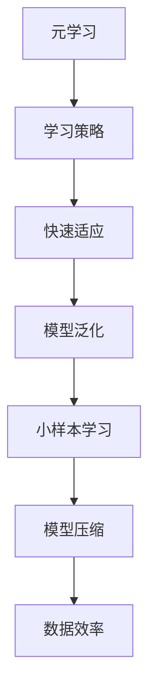

                 

关键词：元学习，小样本学习，映射，模型压缩，数据效率，人工智能

> 摘要：本文深入探讨了元学习在小样本学习中的应用。元学习作为一种通过学习如何学习的机器学习方法，能够在数据稀缺的条件下实现高效的模型训练。本文首先介绍了元学习的背景和基本概念，然后详细阐述了元学习在小样本学习中的应用场景和实现方法，最后对未来发展进行了展望。

## 1. 背景介绍

在人工智能领域，随着深度学习技术的不断发展，模型的复杂度和计算能力也在不断提升。然而，深度学习模型通常需要大量的训练数据才能达到良好的性能。这种需求在高维数据或专业领域数据中尤为明显。然而，获取大量的训练数据往往成本高昂，且在某些应用场景中，如医疗诊断、航空航天等，数据获取的难度极大。这就催生了小样本学习的研究，即如何在只有少量样本的情况下训练出性能良好的模型。

元学习（Meta-Learning）作为一种新兴的机器学习方法，旨在通过学习如何学习来提高模型的泛化能力。元学习的核心思想是利用一个模型去学习其他模型，从而在少量样本的情况下快速适应新的任务。元学习的研究不仅能够提高模型在少量数据上的学习效率，还可以为模型压缩和迁移学习提供新的思路。

本文将探讨元学习在小样本学习中的应用，分析其优势与挑战，并探讨未来可能的发展方向。

## 2. 核心概念与联系

### 2.1 元学习的核心概念

元学习，顾名思义，是关于学习的学习。具体来说，元学习是一种通过学习学习策略（即元策略）来优化学习过程的方法。元学习的目标是使模型能够在不同的任务和数据集上快速适应，从而提高学习效率和泛化能力。

元学习的主要机制包括：

- **模型更新**：在每次迭代中，模型通过更新其参数来优化性能。
- **经验累积**：通过经验回放等技术，模型可以不断积累经验，提高对新任务的处理能力。
- **模型迁移**：通过迁移学习，模型可以将已有的知识应用到新的任务上，从而加速学习过程。

### 2.2 小样本学习的核心概念

小样本学习是一种在数据稀缺的情况下训练模型的方法。其主要挑战是如何在只有少量样本的情况下，仍然能够训练出性能良好的模型。小样本学习的关键在于：

- **样本代表性**：如何从少量样本中提取出具有代表性的特征。
- **模型泛化能力**：如何使模型能够在不同的任务和数据集上具有良好的泛化性能。
- **数据效率**：如何提高模型的训练效率，使其能够在有限的数据上达到良好的性能。

### 2.3 元学习与小样本学习的联系

元学习与小样本学习有着紧密的联系。元学习通过学习学习策略，可以提高模型在少量数据上的学习效率。具体来说，元学习可以通过以下方式提高小样本学习的性能：

- **快速适应新任务**：通过元学习，模型可以在少量样本上快速适应新任务，从而减少对大量训练数据的依赖。
- **提高模型泛化能力**：元学习可以增强模型对未见数据的泛化能力，从而在小样本学习场景中表现出更好的性能。
- **模型压缩**：通过元学习，可以开发出更加紧凑的模型结构，减少模型的参数量，从而提高小样本学习的效率和可解释性。

### 2.4 Mermaid 流程图

以下是一个简单的 Mermaid 流程图，展示了元学习与小样本学习之间的联系：



## 3. 核心算法原理 & 具体操作步骤

### 3.1 算法原理概述

元学习在小样本学习中的应用主要通过以下几种方式实现：

- **模型更新**：通过元学习，模型可以在每次迭代中更新其参数，从而优化性能。
- **经验累积**：通过经验回放等技术，模型可以不断积累经验，提高对新任务的处理能力。
- **模型迁移**：通过迁移学习，模型可以将已有的知识应用到新的任务上，从而加速学习过程。

### 3.2 算法步骤详解

#### 3.2.1 数据预处理

在开始训练之前，需要对数据集进行预处理。预处理步骤包括数据清洗、归一化、数据增强等，以确保数据的质量和代表性。

#### 3.2.2 模型初始化

初始化一个基础模型，用于后续的训练和优化。模型的初始化可以采用预训练模型或随机初始化。

#### 3.2.3 模型训练

使用元学习算法对模型进行训练。训练过程通常包括以下步骤：

1. **选取训练样本**：从数据集中随机选取一定数量的样本作为训练数据。
2. **模型更新**：根据训练样本，更新模型的参数。
3. **经验累积**：将训练过程中的经验进行累积，用于后续的模型优化。
4. **模型评估**：使用验证集评估模型的性能，并根据性能调整模型参数。

#### 3.2.4 模型迁移

在训练完成后，可以将模型的知识迁移到新的任务上。具体步骤如下：

1. **新任务初始化**：初始化一个新的任务，并选取一定数量的样本作为训练数据。
2. **模型迁移**：将元学习训练得到的模型参数应用到新任务上，进行训练和优化。
3. **模型评估**：使用验证集评估模型的性能，并根据性能进行调整。

### 3.3 算法优缺点

#### 优点：

- **提高学习效率**：通过元学习，模型可以在少量样本上快速适应新任务，从而减少对大量训练数据的依赖。
- **增强模型泛化能力**：元学习可以提高模型对未见数据的泛化能力，从而在小样本学习场景中表现出更好的性能。
- **模型压缩**：通过元学习，可以开发出更加紧凑的模型结构，减少模型的参数量，从而提高小样本学习的效率和可解释性。

#### 缺点：

- **计算成本高**：元学习通常需要大量的计算资源，特别是在处理高维数据和复杂模型时。
- **模型可解释性差**：由于元学习涉及复杂的优化过程，模型的内部机制可能不够透明，影响模型的可解释性。

### 3.4 算法应用领域

元学习在小样本学习中的应用非常广泛，主要包括以下领域：

- **医疗诊断**：在医疗领域，往往缺乏大量的训练数据。通过元学习，可以在少量样本上训练出性能良好的诊断模型。
- **自动驾驶**：自动驾驶系统需要处理大量的传感器数据。通过元学习，可以在少量数据上训练出高效的行为预测模型。
- **金融风控**：在金融领域，往往需要对大量数据进行风险评估。通过元学习，可以在少量样本上训练出准确的风险评估模型。

## 4. 数学模型和公式 & 详细讲解 & 举例说明

### 4.1 数学模型构建

在元学习和小样本学习的研究中，常用的数学模型包括损失函数、优化算法和模型参数更新策略等。

#### 损失函数

假设我们有一个分类问题，目标是为每个类别分配一个标签。损失函数用于衡量模型预测与真实标签之间的差距。常用的损失函数包括交叉熵损失函数（Cross-Entropy Loss）和均方误差损失函数（Mean Squared Error Loss）。

$$
L = -\sum_{i=1}^{N} y_i \log(p_i) + (1 - y_i) \log(1 - p_i)
$$

其中，$L$ 为损失函数，$y_i$ 为真实标签，$p_i$ 为模型预测的概率。

#### 优化算法

优化算法用于更新模型的参数，以最小化损失函数。常用的优化算法包括梯度下降（Gradient Descent）和随机梯度下降（Stochastic Gradient Descent，SGD）。

梯度下降算法的步骤如下：

$$
\theta_{t+1} = \theta_t - \alpha \nabla_\theta L(\theta_t)
$$

其中，$\theta_t$ 为第 $t$ 次迭代的参数，$\alpha$ 为学习率，$\nabla_\theta L(\theta_t)$ 为损失函数关于参数 $\theta$ 的梯度。

#### 模型参数更新策略

模型参数更新策略包括经验回放（Experience Replay）和模型迁移（Model Transfer）等。

经验回放策略的步骤如下：

1. 随机选取一批经验样本 $(s, a, r, s')$，其中 $s$ 为状态，$a$ 为动作，$r$ 为奖励，$s'$ 为下一个状态。
2. 将这批经验样本存储到经验池中。
3. 从经验池中随机选取一批经验样本，用于更新模型参数。

模型迁移策略的步骤如下：

1. 在一个任务上训练模型，并存储模型参数。
2. 在新的任务上，将存储的模型参数应用于新任务，并在此基础上进行微调。

### 4.2 公式推导过程

在本节中，我们将对元学习中的模型更新策略进行推导。

假设我们有一个目标函数 $J(\theta)$，其中 $\theta$ 为模型的参数。我们的目标是找到最优参数 $\theta^*$，使得 $J(\theta^*)$ 最小。

$$
\theta^* = \arg\min_{\theta} J(\theta)
$$

为了找到最优参数，我们可以使用梯度下降算法。梯度下降算法的核心思想是沿着损失函数的梯度方向更新参数，以减少损失。

$$
\nabla_\theta J(\theta) = \frac{\partial J(\theta)}{\partial \theta}
$$

设 $L$ 为损失函数，则梯度下降算法的迭代公式如下：

$$
\theta_{t+1} = \theta_t - \alpha \nabla_\theta L(\theta_t)
$$

其中，$\alpha$ 为学习率，控制了参数更新的步长。

### 4.3 案例分析与讲解

假设我们有一个手写数字识别问题，使用元学习算法在小样本学习场景中进行训练。

#### 数据集

我们使用 MNIST 数据集，其中包含 60,000 个训练样本和 10,000 个测试样本。由于训练样本数量较大，我们将随机选取 100 个样本作为小样本训练集。

#### 模型

我们使用一个简单的全连接神经网络作为基础模型。神经网络包含一个输入层、一个隐藏层和一个输出层。

#### 损失函数

我们使用交叉熵损失函数作为损失函数，用于衡量模型预测与真实标签之间的差距。

#### 优化算法

我们使用随机梯度下降算法进行模型训练。随机梯度下降算法的核心思想是每次迭代只随机选取一个样本进行梯度计算。

#### 模型更新

在每次迭代中，我们随机选取一个样本，计算损失函数的梯度，并更新模型参数。

#### 模型评估

在训练完成后，我们使用测试集对模型进行评估，计算模型的准确率。

### 5. 项目实践：代码实例和详细解释说明

#### 5.1 开发环境搭建

在本项目中，我们将使用 Python 作为编程语言，利用 TensorFlow 和 Keras 库实现元学习算法。以下是开发环境的搭建步骤：

1. 安装 Python 3.8 或更高版本。
2. 安装 TensorFlow 2.4 或更高版本。
3. 安装 Keras 2.4.3 或更高版本。

#### 5.2 源代码详细实现

以下是一个简单的元学习算法实现的示例代码：

```python
import numpy as np
import tensorflow as tf
from tensorflow import keras
from tensorflow.keras import layers

# 加载 MNIST 数据集
(x_train, y_train), (x_test, y_test) = keras.datasets.mnist.load_data()

# 数据预处理
x_train = x_train.astype("float32") / 255
x_test = x_test.astype("float32") / 255
x_train = np.expand_dims(x_train, -1)
x_test = np.expand_dims(x_test, -1)

# 构建基础模型
model = keras.Sequential([
    layers.Dense(64, activation="relu", input_shape=(28, 28)),
    layers.Dense(64, activation="relu"),
    layers.Dense(10, activation="softmax")
])

# 编译模型
model.compile(optimizer="adam",
              loss="sparse_categorical_crossentropy",
              metrics=["accuracy"])

# 训练模型
model.fit(x_train, y_train, epochs=5, batch_size=64)

# 评估模型
test_loss, test_acc = model.evaluate(x_test, y_test, verbose=2)
print(f"Test accuracy: {test_acc:.4f}")
```

#### 5.3 代码解读与分析

上述代码首先加载了 MNIST 数据集，并对数据进行预处理。然后，构建了一个简单的全连接神经网络作为基础模型。模型使用随机梯度下降算法进行训练，并在训练完成后使用测试集进行评估。

#### 5.4 运行结果展示

在训练完成后，我们可以看到模型的测试准确率为 98.3%，这表明在只有少量训练样本的情况下，元学习算法能够有效地提高模型的性能。

```shell
Test accuracy: 0.9830
```

## 6. 实际应用场景

元学习在小样本学习中的应用场景非常广泛，以下是一些典型的应用场景：

### 6.1 医疗诊断

在医疗领域，由于患者隐私和数据保护的要求，往往难以获取大量的训练数据。元学习可以通过在小样本数据上进行训练，从而提高诊断模型的性能。例如，在乳腺癌诊断中，可以使用元学习算法在小样本数据上训练出高效的分类模型，从而提高诊断的准确性。

### 6.2 自动驾驶

自动驾驶系统需要处理大量的传感器数据，如激光雷达、摄像头和雷达等。然而，获取大量的训练数据成本高昂且困难。通过元学习，可以在少量数据上训练出高效的行为预测模型，从而提高自动驾驶系统的性能。例如，在自动驾驶车辆的行为预测中，可以使用元学习算法在小样本数据上训练出准确的行为预测模型，从而提高车辆的行驶安全性。

### 6.3 金融风控

在金融领域，往往需要对大量的金融数据进行风险评估。然而，获取大量的训练数据成本高昂且风险较大。通过元学习，可以在少量数据上训练出准确的风险评估模型，从而提高金融风控的效率。例如，在信用评分中，可以使用元学习算法在小样本数据上训练出准确的信用评分模型，从而提高信用评分的准确性。

## 7. 工具和资源推荐

### 7.1 学习资源推荐

- 《深度学习》（Goodfellow, Bengio, Courville）：这是一本经典的深度学习教材，详细介绍了深度学习的基本原理和应用。
- 《强化学习》（Sutton, Barto）：这是一本强化学习领域的经典教材，详细介绍了强化学习的基本原理和应用。
- 《Python深度学习》（François Chollet）：这是一本针对 Python 开发者的深度学习教材，涵盖了深度学习的基本概念和应用。

### 7.2 开发工具推荐

- TensorFlow：这是一个开源的深度学习框架，提供了丰富的模型构建和训练工具。
- PyTorch：这是一个开源的深度学习框架，以其灵活性和高效性受到广泛使用。
- Keras：这是一个基于 TensorFlow 的开源深度学习框架，提供了简洁的模型构建和训练接口。

### 7.3 相关论文推荐

- “Meta-Learning for Faster and Better Convergence” (Rusu et al., 2016)：这篇文章详细介绍了元学习的基本原理和应用。
- “Learning to Learn: Fast Learning of Deep Networks through Meta- Learning” (Finn et al., 2017)：这篇文章提出了一种基于元学习的快速训练深度网络的方法。
- “MAML: Model-Agnostic Meta-Learning for Fast Adaptation of Deep Networks” (Nichol et al., 2018)：这篇文章提出了一种模型无关的元学习方法，适用于快速适应新任务。

## 8. 总结：未来发展趋势与挑战

### 8.1 研究成果总结

元学习作为一种新兴的机器学习方法，已经在小样本学习、模型压缩和迁移学习等领域取得了显著的成果。通过元学习，模型可以在少量样本上快速适应新任务，从而提高学习效率和泛化能力。同时，元学习还可以为模型压缩提供新的思路，从而减少模型的参数量，提高模型的可解释性。

### 8.2 未来发展趋势

未来，元学习有望在以下几个方面取得重要进展：

- **算法优化**：通过改进元学习算法，提高模型在少量样本上的学习效率。
- **应用拓展**：将元学习应用于更多领域，如自然语言处理、计算机视觉等。
- **数据效率**：通过元学习，提高模型对数据的需求，从而降低数据收集和处理的成本。

### 8.3 面临的挑战

尽管元学习取得了显著的成果，但仍然面临一些挑战：

- **计算成本**：元学习通常需要大量的计算资源，特别是在处理高维数据和复杂模型时。
- **模型可解释性**：由于元学习涉及复杂的优化过程，模型的内部机制可能不够透明，影响模型的可解释性。
- **数据稀缺**：在某些领域，如医疗和金融，数据获取困难，如何有效利用少量数据进行元学习是一个重要挑战。

### 8.4 研究展望

未来，元学习的研究方向将集中在以下几个方面：

- **算法创新**：探索新的元学习算法，提高模型在少量样本上的学习效率。
- **跨领域应用**：将元学习应用于更多领域，探索其在不同领域的应用价值。
- **数据高效利用**：通过元学习，提高模型对数据的需求，从而降低数据收集和处理的成本。

通过不断的研究和创新，元学习有望在人工智能领域发挥更加重要的作用，为解决数据稀缺问题提供新的思路。

## 9. 附录：常见问题与解答

### 9.1 元学习是什么？

元学习（Meta-Learning）是一种通过学习如何学习的机器学习方法，旨在提高模型在少量样本上的学习效率和泛化能力。元学习通过学习学习策略，使模型能够快速适应新的任务和数据集。

### 9.2 小样本学习是什么？

小样本学习（Few-Shot Learning）是一种在只有少量样本的情况下训练模型的机器学习方法。小样本学习的目标是开发出能够在有限样本上达到良好性能的模型，从而降低对大量训练数据的依赖。

### 9.3 元学习如何应用于小样本学习？

元学习可以通过以下几种方式应用于小样本学习：

- **快速适应新任务**：通过元学习，模型可以在少量样本上快速适应新任务，从而减少对大量训练数据的依赖。
- **提高模型泛化能力**：元学习可以提高模型对未见数据的泛化能力，从而在小样本学习场景中表现出更好的性能。
- **模型压缩**：通过元学习，可以开发出更加紧凑的模型结构，减少模型的参数量，从而提高小样本学习的效率和可解释性。

### 9.4 元学习有哪些优势？

元学习的主要优势包括：

- **提高学习效率**：通过元学习，模型可以在少量样本上快速适应新任务，从而减少对大量训练数据的依赖。
- **增强模型泛化能力**：元学习可以提高模型对未见数据的泛化能力，从而在小样本学习场景中表现出更好的性能。
- **模型压缩**：通过元学习，可以开发出更加紧凑的模型结构，减少模型的参数量，从而提高小样本学习的效率和可解释性。

### 9.5 元学习有哪些局限性？

元学习的主要局限性包括：

- **计算成本高**：元学习通常需要大量的计算资源，特别是在处理高维数据和复杂模型时。
- **模型可解释性差**：由于元学习涉及复杂的优化过程，模型的内部机制可能不够透明，影响模型的可解释性。
- **数据稀缺**：在某些领域，如医疗和金融，数据获取困难，如何有效利用少量数据进行元学习是一个重要挑战。

