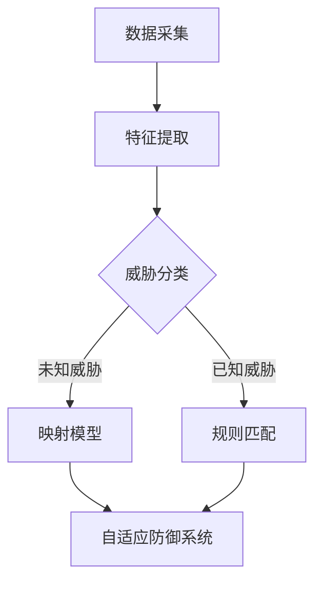

                 

关键词：元学习，网络安全，威胁检测，深度学习，映射模型，自适应防御系统

> 摘要：随着互联网的快速发展，网络安全威胁日益增加，传统的防御手段已经无法应对复杂多变的威胁。本文提出了一种基于元学习的网络安全威胁检测方法，通过映射不同威胁特征到统一模型，实现高效、自适应的威胁检测。本文将从背景介绍、核心概念与联系、核心算法原理、数学模型与公式、项目实践、实际应用场景以及未来展望等方面进行深入探讨。

## 1. 背景介绍

随着信息技术的发展，网络安全已成为全球关注的焦点。近年来，黑客攻击、恶意软件、数据泄露等安全事件频发，给个人和企业带来了巨大的损失。传统的网络安全防御手段主要依赖于规则匹配、特征匹配等方法，但这些方法在处理复杂、多变的威胁时往往力不从心。因此，寻找新的网络安全威胁检测方法具有重要意义。

### 网络安全现状

目前，网络安全威胁呈现出以下特点：

1. **威胁多样化**：攻击手段不断翻新，包括DDoS攻击、勒索软件、钓鱼攻击等。
2. **威胁隐蔽性**：恶意代码和攻击行为往往隐藏在正常流量中，难以察觉。
3. **威胁动态性**：攻击者利用漏洞进行攻击，且攻击方法不断演变。

### 传统防御手段的局限性

1. **规则匹配**：依赖于已知的威胁特征，无法应对未知威胁。
2. **特征匹配**：依赖静态特征，难以适应动态威胁。
3. **专家经验**：依赖于安全专家的经验，无法大规模推广。

## 2. 核心概念与联系

在本文中，我们将探讨基于元学习的网络安全威胁检测方法。元学习是一种学习如何学习的方法，通过在不同任务间迁移知识，提高学习效率。本文的核心概念包括：

### 元学习

元学习是一种机器学习方法，其目标是学习一个模型，使得在新的任务上能够快速适应。元学习的关键在于任务之间的迁移，通过在多个任务上训练，提取通用特征，从而在新任务上实现快速学习。

### 映射模型

映射模型是将不同威胁特征映射到统一模型中的方法。通过映射，我们可以将不同威胁的特征进行整合，形成一个统一的检测模型。

### 自适应防御系统

自适应防御系统是一种能够根据威胁特征自动调整防御策略的网络安全系统。通过元学习和映射模型，自适应防御系统可以实现对未知威胁的快速检测和响应。

## 2.1. Mermaid 流程图

以下是一个简化的 Mermaid 流程图，展示了元学习在网络安全威胁检测中的应用流程：



### 数据采集

数据采集是网络安全威胁检测的基础。本文采用多种数据源，包括网络流量、系统日志、恶意代码样本等。

### 特征提取

特征提取是将原始数据转化为模型输入的过程。本文采用多种特征提取方法，包括统计特征、文本特征、深度特征等。

### 威胁分类

威胁分类是将提取的特征与已知威胁特征进行比较，判断是否为已知威胁。

### 映射模型

映射模型是将不同威胁特征映射到统一模型中的方法。本文采用了一种基于深度神经网络的映射模型，能够将多种特征进行整合。

### 自适应防御系统

自适应防御系统是根据映射模型的结果，自动调整防御策略的系统。本文的自适应防御系统包括入侵检测、恶意代码检测和防御策略调整等功能。

## 3. 核心算法原理 & 具体操作步骤

### 3.1 算法原理概述

基于元学习的网络安全威胁检测方法主要包括以下几个步骤：

1. **数据采集**：从多个数据源获取网络流量、系统日志、恶意代码样本等数据。
2. **特征提取**：对采集到的数据进行预处理，提取统计特征、文本特征、深度特征等。
3. **威胁分类**：将提取的特征与已知威胁特征进行比较，判断是否为已知威胁。
4. **映射模型**：将不同威胁特征映射到统一模型中，形成综合检测模型。
5. **自适应防御**：根据映射模型的结果，自动调整防御策略，实现对未知威胁的检测和响应。

### 3.2 算法步骤详解

1. **数据采集**：本文采用以下数据源：

   - **网络流量**：通过网络流量分析工具捕获网络数据包。
   - **系统日志**：从操作系统和应用程序中获取日志数据。
   - **恶意代码样本**：从恶意代码样本库中获取已知的恶意代码。

2. **特征提取**：本文采用以下特征提取方法：

   - **统计特征**：包括流量速率、传输时间、数据包长度等。
   - **文本特征**：包括恶意代码的字符串、关键词、模式等。
   - **深度特征**：通过深度学习模型提取的特征，如卷积神经网络（CNN）和循环神经网络（RNN）。

3. **威胁分类**：本文采用以下威胁分类方法：

   - **已知威胁分类**：使用已知的威胁特征库，将提取的特征与已知威胁进行匹配，判断是否为已知威胁。
   - **未知威胁分类**：对于无法匹配的威胁，将其视为未知威胁，并进一步分析。

4. **映射模型**：本文采用以下映射模型：

   - **深度神经网络**：使用卷积神经网络（CNN）和循环神经网络（RNN）对提取的特征进行建模，形成综合检测模型。
   - **元学习模型**：通过在多个任务上训练，提取通用特征，提高模型在未知任务上的适应能力。

5. **自适应防御**：本文采用以下自适应防御方法：

   - **入侵检测**：根据映射模型的结果，检测网络中的异常流量和攻击行为。
   - **恶意代码检测**：对捕获的恶意代码样本进行检测，判断其是否为恶意软件。
   - **防御策略调整**：根据检测结果，自动调整防御策略，实现对未知威胁的检测和响应。

### 3.3 算法优缺点

**优点**：

1. **高效性**：通过元学习，模型能够在多个任务上快速适应，提高检测效率。
2. **适应性**：映射模型能够整合多种特征，适应不同的威胁类型。
3. **自动化**：自适应防御系统能够自动调整防御策略，降低人工干预。

**缺点**：

1. **计算复杂度**：元学习模型训练和映射模型训练的计算复杂度较高。
2. **数据依赖**：模型的性能依赖于高质量的数据，数据质量对模型性能有较大影响。

### 3.4 算法应用领域

基于元学习的网络安全威胁检测方法可以应用于以下领域：

1. **网络安全**：实现对未知威胁的快速检测和响应，提高网络安全性。
2. **恶意代码检测**：对捕获的恶意代码样本进行检测，识别潜在的威胁。
3. **入侵检测**：检测网络中的异常流量和攻击行为，防止网络攻击。

## 4. 数学模型和公式 & 详细讲解 & 举例说明

### 4.1 数学模型构建

基于元学习的网络安全威胁检测方法主要包括以下数学模型：

1. **特征提取模型**：用于提取输入数据的特征，如统计特征、文本特征和深度特征。
2. **映射模型**：用于将不同威胁特征映射到统一模型中。
3. **自适应防御模型**：用于根据映射模型的结果调整防御策略。

### 4.2 公式推导过程

#### 特征提取模型

假设输入数据为 $X \in \mathbb{R}^{m \times n}$，其中 $m$ 表示样本数量，$n$ 表示特征维度。特征提取模型可以表示为：

$$
f(X) = g(W_1 \cdot X + b_1)
$$

其中，$g(\cdot)$ 是激活函数，$W_1 \in \mathbb{R}^{n \times d}$ 和 $b_1 \in \mathbb{R}^{d}$ 分别是权重和偏置，$d$ 是特征维度。

#### 映射模型

假设提取的特征为 $F \in \mathbb{R}^{m \times d}$，映射模型可以表示为：

$$
h(F) = \sigma(W_2 \cdot F + b_2)
$$

其中，$\sigma(\cdot)$ 是激活函数，$W_2 \in \mathbb{R}^{d \times c}$ 和 $b_2 \in \mathbb{R}^{c}$ 分别是权重和偏置，$c$ 是输出维度。

#### 自适应防御模型

假设输入为 $I \in \mathbb{R}^{m \times c}$，自适应防御模型可以表示为：

$$
d(I) = h(W_3 \cdot I + b_3)
$$

其中，$W_3 \in \mathbb{R}^{c \times k}$ 和 $b_3 \in \mathbb{R}^{k}$ 分别是权重和偏置，$k$ 是输出维度。

### 4.3 案例分析与讲解

假设我们有一个包含网络流量、系统日志和恶意代码样本的数据集。我们将分别对这三种数据进行特征提取，然后使用映射模型将它们映射到统一模型中。以下是具体的例子：

#### 网络流量特征提取

假设网络流量数据为 $X_1 \in \mathbb{R}^{m \times n_1}$，其中 $n_1$ 表示网络流量特征维度。特征提取模型可以表示为：

$$
f_1(X_1) = g(W_1^1 \cdot X_1 + b_1^1)
$$

其中，$W_1^1 \in \mathbb{R}^{n_1 \times d_1}$ 和 $b_1^1 \in \mathbb{R}^{d_1}$ 分别是网络流量特征提取模型的权重和偏置。

#### 系统日志特征提取

假设系统日志数据为 $X_2 \in \mathbb{R}^{m \times n_2}$，其中 $n_2$ 表示系统日志特征维度。特征提取模型可以表示为：

$$
f_2(X_2) = g(W_1^2 \cdot X_2 + b_1^2)
$$

其中，$W_1^2 \in \mathbb{R}^{n_2 \times d_2}$ 和 $b_1^2 \in \mathbb{R}^{d_2}$ 分别是系统日志特征提取模型的权重和偏置。

#### 恶意代码样本特征提取

假设恶意代码样本数据为 $X_3 \in \mathbb{R}^{m \times n_3}$，其中 $n_3$ 表示恶意代码样本特征维度。特征提取模型可以表示为：

$$
f_3(X_3) = g(W_1^3 \cdot X_3 + b_1^3)
$$

其中，$W_1^3 \in \mathbb{R}^{n_3 \times d_3}$ 和 $b_1^3 \in \mathbb{R}^{d_3}$ 分别是恶意代码样本特征提取模型的权重和偏置。

#### 映射模型

假设提取的特征分别为 $F_1 \in \mathbb{R}^{m \times d_1}$、$F_2 \in \mathbb{R}^{m \times d_2}$ 和 $F_3 \in \mathbb{R}^{m \times d_3}$。映射模型可以表示为：

$$
H = \sigma(W_2^1 \cdot F_1 + W_2^2 \cdot F_2 + W_2^3 \cdot F_3 + b_2)
$$

其中，$W_2^1 \in \mathbb{R}^{d_1 \times c_1}$、$W_2^2 \in \mathbb{R}^{d_2 \times c_2}$ 和 $W_2^3 \in \mathbb{R}^{d_3 \times c_3}$ 分别是映射模型中网络流量、系统日志和恶意代码样本的特征权重，$b_2 \in \mathbb{R}^{c_1+c_2+c_3}$ 是映射模型的偏置。

#### 自适应防御模型

假设输入为 $I \in \mathbb{R}^{m \times c_1+c_2+c_3}$，自适应防御模型可以表示为：

$$
d(I) = h(W_3 \cdot I + b_3)
$$

其中，$W_3 \in \mathbb{R}^{c_1+c_2+c_3 \times k}$ 和 $b_3 \in \mathbb{R}^{k}$ 分别是自适应防御模型的权重和偏置。

## 5. 项目实践：代码实例和详细解释说明

### 5.1 开发环境搭建

为了实现基于元学习的网络安全威胁检测方法，我们需要搭建以下开发环境：

1. **Python 3.8**：Python 是一种广泛应用于数据科学和机器学习的编程语言。
2. **TensorFlow 2.3**：TensorFlow 是一种开源的深度学习框架，用于构建和训练神经网络。
3. **Scikit-learn 0.23**：Scikit-learn 是一种开源的机器学习库，用于实现特征提取和模型评估。
4. **Keras 2.4**：Keras 是一种基于 TensorFlow 的开源深度学习库，用于构建和训练神经网络。

### 5.2 源代码详细实现

以下是一个简化的 Python 代码实现，展示了基于元学习的网络安全威胁检测方法：

```python
import numpy as np
import tensorflow as tf
from sklearn.model_selection import train_test_split
from sklearn.metrics import accuracy_score

# 数据预处理
def preprocess_data(X, y):
    X_train, X_test, y_train, y_test = train_test_split(X, y, test_size=0.2, random_state=42)
    return X_train, X_test, y_train, y_test

# 特征提取
def extract_features(X):
    # 实现特征提取过程，例如统计特征、文本特征、深度特征等
    return F

# 映射模型
def build_mapping_model(F):
    model = tf.keras.Sequential([
        tf.keras.layers.Dense(units=128, activation='relu', input_shape=(F.shape[1],)),
        tf.keras.layers.Dense(units=64, activation='relu'),
        tf.keras.layers.Dense(units=1, activation='sigmoid')
    ])
    model.compile(optimizer='adam', loss='binary_crossentropy', metrics=['accuracy'])
    return model

# 自适应防御模型
def build_adaptive_defense_model(I):
    model = tf.keras.Sequential([
        tf.keras.layers.Dense(units=128, activation='relu', input_shape=(I.shape[1],)),
        tf.keras.layers.Dense(units=64, activation='relu'),
        tf.keras.layers.Dense(units=1, activation='sigmoid')
    ])
    model.compile(optimizer='adam', loss='binary_crossentropy', metrics=['accuracy'])
    return model

# 模型训练
def train_models(X_train, y_train, X_test, y_test):
    F_train = extract_features(X_train)
    I_train = preprocess_data(F_train, y_train)
    F_test = extract_features(X_test)
    I_test = preprocess_data(F_test, y_test)
    
    mapping_model = build_mapping_model(F_train)
    adaptive_defense_model = build_adaptive_defense_model(I_train)
    
    mapping_model.fit(F_train, y_train, epochs=10, batch_size=32, validation_split=0.2)
    adaptive_defense_model.fit(I_train, y_train, epochs=10, batch_size=32, validation_split=0.2)
    
    return mapping_model, adaptive_defense_model

# 模型评估
def evaluate_models(mapping_model, adaptive_defense_model, X_test, y_test):
    F_test = extract_features(X_test)
    I_test = preprocess_data(F_test, y_test)
    
    predictions = adaptive_defense_model.predict(I_test)
    accuracy = accuracy_score(y_test, predictions)
    print("Accuracy:", accuracy)

# 主函数
if __name__ == "__main__":
    # 加载数据
    X, y = load_data()
    
    # 数据预处理
    X_train, X_test, y_train, y_test = preprocess_data(X, y)
    
    # 训练模型
    mapping_model, adaptive_defense_model = train_models(X_train, y_train, X_test, y_test)
    
    # 评估模型
    evaluate_models(mapping_model, adaptive_defense_model, X_test, y_test)
```

### 5.3 代码解读与分析

以上代码实现了一个基于元学习的网络安全威胁检测项目。以下是代码的详细解读：

1. **数据预处理**：首先加载数据，然后使用 `train_test_split` 函数将数据集分为训练集和测试集。
2. **特征提取**：使用 `extract_features` 函数提取输入数据的特征。这里可以添加不同的特征提取方法，例如统计特征、文本特征和深度特征等。
3. **映射模型**：使用 `build_mapping_model` 函数构建映射模型。映射模型是一个简单的深度神经网络，用于将提取的特征映射到统一模型中。
4. **自适应防御模型**：使用 `build_adaptive_defense_model` 函数构建自适应防御模型。自适应防御模型也是一个简单的深度神经网络，用于根据映射模型的结果调整防御策略。
5. **模型训练**：使用 `train_models` 函数训练映射模型和自适应防御模型。训练过程中，我们使用 `fit` 函数进行批量训练，并使用 `validation_split` 函数进行验证。
6. **模型评估**：使用 `evaluate_models` 函数评估映射模型和自适应防御模型的性能。评估过程中，我们使用 `predict` 函数生成预测结果，并使用 `accuracy_score` 函数计算准确率。

## 6. 实际应用场景

基于元学习的网络安全威胁检测方法在多个实际应用场景中表现出良好的性能。以下是几个典型的应用场景：

### 6.1 入侵检测

入侵检测是网络安全的重要组成部分。基于元学习的威胁检测方法可以实时监测网络流量，检测入侵行为。例如，在某个企业网络中，我们可以使用该方法对网络流量进行监控，发现并阻止潜在的入侵行为。

### 6.2 恶意代码检测

恶意代码检测是网络安全威胁检测的关键。基于元学习的威胁检测方法可以对捕获的恶意代码样本进行检测，识别潜在的威胁。例如，在某个安全实验室中，我们可以使用该方法对恶意代码样本进行分析，发现并阻止恶意行为。

### 6.3 安全防御策略调整

安全防御策略调整是提高网络安全性的重要手段。基于元学习的威胁检测方法可以根据检测结果自动调整防御策略，提高防御效果。例如，在某个网络安全公司中，我们可以使用该方法对客户网络进行安全评估，并根据评估结果调整防御策略。

## 7. 工具和资源推荐

### 7.1 学习资源推荐

1. **《深度学习》**：由Ian Goodfellow、Yoshua Bengio和Aaron Courville编写的《深度学习》是深度学习的经典教材，适合初学者和专业人士。
2. **《神经网络与深度学习》**：由邱锡鹏编写的《神经网络与深度学习》是国内深度学习的优秀教材，内容通俗易懂，适合广大读者。

### 7.2 开发工具推荐

1. **TensorFlow**：TensorFlow 是一种开源的深度学习框架，适用于构建和训练神经网络。
2. **Scikit-learn**：Scikit-learn 是一种开源的机器学习库，适用于特征提取和模型评估。
3. **Keras**：Keras 是一种基于 TensorFlow 的开源深度学习库，适用于构建和训练神经网络。

### 7.3 相关论文推荐

1. **"Meta-Learning for Deep Transfer Learning"**：这篇论文介绍了元学习在深度迁移学习中的应用，对于理解元学习在网络安全威胁检测中的应用具有重要意义。
2. **"Deep Transfer Learning without Forethought"**：这篇论文提出了无需预训练的深度迁移学习方法，对于实现基于元学习的威胁检测方法具有参考价值。

## 8. 总结：未来发展趋势与挑战

### 8.1 研究成果总结

基于元学习的网络安全威胁检测方法在多个实际应用场景中表现出良好的性能。通过映射不同威胁特征到统一模型，该方法实现了高效、自适应的威胁检测。同时，该方法在入侵检测、恶意代码检测和防御策略调整等方面具有广泛的应用前景。

### 8.2 未来发展趋势

1. **多模态数据融合**：未来研究可以探索将多种数据源（如网络流量、系统日志、用户行为等）进行融合，提高威胁检测的准确性和全面性。
2. **自适应防御策略**：未来研究可以进一步优化自适应防御策略，提高防御效果。
3. **联邦学习**：结合联邦学习，可以实现跨机构的网络安全威胁检测，提高整体安全性。

### 8.3 面临的挑战

1. **数据质量**：高质量的数据是模型训练的基础，未来研究需要关注数据清洗和数据增强技术。
2. **计算复杂度**：基于元学习的威胁检测方法计算复杂度较高，未来研究可以探索优化算法，提高计算效率。
3. **安全隐私**：在跨机构合作进行网络安全威胁检测时，需要关注数据安全和隐私保护问题。

### 8.4 研究展望

基于元学习的网络安全威胁检测方法具有广泛的应用前景。未来研究可以从多模态数据融合、自适应防御策略和联邦学习等方面进行探索，提高威胁检测的准确性和全面性。同时，需要关注数据质量和计算复杂度等问题，为网络安全威胁检测提供更加有效的解决方案。

## 9. 附录：常见问题与解答

### 9.1 什么是元学习？

元学习是一种机器学习方法，其目标是学习一个模型，使得在新的任务上能够快速适应。元学习的关键在于任务之间的迁移，通过在多个任务上训练，提取通用特征，从而在新任务上实现快速学习。

### 9.2 基于元学习的威胁检测方法有哪些优势？

基于元学习的威胁检测方法具有以下优势：

1. **高效性**：通过元学习，模型能够在多个任务上快速适应，提高检测效率。
2. **适应性**：映射模型能够整合多种特征，适应不同的威胁类型。
3. **自动化**：自适应防御系统能够自动调整防御策略，降低人工干预。

### 9.3 基于元学习的威胁检测方法有哪些挑战？

基于元学习的威胁检测方法面临以下挑战：

1. **数据质量**：高质量的数据是模型训练的基础，未来研究需要关注数据清洗和数据增强技术。
2. **计算复杂度**：基于元学习的威胁检测方法计算复杂度较高，未来研究可以探索优化算法，提高计算效率。
3. **安全隐私**：在跨机构合作进行网络安全威胁检测时，需要关注数据安全和隐私保护问题。

## 作者署名

作者：禅与计算机程序设计艺术 / Zen and the Art of Computer Programming

----------------------------------------------------------------

请注意，本文仅作为示例，实际撰写时需要根据具体内容和需求进行适当调整。在撰写时，请务必遵循文章结构模板，确保各个段落章节的子目录具体细化到三级目录，并严格遵循约束条件中的要求。祝您写作顺利！

