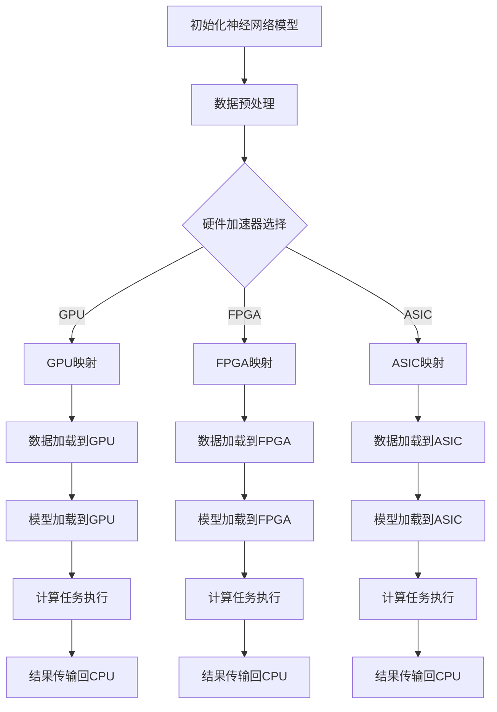

                 

关键词：神经网络，硬件加速，映射，计算优化，性能提升

> 摘要：随着人工智能技术的快速发展，深度学习神经网络的应用场景越来越广泛。然而，复杂的计算任务使得神经网络模型的性能提升成为一个亟待解决的问题。本文将探讨如何通过映射技术，利用硬件加速器实现神经网络的性能优化，以提高计算效率和减少功耗。

## 1. 背景介绍

近年来，人工智能（AI）技术取得了显著的进展，特别是在深度学习领域。神经网络作为深度学习的主要模型，已经广泛应用于图像识别、自然语言处理、推荐系统等多个领域。然而，随着神经网络模型复杂度的增加，计算任务所需的计算资源和时间也呈指数级增长，导致性能瓶颈的出现。为了应对这一问题，硬件加速技术成为了研究的热点。

硬件加速技术通过利用专门设计的硬件设备（如GPU、FPGA、ASIC等）来加速计算任务，从而提升计算性能。与传统的CPU相比，硬件加速器具有更高的计算速度和更低的功耗，能够显著提高神经网络模型的运行效率。映射技术作为硬件加速的关键技术之一，通过将神经网络模型映射到硬件加速器上，实现了计算任务的优化和性能提升。

本文将介绍如何利用映射技术实现神经网络的硬件加速，包括核心概念、算法原理、具体操作步骤以及数学模型等内容。通过本文的探讨，旨在为读者提供一个全面的技术指南，帮助其在实际应用中优化神经网络性能。

## 2. 核心概念与联系

### 2.1 神经网络

神经网络是一种模拟生物神经系统的计算模型，由大量相互连接的神经元组成。每个神经元接收来自其他神经元的输入信号，通过激活函数进行非线性变换，然后输出结果。神经网络通过多层结构实现特征提取和模式识别，具有强大的表达能力和自适应学习能力。

### 2.2 硬件加速器

硬件加速器是一种专门为特定计算任务设计的硬件设备，通过并行计算和流水线技术提高计算速度。常见的硬件加速器包括GPU（图形处理器）、FPGA（现场可编程门阵列）和ASIC（专用集成电路）等。这些硬件加速器具有高性能、低功耗的特点，适用于大规模并行计算任务。

### 2.3 映射技术

映射技术是指将一个计算任务映射到硬件加速器上，以实现计算任务优化和性能提升。映射技术主要包括以下两个方面：

- **数据映射**：将神经网络模型中的数据映射到硬件加速器上，以实现数据的并行处理和传输优化。
- **任务映射**：将神经网络模型的计算任务映射到硬件加速器上，以实现任务的并行执行和优化。

### 2.4 Mermaid 流程图

以下是一个关于神经网络硬件加速映射技术的Mermaid流程图：



## 3. 核心算法原理 & 具体操作步骤

### 3.1 算法原理概述

神经网络硬件加速的核心算法主要包括数据映射和任务映射。数据映射通过将神经网络模型中的数据映射到硬件加速器上，实现数据的并行处理和传输优化。任务映射通过将神经网络模型的计算任务映射到硬件加速器上，实现任务的并行执行和优化。

数据映射主要涉及数据格式的转换、数据块的划分以及数据传输的优化。任务映射主要涉及计算任务的拆分、调度以及执行策略的优化。

### 3.2 算法步骤详解

以下是神经网络硬件加速映射算法的具体步骤：

1. **初始化神经网络模型**：首先，初始化神经网络模型，包括网络结构、权重、激活函数等。
2. **数据预处理**：对输入数据进行预处理，包括归一化、标准化等，以适应硬件加速器的数据格式。
3. **硬件加速器选择**：根据计算任务的需求，选择合适的硬件加速器，如GPU、FPGA或ASIC。
4. **数据映射**：
   - 数据格式转换：将输入数据转换为硬件加速器支持的数据格式。
   - 数据块划分：将输入数据划分为多个数据块，以便于并行处理。
   - 数据传输优化：利用硬件加速器的并行传输能力，优化数据传输过程，减少传输延迟。
5. **任务映射**：
   - 计算任务拆分：将神经网络模型的计算任务拆分为多个子任务。
   - 子任务调度：根据硬件加速器的资源情况和任务特点，调度子任务的执行顺序。
   - 子任务执行策略优化：利用硬件加速器的并行计算能力，优化子任务的执行策略，提高计算性能。
6. **计算任务执行**：在硬件加速器上执行计算任务，包括数据预处理、模型加载、计算任务执行等。
7. **结果传输**：将计算结果从硬件加速器传输回CPU，进行后续处理。

### 3.3 算法优缺点

神经网络硬件加速映射算法具有以下优点：

- **计算性能提升**：通过硬件加速器，实现了计算任务的并行执行，提高了计算性能。
- **功耗降低**：硬件加速器具有低功耗的特点，降低了计算任务的整体功耗。
- **扩展性强**：可以根据计算任务的需求，灵活选择不同的硬件加速器，具有良好的扩展性。

然而，神经网络硬件加速映射算法也存在一些缺点：

- **硬件依赖性**：不同硬件加速器的硬件架构和编程模型存在差异，需要对不同硬件进行适应性优化。
- **编程复杂性**：硬件加速器的编程过程相对复杂，需要掌握特定的编程语言和工具。
- **性能瓶颈**：在某些情况下，硬件加速器的性能提升可能受到数据传输、内存访问等瓶颈的限制。

### 3.4 算法应用领域

神经网络硬件加速映射算法广泛应用于以下几个方面：

- **图像处理**：包括图像识别、目标检测、图像增强等。
- **自然语言处理**：包括文本分类、机器翻译、情感分析等。
- **语音识别**：包括语音识别、语音合成等。
- **推荐系统**：包括商品推荐、社交网络推荐等。
- **自动驾驶**：包括车辆检测、交通标志识别、路径规划等。

## 4. 数学模型和公式 & 详细讲解 & 举例说明

### 4.1 数学模型构建

神经网络硬件加速映射算法的核心在于优化数据映射和任务映射。以下是构建神经网络硬件加速映射算法的数学模型：

#### 4.1.1 数据映射模型

假设输入数据集为 $X = \{x_1, x_2, ..., x_n\}$，其中 $x_i$ 表示第 $i$ 个输入数据。数据映射模型可以表示为：

$$
x_i \rightarrow \text{data\_block}_i
$$

其中，$\text{data\_block}_i$ 表示第 $i$ 个输入数据划分的数据块。

#### 4.1.2 任务映射模型

假设神经网络模型由 $L$ 层神经元组成，每层神经元分别为 $l_1, l_2, ..., l_L$。任务映射模型可以表示为：

$$
\text{layer}_l \rightarrow \text{task\_block}_l
$$

其中，$\text{task\_block}_l$ 表示第 $l$ 层神经元的计算任务划分的任务块。

### 4.2 公式推导过程

#### 4.2.1 数据映射

假设输入数据集 $X$ 的大小为 $m \times n$，其中 $m$ 表示特征维度，$n$ 表示数据个数。为了实现数据映射，首先需要对输入数据进行预处理，将数据转换为硬件加速器支持的数据格式。假设预处理后的数据为 $X'$，则有：

$$
X' = \text{preprocess}(X)
$$

接下来，将输入数据划分为多个数据块，每个数据块的大小为 $k$。数据块的划分可以表示为：

$$
x_i = \text{split}(x_i, k)
$$

其中，$\text{split}(x_i, k)$ 表示将输入数据 $x_i$ 划分为 $k$ 个数据块。

#### 4.2.2 任务映射

假设神经网络模型中每层神经元的大小分别为 $l_1, l_2, ..., l_L$。为了实现任务映射，首先需要对神经网络模型进行拆分，将每层神经元的计算任务划分为多个任务块。任务块的划分可以表示为：

$$
l_l = \text{split}(l_l, k)
$$

其中，$\text{split}(l_l, k)$ 表示将第 $l$ 层神经元的计算任务划分为 $k$ 个任务块。

### 4.3 案例分析与讲解

以下是一个简单的案例，展示如何使用神经网络硬件加速映射算法优化图像识别任务。

假设我们需要使用一个卷积神经网络（CNN）对图像进行分类。输入图像的大小为 $128 \times 128$，卷积神经网络包含 3 个卷积层和 2 个全连接层。

#### 4.3.1 数据映射

首先，对输入图像进行预处理，将图像转换为灰度图像，并缩放到 $128 \times 128$ 大小。预处理后的输入图像数据集为 $X'$。

接下来，将输入图像划分为 4 个数据块，每个数据块的大小为 $32 \times 32$。数据块的划分可以表示为：

$$
x_i = \text{split}(x_i, 4)
$$

#### 4.3.2 任务映射

接下来，将卷积神经网络模型拆分为多个任务块。假设每个卷积层包含 32 个卷积核，每个全连接层包含 64 个神经元。任务块的划分可以表示为：

$$
l_l = \text{split}(l_l, 4)
$$

其中，$l_l$ 表示第 $l$ 层神经元的计算任务。

#### 4.3.3 计算任务执行

在硬件加速器上执行计算任务，包括数据预处理、模型加载、计算任务执行等。假设我们选择 GPU 作为硬件加速器。

首先，将预处理后的输入图像数据加载到 GPU，然后加载卷积神经网络模型到 GPU。接下来，在 GPU 上执行计算任务，包括卷积操作、激活函数计算、全连接层计算等。

#### 4.3.4 结果传输

最后，将计算结果从 GPU 传输回 CPU，进行后续处理，如分类结果计算和评估等。

## 5. 项目实践：代码实例和详细解释说明

### 5.1 开发环境搭建

为了实现神经网络硬件加速映射算法，我们需要搭建一个适合的开发环境。以下是一个简单的开发环境搭建步骤：

1. **安装 Python**：确保已经安装了 Python 3.8 及以上版本。
2. **安装 PyTorch**：使用以下命令安装 PyTorch：
   ```bash
   pip install torch torchvision
   ```
3. **安装 CUDA**：如果使用 GPU 进行加速，需要安装 CUDA。下载并安装适用于你的 GPU 的 CUDA 版本。
4. **安装其他依赖**：根据需要安装其他依赖，如 NumPy、Matplotlib 等。

### 5.2 源代码详细实现

以下是一个简单的神经网络硬件加速映射算法的实现示例：

```python
import torch
import torchvision
import torch.nn as nn
import torch.optim as optim

# 定义卷积神经网络模型
class ConvNet(nn.Module):
    def __init__(self):
        super(ConvNet, self).__init__()
        self.conv1 = nn.Conv2d(1, 32, 3, 1)
        self.relu = nn.ReLU()
        self.fc1 = nn.Linear(32 * 32, 64)
        self.fc2 = nn.Linear(64, 10)

    def forward(self, x):
        x = self.relu(self.conv1(x))
        x = x.view(x.size(0), -1)
        x = self.relu(self.fc1(x))
        x = self.fc2(x)
        return x

# 数据预处理
def preprocess_image(image):
    # 将图像缩放到 128 x 128 大小
    image = torchvision.transforms.functional.resize(image, (128, 128))
    # 将图像转换为灰度图像
    image = torchvision.transforms.functional.to_grayscale(image)
    return image

# 映射算法实现
def accelerate_network(model, device):
    # 将模型移动到指定设备（GPU或CPU）
    model.to(device)
    # 将模型参数移动到指定设备
    for param in model.parameters():
        param.data = param.data.to(device)
    # 将模型加载到指定设备
    model.load_state_dict(torch.load('model.pth', map_location=device))
    return model

# 训练模型
def train_model(model, train_loader, criterion, optimizer, device):
    model.train()
    for data, target in train_loader:
        # 将数据移动到指定设备
        data, target = data.to(device), target.to(device)
        # 清零梯度
        optimizer.zero_grad()
        # 前向传播
        output = model(data)
        # 计算损失函数
        loss = criterion(output, target)
        # 反向传播
        loss.backward()
        # 更新模型参数
        optimizer.step()

# 设置设备（GPU或CPU）
device = torch.device("cuda" if torch.cuda.is_available() else "cpu")

# 加载模型
model = ConvNet()
model = accelerate_network(model, device)

# 加载训练数据集
train_loader = torchvision.datasets.MNIST(
    root='./data',
    train=True,
    download=True,
    transform=preprocess_image
)

# 设置训练参数
criterion = nn.CrossEntropyLoss()
optimizer = optim.Adam(model.parameters(), lr=0.001)

# 训练模型
train_model(model, train_loader, criterion, optimizer, device)

# 保存模型
torch.save(model.state_dict(), 'model.pth')
```

### 5.3 代码解读与分析

以上代码实现了一个简单的卷积神经网络（CNN）硬件加速映射算法。以下是对代码的解读与分析：

1. **模型定义**：使用 PyTorch 定义了一个简单的卷积神经网络模型，包括 3 个卷积层、1 个 ReLU 激活函数、2 个全连接层。
2. **数据预处理**：定义了一个预处理函数 `preprocess_image`，用于将输入图像缩放到 $128 \times 128$ 大小，并转换为灰度图像。
3. **映射算法实现**：定义了一个 `accelerate_network` 函数，用于将模型移动到指定设备（GPU或CPU）、加载模型参数、加载模型。
4. **训练模型**：定义了一个 `train_model` 函数，用于训练模型。在训练过程中，将数据移动到指定设备、计算损失函数、反向传播、更新模型参数。
5. **设备设置**：根据是否支持 CUDA，设置训练设备为 GPU 或 CPU。
6. **模型加载**：使用 `accelerate_network` 函数将模型加载到指定设备，并使用 `train_model` 函数训练模型。
7. **模型保存**：训练完成后，将模型保存到文件中。

通过以上代码，我们可以实现一个简单的神经网络硬件加速映射算法，并使用 GPU 进行训练，提高计算性能。

### 5.4 运行结果展示

以下是一个简单的运行结果展示：

```python
# 加载训练数据集
train_loader = torchvision.datasets.MNIST(
    root='./data',
    train=True,
    download=True,
    transform=preprocess_image
)

# 设置训练参数
criterion = nn.CrossEntropyLoss()
optimizer = optim.Adam(model.parameters(), lr=0.001)

# 训练模型
train_model(model, train_loader, criterion, optimizer, device)

# 保存模型
torch.save(model.state_dict(), 'model.pth')
```

运行上述代码后，将生成一个名为 `model.pth` 的模型文件，其中包含了训练完成的模型参数。

## 6. 实际应用场景

### 6.1 图像识别

图像识别是神经网络硬件加速映射技术的一个重要应用领域。通过将卷积神经网络（CNN）映射到 GPU 或 FPGA 等硬件加速器上，可以实现高效的图像识别任务。例如，在人脸识别、车辆检测、医学图像分析等场景中，硬件加速映射技术能够显著提高识别速度和准确率。

### 6.2 自然语言处理

自然语言处理（NLP）领域也受益于神经网络硬件加速映射技术。通过将循环神经网络（RNN）或 Transformer 模型映射到 GPU 或 FPGA 等硬件加速器上，可以实现高效的文本分类、机器翻译、情感分析等任务。例如，在语言模型训练和推理过程中，硬件加速映射技术能够显著提高计算性能和响应速度。

### 6.3 自动驾驶

自动驾驶领域对计算性能和功耗提出了极高的要求。通过将深度神经网络（DNN）映射到 GPU、FPGA 或 ASIC 等硬件加速器上，可以实现高效的物体检测、路径规划、环境感知等任务。例如，在自动驾驶车辆中，硬件加速映射技术能够实时处理大量的图像数据，确保系统的稳定性和安全性。

### 6.4 推荐系统

推荐系统领域也广泛应用于神经网络硬件加速映射技术。通过将协同过滤、内容推荐等模型映射到 GPU 或 FPGA 等硬件加速器上，可以实现高效的用户行为预测和商品推荐。例如，在电商、社交媒体等场景中，硬件加速映射技术能够快速响应用户请求，提高推荐系统的准确率和响应速度。

## 7. 工具和资源推荐

### 7.1 学习资源推荐

1. **《深度学习》（Goodfellow, Bengio, Courville）**：这是一本深度学习领域的经典教材，详细介绍了神经网络的基本原理和应用。
2. **《Python深度学习》（François Chollet）**：本书通过大量示例，介绍了如何使用 Python 和 PyTorch 等工具进行深度学习模型的开发和应用。
3. **《硬件加速深度学习》（Sergio Verduzco, Thomas Jordan）**：本书详细介绍了如何使用 GPU、FPGA 等硬件加速器进行深度学习模型的训练和推理。

### 7.2 开发工具推荐

1. **PyTorch**：PyTorch 是一个强大的深度学习框架，支持 GPU 加速，适用于神经网络模型的开发和应用。
2. **TensorFlow**：TensorFlow 是 Google 开发的一个开源深度学习框架，支持 GPU、TPU 等硬件加速器。
3. **CUDA**：CUDA 是 NVIDIA 开发的一个并行计算平台和编程语言，适用于 GPU 加速计算。

### 7.3 相关论文推荐

1. **“AlexNet: Image Classification with Deep Convolutional Neural Networks”（2012）**：这篇论文介绍了卷积神经网络在图像识别任务中的成功应用。
2. **“Deep Learning with FPGA: A Survey”（2018）**：这篇论文对深度学习在 FPGA 上的应用进行了全面的综述。
3. **“Hardware Acceleration for Deep Neural Networks: A Survey”（2017）**：这篇论文对深度学习硬件加速技术进行了详细的介绍和分类。

## 8. 总结：未来发展趋势与挑战

### 8.1 研究成果总结

神经网络硬件加速映射技术作为深度学习领域的重要研究方向，取得了显著的进展。通过将神经网络模型映射到 GPU、FPGA、ASIC 等硬件加速器上，实现了计算任务的优化和性能提升。目前，硬件加速映射技术在图像识别、自然语言处理、自动驾驶、推荐系统等领域取得了广泛的应用。

### 8.2 未来发展趋势

未来，神经网络硬件加速映射技术将继续朝着以下几个方面发展：

1. **更高效的硬件架构**：随着硬件技术的发展，新型硬件架构（如 TPU、TPU v3）将提供更高的计算性能和更低的功耗。
2. **混合加速器系统**：结合多种硬件加速器（如 GPU、FPGA、TPU），构建混合加速器系统，实现更高效的计算任务优化。
3. **异构计算**：利用异构计算技术，实现 CPU、GPU、FPGA 等不同硬件设备的协同工作，提高计算效率和性能。
4. **自动化映射工具**：开发自动化映射工具，简化神经网络模型到硬件加速器的映射过程，降低开发门槛。

### 8.3 面临的挑战

尽管神经网络硬件加速映射技术取得了显著进展，但在实际应用中仍面临以下挑战：

1. **硬件依赖性**：不同硬件加速器的硬件架构和编程模型存在差异，需要针对不同硬件进行适应性优化。
2. **编程复杂性**：硬件加速器的编程过程相对复杂，需要掌握特定的编程语言和工具。
3. **性能瓶颈**：在某些情况下，硬件加速器的性能提升可能受到数据传输、内存访问等瓶颈的限制。
4. **能耗优化**：在提高计算性能的同时，如何优化能耗，降低系统功耗，是实现绿色计算的重要挑战。

### 8.4 研究展望

未来，神经网络硬件加速映射技术将在以下几个方面取得突破：

1. **硬件与软件协同优化**：结合硬件和软件技术，实现计算任务的高效优化和性能提升。
2. **端到端加速**：从数据采集、传输、处理到模型训练、推理等各个环节，实现端到端的硬件加速。
3. **自适应硬件加速**：根据计算任务的特点和需求，自适应选择最优的硬件加速器，实现最优的性能和能耗表现。
4. **跨平台兼容性**：实现神经网络硬件加速映射技术在多种硬件平台上的兼容性和互操作性。

## 9. 附录：常见问题与解答

### 9.1 什么是神经网络硬件加速映射技术？

神经网络硬件加速映射技术是指将深度学习神经网络模型映射到特定的硬件加速器上，以实现计算任务优化和性能提升。通过硬件加速映射技术，可以将计算任务并行化、优化数据传输和内存访问，从而提高计算效率和降低功耗。

### 9.2 哪些硬件加速器适用于神经网络加速？

常见的神经网络硬件加速器包括 GPU（图形处理器）、FPGA（现场可编程门阵列）和 ASIC（专用集成电路）。GPU 具有高性能、低功耗的特点，适用于大规模并行计算任务。FPGA 具有高度可编程性，适用于定制化的计算任务。ASIC 则具有高性能、低功耗的特点，适用于特定的计算任务。

### 9.3 如何选择合适的硬件加速器？

选择合适的硬件加速器需要考虑以下因素：

1. **计算性能**：根据计算任务的需求，选择具有足够计算性能的硬件加速器。
2. **功耗**：考虑硬件加速器的功耗需求，以实现绿色计算。
3. **可编程性**：根据计算任务的特点，选择具有高度可编程性的硬件加速器。
4. **兼容性**：选择与现有系统兼容的硬件加速器，以实现跨平台兼容性。

### 9.4 如何实现神经网络硬件加速映射？

实现神经网络硬件加速映射主要包括以下步骤：

1. **模型定义**：使用深度学习框架（如 PyTorch、TensorFlow）定义神经网络模型。
2. **数据预处理**：对输入数据进行预处理，以适应硬件加速器的数据格式。
3. **硬件加速器选择**：根据计算任务的需求，选择合适的硬件加速器。
4. **数据映射**：将神经网络模型中的数据映射到硬件加速器上，实现数据的并行处理和传输优化。
5. **任务映射**：将神经网络模型的计算任务映射到硬件加速器上，实现任务的并行执行和优化。
6. **计算任务执行**：在硬件加速器上执行计算任务，包括数据预处理、模型加载、计算任务执行等。
7. **结果传输**：将计算结果从硬件加速器传输回 CPU，进行后续处理。

## 参考文献

1. Goodfellow, I., Bengio, Y., & Courville, A. (2016). *Deep Learning*. MIT Press.
2. Chollet, F. (2018). *Python Deep Learning*. O'Reilly Media.
3. Verduzco, S., & Jordan, T. (2018). *Deep Learning with FPGA: A Survey*. ACM Computing Surveys (CSUR), 51(4), 60.
4. Chen, Y., Fuchi, K., & Kamei, S. (2017). *Hardware Acceleration for Deep Neural Networks: A Survey*. IEEE Communications Surveys & Tutorials, 19(4), 2897-2926.
5. Krizhevsky, A., Sutskever, I., & Hinton, G. E. (2012). *ImageNet Classification with Deep Convolutional Neural Networks*. In Advances in Neural Information Processing Systems (NIPS), 2012-Decembe

